# Chapter Dependency Graph

Direct prerequisites between chapters. Node IDs drop the hyphen (`fnd01` = chapter `fnd-01`) because Mermaid node IDs and hyphens don't mix reliably. This graph is generated from the prerequisite lists in [manifest.yaml](../manifest.yaml); if they ever disagree, the manifest wins.

```mermaid
graph TD
  subgraph M1[Module 1 · Foundations]
    fnd01[fnd-01 Landscape]
    fnd02[fnd-02 ML Refresher]
    fnd03[fnd-03 Embeddings]
    fnd04[fnd-04 Tokenization]
    fnd05[fnd-05 Transformer]
    fnd06[fnd-06 Pretraining]
    fnd07[fnd-07 Post-Training]
    fnd08[fnd-08 Sampling]
    fnd09[fnd-09 Capabilities & Limits]
  end

  subgraph M2[Module 2 · LLM APIs]
    api01[api-01 API Fundamentals]
    api02[api-02 Prompt Engineering]
    api03[api-03 Structured Outputs & Tools]
    api04[api-04 Multimodal]
    api05[api-05 Streaming/Caching/Batch]
    api06[api-06 Model Selection]
    api07[api-07 Local Inference]
  end

  subgraph M3[Module 3 · Retrieval]
    rag01[rag-01 Context Engineering]
    rag02[rag-02 Vector Search]
    rag03[rag-03 Vector DBs]
    rag04[rag-04 Chunking]
    rag05[rag-05 RAG Pipeline]
    rag06[rag-06 Advanced Retrieval]
    rag07[rag-07 RAG Evaluation]
    rag08[rag-08 RAG Frontiers]
  end

  subgraph M4[Module 4 · Agents]
    agt01[agt-01 Agent Fundamentals]
    agt02[agt-02 Tool Design]
    agt03[agt-03 Reasoning & Planning]
    agt04[agt-04 Memory & State]
    agt05[agt-05 MCP]
    agt06[agt-06 Multi-Agent]
    agt07[agt-07 Frameworks]
    agt08[agt-08 Computer Use]
    agt09[agt-09 Agent Reliability]
  end

  subgraph M5[Module 5 · Evaluation]
    evl01[evl-01 Eval Fundamentals]
    evl02[evl-02 Eval Datasets]
    evl03[evl-03 LLM-as-Judge]
    evl04[evl-04 Tracing & Observability]
    evl05[evl-05 Online Evaluation]
    evl06[evl-06 CI for LLM Apps]
  end

  subgraph M6[Module 6 · Production]
    prd01[prd-01 Architecture Patterns]
    prd02[prd-02 Inference & Serving]
    prd03[prd-03 Inference Optimization]
    prd04[prd-04 Reliability]
    prd05[prd-05 Cost Engineering]
    prd06[prd-06 Deployment & Infra]
  end

  subgraph M7[Module 7 · Safety & Security]
    sec01[sec-01 Prompt Injection]
    sec02[sec-02 Guardrails]
    sec03[sec-03 Privacy & Compliance]
    sec04[sec-04 Red-Teaming]
    sec05[sec-05 Alignment for Engineers]
  end

  subgraph M8[Module 8 · Fine-Tuning]
    ftn01[ftn-01 Customization Decision]
    ftn02[ftn-02 Fine-Tuning Methods]
    ftn03[ftn-03 Data for Fine-Tuning]
    ftn04[ftn-04 Fine-Tuning in Practice]
    ftn05[ftn-05 Preference Optimization & RL]
    ftn06[ftn-06 Distillation & SLMs]
  end

  subgraph M9[Module 9 · Frontier & Career]
    fro01[fro-01 Voice & Realtime]
    fro02[fro-02 Generative Media]
    fro03[fro-03 Edge & On-Device]
    fro04[fro-04 Staying Current]
    fro05[fro-05 Interviews & Portfolio]
  end

  %% Module 1 internal
  fnd02 --> fnd03
  fnd02 --> fnd04
  fnd03 --> fnd05
  fnd04 --> fnd05
  fnd05 --> fnd06
  fnd06 --> fnd07
  fnd05 --> fnd08
  fnd06 --> fnd09
  fnd08 --> fnd09

  %% Module 2
  fnd01 --> api01
  api01 --> api02
  fnd08 --> api02
  api02 --> api03
  api01 --> api04
  api01 --> api05
  api01 --> api06
  fnd09 --> api06
  api01 --> api07
  fnd05 --> api07

  %% Module 3
  api02 --> rag01
  fnd04 --> rag01
  fnd03 --> rag02
  rag02 --> rag03
  rag01 --> rag04
  rag03 --> rag05
  rag04 --> rag05
  rag05 --> rag06
  rag05 --> rag07
  evl01 --> rag07
  rag06 --> rag08

  %% Module 4
  api03 --> agt01
  agt01 --> agt02
  agt01 --> agt03
  fnd07 --> agt03
  agt01 --> agt04
  rag01 --> agt04
  agt02 --> agt05
  agt04 --> agt06
  agt01 --> agt07
  agt02 --> agt08
  api04 --> agt08
  agt01 --> agt09
  evl03 --> agt09

  %% Module 5
  api02 --> evl01
  evl01 --> evl02
  evl01 --> evl03
  api03 --> evl03
  evl01 --> evl04
  api01 --> evl04
  evl02 --> evl05
  evl04 --> evl05
  evl02 --> evl06
  evl03 --> evl06

  %% Module 6
  api05 --> prd01
  rag05 --> prd01
  fnd05 --> prd02
  api07 --> prd02
  prd02 --> prd03
  api05 --> prd04
  evl04 --> prd04
  api06 --> prd05
  prd01 --> prd05
  prd02 --> prd06

  %% Module 7
  agt01 --> sec01
  rag05 --> sec01
  sec01 --> sec02
  api01 --> sec03
  sec01 --> sec04
  evl02 --> sec04
  fnd07 --> sec05

  %% Module 8
  api02 --> ftn01
  rag05 --> ftn01
  fnd05 --> ftn02
  ftn01 --> ftn02
  ftn01 --> ftn03
  evl02 --> ftn03
  ftn02 --> ftn04
  ftn03 --> ftn04
  fnd07 --> ftn05
  ftn02 --> ftn05
  ftn02 --> ftn06
  api06 --> ftn06

  %% Module 9
  api04 --> fro01
  api05 --> fro01
  api04 --> fro02
  api07 --> fro03
  ftn06 --> fro03
  fnd01 --> fro04
  agt01 --> fro05
  rag05 --> fro05
  evl01 --> fro05
```

## Reading the graph

- **Trunk:** `fnd-02 → fnd-05` and `api-01 → api-03` unlock the majority of the repo.
- **Widest fan-out nodes:** `api-01`, `api-02`, `agt-01`, `rag-05`, `evl-01` — prioritize these; they gate the most downstream content.
- **No back-edges:** the graph is a DAG by construction. CI for the repo should topologically sort `manifest.yaml` and fail on cycles.
