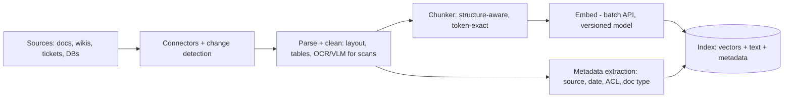
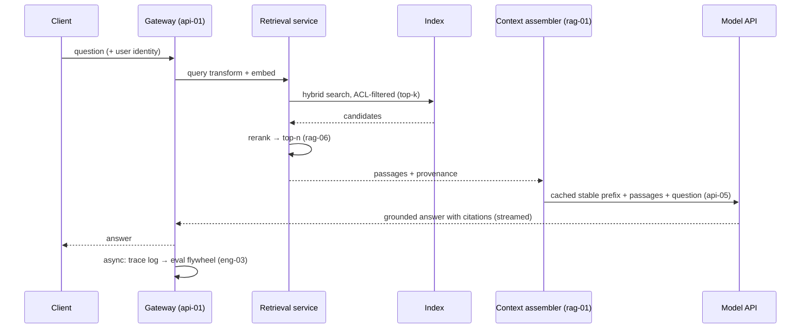

# Reference Architecture: RAG Pipeline

The blueprint for the most common production LLM system: grounding generation in retrieved private knowledge.[^lewis-rag] This doc specifies components, contracts, defaults, SLOs, and failure modes; the *mechanisms* live in the module 3 chapters cross-linked throughout. Use it as the starting sketch for design reviews and the checklist for auditing an existing system.

## The two-system view

The first architectural fact: **RAG is two systems sharing an index, not one pipeline.** The ingestion path is a batch data pipeline (throughput-shaped, eventually consistent, cheap to re-run); the query path is a latency-critical service (user-facing, cache-sensitive, SLO-bound). Designing them together — one codebase, one deploy, one scaling policy — is the root of most RAG operational pain. Separate them from day one.

*Ingestion path — a batch ETL system producing derived, versioned index data:*

*Query path — a latency-budgeted service from question to grounded, cited answer:*

## Component responsibilities and contracts

| Component | Owns | Contract with neighbors | Chapter |
|---|---|---|---|
| Connectors | Source auth, change detection, deletion propagation | Emits (doc, metadata, ACL, version) events | [rag-05](../modules/03-retrieval/rag-05-rag-pipeline.md) |
| Parser | Format → clean text + structure; loud failure on garbage | Never emits silently-truncated content | [api-04](../modules/02-llm-apis/api-04-multimodal.md) |
| Chunker | Boundary decisions, token-exact sizing, chunk-level metadata | Chunks carry doc ID, position, heading path | [rag-04](../modules/03-retrieval/rag-04-chunking.md) |
| Embedder | Model version pinning, batching, normalization | `embedding_model_version` on every vector | [fnd-03](../modules/01-foundations/fnd-03-embeddings.md) |
| Index | Vector + keyword + metadata storage; filtered search | Raw text is the system of record, index is rebuildable | [rag-03](../modules/03-retrieval/rag-03-vector-databases.md) |
| Retrieval service | Query transforms, hybrid search, reranking, ACL enforcement | Returns passages *with provenance*, never bare text | [rag-06](../modules/03-retrieval/rag-06-advanced-retrieval.md) |
| Context assembler | Budgets, placement, dedup, formatting, provenance labels | The rag-01 component, verbatim | [rag-01](../modules/03-retrieval/rag-01-context-engineering.md) |
| Generator | Grounded prompting, citation format, abstention path | Answers only from supplied context or says so | [api-02](../modules/02-llm-apis/api-02-prompt-engineering.md) |
| Eval loop | Retrieval metrics + groundedness, traced per request | Feeds eng-03's harness; every complaint becomes a case | [rag-07](../modules/03-retrieval/rag-07-rag-evaluation.md) |

Three contracts deserve emphasis because violating them causes the classic incidents. **Provenance flows end to end:** every passage carries source, date, and ACL from connector to citation — this is what makes answers auditable, permissions enforceable, and injection tractable ([sec-01](../modules/07-safety-security/sec-01-prompt-injection.md)). **ACL filtering happens at retrieval, not generation:** filter *before* the index returns candidates; a prompt instruction to "not use documents the user can't see" is not access control. **The index is derived data:** raw text + config must reproduce it entirely — embedding-model migrations (fnd-03's versioning problem) then become batch jobs.

## Design decisions and defaults

The decisions every RAG build faces, with the defaults that survive contact with production:

| Decision | Default | Escalate when | Chapter |
|---|---|---|---|
| Chunking | Structure-aware (headings/paragraphs), 300–800 tokens, token-exact | Tables/code need format-specific handling | rag-04 |
| Search | Hybrid (vector + keyword) from day one | Pure vector only for prototypes | rag-06 |
| Top-k → rerank | Retrieve 20–50, rerank to 3–8 in context | Skip reranker only under hard latency floors | rag-06 |
| Context budget | Assembler-enforced cap; best passages at region edges[^liu-lost-middle] | — | rag-01 |
| Embeddings | Provider/OSS model chosen by *your* retrieval eval, unit-normalized | Fine-tune embedder only after hybrid + rerank plateau | fnd-03 |
| Freshness | Incremental upsert on change events; full rebuild capability tested | Real-time upsert for fast-moving corpora | rag-05 |
| Grounding | Answer-from-context-only prompt + required citations + abstention path | Add post-hoc groundedness check for high stakes | rag-07 |
| Caching | Stable prefix (instructions/schemas) cached; per-user passages not | Semantic response cache only with staleness policy | api-05, eng-05 |
| Chunk enrichment | Prepend doc/section context to chunk text before embedding | — | rag-04[^anthropic-contextual] |

> **Volatile:** specific index technologies, embedding models, and reranker options churn quarterly — selection belongs to your [api-06](../modules/02-llm-apis/api-06-model-selection.md)-style bake-off. The decision *rows* above are stable.

## SLOs and capacity guidance

Starting-point targets for an interactive knowledge assistant (tune to product):

- **Latency:** P50 ≤ 2.5s / P99 ≤ 8s end-to-end, decomposed: embed+search ≤ 300ms, rerank ≤ 400ms, TTFT ≤ 1.5s (cache-dependent — api-05), decode dominated by answer length. Budget *per stage* and alert per stage; aggregate latency alerts hide the regressing component.
- **Freshness:** document-change-to-queryable ≤ 15 min incremental; full-rebuild runbook tested quarterly (it *will* be needed at embedding migration).
- **Quality floor:** retrieval recall@k ≥ 0.85 on the golden set; groundedness ≥ 0.95 on sampled traffic; abstention on out-of-corpus questions ≥ 0.9 (rag-07 defines the metrics).
- **Cost:** tracked per query, decomposed (embed / search / rerank / tokens) — the token line dominates; cache hit rate is its biggest lever (api-05).

## Failure map

Symptom → likely component → first diagnostic:

| Symptom | Suspect | First check |
|---|---|---|
| Confident wrong answers, plausible citations | Retrieval precision (noise in context) | Read the assembled context for 5 failures — is the right passage even there? |
| "I don't know" on answerable questions | Recall: chunking boundaries, query mismatch, ACL over-filter | Search the index directly for the known-good passage |
| Right passage retrieved, answer ignores it | Assembly placement (mid-context burial) or budget overflow | Per-region token logs; passage position audit[^liu-lost-middle] |
| Answers cite stale content | Freshness pipeline: change detection or deletion propagation | Index timestamp vs. source timestamp for the cited doc |
| Quality cliff after infra change | Embedding version mismatch (mixed index) | `embedding_model_version` distribution across the index |
| Cost/latency creep, flat traffic | Cache hit-rate drop or top-k inflation | api-05 cached-token dashboard; retrieval config diff |
| Sensitive data in answers | ACL filtering at wrong layer | Verify filter executes in the index query, not the prompt |

## Scaling path

Build in stages; each stage's exit criterion is measured, not felt:

1. **v0 (days):** single service, brute-force vector search over ≤100k chunks, top-5 into context, 30-case eval. *Exit when:* eval exists and recall is the known bottleneck.
2. **v1 (weeks):** split ingestion/query paths, hybrid search + reranker, assembler with budgets and provenance, tracing, golden-set CI gate (eng-03). Most products stop here, correctly.
3. **v2 (when metrics demand):** query routing and transforms, incremental-freshness hardening, semantic caching with staleness policy, per-collection index tuning, groundedness checks inline for high-stakes routes ([rag-08](../modules/03-retrieval/rag-08-rag-frontiers.md) for the frontier options).

The anti-pattern at every stage: adding v2 machinery to solve a v0 problem — most "advanced RAG" adoption happens before hybrid search and honest chunking were tried ([fnd-01](../modules/01-foundations/fnd-01-ai-engineering-landscape.md)'s premature-depth warning, RAG edition).

## Related chapters

| Chapter | What it explains |
|---|---|
| [rag-01](../modules/03-retrieval/rag-01-context-engineering.md) | The context assembler: budgets, placement, curation, compaction |
| [rag-02](../modules/03-retrieval/rag-02-vector-search.md) / [rag-03](../modules/03-retrieval/rag-03-vector-databases.md) | Vector search mechanics; index/store selection and operations |
| [rag-04](../modules/03-retrieval/rag-04-chunking.md) | Chunking strategy — the ingestion path's key decision |
| [rag-05](../modules/03-retrieval/rag-05-rag-pipeline.md) | The end-to-end pipeline and every failure point in the chain |
| [rag-06](../modules/03-retrieval/rag-06-advanced-retrieval.md) | Hybrid search, reranking, query transforms |
| [rag-07](../modules/03-retrieval/rag-07-rag-evaluation.md) | Retrieval and groundedness metrics behind the SLOs above |
| [api-05](../modules/02-llm-apis/api-05-streaming-caching-batch.md) | Caching/batch economics assumed throughout |
| [sec-01](../modules/07-safety-security/sec-01-prompt-injection.md) | Why retrieved content is untrusted input |

## Sources

[^lewis-rag]: [T2] Lewis et al. (2020). "Retrieval-Augmented Generation for Knowledge-Intensive NLP Tasks." arXiv:2005.11401. https://arxiv.org/abs/2005.11401 (accessed 2026-07-10)
[^anthropic-contextual]: [T4] Anthropic (2024). "Introducing Contextual Retrieval." https://www.anthropic.com/news/contextual-retrieval (accessed 2026-07-10)
[^liu-lost-middle]: [T2] Liu et al. (2023). "Lost in the Middle: How Language Models Use Long Contexts." arXiv:2307.03172. https://arxiv.org/abs/2307.03172 (accessed 2026-07-10)
