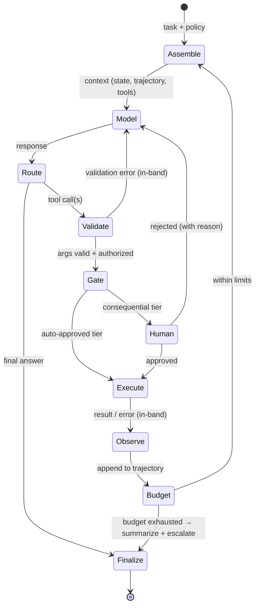

# Reference Architecture: Agent & Tool-Use Loop

An agent is the tool-calling round trip of [api-03](../modules/02-llm-apis/api-03-structured-outputs-tool-calling.md) run in a loop until the task is done — the model plans, your runtime acts, results feed back as context, repeat.[^yao-react] Everything hard about agents is in the word *runtime*: the model supplies decisions; your code supplies every guarantee. This doc specifies that runtime — components, control points, budgets, and privilege boundaries — as the blueprint the module 4 chapters fill with mechanisms. The guiding doctrine, industry-converged: **start with the simplest loop that could work; add orchestration only when a measured failure demands it.**[^anthropic-agents]

## The loop as a state machine

*The agent runtime — every transition below is your code, not the model:*

Two structural readings of the diagram. First, **the model appears once**; everything else is deterministic infrastructure — which is where reliability, security, and cost live. Second, **every arrow back to `Model` carries information in-band** (validation errors, tool failures, human rejections all return as messages): the model's ability to recover from failure is the loop's core capability, and it only works if failures are *visible to it* as context ([api-03](../modules/02-llm-apis/api-03-structured-outputs-tool-calling.md)'s errors-in-band rule, now load-bearing).

## Components and responsibilities

| Component | Owns | Key rule | Chapter |
|---|---|---|---|
| Context assembler | Budgets, trajectory layout, state region, compaction | The [rag-01](../modules/03-retrieval/rag-01-context-engineering.md) component; trajectory is append-only between compactions (cache — api-05) | rag-01, [agt-04](../modules/04-agents/agt-04-memory-and-state.md) |
| Tool registry | Definitions, schemas, per-route catalogs, versioning | Descriptions are prompts; catalogs are curated per task route | [agt-02](../modules/04-agents/agt-02-tool-design.md) |
| Validator | Argument schemas + business rules before any execution | Arguments are model output — unverified until checked | api-03 |
| Authorizer | Privilege tiers, session-derived permissions, human gates | Authority derives from the *session*, never from the model's request | [agt-09](../modules/04-agents/agt-09-agent-reliability.md), sec-01 |
| Executor | Timeouts, idempotency keys, sandboxing, least-privilege creds | Every side-effecting tool is idempotent and separately credentialed | agt-02 |
| Budget controller | Step / token / cost / wall-clock caps, termination policy | Exhaustion → graceful summarize-and-escalate, never silent stop | agt-09 |
| State manager | Structured state (plan, decisions, constraints) as data | Survival contract: decisions never live only in compactable prose | agt-04 |
| Trajectory log | Full record of every step for debugging, evals, audit | Feeds [eng-03](eng-03-eval-harness-architecture.md); trajectories are eval cases | [evl-04](../modules/05-evaluation/evl-04-tracing-observability.md) |

## The five control points

The security-and-reliability skeleton — where your code enforces properties the model cannot violate (api-03's round-trip controls, generalized to the loop):

1. **Catalog control** (what exists): route-scoped tool catalogs; a tool not offered cannot be called. The cheapest defense there is.
2. **Validation** (what's well-formed): schema + cross-field business rules on every argument; failures return in-band for self-correction, capped by the retry ladder.
3. **Authorization** (what's permitted): per-tool privilege tiers evaluated against session identity — read-only tools auto-approve; mutating tools check scope; consequential tools (money, deletion, external communication) require human confirmation. **The tier table is a product artifact, written before launch, reviewed like an access-control policy.**
4. **Execution isolation** (what it can touch): least-privilege credentials per tool, sandboxed code execution, egress controls. Assume a confused or injected model ([sec-01](../modules/07-safety-security/sec-01-prompt-injection.md)): the blast radius is what the *tools* can do, not what the model intends.
5. **Budget termination** (how long it runs): hard caps on steps, tokens, spend, and wall clock. Runaway loops are an economic incident *and* a safety property; exhaustion triggers summarize-and-escalate with the trajectory attached.

The injection corollary that makes control points 3–4 non-negotiable: **everything a tool returns is untrusted input** — a fetched webpage or file can carry instructions, and those instructions arrive in the same context as yours. Provenance-label tool results in the trajectory, and never let content-derived "instructions" widen privileges (sec-01 owns the full treatment; the architecture hooks live here).

## Budgets and termination

Defaults that survive production (tune per task class):

- **Steps:** 10–30 for tool-heavy tasks; alert at P95 of your measured distribution, not the cap.
- **Tokens/cost:** per-task ceiling derived from task value ([prd-05](../modules/06-production/prd-05-cost-engineering.md) logic); the trajectory's growth makes prompt caching a viability requirement, not an optimization (api-05 — an uncached 30-step trajectory re-pays prefill 30 times).
- **Wall clock:** user-facing tasks get progress streaming (api-05) and a timeout that triggers checkpoint-and-resume, not loss of work.
- **Termination taxonomy — every run ends in exactly one of:** task complete (model finalizes), budget exhausted (summarize + escalate), human rejection (recorded with reason), unrecoverable tool failure (escalate with trajectory), or stall detection (N repeated near-identical steps → break the loop — the fnd-08 repetition pathology at task scale).

## Orchestration: when one loop isn't enough

Escalation order, each step justified only by measured failure of the previous:[^anthropic-agents]

1. **Single loop, good tools** — the default; most "we need multi-agent" problems are tool-design problems ([agt-02](../modules/04-agents/agt-02-tool-design.md)).
2. **Workflow decomposition** — fixed pipelines of focused LLM steps (route → extract → act) where the *sequence* is code, not model choice; cheaper and more testable than agency wherever the path is known (see [eng-05](eng-05-design-patterns.md)'s workflow-vs-agent pattern).
3. **Subagents** — a coordinator delegating bounded subtasks to fresh-context workers; buys context isolation (each worker's window stays clean) at the cost of inter-agent information loss ([agt-06](../modules/04-agents/agt-06-multi-agent-systems.md)).
4. **Full multi-agent topologies** — rarely earned; the burden of proof is on the topology.

## Failure map

| Symptom | Suspect | First check |
|---|---|---|
| Loops forever / repeats a failing action | Stall detection missing; error not informative in-band | Read the trajectory: does the model *see* why the step failed? |
| Wrong tool chosen consistently | Catalog overlap or vague descriptions | agt-02's description audit; selection-accuracy metric |
| "Changed its mind" mid-task | Decisions living in compacted prose, no state region | State manager's survival contract (rag-01) |
| Acted on fabricated arguments | Validation without resolve-and-verify | Cross-check layer before side effects (api-03) |
| Duplicate side effects | Idempotency keys missing at executor | Retry-boundary audit on mutating tools |
| Cost blowup per task | Trajectory cache misses or step inflation | api-05 hit-rate dashboard; step-count P95 trend |
| Did something it shouldn't have | Privilege tier too permissive, or injection via tool result | Authorization table review; trajectory provenance audit (sec-01) |

## Related chapters

| Chapter | What it explains |
|---|---|
| [agt-01](../modules/04-agents/agt-01-agent-fundamentals.md) | The loop built from scratch — mechanisms behind this blueprint |
| [agt-02](../modules/04-agents/agt-02-tool-design.md) | Tool design: the registry's content |
| [agt-04](../modules/04-agents/agt-04-memory-and-state.md) | State manager and memory beyond one session |
| [agt-06](../modules/04-agents/agt-06-multi-agent-systems.md) | Subagents and topologies (escalation steps 3–4) |
| [agt-09](../modules/04-agents/agt-09-agent-reliability.md) | Trajectory evals, failure taxonomies, human-gate design |
| [api-03](../modules/02-llm-apis/api-03-structured-outputs-tool-calling.md) | The single round trip this loop iterates |
| [sec-01](../modules/07-safety-security/sec-01-prompt-injection.md) | The injection threat model behind control points 3–4 |
| [rag-01](../modules/03-retrieval/rag-01-context-engineering.md) | Trajectory/context assembly and compaction |

## Sources

[^yao-react]: [T2] Yao et al. (2022). "ReAct: Synergizing Reasoning and Acting in Language Models." arXiv:2210.03629. https://arxiv.org/abs/2210.03629 (accessed 2026-07-10)
[^anthropic-agents]: [T4] Anthropic (2024). "Building effective agents." Anthropic Engineering. https://www.anthropic.com/engineering/building-effective-agents (accessed 2026-07-10)
[^anthropic-tools]: [T1] Anthropic. "Tool use with Claude." https://docs.anthropic.com/en/docs/build-with-claude/tool-use/overview (accessed 2026-07-10)
