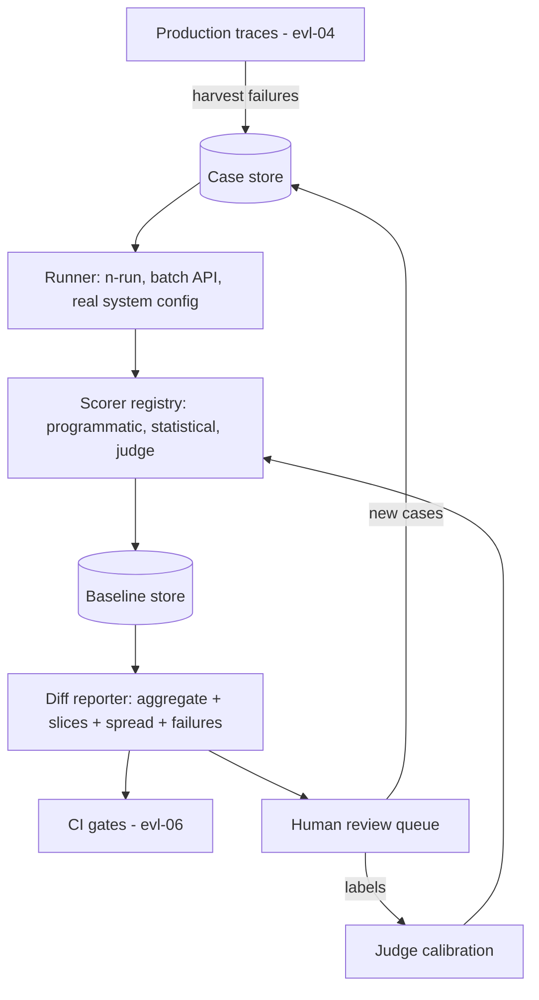

# Reference Architecture: Evaluation Harness

[evl-01](../modules/05-evaluation/evl-01-evaluation-fundamentals.md) argued evals are the moat; this doc specifies the system that holds the moat. A harness is five components — case store, runner, scorer registry, baseline store, reporter — plus two loops that keep it alive: the production-feedback flywheel and the judge-calibration cycle. Build it once, thread every quality decision through it; the mini-project version from evl-01 grows into exactly this.

## System overview

*The harness and its two sustaining loops (flywheel left, calibration right):*



The architectural stance: **the harness runs the real system, not a lab replica** — same gateway ([api-01](../modules/02-llm-apis/api-01-llm-api-fundamentals.md)), same prompts and parameters, same assembler ([rag-01](../modules/03-retrieval/rag-01-context-engineering.md)), with only the traffic source swapped. Any divergence between harness config and production config silently invalidates every score.

## The case data model

The schema everything else consumes. Presented as YAML rather than a Mermaid ER diagram — deliberately: an exact field-level contract is *code*, and a diagram of it would add boxes without adding precision (the justified-alternative rule, CONVENTIONS §4).

```yaml
case:
  id: case-0412                # stable, never reused (mirrors chapter-ID discipline)
  input:                       # everything the system under test receives
    messages: [...]            # or template + variables
    context_refs: [...]        # for RAG cases: pinned document versions
  expected:
    kind: exact | schema | property | rubric   # drives scorer selection
    value: ...                 # answer / JSON Schema / property list / rubric id
  scoring:
    scorer: field_accuracy     # registry key
    n_runs: 5                  # fnd-08 statistical discipline
  taxonomy:
    category: extraction.dates # slicing dimension — reports group by this
    difficulty: hard | representative | abstention
    source: production|synthetic|authored   # provenance (evl-02)
  lifecycle:
    added: 2026-07-10
    owner: team-docs
    review_after: 2027-01-10   # cases go stale like chapters do
    held_out: false            # true = never used in prompt iteration
```

Non-negotiable fields, per evl-01's pathologies: `held_out` (defends against eval overfitting), `source` (contamination audit trail), `taxonomy.category` (slicing is what makes aggregates honest), `difficulty: abstention` (the fnd-09 cases everyone forgets).

## Components and contracts

| Component | Owns | Key rules |
|---|---|---|
| Case store | Versioned cases, held-out partitioning, lifecycle | Cases in git (diffable, reviewed); held-out set access-controlled by convention and tooling |
| Runner | Execution against the real system; n-runs; concurrency | Batch API by default ([api-05](../modules/02-llm-apis/api-05-streaming-caching-batch.md) — half price, no quota contention); config snapshot recorded per run |
| Scorer registry | Programmatic, statistical, and judge scorers as pluggable units | Preference order per evl-01: programmatic → statistical → judge → human; every judge scorer carries a calibration record |
| Baseline store | Score history keyed by (suite, system-config hash) | Every result is a diff; a score without a baseline is trivia |
| Reporter | Aggregate + per-category slices + spread + case-level failure links | The four-part format (evl-01); failures link to full traces (evl-04) |
| CI integration | Suite tiers mapped to triggers; gate policy | [evl-06](../modules/05-evaluation/evl-06-ci-for-llm-apps.md)'s subject; the tier table below |

## Tiered suites

One suite cannot serve every trigger — cost and latency force tiers (evl-01's smoke/full/deep, made concrete):

| Tier | Size / runs | Trigger | Latency budget | Gate policy |
|---|---|---|---|---|
| Smoke | 15–30 cases, n=1–2 | Every prompt/config PR | Minutes, synchronous | Hard block on regression |
| Full | 100s of cases, n=3–5 | Nightly + pre-release | Hours, batch API | Block release; page on category regression |
| Deep | Full + behavioral probes + capability map (fnd-09) | Model-version adoption ([api-06](../modules/02-llm-apis/api-06-model-selection.md) bake-offs) | Day, batch | Human sign-off with diff report |

## The judge subsystem

Model-graded scoring is the harness's most powerful and most corruptible component ([evl-03](../modules/05-evaluation/evl-03-llm-as-judge.md) owns the mechanics; known biases — position, verbosity, self-preference — are documented and must be designed against[^zheng-judge]). The architectural requirements:

- **Judges are pinned system configs** like everything else: model version + rubric version + parameters, hash-recorded per run. A judge change invalidates baseline comparability — treat it as a suite migration, not a tweak.
- **Calibration is a standing loop, not a launch task:** a monthly sample of judge-scored outputs goes to human labeling; agreement (with confidence intervals) is tracked per rubric; falling agreement blocks the judge from gating until re-calibrated.
- **Rubrics are behavioral checklists** ("cites a provided document: yes/no"), not 1–10 vibes — checklist rubrics agree with humans better and Goodhart slower (evl-01's unfalsifiable-rubric pathology).
- **Blind the judge:** never show it the desired answer's author, the user's stated preference, or which variant is "new" (fnd-07's sycophancy, defended at the architecture level).

## The flywheel

What makes the asset appreciate (evl-01's third framing, operationalized): production traces ([evl-04](../modules/05-evaluation/evl-04-tracing-observability.md)) are sampled and mined — user complaints, low judge scores in online sampling ([evl-05](../modules/05-evaluation/evl-05-online-evaluation.md)), abstention events, escalations — and the harvest lands in a triage queue where a human converts real failures into cases (with `source: production`, the highest-value provenance). Weekly cadence; the suite grows monotonically harder and more representative; saturated categories get retired to an archive tier. **A harness without this loop decays into evl-01's easy-case suite within two quarters** — the flywheel is maintenance, not enhancement.

## Failure map

| Symptom | Suspect | First check |
|---|---|---|
| Eval green, production complaints | Easy-case suite (flywheel stalled) or config drift | `source:` distribution of cases; harness-vs-prod config hash |
| Scores jump with no system change | Judge drift or provider model drift under an alias | Judge calibration record; pinned-version audit (api-01) |
| Team ignores the reports | Gate theater — reports don't block anything | Wire the smoke tier as a required check or admit it (evl-01) |
| Improvement on aggregate, anger from one team | Missing slice for their category | Taxonomy coverage vs. traffic distribution |
| Suite too slow/expensive to run | Tiers collapsed into one suite | Tier table above; batch-API migration (api-05) |
| Metric climbing, humans unimpressed | Goodhart on the judge | Human-agreement audit; rubric-to-checklist rewrite |

## Related chapters

| Chapter | What it explains |
|---|---|
| [evl-01](../modules/05-evaluation/evl-01-evaluation-fundamentals.md) | The doctrine this architecture implements |
| [evl-02](../modules/05-evaluation/evl-02-eval-datasets.md) | Case construction, provenance, held-out discipline |
| [evl-03](../modules/05-evaluation/evl-03-llm-as-judge.md) | Judge design, biases, calibration mechanics |
| [evl-04](../modules/05-evaluation/evl-04-tracing-observability.md) | The trace source the flywheel harvests |
| [evl-05](../modules/05-evaluation/evl-05-online-evaluation.md) | Online sampling feeding the triage queue |
| [evl-06](../modules/05-evaluation/evl-06-ci-for-llm-apps.md) | Gate policies and CI wiring for the tier table |
| [api-05](../modules/02-llm-apis/api-05-streaming-caching-batch.md) | Batch-API economics the runner assumes |
| [fnd-08](../modules/01-foundations/fnd-08-sampling-and-decoding.md) | Why n-runs and spread are non-optional |

## Sources

[^anthropic-evals]: [T1] Anthropic. "Create strong empirical evaluations." https://docs.anthropic.com/en/docs/build-with-claude/develop-tests (accessed 2026-07-10)
[^openai-evals]: [T1] OpenAI. "Evaluating model outputs." https://platform.openai.com/docs/guides/evals (accessed 2026-07-10)
[^zheng-judge]: [T2] Zheng et al. (2023). "Judging LLM-as-a-Judge with MT-Bench and Chatbot Arena." arXiv:2306.05685. https://arxiv.org/abs/2306.05685 (accessed 2026-07-10)
