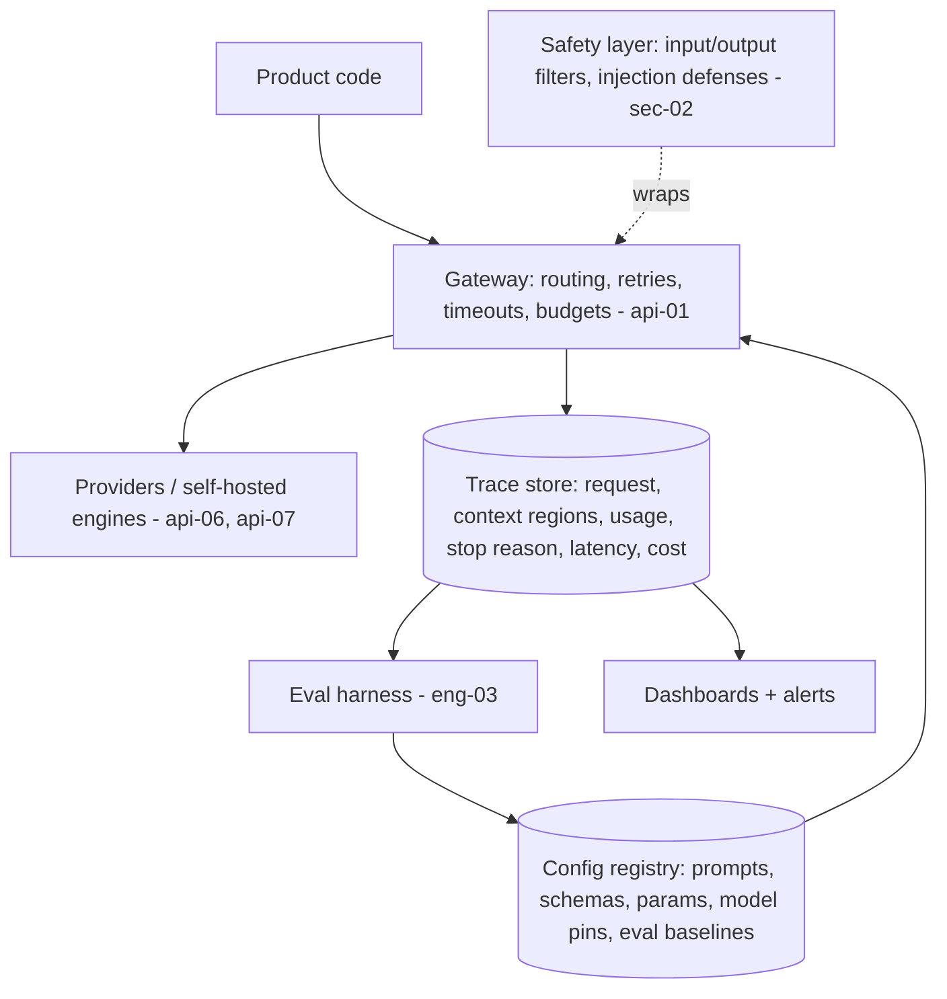
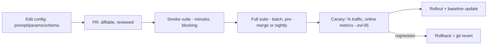

# Reference Architecture: The LLMOps Stack

LLMOps is DevOps with three new facts: behavior deploys without code deploys (a prompt edit changes production behavior), dependencies that drift without notice (model versions — [fnd-07](../modules/01-foundations/fnd-07-post-training.md)), and per-request metered cost with high variance. The stack below is what every serious team converges on to manage those facts. Nothing in it is speculative — each layer appeared as a "day-one discipline" in the module 2 chapters; this doc assembles them into one system with two lifecycles and a starter dashboard set.

## The stack

*Five layers between your product code and the model providers — every request passes down, every trace flows back up:*

| Layer | Owns | Built in |
|---|---|---|
| Gateway | One choke point: model pins, routing/fallbacks, retries+jitter, timeouts, rate shaping, caching flags | [api-01](../modules/02-llm-apis/api-01-llm-api-fundamentals.md), [api-05](../modules/02-llm-apis/api-05-streaming-caching-batch.md) |
| Config registry | Prompts + examples + params + schemas + model pins as *one versioned unit* per route | [api-02](../modules/02-llm-apis/api-02-prompt-engineering.md), [api-03](../modules/02-llm-apis/api-03-structured-outputs-tool-calling.md) |
| Trace store | Full interaction records: messages (redacted per policy — [sec-03](../modules/07-safety-security/sec-03-privacy-compliance.md)), per-region tokens ([rag-01](../modules/03-retrieval/rag-01-context-engineering.md)), usage, stop reason, latency, cost, config hash | [evl-04](../modules/05-evaluation/evl-04-tracing-observability.md); emerging standard: OTel GenAI conventions[^otel-genai] |
| Eval harness | The quality gate for both lifecycles below | [eng-03](eng-03-eval-harness-architecture.md) |
| Safety layer | Input/output filtering, injection defenses, moderation | [sec-02](../modules/07-safety-security/sec-02-guardrails.md) |

The load-bearing design rule: **a route's behavior is fully determined by its config-registry entry** — prompt, examples, parameters, schema, model pin, sampling, budget. One hash identifies it; the trace store records the hash on every request; the eval baseline is keyed by it. This is what makes the two lifecycles below auditable instead of archaeological.

## Lifecycle 1: the config deploy

A prompt edit is a behavior deploy ([api-02](../modules/02-llm-apis/api-02-prompt-engineering.md)'s doctrine). The pipeline, mirroring code CI:

*Config change → production, with the eval harness as the test suite:*

Notes that save incidents: cache implications ride along (a stable-prefix change is a deliberate cache invalidation — [api-05](../modules/02-llm-apis/api-05-streaming-caching-batch.md); deploy at low-traffic windows for big prefixes); config changes and code changes deploy separately (so rollback is unambiguous); and few-shot examples are config (the api-02 lesson teams relearn quarterly).

## Lifecycle 2: the model adoption

Triggered by releases, price moves, or deprecation calendars[^anthropic-deprecations] ([api-06](../modules/02-llm-apis/api-06-model-selection.md)'s triggers). The pipeline: candidate pinned → deep-tier bake-off (eng-03; task evals + behavioral probes + capability map) → prompt re-tuning if needed (api-02's migration pass, evaluated) → shadow or canary traffic → decision-log entry → staged rollout with the old pin warm as fallback ([prd-04](../modules/06-production/prd-04-reliability.md)). Deprecation dates live on the team calendar with a two-month runway — the forced-upgrade fire drill is the most preventable incident class in LLMOps.

## Dashboards and alerts: the starter set

The minimum instrumentation that catches the incidents this curriculum has catalogued — all derivable from the trace store:

| Signal | Alert condition | Incident it catches |
|---|---|---|
| Cost per task, per route | Drift >20% week-over-week | Verbosity/retry drift, routing regressions ([prd-05](../modules/06-production/prd-05-cost-engineering.md)) |
| Cache hit rate | Drop below route baseline | Prefix churn (api-05's silent regression) |
| Truncation rate (`stop_reason`) | Any sustained rise | The api-01 silent-truncation classic |
| Retry/validation-failure rate | Rise above baseline | Model drift, schema rot (api-03's leading indicator) |
| Refusal rate | Change after any adoption | fnd-07 behavior drift |
| P50/P99 TTFT + total latency, per stage | SLO breach per stage | Regressing component identification (eng-01's decomposition) |
| Per-region context tokens | Region budget drift | rag-01's assembler regressions |
| Judge-score sample on live traffic | Trend break | Quality drift before users report it ([evl-05](../modules/05-evaluation/evl-05-online-evaluation.md)) |
| Budget-exhausted terminations (agents) | Rate rise | eng-02 loop pathologies |

## Environments and data flow

Three environments with one honest caveat: **staging cannot reproduce LLM behavior distribution** — the model is the same, but traffic isn't, and quality is a property of traffic (evl-01). Hence the stack's emphasis on canaries and online sampling over staging sign-off. Dev works against cheap/local models ([api-07](../modules/02-llm-apis/api-07-local-inference.md)) with the same gateway interface; staging validates plumbing, not quality; production canaries validate quality. Data flows the reverse direction under governance: production traces → (redaction — sec-03) → eval cases and fine-tuning corpora ([ftn-03](../modules/08-fine-tuning/ftn-03-data-for-fine-tuning.md)).

## The maturity ladder

Adopt incrementally; each rung is a week or less of work and pays immediately:

1. **Rung 1 (day one, non-negotiable):** gateway module with pins, retries, timeouts; full interaction logging with usage + stop reason; keys server-side with spend alerts. *(api-01's minimum.)*
2. **Rung 2:** config registry (prompts as versioned units); smoke suite gating config PRs; cost-per-task and cache dashboards.
3. **Rung 3:** trace store with config hashes; full/deep suite tiers; canary machinery; the alert table above.
4. **Rung 4:** online judge sampling, flywheel triage (eng-03), model-adoption pipeline with decision logs, fallback exercised quarterly.
5. **Rung 5 (at scale):** multi-provider routing with cost-based policies, semantic caching with staleness contracts, fleet-level capacity management ([prd-06](../modules/06-production/prd-06-deployment-infrastructure.md)).

The anti-pattern: building rung 5 machinery at rung 1 scale ([fnd-01](../modules/01-foundations/fnd-01-ai-engineering-landscape.md)'s premature infrastructure) — and its mirror: staying at rung 1 past your first behavior-drift incident.

## Related chapters

| Chapter | What it explains |
|---|---|
| [api-01](../modules/02-llm-apis/api-01-llm-api-fundamentals.md) | The gateway layer and day-one logging disciplines |
| [api-05](../modules/02-llm-apis/api-05-streaming-caching-batch.md) | Caching/batch mechanics behind the dashboards |
| [api-06](../modules/02-llm-apis/api-06-model-selection.md) | Adoption triggers, bake-offs, decision logs |
| [evl-04](../modules/05-evaluation/evl-04-tracing-observability.md) | Trace-store design and tracing platforms |
| [evl-05](../modules/05-evaluation/evl-05-online-evaluation.md) / [evl-06](../modules/05-evaluation/evl-06-ci-for-llm-apps.md) | Online sampling, canaries, CI gate policies |
| [prd-01](../modules/06-production/prd-01-architecture-patterns.md) / [prd-04](../modules/06-production/prd-04-reliability.md) / [prd-05](../modules/06-production/prd-05-cost-engineering.md) | Architecture, reliability, and cost layers at depth |
| [sec-02](../modules/07-safety-security/sec-02-guardrails.md) / [sec-03](../modules/07-safety-security/sec-03-privacy-compliance.md) | The safety wrapper and trace-data governance |

## Sources

[^anthropic-caching]: [T1] Anthropic. "Prompt caching." https://docs.anthropic.com/en/docs/build-with-claude/prompt-caching (accessed 2026-07-10)
[^otel-genai]: [T1] OpenTelemetry. "Semantic conventions for generative AI systems." https://opentelemetry.io/docs/specs/semconv/gen-ai/ (accessed 2026-07-10)
[^anthropic-deprecations]: [T1] Anthropic. "Model deprecations." https://docs.anthropic.com/en/docs/about-claude/model-deprecations (accessed 2026-07-10)
