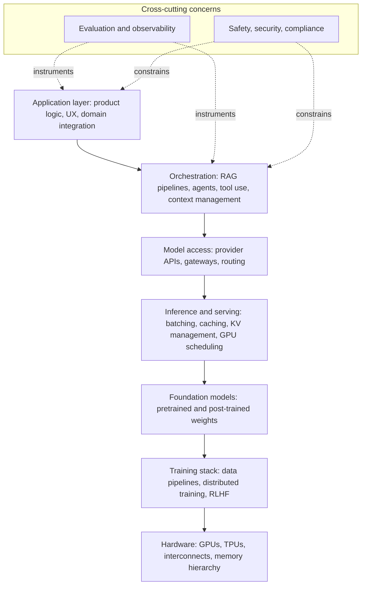
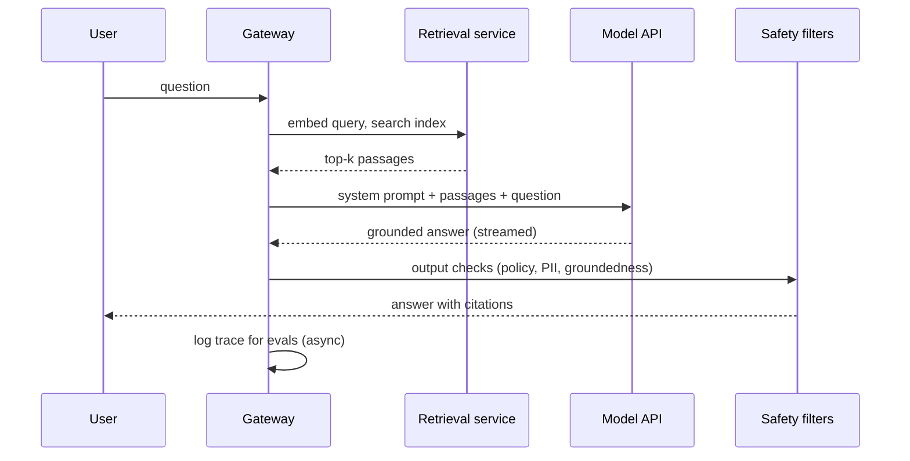

# The AI Engineering Landscape

AI engineering is the discipline of building products on top of pre-trained foundation models. It sits above model training and below product design, and it borrows from both while being reducible to neither. This chapter gives you the map you will use for the rest of the curriculum: the layers of the modern AI stack, what an AI engineer actually does all day, how the role differs from adjacent ones, and — most importantly for an experienced software engineer entering the field — where engineering effort compounds into durable value versus where it evaporates with the next model release. There is no math in this chapter; the math begins in fnd-02. What this chapter demands instead is a willingness to update some instincts that served you well in traditional software, because a few of them quietly stop working when the core of your system is probabilistic.

## Intuition: a new application layer

The single most useful mental model for AI engineering is this: **foundation models turned intelligence into an infrastructure component**, the way cloud computing turned data centers into one. Before roughly 2020, using machine learning in a product meant *making* a model: collecting labeled data, training, deploying, and maintaining a bespoke artifact for one narrow task. GPT-3 demonstrated that a single large model could perform many tasks it was never explicitly trained for, steered only by the text you put in front of it,[^brown-2020] and instruction tuning then made that steering natural enough for non-experts.[^ouyang-2022] The consequence: capability now arrives *pre-built*, behind an API, and the scarce skill shifted from producing intelligence to **applying** it — feeding models the right context, constraining their outputs, composing them with tools and data, and verifying the results.

An analogy that lands well with experienced engineers: the foundation model is to an AI engineer what the database engine is to a backend engineer. Very few backend engineers write B-trees; all of them must understand indexing, query plans, and transaction semantics to build anything serious. Likewise, few AI engineers will ever pretrain a model, but all of them must understand tokenization, attention, sampling, and training pipelines well enough to predict behavior, debug failures, and make cost/quality trade-offs. That is exactly the depth this module (fnd-01 through fnd-09) targets.

The term "AI engineer" for this application-layer role was crystallized in a widely cited 2023 essay by swyx, which observed the emergence of a discipline distinct from ML engineering on the *other* side of the API boundary.[^swyx-ai-engineer] The label stuck because the underlying economic shift was real: one model, many products.

## The stack from first principles

Reasoning about any AI system starts with locating it in the stack. Working from the bottom up, each layer consumes the one below and exposes a simpler abstraction above — and each layer is a career specialization in its own right.

*The modern AI stack, bottom to top, with the cross-cutting concerns every production system carries:*

The layers, and where this curriculum covers them:

| Layer | What lives here | Who owns it | Curriculum |
|---|---|---|---|
| Application | Product features, UX for probabilistic output, domain logic | AI engineers | modules 2–4 |
| Orchestration | RAG, agents, tool calling, memory, context assembly | AI engineers | modules 3–4 |
| Model access | Provider APIs, gateways, model routing, fallbacks | AI engineers | module 2, 6 |
| Inference/serving | vLLM-class servers, batching, quantization | Inference/infra engineers | module 6 |
| Foundation models | Model weights, architectures | Research labs | module 1 (consumer view) |
| Training | Pretraining, post-training, fine-tuning | Research + ML engineers | modules 1, 8 |
| Hardware | Accelerators, networking, memory | Silicon vendors, infra | module 6 (consumer view) |

Two structural observations matter more than the layer list itself. First, **the API boundary between "model access" and "foundation models" is the great divide of the field**: below it, work requires large capital and research skill and is concentrated in a handful of labs; above it, work requires product and systems skill and is open to every engineering team.[^bommasani-2021] Second, **the cross-cutting layers — evaluation and safety — are not optional extras**. In traditional software their analogues (testing, security) are also cross-cutting, but here they are harder and more central, because the component at the core of the system does not behave deterministically. Module 5 and module 7 exist because of this.

> **Volatile:** the specific products at each layer churn constantly — which providers lead, which serving framework is fastest, which orchestration framework is in favor. The *layer structure itself* has been stable since roughly 2023 and is the durable thing to learn. For current model specifics, see [api-06](../02-llm-apis/api-06-model-selection.md); provider capabilities are documented authoritatively in their own references.[^openai-api-intro][^anthropic-models]

## How the AI engineer role actually works

An AI engineer ships product features whose core behavior comes from a foundation model. The day-to-day loop looks like this: identify a capability the product needs → express it as context + instructions + tools for a model ([api-02](../02-llm-apis/api-02-prompt-engineering.md), [api-03](../02-llm-apis/api-03-structured-outputs-tool-calling.md)) → wire in the data the model needs at runtime (module 3) → measure whether it actually works with evals (module 5) → harden it for cost, latency, reliability, and abuse (modules 6–7). The loop is empirical: you form a hypothesis about model behavior, test it against examples, and iterate — closer to experimental science with version control than to classic specification-driven development.

The role is easiest to define by contrast with its neighbors:

| Dimension | AI engineer | ML engineer | Research scientist/engineer |
|---|---|---|---|
| Primary artifact | Product features on top of models | Trained/fine-tuned models and ML pipelines | New methods, papers, frontier models |
| Core question | "How do I make this model do the job reliably?" | "How do I train the best model for this task?" | "What makes models better at all?" |
| Iteration loop | Minutes (prompt/context/eval cycles) | Hours–days (training runs) | Weeks–months (research cycles) |
| Math required | Intuition-level (this module's depth) | Working fluency | Deep fluency |
| Typical background | Full-stack / backend engineering | Data science, ML, statistics | PhD-track research |
| Owns in production | Context, orchestration, evals, cost, UX | Training data, model quality, serving | Usually not production |

The boundaries blur at the edges — an AI engineer at a startup will run the occasional fine-tune (module 8), and an ML engineer increasingly consumes foundation models rather than training from scratch — but the center of gravity differs, and job interviews test for the center of gravity ([fro-05](../09-frontier/fro-05-interviews-portfolio.md)).

What carries over from a strong software engineering background: systems design, API design, debugging discipline, production operations, and healthy paranoia about untrusted input. What must be newly built: comfort with non-determinism, evaluation-first thinking, a working model of how LLMs behave and fail, and cost intuition (tokens are a metered resource in a way CPU cycles stopped being years ago). What must be partially *unlearned*: the instinct that a passing test suite means correctness, and the instinct that identical inputs yield identical outputs.

## Where value concentrates

For an engineer deciding where to invest learning and building effort, the crucial question is: **which work survives the next model release?** Model capabilities improve continuously, and any engineering that merely compensates for a current model's weakness has a short half-life. Durable value concentrates in assets that get *more* valuable as models improve:

- **Evaluation suites.** A good eval set encodes what "correct" means for your product — the hardest and most product-specific knowledge there is. When a new model ships, the team with strong evals can adopt it in days; the team without them re-tests by vibes for weeks. This is why [evl-01](../05-evaluation/evl-01-evaluation-fundamentals.md) sits unusually early in this curriculum's dependency graph.
- **Proprietary context.** Models are commodities; your data, retrieval pipelines, and domain integrations are not. The retrieval layer (module 3) is where private knowledge meets public capability.
- **Tool and system integrations.** An agent is only as useful as what it can touch. Well-designed tools ([agt-02](../04-agents/agt-02-tool-design.md)) and the permissions/safety scaffolding around them transfer across model generations.
- **The data flywheel.** Production traffic → logged traces → eval cases and fine-tuning data → better product → more traffic. Teams that build this loop early compound; module 5 covers the machinery.

Conversely, value evaporates fastest in: elaborate prompt hacks that patch a current model's reasoning gaps, wrapper features that a provider is likely to absorb into the platform (thin "chat with X" products have died in waves), and premature infrastructure for problems you do not yet have. A useful heuristic when planning work: *assume the model gets meaningfully better every six months, then ask what is still worth having built.*

## A brief history: from ML projects to AI products

Compressed to the turns that explain today's landscape:

- **Pre-2017 — bespoke ML.** One model per task, trained by specialists. Deep learning worked (vision from 2012, translation from ~2014) but every application was a research-adjacent project.
- **2017 — the transformer.** A single architecture that scaled with data and compute became the substrate for everything that followed (covered in depth in fnd-05).
- **2018–2020 — pretrain, then adapt.** BERT and GPT-2 established transfer learning for language: pretrain once on the internet, adapt cheaply per task. GPT-3 (2020) showed that at sufficient scale, adaptation could shrink to *examples in the prompt* — no gradient updates at all.[^brown-2020] The "foundation model" framing named the regime shift.[^bommasani-2021]
- **2022 — the assistant moment.** Instruction tuning and RLHF[^ouyang-2022] plus a chat interface (ChatGPT, Nov 2022) made the capability legible to everyone. API access to frontier models created the application layer overnight.
- **2023–2024 — the application stack forms.** RAG became the default pattern for private data; function calling made tool use reliable enough to build on; open-weight models (Llama and successors, distributed via Hugging Face[^hf-hub]) created a parallel self-hosted ecosystem; the "AI engineer" role was named.[^swyx-ai-engineer]
- **2024–2026 — reasoning and agents.** Models trained to spend inference-time compute on multi-step reasoning, standardized tool protocols (MCP, [agt-05](../04-agents/agt-05-mcp.md)), and long-horizon agentic systems moved the frontier from "answer questions" to "do work." This is the era you are entering; modules 4–6 are its core skills.

The through-line: each turn moved leverage further from training and closer to application — which is precisely why this curriculum exists.

## Common misconceptions

- **"AI engineering is just prompt engineering."** Prompting is one skill among a dozen. Production systems live or die on retrieval quality, eval coverage, cost engineering, latency, and failure handling — prompting is rarely the bottleneck after the first month.
- **"I need to be able to train models to be credible."** You need to understand training well enough to reason about model behavior (fnd-06, fnd-07); you do not need to have done it. The database-engine analogy applies.
- **"The model is the product."** The model is the *engine*. Products win on context, integration, evals, and UX — assets the model provider does not have.
- **"It's all going to be automated away, including this job."** Models increasingly write the code, but deciding *what* to build, *what correct means*, and *whether the system actually works* — the eval and architecture layer — has so far grown in importance as generation got cheaper. Treat that claim's long-run version as an open question, and this decade's version as empirically false so far.
- **"Non-determinism means it can't be engineered rigorously."** It means rigor moves from asserting exact outputs to measuring distributions of outcomes — statistical process control rather than unit-test thinking. Module 5 is the rigorous replacement, not the abandonment of rigor.
- **"Wrappers are doomed, so application-layer work is doomed."** Thin wrappers are doomed. Deep integrations with proprietary context, workflow ownership, and eval moats are the opposite of doomed — they are where the industry's value is accruing.

## Failure modes and trade-offs

The characteristic ways AI products and AI-engineering careers go wrong, and the trade-offs behind them:

- **Demo-quality trap.** LLMs make an 80%-working demo achievable in a day, which sets expectations that the remaining 20% will take a week. It usually takes months, because the last 20% is reliability engineering under non-determinism. Teams that do not budget for the gap ship impressive prototypes and broken products.
- **Building on sand vs. building on rails.** Betting the architecture on a model-specific behavior (a particular provider's quirk, an undocumented format tolerance) buys short-term quality and long-term migration pain. The trade-off is real: total provider-agnosticism costs capability too. The resolution is isolation — keep provider-specific assumptions behind one interface ([prd-01](../06-production/prd-01-architecture-patterns.md)).
- **Eval debt.** Skipping evals feels fast, exactly like skipping tests feels fast. The failure arrives as: a prompt change ships, a subtle regression follows, nobody notices for three weeks, and now the team is afraid to change anything. Eval debt is the technical debt of this field.
- **Premature depth.** Engineers over-index on the layer below their problem — spinning up self-hosted inference before product-market fit, or fine-tuning before exhausting prompting and retrieval ([ftn-01](../08-fine-tuning/ftn-01-customization-decision.md) formalizes this decision).
- **Chasing the news cycle.** The field produces daily announcements; a strategy of adopting everything means shipping nothing. The durable skill is evaluating *categories* quickly ([fro-04](../09-frontier/fro-04-staying-current.md)), not tracking every entrant.

## Best practices for entering the field

- **Learn evergreen-first.** Transformers, tokenization, sampling, retrieval theory, and evaluation methodology will outlive every current tool. This module and evl-01 are the highest ROI hours in the repo.
- **Build one real thing per module.** Reading about RAG is not knowing RAG. The mini-projects in each chapter exist because the field's knowledge is procedural.
- **Adopt evaluation-first habits immediately.** Before building any LLM feature, write ten input/expected-behavior pairs. This single habit separates professionals from tourists faster than any other.
- **Treat all model input as untrusted and all model output as unverified.** Security instinct transfers directly: prompt injection ([sec-01](../07-safety-security/sec-01-prompt-injection.md)) means anything the model reads can attack you, and hallucination means anything the model writes can lie to you. Design accordingly from day one — validation, least-privilege tools, human gates on consequential actions.
- **Develop cost sense early.** Know your cost per request from the first prototype. Token economics shape architecture (module 6); engineers who ignore them design systems that cannot ship.
- **Keep a decision log for model choices.** Which model, why, evaluated against what — so that when the landscape shifts (it will, quarterly), re-decisions are cheap.

## Real-world system archetypes

Three system shapes account for most production LLM engineering today; recognizing them helps you decompose any AI product you encounter.

**The copilot** (e.g. code assistants, writing aids): model suggestions embedded in an existing workflow, human accepts/rejects each one. Engineering centers on latency (suggestions must arrive in hundreds of milliseconds), context assembly from the user's working state, and tolerance for imperfection since the human filters output. Failure is graceful by construction — a bad suggestion is ignored, not executed.

**The knowledge assistant** (RAG over private corpora: support bots, internal search, document Q&A): the model answers questions grounded in retrieved documents. Engineering centers on retrieval quality (module 3), groundedness — the answer must come from the documents, not the model's imagination ([rag-07](../03-retrieval/rag-07-rag-evaluation.md)) — and freshness of the index. Failure is a confident wrong answer, which is why this archetype leans hardest on evals and citations-in-output.

**The agentic workflow** (autonomous multi-step task execution: coding agents, research agents, back-office automation): the model plans, calls tools, observes results, and iterates (module 4). Engineering centers on tool design, error recovery, checkpointing, and authorization boundaries — because here model output *acts on the world*, failure containment is the design problem, not an afterthought.

*A single production request through the knowledge-assistant archetype — the pattern generalizes:*

Note the last, easily forgotten arrow: every production request feeds the eval and observability loop. That arrow is the data flywheel from earlier in this chapter.

## Interview questions

1. **"What does an AI engineer do that an ML engineer doesn't?"** — Model answer: an AI engineer builds products on top of pre-trained foundation models — the work is context engineering, orchestration, evaluation, and productionization above the model API. An ML engineer's center of gravity is producing model artifacts: training pipelines, data engineering, fine-tuning, serving. The roles share evaluation and production skills; they differ in whether the model is consumed or created. In small teams one person does both, but the skill sets are distinguishable and interviews test them differently.

2. **"Walk me through the layers of a production LLM application."** — Model answer: application/product logic on top; orchestration (retrieval, agents, context assembly) beneath it; model access (provider APIs or a gateway with routing and fallbacks); inference/serving (managed by the provider, or self-hosted vLLM-class infrastructure); the foundation model itself; and below that training and hardware, which application teams consume but don't own. Evaluation/observability and safety cut across every layer. A strong answer also states *where the team's engineering time goes* — overwhelmingly the top three layers.

3. **"Our LLM demo works great. Why should the roadmap allocate three more months before launch?"** — Model answer: demos sample the happy path; production samples everything. The remaining work is the reliability layer: eval suites to define and measure correctness, retrieval hardening for the data the demo didn't cover, cost and latency engineering, failure handling (timeouts, rate limits, provider outages), safety and abuse handling, and observability. LLMs invert the usual effort curve — the first 80% is startlingly cheap and the last 20% is where the engineering lives.

4. **"How do you decide between calling a provider API and self-hosting an open-weight model?"** — Model answer: default to APIs for frontier capability, zero infra burden, and speed to market. Self-hosting earns its complexity when one or more of: hard data-residency/compliance constraints, very high sustained volume where unit economics flip, latency requirements needing colocation, or the need to deeply customize (fine-tuned weights, constrained decoding). It's a reversible decision if the model layer is isolated behind an internal interface — so make it late, with real traffic data.

5. **"What survives a model upgrade, and what doesn't?"** — Model answer: evals, retrieval pipelines and data assets, tool integrations, and safety scaffolding survive and usually appreciate. Prompt-level workarounds for a specific model's weaknesses, provider-specific format hacks, and architecture decisions that compensate for capability gaps depreciate — sometimes overnight. Good AI system design deliberately concentrates investment in the first category and quarantines the second behind interfaces.

6. **"What's the biggest mindset shift for a traditional software engineer entering AI engineering?"** — Model answer: replacing binary correctness with statistical correctness. You can no longer assert `output == expected`; you measure pass rates over distributions of inputs, invest in evals the way you used to invest in tests, and design UX and system boundaries that tolerate — and contain — being wrong some percentage of the time. The second shift is treating tokens as metered cost with architectural consequences.

7. **"Where does defensibility come from in an AI product, given everyone has the same models?"** — Model answer: precisely *because* everyone has the same models, defensibility comes from what others can't copy by calling the same API: proprietary data and the retrieval layer over it, workflow and integration depth, the eval suite encoding domain-specific correctness, and the data flywheel from production traffic back into product quality. Model access is table stakes; context and evals are the moat.

## Exercises and mini-project

**Exercises**

1. Pick an AI product you use (a coding assistant, a search product, a support bot). Decompose it into the stack layers from this chapter: what runs at each layer, and which layers does the product team own vs. rent?
2. For the same product, list three assets its team owns that would *survive* swapping the underlying model, and two behaviors that probably would not.
3. Find three current AI engineer job postings (big tech, funded startup, non-tech enterprise). Map each listed requirement onto this curriculum's modules. Note what appears in all three postings — that intersection is the field's current definition of the role.
4. Write down five instincts from your software engineering experience you expect to transfer directly, and three you suspect need revision. Revisit this list after module 5 and grade yourself.

**Mini-project: annotated system map.** Choose one archetype (copilot, knowledge assistant, or agentic workflow) and design — on paper, no code — a production system for a concrete use case in a domain you know well. Produce: (a) a component diagram in Mermaid using this chapter's layer vocabulary; (b) for each component, a build/rent decision with one-sentence justification; (c) the three failure modes you'd instrument first; (d) ten eval cases (input → expected behavior) for the core capability. Keep this artifact: you will implement it incrementally as the capstone thread through modules 3–6.

**Capstone extension:** the system map becomes the design document for the full capstone build; rag-05, agt-01, evl-02, and prd-01 each revisit and harden one section of it.

## Revision summary

- Foundation models turned intelligence into an infrastructure component; AI engineering is the discipline of the application layer above the model API.
- The stack — hardware → training → foundation models → inference → model access → orchestration → application, with evals and safety cross-cutting — is stable even though the products at each layer churn.
- The AI engineer consumes models; the ML engineer produces them; the researcher advances them. Interviews and this curriculum target the first role's center of gravity.
- Durable value: evals, proprietary context/retrieval, tool integrations, the data flywheel. Perishable value: prompt hacks, wrapper features, workarounds for current-model weaknesses.
- The core mindset shifts: statistical rather than binary correctness, evaluation-first development, untrusted-input/unverified-output security posture, and token-cost awareness.

## Flashcards

| Q | A |
|---|---|
| Define AI engineering in one sentence. | Building production software on top of pre-trained foundation models — context, orchestration, evaluation, and hardening above the model API. |
| What is the "great divide" in the AI stack? | The model API boundary: below it, capital-intensive model production by a few labs; above it, product engineering open to every team. |
| Name the two cross-cutting layers every production AI system carries. | Evaluation/observability, and safety/security/compliance. |
| What four asset classes survive model upgrades? | Eval suites, proprietary context/retrieval pipelines, tool integrations, and the data flywheel. |
| AI engineer vs. ML engineer, one line each. | AI engineer: consumes foundation models to ship product. ML engineer: produces model artifacts via training pipelines. |
| What replaced binary correctness in LLM systems? | Statistical correctness: measured pass rates over input distributions, enforced by evals. |
| Why did GPT-3 (2020) matter structurally, not just technically? | It showed one pretrained model could perform many tasks via prompting alone — decoupling capability production from application, creating the application layer. |
| What is the "demo-quality trap"? | LLMs make 80%-working demos nearly free, hiding that the remaining 20% — reliability under non-determinism — is months of engineering. |

## Further reading

- **Official docs:** OpenAI API introduction[^openai-api-intro]; Anthropic models overview[^anthropic-models]; Hugging Face Hub docs[^hf-hub] — skim all three ecosystems now; api-01 works through them properly.
- **Papers:** Bommasani et al., "On the Opportunities and Risks of Foundation Models" (2021)[^bommasani-2021] — read §1 for the regime-shift argument; Brown et al., "Language Models are Few-Shot Learners" (2020)[^brown-2020] — the abstract and figures suffice at this stage.
- **Books:** Chip Huyen, *AI Engineering* (O'Reilly, 2025) — the closest single-book analogue to this curriculum's scope.
- **Talks:** swyx, "The Rise of the AI Engineer" (AI Engineer Summit 2023 keynote) — the essay's argument, compressed.[^swyx-ai-engineer]
- **Tutorials:** none needed for this chapter; hands-on work starts at api-01.

## Check your understanding

1. Sketch the AI stack from hardware to application without looking, and mark the API boundary. Which layers will you personally own in an AI engineer role?
2. A startup founder tells you their moat is "we use the best model." Give the two-part rebuttal this chapter equips you to make.
3. Your team's LLM feature demo impressed leadership. Name four categories of remaining work before it is production-worthy, and the failure mode of skipping each.
4. Which of your current engineering instincts transfers *unchanged* to AI engineering, and which requires the largest revision? Justify with this chapter's vocabulary.

## Sources

[^swyx-ai-engineer]: [T5 — no higher-tier source exists] swyx (2023). "The Rise of the AI Engineer." Latent Space. https://www.latent.space/p/ai-engineer (accessed 2026-07-08)
[^bommasani-2021]: [T2] Bommasani et al. (2021). "On the Opportunities and Risks of Foundation Models." arXiv:2108.07258. https://arxiv.org/abs/2108.07258 (accessed 2026-07-08)
[^brown-2020]: [T2] Brown et al. (2020). "Language Models are Few-Shot Learners." arXiv:2005.14165. https://arxiv.org/abs/2005.14165 (accessed 2026-07-08)
[^ouyang-2022]: [T2] Ouyang et al. (2022). "Training language models to follow instructions with human feedback." arXiv:2203.02155. https://arxiv.org/abs/2203.02155 (accessed 2026-07-08)
[^openai-api-intro]: [T1] OpenAI. "API Reference — Introduction." https://platform.openai.com/docs/api-reference/introduction (accessed 2026-07-08)
[^anthropic-models]: [T1] Anthropic. "Models overview." Anthropic API Docs. https://docs.anthropic.com/en/docs/about-claude/models/overview (accessed 2026-07-08)
[^hf-hub]: [T1] Hugging Face. "Hub documentation." https://huggingface.co/docs/hub/index (accessed 2026-07-08)
