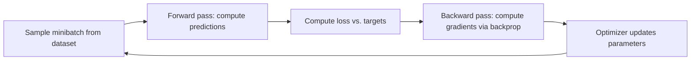

# ML Refresher for Engineers

Every behavior you will ever observe in a large language model — the fluency, the hallucinations, the sensitivity to phrasing, the cost profile — is downstream of one process: a very large function fitted to data by gradient descent. This chapter rebuilds that process from first principles at the depth an AI engineer needs: enough to reason correctly about *why* models behave as they do, without the derivations a training-focused role would require. We cover models as parameterized functions, loss functions as executable specifications, gradient descent and backpropagation as the optimization engine, generalization and overfitting, and — because you are an engineer — training versus inference as *systems* with radically different compute and memory profiles. The chapter closes by mapping the three learning paradigms (supervised, self-supervised, reinforcement) onto the LLM lifecycle you'll study in fnd-06 and fnd-07. Everything here is evergreen: this material predates LLMs and will outlive current architectures.

## Intuition: software written by optimization

A trained neural network is a program whose logic no human wrote. In conventional software, you encode the rules by hand: `if email contains "wire transfer" and sender is unknown, flag it`. In machine learning, you instead write three things — a *flexible function* with millions of tunable knobs (parameters), a *score* measuring how wrong the function's outputs are on examples (the loss), and an *optimizer* that nudges every knob to reduce that score — then let the data write the rules. The result behaves like software (deterministic function from input to output, given fixed parameters and settings) but was produced like a fitted curve.

This single reframing explains most of what surprises software engineers about ML systems:

- **The spec is the dataset.** The model does exactly what the training data rewarded — not what the designers intended. Every "weird" model behavior traces back to what the loss, on that data, actually incentivized. This is why data quality dominates architecture choice in practice, a theme that returns in ftn-03.
- **There is no line of code to fix.** When a model misbehaves, you cannot patch a conditional. You change the data, the loss, or the surrounding system. (As an AI engineer, "the surrounding system" — context, retrieval, validation — is usually your lever.)
- **Correctness is statistical.** A fitted function is judged by its error *rate* on unseen data, not by proofs. That property flows all the way up the stack to the evaluation discipline in module 5.

Hold onto the knobs metaphor: a modern LLM is this exact picture with the knob count in the billions and the "examples" being most of the public internet.

## Learning from first principles

Strip away every framework and buzzword, and supervised machine learning is four components.

**1. A model: a parameterized function.** $f_\theta(x)$ maps an input $x$ (an email, an image, a token sequence) to an output (a probability, a category, a next-token distribution), with behavior controlled by parameters $\theta$ — the knobs. A linear model has one knob per input feature. A neural network stacks layers of linear transformations, each followed by a simple nonlinearity (like $\max(0, z)$, the ReLU), which is what lets it represent decision logic far beyond straight lines. The universal-approximation results say such stacks can represent essentially any well-behaved function given enough width;[^goodfellow-dlbook] what they do *not* say is that gradient descent will find the right parameters — that part is empirical, and it works far better than anyone initially had a right to expect.

**2. Data: the specification.** A dataset of pairs $(x_i, y_i)$ — inputs with correct outputs — is the only place the task is defined. Nothing else in the system knows what "spam" or "good translation" means.

**3. A loss function: wrongness, made differentiable.** $L(f_\theta(x), y)$ returns a single number scoring how badly the model's output misses the target, averaged over the dataset. The loss is the objective the optimizer will actually pursue — which makes it the most consequential design decision in the pipeline. A model optimized for the wrong loss will faithfully achieve the wrong thing (the "specification gaming" theme that resurfaces at the product level in sec-05).

**4. An optimizer: parameter search by local improvement.** Training is the search for $\theta$ minimizing average loss. The search space is astronomically large, so exhaustive search is out; instead we use the loss's *gradient* — the direction in parameter space that increases loss fastest — and repeatedly step the other way. That is gradient descent, and essentially all of deep learning runs on it.

*The training loop that turns these four components into a learned program:*



The loop runs millions of times. Each iteration makes the model infinitesimally less wrong on one batch of examples; learning is the accumulation.

## Gradient descent mechanics

Gradient descent in its practical form — minibatch stochastic gradient descent (SGD) — has three moving parts an engineer should genuinely understand, because their fingerprints are on every trained model's behavior.[^cs231n-optim]

**The update rule.** Each step adjusts every parameter opposite to its gradient, scaled by the learning rate $\eta$:

$$\theta \leftarrow \theta - \eta \cdot \nabla_\theta L$$

The learning rate is the most sensitive hyperparameter in deep learning: too high and training diverges (loss explodes to NaN); too low and training crawls or gets stuck in poor regions. In practice $\eta$ is scheduled — warmed up from near zero, then decayed — rather than held constant.

**Minibatching.** Computing the exact gradient over the full dataset per step is wasteful; computing it on one example is noisy and leaves hardware idle. Minibatches (dozens to millions of examples, sized to fill GPU memory) give a cheap, noisy-but-unbiased gradient estimate per step. The noise is a feature, not just a compromise: it helps the optimizer escape bad regions of the loss surface. One full pass over the dataset is an *epoch*; LLM pretraining, notably, often runs for roughly a single epoch over its corpus — the dataset is that large.

**Adaptive optimizers.** Raw SGD scales every parameter's step by the same $\eta$. Adam — the de facto default — maintains a running mean and variance of each parameter's gradients and scales each step accordingly, making training far less sensitive to tuning.[^kingma-adam] The engineering consequence you'll meet again in prd-02 and ftn-02: Adam stores two extra values *per parameter*, which is a major reason training a model needs several times more memory than running it.

A useful mental picture: the loss as a landscape over parameter space — billions of dimensions, but picture rolling hills. Gradient descent is a ball rolling downhill in fog, feeling only the local slope, taking steps of size $\eta$. High-dimensional landscapes are gentler than the metaphor suggests (true local minima that trap training are rare; flat saddle regions are the real slowdowns[^goodfellow-dlbook]), but the fog matters: nothing about the process sees the destination, only the next step.

## Backpropagation and automatic differentiation

Backpropagation is the algorithm that makes gradient descent affordable: it computes the gradient of the loss with respect to *every* parameter in roughly the cost of two forward passes, rather than one forward pass *per parameter* (which, at billions of parameters, would be prohibitive).[^rumelhart-1986]

The idea is the chain rule from calculus, applied systematically. A neural network is a composition of simple operations, each with a known local derivative. The **forward pass** computes the output and caches each operation's intermediate result (its *activation*). The **backward pass** then walks the computation graph in reverse, multiplying local derivatives to accumulate exactly how much each parameter influenced the final loss. One backward sweep yields all gradients.

Modern frameworks implement this as **automatic differentiation (autodiff)**: every tensor operation you write is recorded onto a computation graph, and calling `loss.backward()` traverses that graph in reverse.[^pytorch-autograd] You will likely never implement backprop, but two of its mechanics have consequences you *will* meet:

- **Activation memory.** The forward pass must cache intermediate activations for the backward pass. During training, memory scales with batch size × sequence length × network depth — this, plus optimizer state, is why training memory dwarfs inference memory (quantified two sections down). Inference needs no such cache, which is also why inference-only frameworks can be so much leaner.
- **Gradient flow.** Gradients reaching early layers are products of many local derivatives. If those factors are mostly < 1 the product vanishes; mostly > 1, it explodes. Vanishing/exploding gradients made deep networks untrainable for decades; the fixes — residual connections, normalization layers, careful initialization — are precisely the "extra" components you'll find welded into the transformer in fnd-05. They are not decoration; they are what keeps a 100-layer network trainable.

For a hands-on rebuild of these mechanics in ~100 lines of Python, Karpathy's micrograd walkthrough (linked in Further reading) is the single best investment this chapter can recommend.

## The math that earns its place

Three formulas from this territory pay rent for an AI engineer — they explain behaviors you will observe weekly. (The update rule above was the first.)

**Softmax: scores into probabilities.** Networks output raw real-valued scores (*logits*), one per possible class or token. Softmax converts them into a probability distribution:

$$p_i = \frac{e^{z_i}}{\sum_j e^{z_j}}$$

Every LLM ends in exactly this operation over its vocabulary — "the model's output" is a probability distribution over next tokens, and everything in sampling (fnd-08: temperature literally divides the logits $z_i$ before this formula) manipulates it. Internalize softmax now and fnd-08 becomes obvious.

**Cross-entropy: the loss of language models.** When the target is a specific correct class/token $y$, cross-entropy loss is the negative log of the probability the model assigned to it:

$$L = -\log p_y$$

Assign the correct token probability 1.0 → loss 0. Assign it 0.01 → loss ≈ 4.6, with gradients pushing hard to fix it. Minimizing cross-entropy is exactly maximizing the likelihood of the training data — and *this is the entire pretraining objective of an LLM*: maximize the log-probability of each next token in the corpus (fnd-06). When you see "loss 2.1" on a training curve or perplexity numbers in a model card, you are looking at this quantity (perplexity is $e^L$).

**The gradient's meaning, in one sentence.** $\partial L / \partial \theta_k$ answers: "if knob $k$ turned slightly, how much would wrongness change?" — computed simultaneously for every knob by backprop. That is the entire calculus requirement of this curriculum.

Deliberately omitted as not earning their place here: matrix calculus details, convergence proofs, and information-theoretic derivations of cross-entropy — pointers in Further reading if you want them.[^goodfellow-dlbook]

## Generalization, overfitting, and the data you didn't train on

Minimizing training loss is not the goal — it is a proxy for the goal. What matters is loss on data the model has *never seen*, because that is what production traffic is. The gap between the two is the central tension of all machine learning.

**Overfitting** is what happens when a flexible-enough model reduces training loss by *memorizing* the training set's specifics rather than learning generalizable structure. The classic signature: training loss keeps falling while held-out validation loss bottoms out and climbs.

| Signal | Underfitting | Healthy fit | Overfitting |
|---|---|---|---|
| Training loss | High | Low | Very low → near zero |
| Validation loss | High (≈ training) | Low (≈ training) | Rising, gap widens |
| Diagnosis | Model/training insufficient | — | Model memorizing specifics |
| First remedies | Bigger model, longer training | — | More data, regularization, early stopping |

The discipline that guards against fooling yourself is **data splitting**: a *training* set the optimizer sees, a *validation* set for tuning decisions, and a *test* set touched only for final measurement. Every time you make a choice based on a dataset, you leak information into that choice — tune on the test set and its score becomes meaningless. This exact discipline reappears, with the same failure mode, in LLM evaluation: benchmark contamination (fnd-09) and eval-set overfitting (evl-02) are this section wearing new clothes. So is the general phenomenon behind Goodhart's law — optimize a proxy hard enough and it stops proxying.

**Regularization** is the toolkit for pushing models toward generalizable structure: weight decay (penalize large parameters), dropout (randomly silence units during training so no single pathway can memorize),[^srivastava-dropout] early stopping (halt when validation loss turns), and — always the strongest lever — *more and better data*.

One modern wrinkle worth knowing because it broke the classical intuition: **the bias–variance picture predicts that ever-bigger models must eventually overfit more, yet very large neural networks often generalize *better* as they grow** — validation error can worsen then improve again as scale increases ("double descent").[^nakkiran-dd] This empirical surprise is part of why the field kept scaling models up, and it flows directly into the scaling laws of fnd-06. The classical intuitions still govern the small-data regime you'll occupy when fine-tuning (module 8) — there, overfitting is alive, well, and waiting for you.

## Training versus inference as systems

Training and inference run the same mathematical function but are opposite engineering problems. As an AI engineer you will mostly *operate* inference and *reason about* training; the asymmetry between them explains pricing, latency, and hardware realities you'll deal with constantly.

**Compute shape.** Training = forward pass + backward pass + optimizer update, repeated over a fixed corpus; throughput-oriented, latency-irrelevant, runs for weeks on synchronized GPU clusters, restartable from checkpoints. Inference = forward pass only, on demand; latency-oriented (a user is waiting), spiky, must not fail. Roughly, the backward pass costs ~2× the forward pass, so training costs ~3× inference *per example seen* — before counting that training sees trillions of examples.

**Memory shape.** The numbers every AI engineer should be able to reproduce on a napkin, for a model with $P$ parameters:[^rajbhandari-zero]

- **Inference:** parameters only (plus a working buffer): ~2 bytes/param at 16-bit precision → a 7B-parameter model needs **~14 GB** — this is why it fits on one high-end GPU, and why quantization to 8/4-bit (prd-03) matters so much.
- **Training (Adam, mixed precision):** ~16 bytes/param — 16-bit weights and gradients, plus 32-bit master weights and two Adam moments — → the same 7B model needs **~112 GB** *before activations*, which add a batch-size-dependent surcharge on top. This is why training even modest models requires multiple GPUs and sharding strategies, and why "just fine-tune it" is not a casual sentence (parameter-efficient methods in ftn-02 exist precisely to collapse this footprint).

**Determinism.** Given fixed weights, greedy decoding, and identical software, inference is deterministic in principle; in practice, floating-point non-associativity under varying GPU batch composition means even "deterministic" settings can produce run-to-run variation in production serving. Training is deliberately stochastic (shuffling, dropout, initialization). Engineering consequence: never build a system that assumes bit-identical LLM outputs across calls; build evals that measure distributions (module 5).

A useful summary contrast — training is *compiling* the program from data (slow, expensive, occasional); inference is *running* it (fast, cheap, constant). Almost everything in module 6 is about making the "running" half efficient.

## The three learning paradigms, mapped to LLMs

Three paradigms of learning cover the field, and — the payoff of this section — the LLM lifecycle you'll study in fnd-06/fnd-07 uses all three in sequence.

**Supervised learning** fits $f_\theta$ to explicit (input → correct output) pairs, as this chapter has assumed throughout. Its bottleneck is labeling cost: correct outputs come from humans. In the LLM lifecycle this is **instruction tuning (SFT)** — thousands of human-written (prompt → good response) demonstrations teaching a pretrained model the assistant format (fnd-07).

**Self-supervised learning** manufactures labels from the data itself, removing the labeling bottleneck entirely: hide part of the data and train the model to predict it. Next-token prediction — given all preceding text, predict the following token — is self-supervision on raw text, and it is **the pretraining objective** (fnd-06). The profound part: text is its own supervision, so the entire internet becomes training data with zero human labeling. This is the trick that makes foundation models economically possible, and it's also why embeddings (fnd-03) can be learned from unlabeled corpora.

**Reinforcement learning (RL)** handles settings with no correct-answer labels at all — only a *reward* signal scoring outcomes of the model's own attempts. The model generates, gets scored, and is updated to make high-reward behavior more likely. In the LLM lifecycle this is **RLHF and successors** — the reward encodes human preferences ("which of these two responses is better?") — and, in the current reasoning-model era, rewards from automatically verifiable outcomes like passing tests or correct math (fnd-07, ftn-05). RL is the most powerful and least stable of the three: reward design errors get amplified into policy, which is the technical root of the specification-gaming concerns in sec-05.

The one-line summary worth memorizing: **pretraining is self-supervised (capability), instruction tuning is supervised (format and helpfulness), preference/reasoning training is RL (alignment with what humans actually want)**.

## The training loop in code

The concepts above compress into remarkably little code, and reading the canonical loop cements where each concept lives. The following is a complete, runnable PyTorch training loop for a small classifier — every line maps to a section of this chapter:

```python
import torch
from torch import nn

model = nn.Sequential(              # the parameterized function f_theta
    nn.Linear(784, 256), nn.ReLU(), # layers + nonlinearity
    nn.Linear(256, 10),             # 10 output logits
)
loss_fn = nn.CrossEntropyLoss()     # -log p_correct  (softmax built in)
opt = torch.optim.AdamW(model.parameters(), lr=3e-4, weight_decay=0.01)

for epoch in range(10):
    model.train()
    for x, y in train_loader:       # minibatch SGD
        logits = model(x)           # forward pass (activations cached)
        loss = loss_fn(logits, y)   # scalar wrongness
        opt.zero_grad()
        loss.backward()             # backprop: gradients for every param
        opt.step()                  # theta <- theta - lr * adapted gradient

    model.eval()                    # disables dropout etc.
    with torch.no_grad():           # inference mode: no activation caching
        val_loss = sum(loss_fn(model(x), y) for x, y in val_loader)
    print(epoch, val_loss)          # watch for the overfitting signature
```

Note three details that trip up newcomers: `zero_grad()` (gradients *accumulate* by default — forgetting this silently corrupts training), the `train()`/`eval()` mode switch (dropout and normalization behave differently per mode), and `no_grad()` for inference (skips activation caching — the training-vs-inference memory asymmetry, visible as a context manager).

## Historical evolution in four acts

Compressed to what explains today's landscape. **(1) 1958–1986: from perceptron to backprop.** Single-layer learning machines (perceptrons) hit a representational wall; the 1986 popularization of backpropagation showed multi-layer networks could be trained,[^rumelhart-1986] but compute and data weren't there yet, and simpler methods (SVMs, boosted trees) ruled applied ML for two more decades. **(2) 2012: deep learning works.** AlexNet halved the error rate on the ImageNet benchmark using a deep network trained on GPUs[^krizhevsky-2012] — the demonstration that scale (data + compute) beats hand-engineered features. The field re-formed around that lesson. **(3) 2012–2017: deep learning eats perception**, one domain at a time (vision, speech, translation), each with bespoke architectures. **(4) 2017–present: one architecture, scaled.** The transformer (fnd-05) turned out to scale better than everything else; the field consolidated onto it and rode the scaling laws (fnd-06) to foundation models. The recurring moral — general methods riding compute beat clever hand-engineering, known as "the bitter lesson" — is the single most predictive heuristic for where the field goes next.

## Common misconceptions

- **"The model understands the task."** The model minimized a loss on data. Where data and intent diverge, the model follows the data — always. Behaviors that look like misunderstanding are usually faithful optimization of a misspecified objective.
- **"Training loss going down means it's working."** Only validation performance counts. Training loss reliably decreases even while the model memorizes noise.
- **"More parameters always means overfitting."** Classical intuition, empirically violated at modern scale (double descent[^nakkiran-dd]). At LLM scale, bigger models generalize better, holding data and training quality constant. In *your* fine-tuning projects with small datasets, the classical intuition still applies.
- **"Neural networks are black boxes, so nothing can be reasoned about."** The training process is fully understood even where the learned representations aren't. You can reason precisely about what the objective incentivized, what data distributions were seen, and what the memory/compute profile is — which is most of what an engineer needs.
- **"Gradient descent finds the best solution."** It finds *a* good local solution from a random start, in fog. Different runs find different solutions of similar quality. There is no global-optimality guarantee anywhere in deep learning — it works because good-enough basins are everywhere at scale.
- **"Inference is trivially cheap since it's just a forward pass."** Cheap *per call* relative to training, but it runs forever at production scale; the industry's aggregate inference bill exceeds its training bill. Module 6 exists because of this.

## Failure modes and trade-offs

- **Data leakage** — information from validation/test contaminating training (duplicates across splits, preprocessing fitted on all data, tuning against the test set). Produces excellent metrics and a product that fails on launch. The LLM-era version, benchmark contamination, is endemic (fnd-09). *Trade-off:* rigorous splits cost data volume; there is no honest way around paying it.
- **Objective misspecification** — the loss rewards a proxy, the model optimizes the proxy, the proxy diverges from intent exactly where it matters. *Trade-off:* richer objectives (human feedback, RL) close the gap but import instability and reward-hacking risks (fnd-07).
- **Distribution shift** — production inputs drift from training data (new slang, new document formats, adversarial users); accuracy decays silently. *Trade-off:* monitoring and refresh pipelines (evl-05) cost ongoing effort; skipping them costs silent rot.
- **Training instability** — divergence, NaN losses, sensitivity to learning rate and initialization. Mostly a model-trainer's problem, but you'll meet it in fine-tuning (module 8). *Trade-off:* conservative hyperparameters are stable but slow; aggressive ones are fast until they explode.
- **Compute/quality/latency triangle** — bigger models fit more but cost more to train *and* serve forever after. Model size decisions are unit-economics decisions; this becomes your daily bread in api-06 and prd-05.

## Best practices

For the fine-tuning and evaluation work in your future (modules 5 and 8), the field's hard-won operational wisdom:[^karpathy-recipe]

- **Look at your data. Then look again.** More projects die from unexamined data than from any modeling choice. Before training or evaluating anything, read dozens of raw examples end to end.
- **Establish dumb baselines first.** A majority-class predictor, a keyword rule, a linear model. If the neural network barely beats the baseline, the problem — or the data — needs rethinking before scale does.
- **Overfit a tiny subset as a smoke test.** A correct training setup can drive loss to ~zero on 50 examples. If it can't, there's a bug — this catches broken pipelines in minutes.
- **Change one thing at a time and keep an experiment log.** Training runs are expensive experiments; without controlled comparisons and recorded configs, you learn nothing from them. (Discipline that transfers directly to prompt iteration, evl-06.)
- **Guard the test set like production credentials.** Decide splits before experimenting; automate the separation; treat every "quick peek" as the leak it is.
- **Security posture:** training data is an attack surface (data poisoning — corrupted examples implant targeted behaviors) and a liability surface (models can memorize and regurgitate secrets or PII present in training data). Provenance-check what you train on; scrub sensitive data before it enters any training pipeline (sec-03).
- **Scaling posture:** before scaling model size, scale data quality; before distributed training, exhaust one-GPU efficiency (mixed precision, gradient accumulation). Complexity added below the bottleneck is pure cost.

## Real-world examples

**A spam filter, then and now.** The 2015 build: label 100k emails, engineer features, train a classifier — supervised learning end to end, weeks of work, one narrow capability. The 2026 build: a prompt to a foundation model, possibly with a few dozen examples, hours of work. The entire economics of applied ML shifted because pretraining (self-supervised, someone else's expense) now amortizes capability across all downstream tasks. Understanding *why* — transfer from the pretraining objective — is understanding this chapter.

**A fine-tune that "worked" and then didn't.** A team fine-tunes a model on 2,000 support transcripts; validation accuracy is excellent; production quality is poor. Post-mortem: near-duplicate transcripts landed in both train and validation splits (leakage), so validation measured memorization. The fix — deduplicate, split by *customer* rather than by transcript — dropped validation accuracy 15 points to an honest number, which then predicted production well. Every concept in that story is from this chapter, and versions of it happen weekly across the industry (this is also why evl-02 obsesses over split hygiene).

**Reading a training curve.** An engineer fine-tuning in ftn-04 watches two lines: training loss falling smoothly, validation loss falling, flattening… then rising at epoch 3. Action: stop, take the epoch-3 checkpoint (early stopping), and note that the dataset — not more epochs — is the binding constraint. Thirty seconds of chart-reading, entirely powered by the overfitting section above.

## Interview questions

1. **"Explain gradient descent to a backend engineer with no ML background."** — Model answer: a model is a function with millions of tunable knobs; the loss is a single number scoring how wrong it is on examples. The gradient tells you, for every knob simultaneously, which direction of turn reduces wrongness. Gradient descent repeats: measure wrongness on a batch, compute the gradient via backpropagation, nudge every knob a small step (the learning rate) downhill, millions of times. Nothing sees the destination — only the local slope — which is why training can settle in different, similarly good solutions each run.

2. **"Why do we minimize cross-entropy rather than accuracy directly?"** — Model answer: accuracy is a step function — flat almost everywhere, undefined slope at the boundary — so its gradient is zero and gives the optimizer nothing to follow. Cross-entropy, the negative log-probability of the correct answer, is smooth and differentiable: it rewards moving probability *toward* the right answer even before the top prediction flips, providing a learning signal everywhere. It's also maximum-likelihood estimation, and it's the exact objective LLMs pretrain on.

3. **"Training loss down, validation loss up — what's happening and what do you do?"** — Model answer: overfitting; the model is memorizing training-set specifics instead of learning generalizable structure. Remedies in order of preference: more/better training data, then regularization (weight decay, dropout, data augmentation), then early stopping at the validation minimum, then a smaller model. Also audit for the opposite trap first — if validation was *ever* suspiciously good, check for leakage between splits.

4. **"Why does training a 7B model need ~100+ GB while inference needs ~14 GB?"** — Model answer: inference stores parameters only — ~2 bytes each in 16-bit. Training with Adam in mixed precision stores ~16 bytes per parameter: 16-bit weights and gradients plus 32-bit master weights and two optimizer moments — and on top of that, backpropagation must cache every layer's forward activations (scaling with batch × sequence length) to compute gradients. Roughly 8× on parameter state alone, more with activations — which is why parameter-efficient fine-tuning methods exist.

5. **"What's the difference between supervised, self-supervised, and reinforcement learning — and where does an LLM use each?"** — Model answer: supervised learns from explicit human-labeled input→output pairs; self-supervised manufactures labels from the data itself (hide part, predict it); RL learns from reward signals on the model's own generated behavior. An LLM uses all three in sequence: self-supervised next-token pretraining builds capability from raw text at internet scale; supervised instruction tuning teaches the assistant format from human demonstrations; RL from human or verifiable feedback aligns outputs with preferences and trains reasoning.

6. **"Your team's model has 99% validation accuracy and fails in production. Give three hypotheses and how you'd test each."** — Model answer: (1) leakage — near-duplicates across splits or tuning against the test set; test by deduplicating and re-splitting on a coarser key (user, document) and re-measuring. (2) distribution shift — production inputs differ from the dataset; test by sampling real production inputs, labeling a slice, and comparing metrics. (3) metric mismatch — validation measures a proxy (e.g. per-example accuracy) while production pain is concentrated in a subpopulation or in the cases that matter; test by segmenting the eval and by defining a metric from actual failure reports.

7. **"Why can't you just patch a model the way you patch code?"** — Model answer: the behavior isn't localized in any inspectable line — it's distributed across billions of parameters shaped by an optimization process. Interventions operate at the level of what shaped the behavior: change the data or objective and retrain/fine-tune, or change the surrounding system — the context provided, output validation, tool constraints. As an AI engineer, the surrounding system is usually the cheapest and safest lever, which is why modules 3–5 of this curriculum exist.

## Exercises and mini-project

**Exercises**

1. By hand, run three iterations of gradient descent on $L(\theta) = (\theta - 3)^2$ starting from $\theta = 0$ with $\eta = 0.1$ (the gradient is $2(\theta-3)$). Then redo with $\eta = 1.1$ and describe what you observe. You have now personally experienced learning-rate divergence.
2. Compute cross-entropy loss for a model that assigns the correct token probability 0.9, 0.5, 0.1, and 0.001. At which point does the loss's growth accelerate, and what does that imply about what gradient descent prioritizes fixing?
3. Napkin math: estimate inference and Adam-training memory for models of 1B, 8B, and 70B parameters at 16-bit precision (ignore activations). For each, state the smallest count of 80 GB GPUs that could hold it.
4. List three ways validation data can leak into training in a text dataset scraped from the web, and a mitigation for each. Keep this list — it returns nearly verbatim as benchmark contamination in fnd-09.
5. For each: spam filtering with labeled emails, learning word representations from raw Wikipedia, training a model to win at chess by self-play — name the paradigm and the source of the learning signal.

**Mini-project: train, overfit, regularize.** In a notebook with PyTorch: (a) train the MLP from this chapter's code listing on MNIST (or FashionMNIST), plotting train and validation loss per epoch; (b) force overfitting — restrict training to 500 examples and train 100+ epochs — and identify the epoch where the curves diverge; (c) apply two remedies (weight decay, dropout, or early stopping) and compare curves; (d) run the smoke test: verify your setup can drive training loss to ~0 on 50 examples; (e) write a five-sentence summary connecting each observed curve to this chapter's vocabulary. Target: 2–3 hours. Success criterion: you can produce and *diagnose* an overfitting curve on demand.

**Capstone extension:** in module 8 you will fine-tune a language model on your capstone's domain data; the split-hygiene, training-curve reading, and smoke-test disciplines from this project apply there unchanged — only the scale changes.

## Revision summary

- ML replaces hand-written rules with a parameterized function ($f_\theta$), a differentiable loss (the executable spec), data (the actual spec), and an optimizer. The model does what the loss-on-data incentivized — never more, never what you merely intended.
- Gradient descent: $\theta \leftarrow \theta - \eta \nabla_\theta L$, on minibatches, with adaptive optimizers (Adam) as the default. Backprop computes all gradients in one reverse sweep by the chain rule, at the price of caching activations.
- Softmax turns logits into a probability distribution; cross-entropy ($-\log p_y$) is the pretraining loss of every LLM; perplexity is its exponential.
- Only validation performance counts. Overfitting = memorization, visible as diverging train/val curves; remedies: data, regularization, early stopping. Guard test sets absolutely; leakage is the classic silent killer, and benchmark contamination is its LLM reincarnation.
- Training ≈ 16 bytes/param (Adam, mixed precision) + activations; inference ≈ 2 bytes/param. Training is throughput-bound compilation; inference is latency-bound execution.
- LLM lifecycle = self-supervised pretraining (capability) → supervised instruction tuning (format) → RL from feedback (alignment/reasoning).

## Flashcards

| Q | A |
|---|---|
| The four components of supervised ML? | Parameterized model $f_\theta$, dataset (the spec), differentiable loss, optimizer. |
| Gradient descent update rule? | $\theta \leftarrow \theta - \eta \cdot \nabla_\theta L$ — step every parameter against its gradient, scaled by the learning rate. |
| What does backprop buy, at what cost? | All parameter gradients in ~2× forward-pass cost (vs. one pass per parameter); cost: activations cached in memory. |
| Cross-entropy loss formula and its LLM significance? | $L = -\log p_y$; it is the next-token pretraining objective; perplexity $= e^L$. |
| Overfitting signature on curves? | Training loss keeps falling; validation loss bottoms out and rises; gap widens. |
| Approx. memory per parameter: 16-bit inference vs. Adam mixed-precision training? | ~2 bytes vs. ~16 bytes (weights+grads in 16-bit, fp32 master weights + two moments) — before activations. |
| Why is minibatch noise tolerated (even welcomed)? | Unbiased gradient estimates at a fraction of full-batch cost; the noise helps escape bad regions. |
| Three learning paradigms → LLM lifecycle stages? | Self-supervised → pretraining; supervised → instruction tuning (SFT); RL → RLHF/preference & reasoning training. |
| What is double descent? | At modern scale, validation error can worsen then improve again as model size grows — violating classical bias-variance intuition. |
| First debugging step for any training pipeline? | Overfit a tiny subset (~50 examples) to ~zero loss; failure means a setup bug, not a data problem. |

## Further reading

- **Official docs:** PyTorch, "Autograd mechanics"[^pytorch-autograd] — read after the mini-project, when the forward/backward cache is concrete.
- **Papers:** Rumelhart, Hinton & Williams (1986)[^rumelhart-1986] — short, readable, historic; Kingma & Ba, "Adam" (2014)[^kingma-adam] — §2 only; Nakkiran et al., "Deep Double Descent" (2019)[^nakkiran-dd] — figures tell the story.
- **Books:** Goodfellow, Bengio & Courville, *Deep Learning*, chs. 4–8[^goodfellow-dlbook] — the rigorous version of this chapter, free online.
- **Talks:** Karpathy, "The spelled-out intro to neural networks and backpropagation: building micrograd" (YouTube, 2022) — build backprop by hand in 2.5 hours; the single highest-value companion to this chapter.
- **Tutorials:** Stanford CS231n optimization notes[^cs231n-optim]; Karpathy, "A Recipe for Training Neural Networks"[^karpathy-recipe] — the operational best-practices canon.

## Check your understanding

1. Without looking: write the gradient descent update rule, name each symbol, and state what goes wrong when $\eta$ is too large and too small.
2. Explain to a colleague why an LLM's entire pretraining reduces to cross-entropy on next tokens, and what perplexity measures.
3. Your fine-tune shows 99% validation accuracy. Give the two-question checklist from this chapter you run *before* celebrating.
4. Reproduce the napkin memory math for a 8B-parameter model: inference at 16-bit, training with Adam at mixed precision. Which line item did you have to remember beyond the parameters themselves?
5. Map each LLM lifecycle stage (pretraining, SFT, RLHF) to its learning paradigm and its supervision source.

## Sources

[^rumelhart-1986]: [T2] Rumelhart, Hinton & Williams (1986). "Learning representations by back-propagating errors." Nature 323, 533–536. https://www.nature.com/articles/323533a0 (accessed 2026-07-08)
[^goodfellow-dlbook]: [T3] Goodfellow, Bengio & Courville (2016). *Deep Learning*, chs. 4–8. MIT Press. https://www.deeplearningbook.org/ (accessed 2026-07-08)
[^cs231n-optim]: [T3] Stanford CS231n. "Optimization: Stochastic Gradient Descent." https://cs231n.github.io/optimization-1/ (accessed 2026-07-08)
[^pytorch-autograd]: [T1] PyTorch. "Autograd mechanics." PyTorch documentation. https://pytorch.org/docs/stable/notes/autograd.html (accessed 2026-07-08)
[^kingma-adam]: [T2] Kingma & Ba (2014). "Adam: A Method for Stochastic Optimization." arXiv:1412.6980. https://arxiv.org/abs/1412.6980 (accessed 2026-07-08)
[^srivastava-dropout]: [T2] Srivastava et al. (2014). "Dropout: A Simple Way to Prevent Neural Networks from Overfitting." JMLR 15. https://jmlr.org/papers/v15/srivastava14a.html (accessed 2026-07-08)
[^nakkiran-dd]: [T2] Nakkiran et al. (2019). "Deep Double Descent: Where Bigger Models and More Data Hurt." arXiv:1912.02292. https://arxiv.org/abs/1912.02292 (accessed 2026-07-08)
[^krizhevsky-2012]: [T2] Krizhevsky, Sutskever & Hinton (2012). "ImageNet Classification with Deep Convolutional Neural Networks." NeurIPS 25. https://papers.nips.cc/paper/2012/hash/c399862d3b9d6b76c8436e924a68c45b-Abstract.html (accessed 2026-07-08)
[^rajbhandari-zero]: [T2] Rajbhandari et al. (2019). "ZeRO: Memory Optimizations Toward Training Trillion Parameter Models." arXiv:1910.02054. https://arxiv.org/abs/1910.02054 (accessed 2026-07-08)
[^karpathy-recipe]: [T4] Karpathy (2019). "A Recipe for Training Neural Networks." https://karpathy.github.io/2019/04/25/recipe/ (accessed 2026-07-08)
