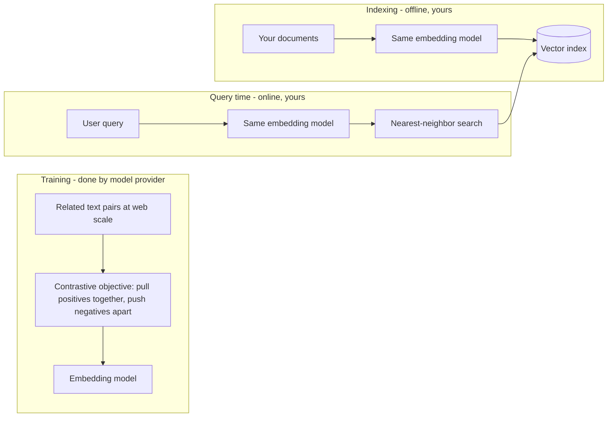

# Embeddings & Representation Learning

Embeddings are the data structure of the AI era: fixed-length vectors of floating-point numbers, learned so that geometric closeness approximates semantic relatedness. They are how search engines match "laptop won't turn on" to a document titled "notebook power troubleshooting," how RAG systems (module 3) find the passages a model needs, and — inside every LLM — how tokens enter the network in the first place. This chapter builds the concept from first principles: why dense learned vectors beat symbolic representations, how embedding models are trained, the small amount of geometry you need (dot products, cosine similarity, normalization), and the production realities — versioning, domain shift, cost — that every retrieval system inherits from its embedding layer. The ideas here are evergreen; they predate LLMs and every later retrieval chapter stands on them.

## Intuition: meaning as location

Imagine a map where every piece of text has coordinates, and the mapmaker's only rule is: *things that mean similar things must be placed near each other*. "Car" sits near "automobile," near "vehicle," a bit further from "truck," very far from "photosynthesis." A question lands near the documents that answer it. That map is an embedding space — except it has hundreds or thousands of dimensions instead of two, because meaning has far too many independent ways to vary (topic, tone, tense, specificity, language…) to fit on a flat sheet.

The power of the construction is that it converts a hard symbolic problem — "do these two texts mean the same thing?" — into cheap arithmetic: measure the distance between two points. Distance computations are fast, indexable, and language-agnostic. Once meaning is geometry, the entire toolkit of spatial data structures applies, which is exactly what vector search ([rag-02](../03-retrieval/rag-02-vector-search.md)) exploits at scale.

Where do the coordinates come from? Nobody assigns them. A neural network learns them, by being trained on an objective that *forces* similar things together — the subject of the mechanics section below. This is **representation learning**: the network discovers the map as a side effect of solving a prediction task, the same way the LLMs of fnd-02 learn everything else.

## From symbols to vectors, from first principles

To see why learned dense vectors won, start with the naive alternative. The classic symbolic representation of a word is **one-hot**: a vector as long as the vocabulary, all zeros except a single 1 at that word's index. One-hot vectors have two fatal flaws. They are enormous (vocabulary-sized), and — worse — *every pair of distinct words is equally distant*. "Car" is exactly as far from "automobile" as from "photosynthesis"; the representation encodes identity and nothing else. All similarity structure must then be bolted on by hand (synonym lists, ontologies), which never scales and never keeps up with language.

The escape route is one of the oldest ideas in linguistics, the **distributional hypothesis**: words that occur in similar contexts have similar meanings — "you shall know a word by the company it keeps."[^jurafsky-slp] Context is observable at scale in raw text, no labels required. So instead of a vocabulary-sized identity vector, give each word a short *dense* vector — a few hundred learned numbers — and train those numbers so that words appearing in similar contexts end up with similar vectors. Dense vectors fix both flaws at once: they are compact, and similarity is now *encoded in the representation itself*, learned from evidence rather than curated by hand.

The same logic lifts from words to any object with observable co-occurrence structure: sentences, documents, code snippets, images and their captions, products and the users who buy them. Anything you can define "appears in similar contexts" for, you can embed — which is why the technique escaped NLP and became general infrastructure.

## How embedding models are learned

Three generations of training recipes, each fixing the previous one's weakness, take you from 2013 to the models you'll call via API today.

**Prediction-based word vectors.** word2vec made dense word vectors practical with a disarmingly simple objective: given a word, predict its neighbors within a small window (or vice versa).[^mikolov-2013] The network is tiny — the embeddings *are* most of the parameters — and the objective forces the geometry: words in similar contexts must produce similar predictions, so gradient descent (fnd-02's engine, unchanged) pushes their vectors together. The famous side effect was that some relationships became directions in the space (the *king − man + woman ≈ queen* pattern), evidence that the geometry captured structure nobody explicitly asked for. Limitation: one fixed vector per word, so "bank" (river) and "bank" (finance) share coordinates.

**Contextual embeddings.** Transformer models trained on masked-word prediction, with BERT as the landmark, produce a *different* vector for each word occurrence depending on its sentence.[^devlin-2018] Polysemy solved. But a new problem appeared for retrieval: averaging BERT's token vectors into a sentence vector gives mediocre sentence similarity, because nothing in the training objective ever asked whole sentences to be comparable.

**Contrastive sentence embeddings — the modern recipe.** Today's embedding models are trained *directly* on the geometry you want, with a contrastive objective: take pairs known to be related (question ↔ its answer, duplicate questions, a passage ↔ its paraphrase, mined at web scale), and train the model to pull each positive pair's vectors together while pushing apart the vectors of everything else in the batch (in-batch negatives — every other example doubles as a counterexample, which is why large batches help). Sentence-BERT established the pattern;[^reimers-2019] modern API and open-weight embedding models are this recipe scaled up in data, model size, and hard-negative mining, typically exposed through a simple text-in/vector-out interface.[^openai-embeddings][^sbert-docs]

*The lifecycle every embedding-powered system shares — training happens once (usually someone else's job); the two runtime paths must use the same model:*

The diagram's repeated box is the point: **document vectors and query vectors are only comparable if produced by the same model** — the root of the versioning problem covered under production concerns below.

## The math that earns its place

Embedding arithmetic is three definitions deep, and interviews plus daily debugging draw on all three.

**Dot product.** For vectors $a$ and $b$: $a \cdot b = \sum_i a_i b_i$ — large when the vectors point the same way with large magnitudes. It is the cheapest similarity primitive (one multiply-add per dimension) and the one hardware accelerates best.

**Cosine similarity** is the dot product with magnitude divided out:

$$\text{cos}(a, b) = \frac{a \cdot b}{\lVert a \rVert \, \lVert b \rVert} \in [-1, 1]$$

It measures *direction agreement only*, which is what you want for text: a long rambling document and a terse query about the same topic should match on topic, not on verbosity. In embedding spaces, vector magnitude often correlates with text length and token frequency — nuisance signals for similarity — so normalizing them away is the sensible default.

**Normalization collapses the two.** If you scale every vector to unit length ($\hat{a} = a / \lVert a \rVert$) once at embedding time, then cosine similarity *is* the dot product, and Euclidean distance becomes a monotonic function of it ($\lVert \hat{a} - \hat{b} \rVert^2 = 2 - 2\,\hat{a}\cdot\hat{b}$) — all three metrics produce the same ranking. This is why "which distance metric?" is usually a non-question in practice: normalize on write, use dot product, move on. Many APIs return pre-normalized vectors;[^openai-embeddings] check rather than assume, because mixing normalized and unnormalized vectors in one index silently corrupts rankings.

What deliberately does *not* earn its place here: the contrastive loss formula (InfoNCE) and dimensionality-reduction math (PCA/UMAP internals). Pointers live in Further reading.

## Anatomy of an embedding space

Working knowledge of what the space actually looks like prevents a class of silent mistakes.

- **Dimensions are not interpretable.** No axis means "formality" or "topic." Meaningful properties exist as *directions* that are linear combinations of axes, discovered by the optimizer and different in every trained model. Never reason about individual coordinates.
- **Dimensionality is a capacity/cost dial.** Common sizes run from a few hundred to a few thousand dimensions. More dimensions capture finer distinctions but cost linearly more storage, memory, and search compute — at millions of vectors, dimension choice is a real budget line. Some modern models are trained so a truncated prefix of the vector remains a valid coarse embedding ("matryoshka-style"), letting one model serve several cost tiers; treat availability of that property as model-specific.
- **Similarity scores are relative, not absolute.** A cosine of 0.83 means nothing across models, and thresholds do not transfer: embedding spaces are often *anisotropic* — vectors bunch into a narrow cone, compressing the usable score range (typical corpus pairs might all score between, say, 0.6 and 0.9). Calibrate thresholds per model, on your data, empirically.
- **The space reflects its training distribution.** Text unlike the training data — dense legalese, medical codes, your company's internal jargon — lands in poorly organized regions where distances stop tracking meaning. This is *domain shift*, the same phenomenon flagged in fnd-02, and the number-one reason retrieval quality disappoints ([rag-02](../03-retrieval/rag-02-vector-search.md) covers remedies, including fine-tuned embedders).

## Production engineering perspective

Embeddings look like a stateless utility function; operationally, they behave like a *schema*, and mature teams treat them that way.

**The versioning problem is the big one.** Every vector in your index is bound to the exact model (and preprocessing) that produced it. Upgrade the embedding model — or have a provider deprecate it under you — and every stored vector must be regenerated, because vectors from different models live in unrelated coordinate systems. For a large corpus that is a real migration: budget for it, keep raw text alongside vectors (vectors are derived data — always rebuildable, never the system of record), and record `embedding_model_version` as metadata on every vector so a mixed index is detectable rather than silent.

**Cost and latency shape architecture.** Embedding calls are cheap per unit but multiply fast: chunk counts in the millions at indexing time, one call per query at runtime on the critical path. Standard mitigations: batch aggressively when indexing, cache query embeddings for repeated queries, and consider a small local model for high-QPS workloads where per-call API latency dominates.

**Model selection is an eval problem, not a leaderboard lookup.** Public benchmarks like MTEB aggregate performance across many tasks and domains;[^muennighoff-mteb] they shortlist candidates but routinely misrank them *for your corpus and query style*. The professional move — same doctrine as evl-01 — is a small retrieval eval on your own data (real queries, labeled relevant documents) run against 2–3 candidate models. It takes a day and regularly reverses leaderboard order.

> **Volatile:** which embedding models lead on quality/cost, current price points, dimension options, and matryoshka support all churn on provider cycles. The selection *procedure* above is stable; the shortlist is not. Check provider documentation at decision time.[^openai-embeddings]

**Security note.** Embeddings are not encryption: inversion attacks can reconstruct substantial parts of the original text from its vector. Treat vector stores with the same access controls and data classification as the source documents (sec-03 develops the governance side).

## Historical evolution

The compressed lineage: **count-based vectors** (documents × terms matrices, LSA; 1990s) established meaning-as-geometry but scaled poorly. **word2vec (2013)** made dense learned vectors cheap and shockingly effective, igniting the field.[^mikolov-2013] **Contextual models (2018)** — ELMo, then BERT[^devlin-2018] — solved polysemy by conditioning on the sentence. **Sentence-BERT (2019)** made whole-text embeddings retrieval-grade via contrastive training.[^reimers-2019] **The API era (2022–)** turned embeddings into managed infrastructure and, with LLM-powered RAG as the killer app, into one of the most-called API categories in the industry. Each turn is the same move: stop hand-engineering what similarity means, and let a bigger model learn it from more data — the bitter-lesson pattern from fnd-02, again.

## Common misconceptions

- **"High cosine similarity means the texts say the same thing."** It means the model places them nearby — usually topical relatedness, not agreement. "The drug is safe" and "the drug is not safe" often embed very close together: same topic, opposite claims. Negation, numbers, and entity swaps are systematic blind spots; anything requiring *factual* equivalence needs a stronger check (reranking or an LLM judge — rag-06, evl-03).
- **"There is one embedding space."** Every model defines its own incompatible geometry. Vectors from two models cannot be compared, averaged, or mixed in one index — ever.
- **"Similarity thresholds are portable."** A 0.8 in one model's space may be commonplace in another's. Thresholds are per-model, per-corpus empirical quantities.
- **"The king − man + woman thing means embeddings do symbolic reasoning."** Analogy arithmetic is a fragile artifact of word-vector geometry, cute in demos and unreliable in practice; it is not a mechanism you should build product logic on.[^jurafsky-slp]
- **"Longer text, better embedding."** A single vector is a fixed-capacity summary. Embed a 30-page document whole and you get its centroid — a blurry average that matches nothing specific. This is *the* reason chunking exists ([rag-04](../03-retrieval/rag-04-chunking.md)).

## Failure modes and trade-offs

- **Domain shift** — the model has never seen text like yours; distances degrade silently, retrieval returns plausible-looking but wrong neighbors. *Detection:* your own eval set. *Remedies:* different model, hybrid search with keyword matching (rag-06), or embedder fine-tuning. *Trade-off:* fine-tuning buys quality at the price of owning the versioning/reindex cycle forever after.
- **Asymmetry blindness** — queries and documents are different text genres ("how do I reset my password" vs. a 400-word help article); models not trained for asymmetric retrieval place them poorly relative to each other. Prefer models explicitly trained on query→passage pairs for search workloads (model cards state this[^sbert-docs]).
- **The single-vector bottleneck** — one vector per chunk compresses away detail; two chunks about the same entity but different facts collide. *Trade-off:* finer chunks or multi-vector schemes raise fidelity and multiply storage/search cost.
- **Stale index** — documents changed, vectors didn't. Not a model failure at all, but it presents identically to one ("retrieval returned an outdated answer") and is more common in practice. Indexing pipelines need the same freshness engineering as any derived data store (rag-05).
- **Dimension/cost creep** — defaulting to the largest, highest-dimension model everywhere. At scale, storage and search cost grow linearly in dimensions for gains your eval may show to be marginal on your task.

## Best practices

- **Keep raw text as the system of record;** vectors are a derived, rebuildable index. Store `model_version` with every vector.
- **Normalize vectors at write time** (or verify the API pre-normalizes) and use dot-product search; never mix normalized and unnormalized vectors.
- **Build a 50-query retrieval eval on your own data before choosing a model,** and rerun it on every candidate upgrade. Leaderboards shortlist; your eval decides.[^muennighoff-mteb]
- **Plan the reindex before you need it:** a scripted, resumable pipeline from raw text → chunks → vectors → index. Model migrations then become a batch job, not an incident.
- **Batch indexing calls; cache query embeddings;** keep the query-time embedding call inside your latency budget or move it to a local model.
- **Apply source-document access controls to the vector store** — embeddings leak content under inversion, and retrieval results flow into prompts (a prompt-injection surface: sec-01).
- **Calibrate, don't copy, similarity thresholds** — derive them from your eval's score distributions.

## Real-world examples

**Semantic search over support tickets.** A team indexes 2M historical tickets to surface "similar past incidents" for agents. Everything in this chapter appears in miniature: chunking long tickets (single-vector bottleneck), an eval of 100 real queries against agent-labeled matches (model selection), unit-normalized vectors in a dot-product index (math section), `model_version` metadata (versioning), and a quarterly reindex job. First iteration used a general-purpose model and retrieval was mediocre — internal product codenames embedded poorly (domain shift); a hybrid keyword+vector setup recovered most of the gap without fine-tuning.

**Deduplication at ingestion.** A data pipeline embeds incoming articles and drops near-duplicates above a similarity threshold. The threshold was tuned on last year's model; after a model upgrade the score distribution shifted, the old threshold silently passed duplicates for a week, and the fix was re-calibration plus an alert on score-distribution drift — a textbook "thresholds are not portable" incident.

**Embeddings inside the LLM.** Every prompt you send to a model in api-01 is converted, token by token, into learned embedding vectors before any transformer layer runs (fnd-05 picks up exactly here). The retrieval embeddings of this chapter and the input embeddings of an LLM are the same concept at different granularities — one map of meaning, learned by gradient descent, all the way down.

## Interview questions

1. **"Explain embeddings to a backend engineer in two minutes."** — Model answer: an embedding model is a learned function from text to a fixed-length float vector, trained so that semantically related texts map to nearby vectors. That turns "find related content" into nearest-neighbor search — cheap, indexable arithmetic. The map is learned from co-occurrence structure in huge corpora (related pairs pulled together, unrelated pushed apart), not hand-designed. Constraints: vectors are only comparable within one model's space, similarity is topical rather than factual, and vectors are derived data you must be able to regenerate.

2. **"Why cosine similarity instead of Euclidean distance for text?"** — Model answer: cosine ignores vector magnitude, and in text embedding spaces magnitude tends to track nuisance factors like length and word frequency rather than meaning — direction is where the semantics live. That said, the dichotomy mostly dissolves in practice: normalize all vectors to unit length and cosine, dot product, and Euclidean distance yield identical rankings; the operational answer is "normalize on write, dot product on read."

3. **"You upgraded your embedding model and search quality cratered. What happened?"** — Model answer: almost certainly a mixed index — new query vectors searched against old document vectors. Different models define unrelated coordinate systems, so cross-model similarity is noise. The fix is a full reindex with the new model, and the prevention is version metadata on every vector plus a migration pipeline that flips atomically. A subtler variant: full reindex done, but similarity *thresholds* tuned on the old model's score distribution are now wrong and need recalibration.

4. **"Two sentences with opposite meanings score 0.92 similarity. Is the model broken?"** — Model answer: no — working as trained. Contrastive objectives teach topical/contextual relatedness, and "the drug is safe" / "the drug is not safe" share topic, vocabulary, and context almost entirely. Negation and factual polarity are known systematic weaknesses of single-vector similarity. If the application needs factual agreement, add a discriminating stage: a cross-encoder reranker or an LLM judge downstream of retrieval.

5. **"How would you choose an embedding model for a new retrieval product?"** — Model answer: shortlist 2–3 candidates from public benchmarks like MTEB filtered by practical constraints (dimensions, latency, price, license, asymmetric-retrieval training); then decide with a small eval on my own corpus — 50–100 real queries with labeled relevant documents, measuring recall@k. Leaderboards misrank for specific domains routinely. I'd also weigh operational factors: provider deprecation policy (reindex risk) and whether a self-hosted model removes a per-query API dependency.

6. **"Why does RAG chunk documents instead of embedding them whole?"** — Model answer: a single vector is a fixed-capacity summary; embedding a long document averages many topics into a centroid that matches queries about none of them specifically. Chunking keeps each vector's content narrow enough that geometric similarity remains discriminative, at the cost of more vectors and the engineering of boundary choices — which is a chapter of its own (rag-04).

## Exercises and mini-project

**Exercises**

1. Write one-hot vectors for a 5-word vocabulary and compute all pairwise dot products. State in one sentence what this demonstrates about symbolic representations.
2. Take vectors $a = (3, 4)$ and $b = (6, 8)$. Compute their Euclidean distance and cosine similarity. What does the contrast tell you about what each metric measures?
3. Show algebraically that for unit vectors, $\lVert \hat{a} - \hat{b} \rVert^2 = 2 - 2\,\hat{a}\cdot\hat{b}$, and state the practical consequence for choosing a distance metric.
4. List four properties of two texts that *should not* affect their similarity score for a search product (e.g. length), and for each, say whether raw embedding geometry actually ignores it.
5. Your index has 10M chunks at 3,072 dimensions in float32. Compute raw vector storage; recompute at 768 dimensions. What information does the smaller model need to sacrifice, and how would you find out if it matters for your task?

**Mini-project: semantic search over your own notes.** Using an open embedding model via the SentenceTransformers library[^sbert-docs] (no API key needed): (a) embed 200+ of your own documents/notes, chunked to paragraphs, storing normalized vectors plus raw text; (b) implement query → embed → top-10 by dot product (brute force is fine at this scale); (c) write 20 queries you know the answers to and measure recall@10; (d) find and document two failure cases — classify each as domain shift, single-vector blur, or negation/polarity; (e) swap in a second model and compare recall on the same 20 queries. Target: 3 hours. Success criterion: you have personally observed a leaderboard-vs-your-data disagreement, or verified its absence.

**Capstone extension:** this index becomes the retrieval substrate of your capstone RAG system in rag-05; the 20-query eval seeds the eval suite you'll formalize in rag-07.

## Revision summary

- Embeddings are learned dense vectors placing semantically related objects near each other — meaning as geometry, enabling similarity via cheap arithmetic and spatial indexing.
- They work because of the distributional hypothesis: co-occurrence structure in unlabeled data supervises the geometry. Modern text-embedding models are trained contrastively on related pairs at web scale.
- Math kit: dot product, cosine similarity, unit normalization — normalize on write and the metric debate disappears.
- Spaces are model-specific coordinate systems: vectors never mix across models, thresholds never transfer, scores are relative. Axes are uninterpretable; the space mirrors its training distribution (domain shift degrades it silently).
- Production doctrine: raw text is the system of record, vectors are versioned derived data, reindexing is a planned pipeline, model choice is decided by your own retrieval eval, and vector stores inherit source-data access controls.
- Similarity is topical, not factual — negation and polarity require a discriminating stage downstream.

## Flashcards

| Q | A |
|---|---|
| Define an embedding in one sentence. | A learned fixed-length vector representation where geometric closeness approximates semantic relatedness. |
| What hypothesis makes embeddings learnable without labels? | The distributional hypothesis: items occurring in similar contexts have similar meanings. |
| The modern recipe for training text-embedding models? | Contrastive learning: pull related pairs together, push in-batch negatives apart, at web scale. |
| Why normalize embeddings at write time? | Unit vectors make cosine, dot product, and Euclidean rankings identical — one cheap metric, no mixing bugs. |
| Can you compare vectors from two different embedding models? | Never — each model defines an unrelated coordinate system. |
| What operational event forces a full reindex? | Any embedding model change (upgrade or provider deprecation). |
| Why does a whole-document embedding retrieve poorly? | A single vector is fixed-capacity; long text embeds to a blurry centroid — hence chunking. |
| Name two systematic blind spots of embedding similarity. | Negation/factual polarity, and out-of-domain text (domain shift). |
| Are similarity thresholds portable across models? | No — score distributions differ per model and corpus; recalibrate empirically. |
| Why do vector stores need source-level access controls? | Embedding inversion can reconstruct much of the original text; vectors are the data. |

## Further reading

- **Official docs:** OpenAI embeddings guide[^openai-embeddings]; SentenceTransformers docs[^sbert-docs] (training your own is ch. "Training Overview" — relevant by module 8).
- **Papers:** Mikolov et al., word2vec (2013)[^mikolov-2013] — short and foundational; Reimers & Gurevych, Sentence-BERT (2019)[^reimers-2019]; Muennighoff et al., MTEB (2022)[^muennighoff-mteb] — read §5 for why aggregate rankings mislead.
- **Books:** Jurafsky & Martin, *Speech and Language Processing* (3rd ed. draft), ch. 6[^jurafsky-slp] — the rigorous treatment of vector semantics, free online.
- **Talks:** none essential; the mini-project teaches more than any talk here.
- **Tutorials:** SBERT "Semantic Search" worked example[^sbert-docs] — pairs directly with the mini-project.

## Check your understanding

1. Explain, using the distributional hypothesis, how an embedding model can learn that "laptop" and "notebook" are related without any human labeling the fact.
2. A teammate proposes averaging vectors from two embedding models "for robustness." Give the two-sentence rebuttal.
3. Your retrieval quality dropped after a routine model upgrade despite a full reindex. Name the remaining suspect from this chapter and how you'd confirm it.
4. Why is "the similarity score is 0.83" meaningless without context? Name the two calibration anchors that give it meaning.
5. Trace the full journey: how does this chapter's core concept reappear at the input layer of the transformer in fnd-05?

## Sources

[^mikolov-2013]: [T2] Mikolov et al. (2013). "Efficient Estimation of Word Representations in Vector Space." arXiv:1301.3781. https://arxiv.org/abs/1301.3781 (accessed 2026-07-09)
[^devlin-2018]: [T2] Devlin et al. (2018). "BERT: Pre-training of Deep Bidirectional Transformers for Language Understanding." arXiv:1810.04805. https://arxiv.org/abs/1810.04805 (accessed 2026-07-09)
[^reimers-2019]: [T2] Reimers & Gurevych (2019). "Sentence-BERT: Sentence Embeddings using Siamese BERT-Networks." arXiv:1908.10084. https://arxiv.org/abs/1908.10084 (accessed 2026-07-09)
[^muennighoff-mteb]: [T2] Muennighoff et al. (2022). "MTEB: Massive Text Embedding Benchmark." arXiv:2210.07316. https://arxiv.org/abs/2210.07316 (accessed 2026-07-09)
[^openai-embeddings]: [T1] OpenAI. "Embeddings guide." https://platform.openai.com/docs/guides/embeddings (accessed 2026-07-09)
[^sbert-docs]: [T1] SentenceTransformers. "Documentation." https://www.sbert.net/ (accessed 2026-07-09)
[^jurafsky-slp]: [T3] Jurafsky & Martin. *Speech and Language Processing* (3rd ed. draft), ch. 6: "Vector Semantics and Embeddings." Stanford. https://web.stanford.edu/~jurafsky/slp3/ (accessed 2026-07-09)
