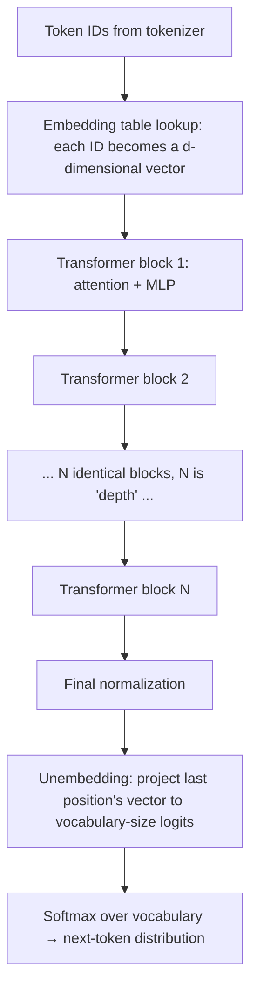

# The Transformer, Layer by Layer

Every frontier language model is a transformer, and nearly every production behavior you will engineer around — why the first token takes seconds but the rest stream fast, why long contexts cost so much, why prompt caching works, what "context window" physically means — falls out of this one architecture's mechanics. This chapter walks the forward pass end to end: token embeddings in, attention and MLP blocks stacked deep, next-token probabilities out. It builds attention from the soft-lookup intuition up through the actual formula, explains the plumbing (residuals, normalization, positional encoding) that makes hundred-layer networks trainable, and lands on the KV cache — the single most production-relevant consequence of the design. The depth target is engineering fluency: you should finish able to compute memory and latency implications on a napkin, not able to publish architecture papers. Everything here has been architecturally stable since 2017; the variants section flags the few dimensions still in motion.

## Intuition: a routing network for information

Picture each token in the input as a workstation on an assembly line, holding a vector (fnd-03) that represents "everything known so far about this position." The transformer's job, repeated across dozens of layers, is to let every workstation *look at all the others, decide which are relevant, and pull in their information* — then do some private processing on what it gathered. After enough rounds of gather-and-process, the vector at the last position has accumulated everything needed to predict what token comes next.

The gathering step is **attention**, and the right mental model is a *soft, learned dictionary lookup*. A hard dictionary lookup takes a query, finds the one exactly-matching key, returns its value. Attention relaxes this: the query matches *every* key to a degree (a relevance score), and the result is a weighted blend of *all* values, weights proportional to relevance. Soft matching is what makes it learnable — everything is differentiable, so gradient descent (fnd-02) can shape what "relevant" means — and it's what makes it powerful: "the cat that chased the mouse *was* hungry" needs "was" to pull number-agreement information from "cat," seven tokens away, and attention lets it do so directly, regardless of distance.

The private processing step is the **MLP block** — each position, independently, passes its gathered vector through a small feed-forward network. A serviceable division of labor: *attention moves information between positions; MLPs transform information at each position*. Interpretability research complicates this clean story in interesting ways,[^elhage-circuits] but as an engineering mental model it earns its keep daily.

Hold this picture: alternating rounds of **communicate** (attention) and **compute** (MLP), stacked deep, with everything learned. That is the whole architecture; the rest of the chapter is precision.

## The forward pass at ten thousand feet

Tracing one inference step through a decoder-only transformer — the architecture of essentially every modern generative LLM:[^radford-gpt2]

*One forward pass: token IDs in, a probability distribution over the next token out.*

Key structural facts to anchor:

- **Everything is vectors of one width.** Each token becomes a vector of dimension $d_{model}$ (thousands, in large models), and every block consumes and produces vectors of that same width — which is what lets blocks stack uniformly.
- **Blocks are identical in shape, different in learned weights.** "How big is the model" decomposes into depth (number of blocks), width ($d_{model}$), and vocabulary size; parameter count follows from these.
- **All positions process in parallel** within one forward pass — this parallelism over the sequence is *the* reason transformers displaced recurrent networks: they saturate GPUs during training (fnd-06).
- **Only the last position's output is used for generation.** The forward pass computes a vector at every position, but predicting token $n{+}1$ reads the distribution at position $n$. (During training, *every* position predicts its successor simultaneously — one pass, thousands of supervised predictions — a major training-efficiency win.)
- **Output is a distribution, never a token.** The softmax over the vocabulary (fnd-02's formula, at vocabulary scale) hands off to the sampling machinery of fnd-08. The model proposes probabilities; the decoding loop disposes.

## Attention from first principles

Build the mechanism in three steps from the dictionary-lookup intuition.

**Step 1 — every position manufactures three vectors.** From each position's current vector $x$, three learned linear projections produce a **query** $q = W_Q x$ ("what am I looking for?"), a **key** $k = W_K x$ ("what can I be found by?"), and a **value** $v = W_V x$ ("what do I contribute if selected?"). The three weight matrices $W_Q, W_K, W_V$ are the learned parameters — training shapes what kinds of relationships get expressed.

**Step 2 — score every query against every key.** Relevance of position $j$ to position $i$ is the dot product $q_i \cdot k_j$ — the same similarity primitive as fnd-03, reused inside the architecture. Computing all pairs gives an $n \times n$ score matrix for a sequence of length $n$. *This is the quadratic heart of the transformer* — the $n^2$ that dominates long-context economics.

**Step 3 — normalize scores to weights, blend the values.** Each row of scores passes through a softmax, becoming positive weights summing to 1; position $i$'s output is the weighted sum of all value vectors. Assembled, with the one refinement of scaling by $\sqrt{d_k}$ (the key dimension):

$$\text{Attention}(Q, K, V) = \text{softmax}\!\left(\frac{QK^\top}{\sqrt{d_k}}\right)V$$

That is the complete formula from the original paper.[^vaswani-2017] The $\sqrt{d_k}$ scaling earns its place in the equation and in interviews: dot products of high-dimensional random vectors have variance proportional to $d_k$, so raw scores grow large, saturating the softmax into near-one-hot selections whose gradients vanish (fnd-02's vanishing-gradient problem in miniature). Dividing by $\sqrt{d_k}$ keeps scores in the regime where softmax stays soft and trainable.

**The causal mask.** Generative models must not let position $i$ attend to positions after it — that would be reading the answer during training. Implementation: set all future-position scores to $-\infty$ before the softmax, zeroing their weights. This mask is *why* the architecture generates left-to-right, and — foreshadowing the KV cache — why past computations never change as the sequence grows: position $i$'s attention output depends only on positions $\le i$, forever.

## Multi-head attention and the MLP block

**Multiple heads: parallel relationship channels.** One attention operation learns one notion of relevance, but language needs many simultaneously — syntactic agreement, coreference ("she" → whom?), topical relatedness, positional patterns. So the architecture runs $h$ independent attention operations ("heads") in parallel, each with its own $W_Q, W_K, W_V$ operating on a $d_{model}/h$-dimensional slice, and concatenates their outputs.[^vaswani-2017] Heads discover their specializations from data; interpretability work has found heads doing recognizable jobs — including *induction heads* that implement "this pattern appeared before; continue it the same way," a mechanism plausibly underlying in-context learning.[^elhage-circuits] For engineers, heads matter mostly through the KV cache arithmetic below.

**The MLP block: where most of the model lives.** After attention, each position's vector independently passes through a two-layer feed-forward network that expands to roughly $4\times d_{model}$, applies a nonlinearity, and projects back. Two facts worth carrying: **(1)** the MLP blocks hold roughly two-thirds of a standard transformer's parameters — attention gets the fame, MLPs get the capacity — and interpretability evidence associates them with storing factual associations;[^elhage-circuits] **(2)** because MLPs act per-position with no cross-token interaction, they parallelize perfectly and are pure matrix-multiply throughput — relevant when prd-02 discusses where inference FLOPs go.

**The block, assembled.** A transformer block is: attention (communicate) → MLP (compute), each wrapped with the two pieces of plumbing that make depth trainable — covered next.

## The plumbing: residuals, normalization, position

Three unglamorous components keep a very deep stack of blocks trainable; all three are direct answers to fnd-02's vanishing-gradient problem.

**Residual connections.** Each sublayer computes a *modification* added to its input — $x \leftarrow x + \text{Attention}(x)$, then $x \leftarrow x + \text{MLP}(x)$ — rather than a replacement. Consequences: gradients flow backward through the identity path unattenuated no matter the depth (the fix that made 100+ layer networks possible), and conceptually the model becomes a **residual stream** — a shared information highway that each block reads from and writes small updates onto.[^elhage-circuits] The residual-stream picture explains at a glance why layers can be somewhat independent and why width $d_{model}$ is the model's "communication bandwidth."

**Normalization.** Before each sublayer, the vector is rescaled to standard magnitude (LayerNorm originally; RMSNorm — same idea, cheaper — in most modern models). Purpose: keep activations in well-behaved numeric ranges so training remains stable at depth. Engineering-level understanding suffices: it's a stabilizer, its placement ("pre-norm") is standard, and you will never tune it as a consumer.

**Positional encoding.** Attention is order-blind by construction — a bag of tokens produces the same attention scores in any order — so position must be injected explicitly. The original design added fixed sinusoidal patterns to input embeddings;[^vaswani-2017] the modern default is **RoPE (rotary position embedding)**: rotate each query and key vector by an angle proportional to its position, so the dot product between them naturally encodes *relative* distance.[^su-rope] Two production consequences: relative encoding generalizes better to sequence lengths beyond training, and the family of long-context extension tricks (adjusting RoPE's rotation frequencies to stretch the position scale) is what lets providers extend context windows post-training — which is why a model's advertised context length is a *training-and-configuration* property, not a hard architectural constant.

## Autoregressive generation and the KV cache

This section is the chapter's center of gravity for an AI engineer: it explains the latency, cost, and caching behavior of every LLM API you will ever call.

**Generation is a loop, not a pass.** To generate, the model runs a forward pass over the prompt, samples one token from the output distribution (fnd-08), appends it, and repeats — one full forward pass per generated token. Naively, each iteration would recompute attention over the entire growing sequence from scratch: generating token 1,001 would redo all the work for the 1,000 tokens already processed.

**The causal mask makes caching possible.** Because position $i$ attends only backward, its key and value vectors — once computed — *never change* as the sequence grows. So cache them. On each new token, compute Q/K/V for *that token only*, attend its query against all **cached** keys/values, and append its own K/V to the cache. Per-token cost drops from "reprocess everything" to "process one token against stored state." That stored state is the **KV cache**, and it is the working memory of LLM inference.

**Prefill vs. decode — the two-phase request.** Every API call physically executes as:

1. **Prefill:** the whole prompt processes *in parallel* (all positions at once — the transformer's training-time parallelism reused), populating the KV cache. Compute-intensive, GPU-saturating, and responsible for **time-to-first-token (TTFT)** — why a long prompt sits "thinking" before output starts.
2. **Decode:** tokens generate one at a time against the cache. Each step does little arithmetic but must read the *entire cache and model weights* from GPU memory — so decode speed is bound by **memory bandwidth**, not FLOPs. This is why output streams at a steady tokens-per-second rate, and why output tokens are priced several times higher than input tokens on every provider's price sheet.

**KV cache arithmetic — the napkin formula.** Cache size per token = $2 \times L \times n_{kv} \times d_{head} \times \text{bytes}$ (the 2 is K and V; $L$ layers; $n_{kv}$ KV heads; $d_{head}$ head dimension). For a typical 8B-parameter configuration — 32 layers, 8 KV heads (with GQA, next section), head dimension 128, 16-bit — that is $2 \times 32 \times 8 \times 128 \times 2 = 131{,}072$ bytes ≈ **128 KB per token**, so a 128k-token context holds ≈ **16 GB of cache — larger than the model's own weights** (~16 GB at 16-bit). Without GQA it would be 4× that. This single calculation explains: why long-context serving is expensive, why context limits exist at all, why concurrent-request capacity is cache-bound, and why serving systems treat cache memory as the scarce resource to be paged and shared (PagedAttention, the founding idea of vLLM — the full story in [prd-02](../06-production/prd-02-inference-and-serving.md)).[^kwon-paged]

**Prompt caching, explained by the architecture.** Providers offer discounted "cached input" pricing for repeated prompt prefixes. Mechanism: if a new request's prompt begins with byte-identical tokens to a previous one, the KV cache for that prefix can be reused — prefill skipped. The causal mask guarantees correctness (a prefix's K/V never depend on what follows). Engineering consequence you can apply today: **structure prompts with stable content first** (system prompt, tool schemas, reference documents) and volatile content last (user query), maximizing the reusable prefix. Chapter api-05 operationalizes this.

## Variants and evolution of the architecture

The 2017 design[^vaswani-2017] persists with a small set of consequential modifications — worth knowing because model cards and engineering discussions assume them.

| Variant axis | Original (2017) | Modern default | Why it changed |
|---|---|---|---|
| Macro-architecture | Encoder–decoder | Decoder-only | One stack, one objective (next token) scales simplest; generation is the product[^radford-gpt2] |
| Position encoding | Sinusoidal, added | RoPE (rotary) | Relative distances; length extrapolation; extendable context[^su-rope] |
| Attention heads | Full multi-head (KV per head) | GQA: groups of query heads share KV heads | Cuts KV cache 4–8× with minimal quality loss[^ainslie-gqa] |
| Normalization | Post-LayerNorm | Pre-RMSNorm | Training stability at depth, less compute |
| Attention kernel | Naive matmul | FlashAttention-class | Exact same math, IO-aware tiling — memory linear in $n$, large speedups[^dao-flash] |
| MLP capacity | Dense (every token, all params) | Often MoE: mixture-of-experts | Router activates a few expert MLPs per token — parameter count grows, per-token compute doesn't |

Three of these deserve one extra sentence each. **GQA** exists purely because of the KV cache economics above — it is an inference-cost optimization adopted nearly universally.[^ainslie-gqa] **FlashAttention** is the reason "attention is quadratic" stopped being a memory wall while remaining a compute truth: it computes *exact* attention without materializing the $n \times n$ matrix.[^dao-flash] **MoE** decouples "knowledge capacity" from "per-token compute," which is why parameter counts of MoE models aren't comparable to dense ones — read model cards accordingly.

> **Volatile:** which frontier models use MoE, exact context-length ceilings, and attention-efficiency techniques beyond FlashAttention (sliding-window schemes, hybrid layers, sparse variants) shift with each model generation. The table's *axes* are stable; the current fashionable point on each axis is not. Check current model documentation via [api-06](../02-llm-apis/api-06-model-selection.md).

## Production engineering perspective

What the architecture dictates about systems you'll build — previewing module 6 with the mechanics now in hand:

- **Two-phase latency budgeting.** TTFT scales with prompt length (prefill is $O(n^2)$ compute, though heavily parallel); inter-token latency is roughly constant (decode is bandwidth-bound). UX implication: streaming (api-05) exists because decode is inherently sequential; latency optimization splits into "shrink or cache the prefix" (TTFT) and "shrink the output or the model" (total time).
- **Long context is a quadratic-compute, linear-memory tax.** Doubling context roughly quadruples prefill compute and doubles KV cache. "Just stuff everything in the context" has a real and superlinear price — the economic argument for retrieval (module 3) in one sentence.
- **Long context also has a quality tax.** Models attend unevenly over very long inputs — information buried mid-context is used less reliably than content at the edges ("lost in the middle").[^liu-lost-middle] Position matters: put critical instructions and documents where models attend best, and measure (rag-01 treats context placement as a first-class engineering surface).
- **Prompt structure is cache structure.** Stable-prefix prompt design is the single cheapest latency/cost win available to an application engineer, and it falls straight out of the causal mask.
- **Weights are static; the cache is the state.** A serving GPU holds one copy of weights and *per-request* KV caches — concurrency is a memory-budget problem. When a provider rate-limits you or a self-hosted server OOMs under long-context load, this is the mechanism.

## Historical evolution

**2017:** "Attention Is All You Need" introduces the transformer for translation — the radical move was deleting recurrence entirely, keeping only attention, gaining full training parallelism over the sequence.[^vaswani-2017] **2018–2019:** the architecture forks — encoder-only (BERT: understanding tasks, fnd-03's contextual embeddings) vs. decoder-only (GPT line: generation).[^radford-gpt2] **2020:** scaling the decoder-only recipe produces GPT-3's in-context learning; the field consolidates on one architecture and pours capability work into data and scale instead (fnd-06's scaling laws). **2021–present:** the refinement era — RoPE, GQA, FlashAttention, MoE, and context lengths growing from 2k to hundreds of thousands of tokens — efficiency and length, not new mechanisms. The striking meta-fact: nine years of the most-funded research race in computing has *modified* this architecture but not replaced it. Attention-free challengers (state-space models) remain worth watching and, so far, niche.

## Common misconceptions

- **"Attention weights explain the model's reasoning."** Attention shows where information *flowed*, one head and layer at a time — dozens of layers and superposition away from *why* an output was produced. Treat attention-map "explanations" as evidence, never proof; genuine interpretability is an open research field.[^elhage-circuits]
- **"The model re-reads the whole conversation each time you send a message."** Physically true only without caching; with standard prefix caching, prior turns' K/V are reused and only new tokens are processed. Understanding this dissolves confusion about both latency behavior and cached-token pricing.
- **"Most parameters are in attention."** Roughly two-thirds sit in MLP blocks. Attention is the architectural signature; MLPs are the bulk and (per current evidence) much of the knowledge store.
- **"Context window is a hard architectural constant."** It's a training-and-configuration property: position encodings and training length determine usable range, and RoPE-based extension can stretch it post-hoc. What *is* hard: the quadratic compute and linear cache cost of actually using length — and the quality falloff in the middle.[^liu-lost-middle]
- **"Bigger context makes retrieval obsolete."** Long context and retrieval trade off compute cost, latency, and attention quality against index freshness and precision; rag-08 gives the decision framework. The quadratic tax alone keeps retrieval alive.
- **"The transformer understands language."** The architecture is a differentiable routing-and-transformation machine trained to minimize next-token cross-entropy (fnd-02). Capabilities emerge from that objective at scale (fnd-06); nothing in this chapter's machinery presumes — or rules out — anything about understanding. Keep the mechanism and the philosophy separate.

## Failure modes and trade-offs

- **Quadratic prefill on long inputs** — the compute bill and TTFT of huge-context requests grow superlinearly; FlashAttention removed the memory cliff, not the FLOPs.[^dao-flash] *Trade-off:* retrieval precision vs. context stuffing; sliding-window attention buys length by sacrificing global visibility.
- **KV cache memory pressure** — long contexts and high concurrency compete for the same GPU memory; overflow means rejected requests or evicted caches (suddenly-slow "warm" prompts). *Trade-off:* GQA/MQA shrink cache at slight quality cost;[^ainslie-gqa] quantized caches likewise (prd-03).
- **Positional degradation** — quality decays on inputs far beyond training length even when configuration "supports" them, and mid-context content underperforms at any length.[^liu-lost-middle] *Mitigation:* placement discipline and evals at your real context lengths, not the advertised maximum.
- **Sequential decode floor** — one token per step is architecturally irreducible (speculative decoding in prd-03 negotiates with it, cleverly, at the cost of a second model). Output length is a latency budget item you control via prompting and `max_tokens`.
- **Uniformity as brittleness** — the whole industry on one architecture means architecture-level surprises (a jailbreak class, a scaling plateau) correlate across every vendor at once. Portfolio thinking at the product level (prd-04's multi-provider fallbacks) doesn't diversify *this* risk.

## Best practices

For the model *consumer* — the working rules this chapter justifies:

- **Design prompts stable-prefix-first:** system instructions and reference material before volatile user content; never interleave timestamps or request IDs into the shared prefix. (Cache hit rate is a prompt-engineering metric.)
- **Budget context as three costs, not one:** tokens (money), prefill (TTFT), and attention quality (middle-loss). "It fits" is not "it works" — eval at real lengths.[^liu-lost-middle]
- **Place critical content at context edges** — instructions early, the key question/document restated late — and treat mid-context as economy seating.
- **Do the KV napkin math before capacity planning** any self-hosted deployment: cache-per-token × expected context × concurrency, next to weight memory. (prd-02 formalizes; the formula is above.)
- **Read model cards architecturally:** KV head count → cache economics; MoE → parameter counts not comparable; trained-vs-extended context → where quality evals are needed.
- **Control output length deliberately** — it's the decode-time knob: concise-output instructions and `max_tokens` are latency engineering, not just cost hygiene.

## Real-world examples

**Why the bot "hangs" then speeds up.** A support assistant with a 40-page policy manual in context shows 9 seconds of silence, then fluent streaming. Diagnosis by architecture: 9s of quadratic prefill over ~50k tokens (TTFT), then bandwidth-bound decode at a steady clip. Fixes, in order of leverage: cache the manual as a stable prefix (prefill drops to the user question alone — TTFT collapses to sub-second on cache hits), retrieve relevant sections instead of shipping the manual (module 3), stream the UI so perceived latency drops even before real latency does.

**The capacity plan that forgot the cache.** A team sizes a self-hosted deployment of an 8B model at "weights ≈ 16 GB, so an 80 GB GPU serves ~4 concurrent replicas' worth of headroom." Under load with 32k-token sessions, requests start failing: each session's KV cache is ~4 GB (128 KB/token × 32k), so ten concurrent long sessions consume 40 GB *of cache alone*. The napkin formula in this chapter, applied for one minute, would have caught it; prd-02's serving stack (paged cache memory[^kwon-paged]) is the systematic fix.

**The needle nobody found.** An eval places a critical fact at position ~60% into a 100k-token context; the model misses it 30% of the time, while the same fact at the start or end scores near-perfectly — a clean "lost in the middle" reproduction.[^liu-lost-middle] The team's fix was not a bigger model: retrieval plus placement discipline took the miss rate to ~2%. Architecture knowledge converted a "model is bad" complaint into a system design change.

## Interview questions

1. **"Explain self-attention to an engineer who's never seen it."** — Model answer: each token's vector produces a query ("what I'm looking for"), a key ("what I can be found by"), and a value ("what I contribute"). Every query is dot-producted against every key to get relevance scores; softmax turns each row of scores into weights; each token's output is the weights-blended sum of all values. It's a differentiable soft dictionary lookup — soft so gradient descent can learn what "relevant" means, all-pairs so any token can pull information from any other regardless of distance. A causal mask zeroes attention to future positions for generation.

2. **"Why scale by √d_k in the attention formula?"** — Model answer: dot products of $d_k$-dimensional vectors have variance growing with $d_k$, so raw scores get large as dimensions grow; large scores push softmax into near-one-hot saturation, where gradients vanish and training stalls. Dividing by $\sqrt{d_k}$ normalizes score variance to keep softmax in its trainable regime. It's the vanishing-gradient story at formula scale.

3. **"What is the KV cache, and why does it exist?"** — Model answer: generation runs one forward pass per new token, and causal masking means every previous position's key and value vectors never change — so they're computed once and cached. Each step then processes only the new token's query against stored K/V. Without it, generating token $n$ costs $O(n)$ redundant recomputation per step. The cache is the dominant memory consumer in long-context serving — roughly 100+ KB per token for an 8B-class model — which drives GQA, paged cache management, and prompt-caching economics.

4. **"Why do providers charge less for 'cached' input tokens, and how do you exploit it?"** — Model answer: a byte-identical prompt prefix has an identical KV cache (causality guarantees prefix K/V don't depend on what follows), so the provider can skip prefill compute for it and shares the saving. Exploit: order prompts stable-first — system instructions, schemas, reference docs — with per-request content last, and keep the prefix byte-stable (no timestamps). It's often the largest single latency+cost win available without touching quality.

5. **"Why is time-to-first-token long for big prompts but streaming steady afterwards?"** — Model answer: requests execute in two phases. Prefill processes the whole prompt in parallel and scales quadratically in compute with prompt length — that's TTFT. Decode then emits one token per step, each step light on arithmetic but reading all weights and cache from GPU memory — bandwidth-bound, hence a near-constant per-token rate. The two phases also explain asymmetric input/output pricing.

6. **"What's GQA and why did everyone adopt it?"** — Model answer: grouped-query attention keeps many query heads but shares each key/value head across a group of them, shrinking the KV cache by the grouping factor (typically 4–8×) at negligible quality cost. Pure inference economics: cache memory bounds long-context capacity and concurrency, so cutting it directly cuts serving cost. It's the clearest example of the architecture evolving under deployment pressure rather than research pressure.

7. **"Long context or RAG — how do you think about it?"** — Model answer: architecture gives three costs of raw context: quadratic prefill compute (money+TTFT), linear KV memory, and uneven mid-context attention quality. Retrieval buys precision and freshness at the cost of pipeline complexity and recall risk. Decision inputs: corpus size vs. window, query selectivity (needle-seeking favors RAG; holistic synthesis favors context), latency budget, and measured mid-context performance on the actual task. Usually the answer is both — retrieve, then place well — and it's an eval question, not a doctrine question.

8. **"Where are a transformer's parameters, and why should an engineer care?"** — Model answer: ~two-thirds in MLP blocks, ~one-third in attention projections, plus embedding/unembedding tables. Care because: MLP dominance is why MoE targets MLPs (capacity without per-token compute), why "attention is the expensive part" is true of *compute at long context* but not of *parameters*, and why parameter-efficient fine-tuning choices (ftn-02) about which matrices to adapt aren't arbitrary.

## Exercises and mini-project

**Exercises**

1. By hand, compute single-head attention for three positions with $d_k = 2$: $q_3 = (1, 0)$, keys $k_1 = (1, 0)$, $k_2 = (0, 1)$, $k_3 = (0.5, 0.5)$, values $v_1 = (1, 0)$, $v_2 = (0, 1)$, $v_3 = (1, 1)$. Score, scale by $\sqrt{2}$, softmax, blend. Which position dominates position 3's output, and why?
2. Recompute the chapter's KV-cache-per-token figure for the same configuration *without* GQA (32 KV heads instead of 8). At what context length does the cache alone exceed an 80 GB GPU?
3. A prompt template puts `Current time: {timestamp}` on line 1, followed by a 20k-token system prompt. Explain the cost consequence and fix it.
4. Your product's prompts are 30k tokens with 200-token outputs. Using the two-phase model, state which lever most improves: (a) TTFT, (b) total latency, (c) cost. (Levers: prefix caching, shorter outputs, smaller model, retrieval.)
5. Explain why the causal mask is *necessary* for the KV cache to be valid — what specifically breaks if position 5 could attend to position 9?

**Mini-project: attention from scratch.** In numpy (no framework): (a) implement scaled dot-product attention as a function of Q, K, V matrices; verify each output row's weights sum to 1; (b) add causal masking and confirm position $i$'s output is unchanged when you append tokens after $i$ — you have just *proven* the KV cache's correctness property; (c) implement a toy generation loop with and without a KV cache over a random "model" (fixed random projection matrices), and measure per-token time as sequence length grows from 10 to 2,000; plot both curves; (d) write five sentences connecting your plot to TTFT, decode rate, and cached-input pricing. Target: 3–4 hours. Success criterion: the flat-vs-growing curve plot, and the ability to explain it to a colleague unprompted. For the full-model version of this exercise, work through nanoGPT (Further reading) after fnd-06.

**Capstone extension:** the prompt-structure and context-budget disciplines from this chapter become hard requirements in your capstone's context assembly layer (rag-01) and its latency budget (prd-01).

## Revision summary

- The transformer alternates **communicate** (attention: soft, learned, all-pairs lookup — $\text{softmax}(QK^\top/\sqrt{d_k})V$, causally masked) and **compute** (per-position MLPs holding ~⅔ of parameters), stacked identically deep, on a residual stream that keeps depth trainable, with RoPE injecting relative position.
- Scores are query·key dot products (fnd-03's primitive, internalized); $\sqrt{d_k}$ keeps softmax trainable; the $n \times n$ score matrix is the quadratic heart of long-context economics.
- Generation = one forward pass per token. Causality makes past K/V immutable → the **KV cache**: prefill (parallel, quadratic compute, sets TTFT) then decode (sequential, memory-bandwidth-bound, sets tokens/sec and output pricing). Cache ≈ $2 L\, n_{kv} d_{head}$ bytes×2 per token — often rivaling weight memory at long context; hence GQA, paged caching, and prompt-caching discounts for byte-stable prefixes.
- Modern deltas from 2017: decoder-only, RoPE, GQA, pre-RMSNorm, FlashAttention (exact, IO-aware), often MoE. Axes stable; fashions volatile.
- Consumer doctrine: stable-prefix prompts, three-cost context budgeting (tokens, prefill, mid-context quality), edge placement for critical content, KV napkin math before capacity plans, deliberate output-length control.

## Flashcards

| Q | A |
|---|---|
| The attention formula? | $\text{Attention}(Q,K,V) = \text{softmax}(QK^\top / \sqrt{d_k})\,V$, with future positions masked to $-\infty$ for generation. |
| Roles of Q, K, V in one line each? | Query: what this position seeks. Key: what it can be found by. Value: what it contributes when selected. |
| Why divide by $\sqrt{d_k}$? | Keeps dot-product score variance constant so softmax doesn't saturate and gradients don't vanish. |
| Attention vs. MLP division of labor? | Attention moves information *between* positions; MLPs transform information *at each* position (and hold ~⅔ of parameters). |
| What makes the KV cache valid? | The causal mask: past positions' K/V never depend on later tokens, so they're immutable and reusable. |
| Prefill vs. decode in one line each? | Prefill: whole prompt in parallel, compute-bound, sets TTFT. Decode: one token/step, memory-bandwidth-bound, sets streaming rate. |
| KV cache per token, and the example figure? | $2 \times L \times n_{kv} \times d_{head} \times 2$ bytes; ≈128 KB/token for a 32-layer, 8-KV-head, 128-dim config → ~16 GB at 128k context. |
| What does GQA trade? | Shares KV heads across query-head groups: 4–8× smaller cache for negligible quality loss. |
| Why does prompt caching require byte-identical prefixes? | KV reuse is positional and exact; any differing token invalidates all subsequent cached K/V. |
| What is "lost in the middle"? | Measured quality drop for information placed mid-context vs. at the edges of long inputs — placement is an engineering variable. |
| Why did decoder-only win? | One stack and one objective (next-token) scale simplest, and generation is the product; in-context learning emerged from scaling it. |

## Further reading

- **Official docs:** none required — the architecture lives in papers; provider docs become relevant at api-01.
- **Papers:** Vaswani et al. (2017)[^vaswani-2017] — read §3 with this chapter open; Su et al., RoPE (2021)[^su-rope]; Ainslie et al., GQA (2023)[^ainslie-gqa]; Dao et al., FlashAttention (2022)[^dao-flash] — intro and Figure 1 suffice; Kwon et al., PagedAttention (2023)[^kwon-paged] — before prd-02; Liu et al., "Lost in the Middle" (2023).[^liu-lost-middle]
- **Books:** none better than the papers plus code for this topic.
- **Talks:** Karpathy, "Let's build GPT: from scratch, in code" (YouTube, 2023) — implements this entire chapter in ~2 hours of code; the highest-value companion.
- **Tutorials:** Anthropic's "A Mathematical Framework for Transformer Circuits"[^elhage-circuits] — the residual-stream view, after this chapter settles; nanoGPT repository — read `model.py` (~300 lines) and find every section of this chapter in it.

## Check your understanding

1. Reproduce the attention formula from memory, then explain each component — including the mask and the scaling — to an imagined colleague in under two minutes.
2. Walk through what physically happens, phase by phase, when you send a 50k-token prompt and receive a 300-token answer. Where does the money go? Where does the time go?
3. Do the KV cache napkin math for a 40-layer, 8-KV-head, head-dim-128 model at 200k context. Could one 80 GB GPU serve two such requests concurrently alongside 20 GB of weights?
4. Your teammate claims "our new model has a 1M context window, so we can delete the retrieval pipeline." Give the three-cost architectural rebuttal.
5. Why is this chapter evergreen if models change monthly? Name the two variant axes you'd expect to look different in three years, and the invariants you'd bet survive.

## Sources

[^vaswani-2017]: [T2] Vaswani et al. (2017). "Attention Is All You Need." arXiv:1706.03762. https://arxiv.org/abs/1706.03762 (accessed 2026-07-09)
[^radford-gpt2]: [T2] Radford et al. (2019). "Language Models are Unsupervised Multitask Learners." OpenAI. https://cdn.openai.com/better-language-models/language_models_are_unsupervised_multitask_learners.pdf (accessed 2026-07-09)
[^su-rope]: [T2] Su et al. (2021). "RoFormer: Enhanced Transformer with Rotary Position Embedding." arXiv:2104.09864. https://arxiv.org/abs/2104.09864 (accessed 2026-07-09)
[^ainslie-gqa]: [T2] Ainslie et al. (2023). "GQA: Training Generalized Multi-Query Transformer Models from Multi-Head Checkpoints." arXiv:2305.13245. https://arxiv.org/abs/2305.13245 (accessed 2026-07-09)
[^dao-flash]: [T2] Dao et al. (2022). "FlashAttention: Fast and Memory-Efficient Exact Attention with IO-Awareness." arXiv:2205.14135. https://arxiv.org/abs/2205.14135 (accessed 2026-07-09)
[^kwon-paged]: [T2] Kwon et al. (2023). "Efficient Memory Management for Large Language Model Serving with PagedAttention." arXiv:2309.06180. https://arxiv.org/abs/2309.06180 (accessed 2026-07-09)
[^liu-lost-middle]: [T2] Liu et al. (2023). "Lost in the Middle: How Language Models Use Long Contexts." arXiv:2307.03172. https://arxiv.org/abs/2307.03172 (accessed 2026-07-09)
[^elhage-circuits]: [T4] Elhage et al. (2021). "A Mathematical Framework for Transformer Circuits." Anthropic / transformer-circuits.pub. https://transformer-circuits.pub/2021/framework/index.html (accessed 2026-07-09)
