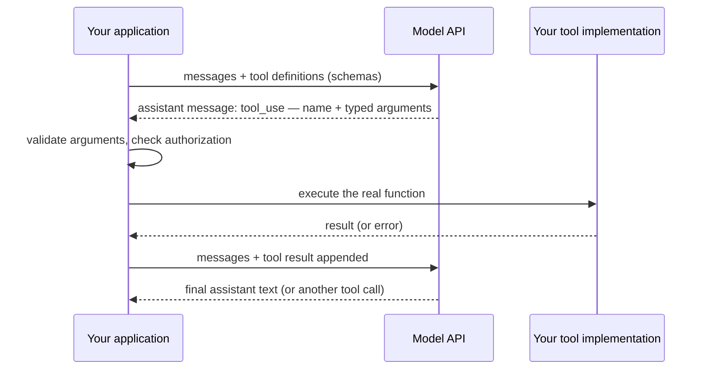

# Structured Outputs & Tool Calling

Free-text generation makes demos; **typed** generation makes systems. The two capabilities in this chapter — structured outputs (the model returns data conforming to your schema) and tool calling (the model requests invocations of your functions) — are what turn an LLM from a text box into a software component that other code can safely consume. They are also the same mechanism wearing two hats: both work by having the model emit schema-conformant JSON, differing only in whether the JSON *is* the product or *requests an action*. This chapter covers why naive "return JSON please" fails at production rates, how constrained decoding provides real syntactic guarantees (and what those guarantees deliberately exclude), the tool-calling loop that module 4 grows into agents, and the two disciplines that make it all shippable: schema design as prompt engineering, and validation as a non-negotiable layer. Mechanisms here are stable; API surfaces are per-vendor reading.

## Intuition: giving the parser a contract

The fundamental mismatch: your code needs *invariants* ("this field exists and is one of three values"); a language model produces *probabilities* (fnd-08). Bridging them badly — parsing free text with regexes and hope — was the first year of the industry, and it failed the way parsing always fails: at the tails, at 2 a.m., silently.

The bridge that works has two spans. **Span one — make valid output overwhelmingly likely:** tell the model the schema, show examples (api-02's principles, applied to JSON). **Span two — make invalid output *impossible*:** constrained decoding masks, at each sampling step, every token that would violate the grammar (the sampler intervention previewed in fnd-08). With both spans, the type system extends across the model boundary: your code downstream of a strict-mode call can genuinely assume syntactic validity.

Tool calling is the same contract, pointed outward. You describe functions (name, purpose, typed parameters); the model, mid-conversation, emits a structured request — "call `get_order_status` with `{order_id: 'A1234'}`" — **which your code executes**; the result returns as a message, and generation continues with the new information. The model never runs anything; it *asks*. That request/execute separation is the security and reliability foundation everything agentic sits on (agt-01), and it's worth internalizing now: the model is the planner; your runtime is the actor; the boundary between them is where all your control lives.

## Why "just ask for JSON" fails

Instructed-but-unconstrained JSON fails at rates that don't matter in demos and dominate at scale. The failure taxonomy, each with its mechanism:

- **Prose contamination:** "Here's the JSON you requested:" preambles, markdown code fences, trailing commentary — post-training taught helpful framing (fnd-07), and helpfulness wraps your payload. A version bump can change the wrapping rate overnight (the fnd-07 incident example).
- **Syntax decay with length:** every token is sampled (fnd-08); the probability that *hundreds* of consecutive tokens all respect JSON syntax decays multiplicatively. Long outputs — big arrays, nested objects — fail disproportionately: exactly the extraction jobs that matter.
- **Schema drift:** valid JSON, wrong shape — renamed keys, `"N/A"` in numeric fields, invented enum values, single objects where arrays belong. Instructions describe the schema; sampling explores its neighborhood.
- **Truncation:** `max_tokens` hits mid-object (api-01); the fragment parses as nothing. Unchecked `stop_reason` turns this into silent data loss.

The rates vary by model, schema complexity, and output length — from a few percent to double digits — which is precisely the trap: 96% success feels fine in testing and is a 4% silent data-loss rate in production. The doctrine this motivates: **prompting improves the distribution; only constraints and validation provide invariants.**

## Constrained decoding: how the guarantee works

The mechanism (fnd-08's loop, with a gate): compile the target schema/grammar into a state machine; at every decoding step, consult it for which tokens are legal continuations; mask the logits of every illegal token *before* sampling; the model chooses only among grammar-valid options.[^willard-2023] The clever engineering is making the token-level masking cheap (vocabularies are large, tokens misalign with grammar symbols — fnd-04's boundary weirdness applies); the result is generation that *cannot* emit invalid syntax, at negligible overhead.

Provider "strict" structured-output modes package this: you attach a JSON Schema, the API guarantees conformant output.[^openai-structured] Three boundary clarifications that separate correct usage from wishful thinking:

- **The guarantee is syntactic, not semantic.** Conformant JSON with wrong *content* — misread values, fabricated-but-valid enum choices, hallucinated field values (fnd-09) — passes the grammar happily. Constrained decoding eliminates the parse-failure class; the correctness class remains yours (evals, validation, review).
- **Schema feature support is a subset.** Providers restrict which JSON Schema constructs strict modes accept (recursion depth, formats, unions vary).[^openai-structured][^jsonschema-spec] Weaker "JSON modes" guarantee only *some valid JSON object* — not your schema. Know which guarantee you're holding.
- **Constraints can shape distribution.** Forcing structure early in generation can preempt the model's natural "reason first, conclude second" ordering (api-02's room-to-think) — a documented tension with a standard fix: put a free-text `reasoning` field *before* the constrained answer fields in the schema, restoring computation order inside the structure.

> **Volatile:** which schema features strict modes support, whether structured outputs compose with tool calling and streaming, and per-provider mode names all churn on API cycles. The masking mechanism and the syntax-vs-semantics boundary are the stable knowledge.[^openai-structured][^anthropic-tools]

## The tool-calling loop

The wire-level choreography, which module 4 will run in a loop until it's an agent:

*One tool-calling round trip — the model plans, your runtime acts:*

The load-bearing details:

- **Tool definitions are prompt content.** Schemas are serialized into the context (token cost — big tool catalogs are big prompts; another entry for the api-01 usage log) and the model chooses tools by reading their names and descriptions. Selection quality is therefore a *writing* problem — the next section.
- **The model can call zero, one, or several tools** (parallel calls where supported), and providers expose a `tool_choice` control: auto, required, or forced-specific — the latter being a legitimate structured-output technique in itself (force one function whose parameters are your extraction schema).[^anthropic-tools][^openai-structured]
- **Results are just messages.** Tool output returns as conversation content — meaning tool results are *context* with everything module 1 says about context: they consume budget, they're evidence the model imitates, and — because tools often fetch external data — they are an **injection surface**: a webpage fetched by a tool can carry instructions that attack your system (the cornerstone of sec-01; flagged now, hammered later).
- **Errors belong in-band.** Return failures as structured tool results ("error: order not found") rather than raising to your own code — the model can often recover, retry differently, or tell the user; that recovery loop is agt-01's whole subject.
- **Arguments are model output** — validated like all model output. A syntactically perfect `delete_records(customer_id=...)` with the wrong ID is the failure that matters; hence validation-then-authorization before every execution, with authorization derived from the *session's* privileges, never from the model's request.

## Schema design as prompt engineering

The model reads your schema the way it reads your prompt — because it *is* prompt (serialized into context). Every api-02 principle transfers:

- **Descriptions are instructions.** Every field and tool gets a `description` — what it means, its format, when to use it, edge behavior ("ISO-8601 date; null if not stated in the source"). Sparse schemas are vague prompts; the model guesses, fluently.
- **Names carry semantics.** `search_knowledge_base` beats `kb_query`; `refund_amount_usd` beats `amt`. Models generalize from natural naming; abbreviations are off-distribution.
- **Enums over free strings, always** — every field that can be closed, closed. Constrained decoding then makes invalid categories *impossible* rather than unlikely: the cheapest correctness win in the chapter.
- **Required-with-null beats optional** for extraction: forcing every field to appear (nullable when absent) converts silent omissions into explicit, countable abstentions — fnd-09's abstention doctrine, encoded in types.
- **Flat beats clever.** Deep nesting, unions, and recursion degrade both model performance and strict-mode support. If the schema needs a diagram, decompose the task (api-02's principle 5) into multiple simpler calls.
- **Order fields for the model, not the reader:** reasoning/evidence fields first, conclusions last — schema field order is computation order under constrained decoding.
- **Fewer, sharper tools.** Overlapping tools force judgment calls the descriptions must arbitrate; a dozen crisp tools with disjoint purposes outperform thirty vague ones. (Tool-catalog curation at scale is agt-02's subject.)

And the meta-rule inherited from api-02: schemas are versioned, evaluated artifacts. A field description tweak is a behavior deploy; it goes through the eval like any prompt change.

## Production engineering perspective

- **Validate at the boundary, unconditionally.** Parse every structured response into typed objects (Pydantic/Zod-style) even under strict mode — validation catches what grammars can't (cross-field consistency, business rules: `end_date > start_date`, IDs that resolve), documents the contract in code, and covers you when a provider mode is quietly "best-effort." One boundary, one validator, no exceptions.
- **Design the retry ladder:** validation failure → one re-ask with the error appended ("your previous output failed: <error>; correct it") → then fallback (smaller task, human queue, default). Cap retries; log every rung (evl-04) — retry *rate* is a leading quality metric and an early-warning signal for model drift.
- **Semantic evals for structured tasks:** field-level precision/recall against labeled extractions, per-field — aggregate accuracy hides that `invoice_total` is 99% and `payment_terms` is 60% (jaggedness, fnd-09, at field granularity).
- **Version schemas like APIs** — because they are: additive changes are usually safe; renames and semantic shifts need migration thinking, eval re-runs, and coordination with consumers of the typed output.
- **Tool execution is your reliability domain:** timeouts, idempotency (the model *will* occasionally request the same call twice — dedupe side-effecting tools by natural key), least-privilege credentials per tool, and human confirmation gates on consequential actions (previewing agt-09's tiers).
- **Watch the token bill:** schemas and tool catalogs ride in every request. Prune unused tools per route; a 30-tool catalog on a task needing 3 is paying prefill (fnd-05) for indecision.

## Historical evolution

**2020–2022: the parsing era** — regex archaeology over free text, output formats begged for in prompts, reliability by retry. **Feb 2023:** Toolformer demonstrates models *teaching themselves* API calls — tool use as a learnable behavior rather than a parsing hack.[^schick-toolformer] **June 2023:** function calling ships as a first-class API feature — models post-trained to emit typed calls; the ecosystem reorients overnight. **2023–2024:** JSON modes, then true constrained decoding ("strict" structured outputs[^openai-structured]) close the syntax gap; open-source guided-generation libraries bring the same guarantee to self-hosted stacks.[^willard-2023] **2024–present:** tool calling becomes the substrate for everything — agents (module 4), MCP standardizing tool exposure across vendors (agt-05), computer use as tools-all-the-way-down (agt-08). The arc mirrors api-01's: community scaffolding (parsers, retriers) absorbed into the platform — and the skill that survived is the one this chapter centers: contract design and validation, not parsing cleverness.

## Common misconceptions

- **"Strict mode means the output is correct."** It means the output *parses*. Wrong-but-conformant is the remaining — and dominant — failure class: misextractions, fabricated values in valid types, plausible-wrong enum picks (fnd-09). Semantics need evals and validation, forever.
- **"With structured outputs I can skip validation."** Strict modes have feature gaps, providers have degraded modes, tool arguments aren't always covered, and business rules were never the grammar's job. The boundary validator stays.
- **"Tool calling means the model executes functions."** The model emits a *request*; your runtime decides, validates, authorizes, executes. Blurring this in your mental model leads to blurring it in your architecture — which is how "the model deleted production data" incidents actually happen (your code did, on an unvalidated ask).
- **"More tools = more capable."** Every tool is context cost plus decision burden; selection accuracy degrades with catalog size and overlap. Capability comes from *sharp* tools, not many.
- **"JSON mode and structured outputs are the same thing."** One guarantees some-valid-JSON, the other your-schema-exactly. Systems have shipped on the former believing the latter; the failure arrives as schema drift the parser was told couldn't happen.
- **"Forcing structure is free."** Constraints interact with generation order and can suppress reasoning-before-answering; the reasoning-field-first schema pattern exists because the interaction is real.

## Failure modes and trade-offs

- **Semantically-wrong-but-valid output** — the post-constraint failure class. *Mitigation:* field-level evals, cross-field validation, provenance requirements (extract *with* source spans so claims are checkable — rag-07's groundedness, previewed).
- **Hallucinated arguments** — right tool, confabulated parameters (the ID that doesn't exist, the date the user never said). *Mitigation:* resolve-and-verify before side effects; require the model to quote its evidence for high-stakes arguments.
- **Over-eager and under-eager tool use** — calling tools for questions the context already answers; answering from stale weights when a tool should be called (fnd-06's cutoff). Both are description/prompt problems first, `tool_choice` problems second. *Measure* the call-decision, not just call correctness.
- **Duplicate side effects** — the same call requested twice across a retry boundary. *Mitigation:* idempotency keys on every side-effecting tool (api-01's discipline, now mandatory).
- **Schema-complexity collapse** — quality falls off a cliff past a nesting/union threshold that varies by model. *Trade-off:* one rich call vs. several simple ones — decomposition usually wins on reliability and loses on latency; measure per task.
- **Injection via tool results** — fetched content steering subsequent behavior. *Mitigation classes* live in sec-01; the design instinct to build now: tool results are untrusted input, and least privilege bounds the blast radius.

## Best practices

- **Close every field you can** (enums, formats, required-with-null); let constrained decoding convert "unlikely" into "impossible."
- **Describe every field and tool** as carefully as your best prompt — descriptions are the instructions the model actually reads at decision time.
- **Reasoning fields before answer fields;** flat schemas; decompose past the complexity cliff.
- **One typed validator at the boundary,** business rules included; retry ladder with error-feedback re-ask; capped, logged, alarmed on rate.
- **Idempotency keys and least-privilege credentials per tool;** validate-then-authorize before every execution; human gates on consequential actions.
- **Field-level eval metrics;** schemas versioned and eval-gated like prompts; retry rate on the dashboard.
- **Prune tool catalogs per route;** measure selection accuracy, not just execution success.
- **Force a function when you want extraction** — `tool_choice: required` with a schema-as-parameters is often the cleanest structured-output path where strict modes fall short.[^anthropic-tools]

## Real-world examples

**The 4% that wasn't in the demo.** An invoice-extraction pipeline ships on instructed JSON ("respond only with JSON matching…"), tested on 50 clean invoices: flawless. Production: 96.2% parse rate — meaning 4% of customer invoices silently dropped by the exception handler, discovered via a customer complaint about missing records. The rebuild: strict structured outputs + Pydantic boundary validation + one error-feedback retry + `required`-with-null fields. Parse failures: zero; *abstentions became visible* (null rates per field on the dashboard) — the failure class didn't just shrink, it became measurable. Cost of the rebuild: two days. Cost of the silence: a quarter of eroded trust.

**The refund tool that needed a chaperone.** A support agent gets `issue_refund(order_id, amount_usd)`. Week one: the model, pattern-matching a furious customer's message, requests a refund for an *amount the customer mentioned* rather than the order's actual total — syntactically perfect, semantically invented (hallucinated argument). Caught by the validation layer's cross-check (`amount_usd == order.total`), which was there because the team treated arguments as model output. The addition after the near-miss: refunds above a threshold route to human confirmation — the agt-09 gate pattern arriving early, as it should.

**Thirty tools, three used.** An internal assistant accretes a 30-tool catalog ("someone might need it"). Symptoms: rising latency and cost (the catalog is ~4k tokens of every prompt — prefill, fnd-05), and a stubborn 12% wrong-tool-selection rate concentrated among five overlapping search tools. Fix: route-level catalogs (3–6 tools each, selected by a cheap classifier), overlapping tools merged, descriptions rewritten with disjoint "use when…" clauses. Selection errors drop to 2%; the token bill drops 30%. Tool catalogs are prompts; prompts get curated.

## Interview questions

1. **"Why does 'please respond in JSON' fail in production, and what's the complete fix?"** — Model answer: four failure classes — prose wrapping from post-trained helpfulness, multiplicative syntax decay over long outputs, schema drift (valid JSON, wrong shape), and truncation at `max_tokens`. Rates of a few percent vanish in demos and dominate at scale as silent data loss. The complete fix is layered: strict/constrained structured outputs for syntactic guarantees, typed boundary validation for schema and business rules, an error-feedback retry with a cap, `required`-with-null fields to surface abstention, and `stop_reason` checks for truncation. Prompting improves the distribution; constraints and validation provide the invariants.

2. **"Explain how constrained decoding provides its guarantee, and its two boundaries."** — Model answer: the schema compiles to a state machine consulted at every decoding step; tokens that would violate the grammar are logit-masked before sampling, so invalid syntax is unreachable rather than unlikely. Boundary one: the guarantee is syntactic only — conformant-but-wrong content (misextractions, fabricated valid values) passes freely; semantics remain an eval/validation problem. Boundary two: strict modes support a subset of schema features and can interact with generation order — hence reasoning-fields-first schema design and per-provider feature checks.

3. **"Walk me through one tool-calling round trip, marking every point where your code has control."** — Model answer: I send messages plus tool schemas (control: which tools exist, how they're described, `tool_choice`). The model returns a typed call request (control: validate arguments, check session-derived authorization, dedupe by idempotency key). My runtime executes the real function (control: timeouts, least-privilege credentials, sandboxing). I return the result as a message (control: truncate/sanitize untrusted content — injection surface). The model produces the next step or final answer (control: loop limits, confirmation gates on consequential actions). The model plans; my runtime acts — every safety property lives at those five checkpoints.

4. **"How do you design schemas that models fill accurately?"** — Model answer: treat the schema as a prompt, because it's serialized into one. Descriptions on every field with format and edge behavior; semantic naming over abbreviations; enums wherever the value set is closed so constrained decoding makes errors impossible; required-with-null to force explicit abstention; flat structure, decomposing tasks past the complexity cliff; reasoning fields ordered before answer fields to preserve computation order. Then treat it as a versioned artifact: description changes go through the eval like prompt changes, with field-level metrics because accuracy is jagged per field.

5. **"Your tool-using assistant occasionally acts on fabricated arguments. Contain it."** — Model answer: layered containment. Prevention: sharper parameter descriptions, require evidence quotes for high-stakes arguments, enums/formats that constrain the space. Detection: resolve-and-verify before execution — does the ID exist, does the amount match the record — as cross-checks in the boundary validator. Damage control: least-privilege per tool, idempotency keys, human confirmation above impact thresholds, reversibility by default. Measurement: log every rejected call and treat the rejection rate as a first-class quality metric. The premise is fnd-09's: arguments are model output, and model output is unverified until checked.

6. **"When would you force a tool call versus letting the model choose — and versus strict structured outputs?"** — Model answer: `tool_choice: auto` when the decision itself is the task (assistant workflows — does this need a lookup?). Forced-specific when the workflow stage is known — extraction, classification — where a single function's parameters serve as the output schema; this is often the most portable structured-output mechanism across providers. Strict structured-output modes when they support the schema and no action is implied — purest for data-shaping. The choice is engineering fit, not doctrine: portability, schema feature support, and whether "should we call at all" is a real decision.

## Exercises and mini-project

**Exercises**

1. Compute why length kills naive JSON: if each token independently has a 99.9% chance of respecting syntax, what's the validity probability of 500-token and 2,000-token outputs? What does constrained decoding change in this arithmetic?
2. Redesign this bad schema for model consumption: `{"d": "string", "amt": "number", "t": "string (type)", "ok": "boolean"}` — apply naming, descriptions, enums, and required-with-null; annotate each change with its principle.
3. Write the tool definition (name, description, parameters) for a flight-search tool, then a second overlapping hotel-search tool, and craft disjoint "use when" clauses that would prevent selection confusion.
4. Design the retry ladder for an extraction pipeline: the exact re-ask message carrying the validation error, the cap, the fallback, and the three metrics you'd log.
5. Your extraction eval: `invoice_total` 99% accurate, `payment_terms` 61%. List four hypotheses ordered by likelihood, and the diagnostic for each (source-document ambiguity, description vagueness, schema type mismatch, genuine capability shallow).

**Mini-project: the typed extraction service.** Build an end-to-end pipeline on your api-01 client: (a) define a 6–10 field schema (with enums, nullables, descriptions, a reasoning-first field) for a document type you have in volume — receipts, job postings, emails; (b) implement three modes: instructed-JSON (naive), strict structured outputs, and forced tool-call — same task; (c) boundary validation with Pydantic including one cross-field business rule, plus the error-feedback retry; (d) build a 30-document labeled eval and measure all three modes: parse rate, field-level accuracy, abstention (null) rate, retry rate, tokens per document; (e) write the memo: which mode wins on your task, which fields are jagged, and what the naive mode's silent-loss rate would have cost. Target: 4 hours. Success criterion: a field-level accuracy table across three mechanisms — and a personally-witnessed gap between "parses" and "correct."

**Capstone extension:** this extraction service becomes the capstone's structured layer; agt-01 wraps its tool-calling mode in a loop, and evl-03 reuses its schema discipline for judge outputs.

## Revision summary

- Structured outputs and tool calling are one mechanism — schema-conformant emission — with two uses: data as product vs. action as request. The model plans; your runtime validates, authorizes, and acts.
- Naive JSON fails via prose wrapping, length-multiplicative syntax decay, schema drift, and truncation; constrained decoding (grammar-compiled logit masking) makes invalid *syntax* impossible — semantics remain yours: conformant-but-wrong is the surviving failure class.
- The tool loop: schemas in context (token cost, description-driven selection) → typed call out → validate/authorize/execute → result back as a message (untrusted; injection surface) → continue. Errors in-band; idempotency on side effects; least privilege per tool.
- Schema design is prompt engineering: descriptions as instructions, semantic names, enums everywhere possible, required-with-null for visible abstention, flat over clever, reasoning fields first — all versioned and eval-gated.
- Production doctrine: one typed boundary validator (always, strict mode or not), error-feedback retry ladder with capped/logged/alarmed rates, field-level eval metrics, pruned per-route tool catalogs, human gates above impact thresholds.

## Flashcards

| Q | A |
|---|---|
| Structured outputs vs. tool calling in one line? | Same mechanism (schema-conformant emission): data as the product vs. a typed request for your runtime to act on. |
| Four ways naive "reply in JSON" fails? | Prose wrapping, syntax decay over length, schema drift (valid-but-wrong shape), truncation at max_tokens. |
| How does constrained decoding guarantee validity? | Schema → state machine; illegal tokens logit-masked before each sampling step — invalid syntax becomes unreachable. |
| What does the guarantee exclude? | Semantics: conformant-but-wrong content (misextraction, fabricated valid values) — evals and validation remain mandatory. |
| Who executes a tool call? | Your runtime — the model only emits a request; validation, authorization, and execution are your code's control points. |
| Why required-with-null over optional fields? | Forces explicit, countable abstention instead of silent omission — fnd-09's abstention doctrine in types. |
| Why do reasoning fields come first in schemas? | Field order is generation order under constraints — reasoning-first preserves computation before commitment. |
| The retry ladder? | Validate → one re-ask with the error appended → fallback (decompose/human/default); capped, logged, rate-alarmed. |
| Why are tool results a security surface? | They're untrusted external content entering the context — fetched data can carry injected instructions (sec-01). |
| Two defenses every side-effecting tool needs? | Idempotency keys (duplicate requests happen) and least-privilege credentials (blast-radius control). |

## Further reading

- **Official docs:** OpenAI Structured Outputs guide[^openai-structured]; Anthropic tool use documentation[^anthropic-tools]; JSON Schema specification[^jsonschema-spec] — learn the subset your providers support.
- **Papers:** Willard & Louf, guided generation (2023)[^willard-2023] — the constrained-decoding mechanism; Schick et al., Toolformer (2023)[^schick-toolformer] — historical, for how tool use became a trained behavior.
- **Books:** none needed.
- **Talks:** none essential; the mechanism papers plus provider docs cover it.
- **Tutorials:** Pydantic and Zod documentation for the validation layer; the Outlines/Instructor libraries as readable reference implementations of this chapter's doctrines.

## Check your understanding

1. Draw the tool-calling sequence from memory and mark the five control points where your code enforces properties the model can't violate.
2. Explain to a teammate why their strict-mode pipeline still needs Pydantic — three independent reasons.
3. Design the schema for extracting meeting details (attendees, time, location, action items) applying every principle in the schema-design section; defend the field order.
4. Your retry rate jumped from 2% to 9% overnight. Give the ordered hypothesis list (hint: api-01 and fnd-07 each contribute one).
5. Which guarantees in this chapter are provider-volatile, and which would survive a migration to a self-hosted stack running open-source guided generation?

## Sources

[^openai-structured]: [T1] OpenAI. "Structured Outputs." https://platform.openai.com/docs/guides/structured-outputs (accessed 2026-07-09)
[^anthropic-tools]: [T1] Anthropic. "Tool use with Claude." https://docs.anthropic.com/en/docs/build-with-claude/tool-use/overview (accessed 2026-07-09)
[^willard-2023]: [T2] Willard & Louf (2023). "Efficient Guided Generation for Large Language Models." arXiv:2307.09702. https://arxiv.org/abs/2307.09702 (accessed 2026-07-09)
[^schick-toolformer]: [T2] Schick et al. (2023). "Toolformer: Language Models Can Teach Themselves to Use Tools." arXiv:2302.04761. https://arxiv.org/abs/2302.04761 (accessed 2026-07-09)
[^jsonschema-spec]: [T1] JSON Schema. "Specification." https://json-schema.org/specification (accessed 2026-07-09)
