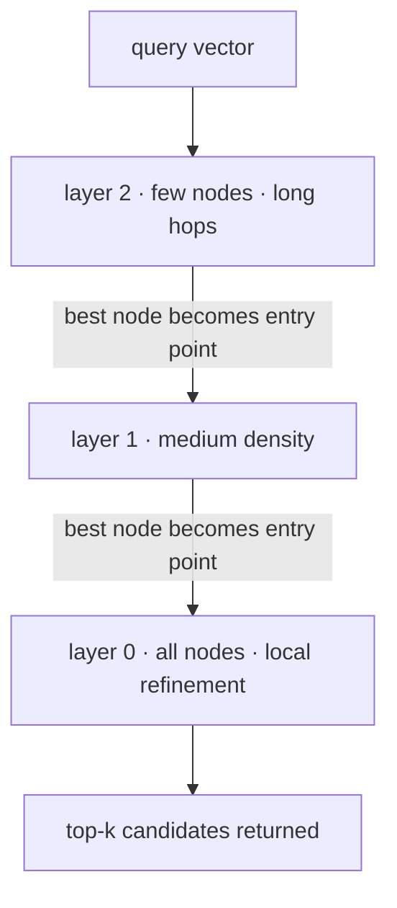
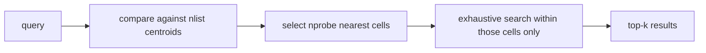

# Vector Search Fundamentals

[fnd-03](../01-foundations/fnd-03-embeddings.md) turned meaning into geometry: similar things become nearby vectors. This chapter answers the engineering question that immediately follows — **how do you actually find the nearest vectors, fast, when there are millions of them?** The honest answer has two halves, and most teams only learn the first. Half one: at small scale you don't need anything clever, and reaching for a vector database is the premature-infrastructure mistake ([fnd-01](../01-foundations/fnd-01-ai-engineering-landscape.md)) in its most common modern form. Half two: past roughly a million vectors, exact search stops being viable and you adopt an *approximate* algorithm — which means, for the first time in this curriculum, deliberately accepting wrong answers in exchange for speed. Understanding that trade is the chapter: how HNSW graphs and IVF clustering work, what product quantization compresses away, and how to measure the recall you're giving up. Everything here is evergreen — these algorithms predate LLMs by years and the trade-offs are structural, not fashionable.

## Intuition: navigating toward the answer

Imagine finding the book most similar to one you're holding, in a library with ten million volumes and no catalogue. **Brute force** is reading every spine — guaranteed correct, and hopeless at scale. The approximate alternative is what a knowledgeable librarian does: walk toward the right *wing* of the building, then the right shelf, then compare only the dozen books in front of you. You might miss a slightly better match two aisles over. You accept that, because you finished in seconds instead of weeks.

Every approximate nearest neighbor (ANN) algorithm is a formalization of that walk, and they differ mainly in how they organize the building:

- **Graph methods (HNSW)** connect each vector to its neighbors and let you *hop* toward the query, greedily, each hop landing closer.
- **Clustering methods (IVF)** pre-partition the space into cells, and search only the few cells nearest the query.
- **Quantization (PQ)** doesn't change the walk — it shrinks each book so more of the library fits in memory, at the cost of blurring the text.

The crucial reframe for engineers: **ANN search has a correctness dial, not a correctness guarantee.** The dial is called *recall* — the fraction of true nearest neighbors your search actually returned — and it trades against latency and memory. Unlike a database index, which returns exactly the rows that match, a vector index returns *probably most of* the closest vectors. Your job is to know where that dial is set and to have measured what it costs you. This is the same doctrine as everywhere else in the repo: the eval decides.

## Brute force, and when it is the right answer

Exact search (also called flat or brute-force search) compares the query against every stored vector. For $N$ vectors of dimension $d$, one query costs $O(N \cdot d)$ multiply-adds. Nothing is approximated; recall is 1.0 by definition.

The napkin math that decides whether you need anything more:

- **Memory:** $N \times d \times 4$ bytes at float32. A corpus of 100k chunks at 768 dimensions is $100{,}000 \times 768 \times 4 \approx$ **307 MB** — trivially fine. Ten million chunks at 1,536 dimensions is $10^7 \times 1536 \times 4 \approx$ **61 GB** — now you have an infrastructure problem.
- **Compute:** modern CPUs do brute-force similarity on ~100k–1M vectors in single-digit to tens of milliseconds using vectorized instructions; libraries like Faiss make this fast enough that flat indexes are the recommended baseline at small scale.[^faiss-wiki]

So the rule most teams get wrong: **below roughly one million vectors, exact search is usually the correct engineering choice.** It is simpler, has perfect recall, supports arbitrary filtering trivially, updates instantly, and needs no parameter tuning. This repo's own corpus — around 1,500 chunks when every chapter is written ([tut-06](../../tutor/rag/embedding-strategy.md)) — is four orders of magnitude below where ANN starts to pay. Adopting an ANN index there buys nothing and costs recall, tuning, and operational surface.

You escalate to approximate search when one of these binds: the vector count passes ~1M, memory exceeds what a node can hold, or query latency at your traffic exceeds budget. Not before.

## HNSW: greedy descent through a layered graph

Hierarchical Navigable Small World graphs are the dominant ANN index in production vector stores, and the mechanism is elegant enough to hold in your head.[^malkov-hnsw]

**The structure.** Every vector becomes a node connected to roughly $M$ of its nearest neighbors, forming a *navigable* graph — one where greedy "move to whichever neighbor is closer to the query" reliably approaches the true nearest neighbor. On top of that base graph sit sparser layers: each node is promoted to higher layers with exponentially decreasing probability, so the top layer holds a handful of nodes spanning the whole space. The result is a skip-list generalized to metric space: **long hops at the top, fine-grained refinement at the bottom.**

*Search descends from a sparse top layer to the dense base layer, each layer refining the entry point for the next:*

**The search.** Start at the top layer's entry point, greedily hop to closer neighbors until no neighbor improves, then drop to the next layer using that node as the new entry point. At the base layer, instead of tracking a single best node, keep a candidate list of size `efSearch` and explore until it stops improving. Return the best $k$.

**The three parameters**, and what each actually trades:

| Parameter | Set at | Raising it means | Cost |
|---|---|---|---|
| `M` | build | more edges per node → better-connected graph, higher recall | more memory per vector, slower build |
| `efConstruction` | build | more thorough neighbor selection during insert → better graph quality | slower build only (free at query time) |
| `efSearch` | query | explores more candidates before stopping | higher recall, proportionally higher latency |

The operationally important asymmetry: **`efSearch` is a runtime dial you can change per query without rebuilding**, which makes it the knob you tune against your recall target. `M` and `efConstruction` are baked in at build time and changing them means a rebuild.

**The weakness engineers hit in production:** deletes. The graph's connectivity assumes its nodes exist; removing a node can strand its neighbors' paths. Implementations typically handle deletion with tombstones (mark-as-deleted, filter at query time) and reclaim space only on a periodic rebuild. For a corpus with heavy churn, that rebuild cadence is a real operational item, not a footnote — plan it the way you'd plan any index maintenance.

## IVF and product quantization: partition, then compress

The other major family partitions the space instead of graphing it, and pairs naturally with compression.

**IVF (inverted file index).** Run k-means over the vectors to find `nlist` centroids, and assign every vector to its nearest centroid's cell. At query time, compare the query to the (cheap) centroid list, pick the `nprobe` closest cells, and brute-force *only within those cells*. If you have 1,000 cells and probe 10, you've searched 1% of the corpus.

*IVF narrows the search to a few cells before doing any exact comparison:*

`nprobe` is IVF's `efSearch`: a pure runtime recall/latency dial. The characteristic IVF failure is the **cell-boundary miss** — a true nearest neighbor sitting just across the border of a cell you didn't probe. Raising `nprobe` shrinks that risk toward zero and toward brute-force cost.

**Product quantization (PQ).** A compression scheme, orthogonal to how you search.[^jegou-pq] Split each $d$-dimensional vector into $m$ sub-vectors; run k-means on each sub-space to learn a small codebook (typically 256 centroids, so one byte per sub-vector); store each vector as $m$ bytes of codebook IDs rather than $d$ floats. A 1,536-dimensional float32 vector is 6,144 bytes; the same vector as PQ with $m = 96$ is **96 bytes — a 64× reduction.** Distances are then computed approximately against the codebook with precomputed lookup tables, which is also *faster* than full-precision arithmetic.

That compression is what makes billion-scale search feasible on commodity hardware.[^johnson-faiss] The cost is genuine information loss: PQ distances are estimates, so recall drops, and the usual production pattern is to **re-rank the PQ shortlist with exact distances** on the full-precision vectors — a two-stage retrieve-wide-then-refine pattern you'll meet again as reranking in [rag-06](rag-06-advanced-retrieval.md).

The mapping to memory: those 10 million 1,536-dim vectors that needed 61 GB flat need roughly **1 GB at PQ-96** — the difference between a fleet and a laptop.

## Measuring recall honestly

The number that makes ANN engineering tractable, defined precisely: for a query, let $T_k$ be the true top-$k$ nearest neighbors (from exact search) and $A_k$ the set your index returned. Then

$$\text{recall@}k = \frac{|A_k \cap T_k|}{k}$$

Averaged over a query set, that's your index's recall. Three disciplines around it separate teams who tune ANN well from teams who guess:

- **Ground truth comes from exact search on your own data.** Run brute force over your corpus for a sample of a few hundred real queries, once, and keep the result as the answer key. Published benchmark numbers are measured on someone else's distribution and do not transfer — the same lesson as benchmark literacy in [fnd-09](../01-foundations/fnd-09-capabilities-and-limits.md).
- **Sweep the runtime dial, plot the curve.** `efSearch` (or `nprobe`) against recall and against p99 latency gives you the actual frontier for your data, from which you pick an operating point. A single measurement is not a curve.
- **Retrieval recall is not answer quality.** Recall@10 of 0.95 means the index found the vectors the *embedding model* considers closest. Whether those are the passages that actually answer the question is a separate measurement ([rag-07](rag-07-rag-evaluation.md)). Conflating the two is how teams tune an index for a week to fix what was an embedding or chunking problem.

Public ANN comparisons are a legitimate shortlisting tool — the ANN-Benchmarks methodology is the standard reference for how to measure this fairly[^aumuller-annbench] — but the operating point is yours to choose on your data.

## Filtered search: the hidden hard problem

Every real system needs metadata filters — this user's documents, this date range, this document type, this tenant. On a relational index that's routine. On a vector index it is the genuinely difficult part, because **the filter and the geometry fight each other.**

Two naive strategies, both broken at the edges:

- **Post-filtering:** retrieve top-$k$ by vector similarity, then drop results failing the filter. Fast, and catastrophically lossy when the filter is selective — if only 0.1% of documents match the filter, your top-100 vector results may contain *zero* of them, and you return an empty list despite thousands of valid matches existing.
- **Pre-filtering:** compute the matching ID set first, then search only within it. Correct, but it breaks the index's structure: an HNSW graph traversal that can only visit allowed nodes may find the graph disconnected and fail to navigate, degrading toward a scan.

Production systems therefore implement something in between — filtered traversal that checks predicates during the graph walk, or per-filter partitions/namespaces for common high-cardinality filters (a tenant per namespace being the classic). The engineering consequences you carry into [rag-03](rag-03-vector-databases.md):

1. **Filtering quality is a store-selection criterion**, often a more decisive one than raw ANN speed.
2. **High-selectivity filters are the danger zone.** If a filter routinely matches a tiny fraction of the corpus, partition on that field rather than filtering — a separate collection per tenant beats a tenant predicate.
3. **Test filtered recall separately from unfiltered recall.** They can differ enormously, and unfiltered recall is the number vendors publish.

## Production engineering perspective

- **Choose the escalation, don't inherit it.** Flat/exact below ~1M vectors; HNSW when you need speed at scale and can afford memory; IVF+PQ when memory is the binding constraint (very large corpora). Most application teams live in the first two.
- **Build cost is real.** HNSW index construction is expensive at scale (it's inserting every vector into a graph with `efConstruction` searches each). Budget it, and remember that an embedding-model change forces both a re-embed *and* a rebuild ([fnd-03](../01-foundations/fnd-03-embeddings.md)'s versioning tax, compounded).
- **Memory is the capacity planner.** For HNSW, budget vectors *plus* graph edges (roughly $M \times$ a few bytes per node, often 20–40% overhead). Quantization trades that memory for recall — measure the trade, never assume it.
- **The index is derived data.** Raw text and vectors are the system of record; the index is rebuildable ([eng-01](../../engineering/eng-01-rag-pipeline-architecture.md)'s contract). This is what makes parameter changes and version migrations batch jobs instead of incidents.
- **Instrument recall in production, not just latency.** Latency alarms are standard; recall silently degrades as the corpus grows past the parameters you tuned for. Periodically re-run your ground-truth sample against the live index.

## Historical evolution

**1970s–1990s:** exact spatial indexes (k-d trees, ball trees) work beautifully in low dimensions and collapse in high ones — the curse of dimensionality means that past a few dozen dimensions, tree pruning stops eliminating anything and degenerates to a full scan. **2000s:** locality-sensitive hashing (LSH) offers the first practical high-dimensional approximation with provable guarantees, dominating academically but proving memory-hungry in practice. **2010–2011:** product quantization makes billion-vector corpora storable, shifting the field from "can we search it" to "can we store it".[^jegou-pq] **2016:** HNSW demonstrates that navigable graphs beat prior methods across most recall/latency operating points, and becomes the default.[^malkov-hnsw] **2017:** GPU implementations push billion-scale search into practical reach.[^johnson-faiss] **2021–present:** the algorithms stay put while the *packaging* changes — ANN moves from libraries you embed to managed databases you call ([rag-03](rag-03-vector-databases.md)), and the LLM boom makes vector search mainstream infrastructure. Note the shape of that history: the last fundamental algorithmic shift was a decade ago, which is exactly why this chapter is evergreen while the product landscape around it churns quarterly.

## Common misconceptions

- **"You need a vector database for RAG."** You need one past a scale most projects never reach. Below ~1M vectors, exact search in a library — or in a Postgres extension — is faster to build, perfectly accurate, and trivially filterable.
- **"ANN search returns the nearest neighbors."** It returns *probably most of* them. Recall is a tunable number that you should have measured, not a guarantee you can assume.
- **"Higher-dimensional embeddings are strictly better."** Dimensions cost linearly in memory and search time at every layer of this chapter. The right dimension is the smallest one that passes your retrieval eval ([fnd-03](../01-foundations/fnd-03-embeddings.md)).
- **"HNSW vs. IVF is a quality question."** It's mostly a memory-and-update-pattern question. HNSW: faster at high recall, more memory, awkward deletes. IVF+PQ: far less memory, needs training on a data sample, better for enormous static corpora.
- **"Recall@10 of 0.95 means our retrieval is good."** It means your index approximates your *embedding model* well. Whether the embeddings themselves surface the right passages is a different, downstream measurement (rag-07).
- **"We can add filtering later."** Filtering interacts with the index structure so deeply that it constrains store choice and partitioning strategy. Design it in from the start.

## Failure modes and trade-offs

- **Post-filter starvation** — selective filters return empty or near-empty result sets despite plenty of matching documents. *Fix:* pre-filtering or filtered traversal; partition on high-selectivity fields. *Trade-off:* partitions multiply index count and operational surface.
- **Recall decay with growth** — parameters tuned at 100k vectors quietly underperform at 5M as the graph/cells get denser. *Fix:* periodic ground-truth re-measurement; treat recall as a monitored SLI.
- **Delete debt (HNSW)** — tombstoned nodes accumulate, inflating memory and slowing traversal. *Fix:* scheduled rebuilds; *trade-off:* rebuild windows and the compute they cost.
- **PQ over-compression** — aggressive quantization crushes recall on fine distinctions, and (worse) does so unevenly across the corpus. *Fix:* exact re-ranking of the shortlist; measure per-query-class, not just on average.
- **Tuning the wrong layer** — spending a week on `efSearch` when the real problem is chunk boundaries ([rag-04](rag-04-chunking.md)) or an ill-suited embedding model. *Fix:* attribute before optimizing — compare against exact-search results; if exact search *also* returns bad passages, the index was never the problem.
- **The universal trade-off:** recall ↔ latency ↔ memory. You may pick two comfortably; the third is what you pay. Every parameter in this chapter is a point on that surface.

## Best practices

- **Start with exact search.** Add ANN when a measured constraint (vector count, memory, latency) forces it, and note which one.
- **Build the ground-truth set early** — a few hundred real queries with exact-search answers — and keep it. Every later tuning decision consults it.
- **Sweep the runtime dial and plot recall vs. p99 latency** before choosing an operating point; pick the point your product's tolerance justifies, and write down why.
- **Normalize vectors at write time and use inner product** (fnd-03) so the metric question stops being a question.
- **Test filtered recall separately**, especially for your most selective filters; partition rather than filter when selectivity is extreme.
- **Treat the index as rebuildable derived data**, with raw text as the system of record and a scripted, resumable rebuild path.
- **Monitor recall, not just latency**, and re-measure after corpus growth, embedding-model changes, or parameter edits.
- **Security posture:** vector indexes inherit source-document access control — enforce it as a *filter in the query*, never as a post-hoc pass over results ([eng-09](../../engineering/eng-09-security-guidelines.md)).

## Real-world examples

**The vector database nobody needed.** A team building internal document search stands up a managed vector database, a separate service, and a sync pipeline for a corpus of 40,000 chunks. Three weeks of infrastructure, a monthly bill, and a new failure mode (sync lag) — for a corpus that fits in 120 MB and that exact search answers in under 20 ms. The rebuild collapses the whole thing into a `pgvector` table beside the application's existing Postgres, with exact search and no ANN parameters at all: same latency, better filtering (SQL predicates, no post-filter starvation), one less system. The lesson is the escalation rule: the scale threshold is a *measurement*, not a vibe, and most corpora are below it.

**The filter that returned nothing.** A multi-tenant support-search product filters results by `tenant_id` after retrieving the top 50 by similarity. It works in testing (few tenants, similar volumes) and fails in production for small tenants: their documents are a rounding error in the corpus, so the global top-50 contains none of theirs and the app shows "no results" to a customer whose answer is definitely indexed. Diagnosis is textbook post-filter starvation. The fix is architectural, not parametric — a namespace per tenant, so every search is inside the right partition by construction. It also, incidentally, made the access-control story enforceable rather than advisory.

**The recall curve that saved a rewrite.** A team on 8M vectors reports "retrieval got worse" after a corpus expansion and prepares to migrate to a different index type. Before migrating, they run the ground-truth check they'd built earlier: recall@10 has fallen from 0.94 to 0.71 at the same `efSearch`, purely because the graph grew denser. Raising `efSearch` from 64 to 200 restores recall to 0.95 at a p99 latency cost of 11 ms — well inside budget. Total fix: one config value. Without the ground-truth set, they'd have spent a quarter rewriting the layer that was never broken.

## Interview questions

1. **"When would you *not* use a vector database?"** — Model answer: below roughly a million vectors, which covers most application corpora. At that scale exact search is fast (tens of milliseconds), has perfect recall, filters trivially with ordinary predicates, updates instantly, and needs no tuning — while an ANN index costs recall, parameters, rebuild cadence, and often a separate service. I'd also skip a dedicated store when the data already lives in Postgres and pgvector covers it. The escalation triggers are measured: vector count past ~1M, memory exceeding a node, or p99 latency over budget.

2. **"Explain HNSW to someone who knows skip lists."** — Model answer: it's a skip list generalized to metric space. The base layer is a proximity graph where each vector links to about `M` near neighbors, built so greedy "step to the closer neighbor" navigates reliably. Above it sit exponentially sparser layers for long-range hops. A search enters at the top, greedily descends to a local optimum per layer, uses that node as the entry point one layer down, and at the base layer explores a candidate set of size `efSearch` before returning top-k. `efSearch` is the runtime recall/latency dial; `M` and `efConstruction` are build-time and require a rebuild to change.

3. **"What does product quantization actually do, and what does it cost?"** — Model answer: it compresses vectors by splitting each into sub-vectors and replacing each sub-vector with the ID of the nearest centroid in a learned per-subspace codebook — typically one byte each, so a 1,536-dim float32 vector goes from 6 KB to ~96 bytes, a 64× reduction that's also faster to compare via lookup tables. The cost is real information loss: distances become estimates and recall drops, unevenly across the corpus. Standard mitigation is two-stage — use PQ to get a shortlist cheaply, then re-rank that shortlist with exact distances on full-precision vectors.

4. **"Your filtered searches return far fewer results than expected. Diagnose."** — Model answer: almost certainly post-filter starvation — the system retrieves top-k by similarity globally and *then* applies the predicate, so when the filter is selective the top-k contains few or no matching documents even though many exist. Confirm by running the same filter as a pure metadata query and comparing counts. Fixes in order: switch to pre-filtering or filtered graph traversal if the store supports it; for extremely selective, high-cardinality fields like tenant ID, partition into namespaces so the filter becomes the index boundary rather than a predicate. And test filtered recall separately — vendor recall numbers are unfiltered.

5. **"How do you set `efSearch` (or `nprobe`)?"** — Model answer: empirically, against ground truth from my own data. Build an answer key by running exact search for a few hundred real queries, then sweep the parameter and plot recall@k and p99 latency. That gives the actual frontier, and I pick the operating point my product tolerates — a chat feature might accept 0.90 recall for lower latency, a compliance search wouldn't. Then I keep the ground-truth set and re-measure after corpus growth or model changes, because recall drifts with scale even when the parameter doesn't move.

6. **"Retrieval quality is bad. How do you tell whether the index is at fault?"** — Model answer: compare against exact search on the same queries. If exact search returns good passages and the ANN index doesn't, it's a recall problem — tune the runtime dial or revisit index parameters. If exact search *also* returns bad passages, the index is innocent and the problem is upstream: the embedding model, the chunking, or the query formulation. That one comparison prevents the most common wasted week in retrieval engineering, and it's the same attribute-before-fixing discipline that governs the whole RAG pipeline.

7. **"What breaks when you delete a lot of vectors from an HNSW index?"** — Model answer: HNSW's navigability assumes its nodes are present, so implementations usually tombstone deletions rather than surgically removing nodes — filtering them at query time. Tombstones accumulate: memory stays allocated, traversal visits dead nodes, and effective recall can drift because the graph's structure reflects a corpus that no longer exists. The remedy is a periodic rebuild, which for high-churn corpora is a scheduled operational task with a compute budget — worth knowing before you choose HNSW for data with heavy turnover.

## Exercises and mini-project

**Exercises**

1. Compute flat-index memory for: 200k chunks at 384 dims; 2M at 768; 50M at 1,536 (float32). Which fit in 16 GB? Recompute the third with PQ at 96 bytes/vector.
2. A corpus has 1,000 IVF cells and you set `nprobe=5`. What fraction of the corpus is searched? Describe the specific failure this creates and the parameter that mitigates it.
3. Your filter matches 0.05% of documents and you post-filter a top-200 vector search. Estimate the probability of returning zero results, and state the architectural fix.
4. Explain why `efConstruction` is "free at query time" but `M` is not, in terms of what each changes about the stored structure.
5. Given recall@10 = 0.62 at `efSearch=32` and 0.94 at `efSearch=256`, with p99 latency 6 ms and 34 ms respectively — pick an operating point for (a) an interactive chat feature, (b) a legal-discovery search. Justify each.

**Mini-project: build the recall curve.** Using `faiss` or `hnswlib` on the embeddings from your [fnd-03](../01-foundations/fnd-03-embeddings.md) corpus (or any 50k+ vector set): (a) build a flat index and compute exact top-10 for 200 queries — this is your ground truth; (b) build an HNSW index and measure recall@10 and p99 latency across `efSearch` ∈ {16, 32, 64, 128, 256}; plot the curve; (c) repeat for IVF across `nprobe`, and note where each family wins; (d) add PQ compression and measure the recall drop and the memory saved; then add exact re-ranking of the top-100 and measure how much recall returns; (e) write a half-page memo: your chosen index and operating point, with the number that justifies it. Target: 3 hours. Success criterion: a recall-vs-latency plot generated from your own data, and the ability to say what your index's recall actually is.

**Capstone extension:** this ground-truth query set and recall curve become the retrieval-layer baseline for your capstone RAG system — [rag-05](rag-05-rag-pipeline.md) plugs the chosen index in, and [rag-07](rag-07-rag-evaluation.md) layers answer-quality metrics on top of the recall you measured here.

## Revision summary

- Exact (flat) search costs $O(N \cdot d)$ per query and $N \times d \times 4$ bytes; it is the *correct* choice below roughly 1M vectors — perfect recall, trivial filtering, no tuning. Escalate to ANN only on a measured constraint.
- ANN trades correctness for speed via a recall dial. HNSW: layered proximity graph, greedy descent, `M`/`efConstruction` at build and `efSearch` at query; fast at high recall, memory-hungry, awkward deletes. IVF: k-means cells with `nprobe` cells probed; cheap, cell-boundary misses. PQ: sub-vector codebook compression (~64× smaller) with lossy distances, standardly paired with exact re-ranking of the shortlist.
- recall@k = |returned ∩ true top-k| / k, measured against exact search **on your own data**, swept across the runtime dial into a recall-vs-latency curve. Retrieval recall ≠ answer quality.
- Filtering is the hidden hard problem: post-filtering starves on selective filters, pre-filtering breaks graph traversal; partition on high-selectivity fields and test filtered recall separately.
- The index is derived data (raw text is the system of record); recall is a monitored SLI that drifts as the corpus grows; attribute-before-optimizing by comparing against exact search.

## Flashcards

| Q | A |
|---|---|
| Flat-index memory formula? | $N \times d \times 4$ bytes at float32 — 10M × 1536 ≈ 61 GB. |
| When is exact search the right choice? | Below roughly 1M vectors: perfect recall, trivial filtering, instant updates, zero tuning. |
| HNSW in one sentence? | A skip list in metric space: sparse upper layers for long hops, a dense base graph for refinement, navigated greedily. |
| Which HNSW parameter is a runtime dial? | `efSearch` — raises recall and latency per query, no rebuild. `M`/`efConstruction` are build-time. |
| What does `nprobe` control in IVF? | How many k-means cells are searched — the recall/latency dial; too low causes cell-boundary misses. |
| What does product quantization trade? | ~64× memory reduction and faster distance computation, for lossy (estimated) distances and lower recall. |
| Standard mitigation for PQ recall loss? | Two-stage: PQ shortlist, then exact re-ranking on full-precision vectors. |
| Definition of recall@k? | Fraction of the true top-k (from exact search) that the index actually returned. |
| Why does post-filtering fail on selective filters? | The global top-k may contain no matching documents even though many exist — returns empty despite valid answers. |
| Fix for extremely selective filters? | Partition (namespace/collection per value) so the filter becomes the index boundary, not a predicate. |
| How do you tell whether bad retrieval is the index's fault? | Compare with exact search: if exact is also bad, the problem is embeddings/chunking, not ANN. |

## Further reading

- **Official docs:** Faiss documentation and wiki[^faiss-wiki] — index-type selection guidance is the single most practical page in the field.
- **Papers:** Malkov & Yashunin, HNSW (2016)[^malkov-hnsw] — figures 1–2 carry the intuition; Jégou et al., Product Quantization (2011)[^jegou-pq]; Johnson et al., billion-scale GPU search (2017)[^johnson-faiss]; Aumüller et al., ANN-Benchmarks (2018)[^aumuller-annbench] — read for the methodology, not the leaderboard.
- **Books:** none needed; the papers plus library docs are the canon here.
- **Talks:** none essential.
- **Tutorials:** the Faiss "Guidelines to choose an index" wiki page, worked through with your own vectors, is worth more than any survey.

## Check your understanding

1. State the two numbers that decide whether you need an ANN index at all, and compute them for a 500k-chunk, 768-dimension corpus.
2. Explain the role of each HNSW parameter and which one you'd change to raise recall on a live system without a rebuild.
3. Your ANN index reports recall@10 = 0.93 but users say search is bad. What do you check next, and why is the index probably not the problem?
4. Walk through why post-filtering breaks for a tenant that owns 0.01% of the corpus, and give the fix that makes it structurally impossible.
5. This chapter is `evergreen` while [rag-03](rag-03-vector-databases.md) is `volatile`. Justify that split in terms of what each chapter actually teaches.

## Sources

[^malkov-hnsw]: [T2] Malkov & Yashunin (2016). "Efficient and robust approximate nearest neighbor search using Hierarchical Navigable Small World graphs." arXiv:1603.09320. https://arxiv.org/abs/1603.09320 (accessed 2026-07-10)
[^jegou-pq]: [T2] Jégou, Douze & Schmid (2011). "Product Quantization for Nearest Neighbor Search." IEEE TPAMI 33(1). https://ieeexplore.ieee.org/document/5432202 (accessed 2026-07-10)
[^johnson-faiss]: [T2] Johnson, Douze & Jégou (2017). "Billion-scale similarity search with GPUs." arXiv:1702.08734. https://arxiv.org/abs/1702.08734 (accessed 2026-07-10)
[^aumuller-annbench]: [T2] Aumüller, Bernhardsson & Faithfull (2018). "ANN-Benchmarks: A Benchmarking Tool for Approximate Nearest Neighbor Algorithms." arXiv:1807.05614. https://arxiv.org/abs/1807.05614 (accessed 2026-07-10)
[^faiss-wiki]: [T1] Meta AI. "Faiss documentation." https://faiss.ai/ (accessed 2026-07-10)
