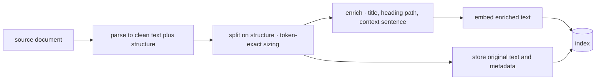

# Chunking & Document Processing

Chunking is the least glamorous decision in a RAG system and the one that sets its ceiling. The reason is structural: **the chunk is the unit of retrieval, so a fact that isn't wholly inside some chunk cannot be retrieved correctly, no matter how good your embedding model, index, or reranker are.** Every downstream component can only reorder and filter what chunking made available. This chapter covers the size trade-off and why token-exact counting matters, the strategy ladder from fixed-size splitting to structure-aware chunking, the enrichment step that fixes chunks which can't speak for themselves, and decoupling what you *embed* from what you *show the model*. It ends where real projects actually spend their time — parsing PDFs, tables, and scans, which is unglamorous, high-yield, and consistently underestimated. The strategy ladder is stable; the parsing-tool landscape is not, and is fenced accordingly.

## Intuition: a chunk must answer for itself

The governing test for any chunking scheme: **could a competent person, handed this chunk alone with no surrounding document, use it to answer the question it should match?** If not, the chunk is broken regardless of its size or boundaries.

Two mechanisms make that test the right one, and both are already established:

- **The single-vector bottleneck** ([fnd-03](../01-foundations/fnd-03-embeddings.md)): a chunk becomes exactly one fixed-length vector — a lossy summary. Cram three topics in and you get a blurry centroid matching queries about none of them precisely. Split a single idea across two chunks and neither vector represents the whole idea.
- **The retrieved chunk is what the model sees** ([rag-01](rag-01-context-engineering.md)): the assembler places chunk text into the context. A chunk reading "This approach reduces latency by 40%" — with *which* approach living in the previous chunk — hands the model an orphaned claim it will cheerfully misattribute.

That second failure is worth naming because it is invisible at retrieval time and visible only as bad answers: retrieval metrics look fine (the right chunk was returned!) while the answer is wrong (the chunk didn't contain what made it meaningful). It's the same self-containment discipline this repository imposes on its own H2 sections in [METADATA_SCHEMA](../../METADATA_SCHEMA.md) — written that way precisely so chunking it is trivial.

## The size trade-off

Chunk size trades two failure modes against each other, and both are real:

| Small chunks (~100–200 tokens) | Large chunks (~1,000–2,000 tokens) |
|---|---|
| Precise embeddings — one idea, one vector | Blurry embeddings — averaged across topics |
| High retrieval precision | Higher recall (the answer is probably in there somewhere) |
| Orphaned context; references dangle | Self-contained; surrounding context included |
| More chunks → more index cost | Fewer chunks; more tokens per retrieved result |
| Answer may be split across chunks | Wasted context budget on irrelevant surrounding text |

The working band for prose is **300–800 tokens**, which is where most production systems land — enough to hold a complete thought, small enough to embed sharply. But treat that as a *starting point to measure from*, not a constant: the right size depends on your documents' structure and your queries' granularity, and it's cheap to test ([rag-07](rag-07-rag-evaluation.md) provides the metric).

Two operational rules that are not optional:

- **Count tokens, never characters.** The `len(text) // 4` heuristic diverges from real token counts by up to ~40% on code and non-Latin scripts ([fnd-04](../01-foundations/fnd-04-tokenization.md)), which silently pushes chunks past the embedding model's input limit where they are **tail-truncated without error** — the content is simply gone from the index. Use the embedding model's own tokenizer.
- **Overlap is a crutch, used sparingly.** Repeating ~10–15% of adjacent text hedges against a boundary cutting mid-idea. It is worth a small dose, but heavy overlap (30%+) inflates index size and returns near-duplicate chunks that waste context budget. If you need heavy overlap, your *boundaries* are wrong — fix those instead.

## The strategy ladder

Four strategies, in ascending order of effort. Climb only when the rung below demonstrably fails on your corpus.

**1. Fixed-size splitting.** Split every N tokens with overlap. Trivial, structure-blind, and it will cut mid-sentence and mid-table. Legitimate as a baseline to beat and as a fallback for genuinely unstructured text.

**2. Structure-aware splitting (the default).** Split on the document's own hierarchy — headings, then paragraphs, then sentences — recursively, only descending when a unit exceeds the size budget.[^langchain-splitters] Because human-authored documents already mark their semantic boundaries with structure, this cheaply produces chunks that align with ideas. **Start here.** For this repository, that means splitting on H2 headings ([tut-05](../../tutor/rag/chunking.md)).

**3. Format-specific handling.** Structure-aware splitting needs per-format rules, and these matter more than the generic algorithm:
- **Tables:** never split a table across chunks — a fragment of rows without the header is uninterpretable. Keep whole, or serialize each row with the header repeated.
- **Code:** split on function/class boundaries, not line counts; a half-function retrieves poorly and helps nobody.
- **Transcripts/chat:** split on speaker turns or topic shifts, keeping speaker attribution in every chunk.
- **Slides:** one slide (plus its notes) is usually the natural unit.

**4. Semantic / proposition chunking.** Use embeddings to detect topic shifts and cut there, or decompose text into atomic factual propositions.[^chen-densex] Genuinely improves retrieval granularity in some settings, at meaningfully higher indexing cost and complexity. Reach for it after enrichment (below) has been tried — it is usually not the highest-yield next move.

## Enrichment: making chunks self-contained

Structure-aware chunking gets boundaries right but doesn't fix the orphaned-reference problem: a chunk from the middle of a document still lacks the document's identity. Enrichment fixes it at index time, and it is the single highest-yield technique in this chapter.

**Prepend context before embedding.** Give each chunk a short header situating it — document title, section path, and (optionally) a model-generated sentence explaining what this chunk covers within the document. Embed the *enriched* text; store the original for display. Anthropic's published results on this pattern ("contextual retrieval") report substantial reductions in retrieval failure rate versus naive chunking, with the gain compounding when combined with hybrid search and reranking.[^anthropic-contextual]

```text
[Acme 2024 Security Policy › Access Control › Contractor accounts]
This section covers how contractor accounts are provisioned and revoked.

Contractors must be sponsored by a full-time employee. Access expires
90 days after the sponsorship record ends...
```

The embedded vector now encodes *what this is about* alongside *what it says*, so a query like "how long do contractor accounts last at Acme" matches — where the bare chunk (which never repeats "Acme" or "contractor account provisioning") might not.

**Attach metadata for filtering and provenance.** Source document ID, title, heading path, dates, ACL, document type, chunk position. This feeds filtered search ([rag-03](rag-03-vector-databases.md)), citation rendering ([rag-05](rag-05-rag-pipeline.md)), and freshness — it is not optional bookkeeping but the substrate of most downstream features.

**Decouple the retrieval unit from the generation unit.** A powerful and underused move: embed small (precise matching), but return large (complete context). Two standard forms — *parent-document retrieval*, where you index child chunks and hand the model the parent section on a hit; and *summary indexing*, where you embed a generated summary but return the full text. Both dissolve much of the size trade-off from the previous section: precision from the small vector, sufficiency from the large payload.

*The ingestion path, with enrichment as the step between splitting and embedding:*



Note what is embedded versus what is stored: the enriched text drives matching; the original drives display and citation. Conflating them either pollutes answers with your scaffolding or throws away the retrieval gain.

## Parsing: where the schedule actually goes

Everything above assumes clean text. Obtaining clean text from real documents is the part that consumes the project.

- **Born-digital PDFs** have a text layer — extract it directly. Paying a vision model to re-read text that is already present is the most common waste in document pipelines ([api-04](../02-llm-apis/api-04-multimodal.md)).
- **Scanned PDFs and images** need OCR or a vision model, and the choice matters because the *failure modes differ*: OCR fails loudly (visible garbage you can detect and route), vision models fail *fluently* (plausible invented text that looks like success). For anything high-stakes, prefer the loud failure or gate the fluent one with confidence/abstention fields (api-04's doctrine).
- **Layout is meaning.** Multi-column PDFs read in the wrong order become word salad; headers/footers repeated on every page become noise in every chunk; tables flattened to prose lose their row-column relationships. Layout-aware parsers exist for exactly this.[^unstructured-docs]
- **HTML** needs boilerplate stripped (navigation, cookie banners, footers) or every chunk inherits the same junk, which both wastes budget and makes chunks look spuriously similar to each other.

The engineering posture that pays: **fail loudly at ingestion.** A document that parsed to 200 characters when it should be 20 pages must raise an alarm, not enter the index as a near-empty chunk. Silent parse failures are undetectable downstream — they present as "the system doesn't know about that document," which teams then misdiagnose as a retrieval problem and spend a week tuning the index for ([rag-02](rag-02-vector-search.md)'s attribution rule).

> **Volatile:** the parsing/extraction tool landscape (layout-aware parsers, OCR engines, VLM-based extractors) moves quickly, and vision-model document capability especially so. The *decisions* — text layer first, loud failure, layout awareness, table integrity — are stable. Re-verify tooling at review cadence.

## Production engineering perspective

- **Chunking is versioned config, and changes force a reindex.** `chunker_version` belongs on every chunk ([rag-03](rag-03-vector-databases.md)); a strategy change means re-processing the corpus, so treat it like an embedding-model change and rehearse the blue/green rebuild.
- **Ingest once, query many.** Parsing and enrichment are expensive; do them at ingestion, never per query. Enrichment that calls a model per chunk is a natural batch-API workload — half price, no rate-limit pressure on interactive traffic ([api-05](../02-llm-apis/api-05-streaming-caching-batch.md)).
- **Cost of enrichment is real but bounded.** A context sentence per chunk is one cheap model call per chunk at index time. For 100k chunks that's a meaningful one-off spend — and it is usually the best retrieval-quality-per-dollar available, because it improves every future query.
- **Instrument the pipeline:** chunks per document (outliers reveal parse failures), token-length distribution (spikes reveal truncation risk), parse error rate, and enrichment coverage. These catch the silent failures that retrieval metrics can't.
- **Deletion and update propagate through chunks.** One source document maps to many chunks; edits must delete-then-reinsert the whole document's chunk set, or you accumulate orphans representing text that no longer exists ([sec-03](../07-safety-security/sec-03-privacy-compliance.md) makes this a compliance requirement, not just hygiene).

## Historical evolution

**2020:** the original RAG work retrieves fixed-size passages (100-word Wikipedia snippets) — chunking is an implementation detail nobody discusses.[^lewis-rag] **2022–2023:** LLM RAG goes mainstream, framework defaults (fixed 1,000 characters with 200 overlap) become the de facto standard, and teams discover that character-based splitting butchers structured documents; recursive/structure-aware splitters become the norm.[^langchain-splitters] **2023–2024:** the field recognizes chunk *self-containment* as the real problem rather than chunk size — parent-document retrieval, summary indexing, and proposition-level granularity are explored,[^chen-densex] and contextual enrichment demonstrates large retrieval-failure reductions from simply prepending document context before embedding.[^anthropic-contextual] **2024–present:** parsing quality (layout-aware extraction, VLM-based document understanding) becomes the differentiator as chunking strategy itself stabilizes. The arc: from *how big* → *where to cut* → *what each chunk needs to carry* → *how to get clean text at all* — each stage revealing the previous one wasn't the bottleneck.

## Common misconceptions

- **"There's an optimal chunk size."** There's an optimal size *for your documents and your query granularity*, found by measuring (rag-07). 300–800 tokens is where to start looking, not an answer.
- **"Overlap fixes bad boundaries."** It hedges them. Heavy overlap inflates the index and returns near-duplicates that eat context budget; correct boundaries plus enrichment beat overlap at every dose.
- **"Semantic chunking is the sophisticated choice."** It's the *expensive* choice, and it usually ranks below structure-aware splitting plus enrichment on quality-per-effort. Climb the ladder in order.
- **"Chunk once, retrieve the same thing."** Embedding unit and returned unit can differ — parent-document and summary-indexing patterns give you precision *and* sufficiency, dissolving much of the size trade-off.
- **"Chunking is preprocessing; the real work is retrieval."** Chunking sets the ceiling retrieval operates under. A fact split across two chunks cannot be retrieved whole by any reranker.
- **"We'll extract text with a vision model — it's simpler."** For born-digital PDFs it's slower, costlier, and *riskier* (fluent misreading) than reading the text layer that's already there.

## Failure modes and trade-offs

- **Silent truncation at embedding time** — character-estimated chunks exceed the model's token limit and the tail is dropped without error, removing content from the index invisibly. *Fix:* token-exact counting with the embedding model's tokenizer (fnd-04).
- **Orphaned chunks** — retrieval returns the right chunk but its referents live elsewhere; the model misattributes or hedges. *Fix:* enrichment; parent-document retrieval. *Detection:* read the assembled context for failures, don't just check whether retrieval "hit."
- **Split tables and functions** — fragments that are individually meaningless. *Fix:* format-specific rules that treat these as atomic. *Trade-off:* some chunks exceed the target size band; accept that over splitting them.
- **Boilerplate contamination** — nav bars and page footers in every chunk make chunks spuriously similar and waste budget. *Fix:* parser-level stripping before splitting.
- **Silent parse failure** — a 40-page scan yields three lines; the document is effectively absent and the symptom appears as a retrieval gap. *Fix:* alarm on chunks-per-document and extracted-length outliers at ingestion.
- **Reindex avoidance** — chunking is known to be wrong but nobody wants to re-process, so the flaw is permanent. *Fix:* a rehearsed rebuild path makes strategy changes routine (rag-03).
- **The core trade-off:** precision (small) vs. sufficiency (large), which decoupling the embedded unit from the returned unit largely, but not entirely, resolves — at the cost of pipeline complexity.

## Best practices

- **Start structure-aware** (headings → paragraphs → sentences), token-exact, 300–800 tokens, ~10% overlap. Measure before elaborating.
- **Enrich before embedding**: document title + heading path + optional generated context sentence; embed enriched text, store and display the original.[^anthropic-contextual]
- **Attach metadata at chunk creation** — source ID, title, heading path, date, ACL, position, `chunker_version`, `embedding_model_version` — it powers filtering, citations, freshness, and migration detection.
- **Make tables, code units, and speaker turns atomic**; extract text layers from born-digital PDFs rather than re-reading them visually.
- **Fail loudly at ingestion** and alarm on chunks-per-document, length distribution, and parse errors.
- **Consider parent-document retrieval** when chunks must be small for precision but answers need surrounding context.
- **Version the chunker and rehearse reindexing**; run enrichment through the batch tier to control cost.
- **Measure chunking choices against a retrieval eval** (rag-07) — this chapter's every recommendation is a hypothesis your data can falsify.

## Real-world examples

**The 40% that vanished.** A pipeline sizes chunks with `len(text) // 4` and caps at what it believes is the embedding model's limit. On a corpus heavy with code samples and JSON, real token counts run ~40% above the estimate, so a meaningful share of chunks exceed the model's input limit and are **tail-truncated silently at embedding time**. Retrieval quality is mediocre in a way that resists every fix attempted — better model, more overlap, higher top-k — because the missing content was never in the index. Diagnosis takes twenty minutes once someone tokenizes the longest chunks and compares to the estimate. The fix is one line; the lesson is fnd-04's, learned the expensive way.

**Enrichment beating a model upgrade.** A policy-search tool retrieves poorly on questions naming the company or the policy area, because individual chunks — written as internal prose — rarely repeat that context. The team is preparing to fine-tune an embedding model. Instead they try prepending `[document title › heading path]` plus a one-sentence generated summary to each chunk before embedding: a one-off batch job over the corpus. Recall@10 on their 60-query eval improves substantially, the fine-tune is cancelled, and the change is reversible and cheap. Retrieval failures caused by missing context are fixed by adding context, not by a stronger model — the highest-leverage move in this chapter, and the cheapest.

**The document that was never there.** Support engineers report the bot "doesn't know" about a major product manual that is definitely indexed. Retrieval debugging finds nothing wrong. The actual cause is at ingestion: the manual is a scanned PDF, the parser found no text layer, produced 40 characters of noise, and indexed it without complaint. The document occupies one meaningless chunk. Fixes: an OCR path for scans, and an ingestion alarm on documents yielding implausibly few chunks. The general lesson is that retrieval debugging cannot find problems that happened before the index — check ingestion first when an entire document seems absent.

## Interview questions

1. **"Why does chunking set the ceiling on RAG quality?"** — Model answer: the chunk is the unit of retrieval, so everything downstream — embeddings, ANN search, reranking, the model itself — can only reorder and filter what chunking made available. A fact split across two chunks can't be retrieved whole; a chunk mixing three topics embeds to a blurry centroid matching none precisely; a chunk whose referents live in the previous chunk gets misattributed by the model. That's why chunking failures masquerade as embedding or model failures, and why I'd check chunk boundaries before tuning an index.

2. **"How do you choose chunk size?"** — Model answer: start at 300–800 tokens with structure-aware boundaries, counted with the embedding model's actual tokenizer rather than a characters-per-token heuristic — that estimate is off by up to ~40% on code and non-Latin text, which causes silent truncation at the embedding limit. Then measure: build a retrieval eval with real queries and labeled relevant chunks, and test two or three sizes. The right answer depends on document structure and query granularity, and it's cheap to test. If precision wants small chunks but answers need surrounding context, decouple the units — embed small, return the parent section.

3. **"What is contextual enrichment and why does it work?"** — Model answer: before embedding, prepend a short header to each chunk situating it in its document — title, heading path, optionally a generated sentence about what the chunk covers — then embed the enriched text while storing the original for display. It works because a mid-document chunk rarely restates its own context: it says "access expires after 90 days" without repeating "contractor accounts at Acme," so queries naming those things don't match. Published results show substantial reductions in retrieval-failure rate from this alone, and it's a one-off batch cost at index time that improves every subsequent query.

4. **"An entire document seems missing from search results. Walk your diagnosis."** — Model answer: check ingestion before retrieval, because retrieval debugging can't find what was never indexed. Query the store directly for any chunk from that document ID. If none exist, it's a pipeline failure — likely a parse failure (scanned PDF with no text layer, unsupported format, layout extraction producing noise) or a filter excluding it. If chunks exist but are tiny or garbled, it's a parse-quality problem. Only if the chunks look correct do I move to retrieval — embedding mismatch, boundaries, or filters. The systemic fix is an ingestion alarm on documents producing implausibly few chunks or implausibly little text.

5. **"When would you use parent-document retrieval?"** — Model answer: when the granularity that retrieves best and the granularity the model needs to answer differ — which is common. Small chunks embed precisely and match queries sharply; but answering may need the surrounding section for definitions, conditions, or the table the sentence refers to. Parent-document retrieval indexes the small chunks and returns the enclosing section on a hit, giving precision in matching and sufficiency in generation. Cost is pipeline complexity and more context tokens per result, so I'd adopt it when the eval shows retrieval hitting the right area but answers lacking necessary context.

6. **"How do you handle tables and PDFs?"** — Model answer: tables are atomic — never split across chunks, because rows without a header are uninterpretable; either keep the table whole (accepting an oversized chunk) or serialize row-wise with the header repeated. For PDFs: born-digital ones have a text layer, so extract it directly rather than paying a vision model to re-read text that's already present. Scans need OCR or a vision model, and the choice hinges on failure mode — OCR fails loudly with visible garbage, vision models fail fluently with plausible invented text, which is more dangerous unindexed. Layout awareness matters throughout: multi-column reading order, repeated headers/footers as noise, and table structure are where naive extraction destroys meaning.

## Exercises and mini-project

**Exercises**

1. Take a 2,000-token document section containing a table. Show where fixed-size 500-token splitting would cut it, and what each resulting chunk would be missing.
2. Compute chunk counts and index size for a 5,000-document corpus (avg 8,000 tokens/doc) at chunk sizes 200, 500, and 1,000 tokens with 10% overlap. What does this imply for embedding cost?
3. Write the enrichment header template for a corpus of customer support tickets, and explain which query types each field rescues.
4. A chunk reads: "This reduces cost by 40% with no measurable quality loss." List everything a reader can't determine, then rewrite the chunking/enrichment approach so they can.
5. Design the ingestion alarms that would have caught the scanned-manual failure: what you measure per document, and the threshold logic.

**Mini-project: the chunking bake-off.** Using the corpus and retrieval eval from [rag-02](rag-02-vector-search.md): (a) build three indexes — fixed-size 500-token, structure-aware, and structure-aware + enrichment (document title, heading path, and a generated context sentence via a batch job); (b) measure recall@10 on your labeled queries for each; (c) find three queries where enrichment changes the outcome and explain the mechanism in each; (d) add a deliberately broken document (a scan with no text layer, or a table-heavy page) and verify your ingestion alarms fire; (e) write a half-page memo: chosen strategy, measured delta, and the enrichment cost per 100k chunks. Target: 3 hours. Success criterion: a measured recall delta from enrichment on your own data — most teams are surprised by its size.

**Capstone extension:** this chunker (with its `chunker_version` stamp and ingestion alarms) becomes the ingestion path of your capstone RAG system in [rag-05](rag-05-rag-pipeline.md), feeding the store chosen in [rag-03](rag-03-vector-databases.md).

## Revision summary

- The chunk is the unit of retrieval and therefore the quality ceiling: nothing downstream can retrieve a fact that no chunk wholly contains. Test every scheme with "could someone answer from this chunk alone?"
- Size trades precision (small, sharp embeddings) against sufficiency (large, self-contained). Work in the 300–800 token band, count tokens with the embedding model's tokenizer (never chars/4 — silent truncation), and use overlap sparingly as a hedge rather than a fix for bad boundaries.
- Ladder: fixed-size (baseline) → structure-aware (the default) → format-specific rules (tables, code, transcripts atomic) → semantic/proposition (expensive, last).
- Enrichment is the highest-yield step: prepend document title, heading path, and a generated context sentence before embedding; store the original for display; attach metadata for filtering, citation, freshness, and versioning. Decouple embedded unit from returned unit (parent-document retrieval) to get precision and sufficiency at once.
- Parsing consumes the schedule: text layer for born-digital PDFs, OCR-vs-VLM chosen on failure mode (loud vs. fluent), layout awareness, boilerplate stripping — and loud ingestion failures with alarms, because retrieval debugging cannot find documents that never entered the index.

## Flashcards

| Q | A |
|---|---|
| Why is chunking the quality ceiling? | The chunk is the retrieval unit — downstream components can only reorder what chunking made available; a split fact can't be retrieved whole. |
| The self-containment test? | Could a competent person answer from this chunk alone, with no surrounding document? |
| Working chunk-size band, and how to measure it? | 300–800 tokens as a starting point, counted with the embedding model's tokenizer, then validated against a retrieval eval. |
| What does chars/4 sizing cause? | Underestimates by up to ~40% on code/non-Latin text → chunks exceed the embedding limit and are silently tail-truncated. |
| The strategy ladder? | Fixed-size → structure-aware (default) → format-specific rules → semantic/proposition (expensive, last). |
| What is contextual enrichment? | Prepending document title, heading path, and a context sentence before embedding (storing the original for display) — large retrieval-failure reductions for a one-off batch cost. |
| Parent-document retrieval? | Embed small chunks for precision, return the enclosing section for sufficiency — decoupling the retrieval unit from the generation unit. |
| Rule for tables and code? | Atomic — never split; a table without its header or a half-function is uninterpretable. |
| Born-digital PDF handling? | Extract the existing text layer; re-reading it with a vision model is slower, costlier, and risks fluent misreading. |
| Why alarm on chunks-per-document? | Silent parse failures make a document effectively absent, and retrieval debugging can't detect what was never indexed. |
| What forces a reindex from this chapter? | Any chunker strategy change — hence `chunker_version` on every chunk and a rehearsed rebuild. |

## Further reading

- **Official docs:** LangChain text-splitters concepts[^langchain-splitters] (read for the recursive-splitting model, not the defaults); Unstructured partitioning docs[^unstructured-docs] for what layout-aware parsing actually handles.
- **Papers:** Chen et al., "Dense X Retrieval" (2023)[^chen-densex] — granularity as a first-class variable; Lewis et al., RAG (2020)[^lewis-rag] §3 for the original fixed-passage baseline.
- **Books:** none needed.
- **Talks:** none essential.
- **Tutorials:** Anthropic's contextual retrieval write-up[^anthropic-contextual] — the single most actionable read here; implement it in the mini-project.

## Check your understanding

1. Explain, using the single-vector bottleneck, why a 3,000-token chunk covering four topics retrieves poorly for all of them.
2. Your retrieval returns the correct chunk but the answer misattributes a claim. Name the failure and two fixes, in order of cost.
3. Why must token counting use the embedding model's tokenizer, and what exactly goes wrong when it doesn't?
4. Design the chunking approach for a corpus of scanned invoices with tables, naming each decision and the failure it prevents.
5. Rank these by expected quality-per-effort on a typical corpus: semantic chunking, contextual enrichment, larger overlap, structure-aware splitting. Justify the top choice.

## Sources

[^anthropic-contextual]: [T4] Anthropic (2024). "Introducing Contextual Retrieval." https://www.anthropic.com/news/contextual-retrieval (accessed 2026-07-10)
[^chen-densex]: [T2] Chen et al. (2023). "Dense X Retrieval: What Retrieval Granularity Should We Use?" arXiv:2312.06648. https://arxiv.org/abs/2312.06648 (accessed 2026-07-10)
[^langchain-splitters]: [T1] LangChain. "Text splitters." https://python.langchain.com/docs/concepts/text_splitters/ (accessed 2026-07-10)
[^unstructured-docs]: [T1] Unstructured. "Document partitioning documentation." https://docs.unstructured.io/ (accessed 2026-07-10)
[^lewis-rag]: [T2] Lewis et al. (2020). "Retrieval-Augmented Generation for Knowledge-Intensive NLP Tasks." arXiv:2005.11401. https://arxiv.org/abs/2005.11401 (accessed 2026-07-10)
