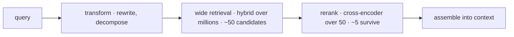

# Advanced Retrieval

Naive dense retrieval — embed the query, take the top-k — gets a RAG system to roughly acceptable and then stops. This chapter is the escalation ladder above it: **hybrid search** (fusing lexical and vector signals), **reranking** (a precision stage over a cheap candidate set), **query transforms** (fixing the question before searching), and **metadata routing** (narrowing before similarity matters). The organizing discipline is what separates this from a techniques catalogue: **each rung exists to fix a specific, named failure class that [rag-07](rag-07-rag-evaluation.md)'s metrics can identify**, and you adopt it because you measured that failure — not because it appeared in a blog post. Adopted in order, the ladder reliably takes a mediocre retrieval layer to a good one. Adopted by fashion, it produces complex pipelines that perform no better than the top-k they replaced. The one thing to internalize before the details: hybrid search and reranking are **v1 defaults** in production RAG ([rag-05](rag-05-rag-pipeline.md)), not advanced techniques — the word "advanced" in this chapter's title is a historical accident.

## Intuition: retrieval as a funnel

Every technique here fits one shape: **cheap and wide, then expensive and narrow.**

Scoring a query against ten million passages must be cheap, so the first stage uses methods that precompute almost everything — an ANN index over embeddings ([rag-02](rag-02-vector-search.md)), an inverted index over terms. Cheap scoring is necessarily approximate: it compresses each passage into a vector or a bag of terms, discarding the interaction between *this* query and *this* passage.

Once you have 50 candidates, you can afford a scoring method that is 100× more expensive per item and dramatically more accurate — one that reads the query and passage *together*. Fifty expensive comparisons is nothing; ten million would be impossible.

*The retrieval funnel: each stage is more accurate and more expensive per item, over fewer items:*

The arithmetic that makes it work: if wide retrieval has recall@50 of 0.95 (the right passage is *somewhere* in 50 candidates 95% of the time) and the reranker reliably promotes it into the top 5, end-to-end precision approaches the reranker's accuracy at the first stage's recall. **Recall is the first stage's job; precision is the second stage's job.** Conflating them — trying to get both from one top-k vector search — is what caps naive retrieval.

This also explains the counterintuitive result from [eng-01](../../engineering/eng-01-rag-pipeline-architecture.md) and rag-05: replacing "top-20 straight into context" with "retrieve 50, rerank to 5" *lowers* cost and *raises* quality simultaneously. It's not a trade-off; the naive version was paying for noise.

## Hybrid search: lexical and dense together

Dense embeddings ([fnd-03](../01-foundations/fnd-03-embeddings.md)) are excellent at meaning and systematically weak at *exactness*. They blur rare tokens: product codes (`XR-4400`), error identifiers (`ERR_CONN_RESET`), person and project names, acronyms, and version numbers all get mapped into approximate neighborhoods where nothing distinguishes them from their neighbors. These are precisely the terms enterprise users type.

**BM25**, the lexical workhorse, has the complementary profile. Its scoring intuition, which is all you need:[^robertson-bm25]

- **Rare terms count more** (inverse document frequency). A passage matching "kubernetes" tells you more than one matching "the".
- **Repetition saturates.** The fifth occurrence of a term adds far less than the second — controlled by a parameter `k1`, and preventing keyword-stuffed documents from dominating.
- **Length is normalized.** A long document matching a term is less impressive than a short one matching it — controlled by `b`.

BM25 nails the exact-token cases embeddings blur, and fails where embeddings excel: a query asking about "laptop won't start" won't match a document titled "notebook power troubleshooting" on any shared term. **Their failure modes are close to complementary, which is exactly why fusing them works so well.**

**Fusing the results** has one problem: BM25 scores and cosine similarities live on unrelated scales, so you cannot simply add them, and normalizing them is fragile across queries. The standard solution avoids scores entirely and uses only *ranks* — **Reciprocal Rank Fusion**:[^cormack-rrf]

$$\text{RRF}(d) = \sum_{i \in \text{retrievers}} \frac{1}{k + \text{rank}_i(d)}$$

with $k$ conventionally 60. A document ranked 1st by either retriever contributes $1/61$; ranked 10th, $1/70$. Documents appearing respectably in *both* lists outrank documents ranked first by one and absent from the other. RRF needs no score calibration, no tuning, and no training — which is why it is the default fusion method and a genuinely strong one.

The engineering decision this creates: does your store support both retrievals natively (search-engine lineages generally do — [rag-03](rag-03-vector-databases.md)), or must you run two systems and fuse in application code? Fusing yourself is perhaps thirty lines, so this is a convenience question, not a blocker.

## Reranking: cross-encoders as the precision stage

The mechanism worth understanding, because it explains both the quality gain and the cost.

A bi-encoder (what your embedding model is) encodes the query and the passage **separately** into vectors, then compares them. That separation is what allows precomputation — passages are embedded once, at index time — and it is also the limitation: the passage's vector was computed without any knowledge of the query. Nuance that only matters *given this query* is already lost.

A **cross-encoder** feeds query and passage into the model **together** as one sequence, so every query token can attend to every passage token ([fnd-05](../01-foundations/fnd-05-transformer-architecture.md)'s attention, applied across the pair), and outputs a relevance score.[^nogueira-rerank] It can notice that the passage's "it" refers to the thing the query asks about, that the passage mentions the query's entity only in a dismissive aside, or that the passage answers a *superficially similar* but different question.

The cost asymmetry follows directly: nothing can be precomputed, so scoring is one forward pass **per (query, passage) pair** at query time. Over ten million passages: impossible. Over fifty: tens of milliseconds. Hence the funnel — **rerankers are only usable on a shortlist, and a shortlist is exactly what the first stage produces.**

Practical parameters: rerank 20–50 candidates down to 3–8. Below ~20 candidates the reranker has little to fix; above ~100 latency grows without much recall left to recover (the right passage is rarely at rank 87 if it wasn't in the top 50). Hosted reranking endpoints exist and are the fast path;[^cohere-rerank] open cross-encoder models run locally when latency or data residency demands it ([api-07](../02-llm-apis/api-07-local-inference.md)).

**The measurement discipline this chapter keeps insisting on:** a reranker improves *precision* — it cannot retrieve what the first stage missed. If your eval shows low recall@50, a reranker is the wrong fix and will disappoint. Check which metric is failing before adding a stage (rag-07).

## Query transforms

The ladder's third rung fixes the *question* rather than the search, and it targets failures that no amount of index tuning addresses.

**Conversational rewriting.** In multi-turn systems the user's message is frequently not a standalone query: "does it cover contractors?" contains no searchable content at all. Rewriting resolves references against conversation history into a self-contained query ("does the Acme 2024 security policy cover contractor accounts?"). This is the highest-value transform in any chat-based RAG system and the most commonly missing — it is why multi-turn RAG so often retrieves worse than the same system's first turn. The [eng-06](../../engineering/eng-06-prompt-library.md) query-rewriter template does exactly this.

**Decomposition for multi-hop.** "How does our refund policy differ from our enterprise SLA on response times?" needs two different documents; a single embedding of the whole question sits in the semantic space *between* them and may retrieve neither well. Splitting into sub-queries, retrieving for each, and merging fixes a failure class that is otherwise invisible — the system returns something plausible about one of the two topics and the user cannot tell what was missed.

**HyDE (hypothetical document embeddings).** Generate a *hypothetical answer* to the question, then embed and search with that instead of (or alongside) the question.[^gao-hyde] The rationale is asymmetry: questions and answers are different genres of text, so a question's embedding may sit far from the passage that answers it, while a fabricated answer looks like the target. It genuinely helps on domains where question and answer vocabularies diverge sharply. Two honest caveats: it adds a generation call to the critical path (latency and cost), and the hypothetical document can hallucinate in a direction that pulls retrieval *away* from the answer. Measure it; adopt it if it wins on your data.

**A caution that applies to all three:** every transform adds latency and a failure mode of its own — a rewriter that mangles the query is worse than no rewriter. These are the rung to reach after hybrid and reranking, not before.

## Routing and structural retrieval

The rung most teams skip, and often the highest-yield: **use the structure you already have before falling back on similarity.**

**Metadata filtering as retrieval.** If a question is clearly about 2024 pricing, filtering to `year=2024 AND doc_type=pricing` before any vector comparison eliminates the majority of the corpus and, with it, most opportunities for a plausible-but-wrong passage to surface. The filter is exact where similarity is fuzzy. The implementation caveat from [rag-02](rag-02-vector-search.md) applies: filters must execute *inside* the query (pre-filter or filtered traversal), never as post-hoc pruning that starves selective queries.

**Query routing.** Not every question should hit the same index. A product-support question and an HR-policy question can be routed by a cheap classifier ([eng-06](../../engineering/eng-06-prompt-library.md)'s router template) to different collections with different prompts. Routing converts "one big index that must serve everything" into several focused ones, each easier to retrieve from — and it composes with [api-06](../02-llm-apis/api-06-model-selection.md)-style cascades.

**Multi-vector late interaction.** One honest paragraph, because it comes up: ColBERT-style approaches embed *every token* of a passage and score by summing each query token's best match across passage tokens — late interaction rather than a single pooled vector.[^khattab-colbert] It recovers much of a cross-encoder's precision at closer to bi-encoder cost, and its interesting property for this chapter is that it attacks the single-vector bottleneck ([fnd-03](../01-foundations/fnd-03-embeddings.md)) directly. The cost is storage — many vectors per passage instead of one — and infrastructure support that not every store offers. Worth knowing as vocabulary; rarely the right next move before hybrid and reranking are in place.

## Production engineering perspective

- **Adopt by diagnosis, in order.** The ladder maps to failure classes: *vocabulary mismatch on exact terms* → hybrid; *right passage retrieved but drowned* → rerank; *conversational or multi-hop questions failing* → transforms; *plausible-wrong passages from other domains* → routing/filtering. Identify the class in your eval (rag-07), then add the rung that addresses it.
- **Latency budget per stage.** Typical interactive targets from [eng-01](../../engineering/eng-01-rag-pipeline-architecture.md): retrieval ≤ 300 ms, rerank ≤ 400 ms. A rewriting or HyDE call adds a full model round trip — often 300–800 ms — which is why transforms are a considered addition, not a default. Cache rewritten queries for repeated questions.
- **Cost accounting.** Reranking is priced per candidate; going from 20 to 100 candidates multiplies that cost fivefold for diminishing recall. The dominant cost remains generation tokens, which is why reranking *down* usually pays for itself several times over ([eng-10](../../engineering/eng-10-cost-optimization.md)).
- **Every rung is a version.** Reranker model, fusion parameters, rewriter prompt — all are config that changes behavior and belongs under the same eval gate as prompts ([evl-06](../05-evaluation/evl-06-ci-for-llm-apps.md)).
- **Keep the funnel observable.** Log candidate IDs at each stage. When a bad answer appears, you need to see whether the right passage was retrieved-then-demoted (a reranking bug) or never retrieved (a first-stage bug) — the rag-05 attribution discipline, applied inside the retrieval layer.

## Historical evolution

**1994–2009:** BM25 becomes the classical IR standard and remains a startlingly strong baseline for three decades;[^robertson-bm25] rank fusion is formalized, with RRF shown to beat more elaborate learned combinations.[^cormack-rrf] **2019:** BERT-based cross-encoders demonstrate large gains on passage reranking, establishing the retrieve-then-rerank pattern that dominates modern IR;[^nogueira-rerank] dense bi-encoders make first-stage neural retrieval practical. **2020:** ColBERT proposes late interaction as the middle ground between bi- and cross-encoders.[^khattab-colbert] **2022–2023:** LLM-era RAG rediscovers all of this — teams start with pure vector search, hit the vocabulary-mismatch and precision walls, and re-adopt hybrid search and reranking, which the IR field had considered settled for years; HyDE and query decomposition emerge as LLM-native transforms.[^gao-hyde] **2024–present:** hybrid + rerank consolidates as the default production stack, and attention moves upstream to ingestion quality ([rag-04](rag-04-chunking.md)) and downstream to evaluation ([rag-07](rag-07-rag-evaluation.md)). The lesson worth carrying: **information retrieval has thirty years of results that the LLM wave briefly forgot** — when a retrieval problem feels novel, check whether IR solved it in 2005.

## Common misconceptions

- **"Hybrid search is an advanced optimization."** It's a v1 default. Pure vector search fails on exact identifiers, codes, and names — the terms real users type most.
- **"A reranker will fix our retrieval."** A reranker fixes *precision*. If recall@50 is low, the right passage isn't in the shortlist and reranking cannot conjure it. Diagnose which metric is failing first.
- **"More candidates into the reranker is better."** Recall gains flatten quickly past ~50 while cost and latency grow linearly. Measure the recall@N curve and stop where it flattens.
- **"RRF needs tuning."** Its appeal is that it doesn't — rank-based fusion sidesteps score calibration entirely, and the conventional $k=60$ works across domains. Tune it last, if ever.
- **"Query rewriting is optional for chatbots."** It's the difference between multi-turn RAG working and silently degrading after turn one, because follow-up messages usually contain no searchable content.
- **"HyDE always helps."** It helps where question and answer vocabularies diverge; it costs a generation round trip and can hallucinate retrieval off-target. It's an eval-decided technique, not a default.

## Failure modes and trade-offs

- **Reranker as recall bandage** — added to fix a first-stage recall problem, delivering nothing. *Fix:* measure recall@50 before adding it. *Trade-off:* none — this is just correct diagnosis.
- **Transform-induced drift** — a rewriter "helpfully" changes the question's meaning, or HyDE hallucinates a wrong-domain answer, and retrieval degrades. *Fix:* eval transforms in isolation (retrieval recall with and without); keep the original query as a parallel retrieval leg and fuse.
- **Latency creep** — rewrite + hybrid + rerank + generate stacks four round trips. *Fix:* budget per stage, parallelize independent legs (lexical and vector retrieval run concurrently), cache transforms.
- **Fusion masking a broken leg** — one retriever silently fails (empty results) and RRF quietly returns the other's list, hiding the outage. *Fix:* alarm on per-leg result counts, not just on final results.
- **Routing misclassification** — the router sends a question to the wrong collection and the correct index is never searched. *Fix:* evaluate the router itself (precision/recall of routing decisions), and fall back to searching all collections on low confidence.
- **Over-engineering the ladder** — four stages where hybrid alone closed the gap. *Fix:* adopt one rung at a time, keeping the measured delta for each; drop rungs that don't pay ([fnd-01](../01-foundations/fnd-01-ai-engineering-landscape.md)'s premature-complexity warning, retrieval edition).

## Best practices

- **Ship hybrid search in v1** — vector + BM25 fused with RRF, with per-leg result-count monitoring.
- **Add a reranker over 20–50 candidates, narrowing to 3–8** in context; measure the recall@N curve to choose the candidate count rather than guessing.
- **Add query rewriting for any multi-turn interface**, evaluated in isolation and cached for repeats.
- **Use structure before similarity:** metadata filters (executed inside the query) and routing to focused collections eliminate whole classes of plausible-wrong retrieval.
- **Adopt one rung at a time and record the measured delta.** A rung that doesn't move your eval gets removed, not kept "because it's standard."
- **Log candidate IDs at every funnel stage** so retrieved-then-demoted is distinguishable from never-retrieved.
- **Treat every retrieval component as versioned config** under the same eval gate as prompts.
- **Check IR literature before inventing.** Most retrieval problems that feel novel have a 2005 answer.

## Real-world examples

**The error code that vector search couldn't find.** A developer-support RAG system answers conceptual questions well and fails whenever a user pastes an error code like `ERR_TLS_HANDSHAKE_FAIL`. Diagnosis: the embedding maps that token into a generic "error-ish" neighborhood shared by hundreds of unrelated codes, so the specific troubleshooting page never ranks. No embedding model fixes this — it's the single-vector blur applied to a rare token. Adding a BM25 leg with RRF fusion resolves it immediately: lexical matching finds the exact string, RRF promotes the document that both legs like, and conceptual questions keep working through the vector leg. One afternoon, one whole class of failure gone.

**The reranker that did nothing.** A team reads that reranking improves RAG, adds a hosted reranker over their top-10 vector results, measures, and finds no improvement — then concludes reranking is overhyped. The actual problem: their recall@10 was 0.61, so in 39% of queries the right passage was never in the ten candidates and the reranker was reordering noise. Fixes in the right order: widen candidates to 50 (recall@50 = 0.93), *then* rerank to 5 — which now shows a large precision gain. Same reranker, correct diagnosis, opposite outcome. The transferable lesson is the funnel's division of labor: **widen for recall, rerank for precision, and know which one you're short on.**

**The chatbot that got worse after turn one.** A support assistant scores well in single-turn evals and users complain it "forgets" mid-conversation. The eval was single-turn only. In production, turn two is typically "and what about refunds?" — which, embedded alone, matches nothing useful. Adding conversational rewriting (resolving the message against history into a standalone query) fixes it, and the eval suite grows multi-turn cases so the regression can't recur. The deeper lesson belongs to [evl-02](../05-evaluation/evl-02-eval-datasets.md): the eval didn't contain the failure mode, so the system was optimized for a distribution that wasn't production's.

## Interview questions

1. **"Why is hybrid search a default rather than an optimization?"** — Model answer: dense embeddings and BM25 have close to complementary failure profiles. Embeddings capture meaning but blur rare exact tokens — error codes, product SKUs, names, versions — which are precisely what users paste into enterprise search. BM25 nails exact terms but can't bridge vocabulary gaps like "laptop won't start" to "notebook power troubleshooting." Fusing them with Reciprocal Rank Fusion covers both, needs no score calibration or tuning since it uses ranks rather than scores, and costs one extra cheap retrieval. Skipping it means shipping a system that fails on a predictable and common query class.

2. **"Explain the difference between a bi-encoder and a cross-encoder, and why it dictates the architecture."** — Model answer: a bi-encoder embeds query and passage separately, so passage vectors are precomputable at index time — that's what makes searching millions of passages feasible, and also the limitation, since the passage was encoded without knowing the query. A cross-encoder feeds query and passage in together so every token attends across the pair, which captures query-specific nuance and scores far more accurately — but nothing precomputes, so it costs a forward pass per pair at query time. That asymmetry forces the funnel: bi-encoder (plus lexical) retrieves ~50 candidates cheaply, cross-encoder reranks those 50 expensively. Neither alone works at both scale and precision.

3. **"What is RRF and why not just add the scores?"** — Model answer: Reciprocal Rank Fusion combines result lists by summing 1/(k + rank) across retrievers, conventionally with k=60. You can't simply add raw scores because BM25 scores and cosine similarities are on unrelated, uncalibrated scales that also shift per query, so any normalization is fragile. RRF discards magnitudes and uses only ordinal position, which makes it robust, training-free, and effectively parameter-free — and empirically it outperforms more elaborate learned fusion. It also has a useful bias: documents ranked decently by *both* retrievers beat documents ranked first by one and missing from the other.

4. **"Your reranker isn't improving results. What's the most likely cause?"** — Model answer: the shortlist doesn't contain the right passage. A reranker only reorders what it's given, so it fixes precision, never recall. I'd measure recall@N of the first stage — if recall@10 is 0.6, then in 40% of queries the reranker is shuffling noise, which is exactly the symptom. The fix is to widen the candidate set (say to 50, measuring where the recall curve flattens) and then rerank down to 3–8. If recall@50 is already high and reranking still adds nothing, I'd check the reranker is receiving the passage text rather than truncated stubs, and that its relevance notion matches the task.

5. **"How would you handle multi-turn conversations in RAG?"** — Model answer: query rewriting before retrieval. Follow-up messages usually contain no searchable content — "does it cover contractors?" has pronouns instead of entities — so embedding them directly retrieves noise, which is why multi-turn RAG often degrades sharply after the first turn. A cheap model call resolves references against the conversation into a standalone query, which then goes through the normal funnel. I'd evaluate the rewriter in isolation (retrieval recall with and without it), cache rewrites for repeated questions, and make sure the eval suite actually contains multi-turn cases — otherwise the failure is invisible offline while being common in production.

6. **"Walk through how you'd diagnose which rung of the ladder to add."** — Model answer: map failure classes to rungs using per-stage metrics. Low recall with exact-token queries failing (codes, names) → hybrid search. High recall but the model grounding in the wrong passage → reranking, a precision fix. Failures concentrated in follow-up turns or in questions spanning two topics → query rewriting or decomposition. Plausible-but-wrong passages arriving from an unrelated domain → metadata filtering or routing to focused collections. In every case I add one rung, measure the delta on the retrieval eval, and keep it only if it pays — because stacking rungs by reputation produces complex pipelines that don't beat the simple version.

7. **"When would you reach for ColBERT-style late interaction?"** — Model answer: rarely, and only after hybrid and reranking are in place. Late interaction embeds every token of a passage and scores by summing each query token's best match, so it attacks the single-vector bottleneck directly and recovers much of a cross-encoder's precision at closer to bi-encoder cost. The costs are storage — many vectors per passage rather than one — and store support, which isn't universal. It's genuinely interesting where the funnel's rerank stage is a latency problem you can't afford, but for most systems the standard funnel gets there with less infrastructure.

## Exercises and mini-project

**Exercises**

1. Compute RRF scores for a document ranked 1st by BM25 and 30th by vector search, versus one ranked 5th by both (k=60). Which wins, and what does that reveal about RRF's bias?
2. Your reranker costs 40 ms per 10 candidates. Compute added latency at 20, 50, and 100 candidates, and state what you'd need to see in a recall@N curve to justify 100.
3. For each failure, name the ladder rung: (a) queries containing part numbers return nothing relevant; (b) the right passage is retrieved at rank 8 but the model uses rank 2; (c) "what about the enterprise tier?" retrieves noise; (d) HR questions return engineering docs.
4. Write the conversational rewriting prompt for a support assistant, and list two ways it could make retrieval *worse*.
5. Explain why a bi-encoder cannot be replaced by a cross-encoder at the first stage, using the precomputation argument and a corpus of 10M passages.

**Mini-project: climb the ladder with measurements.** Starting from your [rag-05](rag-05-rag-pipeline.md) capstone and its query set: (a) baseline — record recall@10 and answer quality with pure vector search; (b) add a BM25 leg and fuse with RRF; re-measure and identify three queries it rescues, naming the mechanism; (c) add a cross-encoder reranker over 50 candidates narrowing to 5; measure recall@5 and answer quality, plus added latency; (d) plot the recall@N curve for the first stage and mark where it flattens — use that to justify your candidate count; (e) add conversational rewriting and evaluate it against multi-turn cases specifically; (f) write a memo giving the measured delta per rung and stating which rungs you'd keep. Target: 4 hours. Success criterion: a per-rung delta table for your own data — including at least one rung that didn't earn its place.

**Capstone extension:** this upgrades the capstone's retrieval to v1 ([eng-01](../../engineering/eng-01-rag-pipeline-architecture.md)'s defaults); [rag-07](rag-07-rag-evaluation.md) then formalizes the metrics you used here into a standing eval suite.

## Revision summary

- Retrieval is a funnel: cheap-and-wide for recall, expensive-and-narrow for precision. Conflating those jobs into one top-k vector search is what caps naive RAG.
- Hybrid search fuses dense (meaning) with BM25 (exact terms — rare-term weighting, saturating frequency, length normalization) because their failure modes are complementary. Fuse with RRF (1/(k+rank), k≈60): rank-based, so no score calibration, no tuning.
- Rerankers are cross-encoders: query and passage encoded together so attention spans the pair, giving far better relevance at one forward pass per pair — usable only on a shortlist. Rerank 20–50 → 3–8. They fix precision and cannot fix recall.
- Query transforms fix the question: conversational rewriting (essential for multi-turn), decomposition (multi-hop), HyDE (question/answer vocabulary gap, with hallucination risk). Each adds a round trip and its own failure mode.
- Structure beats similarity where available: metadata filters executed inside the query, and routing to focused collections, eliminate whole classes of plausible-wrong retrieval.
- Adopt one rung at a time, mapped to a measured failure class, keeping the delta — and drop rungs that don't pay.

## Flashcards

| Q | A |
|---|---|
| The funnel's division of labor? | First stage owns recall (cheap, wide); rerank owns precision (expensive, narrow). |
| Why does BM25 complement embeddings? | It matches exact rare tokens (codes, names, versions) that dense vectors blur; embeddings bridge vocabulary gaps BM25 can't. |
| The RRF formula and why ranks not scores? | sum of 1/(k + rank) across retrievers, k≈60 — BM25 and cosine scores are uncalibrated and shift per query, so ordinal fusion is robust and tuning-free. |
| Bi-encoder vs cross-encoder? | Bi: query and passage encoded separately (precomputable, scalable, less accurate). Cross: encoded together (attention across the pair, accurate, one forward pass per pair). |
| Typical rerank parameters? | 20–50 candidates in, 3–8 out; recall gains flatten past ~50 while cost grows linearly. |
| A reranker cannot fix what? | Recall — it only reorders the shortlist it's given. |
| Most valuable query transform, and why? | Conversational rewriting: follow-up turns contain pronouns rather than searchable entities, so multi-turn RAG degrades without it. |
| What is HyDE and its risk? | Embed a generated hypothetical answer instead of the question, to bridge question/answer vocabulary gaps; risks hallucinating retrieval off-target and adds a round trip. |
| Cheapest high-yield rung teams skip? | Metadata filtering and routing — exact structure eliminates most wrong-domain candidates before similarity is consulted. |
| How do you decide which rung to add? | By failure class from the retrieval eval, one rung at a time, keeping only the rungs with a measured delta. |

## Further reading

- **Official docs:** a reranking API's documentation[^cohere-rerank] — useful for the candidate-count and latency shape before you build.
- **Papers:** Robertson & Zaragoza, BM25 (2009)[^robertson-bm25] — §3 for the scoring intuition; Cormack et al., RRF (2009)[^cormack-rrf] — short and decisive; Nogueira & Cho, passage reranking with BERT (2019)[^nogueira-rerank]; Gao et al., HyDE (2022)[^gao-hyde]; Khattab & Zaharia, ColBERT (2020)[^khattab-colbert].
- **Books:** Manning, Raghavan & Schütze, *Introduction to Information Retrieval* (free online) — the IR foundations the LLM era rediscovered.
- **Talks:** none essential.
- **Tutorials:** implement RRF yourself (about thirty lines) rather than adopting a framework's — the mechanism is worth owning.

## Check your understanding

1. Explain the funnel with numbers: why is 50-candidate retrieval plus reranking better *and* cheaper than putting 20 passages straight into context?
2. Give the query type that pure vector search reliably fails, the mechanism behind that failure, and the rung that fixes it.
3. Your recall@50 is 0.94 and answers still ground in wrong passages. Which rung do you add, and which would be a waste?
4. Why does RRF avoid score normalization, and what bias does its rank-reciprocal shape introduce?
5. Name the four failure classes from this chapter and the rung each maps to — then say how you'd identify each from [rag-07](rag-07-rag-evaluation.md)'s metrics.

## Sources

[^robertson-bm25]: [T2] Robertson & Zaragoza (2009). "The Probabilistic Relevance Framework: BM25 and Beyond." Foundations and Trends in Information Retrieval 3(4). https://www.staff.city.ac.uk/~sbrp622/papers/foundations_bm25_review.pdf (accessed 2026-07-10)
[^cormack-rrf]: [T2] Cormack, Clarke & Buettcher (2009). "Reciprocal Rank Fusion outperforms Condorcet and individual Rank Learning Methods." SIGIR '09. https://dl.acm.org/doi/10.1145/1571941.1572114 (accessed 2026-07-10)
[^nogueira-rerank]: [T2] Nogueira & Cho (2019). "Passage Re-ranking with BERT." arXiv:1901.04085. https://arxiv.org/abs/1901.04085 (accessed 2026-07-10)
[^khattab-colbert]: [T2] Khattab & Zaharia (2020). "ColBERT: Efficient and Effective Passage Search via Contextualized Late Interaction over BERT." arXiv:2004.12832. https://arxiv.org/abs/2004.12832 (accessed 2026-07-10)
[^gao-hyde]: [T2] Gao et al. (2022). "Precise Zero-Shot Dense Retrieval without Relevance Labels." arXiv:2212.10496. https://arxiv.org/abs/2212.10496 (accessed 2026-07-10)
[^cohere-rerank]: [T1] Cohere. "Rerank documentation." https://docs.cohere.com/docs/rerank-overview (accessed 2026-07-10)
