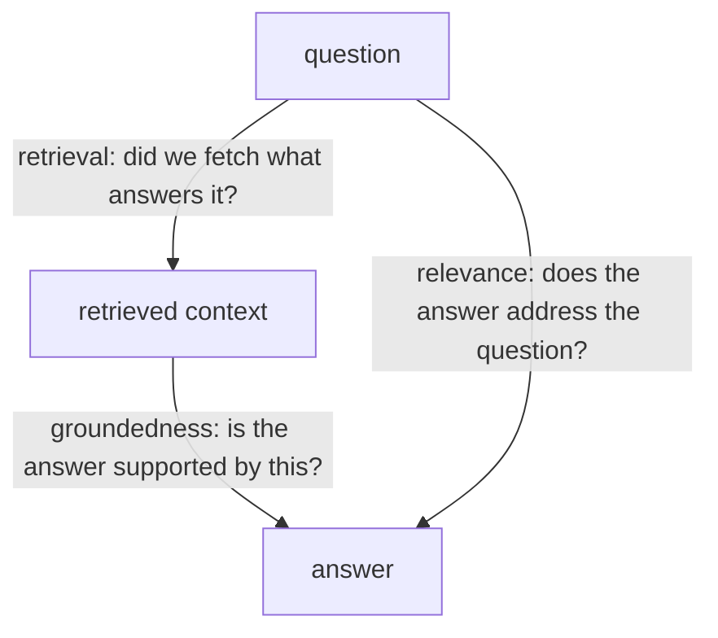
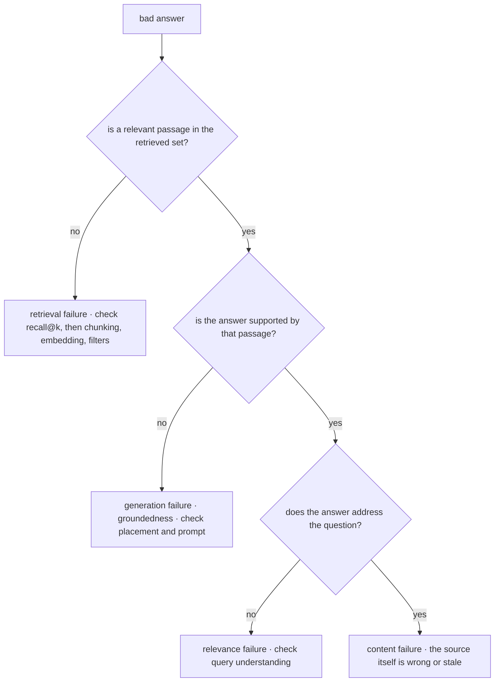

# Evaluating RAG Systems

[rag-05](rag-05-rag-pipeline.md) established that RAG quality is multiplicative across stages and that a bad answer looks identical no matter which stage caused it. This chapter builds the instruments that resolve that ambiguity. The core discipline is one sentence: **measure retrieval and generation separately, because an end-to-end score can tell you that something is wrong but never what.** A team reporting "our RAG is 78% accurate" knows less than a team reporting "recall@10 is 0.71, groundedness on retrieved context is 0.96, abstention recall is 0.4" — the second team knows exactly where to spend the next sprint, and the first will spend it on prompts. Everything here inherits [evl-01](../05-evaluation/evl-01-evaluation-fundamentals.md)'s doctrine (the eval decides; statistical honesty; the flywheel) and specializes it to retrieval's particular shape.

## Intuition: the triad and its three failure edges

RAG evaluation organizes around three objects and the relationships between them: the **question**, the **retrieved context**, and the **answer**. Each edge can fail independently, and each has its own metric family.

*The evaluation triad — three relationships, three distinct failure modes:*

- **Question → Context (retrieval quality).** Did the system fetch passages that actually contain the answer? Measured against labeled relevance; failures here are recall problems no prompt can fix.
- **Context → Answer (groundedness / faithfulness).** Is every claim in the answer supported by the supplied context? Failures here are the model inventing or importing pretrained knowledge — hallucination *despite* correct retrieval.
- **Question → Answer (answer relevance).** Does the answer actually address what was asked? An answer can be perfectly grounded in the retrieved passages and still not answer the question.

The reason this decomposition matters more in RAG than almost anywhere else: **the same end-to-end failure ("wrong answer") arrives from three unrelated causes with three unrelated fixes.** Collapsing them into one number destroys the information you need. The corollary is a rule worth stating bluntly: **groundedness is not correctness.** An answer faithfully grounded in a retrieved passage that is itself wrong, outdated, or irrelevant scores perfectly on faithfulness and is still wrong — which is why retrieval metrics and generation metrics must both exist and neither substitutes for the other.

## Retrieval metrics

The Question → Context edge, measured with information-retrieval metrics that predate LLMs entirely.

**recall@k** — the fraction of queries for which at least one relevant passage appears in the top k (or, in the multi-relevant formulation, the fraction of all relevant passages retrieved). This is **the workhorse**, because in RAG the binary question "is the answer available to the model at all?" dominates: if the passage isn't in the top-k, nothing downstream can recover.

**precision@k** — the fraction of retrieved passages that are relevant. Matters more than it first appears: [rag-05](rag-05-rag-pipeline.md) and [rag-01](rag-01-context-engineering.md) showed that irrelevant passages actively harm answers by diluting attention and offering wrong-grounding surface. Low precision is why "retrieve top-20 to be safe" backfires.

**MRR and nDCG** — rank-aware metrics. MRR (mean reciprocal rank) averages $1/\text{rank}$ of the first relevant result; nDCG additionally weights graded relevance by position. Use these when *position within the context* matters — which, given lost-in-the-middle effects ([fnd-05](../01-foundations/fnd-05-transformer-architecture.md)), it does. In practice: report recall@k as the headline, nDCG when tuning ranking ([rag-06](rag-06-advanced-retrieval.md)).

**The stage-specific numbers to track**, following the funnel: `recall@50` for the first stage (is the candidate set adequate?) and `recall@5` / `nDCG@5` after reranking (did precision improve?). Those two numbers, side by side, tell you immediately whether a reranker is helping or reordering noise — the exact diagnosis rag-06 required.

## Building the golden set

Retrieval metrics need labeled relevance: for each query, which passages are relevant. This dataset is the eval's load-bearing half ([evl-02](../05-evaluation/evl-02-eval-datasets.md) covers dataset construction generally; here is what's RAG-specific).

**Sources, with their biases:**

- **Real production queries** — the gold standard for distribution. Harvest from logs ([evl-04](../05-evaluation/evl-04-tracing-observability.md)), especially failures and abandonments. Biased toward what users already believe the system can do (survivor bias), so supplement.
- **Synthetic queries generated from passages** — cheap and scalable: show a model a chunk, ask it to write a question that chunk answers, and you get a (query, relevant-passage) pair for free. **The bias is severe and systematic**: the question is generated *from the answer*, so it inherits the passage's vocabulary and phrasing, producing queries far easier than real ones. Systems tuned on synthetic sets look better than they are. Mitigations: condition generation on personas and difficulty, explicitly instruct paraphrase away from the source's wording, and — non-negotiable — **human-verify a sample** to confirm the questions resemble real user language.
- **Expert-authored queries** — the only reliable source for the hard tail and for out-of-corpus abstention cases (below), because those cannot be generated *from* passages by construction.

**Labeling relevance:** binary (relevant / not) is usually sufficient and much cheaper than graded scales; graded relevance only pays if you're tuning ranking with nDCG. The practical shortcut that works: label the *answer-bearing* passage as relevant, then let a human review the top-10 retrieved for each query and mark any additional relevant passages — this catches the common case where several passages could answer, and prevents penalizing a system for retrieving a *different* correct passage.

**Size and composition:** 50–100 queries is enough to detect meaningful movement; per-category slices need ~30 each to be readable ([evl-01](../05-evaluation/evl-01-evaluation-fundamentals.md)'s flip-count arithmetic). Composition must include the hard tail, multi-hop questions, and — the category everyone forgets — **out-of-corpus questions** whose correct answer is "I don't know."

## Generation metrics

The Context → Answer and Question → Answer edges, which mostly require model-graded scoring since no programmatic oracle exists ([evl-03](../05-evaluation/evl-03-llm-as-judge.md) owns the judge machinery; here is what to judge).

**Groundedness / faithfulness.** The central RAG generation metric: is every factual claim in the answer supported by the retrieved context? The reliable way to measure it is **claim decomposition** — split the answer into atomic claims, then judge each against the context as supported / unsupported / contradicted.[^es-ragas] This beats asking "is this answer faithful?" holistically, because it forces the judge to be specific and produces an interpretable failure list rather than a vibe score. Report the fraction of supported claims, and treat any *contradicted* claim as a severity-one failure.

**Citation accuracy.** If your system cites (and [rag-05](rag-05-rag-pipeline.md) argued it should), two things are programmatically checkable without a judge at all: does every cited document ID exist in the retrieved set (a citation to something not retrieved is fabricated), and does the cited passage actually support the claim (judge-scored). The first is a free, deterministic check that catches a real failure mode — run it always.

**Answer relevance.** Does the response address the question asked? A judge scores this directly; a useful alternative signal is to generate questions *from* the answer and measure their similarity to the original question.[^es-ragas] Low relevance with high groundedness is the signature of a system retrieving adjacent-but-wrong context and dutifully summarizing it.

**Context precision / utility.** Of the passages supplied, how many were actually used or useful? Low utility means you're paying tokens and diluting attention for nothing — the metric that justifies reranking down (rag-06).

**Frameworks** (RAGAS, ARES, and successors) package these metrics and are a reasonable accelerator.[^es-ragas][^saadfalcon-ares] Two caveats before adopting one: their judges carry the standard biases (position, verbosity, self-preference[^zheng-judge]), so **validate their scores against your own human labels before trusting them to gate anything**; and their metric definitions differ subtly from each other, so a "faithfulness score" is only comparable to itself across runs.

## Measuring abstention

The most-skipped metric and often the most consequential for user trust: **does the system say "I don't know" when it should, and only when it should?**

This requires eval cases whose correct answer is refusal — questions plausibly in-domain but genuinely absent from the corpus. They cannot be generated from passages (nothing to generate from), so they are authored by hand, which is exactly why teams skip them.

Two error types, and both matter:

| | System answers | System abstains |
|---|---|---|
| **Answer in corpus** | correct | **false abstention** — unhelpful; users lose trust in coverage |
| **Answer absent** | **missed abstention** — hallucination; users lose trust in truth | correct |

**Missed abstention** is the dangerous one: the system inventing an answer when retrieval returned nothing relevant, which is precisely the failure RAG was adopted to prevent. **False abstention** is the failure mode of over-correcting — a system that refuses whenever retrieval scores are mediocre becomes useless. Track both rates; they trade off against each other and against your retrieval threshold, and the balance is a product decision, not a technical one.

## The attribution workflow

The chapter's operational payoff: turning a failure into a stage. Given a query that produced a bad answer, walk the metrics in pipeline order — this is [rag-05](rag-05-rag-pipeline.md)'s ten-point table, now with numbers attached.

*Attribution: each check isolates one edge of the triad:*

Two disciplines make this workflow actually work in practice:

- **Run the gold-passage experiment.** Feed the model *only* the known-correct passage and ask the question. If the answer is now right, the failure was retrieval; if it's still wrong, the failure is generation. This single test cleanly separates the two dominant causes in about a minute, and it's the highest-value diagnostic in the chapter.
- **Aggregate before you agonize.** Attribute across 20–30 failures, not one. Individual failures are noisy; the *distribution* over stages tells you where the sprint should go — which is the whole point of measuring per stage.

## Production engineering perspective

- **Two suites, different cadences.** A retrieval suite (fast, cheap, deterministic — no generation calls) can run on every commit; the full generation suite (judge calls, slower, costlier) runs nightly and pre-release on the batch tier ([api-05](../02-llm-apis/api-05-streaming-caching-batch.md), [eng-03](../../engineering/eng-03-eval-harness-architecture.md)'s tiers). Splitting them means retrieval regressions get caught in minutes.
- **The SLO floors** from [eng-01](../../engineering/eng-01-rag-pipeline-architecture.md) are these metrics: recall@k ≥ 0.85 on the golden set, groundedness ≥ 0.95 on sampled traffic, abstention recall ≥ 0.9. Set your own, but set them numerically and gate on them.
- **Online evaluation complements offline.** Sample production traffic through the groundedness judge continuously ([evl-05](../05-evaluation/evl-05-online-evaluation.md)) — it's the quality heartbeat that catches corpus drift, index staleness, and model-version drift that offline suites (fixed queries, fixed corpus snapshot) structurally cannot see.
- **Version the corpus snapshot with the eval.** Retrieval metrics are meaningless if the corpus changed between runs — a recall drop may be a corpus change, not a regression. Pin the document set for offline evals, and re-baseline deliberately when it changes.
- **Every failure becomes a case.** The flywheel (eng-03): production failures, especially attributed ones, enter the suite with `source: production`. A RAG eval that doesn't grow from real failures decays into the easy-case suite evl-01 warns about.

## Historical evolution

**2020–2022:** RAG is evaluated with QA benchmarks and end-to-end exact-match — adequate for research, useless for diagnosing a production pipeline. **2023:** practitioners hit the attribution wall (an accuracy number that can't localize failures), and the field converges on component-wise evaluation; RAGAS formalizes reference-free metrics (faithfulness, answer relevance, context precision) computable without gold answers,[^es-ragas] and ARES adds trained judges with statistical guarantees.[^saadfalcon-ares] **2023–2024:** LLM-as-judge becomes the default scoring mechanism for the generation edges, along with growing awareness of judge biases and the need for human calibration.[^zheng-judge] Surveys consolidate the metric landscape.[^gao-survey] **2024–present:** attention shifts to *online* RAG evaluation and to abstention as a first-class metric, as production experience shows that confident answers over empty retrieval are the dominant trust-destroying failure. The arc mirrors the module's: from a single score, to per-stage metrics, to continuous measurement on live traffic.

## Common misconceptions

- **"High groundedness means correct answers."** Groundedness measures fidelity to the retrieved context. Faithfully summarizing a wrong, outdated, or irrelevant passage scores perfectly and is still wrong — which is why retrieval metrics must be measured separately.
- **"End-to-end accuracy is the metric that matters."** It's the metric that matters to *users* and the one that can't tell you what to fix. Report it, but never optimize with it alone.
- **"Synthetic eval sets are fine."** They're a useful supplement with a severe, systematic bias — questions generated from passages inherit the passage's vocabulary, making them far easier than real queries. Human-verify a sample and mix in real queries and expert-authored hard cases.
- **"We don't need abstention cases; our corpus covers everything."** Then the system will confidently answer out-of-scope questions, which is the failure users remember. Out-of-corpus cases must be hand-authored precisely because they can't be generated from the corpus.
- **"The framework's faithfulness score is a standard number."** Metric definitions differ across frameworks and judge models drift; scores are comparable to themselves over time, not across tools. Validate against human labels before gating on them.
- **"Retrieval evaluation needs gold answers."** It needs *labeled relevant passages*, which is a much cheaper labeling task — and reference-free generation metrics reduce the gold-answer burden further.

## Failure modes and trade-offs

- **The easy-case golden set** — synthetic queries only, all answerable, all single-hop; metrics look excellent while production complains. *Fix:* real-query harvesting, hard tail, multi-hop, and out-of-corpus cases (evl-02).
- **Judge drift** — the judge model changes and "quality" moves without the system changing. *Fix:* pin the judge config, re-validate against human labels on a cadence, treat a judge change as a baseline migration (eng-03).
- **Corpus drift invalidating comparisons** — recall drops because documents were added, not because retrieval regressed. *Fix:* pin the corpus snapshot for offline evals; re-baseline explicitly.
- **Metric monoculture** — optimizing groundedness alone produces terse, hedging answers that cite everything and say nothing. *Fix:* metrics in tension (groundedness + answer relevance + abstention balance), plus human audit.
- **Abstention over-correction** — after a hallucination incident, thresholds are tightened until the system refuses everything marginal. *Fix:* track false-abstention explicitly as the counterweight; it's a product-level balance.
- **Attribution on a single example** — drawing sprint priorities from one dramatic failure. *Fix:* attribute across 20–30 and act on the distribution.

## Best practices

- **Measure retrieval and generation separately, always** — a single end-to-end number is a symptom report, not a diagnosis.
- **Build the golden set from real queries first**, supplemented by expert-authored hard and out-of-corpus cases, with synthetic used for volume and human-verified by sample.
- **Report recall@50 and recall@5 side by side** to see the funnel's two jobs (rag-06), plus groundedness by claim decomposition and citation-resolution rate.
- **Include abstention cases and track both error types** — missed abstention (hallucination) and false abstention (unhelpfulness).
- **Run the gold-passage experiment** as the first diagnostic for any bad answer; attribute across a batch before prioritizing.
- **Split the suites by cost**: deterministic retrieval metrics on every commit, judge-based generation metrics nightly on the batch tier, with numeric gates ([evl-06](../05-evaluation/evl-06-ci-for-llm-apps.md)).
- **Validate any framework's judge against your own human labels** before letting it gate a deploy, and pin its configuration.
- **Sample live traffic through the groundedness judge continuously** — offline suites cannot see corpus or model drift.
- **Feed every production failure back into the suite** with its attributed stage recorded.

## Real-world examples

**The metric that hid the problem.** A team reports 82% end-to-end accuracy and spends a sprint on prompt engineering, moving it to 84%. Then they decompose: recall@10 is 0.68, while groundedness on retrieved context is 0.97. The generation stage was already near-perfect — the model was faithfully using whatever it was given — and 32% of queries never had the answer available at all. One sprint of retrieval work (hybrid search plus reranking, [rag-06](rag-06-advanced-retrieval.md)) takes recall@10 to 0.91 and end-to-end to 93%. The prompt sprint optimized the stage that wasn't broken, which the decomposition would have revealed on day one.

**The synthetic eval that lied.** A team builds a 300-query eval by generating questions from chunks and reports recall@5 of 0.95. Production users report constant failures. The diagnosis is the inversion bias: every synthetic question was written *from* its answer passage, so it reused the passage's exact vocabulary — while real users asked using product names and colloquialisms the documents never contained. Re-measuring on 60 harvested real queries gives recall@5 of 0.58. The fix is both immediate (hybrid search to bridge the vocabulary gap) and procedural: the golden set becomes majority-real, synthetic questions are generated with explicit paraphrase instructions, and a human verifies a sample against real query language.

**The confident answer to an unanswerable question.** A policy assistant is asked about a benefit the company doesn't offer. Retrieval returns three loosely-related policy passages (nothing matches, but similarity always returns *something* — [rag-02](rag-02-vector-search.md)), and the model produces a fluent, plausible, entirely invented answer, complete with citations to the irrelevant passages. Nobody notices for weeks because the eval had no out-of-corpus cases. Fixes: hand-authored abstention cases in the suite, a relevance threshold below which retrieval reports "nothing relevant," an explicit abstention clause in the prompt (rag-05), and tracking both abstention error types so the correction doesn't overshoot into refusing everything.

## Interview questions

1. **"How do you evaluate a RAG system?"** — Model answer: per stage, never end-to-end alone. The triad gives three edges: question→context is retrieval, measured with recall@k and precision@k against a golden set of queries with labeled relevant passages; context→answer is groundedness, best measured by decomposing the answer into atomic claims and judging each against the supplied context; question→answer is relevance. I'd add abstention cases whose correct answer is "I don't know," tracking both missed and false abstention. End-to-end accuracy gets reported for stakeholders but never drives the work, because it can't localize failures — and the whole point of per-stage metrics is knowing which sprint to run.

2. **"What's the difference between groundedness and correctness?"** — Model answer: groundedness asks whether the answer is supported by the retrieved context; correctness asks whether it's true. They diverge whenever retrieval returns a passage that's wrong, outdated, or irrelevant — the model faithfully summarizes it, scoring perfectly on faithfulness while being wrong. That's exactly why retrieval metrics must exist alongside generation metrics: high groundedness with low recall means the system is reliably grounding in the wrong thing. Practically I treat contradicted claims as severity-one and always pair groundedness with a retrieval number.

3. **"How would you build a golden set for RAG?"** — Model answer: real production queries first, harvested from logs including failures and abandonments, since they carry the true distribution. Then expert-authored cases for the hard tail, multi-hop questions, and out-of-corpus questions that must be refused — those can't be generated from the corpus by construction. Synthetic question generation from passages adds volume cheaply but carries a severe bias: the question is written from the answer, so it inherits the passage's vocabulary and is far easier than real queries. I'd mitigate with paraphrase-forcing prompts and human verification of a sample. Labeling is binary relevance on the answer-bearing passages plus a human pass over the top-10 to catch other valid ones.

4. **"A user reports a wrong answer. Walk your attribution."** — Model answer: first, is a relevant passage in the retrieved set? If not, it's retrieval — then check recall, and upstream: chunking boundaries, embedding mismatch, filters excluding it. If yes, run the gold-passage experiment: give the model only the known-correct passage. If the answer becomes right, the failure was retrieval precision or context placement; if still wrong, it's generation. If the answer is grounded but doesn't address the question, it's a query-understanding problem. And if everything checks out, the source document itself is wrong or stale. Critically, I'd repeat this across 20–30 failures and act on the distribution, not on one dramatic case.

5. **"Why measure abstention, and what are the two error types?"** — Model answer: because the failure that destroys user trust fastest is a confident, fluent, cited answer to a question the corpus doesn't cover — retrieval always returns *something*, so without explicit abstention the model has material to invent from. The two errors trade off: missed abstention is answering when the corpus lacks the answer (hallucination); false abstention is refusing when the answer is there (unhelpfulness). Over-correcting after a hallucination incident produces a system that refuses anything marginal, which is its own failure. So I track both rates and treat the balance point as a product decision. The cases must be hand-authored, which is why teams skip them.

6. **"What do you think of RAGAS-style evaluation frameworks?"** — Model answer: a reasonable accelerator — they package faithfulness, answer relevance, and context precision, and reference-free metrics meaningfully reduce the gold-answer labeling burden. Two caveats before gating anything on them. Their scoring is LLM-judged, so it inherits judge biases — position, verbosity, self-preference — and must be validated against my own human labels before I trust it to block a deploy. And metric definitions differ between frameworks, so a faithfulness score is comparable to itself across runs, not across tools. I'd also pin the judge model, since a judge change silently moves every historical number.

7. **"Your recall is high but users still complain. What's happening?"** — Model answer: several possibilities I'd separate with metrics. Precision may be low — relevant passages are present but buried among irrelevant ones, diluting attention and offering wrong-grounding surface, which shows up as high recall@50 but poor groundedness. Placement may be the issue if the good passage sits mid-context where models attend least. Answer relevance may be failing — grounded answers that don't address the question, usually a query-understanding problem. Or the retrieved content is itself stale, in which case retrieval is doing its job and freshness is broken. The gold-passage experiment plus the groundedness-versus-recall pairing distinguishes these quickly.

## Exercises and mini-project

**Exercises**

1. A system scores recall@10 = 0.92, groundedness = 0.71, answer relevance = 0.95. Which stage do you fix, and what is your first hypothesis about the mechanism?
2. Explain why a synthetic query generated from a passage is systematically easier than a real user query, and write two prompt instructions that reduce the bias.
3. Design five out-of-corpus abstention cases for a company HR assistant, and state what distinguishes a good one from a trivially-refused one.
4. Compute the two abstention error rates for: 40 answerable cases (36 answered, 4 refused) and 10 out-of-corpus cases (7 refused, 3 answered). Which is more urgent, and why?
5. Your groundedness metric rose from 0.88 to 0.96 after a prompt change while user complaints increased. Give two explanations and the metric you'd add to distinguish them.

**Mini-project: the RAG eval suite.** Building on your [rag-05](rag-05-rag-pipeline.md) capstone: (a) construct a 50-case golden set — 30 harvested/authored real questions with labeled relevant passages, 10 hard/multi-hop, 10 out-of-corpus abstention cases; (b) implement retrieval metrics (recall@50, recall@5, nDCG@5) as a fast deterministic suite; (c) implement groundedness via claim decomposition and citation-resolution checking with a judge, and validate the judge against your own labels on 20 answers — report agreement; (d) run the full suite on your v0 (vector-only) and v1 ([rag-06](rag-06-advanced-retrieval.md) hybrid+rerank) configurations and produce the per-stage comparison; (e) attribute 20 failures to stages and report the distribution; (f) write the memo: your per-stage numbers, the stage you'd fix next, and the evidence. Target: 5 hours. Success criterion: per-stage numbers that tell you where to work — plus at least one case where the aggregate score misled you.

**Capstone extension:** this suite becomes the RAG section of your [eng-03](../../engineering/eng-03-eval-harness-architecture.md) harness, gates changes in [evl-06](../05-evaluation/evl-06-ci-for-llm-apps.md), and provides the baseline that [rag-08](rag-08-rag-frontiers.md) requires before any frontier technique can be justified.

## Revision summary

- Evaluate per stage, never end-to-end alone: the triad's three edges — retrieval (question→context), groundedness (context→answer), relevance (question→answer) — fail independently with unrelated fixes.
- Groundedness ≠ correctness: faithfully summarizing a wrong or stale passage scores perfectly. Retrieval and generation metrics are both required and neither substitutes.
- Retrieval: recall@k is the workhorse (is the answer available at all?), precision matters because noise actively harms answers, and reporting recall@50 vs recall@5 exposes the funnel's two jobs.
- Golden sets: real queries first, expert-authored for hard tail and out-of-corpus, synthetic for volume with its severe from-the-answer bias mitigated by paraphrase instructions and human verification.
- Generation: groundedness via claim decomposition, citation resolution as a free deterministic check, answer relevance, context utility. Framework judges need human validation and pinned configs before gating.
- Abstention is a first-class metric with two opposing error types; missed abstention is the trust-destroying failure, false abstention the over-correction.
- Attribution workflow: gold-passage experiment separates retrieval from generation in a minute; attribute across 20–30 failures and act on the distribution.

## Flashcards

| Q | A |
|---|---|
| The evaluation triad? | Question, retrieved context, answer — with retrieval, groundedness, and relevance as the three independently-failing edges. |
| Why is end-to-end accuracy insufficient? | It reports a symptom without localizing the stage; identical wrong answers arise from unrelated causes with unrelated fixes. |
| Groundedness vs correctness? | Groundedness = supported by retrieved context; correctness = true. Faithful use of a wrong passage scores perfectly and is wrong. |
| The workhorse retrieval metric? | recall@k — whether the answer was available to the model at all; nothing downstream recovers from its absence. |
| Which two recall numbers expose the funnel? | recall@50 (first-stage candidate adequacy) and recall@5 after reranking (precision gain). |
| The bias of synthetic eval queries? | Generated from the answer passage, so they inherit its vocabulary — systematically easier than real user queries. |
| Best way to measure groundedness? | Decompose the answer into atomic claims and judge each against the context; report supported fraction, treat contradictions as severity-one. |
| Which citation check needs no judge? | Citation resolution — does the cited document ID exist in the retrieved set? A citation to something not retrieved is fabricated. |
| The two abstention error types? | Missed abstention (answers when corpus lacks the answer — hallucination) and false abstention (refuses when it's there — unhelpfulness). |
| The fastest retrieval-vs-generation diagnostic? | The gold-passage experiment: supply only the known-correct passage; if the answer is now right, the failure was retrieval. |
| Why pin the corpus snapshot for offline evals? | Otherwise a recall drop may reflect corpus change rather than regression, making runs incomparable. |

## Further reading

- **Official docs:** Anthropic's empirical-evaluation guide[^anthropic-evals] — the general discipline this chapter specializes.
- **Papers:** Es et al., RAGAS (2023)[^es-ragas] — the reference-free metric definitions; Saad-Falcon et al., ARES (2023)[^saadfalcon-ares]; Zheng et al., LLM-as-judge (2023)[^zheng-judge] — read for the bias catalogue before trusting any framework's judge; Gao et al., RAG survey (2023)[^gao-survey] §5 for the evaluation landscape.
- **Books:** none current enough.
- **Talks:** none essential.
- **Tutorials:** implement claim-decomposition groundedness yourself once before adopting a framework — it makes the frameworks' outputs legible rather than magical.

## Check your understanding

1. Draw the triad and name the metric family and a characteristic failure for each edge.
2. Your groundedness is 0.97 and recall@10 is 0.65. What is the system doing, and where does the next sprint go?
3. Explain the from-the-answer bias in synthetic evals, and how you'd detect that your set suffers from it.
4. Design the abstention measurement for a medical-information assistant, including which error type you'd weight more heavily and why.
5. Walk the attribution workflow for "the answer cited a real document but contradicted it," naming the stage and the fix.

## Sources

[^es-ragas]: [T2] Es et al. (2023). "RAGAS: Automated Evaluation of Retrieval Augmented Generation." arXiv:2309.15217. https://arxiv.org/abs/2309.15217 (accessed 2026-07-10)
[^saadfalcon-ares]: [T2] Saad-Falcon et al. (2023). "ARES: An Automated Evaluation Framework for Retrieval-Augmented Generation Systems." arXiv:2311.09476. https://arxiv.org/abs/2311.09476 (accessed 2026-07-10)
[^zheng-judge]: [T2] Zheng et al. (2023). "Judging LLM-as-a-Judge with MT-Bench and Chatbot Arena." arXiv:2306.05685. https://arxiv.org/abs/2306.05685 (accessed 2026-07-10)
[^gao-survey]: [T2] Gao et al. (2023). "Retrieval-Augmented Generation for Large Language Models: A Survey." arXiv:2312.10997. https://arxiv.org/abs/2312.10997 (accessed 2026-07-10)
[^anthropic-evals]: [T1] Anthropic. "Create strong empirical evaluations." https://docs.anthropic.com/en/docs/build-with-claude/develop-tests (accessed 2026-07-10)
