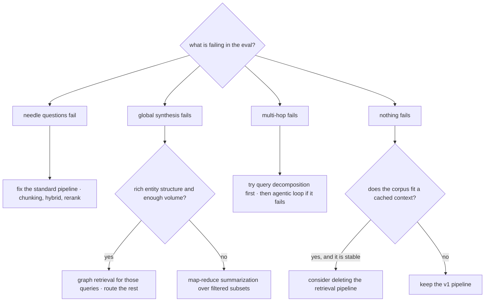

# RAG Frontiers

The pipeline built across this module — chunk, embed, hybrid-retrieve, rerank, assemble, generate — handles the query class it was designed for: **questions whose answers live in a few specific passages.** This chapter covers three directions the field is pushing for the queries that don't fit that assumption, and it is deliberately framed as a *decision framework rather than a set of recommendations*. Graph-structured retrieval addresses corpus-wide synthesis; agentic retrieval addresses multi-hop questions and recovery from bad first attempts; long-context-instead addresses the question of whether you needed retrieval at all. This chapter carries `experimental` status honestly: the specifics here will date faster than anything else in the module, several of these techniques will not survive as separate categories, and **the default answer for almost every system remains the [rag-05](rag-05-rag-pipeline.md) v1 pipeline**. Read this to know what to reach for when your eval shows a named query class failing — and to be able to say no, with reasons, when someone proposes adopting one of these because it was in the news.

## Intuition: what classic RAG assumes

Every limitation in this chapter traces to one assumption baked into top-k retrieval: **the answer is contained in a small number of passages that are individually similar to the question.**

That assumption holds for the majority of real queries and fails in three identifiable ways:

- **Global questions.** "What are the main themes across these 500 incident reports?" No individual passage contains the answer — it exists only in the aggregate. Top-k retrieval returns five reports and the model summarizes those five, producing a confident answer about 1% of the corpus with no indication that it saw 1%.
- **Multi-hop questions.** "Which of our vendors are affected by the policy the security team published last quarter?" requires finding the policy, extracting its criteria, then finding vendors matching them. A single embedding of that question sits in the semantic space *between* both documents and retrieves neither well.
- **Questions where retrieval is overhead.** If the corpus is small and stable, the retrieval pipeline may be machinery you don't need — the whole thing could fit in a cached context window.

Each frontier below attacks exactly one of these. **The engineering discipline is to identify which of these classes is failing in your eval before adopting anything**, because each carries substantial cost and none improves the queries the standard pipeline already handles.

## GraphRAG: structure for global questions

**The idea.** Rather than only indexing passages, extract *entities and relationships* from the corpus with an LLM, assemble them into a knowledge graph, detect communities of densely-connected entities, and pre-generate summaries of each community. A global question is then answered by consulting community summaries (map-reduce over the graph) rather than by retrieving passages.[^edge-graphrag]

**What it buys.** Genuine answers to corpus-wide questions — themes, trends, "what connects X and Y" — that top-k retrieval structurally cannot produce, because it can only return passages and there is no passage containing an aggregate. It also gives multi-hop traversal a natural home: relationships are explicit edges rather than something the retriever must infer.

**What it costs**, and these are large enough to be decisive:

- **Indexing cost and time.** Entity/relationship extraction means at least one LLM call per chunk, plus community detection and summary generation. For a large corpus this is orders of magnitude more expensive than embedding, and it recurs on updates.
- **Extraction errors compound.** The graph is built by a model, so hallucinated or missed entities become permanent structural errors that every downstream query inherits — unlike an embedding error, which affects one passage's retrievability.
- **Staleness amplification.** A changed document may invalidate entities, edges, *and* the community summaries derived from them. Incremental update is materially harder than upserting a vector.
- **Operational surface.** A graph store, an extraction pipeline, and a summarization pipeline, on top of everything the standard pipeline already needs.

**When it's warranted:** a corpus with genuinely rich entity structure (incident reports, research literature, legal filings, org-wide knowledge), *and* an eval showing that global-synthesis questions are a real, failing, valuable share of your traffic. Hybrid deployment is the sane pattern — route global questions to the graph, everything else to the standard pipeline — rather than replacing retrieval wholesale.

## Agentic retrieval: retrieval in a loop

**The idea.** Instead of a single retrieve-then-generate pass, make retrieval a *tool* the model can call repeatedly ([agt-01](../04-agents/agt-01-agent-fundamentals.md)): search, assess whether the results answer the question, reformulate and search again if not, and stop when satisfied. Self-RAG-style approaches formalize this with the model emitting explicit reflection tokens on whether to retrieve and whether retrieved evidence supports the answer.[^asai-selfrag]

**What it buys.** Multi-hop naturally (the second search can use what the first found), recovery from a bad first query (the model notices nothing relevant came back and tries different terms), and adaptive retrieval depth — cheap questions get one search, hard ones get five. It also gives the system a principled place to decide *not* to answer: if repeated searches surface nothing, that's evidence for abstention ([rag-07](rag-07-rag-evaluation.md)).

**What it costs.** Latency multiplied by the number of loops (each iteration is a full model round trip plus a search), token cost that scales with the growing trajectory, non-determinism in how many steps a query takes, and **the entire agent reliability tax** — loops that don't terminate, repeated identical searches, and the compounding-error problem ([agt-09](../04-agents/agt-09-agent-reliability.md)). A system that answered in 2 seconds now answers in 8, sometimes 20.

**When it's warranted:** multi-hop questions are a meaningful share of traffic, users tolerate multi-second latency, and you have the budget-and-termination machinery agents require ([eng-02](../../engineering/eng-02-agent-loop-architecture.md)'s control points). A cheap intermediate worth trying first: **query decomposition** ([rag-06](rag-06-advanced-retrieval.md)) — split the question into sub-queries up front and retrieve for each in parallel. It captures much of the multi-hop benefit at one round trip instead of N, with no loop to control.

## Long context instead of retrieval

**The idea.** Context windows now hold hundreds of thousands of tokens. If the corpus fits, skip retrieval: put everything in the prompt, cache the prefix ([api-05](../02-llm-apis/api-05-streaming-caching-batch.md)), and let attention do the selection.

**When this genuinely wins.** A small, stable corpus — a product manual, a policy set, a codebase module — queried frequently. Prompt caching makes the repeated prefix cheap after the first request, and you delete the entire retrieval pipeline: no chunking decisions, no embedding versioning, no index freshness, no retrieval failure modes. For a 100-page manual, this is often the *correct* architecture and teams build RAG for it out of habit.

**Why it doesn't generalize**, restating [rag-01](rag-01-context-engineering.md)'s three costs with the frontier framing:

- **Quadratic prefill compute.** Cost and time-to-first-token grow superlinearly with context length ([fnd-05](../01-foundations/fnd-05-transformer-architecture.md)); caching amortizes this only for *stable* prefixes, so a corpus that updates daily pays it repeatedly.
- **Usable length lags advertised length.** Task performance degrades well before the window is full, and mid-context content is used less reliably than content at the edges.[^hsieh-ruler][^liu-lost-middle] "It fits" is not "it works."
- **Freshness, scale, and access control.** Retrieval gives you per-request document selection — which is how you enforce per-user permissions, include only current documents, and handle corpora that will never fit regardless of window size.

**The honest synthesis:** growing windows move the boundary rather than erasing it. They make chunking less fraught (bigger chunks are affordable), make "retrieve 5 passages" comfortably safe, and make small-corpus RAG unnecessary. They do not remove the need for retrieval over large, fresh, or access-controlled corpora — and the cost curve means stuffing is rarely optimal even when it's possible.

## The decision framework

The chapter's actual deliverable: match query class and corpus properties to architecture, driven by your eval rather than by novelty.

*Which architecture the failing query class implies:*

| Query class | Example | Architecture |
|---|---|---|
| Needle | "What is the refund window?" | Standard pipeline (rag-05 v1) |
| Global synthesis | "What themes recur across these reports?" | Graph retrieval, or map-reduce over a filtered subset |
| Multi-hop | "Which vendors does last quarter's policy affect?" | Decomposition first; agentic loop if that fails |
| Small stable corpus, any class | "Anything about this 80-page manual" | Long context with prompt caching |

The rules that keep this honest: **evidence before adoption** — a frontier technique requires an eval showing its target class failing at meaningful volume; **hybrid over replacement** — route the failing class to the new machinery and leave the working majority alone; and **cheapest rung first** — decomposition before agentic loops, filtered map-reduce before a graph pipeline, better chunking before any of it.

> **Volatile:** this entire chapter is expected to date. Techniques may consolidate into standard tooling, models may absorb multi-hop retrieval natively, and context economics will keep shifting the long-context boundary. What should survive: the query-class taxonomy, the evidence-before-adoption rule, and the observation that each frontier attacks one specific structural assumption of top-k retrieval.

## Production engineering perspective

- **Cost per query changes category, not degree.** Graph indexing is an LLM call per chunk; agentic retrieval multiplies round trips; long-context stuffing multiplies prefill. These are 5–50× shifts, not 10% ones — model them before prototyping ([eng-10](../../engineering/eng-10-cost-optimization.md)).
- **Latency budgets often decide.** An agentic loop's p99 is several times its median because step counts vary. If your product has a hard latency SLO, that variance may disqualify the approach regardless of quality.
- **Evaluation gets harder, not easier.** Global-synthesis answers have no single gold passage, so [rag-07](rag-07-rag-evaluation.md)'s recall@k doesn't apply; you need rubric-based judging of coverage and faithfulness against the whole subset. Budget the eval work as part of the adoption.
- **The maintenance asymmetry.** A vector index rebuild is a batch job; a knowledge graph rebuild is a batch job *plus* extraction quality review. Frontier architectures raise the cost of every future corpus change.
- **Keep the fallback.** Route by query class with the standard pipeline as the default path, so a frontier component's failure degrades to v1 behavior rather than to an outage ([prd-04](../06-production/prd-04-reliability.md)).

## Historical evolution

**2023:** the "naive RAG is limited" critique becomes widespread as production systems hit the global-synthesis and multi-hop walls; a wave of proposed architectures follows. Self-RAG formalizes retrieve-critique-regenerate loops.[^asai-selfrag] **2024:** GraphRAG demonstrates that graph-structured indexing meaningfully outperforms top-k retrieval on query-focused summarization over whole corpora;[^edge-graphrag] simultaneously, long-context models prompt widespread "RAG is dead" claims. **2024:** those claims are tested and largely refuted — RULER and related work show usable context lags advertised context, and cost arithmetic keeps retrieval competitive even where stuffing is possible.[^hsieh-ruler] Meanwhile the *unglamorous* improvements — better chunking, contextual enrichment, hybrid search — turn out to deliver more measured gain than most frontier architectures.[^anthropic-contextual] **2024–present:** consolidation toward hybrid systems that route by query class, and toward agentic retrieval as a *capability of agents* rather than a separate RAG variant. The pattern worth learning: **each "RAG is obsolete" cycle has resolved into "RAG plus something, for a specific query class"** — which is the prior to apply to the next one.

## Common misconceptions

- **"Long context killed RAG."** It killed *small-corpus* RAG, which was often over-engineering anyway. Large, fresh, or access-controlled corpora still require per-request selection, and quadratic prefill plus mid-context degradation keep stuffing expensive even when it fits.
- **"GraphRAG is better RAG."** It's *different* retrieval, targeted at global questions. On needle questions it is typically slower, costlier, and no more accurate than a well-tuned standard pipeline.
- **"Agentic retrieval is just RAG with more steps."** It's RAG plus the entire agent reliability problem — termination, loop detection, budget control, non-deterministic latency. That tax is the reason to try decomposition first.
- **"These are upgrades to adopt."** They are trades against specific failure classes. Adopted without evidence, they add cost and failure modes while improving nothing the eval measures.
- **"Frontier techniques beat fundamentals."** Measured results repeatedly favor chunking quality, contextual enrichment, and hybrid search over architectural novelty — the cheapest rungs remain the highest-yield.
- **"We should build for the frontier now."** Frontier status means the technique may not survive as a category. Build the v1 pipeline, instrument it, and let the eval tell you what to add.

## Failure modes and trade-offs

- **Graph extraction errors as permanent structure** — a hallucinated entity or missed relationship corrupts every query touching it, unlike a single bad embedding. *Mitigation:* sample-audit extraction quality; treat the extraction prompt as an eval-gated artifact.
- **Agentic non-termination and thrash** — repeated near-identical searches burning budget. *Mitigation:* step budgets, stall detection, and summarize-and-escalate on exhaustion (eng-02).
- **Latency variance** — median acceptable, p99 unacceptable, because step count is data-dependent. *Mitigation:* cap steps; route only the query classes that need it.
- **Long-context quality cliff** — everything fits, results degrade anyway from mid-context inattention. *Mitigation:* measure at your real lengths (RULER-style probes) before committing.[^hsieh-ruler]
- **Eval invalidation** — global-synthesis answers can't be scored by recall@k, so teams adopt the architecture and lose their measurement. *Mitigation:* build the rubric-based eval *before* the architecture.
- **Complexity without evidence** — the dominant failure. *Mitigation:* the evidence-before-adoption rule, and a willingness to remove a component that didn't move the metric.

## Best practices

- **Fix the fundamentals first.** Chunking, enrichment, hybrid search, and reranking outperform architectural novelty on most corpora and cost far less.
- **Classify your failing queries** by the taxonomy (needle / global / multi-hop) using real production failures before considering any frontier technique.
- **Require evidence and volume**: the target class must be failing *and* be a meaningful share of traffic.
- **Prefer the cheaper intermediate**: decomposition before agentic loops; filtered map-reduce before a graph pipeline; long-context-with-caching before either, if the corpus is small and stable.
- **Route, don't replace** — send the failing class to the new path and keep v1 as the default and the fallback.
- **Build the evaluation before the architecture**, especially for global synthesis where standard retrieval metrics don't apply.
- **Model the cost-per-query shift explicitly** — these are category changes, not marginal ones.
- **Re-review this chapter's specifics at the volatility cadence**; keep the framework, expect the techniques to move.

## Real-world examples

**The graph that answered the wrong question well.** A team with 30,000 support tickets adopts graph-structured retrieval after reading about corpus-wide summarization, spending three weeks on extraction and community summarization. It genuinely answers "what are the top recurring failure themes this quarter" — a question executives ask monthly. But 95% of production traffic is agents asking "has anyone seen this specific error before," a needle query the graph handles *worse* than the previous pipeline (slower, and community summaries abstract away the specific detail agents needed). The resolution is routing: graph path for the monthly analytical questions, standard pipeline for everything else. The technique wasn't wrong; deploying it as a replacement rather than a route was.

**Decomposition beating an agent.** Multi-hop questions ("which customers on the affected plan haven't been notified?") fail on a standard pipeline. The team scopes an agentic retrieval loop — several days of work plus budget and termination machinery. Before building it, they try query decomposition: an LLM call splits the question into two sub-queries, both retrieved in parallel, results merged. It resolves most of the failing cases at one extra round trip, with no loop to control and no latency variance. The agentic loop stays on the backlog, unbuilt. **The cheapest rung that could work, tried first.**

**The retrieval pipeline that was deleted.** A team maintains chunking, embedding, a vector store, and a freshness pipeline for an internal handbook — about 90 pages, updated a few times a year. A cost review notices the whole corpus is roughly 60k tokens: it fits in context with room to spare, is byte-stable between edits (so prompt caching applies almost perfectly), and query volume is modest. They delete the pipeline and put the handbook in a cached system prompt. Latency improves, cost falls, quality improves slightly (no retrieval misses), and four components leave the architecture diagram. Long context didn't kill RAG — it killed RAG *for corpora that never needed it*, and recognizing that is worth as much as any frontier technique.

## Interview questions

1. **"Is RAG obsolete now that context windows are huge?"** — Model answer: no, but the boundary moved. Long context genuinely replaces retrieval for small, stable corpora — a manual or policy set that fits in a cached prefix, where deleting the pipeline is the right call. It doesn't generalize because prefill is quadratic in length so cost and TTFT grow superlinearly, usable context lags advertised context with measurable degradation on mid-context content, and retrieval is what gives per-request document selection for freshness and access control. Corpora that are large, fresh, or permission-scoped still need retrieval. Practically, big windows made RAG *easier* — bigger chunks, safer top-k — rather than unnecessary.

2. **"When would you build GraphRAG?"** — Model answer: when my eval shows global-synthesis questions failing at meaningful volume — "what themes recur," "what connects these" — which top-k retrieval structurally cannot answer since no single passage contains an aggregate, *and* the corpus has genuinely rich entity structure. The costs are serious: an LLM call per chunk for extraction, extraction errors that become permanent structural defects, staleness that invalidates entities and derived summaries together, and a graph store to operate. I'd deploy it as a route for that query class rather than a replacement, keeping the standard pipeline for needle queries where a graph typically performs worse.

3. **"What's the difference between agentic retrieval and just retrieving more?"** — Model answer: agentic retrieval makes search a tool in a loop — the model searches, assesses whether results answer the question, reformulates, and repeats — which buys multi-hop reasoning, recovery from a bad first query, and adaptive depth. Retrieving more just widens a single shot and can't use what the first search found. The cost is the whole agent reliability problem: non-terminating loops, repeated identical searches, latency multiplied by step count with high p99 variance, and budget control. That's why I'd try query decomposition first — split the question up front, retrieve in parallel, merge — which captures most multi-hop benefit at one round trip.

4. **"How do you decide whether to adopt a frontier retrieval technique?"** — Model answer: classify the failing queries first. If needle questions are failing, the fix is in the fundamentals — chunking, hybrid, reranking — not the frontier. If global synthesis is failing at volume and the corpus has entity structure, graph retrieval is the candidate. If multi-hop is failing, decomposition then agentic loops. If nothing is failing and the corpus is small and stable, the interesting question is whether to *delete* retrieval. In every case: evidence before adoption, route rather than replace, cheapest rung first, and build the eval before the architecture — especially for global synthesis, where recall@k doesn't apply.

5. **"What's the risk of building on experimental techniques?"** — Model answer: they may not survive as categories — this space has repeatedly seen "RAG is obsolete" claims resolve into "RAG plus something for a specific query class," and standalone techniques get absorbed into models or standard tooling. The concrete risks are cost-category shifts (5–50×, not marginal), new permanent failure modes like graph extraction errors that corrupt every downstream query, higher maintenance on every corpus change, and evaluation that no longer works with your existing metrics. So I'd keep frontier components on routed paths with the v1 pipeline as fallback, and be willing to remove anything that stops paying — which requires having measured the delta when it was added.

6. **"Your eval shows multi-hop questions failing. Walk me through your options in order."** — Model answer: cheapest first. Check whether the fundamentals are actually the problem — sometimes "multi-hop failure" is really a chunking failure where the two facts were split awkwardly, or a vocabulary gap hybrid search fixes. Then query decomposition: an LLM call splits the question into sub-queries retrieved in parallel and merged — one extra round trip, no loop, no variance. If decomposition fails because later hops genuinely depend on earlier results, then an agentic retrieval loop, with step budgets, stall detection, and termination policy from day one. And I'd route only multi-hop-classified queries there, so the latency cost doesn't hit the needle queries that are working fine.

## Exercises and mini-project

**Exercises**

1. Classify each as needle, global, or multi-hop, and name the architecture: (a) "what's our PTO carryover limit?"; (b) "what do our lost-deal notes have in common?"; (c) "which open incidents involve the vendor named in last week's advisory?"; (d) "summarize the security section of the handbook."
2. Your corpus is 400k tokens, updated weekly, queried 5,000×/day. Argue for or against long-context-instead using the three costs, with rough arithmetic.
3. Estimate GraphRAG indexing cost for 50k chunks at one extraction call each (assume ~1k input / 300 output tokens per call at a rate you choose). Compare to embedding the same corpus.
4. Design the eval for a global-synthesis feature — no gold passage exists. What do you measure, and how do you make it repeatable?
5. Give three signals from a production trace that would tell you an agentic retrieval loop is thrashing rather than reasoning.

**Mini-project: justify or reject a frontier technique.** Using your [rag-07](rag-07-rag-evaluation.md) eval and capstone: (a) classify your 50 eval queries into needle / global / multi-hop and compute the pass rate per class — this alone usually reveals where the gap is; (b) pick the worst-performing non-needle class and estimate what fraction of real traffic it represents; (c) implement the *cheapest* intervention for that class (decomposition, filtered map-reduce, or long-context-with-caching) and measure the delta; (d) estimate the cost and latency shift of the full frontier technique for that class; (e) write the decision memo: adopt, adopt-as-route, or reject — with numbers. Target: 4 hours. Success criterion: a documented decision, including — quite legitimately — "our failing class is too small to justify this."

**Capstone extension:** this closes the retrieval module. Your capstone's architecture is now either v1 (correctly, for most) or v1-plus-a-routed-frontier-path with evidence. [agt-01](../04-agents/agt-01-agent-fundamentals.md) next wraps retrieval as a tool, which is where agentic retrieval becomes natural rather than exotic.

## Revision summary

- Classic top-k RAG assumes the answer lives in a few individually-similar passages. Three frontier directions attack the three ways that assumption fails: global synthesis, multi-hop, and "you didn't need retrieval."
- **GraphRAG**: LLM-extracted entities/relations plus community summaries answer corpus-wide questions top-k structurally cannot. Costs: per-chunk extraction, extraction errors as permanent structure, staleness amplification, graph ops. Route it; don't replace with it.
- **Agentic retrieval**: search as a tool in a loop buys multi-hop, recovery, and adaptive depth, at the cost of latency×steps, token growth, non-determinism, and the full agent reliability tax. Try query decomposition first — most of the benefit, one round trip.
- **Long context instead**: correct for small stable corpora with prompt caching (delete the pipeline). Doesn't generalize because of quadratic prefill, usable-vs-advertised length gaps, and the freshness/scale/ACL requirements only per-request retrieval satisfies.
- Decision framework: identify the failing query class in your eval, require meaningful volume, take the cheapest rung first, route rather than replace, and build the eval before the architecture. Fundamentals (chunking, enrichment, hybrid, rerank) still outperform novelty on most corpora.

## Flashcards

| Q | A |
|---|---|
| The assumption classic RAG makes? | The answer lives in a few passages that are individually similar to the question. |
| Three query classes that break it? | Global synthesis, multi-hop, and small-stable-corpus (where retrieval is overhead). |
| What does GraphRAG buy and cost? | Buys corpus-wide synthesis top-k can't produce; costs per-chunk LLM extraction, permanent extraction errors, staleness amplification, graph ops. |
| Why try decomposition before an agentic loop? | It captures most multi-hop benefit at one extra round trip, with no loop control, no step-count variance, and no agent reliability tax. |
| When does long-context-instead genuinely win? | Small, stable corpus queried often — prompt caching makes the prefix cheap and the whole retrieval pipeline can be deleted. |
| Why doesn't long context generalize? | Quadratic prefill cost/TTFT, usable length lags advertised length with mid-context degradation, and no per-request selection for freshness or access control. |
| The evidence rule for frontier adoption? | The target query class must be failing in the eval *and* represent meaningful traffic volume. |
| Route or replace? | Route — send the failing class to the new path, keep v1 as default and fallback. |
| Why does global-synthesis evaluation need new metrics? | There is no single gold passage, so recall@k doesn't apply; coverage and faithfulness need rubric-based judging. |
| What has every "RAG is dead" cycle resolved into? | "RAG plus something, for a specific query class." |

## Further reading

- **Official docs:** none stable enough at this frontier; provider docs on long context and caching are the exception ([api-05](../02-llm-apis/api-05-streaming-caching-batch.md)'s sources).
- **Papers:** Edge et al., GraphRAG (2024)[^edge-graphrag] — read §2 for the indexing pipeline's real cost; Asai et al., Self-RAG (2023)[^asai-selfrag]; Hsieh et al., RULER (2024)[^hsieh-ruler] — the usable-context evidence; Liu et al., "Lost in the Middle" (2023)[^liu-lost-middle].
- **Books:** none — the field moves faster than publication.
- **Talks:** treat conference talks here as claims to verify, not findings to adopt.
- **Tutorials:** Anthropic's contextual retrieval post[^anthropic-contextual] — included deliberately as the counterpoint: an unglamorous ingestion improvement that outperforms most architectural novelty.

## Check your understanding

1. Name the three ways classic RAG's core assumption fails, and the frontier direction that targets each.
2. A stakeholder proposes GraphRAG after reading about it. Give the three questions you'd ask before scoping any work.
3. Explain why long context didn't obsolete retrieval, using all three costs, and name the case where it genuinely should replace it.
4. Your multi-hop queries fail. Order your options from cheapest to most expensive, with the reason each might suffice.
5. This chapter is `experimental`. Which parts do you expect to survive the next two review cycles, and which do you expect to be rewritten?

## Sources

[^edge-graphrag]: [T2] Edge et al. (2024). "From Local to Global: A Graph RAG Approach to Query-Focused Summarization." arXiv:2404.16130. https://arxiv.org/abs/2404.16130 (accessed 2026-07-10)
[^asai-selfrag]: [T2] Asai et al. (2023). "Self-RAG: Learning to Retrieve, Generate, and Critique through Self-Reflection." arXiv:2310.11511. https://arxiv.org/abs/2310.11511 (accessed 2026-07-10)
[^hsieh-ruler]: [T2] Hsieh et al. (2024). "RULER: What's the Real Context Size of Your Long-Context Language Models?" arXiv:2404.06654. https://arxiv.org/abs/2404.06654 (accessed 2026-07-10)
[^liu-lost-middle]: [T2] Liu et al. (2023). "Lost in the Middle: How Language Models Use Long Contexts." arXiv:2307.03172. https://arxiv.org/abs/2307.03172 (accessed 2026-07-10)
[^anthropic-contextual]: [T4] Anthropic (2024). "Introducing Contextual Retrieval." https://www.anthropic.com/news/contextual-retrieval (accessed 2026-07-10)
