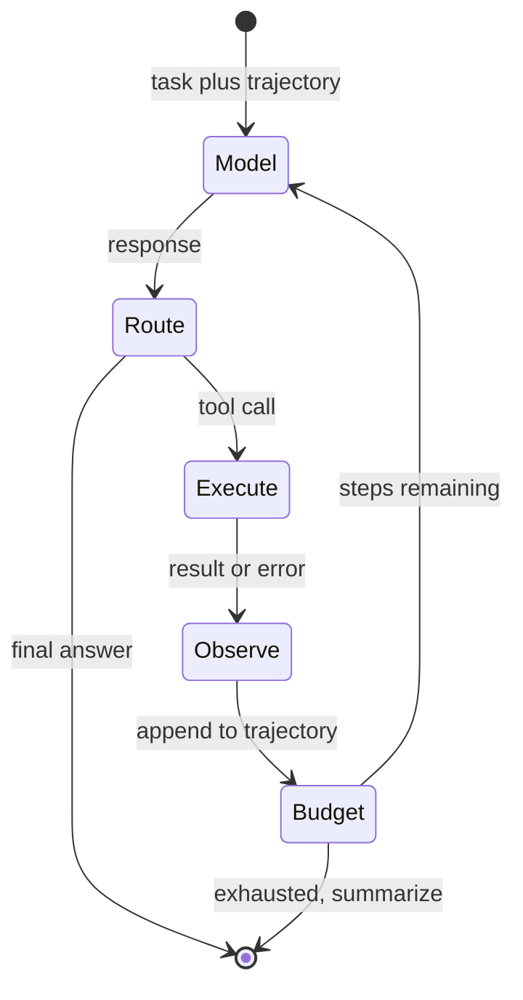
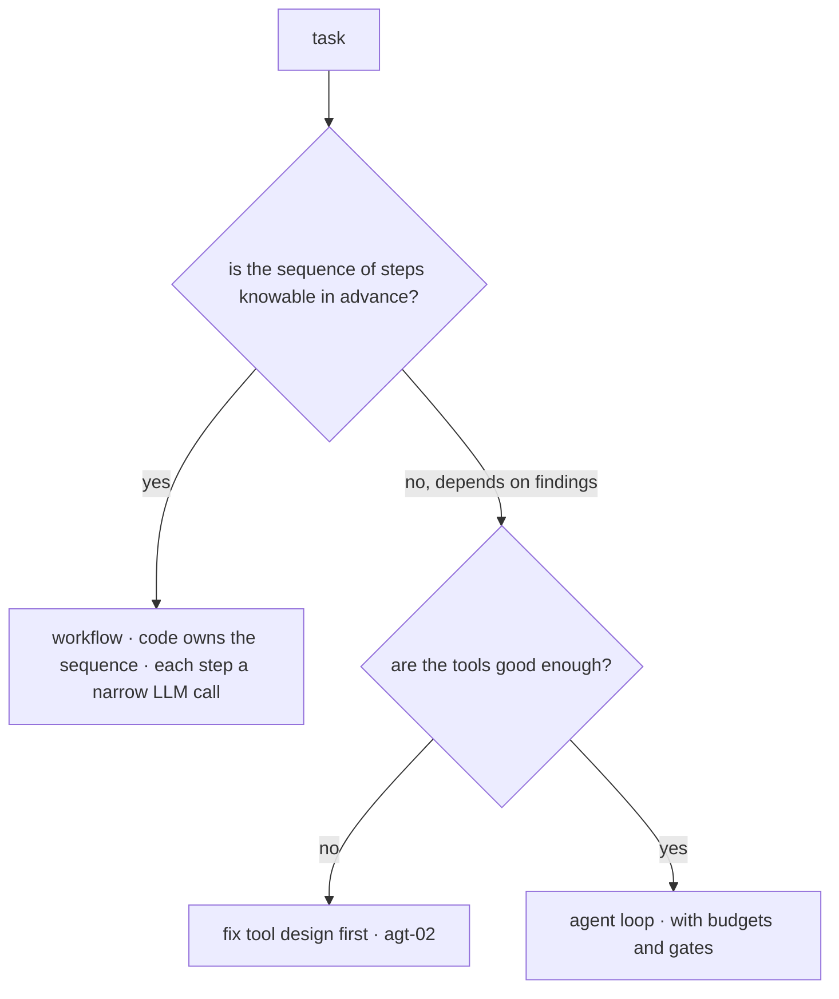

# Agent Fundamentals

An agent is the tool round trip you already built in [api-03](../02-llm-apis/api-03-structured-outputs-tool-calling.md), run in a loop until the task is done. That is the whole idea, and it is genuinely about forty lines of code — which is why this chapter insists you write those forty lines yourself before touching a framework. Everything that makes agents *hard* lives not in the loop but in what surrounds it: when to stop, what happens when a tool fails, what the model is allowed to do, and how errors compound over a long horizon. Building the minimal version and then deliberately breaking it is the fastest way to understand why every production agent runtime looks the way [eng-02](../../engineering/eng-02-agent-loop-architecture.md) specifies. The chapter closes with the question you should ask before any of this: **do you need an agent at all?** — because the most common agent-shaped mistake is using one where a fixed sequence of LLM calls would be cheaper, faster, and testable.

## Intuition: the model plans, the runtime acts

The governing frame, and the one to carry into every later agent chapter: **the model contributes decisions; your runtime contributes everything else.**

The model receives a task and the results of previous actions, and emits one thing — a decision about what to do next, expressed as a tool call or a final answer. It does not execute anything, cannot enforce anything, and has no memory beyond the context you hand it. Every guarantee in the system — that a tool's arguments are valid, that the caller is authorized, that the loop terminates, that a side effect happens at most once — is enforced by deterministic code you write.

That split explains why agents feel unfamiliar even to experienced engineers. Ordinary control flow is written down and inspectable; here the control flow is *generated at runtime by a probabilistic component*, one step at a time. What you write is not the plan but the **runtime that constrains and executes plans** — a small interpreter whose instruction stream arrives from a model.

The loop itself is three moves, named ReAct in the literature that first combined them: reason about what to do, act by calling a tool, observe the result, repeat.[^yao-react] The insight that made it work is that *interleaving* reasoning with acting beats doing either alone — a model that must act without reasoning flails, and one that reasons without acting hallucinates the world it cannot check.

## Building the minimal loop

The complete agent, with nothing that isn't essential. This is worth reading closely because every later concept is a modification of it.

```python
def run_agent(task, tools, max_steps=10):
    messages = [{"role": "user", "content": task}]

    for step in range(max_steps):
        response = client.messages.create(          # api-01 gateway
            model=MODEL, max_tokens=1024,
            system=AGENT_SYSTEM_PROMPT,             # eng-06 skeleton
            tools=[t.schema for t in tools],        # api-03 tool definitions
            messages=messages,
        )
        messages.append({"role": "assistant", "content": response.content})

        calls = [b for b in response.content if b.type == "tool_use"]
        if not calls:                                # no tool call = final answer
            return response.text

        results = []
        for call in calls:
            tool = tools[call.name]
            try:
                output = tool.run(**call.input)      # YOUR code executes
            except Exception as e:
                output = f"error: {e}"               # errors go back in-band
            results.append({"type": "tool_result",
                            "tool_use_id": call.id, "content": str(output)})

        messages.append({"role": "user", "content": results})

    return summarize_incomplete(messages)            # budget exhausted
```

Four details carry most of the meaning:

- **The loop's exit condition is the model declining to call a tool.** A response with no tool call *is* the answer — that's how the model says "done." Everything else is another iteration.
- **`messages` is the trajectory**, and it grows every step: assistant decisions and tool results accumulate. That growth is a first-order cost, not bookkeeping — by step fifteen you are re-sending fourteen steps of history on every call ([api-05](../02-llm-apis/api-05-streaming-caching-batch.md)'s caching is what makes this viable rather than absurd).
- **Tool results return as messages.** They are context, subject to everything Module 3 taught: they consume budget, they influence subsequent reasoning, and — because tools often fetch external content — they are untrusted input ([sec-01](../07-safety-security/sec-01-prompt-injection.md)).
- **The `except` clause is load-bearing.** Sending the error text back into the conversation rather than raising it is what lets the model *recover* — try different arguments, use a different tool, or report the failure to the user. An agent whose tools throw to your code is an agent that cannot adapt.

*The minimal loop as a state machine — note that only one state involves the model:*



## What breaks, and what each break requires

Run that loop on real tasks and it fails in a predictable order. Each failure motivates one component of the production architecture, which is the most efficient way to learn why that architecture exists.

**It never stops.** A model that can't complete a task will keep trying — searching the same term, retrying the same failing call — until your token budget is gone. The `max_steps` guard above is the crudest version of the fix; real runtimes need **budgets across several dimensions** (steps, tokens, wall clock, spend) plus **stall detection**: if the last N steps are near-identical, the loop is thrashing rather than progressing, and should break with a summary rather than burning to the cap ([agt-09](agt-09-agent-reliability.md)).

**It forgets what it decided.** Ask an agent to follow a plan across fifteen steps and it will drift — because the plan was stated in step two and is now buried under thirteen steps of tool output, in the middle of a long context where attention is weakest ([fnd-05](../01-foundations/fnd-05-transformer-architecture.md), [rag-01](../03-retrieval/rag-01-context-engineering.md)). The fix is not a better prompt: it is **structured state** held outside the trajectory — the plan, decisions, and constraints kept as data and re-pinned into the context every step ([agt-04](agt-04-memory-and-state.md)).

**It acts on nonsense.** The model will occasionally call a tool with a plausible-looking but invented argument — an order ID that doesn't exist, an amount the user never mentioned ([api-03](../02-llm-apis/api-03-structured-outputs-tool-calling.md)'s hallucinated-argument failure). Tool arguments are model output, and model output is unverified: hence **validate, then authorize, then execute**, with authorization derived from the session rather than from the model's request ([eng-02](../../engineering/eng-02-agent-loop-architecture.md)'s control points).

**It does something irreversible.** The first time an agent sends an email or issues a refund it shouldn't have, the lesson is that capability is not the same as permission. Consequential actions need **human gates** and side-effecting tools need **idempotency keys**, because retries and duplicate calls are normal loop behavior ([eng-05](../../engineering/eng-05-design-patterns.md) #14).

**It gets slower and more expensive than anyone predicted.** Each step is a full model call over a growing trajectory; a ten-step task is not ten times a single call, it is closer to the sum of an arithmetic series. Prompt caching over the append-only trajectory is what keeps this viable ([api-05](../02-llm-apis/api-05-streaming-caching-batch.md)), which is why the trajectory should grow by appending rather than being rewritten each step.

That list *is* [eng-02](../../engineering/eng-02-agent-loop-architecture.md)'s architecture, derived from failures rather than presented as doctrine — which is the point of building the minimal version first.

## Do you need an agent?

The decision that precedes all of the above, and the one most often skipped.

An agent's defining property is that **the sequence of steps is decided at runtime by the model.** That flexibility is valuable exactly when the path genuinely cannot be known in advance — and it is a liability when the path *is* known, because you have replaced testable control flow with a probabilistic component that costs a model call per step and can fail in ways a fixed sequence cannot.

*The decision, in one question:*



**Workflows** — fixed pipelines of focused LLM calls where code owns the sequencing — are cheaper, faster, deterministic in structure, individually testable, and independently cacheable. "Classify the ticket, then extract fields, then draft a reply" is a workflow; writing it as an agent adds cost and failure modes for nothing ([eng-05](../../engineering/eng-05-design-patterns.md) #13).

**Agents** earn their place when the next step genuinely depends on what previous steps found: debugging, research, and open-ended operational tasks where the plan is discovered rather than known.

And the observation from lab engineering practice worth taking seriously: **a large share of "we need an agent" problems are tool-design problems.**[^anthropic-agents] A single call with one well-designed tool frequently beats a five-step loop with three awkward ones — which is why [agt-02](agt-02-tool-design.md) follows immediately, and why the decision tree above routes through tool quality before reaching for the loop.

## Why agents are hard: compounding

The mathematical fact that shapes every later reliability decision, introduced here so it colors how you read the rest of the module.

Agent steps are sequential and dependent: each step's input includes the previous steps' outputs, so an error early does not stay contained — it propagates into every subsequent decision ([fnd-08](../01-foundations/fnd-08-sampling-and-decoding.md)'s autoregressive compounding, at task granularity). If each step succeeds independently with probability $p$, a task requiring $n$ correct steps succeeds with roughly $p^n$:

| Per-step reliability | 5 steps | 10 steps | 20 steps |
|---|---|---|---|
| 0.95 | 77% | 60% | 36% |
| 0.99 | 95% | 90% | 82% |

This is why a demo that works impressively on a three-step task disappoints on a fifteen-step one, and why the engineering effort in agents concentrates on **containing and recovering from step failures** rather than on making the model smarter. It also explains the single most useful design instinct in this module: **fewer steps is a reliability strategy** — better tools that accomplish more per call beat more steps with weaker tools, on every axis simultaneously. [agt-09](agt-09-agent-reliability.md) develops the containment machinery; the number above is why it exists.

## Production engineering perspective

- **Route every call through the gateway** ([api-01](../02-llm-apis/api-01-llm-api-fundamentals.md)) — agents multiply call volume, so retries, timeouts, usage logging, and stop-reason checks matter more here, not less.
- **Trajectory design is cost design.** Append-only growth between deliberate compaction points keeps prompt caching effective; rewriting the trajectory each step invalidates the cache and multiplies spend ([api-05](../02-llm-apis/api-05-streaming-caching-batch.md), [agt-04](agt-04-memory-and-state.md)).
- **Log the full trajectory, not just the final answer** ([evl-04](../05-evaluation/evl-04-tracing-observability.md)). Agent debugging is trajectory reading: which step went wrong, what the model saw at that point, what the tool returned. Without it you have an outcome and no explanation.
- **Budget in four dimensions** (steps, tokens, spend, wall clock) with a defined terminal state for each — exhaustion should summarize and escalate, never stop silently.
- **Stream progress for user-facing agents.** A multi-step task takes tens of seconds; showing steps as they happen converts an unexplained wait into visible work ([api-05](../02-llm-apis/api-05-streaming-caching-batch.md)).
- **Start with the fewest tools that can accomplish the task.** Catalog size costs tokens on every call and degrades selection accuracy ([agt-02](agt-02-tool-design.md)).

## Historical evolution

**2022:** ReAct formalizes interleaving reasoning with acting, showing it beats either alone on knowledge-intensive and decision-making tasks.[^yao-react] **2023:** function calling ships as a first-class API feature ([api-03](../02-llm-apis/api-03-structured-outputs-tool-calling.md)), turning the loop from a parsing exercise into a supported pattern, and autonomous-agent projects capture enormous attention while mostly failing in practice — the demos work, the long-horizon tasks compound into failure. **2023–2024:** the field corrects toward *constrained* agency: workflows where the path is known, agents where it isn't, with budgets and human gates; practitioner guidance converges on "start simple, add agency only when measured need demands it."[^anthropic-agents] Surveys consolidate the architecture space.[^wang-agent-survey] **2024–present:** agents become genuinely productive in domains with cheap verification — coding, where tests provide ground truth, is the standout — while remaining fragile where verification is expensive. The through-line: **agency became useful once the field stopped maximizing it**, and the residual skill is knowing how much to allow.

## Common misconceptions

- **"An agent is a fundamentally new architecture."** It is a while-loop around the tool round trip. What's new is that control flow is generated at runtime, which changes the engineering — not the mechanism.
- **"More autonomy is better."** More autonomy means more steps, more compounding, more cost, and more failure surface. Constrain to the minimum that accomplishes the task.
- **"Use a framework, obviously."** Frameworks are worth adopting *after* you've built the loop and know which control points you need — otherwise you cannot tell what they're hiding ([agt-07](agt-07-agent-frameworks.md)).
- **"The model executes the tools."** The model emits a request; your code decides whether to honor it, validates it, authorizes it, and runs it. Blurring this in your mental model leads to blurring it in your architecture, which is how "the agent deleted the data" incidents actually happen.
- **"If it works for three steps it'll work for fifteen."** Compounding says otherwise: 0.95 per step is 77% at five steps and 36% at twenty. Demo-to-production disappointment is usually this arithmetic.
- **"Agent problems are model problems."** Most are tool-design problems, prompt-scoping problems, or missing-state problems — all of which you fix, not the provider.

## Failure modes and trade-offs

- **Non-termination and thrash** — repeating the same failing action until budget exhaustion. *Fix:* step/token/time budgets plus stall detection on near-identical consecutive steps. *Trade-off:* aggressive caps kill legitimately long tasks; tune per task class.
- **Plan drift** — the agent abandons or contradicts its earlier plan as it accumulates context. *Fix:* structured state re-pinned each step ([agt-04](agt-04-memory-and-state.md)), not longer prompts.
- **Fabricated arguments** — syntactically valid calls with invented values. *Fix:* validate-then-authorize before execution; resolve-and-verify identifiers against real records.
- **Uncontained side effects** — an action taken twice, or taken at all when it shouldn't have been. *Fix:* idempotency keys, least-privilege credentials per tool, human gates on consequential actions.
- **Silent trajectory bloat** — cost and latency grow superlinearly with steps and nobody notices until the bill. *Fix:* per-task token budgets, caching-friendly append-only trajectories, cost-per-task dashboards ([eng-10](../../engineering/eng-10-cost-optimization.md)).
- **The central trade-off:** flexibility versus predictability. Every increment of agency buys adaptability and costs testability, latency, and cost. The engineering question is never "how autonomous can this be" but "how little autonomy suffices."

## Best practices

- **Build the loop from scratch once** before evaluating any framework — it is the only way to know what a framework is hiding.
- **Ask the workflow question first**; if the sequence is knowable, write it in code and use narrow LLM calls for the steps.
- **Return tool errors in-band and make them actionable** ("order not found; try searching by email") so the model can recover.
- **Budget in four dimensions with a defined terminal state**, and add stall detection.
- **Validate arguments, then authorize from the session, then execute** — never trust the model's claim about what it's allowed to do.
- **Keep the trajectory append-only** between deliberate compactions so prompt caching works.
- **Log full trajectories** — agent debugging is trajectory reading.
- **Prefer fewer, better tools over more steps** — it improves reliability, cost, and latency simultaneously.
- **Gate consequential actions behind human confirmation** from the first version, not after the first incident.

## Real-world examples

**The agent that should have been three function calls.** A team builds an agent to process incoming invoices: extract fields, validate against the PO, then route for approval. It works, at roughly 8 seconds and 6 model calls per invoice, and fails unpredictably on about 4% — usually by taking a fifth step it didn't need and confusing itself. Rewritten as a workflow — three narrow LLM calls in a fixed sequence, with code owning the branching — it runs in 2 seconds, 3 calls, with per-step evals and a 0.5% failure rate that is attributable to a specific step. The sequence was always knowable; agency bought nothing and cost everything. **The workflow question would have taken five minutes to ask.**

**The loop that couldn't recover.** An agent's search tool raises a Python exception on malformed queries, which propagates up and kills the run. Users see "something went wrong" on perhaps 15% of tasks. The fix is three lines: catch the exception and return `"error: query syntax invalid — use plain keywords, not boolean operators"` as the tool result. The model reads it, reformulates, and continues. Task completion goes from 85% to 96% with no change to the model, the prompt, or the tools' capabilities — only to how failure was communicated. **In-band, actionable errors are what make the loop a loop rather than a fragile pipeline.**

**The compounding demo.** A research agent demos beautifully: four steps, correct answer, impressive. Rolled out to real questions requiring ten to fifteen steps, completion falls to roughly a third. Nothing is broken — per-step reliability of about 0.93 gives 0.93^12 ≈ 0.42, and the demo was sampling the easy end of the distribution. The team's response is the right one: reduce step count by merging three narrow tools into one that does the common composite operation, add structured state so the plan survives, and gate the task at ten steps with a summarize-and-escalate path. Completion on long tasks rises to 78% — mostly by needing fewer steps, which is the lever the arithmetic recommends.

## Interview questions

1. **"What is an agent, mechanically?"** — Model answer: a loop around the tool-calling round trip. You send the task plus tool schemas; the model returns either a tool call or a final answer; if it's a tool call, your runtime validates the arguments, checks authorization, executes the function, appends the result to the message list as context, and calls the model again. Termination is the model declining to call a tool, or a budget being exhausted. The essential division is that the model contributes decisions and the runtime contributes every guarantee — validation, authorization, execution, idempotency, termination. It's about forty lines; the hard parts are all in what surrounds it.

2. **"When would you build a workflow instead of an agent?"** — Model answer: whenever the sequence of steps is knowable in advance. A workflow puts the sequencing in code with narrow LLM calls for each step, which is cheaper, faster, structurally deterministic, individually testable, and independently cacheable. An agent's only advantage is deciding the path at runtime, which is worth its cost when the next step genuinely depends on what previous steps found — debugging, research, open-ended operations. In practice a large share of "we need an agent" problems are tool-design problems: one well-designed tool in a single call often beats a five-step loop with three awkward ones.

3. **"Why do agents that demo well fail in production?"** — Model answer: compounding. Steps are sequential and dependent, so per-step reliability multiplies — 0.95 per step is 77% over five steps and 36% over twenty. Demos sample short, easy tasks; production has long ones. That arithmetic also tells you where to spend effort: not on making the model smarter but on reducing step count and containing step failures. Merging several narrow tools into one that does the common composite operation improves reliability, cost, and latency at once, which is why "fewer steps" is a reliability strategy rather than just an optimization.

4. **"What happens when a tool fails?"** — Model answer: the error should go back into the conversation as a tool result, not raise to your code. That's what lets the model recover — reformulate arguments, try a different tool, or tell the user it can't proceed. And the error text should be *actionable*: "order not found; try searching by email" enables recovery, while a stack trace doesn't. Exceptions that propagate kill the run and surface as generic failures. I'd also cap retries and add stall detection, since a model that keeps retrying an identically-failing call is thrashing and should break with a summary rather than burning the budget.

5. **"What guarantees can the model provide, and which must your runtime provide?"** — Model answer: the model provides none. It proposes actions; it cannot enforce that arguments are valid, that the caller is authorized, that a side effect happens at most once, or that the loop terminates. All of those are deterministic code: schema plus business-rule validation on arguments, authorization derived from the session rather than from the model's request, idempotency keys on side-effecting tools, least-privilege credentials per tool, and budgets with a defined terminal state. Prompt instructions can *ask* for good behavior, but they're a rate reduction, not a guarantee — which matters because a confused or injected model has exactly the blast radius its tools allow.

6. **"Why build the loop from scratch before using a framework?"** — Model answer: because you can't evaluate what you can't see. Frameworks make choices about termination, error handling, state, and where you can intervene — and if you haven't built those yourself, you don't know which control points you need or whether the framework exposes them. Having written forty lines, framework evaluation becomes concrete: can I reach validation before execution, can I gate a consequential action, can I inspect and modify the trajectory, does it emit traces. It also tends to reveal that for a well-understood loop, raw code plus your existing gateway is clearer than the abstraction.

7. **"How does an agent's cost differ from a single call?"** — Model answer: it's superlinear in steps, because each step re-sends the accumulated trajectory. A ten-step task isn't ten times a single call; it's closer to the sum of a growing series. Two consequences: prompt caching over an append-only trajectory is a viability requirement rather than an optimization, so the trajectory should grow by appending rather than being rewritten each step; and per-task token budgets belong in the runtime alongside step budgets. It's also the strongest practical argument for fewer, more capable tools — cutting step count cuts cost quadratically-ish while simultaneously improving reliability.

## Exercises and mini-project

**Exercises**

1. Trace the message array through three iterations of the minimal loop for "find the customer's last order and email them a receipt." Write out what each entry contains.
2. Compute task success at per-step reliability 0.97 for 3, 8, and 20 steps. At what step count does it fall below 50%, and what two levers raise it?
3. For each, decide workflow or agent and justify: (a) summarize each of 500 documents; (b) find why a specific test is failing; (c) triage a support ticket into one of six queues; (d) research a company and produce a brief.
4. Rewrite these tool errors to be actionable: `KeyError: 'user_id'`; `HTTP 429`; `[]`.
5. Your agent takes 14 steps for a task you believe needs 4. List four diagnoses and the evidence you'd look for in the trajectory.

**Mini-project: build the loop.** No framework: (a) implement the minimal loop on your [api-01](../02-llm-apis/api-01-llm-api-fundamentals.md) gateway with three tools — one of them your [rag-05](../03-retrieval/rag-05-rag-pipeline.md) retrieval exposed as a tool; (b) add a step budget and in-band error handling; (c) run 10 varied tasks and log full trajectories; (d) deliberately break one tool (raise an exception) and observe the failure, then convert it to an in-band error and observe the recovery — record the completion-rate difference; (e) measure steps, tokens, latency, and cost per task, and compute your empirical per-step success rate; (f) memo: your compounding curve, and the one change that would most reduce step count. Target: 4 hours. Success criterion: a working agent you understand line by line, plus your own measured per-step reliability.

**Capstone extension:** this agent wraps your capstone RAG system as a tool. [agt-02](agt-02-tool-design.md) hardens its tools, [agt-04](agt-04-memory-and-state.md) gives it state, [agt-09](agt-09-agent-reliability.md) makes it shippable, and [sec-01](../07-safety-security/sec-01-prompt-injection.md) attacks it.

## Revision summary

- An agent is the tool round trip in a loop: model returns a tool call or a final answer; the runtime validates, authorizes, executes, appends the result as context, and repeats. Termination is the model declining to call a tool, or a budget exhausting.
- **The model contributes decisions; the runtime contributes every guarantee** — validation, authorization, idempotency, termination, isolation. Control flow is generated at runtime by a probabilistic component, which is what makes the engineering unfamiliar.
- Breaking the minimal loop derives the production architecture: non-termination → budgets and stall detection; plan drift → structured state outside the trajectory; fabricated arguments → validate-then-authorize; irreversible actions → human gates and idempotency; cost growth → append-only trajectories with caching.
- Ask the workflow question first: if the sequence is knowable, code owns it and each step is a narrow LLM call — cheaper, faster, testable. Agents earn their cost only when the next step depends on what previous steps found. Many "agent" problems are tool-design problems.
- Compounding governs everything: $p^n$ over sequential dependent steps (0.95 → 36% at twenty steps), so **fewer steps is a reliability strategy** and effort belongs on containment and recovery rather than on model quality.

## Flashcards

| Q | A |
|---|---|
| An agent in one sentence? | The tool-calling round trip run in a loop until the model returns a final answer or a budget is exhausted. |
| What signals termination in the loop? | A model response containing no tool call — that's how it says "done." |
| The division of responsibility? | Model contributes decisions; runtime contributes all guarantees (validation, authorization, idempotency, termination). |
| Why must tool errors return in-band? | So the model can see and recover from them; exceptions that propagate kill the run and prevent adaptation. |
| What makes an error message good for an agent? | Actionability — "order not found; try searching by email" enables recovery; a stack trace doesn't. |
| Why does plan drift happen, and what fixes it? | The plan gets buried mid-trajectory where attention is weakest; fix with structured state re-pinned each step, not longer prompts. |
| The compounding arithmetic? | Success ≈ p^n over sequential dependent steps — 0.95 per step gives 77% at 5 steps, 36% at 20. |
| The strongest reliability lever for agents? | Fewer steps — better tools accomplishing more per call improve reliability, cost, and latency simultaneously. |
| When is a workflow better than an agent? | Whenever the sequence of steps is knowable in advance — cheaper, faster, deterministic in structure, individually testable. |
| Why keep the trajectory append-only? | Prompt caching over a stable growing prefix is what keeps multi-step cost viable; rewriting invalidates the cache. |
| Why build the loop before using a framework? | You can't evaluate what a framework hides until you know which control points you need. |

## Further reading

- **Official docs:** provider tool-use documentation[^anthropic-tools] — the round trip this loop iterates.
- **Papers:** Yao et al., ReAct (2022)[^yao-react] — the reason-act interleaving result; Wang et al., agent survey (2023)[^wang-agent-survey] for the architecture landscape.
- **Books:** none current enough.
- **Talks:** none essential.
- **Tutorials:** Anthropic's "Building effective agents"[^anthropic-agents] — the workflow-versus-agent framing and the start-simple argument; read it right after the mini-project.

## Check your understanding

1. Write the minimal loop from memory in pseudocode, and mark every line where your runtime enforces something the model cannot.
2. Give the four things that break in a naive loop and the production component each one motivates.
3. Compute completion probability for a 12-step task at 0.93 per-step reliability, then name the two interventions that raise it most.
4. A colleague proposes an agent for a fixed three-stage pipeline. Give the two-sentence redirect and what you'd build instead.
5. Explain why "the agent deleted production data" is always a runtime bug rather than a model bug.

## Sources

[^yao-react]: [T2] Yao et al. (2022). "ReAct: Synergizing Reasoning and Acting in Language Models." arXiv:2210.03629. https://arxiv.org/abs/2210.03629 (accessed 2026-07-10)
[^anthropic-agents]: [T4] Anthropic (2024). "Building effective agents." Anthropic Engineering. https://www.anthropic.com/engineering/building-effective-agents (accessed 2026-07-10)
[^anthropic-tools]: [T1] Anthropic. "Tool use with Claude." https://docs.anthropic.com/en/docs/build-with-claude/tool-use/overview (accessed 2026-07-10)
[^wang-agent-survey]: [T2] Wang et al. (2023). "A Survey on Large Language Model based Autonomous Agents." arXiv:2308.11432. https://arxiv.org/abs/2308.11432 (accessed 2026-07-10)
