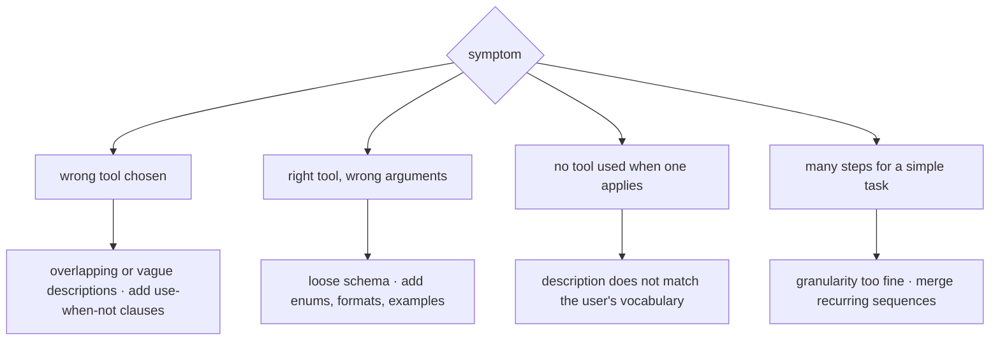

# Tool Design

[agt-01](agt-01-agent-fundamentals.md) established that an agent's capability comes from its tools — the loop itself is forty lines, and everything the agent can *do* is whatever you exposed. This chapter is about designing those interfaces well, and it rests on one reframe that changes how you write them: **a tool definition is a prompt.** The model chooses among tools by reading their names, descriptions, and parameter schemas, all of which are serialized into its context at decision time. So every principle from [api-02](../02-llm-apis/api-02-prompt-engineering.md) applies — specificity, examples, clear constraints — and every failure of tool design shows up as an agent that picks the wrong tool, fills in the wrong arguments, or cannot recover when something fails. The payoff is disproportionate: because compounding punishes step count ([agt-01](agt-01-agent-fundamentals.md)), a tool that accomplishes more per call improves reliability, latency, and cost simultaneously. Most "the agent isn't smart enough" problems are tool-design problems.

## Intuition: the model's-eye view

Before writing a tool, look at what the model actually sees. Not your implementation, not your API docs — the serialized schema in the context window, which is roughly:

```text
search_orders — Search customer orders.
  parameters:
    q (string): query
    limit (integer): max results
```

Now ask the question that governs the whole chapter: **from this alone, could a competent stranger decide when to call this and what to pass?** Here, no. Search by what — order ID, customer email, product, date? What query syntax? Is `q` free text or structured? What does it return? When should they use this instead of `get_order`? Every ambiguity becomes a coin flip at runtime, resolved by the model's guess and paid for in a wasted step.

Two properties follow from tools-as-prompts, and they explain most of the practices below:

- **The model chooses by reading, so descriptions are the selection mechanism.** A tool whose description doesn't distinguish it from its neighbors will be confused with them, no matter how different the implementations are.
- **Schemas are constraints the model can't violate** when structured outputs are enforced ([api-03](../02-llm-apis/api-03-structured-outputs-tool-calling.md)). An enum makes an invalid category *impossible*; prose asking for one of three values makes it merely unlikely. Push every constraint you can into the schema rather than the description.

## Anatomy of a good tool

**Name it semantically.** `search_knowledge_base` beats `kb_query`; `cancel_subscription` beats `sub_cxl`. Models generalize from natural naming because that's what their training data contains; abbreviations are off-distribution and cost accuracy. Use consistent verb-noun structure across your catalog (`get_`, `search_`, `create_`, `cancel_`) so the naming itself carries a hint about read-versus-write — which also helps you assign privilege tiers ([eng-02](../../engineering/eng-02-agent-loop-architecture.md)).

**Write the description as an instruction, including when *not* to use it.** This is the highest-leverage field in the entire definition. It should say what the tool does, when to reach for it, what it returns, and — the part most often omitted — the boundary against neighboring tools:

```text
search_orders — Find orders matching free-text criteria (customer name, product,
date range). Returns up to `limit` order summaries with IDs and status.
Use when you do NOT already have an order ID. If you have an order ID, use
get_order instead, which returns full details including line items.
```

That "use when you do NOT" clause is what eliminates the most common selection error, and it costs one sentence.

**Type the parameters tightly.** Enums for closed sets, formats for dates and identifiers, and per-parameter descriptions with an example value. Required-with-nullable beats optional when you want the model to explicitly acknowledge a field ([api-03](../02-llm-apis/api-03-structured-outputs-tool-calling.md)'s pattern). Every constraint expressed in the schema is one the model cannot violate; every constraint expressed in prose is one it merely tends to respect.

**Return structured, self-describing output.** Tool results re-enter the context as text ([agt-01](agt-01-agent-fundamentals.md)), so the model must interpret them without documentation. `{"status": "shipped", "delivered_at": null}` is legible; `{"s": 3, "d": null}` requires a lookup table the model doesn't have. Keep results compact — every result stays in the trajectory for the rest of the run, so returning a 4,000-token blob when 200 tokens suffice taxes every subsequent step.

## Granularity: fewer, more capable tools

The design decision with the largest effect on agent reliability, and the one most shaped by [agt-01](agt-01-agent-fundamentals.md)'s compounding arithmetic.

**Too fine-grained** forces the model to orchestrate: `get_customer_id`, then `get_orders_for_customer`, then `get_order_details`, then `get_shipping_status` — four steps, four chances to fail, four round trips, and a trajectory that grows four times. Since success is roughly $p^n$, splitting one operation into four steps at 0.95 reliability turns 95% into 81%.

**Too coarse-grained** hides necessary control: a single `handle_customer_request` tool that does everything internally removes the model's ability to make the decisions you wanted an agent for in the first place.

**The heuristic that works: one tool per coherent user-level intention.** "Look up this customer's recent order status" is one intention and should be one call, even if it fans out to three internal services. The composition belongs in your code, where it is deterministic, testable, and free — not in the model's step sequence, where each hop costs a round trip and a chance of failure.

A useful design test: **read the trajectories of ten real runs and look for recurring adjacent tool sequences.** Any pair or triple that appears repeatedly is a composite tool waiting to be written — and merging it removes steps from every future run.

## Error design

Errors are not exceptional in agents; they are a normal input to the next decision. [agt-01](agt-01-agent-fundamentals.md) established that errors must return in-band; this section is about what they should *say*.

**Actionable beats accurate.** The error is read by a model that will decide what to do next, so it should describe the recovery path:

| Poor | Good |
|---|---|
| `KeyError: 'order_id'` | `Missing required parameter 'order_id'. If you don't have an ID, use search_orders first.` |
| `HTTP 404` | `No order found with ID 'A-1234'. Verify the ID with search_orders, or the order may be older than 2 years.` |
| `[]` | `No results for query 'blue widget xl'. Try fewer or more general terms.` |
| `HTTP 429` | `Rate limited; retry after 30 seconds. Do not retry immediately.` |

**Distinguish retryable from terminal.** A transient failure should invite a retry; a permanent one should redirect. Getting this wrong produces the two classic pathologies: an agent retrying a permanently-failing call until budget exhaustion, or abandoning after one transient blip.

**Validation errors are a teaching channel.** When arguments fail your schema or business rules, return *what was wrong and what valid input looks like*. This is the [api-03](../02-llm-apis/api-03-structured-outputs-tool-calling.md) retry ladder operating inside the agent loop, and a well-written validation message usually fixes the call on the next step.

## Idempotency and safety at the interface

Duplicate calls are normal loop behavior — a retry after a timeout, a model repeating a step it isn't sure completed, a re-run after a crash. Design for it at the tool interface rather than hoping.

- **Natural-key idempotency.** Side-effecting tools take a caller-supplied idempotency key (or derive one from the operation's natural key: order ID plus action) so a repeated call is a no-op returning the original result. This is not agent-specific engineering — it's ordinary API discipline — but agents make duplicates routine rather than rare.
- **Least privilege per tool.** Each tool gets its own credentials scoped to exactly what it needs ([eng-09](../../engineering/eng-09-security-guidelines.md)). The blast radius of a confused or injected model ([sec-01](../07-safety-security/sec-01-prompt-injection.md)) is the union of what its tools can do, so that union is a number you design deliberately.
- **Separate read from write in the catalog**, and mark consequential tools for human gating ([eng-02](../../engineering/eng-02-agent-loop-architecture.md)'s privilege tiers). The naming convention above makes this legible at a glance.
- **Return values that enable verification.** A `create_ticket` tool returning the created ID lets the agent (and your logs) confirm what happened; one returning `"ok"` doesn't.

## Catalogs at scale

Tools are not free to *have*. Every schema is serialized into every request, so a catalog costs tokens on every call whether used or not — and, more importantly, **selection accuracy degrades as the catalog grows**, particularly when descriptions overlap ([eng-05](../../engineering/eng-05-design-patterns.md)'s thirty-tools-three-used example).

- **Scope catalogs per route.** An agent handling billing questions doesn't need the deployment tools. Route-specific catalogs of five to ten tools outperform one catalog of forty on both cost and accuracy.
- **Eliminate overlap ruthlessly.** Two tools that could plausibly answer the same need will be confused. Either merge them or write mutually-exclusive "use when" clauses that make the boundary explicit.
- **Namespace by domain** (`billing_search_invoices`, `deploy_rollback_release`) when catalogs span areas — it helps both the model and your privilege model.
- **Version tools like APIs.** Changing a parameter's meaning under a stable name breaks agent behavior silently and is invisible to your tests; add a new tool or a new version instead.
- **Consider dynamic selection past ~20 tools** — retrieve the relevant subset per request rather than sending everything, which is retrieval applied to your own catalog and the natural bridge to [agt-05](agt-05-mcp.md)'s ecosystems.

**Measure selection accuracy** as a first-class metric: for a labeled set of tasks, did the agent pick the right tool at each step? It is cheap to compute from trajectories ([evl-04](../05-evaluation/evl-04-tracing-observability.md)) and it localizes a whole class of failure that end-to-end success rate obscures.

*Diagnosing a tool problem from its symptom:*



## Production engineering perspective

- **Tool definitions are versioned config** under the same eval gates as prompts ([evl-06](../05-evaluation/evl-06-ci-for-llm-apps.md)). A description edit changes behavior; it deserves the same review as a prompt edit.
- **They are also model-calibrated.** A catalog tuned on one model may select differently on another, so tool selection belongs in the deep-tier suite for model adoption ([api-06](../02-llm-apis/api-06-model-selection.md)).
- **Budget the catalog's tokens.** Ten tools with thorough descriptions can be 2–4k tokens on every call — significant in a multi-step agent where it is paid per step. Prune, and put the catalog in the cacheable stable prefix ([api-05](../02-llm-apis/api-05-streaming-caching-batch.md)).
- **Implement tools with timeouts and circuit breakers.** A tool that hangs stalls the whole agent; a tool that's failing hard should fail fast with an actionable message rather than burning the wall-clock budget ([prd-04](../06-production/prd-04-reliability.md)).
- **Log tool calls with arguments, results, and latency** in the trajectory — tool-level metrics (call counts, error rates, selection accuracy, p99 latency) are how you find which tool is dragging the agent down.

## Historical evolution

**2023 (early):** Toolformer demonstrates models learning to call APIs through self-supervision, establishing tool use as a learnable capability rather than a parsing hack.[^schick-toolformer] **2023 (mid):** function calling ships as a first-class API feature, and tool definitions become JSON Schema — at which point tool design becomes an engineering discipline rather than a research question.[^openai-functions][^anthropic-tools] **2023–2024:** practice converges on what this chapter describes — descriptions as instructions, tight schemas, in-band actionable errors — largely by teams discovering the failure modes independently.[^anthropic-agents] **2024:** catalog scale becomes the pressing problem as agents gain access to more systems, prompting namespacing, route-scoping, and dynamic tool selection. **2024–present:** protocol standardization ([agt-05](agt-05-mcp.md)) makes tools shareable across applications, which *raises* the stakes on description quality — a tool you publish is read by models and developers you'll never meet. The constant across all of it: **the interface matters more than the implementation**, because the interface is what the model reasons over.

## Common misconceptions

- **"The tool's description is documentation."** It is the selection mechanism, evaluated at runtime by the entity choosing. Vague descriptions produce wrong choices as reliably as vague prompts produce wrong outputs.
- **"More tools means a more capable agent."** More tools means more context cost per call and worse selection accuracy. Capability comes from tools that are *sharp and well-bounded*, not numerous.
- **"Fine-grained tools give the model more control."** They give it more *steps*, and compounding punishes steps. Compose in code where it's deterministic and free; expose one tool per coherent intention.
- **"Errors should be accurate."** They should be *actionable*, because a model reads them to decide the next step. Accuracy without a recovery path just terminates the run informatively.
- **"Idempotency is over-engineering for an internal tool."** Agents retry and repeat as normal behavior; duplicates are expected, not exceptional. It's cheaper to add the key than to reconcile double-charged customers.
- **"Tool descriptions are stable across models."** They're prompts, so they're model-calibrated. Selection behavior can shift on a model upgrade — which is why selection accuracy belongs in the adoption suite.

## Failure modes and trade-offs

- **Overlapping tools** — two plausible candidates for one need; selection becomes a coin flip. *Fix:* merge, or add explicit mutually-exclusive "use when / do not use when" clauses.
- **Under-specified parameters** — free-text where an enum belongs, so the model invents values. *Fix:* push constraints into the schema; enums make invalid values impossible rather than unlikely.
- **Chatty granularity** — four calls for one intention, multiplying failure probability and latency. *Fix:* mine trajectories for recurring adjacent sequences and merge them. *Trade-off:* composites are less flexible; keep the primitives available for unusual paths.
- **Verbose results** — a tool returning thousands of tokens that persist in the trajectory for every remaining step. *Fix:* return summaries with a follow-up tool for detail (retrieve-then-drill, mirroring the retrieval funnel).
- **Catalog sprawl** — thirty tools where six are used, costing tokens and accuracy. *Fix:* route-scoped catalogs; measure selection accuracy; prune on evidence.
- **Silent tool-contract drift** — a parameter's meaning changes and agent behavior shifts with no test failing. *Fix:* version tools; include tool-selection and argument-validity cases in the eval suite.

## Best practices

- **Apply the model's-eye-view test** to every tool: could a competent stranger, seeing only the serialized schema, know when to call it and what to pass?
- **Write descriptions with a "use when" and a "do not use when"** clause naming the neighboring tool.
- **Push constraints into the schema** — enums, formats, required-with-nullable, per-parameter examples — rather than into prose.
- **One tool per coherent user-level intention**; compose internally in code rather than across model steps.
- **Return compact, self-describing, structured results** including identifiers that enable verification.
- **Make errors actionable and distinguish retryable from terminal**; treat validation messages as a teaching channel.
- **Idempotency keys and least-privilege credentials on every side-effecting tool**; separate read from write and mark consequential tools for human gating.
- **Scope catalogs per route, namespace across domains, version like APIs**, and consider dynamic selection past ~20 tools.
- **Measure tool-selection accuracy from trajectories** and treat tool definitions as eval-gated, model-calibrated config.

## Real-world examples

**The description clause that fixed selection.** A support agent has both `search_orders` and `get_order`, and picks wrong roughly a quarter of the time — usually calling `search_orders` with an order ID it already has, getting a single result, then calling `get_order` anyway. Two wasted steps per occurrence. The fix is one sentence added to `search_orders`: *"If you already have an order ID, use get_order instead."* Selection errors drop to about 3%. No model change, no code change, no framework — the model was choosing correctly given ambiguous information, and the information got less ambiguous.

**Four tools into one.** An agent for order status routinely takes four steps: resolve customer, list their orders, fetch order details, then fetch shipping status. At ~0.96 per-step reliability that's 85% end to end, roughly 9 seconds, and four trajectory growths. Trajectory review shows the same four-call sequence in 80% of runs — a textbook composite. A single `get_customer_order_status(email_or_id)` tool fans out to the same four services *inside* the implementation and returns one compact structured result. End-to-end reliability rises to about 96%, latency drops to ~3 seconds, and cost falls by more than half. **One tool replaced four steps, and compounding did the rest.**

**The tool that hung the agent.** An internal search tool has no timeout. When the search cluster degrades, the tool blocks for 90 seconds; the agent's wall-clock budget expires mid-task, users see a generic timeout, and the trajectory logs show nothing wrong — just a step that never returned. Fixes: a 5-second timeout on the tool, returning `"error: search timed out; try a more specific query or use get_document if you have an ID"` — which the model handles by narrowing or switching tools — plus a circuit breaker so a hard-down dependency fails fast rather than consuming the budget of every request. Availability during degradations goes from unusable to noticeably-slower-but-working.

## Interview questions

1. **"Why is a tool definition a prompt?"** — Model answer: because the model selects and fills tools by reading their serialized names, descriptions, and schemas in its context — that's the only information it has at decision time. So all of prompt engineering applies: specificity, examples, explicit boundaries. It also means tool definitions are model-calibrated and can behave differently after a model upgrade, so tool-selection accuracy belongs in the adoption suite alongside task metrics. The practical test is the model's-eye view: could a competent stranger, seeing only the serialized schema, know when to call this and what to pass?

2. **"How do you choose tool granularity?"** — Model answer: one tool per coherent user-level intention, composing internally rather than across model steps. The reason is compounding — success is roughly p^n over sequential steps, so splitting one intention into four calls at 0.96 reliability turns 96% into 85%, while also quadrupling latency and trajectory growth. Composition in code is deterministic, testable, and free. The practical method is mining trajectories: any adjacent tool sequence that recurs across runs is a composite waiting to be written. The counterweight is not going so coarse that the model loses the decisions you wanted an agent for.

3. **"What makes a good tool error message?"** — Model answer: actionability, because a model reads it to decide the next step. "No order found with ID A-1234; verify with search_orders, or the order may be older than two years" enables recovery; "HTTP 404" doesn't. It should also distinguish retryable from terminal — otherwise you get agents retrying permanent failures until budget exhaustion, or abandoning after a transient blip. And validation errors are a teaching channel: say what was wrong and what valid input looks like, and the next step usually fixes itself. All of this only works if errors return in-band as tool results rather than raising to your code.

4. **"Your agent picks the wrong tool 20% of the time. How do you fix it?"** — Model answer: first measure it properly — selection accuracy per step from trajectories, sliced by tool, which usually shows the errors concentrated in one or two confusable pairs. Then look at those descriptions: the typical cause is overlap with no explicit boundary, fixed by adding "use when" and "do not use when" clauses naming the sibling tool. If the confusion is because two tools genuinely serve the same need, merge them. If the model isn't calling a tool that applies, the description probably doesn't match the user's vocabulary. And if the catalog is large, scope it per route — selection accuracy degrades with catalog size and overlap.

5. **"What safety properties belong at the tool interface?"** — Model answer: idempotency keys on every side-effecting tool, because duplicate calls are normal agent behavior — retries after timeouts, models repeating steps they're unsure completed. Least-privilege credentials per tool, since a confused or injected model's blast radius is the union of what its tools can do, and that union should be a number you designed. A read/write split in the catalog with consequential tools marked for human gating. Timeouts and circuit breakers so a degraded dependency fails fast with an actionable message instead of consuming the agent's wall-clock budget. And return values that include identifiers, so both the agent and your logs can verify what actually happened.

6. **"What's the cost of having many tools?"** — Model answer: two costs. Tokens — every schema is serialized into every request, so ten thoroughly-described tools can be 2–4k tokens paid on every step of a multi-step agent, which is why the catalog belongs in the cacheable stable prefix. And accuracy — selection degrades as the catalog grows, especially with overlapping descriptions, so a thirty-tool catalog where six are used is worse than a six-tool catalog on both dimensions. The fixes are route-scoped catalogs, ruthless overlap elimination, namespacing across domains, and dynamic tool retrieval past roughly twenty tools.

## Exercises and mini-project

**Exercises**

1. Rewrite this definition to pass the model's-eye-view test: `lookup(q: string) — Lookup data.` Assume it searches an internal wiki.
2. You have `get_user`, `get_user_orders`, `get_order`, `get_order_items`, `get_shipment`. Identify the composite tools worth creating and state what each replaces.
3. Rewrite as actionable agent errors: `psycopg2.errors.UniqueViolation`; `{"results": []}`; `TimeoutError`.
4. Design the schema for `issue_refund` including every constraint you can push out of prose, plus the idempotency and gating properties.
5. Your catalog has 24 tools and selection accuracy is 78%. Give three interventions in order of expected yield.

**Mini-project: harden the agent's tools.** Using your [agt-01](agt-01-agent-fundamentals.md) agent: (a) measure baseline tool-selection accuracy over 20 tasks from trajectories; (b) apply the model's-eye-view test to each tool and rewrite descriptions with use-when / do-not-use-when clauses; (c) mine your trajectories for recurring adjacent sequences and implement one composite tool; (d) rewrite every error path to be actionable and retryable-vs-terminal; (e) add an idempotency key to one side-effecting tool and prove a duplicate call is a no-op; (f) re-measure selection accuracy, steps per task, and end-to-end success — report the deltas. Target: 4 hours. Success criterion: a measured selection-accuracy improvement from description edits alone, plus a step-count reduction from one composite tool.

**Capstone extension:** these tools become the capstone agent's catalog — [agt-05](agt-05-mcp.md) may expose them over a protocol, [agt-09](agt-09-agent-reliability.md) adds the gating tiers, and [eng-09](../../engineering/eng-09-security-guidelines.md) audits their privilege union.

## Revision summary

- A tool definition is a prompt: the model selects and fills tools by reading names, descriptions, and schemas at decision time — so specificity, boundaries, and examples matter exactly as they do in prompting, and definitions are model-calibrated config.
- Anatomy: semantic verb-noun names; descriptions stating what it does, when to use it, and **when not to** (naming the sibling tool); constraints pushed into the schema (enums, formats, required-with-nullable) rather than prose; compact, self-describing, structured results including verifiable identifiers.
- Granularity: one tool per coherent user-level intention, composing internally in code — because compounding punishes steps, so merging a recurring four-call sequence raises reliability, cuts latency, and lowers cost at once.
- Errors are inputs to the next decision: actionable, distinguishing retryable from terminal, with validation messages as a teaching channel.
- Interface safety: idempotency keys and least-privilege credentials per side-effecting tool, read/write separation, human gates on consequential actions, timeouts and circuit breakers.
- Catalogs cost tokens on every call and lose selection accuracy as they grow: scope per route, eliminate overlap, namespace, version like APIs, consider dynamic selection past ~20 tools, and measure selection accuracy from trajectories.

## Flashcards

| Q | A |
|---|---|
| Why is a tool definition a prompt? | The model selects and fills tools by reading the serialized name, description, and schema in its context — that's its only information at decision time. |
| The model's-eye-view test? | From the serialized schema alone, could a competent stranger know when to call this and what to pass? |
| The highest-leverage field in a tool definition? | The description — especially the "do not use when" clause naming the sibling tool it's confused with. |
| Why prefer enums over prose constraints? | Schema constraints make invalid values impossible under structured outputs; prose makes them merely unlikely. |
| The granularity heuristic? | One tool per coherent user-level intention; compose internally in code, not across model steps. |
| Why does merging tools improve reliability? | Compounding — success is ~p^n over steps, so fewer steps raises success while also cutting latency and cost. |
| What makes a tool error good? | Actionability (names the recovery path) and a clear retryable-vs-terminal distinction; returned in-band as a tool result. |
| Why do side-effecting tools need idempotency keys? | Duplicate calls are normal agent behavior — retries after timeouts, repeated steps — not exceptional. |
| What determines an agent's blast radius? | The union of what its tools can do — hence least-privilege credentials per tool. |
| Two costs of a large tool catalog? | Tokens serialized on every call, and degraded selection accuracy — especially with overlapping descriptions. |
| How do you find composite tools worth building? | Mine trajectories for adjacent tool sequences that recur across runs. |

## Further reading

- **Official docs:** provider tool-use best practices[^anthropic-tools] and function-calling guides[^openai-functions] — read the description-writing guidance closely; it is the highest-yield page.
- **Papers:** Schick et al., Toolformer (2023)[^schick-toolformer] — historical, for how tool use became a learned capability.
- **Books:** none needed.
- **Talks:** none essential.
- **Tutorials:** Anthropic's "Building effective agents"[^anthropic-agents] — the tool-design section, and the argument that many agent problems are tool problems.

## Check your understanding

1. Apply the model's-eye-view test to a tool you'd write for your capstone, and list every ambiguity a stranger would hit.
2. Explain why merging four fine-grained tools into one composite improves three metrics simultaneously, with the arithmetic.
3. Give the four symptom classes of tool problems and the fix each implies.
4. Design the safety properties for a tool that sends customer emails, naming what each prevents.
5. Your catalog grew from 8 to 25 tools and quality dropped. Give the two mechanisms and the interventions.

## Sources

[^anthropic-tools]: [T1] Anthropic. "Tool use with Claude — overview and best practices." https://docs.anthropic.com/en/docs/build-with-claude/tool-use/overview (accessed 2026-07-10)
[^openai-functions]: [T1] OpenAI. "Function calling guide." https://platform.openai.com/docs/guides/function-calling (accessed 2026-07-10)
[^anthropic-agents]: [T4] Anthropic (2024). "Building effective agents." Anthropic Engineering. https://www.anthropic.com/engineering/building-effective-agents (accessed 2026-07-10)
[^schick-toolformer]: [T2] Schick et al. (2023). "Toolformer: Language Models Can Teach Themselves to Use Tools." arXiv:2302.04761. https://arxiv.org/abs/2302.04761 (accessed 2026-07-10)
