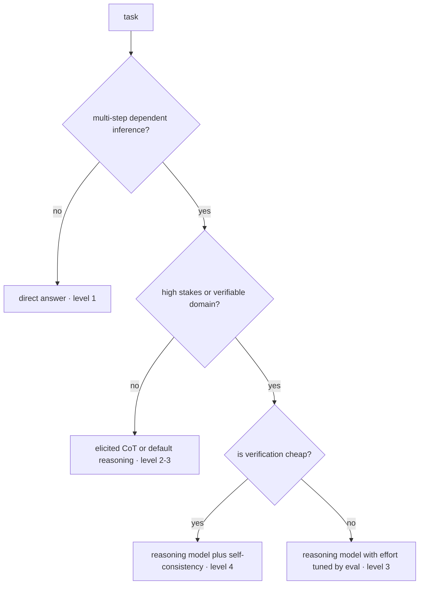
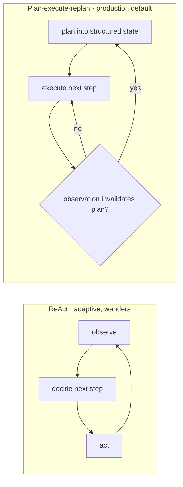

# Reasoning & Planning

An agent that decides its next action badly wastes a step, and steps compound ([agt-01](agt-01-agent-fundamentals.md)). This chapter is about buying better decisions with computation — the resource that, uniquely among the levers in this curriculum, you can turn up at inference time. Chain-of-thought, reasoning models, explicit planning, and search methods are all the same trade in different packaging: **spend more tokens before committing to an answer, get a better answer, pay in latency and money.** What makes it an engineering topic rather than a prompting trick is that the trade has a *curve* — steep on some tasks, flat on others ([fnd-09](../01-foundations/fnd-09-capabilities-and-limits.md)'s jaggedness) — so the real skill is deciding per task how much thinking to buy, and routing accordingly. This chapter is marked `volatile` deliberately: reasoning-model capabilities and their control surfaces move faster than anything else in the agents module, and the durable content is the economics and the planning-as-state discipline, not today's parameter names.

## Intuition: tokens are computation

The mechanism that demystifies all of this comes from [fnd-05](../01-foundations/fnd-05-transformer-architecture.md): **each generated token is one forward pass through the model.** A model that answers immediately has spent one pass' worth of computation on the problem. A model that writes two hundred tokens of working before answering has spent two hundred passes, each conditioned on everything written so far.

So "thinking" is not a metaphor here — it is literally more computation applied to the same question, with the intermediate results written into the context where subsequent computation can use them. The context window becomes a scratchpad, and the model's own output becomes working memory it can condition on. That is why chain-of-thought works at all, and it predicts exactly where it helps: **problems requiring multiple dependent inferences**, where each step's result feeds the next. It also predicts where it doesn't help — a single lookup or a classification decided by surface features gains nothing from a paragraph of preamble, because there was no multi-step computation to spread out.

[fnd-07](../01-foundations/fnd-07-post-training.md) supplied the other half: models trained with RL against verifiable rewards learn to *generate that working themselves*, because doing so measurably raises verified success. That shifts who allocates the computation — from you, via prompting, to the model, via training — which is the single most consequential change in this area and the reason much older CoT advice has quietly expired.

## The spectrum of spending

Four levels, in ascending cost. The engineering task is picking the lowest one that clears your accuracy bar.

**1. Direct answering.** One pass, no preamble. Correct for classification, extraction, lookup, and anything where the answer is a surface transformation of the input. The default, and under-used — teams often add reasoning scaffolds to tasks that never needed them, paying tokens and latency for noise.

**2. Elicited chain-of-thought.** Prompt the model to work through the problem before answering — few-shot exemplars showing worked reasoning,[^wei-cot] or the zero-shot instruction to think step by step.[^kojima-zeroshot] Large documented gains on arithmetic, logic, and multi-hop questions for models that don't reason by default. **The volatile part:** on reasoning-trained models this can be redundant or actively harmful, and provider guidance often advises against hand-written CoT scaffolds because the model has its own, better-trained procedure.[^anthropic-thinking] Check the current guidance for the model you're using rather than applying 2022 advice reflexively.

**3. Reasoning models with effort control.** Models post-trained via verifiable-reward RL that generate extended internal reasoning before answering, typically with an exposed dial for how much.[^deepseek-r1] You are no longer prompting for reasoning; you are *purchasing* it by the token. The accuracy gains on hard, verifiable problems are substantial; the cost is that a request may spend thousands of tokens thinking before its first visible output.

**4. Multi-sample and search.** Spend on *parallel* attempts rather than longer single ones. Self-consistency samples several reasoning paths at moderate temperature and majority-votes the final answers, which reliably improves accuracy where the reasoning is variable but the answer is checkable;[^wang-selfconsistency] tree-of-thoughts explores and prunes a branching space of partial solutions.[^yao-tot] Both multiply cost by the sample or branch count. Self-consistency is genuinely practical for high-value steps; tree search is rarely justified in production, where the branching factor and evaluation cost usually exceed the gain.

*Choosing the level — stakes and verifiability, not task difficulty as it feels to you:*

## The cost curve

Treating thinking as a purchase means measuring what it costs and what it returns.

**What it costs.** Reasoning tokens are output tokens, priced at the higher rate ([fnd-05](../01-foundations/fnd-05-transformer-architecture.md)'s decode economics) and generated sequentially, so they add latency proportionally. A task that previously used 300 output tokens might use 3,000 with extended reasoning — a 10× cost increase on that line and several seconds of added latency before any visible output. In an agent, where every step pays this, the multiplication is over steps as well ([agt-01](agt-01-agent-fundamentals.md)).

**What it returns — unevenly.** The gains concentrate where [fnd-07](../01-foundations/fnd-07-post-training.md) says the training signal was: math, code, structured logic, anything with a verifiable answer. They are far smaller on retrieval-grounded question answering (where the answer is in the context and the task is transformation — [fnd-09](../01-foundations/fnd-09-capabilities-and-limits.md)'s strongest band), on style and tone tasks, and on simple classification. **Paying 10× for a 1% gain on a transformation task is a real and common mistake.**

**Which makes it a routing problem.** The pattern that resolves it, and the one worth building: a cheap classifier or heuristic identifies the subset of traffic that is genuinely hard, and only that subset gets the expensive treatment ([fnd-07](../01-foundations/fnd-07-post-training.md)'s worked example — 15% of traffic routed to reasoning captured nearly all the benefit at a fraction of the cost; [eng-05](../../engineering/eng-05-design-patterns.md) #2's cascade, applied to effort rather than to model size). Effort is a dial, and dials belong in routers.

**Measure the curve on your own tasks.** Run your eval at two or three effort levels and plot accuracy against cost and latency. Teams consistently find the curve flattens earlier than expected — and occasionally that it is flat from the start, which is the most valuable result because it saves a permanent multiplier.

## Planning: make the plan state, not prose

For multi-step agent tasks, explicit planning is a different lever from per-step reasoning, and it fails in a characteristic way that has a clean fix.

**The two styles.** *ReAct-style* interleaving decides one step at a time based on the last observation ([agt-01](agt-01-agent-fundamentals.md)) — maximally adaptive, no commitment, and prone to wandering on long tasks. *Plan-then-execute* generates a plan up front and works through it — coherent and legible, and brittle when reality contradicts the plan. Production agents use a hybrid: plan first, execute, and **replan when an observation invalidates the plan** rather than either following it blindly or abandoning structure entirely.

*The two styles and the hybrid that beats both:*

**The failure that makes this a state problem.** An agent states a plan in step two; by step twelve, that plan sits buried under ten steps of tool output in the middle of a long context, where attention is weakest ([fnd-05](../01-foundations/fnd-05-transformer-architecture.md)'s lost-in-the-middle, [rag-01](../03-retrieval/rag-01-context-engineering.md)). The agent drifts, contradicts its earlier decisions, or redoes completed work — the "changed its mind" symptom from [eng-02](../../engineering/eng-02-agent-loop-architecture.md).

**The fix is not a better prompt.** It is holding the plan as **structured state outside the trajectory** — a typed object listing steps, their status, decisions made, and constraints — re-pinned into the context every turn at a premium position. Prose in history rots; data re-pinned each step does not. This is [rag-01](../03-retrieval/rag-01-context-engineering.md)'s survival contract applied to plans, and it is the single highest-value structural change for long-horizon agents ([agt-04](agt-04-memory-and-state.md) generalizes it to memory).

**Decomposition is planning's cheap cousin.** Splitting a task into independent subtasks up front, executing each in a fresh narrow context, and merging results avoids long-horizon drift entirely by keeping every horizon short. Where subtasks are genuinely independent, this beats both planning styles on reliability and often runs in parallel ([agt-06](agt-06-multi-agent-systems.md)).

## The faithfulness caveat

A caution that governs how much you may trust what you read, sharpening [fnd-07](../01-foundations/fnd-07-post-training.md)'s point.

The visible reasoning trace is **output generated under training incentives, not a readout of internal computation.** It correlates with the model's process — it is the scratchpad the model actually conditions on, so it is far from meaningless — but it is not a faithful log, and a model can reach an answer through influences its stated reasoning doesn't mention.

Three engineering consequences:

- **Don't build logic that trusts the trace as ground truth.** Parsing the reasoning to extract "why" for a downstream decision is building on unverified narrative. If you need a justification you can act on, require it as a *structured output field with evidence quotes* ([api-03](../02-llm-apis/api-03-structured-outputs-tool-calling.md)) rather than mining the free-form trace.
- **Do use traces for debugging.** They are the most informative artifact you have for understanding *what the agent considered*, and reading them is how you find that a step failed because a tool description was ambiguous ([agt-02](agt-02-tool-design.md)) rather than because the model is weak.
- **Don't show raw traces to users as explanation.** They read as authoritative and are not guaranteed accurate — a small honesty problem that becomes a large one in regulated or high-stakes settings ([sec-05](../07-safety-security/sec-05-alignment-for-engineers.md)).

## Production engineering perspective

- **Effort is a per-route configuration**, versioned with prompts and model pins ([eng-04](../../engineering/eng-04-llmops-stack.md)) and gated by evals ([evl-06](../05-evaluation/evl-06-ci-for-llm-apps.md)). Raising it is a cost deploy as much as a quality one.
- **Budget reasoning tokens explicitly.** In an agent they are paid per step, so an unbudgeted effort setting multiplies across the trajectory. Per-task token caps ([agt-01](agt-01-agent-fundamentals.md)) should account for thinking, not just answers.
- **Latency variance rises sharply.** Reasoning length is data-dependent, so p99 can be several times p50 — which may disqualify high effort for interactive paths regardless of accuracy ([prd-04](../06-production/prd-04-reliability.md)).
- **Streaming matters more.** With thousands of thinking tokens before the answer, time-to-first-*visible*-token grows; showing progress ("analyzing…", or the reasoning itself where appropriate) is the difference between a considered pause and an apparent hang ([api-05](../02-llm-apis/api-05-streaming-caching-batch.md)).
- **Route, don't default.** Build the classifier that identifies hard traffic before turning effort up globally; the routing is usually cheaper than the effort it saves ([prd-05](../06-production/prd-05-cost-engineering.md)).

## Historical evolution

**2022:** chain-of-thought prompting demonstrates that eliciting intermediate steps unlocks multi-step reasoning at scale,[^wei-cot] followed by the discovery that a single zero-shot instruction captures much of the benefit.[^kojima-zeroshot] Self-consistency shows sampling several paths and voting improves accuracy further.[^wang-selfconsistency] **2023:** structured search over reasoning states (tree-of-thoughts) explores the ceiling of test-time compute,[^yao-tot] and the field begins treating inference-time computation as a scaling axis in its own right. **2024–2025:** verifiable-reward RL produces models that generate extended reasoning natively, with providers exposing effort controls — which moves the allocation decision from prompt engineering into API configuration and largely obsoletes hand-written CoT scaffolds on those models.[^deepseek-r1][^anthropic-thinking] **2025–present:** the engineering conversation shifts from "how do I elicit reasoning" to "how much should I buy, for which requests" — a routing and economics question. The arc is worth noting: **a prompting technique became a training objective and then a pricing dial**, which is the same absorption pattern [api-03](../02-llm-apis/api-03-structured-outputs-tool-calling.md) and [api-05](../02-llm-apis/api-05-streaming-caching-batch.md) each documented.

## Common misconceptions

- **"Chain-of-thought always helps."** It helps on multi-step dependent inference. On classification, extraction, and grounded transformation it adds tokens and latency for little or nothing — and on reasoning-trained models, hand-written scaffolds can degrade the model's own better procedure.
- **"More thinking is more accuracy."** The curve flattens, often earlier than expected, and is nearly flat on tasks outside verifiable domains. Measure it; don't assume monotone returns worth paying for.
- **"The reasoning trace shows why."** It's output shaped by training incentives — useful evidence and excellent for debugging, but not a faithful log and not something downstream logic should treat as ground truth.
- **"Reasoning models are strictly better."** They're better on hard verifiable problems and worse on cost and latency variance everywhere. Route to them; don't default to them.
- **"Plan-then-execute is more reliable than ReAct."** Both fail in opposite directions — brittleness versus wandering. The production answer is plan, execute, and replan on invalidating observations, with the plan held as state.
- **"The agent forgot its plan; we need a stronger prompt."** The plan rotted mid-context. It needs to be structured state re-pinned each turn, not restated more emphatically.

## Failure modes and trade-offs

- **Overthinking cheap tasks** — a 10× cost multiplier on transformation work that gains 1%. *Fix:* measure the curve per task class; route rather than defaulting.
- **Plan drift** — the agent contradicts or abandons earlier decisions on long tasks. *Fix:* plan as typed state, re-pinned at a premium context position each turn ([agt-04](agt-04-memory-and-state.md)).
- **Brittle plans** — reality contradicts step three and the agent continues through steps four to eight regardless. *Fix:* explicit replanning triggers on invalidating observations.
- **Latency variance breaking SLOs** — median fine, p99 unacceptable because reasoning length is data-dependent. *Fix:* effort caps per route; stream progress; route interactive traffic to lower effort.
- **Trace-dependent logic** — downstream code parsing free-form reasoning for decisions. *Fix:* require structured justification fields with evidence instead.
- **Search-method over-engineering** — tree exploration where a single reasoning pass sufficed. *Trade-off:* the branch count multiplies cost immediately while the gain is task-dependent; self-consistency is the practical middle and tree search rarely earns production cost.

## Best practices

- **Start at direct answering** and add computation only where the eval shows a gain worth its cost.
- **Check current provider guidance before hand-writing CoT** — on reasoning-trained models, manual scaffolds are often redundant or harmful.
- **Measure the accuracy/cost/latency curve at two or three effort levels** on your own tasks, and pick the operating point deliberately.
- **Route effort with a cheap classifier** so only genuinely hard traffic pays; treat effort as versioned per-route config under eval gates.
- **Hold plans as structured state** — steps, statuses, decisions, constraints — re-pinned each turn, with explicit replanning triggers.
- **Prefer decomposition into short independent horizons** where subtasks allow; it avoids drift rather than mitigating it.
- **Use self-consistency for high-value steps where verification is cheap**; reserve tree search for cases you can justify with numbers.
- **Budget reasoning tokens per task**, stream progress, and watch p99 rather than median latency.
- **Read traces for debugging; never build logic on them** — require structured, evidence-anchored justifications instead.

## Real-world examples

**The 10× that bought nothing.** A team enables high reasoning effort globally after seeing benchmark gains. Cost per task rises about 7×, p95 latency triples, and their eval improves by 1.2 points — because the workload is retrieval-grounded question answering, a transformation task where the answer is already in the context ([fnd-09](../01-foundations/fnd-09-capabilities-and-limits.md)'s strongest band, not the band reasoning training targets). Rolled back to standard effort with a router sending only the 12% of queries flagged as multi-hop to high effort: the eval gain is retained almost entirely, and cost returns to within 15% of baseline. **The mistake was global adoption of a per-task dial.**

**The plan that survived compaction.** A coding agent works fifteen-plus steps and repeatedly "forgets" architectural decisions made early — reintroducing a pattern it had explicitly rejected at step three. Prompt strengthening ("remember your earlier decisions") produces no measurable change, which is diagnostic: the information wasn't being *ignored*, it was buried mid-context under a dozen tool outputs. The fix is a typed `plan` object — steps with statuses, plus a `decisions` list with short rationales — maintained by the runtime and re-pinned near the end of the context every turn. Contradiction incidents drop to near zero. **Prose in history rots; data re-pinned each step doesn't.**

**Self-consistency on the 8%.** An extraction pipeline hits 91% on a category involving ambiguous multi-part documents; the rest of the corpus runs at 99%. Rather than raising effort everywhere, the team routes only that category to a five-sample self-consistency pass with majority voting on the extracted fields[^wang-selfconsistency] — and, because the field values are checkable against each other, uses disagreement as an abstention signal that routes to human review. Category accuracy rises to 97%, human review absorbs most of the residue, and total cost rises about 4% because the expensive treatment applies to 8% of volume. **Route the treatment to the traffic that needs it.**

## Interview questions

1. **"Why does chain-of-thought improve accuracy?"** — Model answer: because each generated token is a forward pass, so producing intermediate reasoning literally spends more computation on the problem, with intermediate results written into the context where subsequent computation can condition on them. That mechanism predicts where it helps — multi-step dependent inference like arithmetic, logic, multi-hop questions — and where it doesn't: single lookups, classification, or grounded transformation, where there was no multi-step computation to spread out. It also predicts the modern caveat: reasoning-trained models generate this working themselves, so hand-written scaffolds can be redundant or actively worse than the model's own trained procedure.

2. **"How do you decide how much reasoning to buy?"** — Model answer: by measuring the curve rather than assuming monotone returns. I'd run the eval at two or three effort levels and plot accuracy against cost and p99 latency for my actual tasks. Gains concentrate in verifiable domains — math, code, structured logic — because that's where the RL training signal was, and are much smaller on retrieval-grounded or style tasks. Then rather than picking one global setting, I'd route: a cheap classifier identifies the genuinely hard subset and only that traffic pays. Effort is a dial, and dials belong in routers — global adoption of a per-task dial is the common expensive mistake.

3. **"Your agent forgets decisions it made ten steps ago. Fix it."** — Model answer: this is a state problem, not a prompting problem. The decision was stated in prose that's now buried mid-trajectory where attention is weakest, so restating "remember your earlier decisions" more emphatically doesn't help — I'd expect no measurable change, which is itself diagnostic. The fix is holding the plan and decisions as typed structured state outside the trajectory, maintained by the runtime and re-pinned into a premium context position every turn. Prose in history rots; data re-pinned each step doesn't. If the task decomposes, an even better fix is splitting it into short independent horizons so nothing has to survive that long.

4. **"Plan-then-execute or ReAct?"** — Model answer: hybrid, because they fail in opposite directions. ReAct decides one step at a time from the last observation — maximally adaptive, but it wanders on long tasks with no commitment to hold it together. Plan-then-execute is coherent and legible but brittle: when reality contradicts step three, a rigid agent marches through steps four to eight anyway. Production agents plan into structured state, execute against it, and replan when an observation invalidates the plan. And where subtasks are genuinely independent, decomposition beats both — it keeps every horizon short, which avoids drift rather than mitigating it, and often parallelizes.

5. **"Can you trust the reasoning trace?"** — Model answer: as evidence, yes; as ground truth, no. It's output generated under training incentives rather than a faithful readout of internal computation — the model conditions on it, so it's far from meaningless, but it can reach conclusions through influences the stated reasoning doesn't mention. Practically: read traces for debugging, since they're the best artifact for understanding what the agent considered and often reveal that a step failed because a tool description was ambiguous. But don't build downstream logic that parses free-form reasoning for decisions — require a structured justification field with evidence quotes instead. And don't surface raw traces to users as authoritative explanation, especially in high-stakes settings.

6. **"When is self-consistency worth it?"** — Model answer: when the reasoning path varies but the final answer is checkable, and the task is high-value enough to justify n× cost — so I'd route it to a subset rather than applying it broadly. Sample several paths at moderate temperature and majority-vote the answers; the variance across paths is doing the work, so temperature-zero sampling defeats it. A useful bonus is that disagreement across samples is a free uncertainty signal: cases where the samples split are exactly the ones worth abstaining on or routing to human review. In practice I've seen it applied to a single hard category — a few percent of volume — for a large accuracy gain at a small total cost increase.

7. **"What changes about prompting when you move to a reasoning model?"** — Model answer: you largely stop scaffolding the reasoning. Models post-trained with verifiable-reward RL have their own trained procedure for extended thinking, and hand-written "think step by step" scaffolds are often redundant and sometimes degrade it — provider guidance frequently says so explicitly. What replaces prompt-level scaffolding is configuration: an effort or thinking-budget parameter you set per route. So the work shifts from writing reasoning instructions to specifying the task clearly and deciding how much computation to purchase — plus the operational consequences, since reasoning tokens are output-priced, sequential, and make p99 latency data-dependent.

## Exercises and mini-project

**Exercises**

1. For each, say whether elicited CoT is likely to help and why: (a) classify sentiment; (b) compute a multi-step tax calculation; (c) summarize a retrieved passage; (d) determine which of three policies applies given four conditions.
2. A task uses 200 output tokens at standard effort and 2,400 with reasoning, gaining 4 accuracy points. At your chosen prices, compute the cost per accuracy point and state what would justify it.
3. Design the router that decides effort level for a mixed support workload: what features it uses, what it costs, and how you'd evaluate the router itself.
4. Write the typed `plan` state object for a multi-step research agent: fields, statuses, and what must survive compaction.
5. Your p50 latency is 2s and p99 is 24s after enabling reasoning. Give three interventions and the trade-off each makes.

**Mini-project: measure the thinking curve.** On your [agt-01](agt-01-agent-fundamentals.md) agent and a 20-task eval: (a) run at direct/default effort and record accuracy, tokens, p50/p95 latency, cost; (b) repeat at an elevated effort setting (or with explicit CoT if your model has no dial), and plot the curve; (c) identify which task categories gained and which didn't, and relate that to verifiability; (d) build a cheap router sending only the gaining categories to high effort, and measure blended accuracy and cost; (e) add structured `plan` state to the agent and measure contradiction incidents before/after on the longest tasks; (f) memo: your curve, your routing threshold, and the cost of the naive global setting you avoided. Target: 4 hours. Success criterion: a measured accuracy-versus-cost curve on your own tasks — and a routing decision justified by it.

**Capstone extension:** the effort router and structured plan state become part of your capstone agent's runtime; [agt-04](agt-04-memory-and-state.md) generalizes the state layer, and [agt-09](agt-09-agent-reliability.md) evaluates whether the plan is actually followed.

## Revision summary

- Tokens are computation: each generated token is a forward pass, so "thinking" is literally more compute applied to the same question, with intermediates written where later computation can use them. That predicts CoT's gains (multi-step dependent inference) and its non-gains (classification, lookup, grounded transformation).
- The spectrum: direct answering → elicited CoT (largely superseded on reasoning-trained models; check provider guidance) → reasoning models with effort dials → multi-sample (self-consistency) and search (tree methods, rarely justified).
- The trade has a curve that flattens, with gains concentrated in verifiable domains and costs concentrated in output tokens, sequential latency, and p99 variance — so effort is a per-route dial belonging in a router, not a global default.
- Planning: ReAct wanders, plan-then-execute is brittle; production hybridizes with replanning triggers. The decisive fix for drift is holding the plan as **typed state re-pinned each turn**, not prose in history — and decomposition into short horizons avoids drift entirely where subtasks are independent.
- The visible reasoning trace is trained output, not introspection: excellent for debugging, unsuitable as ground truth for downstream logic or as user-facing explanation.

## Flashcards

| Q | A |
|---|---|
| Why is "thinking" literal rather than metaphorical? | Each generated token is a forward pass, so reasoning tokens are additional computation, conditioned on everything written so far. |
| Where does CoT help and not help? | Helps on multi-step dependent inference; little or nothing on classification, lookup, and grounded transformation. |
| What changed with reasoning models? | Allocation moved from prompting to training and configuration — hand-written CoT scaffolds are often redundant or harmful on them. |
| Where do reasoning gains concentrate? | Verifiable domains (math, code, structured logic) — where the RL training signal was. |
| Why is effort a routing decision? | The curve flattens and is task-dependent, so only genuinely hard traffic should pay the multiplier. |
| Cost profile of reasoning tokens? | Output-priced, generated sequentially — so cost and latency rise together, and p99 becomes data-dependent. |
| Why do agents forget their plans? | The plan is prose buried mid-trajectory where attention is weakest — it rots, and prompting harder doesn't fix it. |
| The fix for plan drift? | Typed plan state (steps, statuses, decisions, constraints) held outside the trajectory and re-pinned each turn. |
| ReAct vs plan-then-execute? | ReAct wanders; plan-then-execute is brittle. Hybrid: plan into state, execute, replan on invalidating observations. |
| What is the reasoning trace, epistemically? | Output shaped by training incentives — good debugging evidence, not a faithful log, and unsafe as ground truth for logic or user explanation. |
| When does self-consistency pay? | Variable reasoning with a checkable answer, on high-value traffic — with sample disagreement as a free abstention signal. |

## Further reading

- **Official docs:** provider extended-thinking / reasoning-effort documentation[^anthropic-thinking] — read the guidance on manual CoT before writing any.
- **Papers:** Wei et al., chain-of-thought (2022)[^wei-cot]; Kojima et al., zero-shot reasoners (2022)[^kojima-zeroshot]; Wang et al., self-consistency (2022)[^wang-selfconsistency]; Yao et al., Tree of Thoughts (2023)[^yao-tot]; DeepSeek-R1 (2025)[^deepseek-r1] for the reasoning-RL mechanism.
- **Books:** none current enough.
- **Talks:** none essential — this area moves through releases.
- **Tutorials:** run your own effort sweep before reading anyone's benchmark; the curve is task-specific and yours is the one that matters.

## Check your understanding

1. Explain the token-as-computation mechanism and use it to predict two tasks where CoT won't help.
2. Your reasoning-enabled system costs 7× more for 1 point of accuracy. Give the diagnosis and the fix.
3. Why is plan drift a state problem rather than a prompting problem? Name the fix and why prompting fails.
4. Give three things you should and should not do with a visible reasoning trace.
5. Design the routing rule for a workload that is 80% grounded Q&A and 20% multi-step analysis.

## Sources

[^wei-cot]: [T2] Wei et al. (2022). "Chain-of-Thought Prompting Elicits Reasoning in Large Language Models." arXiv:2201.11903. https://arxiv.org/abs/2201.11903 (accessed 2026-07-10)
[^kojima-zeroshot]: [T2] Kojima et al. (2022). "Large Language Models are Zero-Shot Reasoners." arXiv:2205.11916. https://arxiv.org/abs/2205.11916 (accessed 2026-07-10)
[^wang-selfconsistency]: [T2] Wang et al. (2022). "Self-Consistency Improves Chain of Thought Reasoning in Language Models." arXiv:2203.11171. https://arxiv.org/abs/2203.11171 (accessed 2026-07-10)
[^yao-tot]: [T2] Yao et al. (2023). "Tree of Thoughts: Deliberate Problem Solving with Large Language Models." arXiv:2305.10601. https://arxiv.org/abs/2305.10601 (accessed 2026-07-10)
[^deepseek-r1]: [T2] DeepSeek-AI (2025). "DeepSeek-R1: Incentivizing Reasoning Capability in LLMs via Reinforcement Learning." arXiv:2501.12948. https://arxiv.org/abs/2501.12948 (accessed 2026-07-10)
[^anthropic-thinking]: [T1] Anthropic. "Extended thinking." https://docs.anthropic.com/en/docs/build-with-claude/extended-thinking (accessed 2026-07-10)
