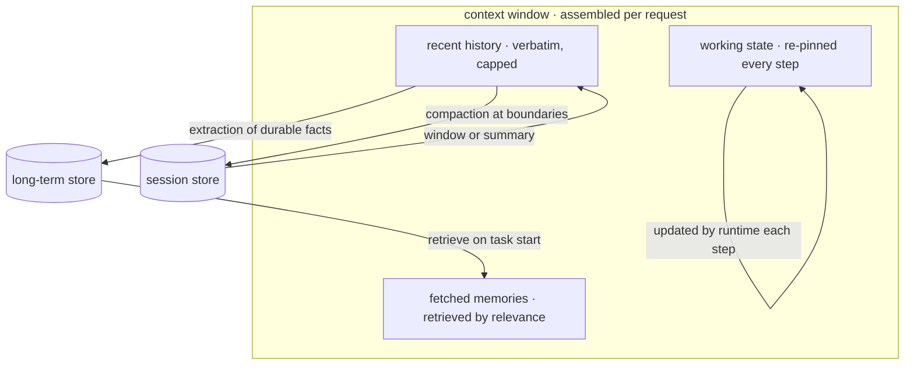
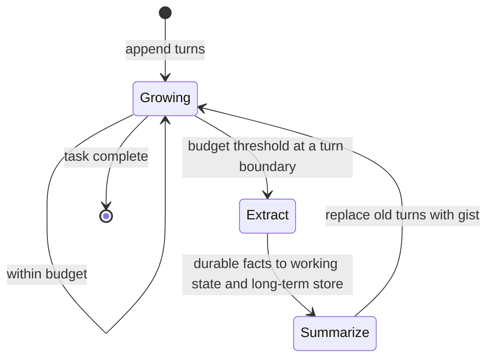

# Agent Memory & State

An agent's trajectory grows every step ([agt-01](agt-01-agent-fundamentals.md)) and the context window does not. Long tasks and returning users therefore force a question that single-turn systems never face: **what does the agent keep, where does it live, and how does it come back?** This chapter answers it with a three-tier hierarchy — working state for the current task, session history for the current conversation, and long-term memory across sessions — each governed by the same principle from [rag-01](../03-retrieval/rag-01-context-engineering.md): the context window is working memory, and everything durable lives *outside* it and is fetched back deliberately. The chapter's central engineering claim is that most agent "forgetting" is not a model limitation but a design choice made by default: **state kept as prose in history rots; state kept as data and re-pinned does not.** The hardest open problem here is not storage or retrieval but the **write policy** — deciding what is worth remembering at all.

## Intuition: memory is retrieval over your own history

The reframe that makes this tractable: an agent's memory system is a retrieval system whose corpus is the agent's own past. Everything from Module 3 applies — chunking decisions, embedding, relevance ranking, freshness, and the observation that stuffing everything into context is neither affordable nor effective.

That framing dissolves the mysticism around "giving agents memory." You are not building cognition; you are building **a store, a write path, and a read path**, with the same questions any retrieval system faces: what granularity to store, what to index on, when to write, when to fetch, and how much to put in the context ([rag-01](../03-retrieval/rag-01-context-engineering.md)'s budget).

It also clarifies the distinction that organizes the rest of the chapter:

- **Context** is transient — what's in the window for this request, assembled fresh each time.
- **Memory** is persistent — what survives outside the window and gets selectively pulled back in.

Confusing the two produces both classic failures: treating context as memory (the agent forgets everything between sessions) and treating memory as context (dumping the entire history into every request, which is expensive and, past a point, actively harmful — [fnd-05](../01-foundations/fnd-05-transformer-architecture.md)'s mid-context degradation[^liu-lost-middle]).

## The three tiers

*The hierarchy — each tier has a different lifetime, a different write path, and a different way of re-entering the context:*

**Tier 1 — working state (this task).** The plan, decisions made, constraints, progress, and any identifiers the agent must not lose ([agt-03](agt-03-reasoning-and-planning.md)). Small, typed, owned by the runtime rather than the model, and **re-pinned into the context every single step** at a premium position. This tier is the fix for the "changed its mind" failure ([eng-02](../../engineering/eng-02-agent-loop-architecture.md)), and it is the highest-value memory work most agents need.

**Tier 2 — session history (this conversation).** The recent turns, kept verbatim within a capped budget, older turns compacted at boundaries. Cache-sensitive: because the trajectory is a growing prefix, keeping it append-only preserves prompt-cache hits, while rewriting it invalidates everything after the edit ([api-05](../02-llm-apis/api-05-streaming-caching-batch.md)). That is the single strongest argument for compacting at deliberate boundaries rather than continuously.

**Tier 3 — long-term memory (across sessions).** User preferences, learned facts, past task outcomes, and durable decisions. Written selectively, retrieved by relevance at task start rather than loaded wholesale. This is where the retrieval framing does the most work — and where the write policy problem lives.

## Compaction and the survival contract

When the growing region hits its budget, something must go. [rag-01](../03-retrieval/rag-01-context-engineering.md) established the ladder — windowing, summarization, structured extraction, externalization — and the rule that governs all of them: **decide what must survive before deciding how to compact.**

The survival contract for an agent, in priority order:

1. **Instructions and constraints** never live in compactable history. They belong in the stable system region, re-sent every request — because a compaction that eats the rule "never issue refunds above $500" is a compliance incident, not a quality regression.
2. **Decisions and commitments** are extracted into working state as typed data before compaction, not left to survive as prose in a summary. "We chose Postgres because of transactional requirements" is a fact with a rationale; a summary may preserve the choice and drop the reason, at which point the agent may revisit it.
3. **Open items and progress** — what's done, what's pending — belong in working state for the same reason.
4. **Everything else** — pleasantries, superseded intermediate reasoning, tool outputs already acted upon — is allowed to fall away, and should.

*Compaction with a contract — extraction happens before summarization, not after:*

The ordering matters: **extract first, then summarize.** A team that summarizes and hopes the summary retained the important parts has delegated its survival contract to a model call, which is exactly the arrangement that produces the "it changed its mind" report.

## Long-term memory mechanics

The tier that is genuinely hard, and where most implementations either over- or under-remember.

**What to store: facts or episodes?** *Episodic* memory stores what happened ("on March 3, the user asked about refund policy and we escalated to a human"); *semantic* memory stores distilled facts ("this user's account is on the enterprise plan; prefers concise answers"). Episodes are faithful and voluminous; facts are compact and lossy. Production systems generally want **facts for retrieval and episodes for audit** — store both, index the facts.

**How to retrieve.** Embed and search the memory store at task start, retrieving what's relevant to the current request rather than loading everything ([rag-05](../03-retrieval/rag-05-rag-pipeline.md)'s pipeline pointed inward). Recency and importance are useful ranking signals alongside similarity — the generative-agents work combined recency, importance, and relevance into a retrieval score, which remains a sensible default shape.[^park-generative-agents]

**The write policy — the actual hard problem.** Deciding *what is worth remembering* has no clean answer, and both failure directions are real:

- **Over-remembering** fills the store with trivia, degrading retrieval precision (now you have a retrieval-quality problem over your own memory) and surfacing stale or superseded facts.
- **Under-remembering** loses the preferences and decisions that made memory worth building.

Practical policies that work better than "remember everything": write on **explicit signals** (the user states a preference, a decision is made, a task completes with an outcome), write **structured facts rather than raw text** so they can be updated and deduplicated, and give memories **provenance and timestamps** so conflicts can be resolved by recency and the source can be audited. Superseding matters as much as writing: a user who changes their mind should not have both preferences in the store with no ordering.

**Memory is retrieval, so memory has retrieval's failure modes.** Stale facts, precision loss as the store grows, and confidently-wrong grounding in a retrieved memory that no longer applies ([rag-05](../03-retrieval/rag-05-rag-pipeline.md)'s dangerous failure, now sourced from your own history). Instrument accordingly.

## State as data, not prose

The chapter's structural claim, stated on its own because it is the difference between agents that hold together over long horizons and agents that don't.

**Prose in history rots.** Anything the agent said in turn three is subject to compaction, to mid-context inattention,[^liu-lost-middle] and to being contradicted by later text with equal claim on the model's attention. There is no mechanism keeping it authoritative.

**Typed state re-pinned each turn does not rot.** A `state` object — plan with statuses, decisions with rationales, constraints, entities in play — rendered into the context at a premium position on every request is *always* present, always current, and always in a position the model attends to. It is also inspectable by your code, testable, and loggable ([evl-04](../05-evaluation/evl-04-tracing-observability.md)), which prose in a transcript is not.

The runtime owns this object: it updates statuses when tools succeed, records decisions when the model commits to one, and renders it deterministically. The model reads it and proposes updates; **the runtime writes it** — the same model-plans/runtime-acts division that governs everything else in the agents module ([agt-01](agt-01-agent-fundamentals.md)).

## Multi-agent state

A preview of [agt-06](agt-06-multi-agent-systems.md)'s hardest problem, because it is fundamentally a state question.

When work is split across agents, memory splits with it, and there are two arrangements. **Shared state** — all agents read and write one store — keeps everyone consistent and reintroduces the coordination problems of shared mutable state, including write conflicts and the context bloat that made splitting attractive in the first place. **Isolated state** — each subagent gets a fresh, narrow context — is the main *reason* to use subagents (context isolation) and creates the **handoff problem**: whatever the subagent learned exists only in its context, and what it returns to the coordinator is a lossy summary.

The practical rule: **make handoffs explicit and typed.** A subagent returns a structured result — findings, sources, confidence, open questions — not a prose paragraph the coordinator must re-interpret. Every handoff is a lossy compression, so design what crosses the boundary rather than letting a summary decide.

## Production engineering perspective

- **Budget each tier explicitly** in the context ([rag-01](../03-retrieval/rag-01-context-engineering.md)'s region table): working state small and always present, recent history capped, fetched memories capped. Uncapped growth in any tier is a cost and quality regression waiting to happen.
- **Compact at boundaries, not continuously.** Every compaction invalidates the prompt cache from that point forward ([api-05](../02-llm-apis/api-05-streaming-caching-batch.md)), so doing it per turn is expensive; doing it at turn boundaries when a threshold is crossed is not.
- **Memory stores need the [rag-03](../03-retrieval/rag-03-vector-databases.md) treatment**: versioned embeddings, deletion propagation, and access control. A user's memories are personal data with retention and erasure obligations ([sec-03](../07-safety-security/sec-03-privacy-compliance.md)) — and cross-user memory leakage is a serious incident class, so tenancy isolation is mandatory, not optional.
- **Log state transitions**, not just messages. "Which step changed the plan, and why" is the question you'll ask during debugging, and only a state-transition log answers it ([evl-04](../05-evaluation/evl-04-tracing-observability.md)).
- **Test memory explicitly.** Cross-session recall, correct superseding of changed preferences, and *not* recalling another user's data belong in the eval suite ([evl-02](../05-evaluation/evl-02-eval-datasets.md)) — memory bugs are invisible in single-turn evals by construction.

## Historical evolution

**2023 (early):** context windows are small and "memory" means naive conversation buffers plus summarization — the ceiling is obvious and the failure (forgetting mid-conversation) is universal. **2023:** generative-agents work demonstrates a structured memory architecture — an episodic stream with retrieval scored by recency, importance, and relevance, plus periodic reflection that distills episodes into higher-level facts — establishing the shape most systems still use.[^park-generative-agents] MemGPT frames the problem as virtual memory: page information between a limited context and external storage under the model's own control.[^packer-memgpt] **2024:** long-context models reduce the *pressure* for memory within a session without removing it across sessions, and the field's attention moves from "how do we fit more" to "what should we keep" — the write policy. Practitioner guidance converges on structured state plus retrieval over history.[^anthropic-context-eng] **2024–present:** memory becomes a product feature (assistants that remember preferences), which surfaces the governance issues — user visibility into what's stored, correction, and deletion — as first-class requirements rather than afterthoughts.

## Common misconceptions

- **"Bigger context windows solve memory."** They reduce within-session pressure and do nothing for across-session persistence, cost, or mid-context degradation. Memory is about what persists and what returns, not about capacity.
- **"Summarize the history and you've handled memory."** Summarization is one rung of the ladder and the lossiest. Without extraction of decisions and constraints *before* summarizing, the survival contract is delegated to a model call.
- **"The agent forgot; use a stronger prompt."** If the information was buried in a long trajectory or compacted away, prompting harder can't recover it. That's a state-architecture problem.
- **"Remember everything; storage is cheap."** Storage is cheap and *retrieval precision* is not. An over-full memory store surfaces stale and irrelevant facts, which is a quality problem masquerading as a completeness win.
- **"Memory is a model capability."** It's a store, a write path, and a read path that you build. The model reads what you fetch and proposes what to write; the runtime decides.
- **"Shared state is simpler for multi-agent."** It reintroduces the context bloat and coordination problems that motivated splitting. Isolation with explicit typed handoffs is usually the better trade.

## Failure modes and trade-offs

- **Plan/decision rot** — commitments made early are contradicted later. *Fix:* typed working state re-pinned every turn ([agt-03](agt-03-reasoning-and-planning.md)).
- **Compaction amnesia** — a summary dropped the constraint that mattered. *Fix:* extract durable facts into state *before* summarizing; keep instructions out of compactable history entirely.
- **Memory rot** — stale preferences and superseded facts retrieved as current. *Fix:* timestamps, provenance, explicit superseding, and recency in the retrieval score.
- **Retrieval precision collapse** — the store grew and now surfaces irrelevant memories. *Fix:* selective write policy, structured facts over raw episodes for the indexed tier, and periodic consolidation.
- **Cross-tenant leakage** — one user's memories retrieved for another. *Fix:* tenancy as a partition (a namespace per user), not a filter — [rag-02](../03-retrieval/rag-02-vector-search.md)'s post-filter starvation lesson has a security twin here.
- **Cache thrash** — per-turn compaction invalidating the prompt cache constantly. *Trade-off:* compaction frequency against context quality; boundary-triggered compaction is the usual resolution.

## Best practices

- **Separate context from memory explicitly** in your design, and budget each tier in the assembled context.
- **Keep instructions and constraints out of compactable history** — stable region, every request.
- **Hold plan, decisions, constraints, and progress as typed working state**, updated by the runtime and re-pinned each turn.
- **Extract before you summarize**, and write the survival contract down before choosing a compaction strategy.
- **Compact at turn boundaries on a budget threshold**, not continuously, to preserve prompt caching.
- **Write long-term memory on explicit signals** (stated preferences, decisions, task outcomes) as structured facts with timestamps and provenance; support superseding.
- **Retrieve memory by relevance plus recency at task start**; cap what enters the context.
- **Partition memory per user/tenant**; treat it as personal data with retention, correction, and deletion obligations.
- **Test memory in the eval suite** — cross-session recall, superseding, and non-leakage.

## Real-world examples

**The constraint that got summarized away.** A procurement agent is told in turn two that purchases above $10,000 require VP approval. Fifteen turns later, after two compactions, it drafts an approval-free purchase order for $14,000. The summary had preserved the *topic* ("discussed approval thresholds") and lost the *number*. The fix is architectural rather than prompt-level: constraints move into the stable system region where compaction never touches them, and a typed `constraints` list in working state is re-pinned every turn. The general lesson is that summarization is lossy in exactly the way that matters most — **it preserves gist and drops specifics, and specifics are what constraints are.**

**Memory that made answers worse.** An assistant with long-term memory writes a fact after every session. Within two months the store holds thousands of entries per active user — including contradictions, one-off context ("user is traveling this week"), and superseded preferences. Retrieval now surfaces stale facts, and the assistant starts confidently applying a preference the user changed months earlier. The fix has three parts: a write policy limited to explicit signals, timestamps plus explicit superseding so the newest fact wins, and a consolidation pass that merges and prunes. Store size drops by roughly 90% and answer quality rises — **memory quality is retrieval quality, and precision beats recall here too.**

**The handoff that lost the reasoning.** A research agent delegates to subagents that each investigate one sub-question, then returns findings to a coordinator. The coordinator's syntheses are shallow and occasionally contradict the subagents' own conclusions, because each subagent returned a prose paragraph and the coordinator re-interpreted it without access to what the subagent actually found. The fix is a typed handoff schema: findings, supporting sources with IDs, a confidence value, and explicit open questions. Synthesis quality improves markedly with no change to any agent's prompt — **every handoff is a lossy compression, and designing what crosses the boundary beats letting a summary decide.**

## Interview questions

1. **"How do you give an agent memory?"** — Model answer: build a store, a write path, and a read path — memory is retrieval over the agent's own history, not a model capability. I'd structure it in three tiers: typed working state for the current task (plan, decisions, constraints, progress) re-pinned into context every step; session history kept verbatim within a cap and compacted at boundaries; and long-term cross-session memory written selectively as structured facts and retrieved by relevance plus recency at task start. The key distinction is context versus memory — context is transient and assembled per request, memory persists outside and returns selectively.

2. **"Why does an agent 'forget' its plan, and how do you fix it?"** — Model answer: because the plan was prose stated early in the trajectory, and it's now buried mid-context where attention is weakest, subject to compaction, and contradicted by later text with equal claim on attention. Nothing keeps it authoritative. Prompting harder doesn't work — if the information was compacted away it's simply gone, and if it's buried, restating "remember your plan" doesn't change where it sits. The fix is architectural: hold the plan as a typed state object owned by the runtime, updated as steps complete, and re-pinned into a premium context position every turn. Prose in history rots; data re-pinned doesn't.

3. **"What is a survival contract and why does the order matter?"** — Model answer: it's the explicit list of what must outlive compaction, written before you choose a compaction strategy. Priority order: instructions and constraints never live in compactable history at all — they belong in the stable system region; decisions and commitments get extracted into typed state; open items and progress likewise; everything else may fall away. The ordering matters because you must **extract before you summarize** — teams that summarize and hope the summary kept the important parts have delegated their survival contract to a model call, which is exactly how a $10,000 approval threshold becomes "discussed approval thresholds."

4. **"What's the hard part of long-term memory?"** — Model answer: the write policy — deciding what's worth remembering. Over-remembering fills the store with trivia and contradictions, which degrades retrieval precision and surfaces stale facts, so you've converted a memory feature into a retrieval-quality problem. Under-remembering loses the preferences and decisions that justified building it. What works better than "remember everything": write on explicit signals like stated preferences, decisions, and task outcomes; store structured facts rather than raw text so they can be deduplicated and updated; attach timestamps and provenance; and support explicit superseding so a changed preference replaces rather than coexists with the old one.

5. **"How does compaction interact with cost?"** — Model answer: through prompt caching. The trajectory is a growing prefix, so as long as it's append-only, cached tokens cover everything before the newest turn — which is what makes multi-step agents affordable at all. Any compaction rewrites that prefix and invalidates the cache from the edit point onward, so compacting every turn means paying full prefill repeatedly. The resolution is boundary-triggered compaction: let the trajectory grow append-only, and compact only when a budget threshold is crossed, at a turn boundary. That's a deliberate trade of occasional cache invalidation against continuous context bloat.

6. **"What changes about memory in a multi-agent system?"** — Model answer: it becomes a state-sharing problem, with two arrangements and a real trade. Shared state keeps agents consistent but reintroduces coordination problems and the context bloat that motivated splitting in the first place. Isolated state gives each subagent a clean narrow context — which is usually the main reason to use subagents — but creates the handoff problem: what the subagent learned exists only in its context, and what it returns is a lossy compression. The practical rule is to make handoffs explicit and typed — findings, sources with IDs, confidence, open questions — rather than a prose paragraph the coordinator must re-interpret.

7. **"What governance applies to agent memory?"** — Model answer: it's personal data, so all of it. Partition per user or tenant as a namespace rather than a filter, because cross-user memory retrieval is a serious incident class and post-filtering is the wrong mechanism. Support retention limits, user visibility into what's stored, correction, and deletion — a right-to-erasure request has to reach the memory store, its embeddings, and any caches. Attach provenance so a surfaced fact can be traced to when and how it was learned. And test non-leakage explicitly in the eval suite, since single-turn evals are structurally incapable of catching memory bugs.

## Exercises and mini-project

**Exercises**

1. Design the typed working-state object for a travel-booking agent: fields, statuses, and what the runtime updates versus what the model proposes.
2. Write the survival contract for a 40-turn technical support session — four categories with an example of each.
3. Your memory store has 4,000 entries per user and retrieval precision is falling. Give three interventions in order of expected yield.
4. Design the handoff schema for a subagent that researches one sub-question, and say what each field prevents losing.
5. List five eval cases that test memory specifically and would pass trivially in a single-turn suite.

**Mini-project: give the agent memory.** On your [agt-01](agt-01-agent-fundamentals.md) agent: (a) implement typed working state (plan, decisions, constraints, progress) owned by the runtime and re-pinned each turn; (b) add session history with a token cap and boundary-triggered compaction that **extracts before summarizing**; (c) add a long-term store with a write policy limited to explicit signals, storing structured facts with timestamps and provenance, retrieved by relevance plus recency at task start; (d) partition by user and verify non-leakage; (e) test three behaviors — cross-session recall, correct superseding of a changed preference, and constraint survival across two compactions; (f) measure prompt-cache hit rate before and after your compaction policy. Target: 4 hours. Success criterion: a constraint stated in turn one that still binds in turn thirty, and a measured cache-hit impact from your compaction choice.

**Capstone extension:** this state layer is what makes the capstone agent viable over long tasks; [agt-06](agt-06-multi-agent-systems.md) tests whether its handoffs survive delegation, and [agt-09](agt-09-agent-reliability.md) evaluates whether decisions actually persist.

## Revision summary

- Memory is retrieval over the agent's own history: a store, a write path, and a read path — with context (transient, assembled per request) strictly distinguished from memory (persistent, fetched selectively).
- Three tiers: typed **working state** re-pinned every step (the highest-value fix for long-horizon drift), **session history** capped and compacted at boundaries, **long-term memory** written selectively and retrieved by relevance plus recency.
- The survival contract precedes the compaction strategy: instructions and constraints never live in compactable history; decisions, commitments, and progress are **extracted into typed state before summarizing**; the rest may fall away.
- **Prose in history rots; typed state re-pinned each turn does not** — and the runtime owns the state object while the model proposes updates.
- Long-term memory's hard problem is the write policy: over-remembering destroys retrieval precision, under-remembering defeats the purpose. Write on explicit signals, as structured facts with timestamps, provenance, and explicit superseding.
- Multi-agent memory is a state-sharing trade: shared (consistent, bloated, contended) versus isolated (clean contexts, lossy handoffs) — resolved by typed, explicit handoff schemas.

## Flashcards

| Q | A |
|---|---|
| What is agent memory, structurally? | Retrieval over the agent's own history — a store, a write path, and a read path that you build. |
| Context versus memory? | Context is transient and assembled per request; memory persists outside the window and is fetched back selectively. |
| The three tiers? | Working state (this task, re-pinned every step), session history (capped, compacted at boundaries), long-term memory (cross-session, retrieved by relevance). |
| Why does prose in history rot? | It's subject to compaction, mid-context inattention, and contradiction by later text — nothing keeps it authoritative. |
| The survival contract's first rule? | Instructions and constraints never live in compactable history — they belong in the stable system region. |
| Why extract before summarizing? | Summaries preserve gist and drop specifics; extracting decisions and constraints first stops a model call from owning your survival contract. |
| Why compact at boundaries rather than continuously? | Compaction rewrites the prefix and invalidates the prompt cache from that point; boundary-triggered compaction preserves caching. |
| The hard problem in long-term memory? | The write policy — over-remembering wrecks retrieval precision, under-remembering defeats the feature. |
| What makes a memory store safe? | Per-user/tenant partitioning (namespace, not filter), timestamps and provenance, superseding, retention and deletion support. |
| The multi-agent memory trade? | Shared state (consistent but bloated and contended) versus isolated state (clean contexts but lossy handoffs) — fix with typed handoff schemas. |
| Why must memory be tested explicitly? | Cross-session recall, superseding, and non-leakage are invisible to single-turn evals by construction. |

## Further reading

- **Official docs:** none authoritative here; provider guidance on context management is the closest.
- **Papers:** Park et al., Generative Agents (2023)[^park-generative-agents] — the recency/importance/relevance retrieval score and reflection mechanism; Packer et al., MemGPT (2023)[^packer-memgpt] — memory as virtual-memory paging; Liu et al., "Lost in the Middle" (2023)[^liu-lost-middle] for why placement of re-pinned state matters.
- **Books:** none current enough.
- **Talks:** none essential.
- **Tutorials:** Anthropic's context-engineering post[^anthropic-context-eng] — the practitioner treatment of state and compaction for agents.

## Check your understanding

1. Explain why memory is a retrieval problem, and name the three questions that framing forces you to answer.
2. Give the survival contract's four priority levels and an example of something at each.
3. Why does typed working state fix plan drift when prompting doesn't? Name both mechanisms it defeats.
4. Design the write policy for an assistant that remembers user preferences, including how a changed preference is handled.
5. Your compaction runs every turn and costs are high. Explain the mechanism and the fix.

## Sources

[^park-generative-agents]: [T2] Park et al. (2023). "Generative Agents: Interactive Simulacra of Human Behavior." arXiv:2304.03442. https://arxiv.org/abs/2304.03442 (accessed 2026-07-10)
[^packer-memgpt]: [T2] Packer et al. (2023). "MemGPT: Towards LLMs as Operating Systems." arXiv:2310.08560. https://arxiv.org/abs/2310.08560 (accessed 2026-07-10)
[^liu-lost-middle]: [T2] Liu et al. (2023). "Lost in the Middle: How Language Models Use Long Contexts." arXiv:2307.03172. https://arxiv.org/abs/2307.03172 (accessed 2026-07-10)
[^anthropic-context-eng]: [T4] Anthropic (2025). "Effective context engineering for AI agents." Anthropic Engineering. https://www.anthropic.com/engineering/effective-context-engineering-for-ai-agents (accessed 2026-07-10)
