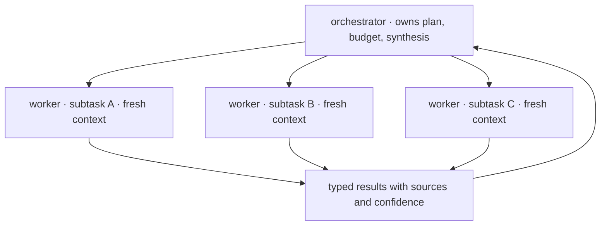
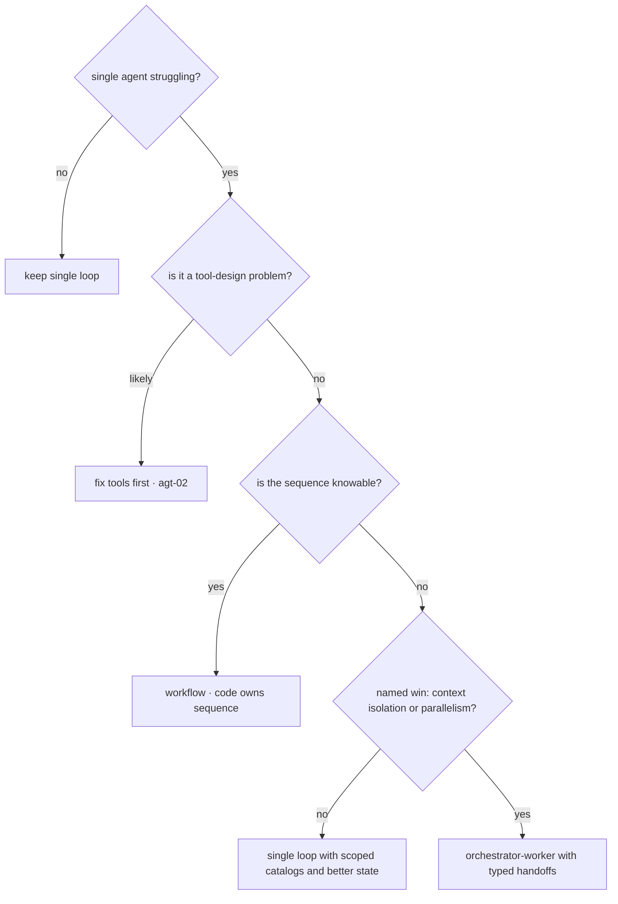

# Multi-Agent Systems

Multi-agent architectures are the most over-adopted pattern in this curriculum. They are intuitive — decompose work, assign specialists, coordinate — and that intuition comes from human organizations, where the constraint being solved is that people cannot be in two places at once and cannot hold everything in their heads. Only one of those constraints transfers. This chapter is therefore structured around a burden of proof: **a topology must justify itself with a named, measured win**, because coordination is a tax paid in lossy handoffs, multiplied tokens, compounded errors, and debugging difficulty. The two justifications that hold up are **context isolation** and **parallelism**; "specialization" is weaker than it sounds, and "it mirrors how a team works" is not an argument. When the burden is met, the orchestrator-worker pattern carries almost all real systems — and much of what teams call multi-agent is better built as a workflow ([agt-01](agt-01-agent-fundamentals.md)) or a single loop with better tools ([agt-02](agt-02-tool-design.md)).

## Intuition: the ladder, and where the rungs are

[eng-02](../../engineering/eng-02-agent-loop-architecture.md) laid out an escalation ladder; this chapter is the rung-by-rung reasoning.

1. **Single loop with good tools.** Most tasks. If the agent is struggling, the first hypothesis is tool design, not architecture ([agt-02](agt-02-tool-design.md)).
2. **Workflow.** The sequence is knowable, so code owns it and each step is a narrow LLM call — cheaper, faster, testable ([agt-01](agt-01-agent-fundamentals.md)).
3. **Subagents under an orchestrator.** A coordinator delegates bounded subtasks to workers with fresh contexts. This is where genuine multi-agent value lives.
4. **Peer topologies** — debate, swarms, negotiating agents. Intellectually interesting; rarely production-justified.

The reason to climb slowly is that **each rung adds a failure surface that the rung below doesn't have**. A single loop can fail at a step; a multi-agent system can additionally fail at a handoff, deadlock on coordination, duplicate work, or produce a synthesis that contradicts its own workers' findings — failure modes that don't exist until you add the topology.

The human-organization analogy is worth explicitly discarding here. Teams exist because humans have hard parallelism limits and cannot share memory. Agents *can* be parallelized cheaply, but they also cannot share memory across contexts, which means every organizational structure you copy brings the coordination cost without the constraint that justified it. **Copy the structure only when you've identified which constraint it's solving.**

## When multi-agent genuinely pays

Three candidate justifications, in decreasing strength.

**Context isolation — the strongest and most under-appreciated.** A single agent researching six topics accumulates all six topics' intermediate findings in one context: tokens multiply, and mid-context material gets attended to poorly ([fnd-05](../01-foundations/fnd-05-transformer-architecture.md), [rag-01](../03-retrieval/rag-01-context-engineering.md)). Six subagents each investigate one topic in a *clean* context, and the orchestrator receives six compact results. Each worker operates in the short-horizon regime where agents are reliable ([agt-01](agt-01-agent-fundamentals.md)'s compounding), and the orchestrator's context stays small.

This is the mechanism behind the reported gains in production multi-agent systems — and the same source is candid that the cost is substantial: multi-agent architectures consume dramatically more tokens than single-agent equivalents, because each worker re-establishes context and the orchestrator pays for coordination on top.[^anthropic-multiagent] **The win is real, and it is expensive.**

**Parallelism.** Independent subtasks run concurrently, so wall-clock time approaches the slowest subtask rather than the sum. For a research task with six independent lookups, that is a genuine order-of-magnitude latency improvement that no single-agent design can match. The requirement is *genuine independence* — subtasks whose results feed each other must run sequentially anyway, at which point parallelism buys nothing and you've paid coordination for a pipeline.

**Specialization — weaker than it appears.** The argument is that a "SQL expert agent" with focused prompts and tools outperforms a generalist. Sometimes true, but usually achievable *without* separate agents: route to different prompts and tool subsets within one loop ([agt-02](agt-02-tool-design.md)'s route-scoped catalogs), which captures the focus without paying handoff costs. Treat specialization as a reason to scope catalogs, and only as a reason for separate agents when it comes with isolation or parallelism.

## The patterns

**Orchestrator-worker (the workhorse).** A coordinator decomposes the task, dispatches bounded subtasks to workers with fresh contexts and narrow tool sets, collects typed results, and synthesizes. It is the pattern behind essentially every production multi-agent system worth studying, because it is the one that actually delivers isolation and parallelism while keeping control centralized — the orchestrator remains a single place to enforce budgets, gates, and termination ([eng-02](../../engineering/eng-02-agent-loop-architecture.md)).

*Orchestrator-worker — control stays centralized, contexts stay isolated:*

**Pipeline.** Agents in a fixed sequence, each transforming the previous one's output. Ask the [agt-01](agt-01-agent-fundamentals.md) question first: if the sequence is fixed, this is a **workflow**, and building it as autonomous agents adds cost and non-determinism for nothing. Pipelines are legitimate only when each stage genuinely needs open-ended agency.

**Peer topologies — debate, critique, swarm.** Multiple agents argue, critique, or self-organize. There is real research interest and occasional real value — a separate critic agent reviewing a worker's output is a cheap, effective pattern, essentially LLM-as-judge ([evl-03](../05-evaluation/evl-03-llm-as-judge.md)) inside the loop. But free-form peer negotiation multiplies cost and non-determinism while being hard to bound or debug, and production justification is rare.[^wu-autogen] **The critic pattern is the one worth borrowing** from this family; the rest deserve skepticism.

## The coordination tax

What you pay, itemized — because these costs are what the burden of proof is weighed against.

**Handoff information loss.** This is the fundamental one, and it is [agt-04](agt-04-memory-and-state.md)'s state problem across a process boundary. A worker builds understanding in its context and returns a summary; everything not in that summary is gone. The orchestrator synthesizes from lossy compressions and cannot ask follow-up questions of a context that no longer exists. **Every handoff is a compression you designed by accident unless you designed it on purpose** — which is why typed handoff schemas (findings, sources with IDs, confidence, open questions) matter more here than anywhere else.

**Token multiplication.** Each worker re-establishes context (system prompt, tools, subtask framing); the orchestrator pays for planning, all returned results, and synthesis. Published production experience puts multi-agent token consumption dramatically above single-agent for the same work.[^anthropic-multiagent] Budget in multiples, not percentages.

**Error compounding across a second dimension.** [agt-01](agt-01-agent-fundamentals.md)'s $p^n$ applies within each worker; then the orchestrator's synthesis can fail on top, and a wrong worker result contaminates it in ways that are hard to detect — the orchestrator has no way to know a worker's confident summary was wrong.

**Debugging difficulty.** When a multi-agent system produces a bad answer, the question "which agent went wrong" requires trajectories for every agent plus the handoff payloads between them ([evl-04](../05-evaluation/evl-04-tracing-observability.md)). Without per-agent tracing this is near-impossible, and the cost of *building* that observability is part of the tax.

**Duplicated and conflicting work.** Without careful decomposition, workers overlap — two agents researching the same subtopic — or return contradictory findings the orchestrator must reconcile with no basis for choosing.

## The decision framework

*Burden of proof: the topology must name its win:*

The questions to answer before adopting a topology, in order:

1. **Have you fixed the tools?** Most "the agent can't handle this" reports resolve at [agt-02](agt-02-tool-design.md).
2. **Is the sequence knowable?** Then it's a workflow, and agency is waste.
3. **What specifically does the topology buy — isolation or parallelism?** If neither, scoped catalogs and better state ([agt-04](agt-04-memory-and-state.md)) get you the benefit without the tax.
4. **Can you afford the token multiple and build per-agent tracing?** If not, the architecture will be un-debuggable at exactly the moment you need to debug it.

And the design rules once you've decided: **keep control centralized** in the orchestrator (budgets, gates, termination in one place); **make handoffs typed** rather than prose; **give workers narrow tool catalogs** and short horizons; **cap the topology** — a fixed set of worker types beats dynamic agent spawning, which is unboundable by construction.

## Production engineering perspective

- **Budgets are global, not per-agent.** A per-worker step cap with no aggregate ceiling means N workers can each behave reasonably while the task cost is unbounded. The orchestrator owns a task-level budget ([eng-02](../../engineering/eng-02-agent-loop-architecture.md)).
- **Trace every agent with a shared task ID** and log handoff payloads explicitly ([evl-04](../05-evaluation/evl-04-tracing-observability.md)) — the handoff is where attribution lives.
- **Parallelize only genuinely independent subtasks**, and set per-worker timeouts so one slow worker doesn't hold the whole task; decide up front whether partial results are usable ([prd-04](../06-production/prd-04-reliability.md)).
- **Evaluate at both levels** ([agt-09](agt-09-agent-reliability.md)): worker-level subtask quality and orchestrator-level synthesis quality. An end-to-end score can't tell you which failed.
- **Prompt-cache the worker preamble.** Workers share system prompts and tool schemas, so the stable prefix is highly cacheable — one of the few levers that meaningfully offsets token multiplication ([api-05](../02-llm-apis/api-05-streaming-caching-batch.md)).
- **Cap concurrency** against provider rate limits; a fan-out of twenty workers is twenty simultaneous requests against a shared quota ([api-01](../02-llm-apis/api-01-llm-api-fundamentals.md)).

## Historical evolution

**2023:** autonomous multi-agent frameworks capture enormous attention — agents assigned roles, conversing to solve tasks[^wu-autogen] — and demos are compelling while production results are poor: unbounded cost, non-termination, and outputs that don't survive scrutiny. **2023–2024:** the field corrects. Practitioner guidance converges on starting with a single loop and adding orchestration only on measured need, with the observation that many multi-agent problems are tool-design problems.[^anthropic-agents] Surveys map the space and its coordination costs.[^wang-agent-survey] **2024:** production multi-agent systems ship in narrow domains — research and information-gathering tasks where subtasks are genuinely independent — with published engineering accounts that are unusually candid about the token multiples involved.[^anthropic-multiagent] **2024–present:** the pattern that survived is orchestrator-worker with typed handoffs and centralized control; free-form peer negotiation remains largely a research topic. The lesson mirrors [agt-01](agt-01-agent-fundamentals.md)'s: **the field got value from multi-agent architectures once it stopped maximizing agent autonomy and started bounding it.**

## Common misconceptions

- **"Multi-agent is the natural next step after single-agent."** It's a different trade, not a progression. Most systems should stay single-loop with good tools and state; the next step after a struggling agent is usually [agt-02](agt-02-tool-design.md).
- **"Specialized agents outperform generalists."** Often the specialization is achievable by routing to scoped prompts and tool subsets inside one loop — capturing the focus without paying handoffs.
- **"It mirrors how human teams work."** Human org structure solves human constraints (no parallelism, no shared memory). Agents have different constraints; copying the structure imports coordination cost without the justifying limitation.
- **"More agents means more capability."** More agents means more handoffs, more tokens, more failure modes, and harder debugging. Capability comes from tools, state, and context quality.
- **"Debate improves accuracy."** Sometimes, at multiplied cost and non-determinism. The narrow version worth borrowing is a *critic* reviewing output — cheap, bounded, and essentially LLM-as-judge inside the loop.
- **"Dynamic agent spawning is more flexible."** It's unbounded by construction — cost and termination become unanalyzable. Fixed worker types with a global budget are what production looks like.

## Failure modes and trade-offs

- **Handoff loss** — the orchestrator synthesizes from summaries that dropped what mattered, and cannot query the vanished context. *Fix:* typed handoff schemas with findings, source IDs, confidence, and open questions.
- **Unbounded cost** — per-worker budgets with no aggregate ceiling. *Fix:* task-level budget owned by the orchestrator.
- **Contradictory findings** — two workers return incompatible results and the orchestrator has no basis to choose. *Fix:* require sources in handoffs so conflicts are adjudicable; decompose to reduce overlap.
- **Silent worker failure** — a worker returns a confident but wrong summary; nothing downstream can detect it. *Fix:* worker-level evals, confidence in the handoff schema, and orchestrator-side verification for high-stakes findings.
- **Un-debuggable systems** — no per-agent traces, so failures can't be attributed. *Fix:* build the tracing before the topology, not after.
- **The central trade-off:** context isolation and parallelism versus coordination cost. Both sides are real; the burden of proof sits on the topology because the costs are certain while the benefits are conditional.

## Best practices

- **Default to a single loop.** Escalate only after fixing tools, ruling out a workflow, and naming the specific win.
- **Adopt orchestrator-worker** when you escalate — centralized control, fresh worker contexts, narrow worker catalogs, short worker horizons.
- **Design typed handoffs**: findings, sources with IDs, confidence, open questions — never a prose paragraph the orchestrator must re-interpret.
- **Own a task-level budget** in the orchestrator, plus per-worker timeouts and a decision about partial results.
- **Fix the worker types**; avoid dynamic spawning.
- **Trace every agent under one task ID and log handoff payloads**; build this before you need it.
- **Evaluate workers and synthesis separately.**
- **Cache the shared worker preamble** and cap concurrency against rate limits.
- **Borrow the critic pattern** where output quality matters; skip free-form debate.

## Real-world examples

**The research system where isolation paid.** A team builds a research assistant that must investigate several independent sub-questions per query. The single-agent version accumulates all sub-questions' findings in one context: by the fourth topic the context is enormous, early findings sit mid-context where they're attended to poorly, and quality degrades measurably as topic count rises. The orchestrator-worker rewrite gives each sub-question a worker with a clean context and returns typed findings with sources; synthesis quality improves substantially and wall-clock time drops because workers run in parallel. Token consumption rises several-fold. **They accepted that trade knowingly** — which is the whole point: the win was named (isolation plus parallelism), measured, and weighed against a cost they had quantified in advance.[^anthropic-multiagent]

**The five agents that should have been one prompt.** A team builds a "content team" — researcher, writer, editor, fact-checker, formatter — passing drafts along a fixed chain. It works, at roughly 9× the token cost and 40 seconds per article, with a recurring failure where the editor's changes drop facts the checker had verified. Reviewing against the framework: the sequence is *fixed*, so it's a workflow, not a multi-agent system. Rebuilt as four sequential LLM calls with code owning the handoffs and a shared structured document object, it runs in 11 seconds at a fraction of the cost, and the fact-loss bug disappears because facts live in a typed field rather than surviving a prose handoff. **The topology was mirroring a human team's org chart, not solving a constraint.**

**The handoff schema that fixed synthesis.** An orchestrator-worker system produces syntheses that occasionally contradict what its own workers found. The cause is in the handoff: workers return prose paragraphs, and the orchestrator — reading five paragraphs without access to the underlying contexts — re-interprets them, sometimes wrongly, with no way to check. Replacing the return type with a schema (`findings[]` each with `claim`, `source_id`, `confidence`; plus `open_questions[]`) lets the orchestrator cite worker findings directly and surface conflicts rather than silently resolving them. Contradictions become rare and, when they occur, visible. **The handoff was a lossy compression nobody had designed** — and designing it was cheaper than any change to the agents themselves.

## Interview questions

1. **"When do multiple agents beat one?"** — Model answer: when you can name a specific win — context isolation or parallelism — and afford the coordination tax. Isolation is the strongest: a single agent handling six sub-questions accumulates all six contexts, so tokens multiply and mid-context findings get attended to poorly, whereas six workers each operate in the short-horizon regime where agents are reliable and return compact results. Parallelism is real when subtasks are genuinely independent. Specialization is weaker than it sounds — usually achievable by routing to scoped prompts and tool subsets inside one loop. "It mirrors a human team" isn't an argument, because human org structure solves human constraints that don't transfer.

2. **"What is the coordination tax?"** — Model answer: handoff information loss above all — a worker builds understanding in its context and returns a compression, so everything not in that summary is gone and the orchestrator can't ask follow-ups of a context that no longer exists. Then token multiplication, since each worker re-establishes context and the orchestrator pays for planning, all results, and synthesis — published production accounts put this at several times single-agent consumption. Then error compounding in a second dimension: p^n within each worker, plus synthesis failure on top, plus the orchestrator's inability to detect a confidently-wrong worker result. Plus debugging difficulty, which requires per-agent tracing you must build in advance.

3. **"How would you design handoffs?"** — Model answer: as typed schemas, never prose. A worker returns `findings` — each with a claim, a source ID, and a confidence — plus `open_questions` for what it couldn't resolve. That does three things: the orchestrator can cite specific findings rather than re-interpreting paragraphs, conflicts between workers become adjudicable because claims carry sources, and low confidence becomes actionable rather than buried in hedging language. Every handoff is a lossy compression; the choice is whether you design it or let a summary decide. In practice, fixing the handoff schema has fixed synthesis quality in systems where changing the agents didn't.

4. **"Your team wants a five-agent content pipeline. Assess."** — Model answer: first question — is the sequence fixed? Researcher, writer, editor, checker, formatter in a fixed chain is a *workflow*, so code should own the sequencing and each step should be a narrow LLM call. That's cheaper, faster, individually testable, and independently cacheable, and it eliminates the classic failure where one stage's prose handoff drops what an earlier stage established. I'd also push the shared artifact into a typed document object so facts live in fields rather than surviving paragraph handoffs. Multi-agent would only be warranted if some stage needed open-ended agency whose path couldn't be known in advance — which none of those five do.

5. **"How do you budget and debug a multi-agent system?"** — Model answer: budgets must be global, owned by the orchestrator — per-worker caps with no aggregate ceiling means N workers each behaving reasonably while task cost is unbounded. I'd add per-worker timeouts with an explicit decision about whether partial results are usable, and cap concurrency against provider rate limits since a twenty-worker fan-out is twenty simultaneous requests on a shared quota. For debugging: every agent traced under one shared task ID, with handoff payloads logged explicitly, because the handoff is where attribution lives. That tracing has to exist before the topology ships — retrofitting it means being un-debuggable exactly when you first need to debug.

6. **"What's the one peer pattern worth using?"** — Model answer: the critic — a separate agent reviewing a worker's output against criteria before it's accepted. It's cheap, bounded, and essentially LLM-as-judge inside the loop, with the same caveats: the critic needs a checklist rubric and calibration, or it becomes an expensive source of confident opinions. Free-form debate and swarm negotiation are different: they multiply cost and non-determinism, resist bounding, and are hard to debug, with production justification that's rare. Notably, a critic doesn't need to be a separate *agent* in the topology sense — it's often just a second call with a different prompt, which is another instance of getting the benefit without the tax.

## Exercises and mini-project

**Exercises**

1. For each, decide single loop, workflow, or orchestrator-worker, and name the deciding factor: (a) summarize a document; (b) research five independent competitors and compare; (c) triage then route then respond to a ticket; (d) debug a failing test suite.
2. Write the typed handoff schema for a worker that researches one sub-question, and say what each field prevents losing.
3. A system runs 6 workers at 8k tokens each plus an orchestrator using 15k. Compare to a single agent using 40k. At what quality delta does the multi-agent version pay?
4. Design the budget and timeout policy for an orchestrator dispatching a variable number of workers.
5. Your synthesis contradicts a worker's finding. List three causes and the instrumentation that distinguishes them.

**Mini-project: single versus multi, measured.** Take one capstone task with independent sub-parts: (a) implement it as a single agent and measure quality, tokens, wall-clock, and per-step reliability; (b) implement it as orchestrator-worker with typed handoffs and fresh worker contexts; (c) measure the same metrics, plus synthesis quality separately from worker quality; (d) trace both under a shared task ID and attribute three failures in each; (e) compute the token multiple and decide whether the quality delta justifies it; (f) memo: your decision with numbers, and — if multi-agent lost — what it would take to change that. Target: 5 hours. Success criterion: an evidence-based verdict, which for most tasks will legitimately be "single agent wins."

**Capstone extension:** most capstones should stay single-agent on this evidence; if yours qualifies, [agt-09](agt-09-agent-reliability.md) adds trajectory evaluation at both levels, and [agt-07](agt-07-agent-frameworks.md) assesses whether a framework's orchestration abstractions are worth adopting.

## Revision summary

- Multi-agent is over-adopted because the human-team analogy is intuitive and wrong: human org structure solves human constraints (no parallelism, no shared memory) that don't transfer. The burden of proof sits on the topology.
- Two justifications hold: **context isolation** (workers operate in short, clean contexts where agents are reliable; the orchestrator stays small) and **parallelism** (genuinely independent subtasks). Specialization is usually achievable with scoped catalogs inside one loop.
- **Orchestrator-worker** is the pattern that survives production: centralized control of budgets, gates, and termination; fresh worker contexts; narrow worker catalogs; typed results. Fixed pipelines are workflows; free-form peer topologies are rarely justified, though the *critic* pattern is worth borrowing.
- The coordination tax: handoff information loss (the fundamental one), token multiplication of several times single-agent, error compounding in a second dimension, debugging difficulty requiring per-agent tracing, and duplicated or contradictory work.
- Design rules: global task-level budget, typed handoff schemas (findings with sources, confidence, open questions), fixed worker types over dynamic spawning, per-agent tracing under a shared task ID, and separate evaluation of workers and synthesis.

## Flashcards

| Q | A |
|---|---|
| The two justifications that hold for multi-agent? | Context isolation (clean short-horizon worker contexts) and parallelism (genuinely independent subtasks). |
| Why is the human-team analogy misleading? | Org structure solves human constraints — no parallelism, no shared memory — that don't transfer to agents; copying it imports coordination cost without the justification. |
| Why is specialization a weak justification? | It's usually achievable by routing to scoped prompts and tool subsets inside one loop, capturing focus without handoff costs. |
| The production-surviving pattern? | Orchestrator-worker: centralized control and budgets, fresh worker contexts, narrow catalogs, typed results. |
| The fundamental coordination cost? | Handoff information loss — the worker's context is gone and the orchestrator synthesizes from a compression it can't query. |
| How should handoffs be structured? | Typed: findings with claims and source IDs, confidence values, and open questions — never prose paragraphs. |
| Where must budgets live? | Globally, in the orchestrator — per-worker caps without an aggregate ceiling leave task cost unbounded. |
| Why avoid dynamic agent spawning? | It's unbounded by construction, making cost and termination unanalyzable; fixed worker types are what production uses. |
| What must exist before shipping a topology? | Per-agent tracing under a shared task ID with logged handoff payloads — otherwise failures can't be attributed. |
| The one peer pattern worth borrowing? | The critic — bounded output review, essentially LLM-as-judge inside the loop, with the same calibration caveats. |
| What's the honest cost of multi-agent? | Several times single-agent token consumption, per published production accounts — budget in multiples, not percentages. |

## Further reading

- **Official docs:** none authoritative; provider engineering posts are the closest.
- **Papers:** Wu et al., AutoGen (2023)[^wu-autogen] — the conversational multi-agent framing; Wang et al., agent survey (2023)[^wang-agent-survey] for the topology landscape.
- **Books:** none current enough.
- **Talks:** none essential.
- **Tutorials:** Anthropic's multi-agent research system write-up[^anthropic-multiagent] — unusually candid about token multiples and when isolation pays; read alongside "Building effective agents"[^anthropic-agents] for the start-simple counterweight.

## Check your understanding

1. State the burden of proof and the two wins that satisfy it.
2. Itemize the coordination tax and say which item is fundamental rather than incidental.
3. Your five-stage agent pipeline has a fixed sequence. What should it be instead, and what specifically improves?
4. Design the handoff schema for a research worker and justify each field against a failure it prevents.
5. Explain why budgets must be global and tracing must precede the topology.

## Sources

[^anthropic-multiagent]: [T4] Anthropic (2025). "How we built our multi-agent research system." Anthropic Engineering. https://www.anthropic.com/engineering/multi-agent-research-system (accessed 2026-07-10)
[^anthropic-agents]: [T4] Anthropic (2024). "Building effective agents." Anthropic Engineering. https://www.anthropic.com/engineering/building-effective-agents (accessed 2026-07-10)
[^wu-autogen]: [T2] Wu et al. (2023). "AutoGen: Enabling Next-Gen LLM Applications via Multi-Agent Conversation." arXiv:2308.08155. https://arxiv.org/abs/2308.08155 (accessed 2026-07-10)
[^wang-agent-survey]: [T2] Wang et al. (2023). "A Survey on Large Language Model based Autonomous Agents." arXiv:2308.11432. https://arxiv.org/abs/2308.11432 (accessed 2026-07-10)
