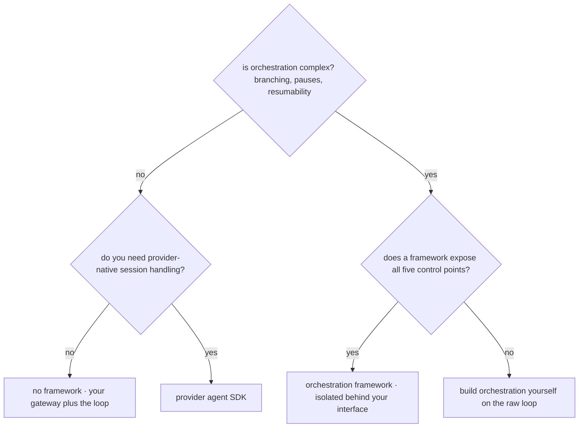

# Agent Frameworks Landscape

You built the loop in [agt-01](agt-01-agent-fundamentals.md), which puts you in the only position from which framework selection is a real decision rather than a guess: **you know what a framework would be doing on your behalf, so you can ask whether you want it done that way.** This chapter is short and deliberately unglamorous — it maps the categories, gives the evaluation axes that actually predict regret, makes the case for using no framework at all, and applies the [api-06](../02-llm-apis/api-06-model-selection.md) bake-off procedure to the choice. It is marked `volatile` because the landscape genuinely churns; specific products named here are exemplars of categories, and the durable content is the axes and the build-first-then-judge stance.

## Intuition: frameworks are opinions about the architecture

Every agent framework is an opinionated implementation of [eng-02](../../engineering/eng-02-agent-loop-architecture.md)'s architecture. It has made choices for you about termination, error handling, state, tool registration, and — most consequentially — **where you are allowed to intervene**.

That last point is the whole evaluation. The five control points from [eng-02](../../engineering/eng-02-agent-loop-architecture.md) — catalog scoping, argument validation, authorization, execution isolation, and budget termination — are where your system's reliability and security live. A framework that exposes all five as first-class hooks is a productivity gain. A framework that owns the loop and offers callbacks that don't reach those points is a liability, and you cannot tell which you're looking at unless you know the points exist.

The other property worth naming up front: **the value a framework adds scales with orchestration complexity, not with agent count.** For a single loop with five tools, the framework's abstractions are overhead over roughly forty lines you already understand. For a system with branching, retries, parallel subtasks, checkpointing, and resumability, those abstractions are real engineering you would otherwise write and maintain.

## The category map

Three categories, distinguished by how much of the architecture they claim.

| Category | Exemplars | Claims | Fits when |
|---|---|---|---|
| **Provider agent SDKs** | Claude Agent SDK, OpenAI Agents SDK[^claude-agent-sdk][^openai-agents-sdk] | The loop, tool plumbing, and often session/state handling — close to the raw pattern | You want the loop handled without heavy abstraction, and provider alignment is acceptable |
| **Orchestration frameworks** | LangGraph-class graph/state-machine frameworks[^langgraph-docs] | Control flow as an explicit graph, with state, checkpointing, branching, resumability | Orchestration is genuinely complex: branching, human-in-the-loop pauses, durable long-running tasks |
| **Higher-level harnesses** | Role-based multi-agent toolkits | The topology itself — roles, delegation, conversation patterns | Rarely; usually adopts [agt-06](agt-06-multi-agent-systems.md)'s costs before the burden of proof is met |

> **Volatile:** the products in each row, their feature sets, and their relative standing move quarterly. Treat the categories as stable and verify capabilities against current documentation at decision time.[^langgraph-docs][^claude-agent-sdk][^openai-agents-sdk]

The category most teams should consider first is the middle one *when orchestration is complex*, and the first one otherwise — with the honest fourth option below.

## The evaluation axes

Five questions, in the order that predicts regret.

**1. Control granularity — can you reach the five control points?** Concretely: can you inspect and modify tool arguments *before* execution? Can you require human confirmation on a specific tool call and resume afterwards? Can you enforce a task-level budget and terminate with a summary? Can you scope which tools are visible per route? A framework failing these is not a framework you can ship a consequential agent on.

**2. Observability — does it emit usable traces?** Per-step trajectories with the assembled context, tool calls with arguments and results, and token usage, ideally in a form that flows into your existing store ([evl-04](../05-evaluation/evl-04-tracing-observability.md)). Frameworks that log their own abstractions rather than what the model saw make [eng-07](../../engineering/eng-07-eval-checklists-debugging.md)'s debugging procedure impossible.

**3. State model — does it match yours?** [agt-04](agt-04-memory-and-state.md) argued for typed state re-pinned each turn. Does the framework support that, or does it assume conversation-history-as-state? Does it offer checkpointing and resumption for long tasks? A mismatch here is the most expensive kind, because state is not something you can bolt on afterwards.

**4. Portability and lock-in.** How much of your logic would survive switching? Tool implementations should be portable; orchestration expressed in a framework's graph DSL is not. Weigh this the way [api-06](../02-llm-apis/api-06-model-selection.md) weighs model lock-in: isolate the framework behind your own interface where practical, and accept coupling only where the framework is doing real work.

**5. Does it hide what you need to see?** The summary question. Every abstraction hides something; the test is whether it hides the things this curriculum has spent four chapters telling you to control — the assembled context, the tool arguments, the termination decision, the privilege boundary.

*The selection decision:*

## The no-framework case

Worth stating plainly because it is under-represented in the discourse and over-represented among teams shipping well: **for a well-understood single loop, no framework is often the right answer.**

What you already have after [agt-01](agt-01-agent-fundamentals.md)–[agt-04](agt-04-memory-and-state.md): a gateway with retries, timeouts, and logging ([api-01](../02-llm-apis/api-01-llm-api-fundamentals.md)); tool definitions and a validator ([api-03](../02-llm-apis/api-03-structured-outputs-tool-calling.md), [agt-02](agt-02-tool-design.md)); a loop with budgets and in-band errors; typed state ([agt-04](agt-04-memory-and-state.md)); and tracing ([evl-04](../05-evaluation/evl-04-tracing-observability.md)). That is the whole architecture, in code you understand, with every control point trivially reachable because you wrote them.

The costs of adopting a framework at that point are real: a dependency that moves faster than your product, abstractions to learn and debug through, and — the one that bites — **the framework's failure modes become yours**, and they're harder to diagnose than your own because the stack is unfamiliar. The industry's own guidance is consistent here: start with direct API calls, and add frameworks when the complexity you're managing genuinely exceeds what you want to maintain.[^anthropic-agents]

The honest counterweight: once you need durable long-running tasks, checkpointing, resumption after human approval, and branching orchestration, writing that yourself is a real project, and a good orchestration framework is worth its coupling.

## Selection as a bake-off

Apply [api-06](../02-llm-apis/api-06-model-selection.md)'s procedure rather than adopting by reputation:

1. **Constraint filter.** Language, deployment model, licensing, provider compatibility, and whether it supports human-in-the-loop pause/resume if you need it. This eliminates most candidates from documentation alone.
2. **Prototype the same task** in two candidates *and* in raw code. A day of work; it reveals more than any comparison article.
3. **Audit the control points** in each prototype — actually try to reject a tool call before execution, require confirmation on one tool, and enforce a task budget. Frameworks differ enormously here and documentation rarely says so plainly.
4. **Check the traces** each produces against what [evl-04](../05-evaluation/evl-04-tracing-observability.md) requires.
5. **Decide and log it** ([api-06](../02-llm-apis/api-06-model-selection.md)'s decision log) with the re-evaluation trigger — typically "when orchestration complexity crosses X" or "at the next major version."

## Production engineering perspective

- **Isolate the framework behind your own interface** where practical — the same discipline as the model gateway. Tools and prompts should not import framework types.
- **Version-pin aggressively.** These libraries move fast and change behavior in minor releases; treat an upgrade as a behavior deploy through the eval gate ([evl-06](../05-evaluation/evl-06-ci-for-llm-apps.md)).
- **Verify the framework doesn't bypass your gateway** — some issue provider calls directly, which silently removes your retries, timeouts, usage logging, and model pinning.
- **Keep the eval suite framework-agnostic** so migrating is a code change rather than a re-validation project.
- **Budget for debugging through the abstraction**; a framework's convenience is paid back at incident time, so weight observability heavily in selection.

## Historical evolution

**2022–2023:** early chains-and-agents libraries make LLM orchestration accessible and are adopted rapidly; their abstractions prove leaky for production use, and a backlash follows as teams discover they cannot reach the control points they need. **2023–2024:** the field bifurcates — graph/state-machine frameworks emerge offering explicit control flow, durable state, and human-in-the-loop pauses,[^langgraph-docs] while providers ship thinner SDKs closer to the raw loop.[^claude-agent-sdk][^openai-agents-sdk] Practitioner guidance converges on "start with direct API calls."[^anthropic-agents] **2024–present:** consolidation around the two useful shapes — thin provider SDKs for straightforward loops, orchestration frameworks for genuinely complex control flow — with the role-based multi-agent harnesses receding as [agt-06](agt-06-multi-agent-systems.md)'s costs became better understood. The recurring lesson: **abstractions that hide the loop lose to abstractions that structure it**, because the loop is where the engineering is.

## Common misconceptions

- **"You need a framework to build agents."** The loop is forty lines. Frameworks earn their place at orchestration complexity, not at hello-world.
- **"Frameworks make agents more reliable."** They make orchestration easier to express. Reliability comes from tools, state, budgets, and gates — which a framework may help or hinder depending on whether it exposes them.
- **"Pick the most popular one."** Popularity predicts ecosystem and hiring, not fit. The control-point audit predicts whether you can ship.
- **"Adopting a framework is reversible."** Tool implementations port easily; orchestration expressed in a framework's DSL does not. Isolate accordingly.
- **"No framework means writing everything yourself."** It means composing your gateway, validator, loop, and state — all of which you already have and understand.
- **"The framework handles security."** No framework can enforce your authorization model or privilege tiers; it can only expose the hook where you enforce them ([eng-09](../../engineering/eng-09-security-guidelines.md)).

## Failure modes and trade-offs

- **Unreachable control points** — you cannot intervene before a consequential tool executes. *Fix:* audit before adopting; this is disqualifying for agents that mutate state.
- **Bypassed gateway** — the framework calls providers directly, losing retries, pinning, and usage logs. *Fix:* verify during the prototype; wire the framework to your client if supported.
- **Opaque traces** — logs describe framework internals rather than what the model saw. *Fix:* weight observability heavily; reject frameworks that can't emit assembled context.
- **Version churn** — a minor upgrade changes behavior with no test failure. *Fix:* pin, and run upgrades through the eval gate.
- **Premature adoption** — framework complexity exceeding the problem's. *Fix:* start raw; adopt on measured need.
- **The central trade-off:** convenience versus control. Convenience is paid for at incident time, which is why observability and control granularity outrank developer-experience polish in selection.

## Real-world examples

**The framework that hid the arguments.** A team builds a refund-capable agent on a framework whose tool-execution path offers only pre- and post-run callbacks. When they add the requirement to verify a refund amount against the order record before execution ([api-03](../02-llm-apis/api-03-structured-outputs-tool-calling.md)'s resolve-and-verify), there is no hook between the model's tool call and the framework's execution of it — validation can only happen *inside* the tool, which works but scatters authorization logic across every tool implementation rather than centralizing it. They migrate to raw code for that agent. The control-point audit would have taken twenty minutes during selection and saved a migration.

**The orchestration framework that earned it.** A different team runs long document-processing tasks: multi-hour, branching, requiring human approval at two points and resumption afterwards, surviving process restarts. They prototype it raw and find themselves writing a durable state machine with checkpointing and resumption — a real project with its own bug surface. An orchestration framework provides exactly that, with the control points exposed. They adopt it, isolate their tools behind their own interfaces, pin the version, and route upgrades through the eval gate. **The framework was doing work they'd otherwise have maintained**, which is the only good reason to take the coupling.

**The migration that was cheap because of an interface.** A team adopting a framework kept tool implementations as plain functions with their own schemas, adapting them to the framework at a thin boundary layer. Eighteen months later, switching frameworks touched the boundary layer and the orchestration definition — about 400 lines — while tools, prompts, evals, and the gateway were untouched. The same discipline that makes model migration cheap ([api-06](../02-llm-apis/api-06-model-selection.md)) makes framework migration cheap, and for the same reason: **the coupling was designed rather than accumulated.**

## Interview questions

1. **"How do you decide whether to use an agent framework?"** — Model answer: by orchestration complexity, judged against what I'd otherwise maintain. For a single loop with a handful of tools, raw code plus my existing gateway is clearer and I keep every control point trivially reachable. When I need branching control flow, durable long-running tasks, checkpointing, and resumption after human approval, writing that myself is a real project and an orchestration framework is worth the coupling. Either way I'd prototype the same task in two candidates and in raw code, audit the five control points in each, check the traces, and log the decision with a re-evaluation trigger.

2. **"What are the five control points and why do they decide framework selection?"** — Model answer: catalog scoping (which tools are visible), argument validation before execution, authorization derived from the session, execution isolation with least-privilege credentials, and budget termination. They're where reliability and security live, so a framework that doesn't expose them as first-class hooks can't ship a consequential agent — you'd be scattering authorization into individual tool implementations or unable to intervene at all. It's also the audit documentation rarely answers plainly, which is why prototyping is necessary rather than reading comparisons.

3. **"When is no framework the right answer?"** — Model answer: for a well-understood single loop, which is most agents. After building the fundamentals you already have a gateway with retries and logging, tool definitions with a validator, a loop with budgets and in-band errors, typed state, and tracing — that *is* the architecture, in code you understand with every control point reachable. Adopting a framework there adds a fast-moving dependency, abstractions to debug through, and failure modes that are harder to diagnose than your own. The counterweight is honest: durable long-running orchestration with checkpointing is real engineering, and a good framework is worth its coupling there.

4. **"How do you keep framework adoption from becoming lock-in?"** — Model answer: the same way as with models — design the coupling rather than accumulating it. Tool implementations stay plain functions with their own schemas, adapted at a thin boundary layer, so they never import framework types. Prompts and eval suites stay framework-agnostic. Then a migration touches the boundary and the orchestration definition rather than the whole system. I'd also pin versions aggressively and run upgrades through the eval gate, since these libraries change behavior in minor releases with no test failure to warn you.

5. **"What would disqualify a framework for you?"** — Model answer: inability to reach the control points — specifically, no hook between the model's tool call and its execution, which makes centralized validation and authorization impossible for a state-mutating agent. Close behind: traces that log framework internals rather than the assembled context the model actually saw, which makes incident debugging impossible; and bypassing my gateway to call providers directly, which silently removes retries, model pinning, and usage logging. Developer-experience polish doesn't offset any of those, because convenience is paid back at incident time.

## Exercises and mini-project

**Exercises**

1. For each, choose raw / provider SDK / orchestration framework and justify: (a) a five-tool support agent; (b) a multi-hour pipeline with two human approvals and restart survival; (c) a research agent with parallel subagents; (d) a single-tool classifier loop.
2. Write the control-point audit as five concrete tests you'd run against a candidate framework in a prototype.
3. Your framework calls providers directly. List everything you lose and how you'd detect it.
4. Design the boundary layer that keeps your tools portable across frameworks — what crosses it, what doesn't.
5. A framework's minor version changes agent behavior. Explain why your code tests didn't catch it and what would have.

**Mini-project: the framework bake-off.** Using your [agt-01](agt-01-agent-fundamentals.md) agent: (a) reimplement it in one framework, keeping tools as plain functions behind an adapter; (b) run the five control-point tests against it — reject a tool call pre-execution, require confirmation on one tool, enforce a task budget, scope the catalog, verify credentials isolation; (c) compare the traces each version emits against your [evl-04](../05-evaluation/evl-04-tracing-observability.md) schema; (d) measure lines of code, and time-to-diagnose a seeded failure in each; (e) write the [api-06](../02-llm-apis/api-06-model-selection.md)-style decision log with a re-evaluation trigger. Target: 3 hours. Success criterion: an evidence-based decision — including, legitimately, "raw code wins for this agent."

**Capstone extension:** whichever you choose, the capstone's tools and eval suite stay framework-agnostic so the decision remains reversible.

## Revision summary

- Frameworks are opinionated implementations of the agent architecture; having built the loop yourself is what makes evaluating them possible rather than guesswork.
- Categories: provider agent SDKs (thin, close to the raw loop), orchestration frameworks (explicit control flow, durable state, checkpointing, human-in-the-loop pauses), and higher-level role-based harnesses (rarely justified).
- Evaluation axes in order of regret-prediction: control granularity (the five control points), observability (does it emit the assembled context), state model fit, portability, and the summary question — does it hide what you need to control.
- **No framework is often correct** for a well-understood single loop, because you already have gateway, validator, loop, state, and tracing. Frameworks earn coupling when durable orchestration is genuinely complex.
- Selection is a bake-off: constraint filter, prototype in two candidates plus raw, audit control points by actually testing them, check traces, decide and log with a trigger. Isolate behind your own interface, pin versions, and keep evals framework-agnostic.

## Flashcards

| Q | A |
|---|---|
| What is an agent framework, conceptually? | An opinionated implementation of the agent architecture — including where you're allowed to intervene. |
| The decisive evaluation axis? | Control granularity: can you reach argument validation, authorization, catalog scoping, execution isolation, and budget termination? |
| Why weight observability heavily? | Convenience is paid back at incident time; traces of framework internals rather than assembled context make debugging impossible. |
| When does a framework earn its coupling? | When orchestration is genuinely complex — branching, durable long-running tasks, checkpointing, human-in-the-loop resumption. |
| When is no framework right? | For a well-understood single loop, where you already have gateway, validator, loop, typed state, and tracing. |
| What ports easily across frameworks and what doesn't? | Tool implementations, prompts, and evals port; orchestration expressed in a framework's DSL does not. |
| Why pin framework versions aggressively? | Minor releases change behavior with no code-test failure — treat upgrades as behavior deploys through the eval gate. |
| Hidden risk to check during prototyping? | Whether the framework bypasses your gateway, silently removing retries, model pinning, and usage logging. |
| How should selection be made? | As a bake-off: prototype in two candidates plus raw code, test the control points, compare traces, log the decision with a trigger. |

## Further reading

- **Official docs:** LangGraph[^langgraph-docs], Claude Agent SDK[^claude-agent-sdk], and OpenAI Agents SDK[^openai-agents-sdk] documentation — read the control-flow and human-in-the-loop sections specifically.
- **Papers:** none — this is a tooling-selection layer.
- **Books:** none.
- **Talks:** framework talks are marketing-shaped; prefer prototypes.
- **Tutorials:** Anthropic's "Building effective agents"[^anthropic-agents] — the start-with-direct-API-calls argument.

## Check your understanding

1. Name the five control points and describe how you'd test each against a candidate framework.
2. Give two situations where a framework clearly earns its coupling and two where it clearly doesn't.
3. Your framework upgrade changed agent behavior with all code tests green. Explain the mechanism and the process fix.
4. Design the boundary that keeps a framework decision reversible, and say what still couples.
5. Why does having built the loop from scratch change what you can conclude from a framework's documentation?

## Sources

[^langgraph-docs]: [T1] LangChain. "LangGraph documentation." https://langchain-ai.github.io/langgraph/ (accessed 2026-07-10)
[^claude-agent-sdk]: [T1] Anthropic. "Claude Agent SDK documentation." https://docs.anthropic.com/en/api/agent-sdk/overview (accessed 2026-07-10)
[^openai-agents-sdk]: [T1] OpenAI. "Agents SDK documentation." https://openai.github.io/openai-agents-python/ (accessed 2026-07-10)
[^anthropic-agents]: [T4] Anthropic (2024). "Building effective agents." Anthropic Engineering. https://www.anthropic.com/engineering/building-effective-agents (accessed 2026-07-10)
