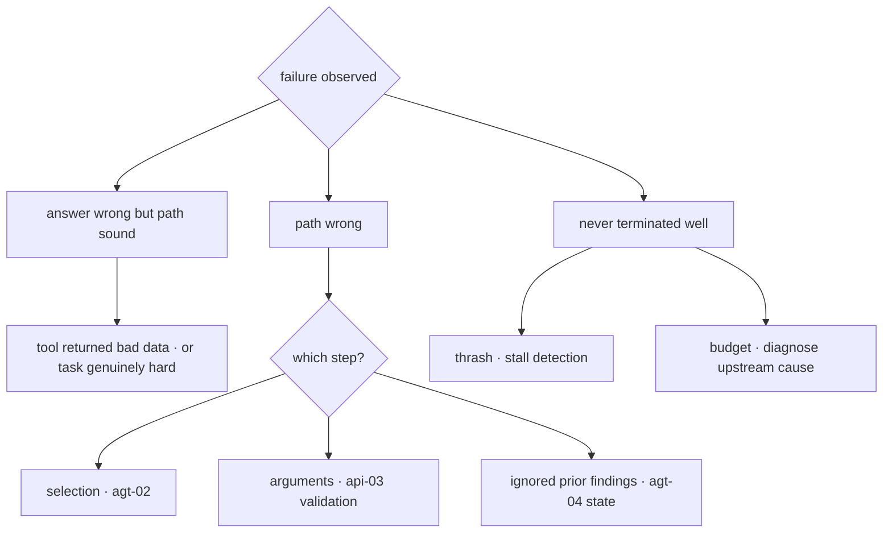

# Agent Reliability & Evaluation

This chapter is Module 4's [evl-01](../05-evaluation/evl-01-evaluation-fundamentals.md) — the discipline that turns an agent demo into something you can put in front of users. Agents fail differently from single calls in two ways that reorganize everything: errors **compound** over sequential dependent steps, and the failure surface is **the whole trajectory** rather than one output. A final answer that looks right can come from a path that took nine wrong turns and got lucky; a wrong answer can come from a path that was correct until one tool returned stale data. Evaluating only the answer therefore tells you almost nothing about whether the system will hold. The chapter covers trajectory-level evaluation, the agent-specific failure taxonomy that turns "it broke" into a diagnosis, human gates as reliability *infrastructure* rather than UX friction, and the shipping bar that makes agents deployable at all: **not eliminated failure, but contained failure.**

## Intuition: multiplicative decay

The arithmetic from [agt-01](agt-01-agent-fundamentals.md), now used as a design tool rather than a warning.

Agent steps are sequential and dependent — each step's input includes prior outputs — so per-step reliability multiplies:

| Per-step | 5 steps | 10 steps | 20 steps | 40 steps |
|---|---|---|---|---|
| 0.90 | 59% | 35% | 12% | 1.5% |
| 0.95 | 77% | 60% | 36% | 13% |
| 0.99 | 95% | 90% | 82% | 67% |

Three consequences shape the whole chapter. **First, demos mislead structurally** — they sample short tasks, where even mediocre per-step reliability looks impressive ([fnd-01](../01-foundations/fnd-01-ai-engineering-landscape.md)'s demo-quality trap in its sharpest form). **Second, the two levers are per-step reliability and step count**, and step count is usually the cheaper one to move: better tools that accomplish more per call ([agt-02](agt-02-tool-design.md)), decomposition into short horizons ([agt-03](agt-03-reasoning-and-planning.md)), and subagents with clean contexts ([agt-06](agt-06-multi-agent-systems.md)) all attack it. **Third, and most important: the table assumes failures are independent and terminal.** They are neither — an agent that *recovers* from a failed step breaks the multiplication, which is why in-band actionable errors ([agt-02](agt-02-tool-design.md)) improve completion rates so dramatically. Recovery is the mechanism that makes long-horizon agents possible at all.

So the reliability program has three prongs: raise per-step reliability, reduce step count, and — the one teams under-invest in — **make failures recoverable and their consequences bounded.**

## Trajectory evaluation

The evaluation shift that agents force. [evl-01](../05-evaluation/evl-01-evaluation-fundamentals.md)'s discipline applies unchanged; what changes is *what you score*.

**Outcome metrics** ask whether the task was accomplished — the metric that matters to users, and the one that can't localize failure. **Trajectory metrics** ask whether the path was sound, and they are what make agent failures diagnosable:

- **Step efficiency** — steps taken versus the minimum needed. Consistent inflation points at tool granularity or missing state ([agt-02](agt-02-tool-design.md), [agt-04](agt-04-memory-and-state.md)).
- **Tool selection accuracy** — was the right tool chosen at each step? Cheap to compute from trajectories and localizes a whole failure class.
- **Argument validity** — did calls carry sensible arguments, or fabricated ones?
- **Recovery rate** — when a step failed, did the agent recover? This is the metric most predictive of long-horizon success and the one most often unmeasured.
- **Plan adherence** — did the agent do what it said it would, or drift ([agt-03](agt-03-reasoning-and-planning.md))?
- **Termination quality** — did it stop for the right reason: task complete, or budget exhausted, or thrashing?

**Scoring the path requires a judge** ([evl-03](../05-evaluation/evl-03-llm-as-judge.md)), because "was this a reasonable step given what was known" is exactly the subjective judgment judges exist for. The same rules apply: checklist rubrics with quote anchors ("did the agent use information it had already retrieved rather than re-fetching it?"), blinded, calibrated against human labels before gating.

**Trajectories are also the case source.** Every production run is a labeled example waiting to be triaged ([evl-02](../05-evaluation/evl-02-eval-datasets.md)'s flywheel, [evl-04](../05-evaluation/evl-04-tracing-observability.md)'s traces) — and agent trajectories are unusually rich, since a single failed run contains a dozen scoreable decisions.

**Benchmarks for calibration, not for claims.** Research benchmarks measure agent task completion in realistic settings — resolving software issues,[^jimenez-swebench] or tool-and-user interaction in service domains where the honest finding is that reliability *across repeated trials of the same task* is markedly lower than single-attempt success.[^yao-taubench] That consistency gap is the most transferable result: **an agent that succeeds once may not succeed reliably**, which is why n-run evaluation ([fnd-08](../01-foundations/fnd-08-sampling-and-decoding.md)) matters more here than anywhere.

## The failure taxonomy

The diagnostic vocabulary — extending [fnd-09](../01-foundations/fnd-09-capabilities-and-limits.md)'s general taxonomy with agent-specific modes. Naming the failure is most of fixing it.

| Failure | Signature in the trajectory | Mechanism | Fix |
|---|---|---|---|
| **Wrong tool** | Called X where Y was appropriate | Overlapping or vague descriptions | [agt-02](agt-02-tool-design.md): use-when/do-not-use-when clauses; measure selection accuracy |
| **Fabricated arguments** | Valid schema, invented values (IDs, amounts) | Model output is unverified | Validate-then-authorize; resolve-and-verify identifiers ([api-03](../02-llm-apis/api-03-structured-outputs-tool-calling.md)) |
| **No recovery** | Same failing call repeated, or run aborts | Errors uninformative or raised out-of-band | In-band actionable errors ([agt-02](agt-02-tool-design.md)) |
| **Loop / thrash** | N near-identical consecutive steps | No stall detection | Similarity check on recent steps; break with summary |
| **Plan drift** | Contradicts or abandons earlier decisions | Plan is prose buried mid-context | Typed state re-pinned each turn ([agt-03](agt-03-reasoning-and-planning.md), [agt-04](agt-04-memory-and-state.md)) |
| **Context rot** | Quality degrades with trajectory length | Accumulated noise, mid-context inattention | Compaction with survival contract ([agt-04](agt-04-memory-and-state.md)) |
| **Budget exhaustion** | Terminates at cap without completing | Task too long, or an upstream failure | Diagnose *why* — exhaustion is a symptom, not a cause |
| **Silent wrong completion** | Finishes confidently with a wrong result | Nothing verified the outcome | Verification step; outcome assertions ([agt-08](agt-08-computer-use.md)'s lesson) |
| **Unsafe action** | Consequential action taken that shouldn't have been | Missing gate or over-broad privilege | Privilege tiers and human gates ([eng-02](../../engineering/eng-02-agent-loop-architecture.md)) |

*From symptom to mitigation:*

The habit that makes this pay: **attribute across 20–30 failed trajectories, not one.** The distribution over failure classes tells you where the sprint goes; a single dramatic failure tells you almost nothing ([rag-07](../03-retrieval/rag-07-rag-evaluation.md)'s attribution discipline, applied to paths).

## Human gates as reliability infrastructure

The reframe that gets gates built rather than argued about: **a human gate is not friction, it is the mechanism that makes an unreliable component deployable.**

An agent with 90% per-step reliability cannot be trusted to issue refunds autonomously. The same agent, gated so that refunds require one click of confirmation, is shippable *today* — because the 10% failure rate now costs a rejected suggestion instead of a wrong payment. Gates convert an accuracy problem into a review problem, and review is something organizations already know how to do.

**Privilege tiers** are the design artifact ([eng-02](../../engineering/eng-02-agent-loop-architecture.md)), written before launch and reviewed like an access-control policy:

| Tier | Examples | Policy |
|---|---|---|
| Auto | Reads, searches, retrievals | Execute freely; log |
| Scoped-auto | Bounded writes (draft, tag, comment) | Execute within limits; log and alert on volume |
| Gated | Money, deletion, external communication, permission changes | Human confirmation with the trajectory attached |

**Design the gate well or it becomes a rubber stamp.** The approver needs *what the agent is about to do, why, and what it saw* — the proposed action with its arguments, the relevant trajectory excerpt, and the specific thing to verify. A confirmation dialog reading "Agent wants to proceed. OK?" trains people to click yes, which is worse than no gate because it manufactures false assurance.

**Escalation on uncertainty** is the gate's complement: when the agent's confidence is low, retrieval returned nothing relevant, or the budget is nearly exhausted, hand off to a human *with context* rather than pressing on. This is [fnd-09](../01-foundations/fnd-09-capabilities-and-limits.md)'s abstention doctrine at the task level, and it needs the same measurement — track both missed escalations (should have asked, didn't) and over-escalation (asked when it could have proceeded), because over-correcting produces an agent that escalates everything and is therefore useless.

**Staged autonomy** is how gates loosen responsibly: start fully supervised, measure the agreement rate between the agent's proposals and human decisions, and promote actions from gated to scoped-auto only when the evidence supports it — per action type, not globally. That progression is also the evidence you'll need when someone asks why the agent is allowed to do something.

## The shipping bar

The standard that makes agents deployable: **failure must be contained, not eliminated.**

Nothing in this curriculum will make an agent's per-step reliability 1.0, and a program that waits for it never ships. What makes deployment responsible is that every failure mode has a bounded consequence:

- **Reversible by default.** Prefer drafts over sends, proposals over executions, soft deletes over hard ones. A reversible wrong action is an inconvenience; an irreversible one is an incident.
- **Bounded blast radius.** The union of tool privileges is a number you designed ([agt-02](agt-02-tool-design.md), [eng-09](../../engineering/eng-09-security-guidelines.md)) — and it should be the minimum the task requires, so that a fully-confused or injected agent still cannot do much.
- **Detectable.** Outcome assertions, verification steps, and online quality monitoring ([evl-05](../05-evaluation/evl-05-online-evaluation.md)) mean failures surface rather than accumulate silently. The [agt-08](agt-08-computer-use.md) lesson generalizes: **an agent that can always take some action will always complete, so completion is not evidence of success.**
- **Recoverable.** Checkpoints, idempotent tools, and a clean escalation path mean a failed run is resumable rather than a mess to untangle.

The pre-launch checklist, synthesizing [eng-02](../../engineering/eng-02-agent-loop-architecture.md) and [eng-07](../../engineering/eng-07-eval-checklists-debugging.md):

- [ ] Budgets in four dimensions (steps, tokens, spend, wall clock) with defined terminal states
- [ ] Stall detection on repeated near-identical steps
- [ ] Arguments validated, then authorized from the session — never from the model's claim
- [ ] Idempotency keys on every side-effecting tool; least-privilege credentials per tool
- [ ] Privilege tiers written down and reviewed; gates carry the trajectory to the approver
- [ ] Escalation path on low confidence, empty retrieval, or near-exhausted budget
- [ ] Full trajectory logging with a shared task ID ([evl-04](../05-evaluation/evl-04-tracing-observability.md))
- [ ] Trajectory eval suite with n-run measurement, gating deploys ([evl-06](../05-evaluation/evl-06-ci-for-llm-apps.md))
- [ ] Red-team cases for injection through tool results ([sec-01](../07-safety-security/sec-01-prompt-injection.md), [sec-04](../07-safety-security/sec-04-red-teaming.md))
- [ ] Online monitoring: completion rate, step distribution, gate-rejection rate, escalation rate

## Production engineering perspective

- **Watch the step-count distribution, not the mean.** A rising tail is the earliest signal of degradation — tools drifting, retrieval weakening, or a UI change ([agt-08](agt-08-computer-use.md)) — and it moves before completion rate does.
- **Gate-rejection rate is a quality metric.** Humans rejecting many proposals means the agent is proposing badly; near-zero rejections may mean the gate is a rubber stamp. Both are actionable.
- **Track cost per completed task**, not per call — an agent that retries its way to success is expensive in a way per-call metrics hide ([eng-10](../../engineering/eng-10-cost-optimization.md)).
- **n-run your agent evals.** Single-run agent evaluation is especially misleading given the documented gap between one-shot success and consistency across trials.[^yao-taubench]
- **Separate worker and orchestrator evaluation** in multi-agent systems ([agt-06](agt-06-multi-agent-systems.md)) — an end-to-end score can't tell you which failed.
- **Make the escalation path fast.** If handing off to a human takes longer than doing the task manually, users route around the agent entirely and you lose both the automation and the feedback.

## Historical evolution

**2023:** autonomous agent projects capture attention and largely fail in production — unbounded loops, no gates, and compounding failure over long horizons that demos never exposed. **2023–2024:** the field converges on constraint: bounded loops, human gates, narrow scopes, and the recognition that most agent problems are tool and state problems.[^anthropic-agents] Benchmarks emerge that measure realistic multi-step task completion rather than single-turn quality.[^jimenez-swebench] **2024:** evaluation matures from outcome-only to trajectory-level, and benchmarks begin measuring *consistency* across repeated trials — surfacing that agents which succeed once often don't succeed reliably.[^yao-taubench] **2024–present:** agents become genuinely productive where verification is cheap (coding, with tests as ground truth) and remain supervised elsewhere; staged autonomy becomes the standard deployment pattern. The through-line for this whole module: **agents became shippable when the field stopped trying to make them reliable and started making their failures cheap.**

## Common misconceptions

- **"The agent works — I tested it."** On short tasks, probably. Multiplicative decay means the same per-step reliability that gives 77% at five steps gives 36% at twenty. Test at production task lengths, n-run.
- **"Evaluate the final answer; that's what users see."** True and insufficient — an answer-only score can't localize failure, and a right answer from a lucky path will regress unpredictably. Score the path too.
- **"Human gates defeat the purpose of automation."** They're what make an unreliable component deployable, converting an accuracy problem into a review problem. The alternative isn't ungated automation; it's no automation.
- **"We'll add gates once it's reliable enough."** Reliability never reaches 1.0. Ship gated, measure agreement, and loosen per action type on evidence — that's staged autonomy.
- **"Budget exhaustion means the budget is too small."** Sometimes. More often it's a symptom of an upstream failure — thrashing, a broken tool, missing state — and raising the cap just spends more before failing.
- **"It completed, so it worked."** An agent with a generic action space can always do *something*. Completion without outcome verification is not evidence of success.

## Failure modes and trade-offs

- **Demo-to-production collapse** — impressive short-task performance, poor long-task completion. *Fix:* evaluate at real task lengths; reduce step count as the primary lever.
- **Unmeasured recovery** — the metric most predictive of long-horizon success is usually not tracked. *Fix:* instrument recovery rate from trajectories; invest in in-band actionable errors.
- **Rubber-stamp gates** — approvers click through without reading. *Fix:* gates must show the action, its arguments, the relevant trajectory, and what specifically to verify; monitor rejection rate for suspicious near-zero values.
- **Over-escalation** — the agent asks for help constantly and users abandon it. *Fix:* track over- and under-escalation as opposing metrics and tune the threshold as a product decision.
- **Silent wrong completion** — no verification, so failures accumulate unnoticed. *Fix:* outcome assertions and online quality sampling.
- **The central trade-off:** autonomy versus containment. Every gate removed increases throughput and expands blast radius. Staged autonomy makes that trade explicitly and reversibly, per action type, with evidence.

## Best practices

- **Evaluate trajectories, not just outcomes** — step efficiency, tool selection, argument validity, recovery rate, plan adherence, termination quality — with a calibrated judge and n-run measurement.
- **Attribute across 20–30 failures** and act on the distribution over failure classes.
- **Reduce step count first** — better tools, decomposition, clean contexts — since it is usually cheaper than raising per-step reliability.
- **Invest in recovery**: in-band actionable errors, checkpoints, and resumability break the multiplication that otherwise dooms long tasks.
- **Write the privilege tier table before launch**, and design gates that carry the trajectory to the approver.
- **Build the escalation path** on low confidence, empty retrieval, or near-exhausted budget — and make it fast.
- **Ship gated, then loosen per action type** on measured agent-human agreement (staged autonomy).
- **Make failures reversible, bounded, detectable, and recoverable** — that is the shipping bar, not zero failures.
- **Monitor step-count distribution, gate-rejection rate, escalation rate, and cost per completed task.**

## Real-world examples

**The 40% that shipped anyway.** A team builds an expense-processing agent that completes end-to-end about 40% of the time on real submissions — nowhere near autonomous quality. Rather than delaying, they ship it as a *proposal* system: the agent drafts the categorization and approval routing, a human confirms with the trajectory visible. The 60% failure rate becomes 60% of proposals needing edits, which is still faster than processing from scratch, and the review data becomes the eval flywheel. Six months of that data raises completion to 78%, at which point the two most common action types are promoted to scoped-auto. **Contained failure shipped a year earlier than eliminated failure would have.**

**The metric that predicted everything.** A team tracks completion rate and finds it stuck around 55%. Adding trajectory metrics reveals the story: tool selection is 94%, argument validity 97%, but **recovery rate is 18%** — when any step failed, the agent almost never got back on track. The cause is tool errors raised as exceptions and surfaced as generic messages ([agt-02](agt-02-tool-design.md)). Rewriting error paths to be in-band and actionable takes two days; recovery rate rises to 71% and completion to 82% — with no change to the model, the prompts, or the tools' capabilities. **Recovery was the binding constraint and it wasn't being measured.**

**The gate that was a rubber stamp.** A deployment agent requires human approval for production changes; approval rate is 99.6%. An incident review finds the dialog showed only "Agent requests approval for deploy to production — Approve / Deny," with no diff, no trajectory, no indication of what changed. Approvers had learned it was always fine. The redesign shows the proposed change, the trajectory excerpt explaining why, and an explicit checklist of what to verify; approval rate drops to 91%, and the 9% caught include two genuinely wrong deploys in the first month. **A gate that doesn't inform is worse than no gate**, because it manufactures assurance while providing none.

## Interview questions

1. **"Why do agents that demo well fail in production?"** — Model answer: multiplicative decay. Steps are sequential and dependent, so per-step reliability multiplies — 0.95 gives 77% at five steps and 36% at twenty — and demos structurally sample short tasks. The fix isn't primarily a smarter model: the two levers are per-step reliability and step count, and step count is usually cheaper to move via better tools, decomposition, and clean contexts. The third and most under-invested lever is recovery — the table assumes failures are terminal, and an agent that recovers from a failed step breaks the multiplication entirely, which is why in-band actionable errors move completion rates so much.

2. **"What is trajectory evaluation and why isn't outcome enough?"** — Model answer: outcome asks whether the task was accomplished; trajectory asks whether the path was sound. Outcome alone can't localize failure and can't distinguish a right answer from a lucky path — which will regress unpredictably. So I'd score step efficiency, tool selection accuracy, argument validity, recovery rate, plan adherence, and termination quality, using a calibrated judge for the subjective ones since "was this reasonable given what was known" is exactly a judge question. Recovery rate in particular is the most predictive of long-horizon success and the least commonly measured.

3. **"How do you make an unreliable agent shippable?"** — Model answer: contain the failures rather than waiting to eliminate them. Concretely: make actions reversible by default (drafts over sends, proposals over executions), bound the blast radius by keeping the union of tool privileges minimal, make failures detectable through outcome assertions and online quality sampling, and make runs recoverable via checkpoints and idempotent tools. Then gate consequential actions behind human confirmation, which converts an accuracy problem into a review problem. A 40%-completion agent shipped as a proposal system delivers value immediately and generates the eval data that improves it.

4. **"How do you design a human gate?"** — Model answer: so the approver can actually decide. That means showing the proposed action with its arguments, the relevant trajectory excerpt explaining why the agent wants to do it, and an explicit statement of what to verify. A dialog saying "Agent wants to proceed — OK?" trains people to click yes, which is worse than no gate because it manufactures false assurance. I'd also monitor rejection rate: near-zero suggests a rubber stamp, high suggests the agent is proposing badly — both actionable. And pair gates with an escalation path on low confidence or empty retrieval, tracking over- and under-escalation as opposing metrics.

5. **"Walk me through diagnosing a failing agent."** — Model answer: pull 20–30 failed trajectories and attribute each to a failure class rather than debugging one dramatic case. The classes have distinct signatures: wrong tool selected (overlapping descriptions), fabricated arguments (missing validation), repeated failing calls (errors not actionable in-band), near-identical consecutive steps (no stall detection), contradicting earlier decisions (plan as prose rather than state), quality degrading with length (context rot), terminating at the cap (usually a symptom of an upstream failure rather than a small budget). Then act on the distribution — the modal failure class names the sprint.

6. **"What's staged autonomy?"** — Model answer: the responsible way to loosen gates. Start fully supervised with consequential actions gated, measure agreement between the agent's proposals and human decisions per action type, and promote actions from gated to scoped-auto only where the evidence supports it — never globally, since agreement varies enormously by action. It gives you a defensible answer to "why is the agent allowed to do this," it's reversible when a class starts degrading, and it means you ship value while collecting the data that justifies more autonomy. The alternative — waiting for reliability that never arrives — ships nothing.

7. **"Why is 'it completed' not evidence of success?"** — Model answer: because an agent with a generic action space can always take *some* action, so a derailed run still terminates — just incorrectly. The clearest case is a computer-use agent that can't find its expected screen, clicks the nearest plausible control, and finishes with wrong results that nobody notices because the run "succeeded." The fix is assertion-based rather than error-based: verify outcomes independently, assert result shape, run known-answer canaries on a schedule, and monitor online quality — because with no verification step, silent wrong completions accumulate rather than surface.

## Exercises and mini-project

**Exercises**

1. Compute completion probability at per-step reliability 0.92 for 6, 15, and 30 steps. Then recompute assuming 60% of failed steps are recovered — and state which lever you'd pursue.
2. For each trajectory signature, name the failure class and its fix: (a) same search repeated five times; (b) a refund for an amount not in any record; (c) step 14 contradicts a constraint from step 2; (d) terminated at the step cap with nothing produced.
3. Write the privilege tier table for a customer-support agent with eight tools, and justify each tier assignment.
4. Design the gate UI for "issue a $2,400 refund": what it shows, what it asks the approver to verify, and what you'd monitor.
5. Your agent escalates 40% of tasks. Give three explanations and the metric that distinguishes them.

**Mini-project: make the capstone agent shippable.** On your [agt-01](agt-01-agent-fundamentals.md)–[agt-04](agt-04-memory-and-state.md) agent: (a) build a 20-case trajectory eval scoring outcome plus step efficiency, tool selection, recovery, and termination quality, run n=3; (b) attribute 20 failures to the taxonomy and report the distribution; (c) implement the fix for your modal failure class and re-measure; (d) write the privilege tier table and implement one human gate that carries the trajectory to the approver; (e) implement escalation on low confidence and measure over/under-escalation on your eval; (f) complete the pre-launch checklist and note what you'd still need before real users. Target: 5 hours. Success criterion: a measured recovery rate, an attributed failure distribution, and a working gate — plus an honest statement of what your agent is *not* yet safe to do.

**Capstone extension:** this closes the agents module — your capstone agent is now evaluable and containable. [sec-01](../07-safety-security/sec-01-prompt-injection.md) will attack it, [sec-04](../07-safety-security/sec-04-red-teaming.md) will build the adversarial suite, and [fro-05](../09-frontier/fro-05-interviews-portfolio.md) will treat the whole thing as portfolio evidence.

## Revision summary

- Multiplicative decay ($p^n$) separates demos from products: 0.95 per step is 77% at five steps and 36% at twenty. Three levers — raise per-step reliability, **reduce step count** (usually cheapest), and **make failures recoverable**, which breaks the multiplication.
- Trajectory evaluation scores the path, not only the answer: step efficiency, tool selection accuracy, argument validity, **recovery rate** (most predictive, least measured), plan adherence, termination quality — judged with a calibrated judge, n-run, since one-shot success overstates consistency.
- The failure taxonomy turns "it broke" into a diagnosis: wrong tool, fabricated arguments, no recovery, thrash, plan drift, context rot, budget exhaustion (usually a symptom), silent wrong completion, unsafe action — each with a trajectory signature and a known fix. Attribute across 20–30 failures and act on the distribution.
- Human gates are reliability infrastructure, not friction: they convert an accuracy problem into a review problem, which is how a 40%-completion agent ships usefully. Design them to inform, or they become rubber stamps that manufacture false assurance.
- The shipping bar is **contained failure**: reversible by default, bounded blast radius, detectable outcomes, recoverable runs — plus staged autonomy that loosens gates per action type on measured agreement.

## Flashcards

| Q | A |
|---|---|
| Why do agent demos mislead? | Multiplicative decay — demos sample short tasks where mediocre per-step reliability still looks good (0.95 gives 77% at 5 steps, 36% at 20). |
| The three reliability levers? | Raise per-step reliability, reduce step count (usually cheapest), and make failures recoverable (breaks the multiplication). |
| Why isn't outcome evaluation enough? | It can't localize failure and can't distinguish a right answer from a lucky path, which will regress unpredictably. |
| The most predictive trajectory metric? | Recovery rate — whether the agent gets back on track after a failed step; also the least commonly measured. |
| What does budget exhaustion usually indicate? | A symptom of an upstream failure (thrash, broken tool, missing state) rather than a too-small cap. |
| Why are human gates reliability infrastructure? | They convert an accuracy problem into a review problem, making an unreliable component deployable today. |
| What makes a gate a rubber stamp? | Showing only "approve/deny" without the action, its arguments, the trajectory, and what to verify — worse than no gate. |
| What is staged autonomy? | Ship gated, measure agent-human agreement per action type, promote actions to scoped-auto on evidence — reversible and defensible. |
| The shipping bar for agents? | Contained failure: reversible by default, bounded blast radius, detectable outcomes, recoverable runs. |
| Why is completion not success? | A generic action space means the agent can always do something — derailed runs still terminate, just incorrectly. |
| How should failures be attributed? | Across 20–30 trajectories, acting on the distribution over failure classes rather than on one dramatic case. |

## Further reading

- **Official docs:** none authoritative; provider agent guidance is the closest.
- **Papers:** Yao et al., τ-bench (2024)[^yao-taubench] — read for the consistency-across-trials gap, the most transferable finding; Jiménez et al., SWE-bench (2023)[^jimenez-swebench] for realistic multi-step task measurement; Zheng et al. (2023)[^zheng-judge] for the judge machinery trajectory scoring depends on.
- **Books:** none current enough.
- **Talks:** none essential.
- **Tutorials:** Anthropic's "Building effective agents"[^anthropic-agents] — the constraint-and-simplicity argument that this chapter operationalizes.

## Check your understanding

1. Give the decay table from memory at 0.95 for 5/10/20 steps, and name the three levers with which is cheapest.
2. List six trajectory metrics and say which one you'd instrument first on a struggling agent.
3. Match three trajectory signatures to failure classes and fixes without consulting the table.
4. Explain how a 40%-completion agent can ship responsibly, naming all four containment properties.
5. Design the staged-autonomy progression for one action type, including what evidence promotes it and what demotes it.

## Sources

[^anthropic-agents]: [T4] Anthropic (2024). "Building effective agents." Anthropic Engineering. https://www.anthropic.com/engineering/building-effective-agents (accessed 2026-07-10)
[^yao-taubench]: [T2] Yao et al. (2024). "τ-bench: A Benchmark for Tool-Agent-User Interaction in Real-World Domains." arXiv:2406.12045. https://arxiv.org/abs/2406.12045 (accessed 2026-07-10)
[^jimenez-swebench]: [T2] Jiménez et al. (2023). "SWE-bench: Can Language Models Resolve Real-World GitHub Issues?" arXiv:2310.06770. https://arxiv.org/abs/2310.06770 (accessed 2026-07-10)
[^zheng-judge]: [T2] Zheng et al. (2023). "Judging LLM-as-a-Judge with MT-Bench and Chatbot Arena." arXiv:2306.05685. https://arxiv.org/abs/2306.05685 (accessed 2026-07-10)
