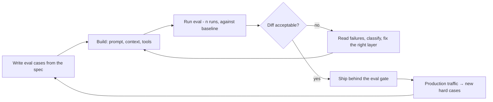

# Evaluation Fundamentals

This chapter has been foreshadowed since fnd-01 called evals "the moat," and every chapter since has ended some argument with "…and your eval decides." Now the debt gets paid. Evaluation is the discipline that replaces the correctness guarantees you lost when you adopted a probabilistic component (fnd-02): you cannot assert `output == expected`, so you measure pass rates over distributions instead — statistical process control where unit tests used to be. The teams that internalize this ship confidently and adopt every new model in days; the teams that don't iterate by vibes, fear their own prompt changes, and re-litigate quality in every sprint review. This chapter covers what an eval *is* (a task definition made executable), the anatomy and scoring taxonomy, the statistics you need (small but non-optional), eval-driven development as the working loop, and the pathologies — because measurement systems fail in their own characteristic ways, and Goodhart is always waiting. Everything here is evergreen; it will outlive every model in your current portfolio.

## Intuition: the executable definition of "good"

An eval is three things at once, and all three framings earn their keep:

**It's your test suite, statistically generalized.** A unit test asserts one input yields one output. An eval asserts a *distribution* of inputs yields acceptable outputs at an acceptable *rate* — the correct generalization when the component under test is sampled, not computed (fnd-08). Everything you know about testing transfers with this one adjustment: coverage thinking, regression protection, CI gating (evl-06) — just with pass rates and confidence instead of green checkmarks.

**It's your product spec, made executable.** "The summarizer should be accurate and concise" is a wish. Fifty inputs with expected behaviors and a scoring function is a *specification* — the only kind an LLM system can be held to, and usually the first time the team discovers it disagrees about what "good" means. The act of writing eval cases surfaces requirement ambiguity better than any design review; teams routinely report the eval-writing session was worth more than the eval.

**It's the asset that appreciates.** Models churn quarterly (api-06); prompts get rewritten (api-02); providers deprecate (api-06). Through all of it, the eval — your accumulated, executable knowledge of what your product must do and where it breaks — transfers unchanged and *gains* value with every hard case added. This is the mechanism behind fnd-01's moat claim: when a new model ships, the team with evals knows within a day whether to adopt; the team without re-tests by anecdote for weeks. The eval is the durable artifact; everything else is configuration.

## Anatomy of an eval

Every eval, from a 10-case smoke check to a benchmark suite, has three parts:[^anthropic-evals][^openai-evals]

- **The dataset:** inputs paired with expected outcomes — exact answers where they exist, acceptable-behavior descriptions where they don't, and *rubrics* where quality is graded. Composition rules from everything you've learned: representative of real traffic (fnd-02's distribution-shift lesson), including the hard tail (fnd-09's jaggedness — easy-case evals measure nothing), including abstention cases ("should say it doesn't know" — fnd-09's doctrine), and *held out* from anything that tuned the system (fnd-02's leakage discipline; the deep treatment is evl-02).
- **The scoring method:** the function from (input, output, expected) to a score. The taxonomy below — choosing it is the design decision.
- **The harness:** the machinery that runs inputs through your *actual system* (same prompts, same parameters, same gateway — api-01's logs make this natural), applies scoring, aggregates statistically, and reports diffs against baselines. Your api-05 lesson applies: harnesses run on batch APIs at half price.

The unit of measurement deserves emphasis: **evaluate the system, not the model.** Your product is prompt + model + parameters + retrieval + validation (modules 2–3); eval results are properties of that assembly. Swapping any component — including "just a prompt tweak" — is a new system that inherits nothing from the old one's scores.

## The scoring taxonomy

Four families, in order of preference — use the cheapest one that captures your definition of good:

1. **Programmatic/exact scoring:** string match, schema validation (api-03), code execution (does it run? do tests pass?), numeric tolerance, regex on required elements. Cheap, deterministic, objective — *always* prefer designing tasks so this works: structured outputs exist partly to make evaluation programmatic (a typed extraction is exactly checkable; free-prose "analysis" is not). The fnd-09 insight operationalized: cheap verification is a design choice.
2. **Statistical/multi-sample scoring:** pass@k (does any of k samples pass — natural for code), n-run pass rates (fnd-08's discipline), consistency measures (do repeated runs agree — disagreement is free uncertainty signal, fnd-08's self-consistency logic inverted into a metric).
3. **Model-graded scoring (LLM-as-judge):** a model scores outputs against a rubric — the only scalable option for fluency, helpfulness, groundedness, tone. Powerful and *dangerous*: your judge is a reward model, and everything fnd-07 taught about reward hacking applies to it — judges have position bias, verbosity bias, sycophancy toward stated preferences. It gets its own chapter (evl-03); the rule for now: never deploy a judge you haven't validated against human labels.
4. **Human scoring:** the ground truth for everything above, and the calibration source for judges — expensive, slow, reserved for what nothing else can score and for periodically auditing that your automated scoring still agrees with humans.

Metrics vocabulary, briefly: **pass rate** (the workhorse), **precision/recall per field** for extraction (api-03's jagged-fields lesson — aggregates hide the failing field), and for any judgment task, the confusion-matrix instinct you already have. What matters is less the metric than the *decomposition*: per-case results you can read, per-category rollups you can act on, and a headline number you deliberately distrust (HELM's multi-metric framing exists because single numbers hide everything interesting[^liang-helm]).

## The statistics you actually need

Small, non-optional, and routinely skipped:

- **Variance is real; single runs are noise.** Outputs are sampled (fnd-08); a 40-case eval run once has huge error bars. Run flaky-adjacent cases n times; report pass rates with spread; treat a 3-point improvement on one run as what it is — indistinguishable from nothing. (Your api-02 exercise made this visceral: 85%±9% vs. one run of 88% is a coin flip, not a result.)
- **Sample size intuition:** with 50 cases, each case is 2 points of pass rate — differences under ~8–10 points are within noise at that size. You don't need power analysis; you need the reflex "how many cases would have to flip for this delta, and could that be chance?" More cases where decisions are close; fewer where the gap is obvious.
- **Slice before you celebrate:** aggregate improvements routinely hide subgroup regressions (fnd-09's jaggedness, evl-edition — the api-06 upgrade example: +6% overall, three task types broken). Per-category reporting is the difference between an eval and a scoreboard.
- **The baseline discipline:** every result is a *diff* against a recorded baseline (fnd-02's experiment log, final form). "The eval says 82%" means nothing; "82% vs. 79% baseline, with the delta concentrated in long-document cases, n=5 runs" is knowledge.

## Eval-driven development

The working loop that makes all of this pay:

*The loop every LLM feature should live in — note evals precede building, not follow it:*

Three habits distinguish teams that do this well. **Evals before building** (the api-02 doctrine): ten cases written from the spec cost an hour and immediately expose ambiguity; they also prevent the demo-quality trap (fnd-01) by defining done before the demo defines optimism. **Failure reading as the core skill:** when the eval fails, *read the transcripts* — fnd-09's failure vocabulary tells you which layer to fix (missing knowledge → retrieval; precision → tools; ambiguity → the spec; capability → the model), and api-02's plateau tree operationalizes it. Skipping transcript-reading to twiddle prompts is the field's most common wasted week. **Production feeds the eval:** every real failure becomes a case (evl-02's flywheel); the eval grows monotonically harder and more representative — this is the appreciation mechanism.

And the cultural point, because it decides adoption: evals are not bureaucracy taxing velocity — they are what *makes* velocity safe. A team with eval gates changes prompts fearlessly and adopts models in days (api-06's bake-offs are just eval re-runs). The tax is vibes-testing every change forever; the eval is the refund.[^husain-evals]

## The pathologies

Measurement systems fail characteristically; you've met every mechanism already:

- **Eval overfitting:** iterate against the same 50 cases long enough and you've tuned to *them*, not the task — fnd-02's validation-set leakage, at the prompt layer. *Defense:* held-out sets touched rarely; periodic fresh-case injections; production sampling as ground truth (evl-05).
- **Contamination:** public benchmark data in training corpora (fnd-06) — why vendor scores are advertising and your private eval decides (api-06). Your *own* eval contaminates too: cases pasted into prompts as few-shot examples (api-02) are no longer test cases.
- **Goodharting:** any metric optimized hard enough diverges from intent — fnd-07's reward hacking, now aimed at *your* metric. A verbosity-biased judge breeds verbose outputs; an exact-match metric breeds format-gaming. *Defense:* multiple metrics in tension (accuracy + conciseness + groundedness), periodic human audits, and healthy suspicion of any metric that improves too smoothly.
- **Spec drift:** the product evolved; the eval didn't; now it enforces last quarter's requirements. *Defense:* eval review as part of feature planning — cases have owners and expiry dates like any spec.
- **The unread eval:** dashboards nobody opens, gates nobody enforces. An eval that doesn't block ships or trigger investigations is documentation cosplay. Wire it into CI (evl-06) or admit you don't have one.

> **Note:** these pathologies are why "we have evals" is not a binary. The maturity ladder runs: no evals → demo cases → representative suite with baselines → held-out sets with n-run statistics and slicing → production-fed flywheel with human-audited judges and CI gates. Each rung catches failures the previous one manufactures.

## Production engineering perspective

- **Budget evals as infrastructure, not overhead:** the mature ratio surprises newcomers — strong teams spend a comparable order of effort on eval machinery as on the features it protects, and report it as their highest-leverage spend.[^husain-evals] The economics work because evals amortize across every future change (api-05: run them on batch, they're cheap in dollars — the investment is in *cases and scoring design*).
- **Every layer gets its eval:** retrieval quality separate from generation quality (rag-07's decomposition), extraction per-field (api-03), judge-vs-human agreement (evl-03), router escalation precision (api-06's cascades), end-to-end task success. Aggregate-only evals tell you *that* something broke, never *what* — the layered suite is your bisection tool.
- **Evals are the contract surface between roles:** PMs express requirements as cases; engineers make them pass; the suite is the shared, executable truth. Teams that adopt this stop having the "is it good enough?" meeting.
- **The gates, concretely:** prompt changes (api-02), parameter changes (fnd-08), model-version adoptions (fnd-07's drift, api-06's process), schema changes (api-03), quantization/engine changes (api-07) — every one is a behavior deploy, every one goes through the suite. evl-06 wires this into CI; this chapter's job is that you already believe it.

## Historical evolution

Academic benchmarking (fixed test sets, leaderboards) dominated until it collided with fnd-06's contamination and fnd-09's saturation — by 2023, "benchmark score" and "product quality" had visibly decoupled, and HELM's holistic multi-metric framing marked the field admitting single numbers were lying.[^liang-helm] **2023–2024:** the practitioner turn — LLM-as-judge made subjective scoring scalable (evl-03), tracing platforms made production data harvestable (evl-04), and "evals" became product-engineering vocabulary rather than research vocabulary, with an emerging consensus canon of practice.[^husain-evals][^chang-survey] **2024–present:** evals professionalize into the hiring signal for AI engineering roles (fro-05 will confirm), CI integration becomes standard (evl-06), and the frontier moves to online evaluation and continuous feedback (evl-05). The arc: evaluation migrated from *measuring models* (research) to *specifying products* (engineering) — the version this chapter teaches.

## Common misconceptions

- **"We tested it and it works."** You sampled it and it worked *then* (fnd-08). Without cases, baselines, and n-runs, "tested" means "demoed."
- **"Evals slow us down."** Inverted: evals are what make change cheap. The slow team is the one vibes-testing every prompt tweak and freezing in fear before model migrations.
- **"Our task is subjective — it can't be evaled."** Subjective ≠ unmeasurable: rubric-guided judges validated against human labels (evl-03), pairwise preference rates, and property checks (grounded? cited? within length?) all quantify "subjective" quality. If humans can tell good from bad, an eval can be built; if they can't, the *product spec* is the problem.
- **"The benchmark says the model is better, so our product will be."** Contamination, saturation, distribution mismatch, and the system-vs-model distinction each independently break that inference (fnd-06, fnd-09, api-06 — now unified).
- **"100% pass rate means we're done."** It means your eval is too easy — it stopped containing the failing frontier. A healthy suite always has a hard tail failing; that tail is your capability map (fnd-09) and your roadmap input.
- **"We'll add evals once it's stable."** It becomes stable *because* of evals. Pre-stability is exactly when regressions are most frequent and most invisible.

## Failure modes and trade-offs

- **Eval theater** — suites that exist but don't gate; dashboards unread. *Fix:* CI wiring (evl-06), failure = blocked ship, or delete the suite honestly.
- **The easy-case suite** — high pass rates, no hard tail, no abstention cases; production failures the eval never predicted. *Fix:* fnd-09's probe discipline; production-failure harvesting; deliberately adversarial cases (sec-04 extends this).
- **Judge drift** — the model grading your outputs changed (fnd-07) and your "quality" metric moved without your system changing. *Fix:* pinned judge versions, human-agreement audits on a cadence (evl-03).
- **Metric monoculture** — one number optimized into Goodhart territory. *Fix:* metrics in tension; slicing; human audit sampling.
- **Cost/coverage trade-off** — full suites on every commit are slow and expensive; sparse suites miss regressions. *Resolution:* tiered suites — smoke (fast, every change), full (daily/pre-release, on batch), deep (per model adoption) — evl-06's architecture.
- **The unfalsifiable rubric** — "score 1–10 for quality" judges everything and specifies nothing. *Fix:* rubrics as behavioral checklists (contains X? avoids Y? cites source?), which also transfer to judges better (evl-03).

## Best practices

- **Write ten cases before writing the prompt** — from the spec, with expected behaviors, including two hard and one abstention case. One hour; permanent asset.
- **Score programmatically wherever design permits** — and design so it permits (structured outputs, required citations, checkable properties).
- **Report diffs, not scores:** baseline, n-runs, spread, per-slice — the four-part result format that means something.
- **Read failure transcripts before touching anything** — classify by layer (knowledge/precision/capability/spec) and fix that layer.
- **Feed production failures into the suite weekly;** retire stale cases deliberately; keep a held-out set you touch quarterly.
- **Put every behavior deploy through the gate** — prompts, params, models, schemas, engines. No exceptions is what makes it cheap.
- **Audit automated scoring against humans on a cadence** — judges especially; your metrics are models too, and models drift.
- **Keep the hard tail failing** — a saturated eval is a retired eval; the failing frontier is your roadmap (fnd-09's living capability map, now formalized as infrastructure).

## Real-world examples

**The team that adopted a model in one day.** A provider ships a major release (api-06's trigger). Team A runs its layered suite — 400 cases, batch API, n=5, sliced by task type — by lunch: +4 points aggregate, but the extraction slice regressed 6 points on dates; they pin the old model for the extraction route, adopt everywhere else, file the date-regression cases upstream, done by Friday. Team B, evals-less, spends three weeks in anecdote wars ("it feels better?") and adopts blind; the date regression ships and a customer finds it. Identical inputs, identical model — the eval was the entire difference. This is fnd-01's moat, observed in the wild.

**The 100% eval that predicted nothing.** A support-bot team celebrates a saturated eval — 100% for a month — while production complaints climb. Audit: the suite was 40 easy cases written on day one, all happy-path, no hard tail, no abstention checks; the product had meanwhile grown into territories (multi-question tickets, policy edge cases) the eval never sampled. The rebuild follows this chapter: production-failure harvesting (every complaint becomes a case), fnd-09 probe structure, held-out set, per-category slicing. Pass rate drops to 71% — and *finally means something*; three months of the flywheel later it's back to 90% with the product measurably better. A saturated eval isn't success; it's a broken instrument reading zero.

**The judge that optimized for adjectives.** A content team's judge-scored "quality" metric climbs steadily as writers... learn the judge: outputs grow florid (verbosity bias) and increasingly mirror the rubric's own vocabulary back at it (fnd-07's reward hacking, aimed at the team's own metric). Human audit — the cadence this chapter prescribes — catches the divergence: judge scores up 15%, human preference flat. Fixes: rubric-as-checklist rewrite, length-controlled comparisons, quarterly human calibration. Goodhart's law doesn't spare metrics just because you wrote them.

## Interview questions

1. **"Why do LLM products need evals when they have tests?"** — Model answer: tests assert deterministic equality; LLM outputs are samples from distributions (temperature, floating-point, provider drift), so the correct assertion is statistical — pass rates over representative inputs at acceptable rates. Evals are the test suite generalized: same coverage and regression discipline, but with datasets instead of cases, scoring functions instead of assertions, and n-run statistics instead of green checks. Everything else follows: CI gating on diffs, baselines, slicing. Without them, every change is vibes-tested and every model migration is a leap of faith.

2. **"Walk me through designing an eval for a new feature."** — Model answer: start from the spec — write 10–50 input/expected-behavior cases *before building*, which immediately surfaces requirement ambiguity. Composition: representative of expected traffic, deliberately including the hard tail and abstention cases. Scoring: cheapest method that captures 'good' — programmatic first (design outputs to be checkable: schemas, required citations), model-graded with a human-validated rubric only for genuinely subjective dimensions. Harness: runs the *real system*, n runs per case, reports diffs against baselines with per-category slices, on the batch API. Then the flywheel: production failures become cases weekly.

3. **"Your eval improved 3 points after a prompt change. Ship it?"** — Model answer: not on that evidence alone. First, statistics: at typical suite sizes a 3-point delta is inside single-run noise — need n runs with spread, and the case-flip arithmetic (3 points on 50 cases is ~1.5 cases — chance territory). Second, slicing: aggregate gains routinely hide subgroup regressions, so check per-category diffs. Third, cost: did output length or retry rate move? If the delta survives replication and slicing and doesn't cost regressions elsewhere, ship — behind the same gate every prompt change passes.

4. **"How do evals go wrong?"** — Model answer: the same ways all measurement does. Overfitting: iterating against the same cases tunes to them — held-out sets and fresh-case injection defend. Contamination: test cases leaking into prompts or training. Goodharting: any single metric optimized hard diverges from intent — judge biases breed verbose outputs, exact-match breeds format gaming; defend with metrics in tension and human audits. Spec drift: the eval enforcing last quarter's requirements. And eval theater: suites that don't gate anything. The meta-point: your eval is itself a system needing maintenance, baselines, and audits.

5. **"The PM says our task is too subjective to eval. Respond."** — Model answer: if humans can distinguish good from bad outputs, that judgment can be systematized — rubric-guided LLM judges validated against human labels, pairwise preference rates, and decomposed property checks (grounded in the source? within length? addresses the question? cites correctly?) each convert 'subjective' into measurable dimensions. The validation step is non-negotiable — an unvalidated judge is an opinion generator. And if humans genuinely *can't* agree on good vs. bad, the problem isn't evaluation — it's that the product lacks a spec, which the eval-writing exercise just usefully exposed.

6. **"What makes evals 'the moat'?"** — Model answer: they're the only major asset that appreciates while everything else churns. Models get swapped (deprecations, better options quarterly), prompts get rewritten per model, infrastructure commoditizes — but the executable definition of what *your* product must do, accumulated from your production's hardest cases, transfers across all of it and compounds with every failure harvested. Operationally it converts landscape churn from threat to opportunity: model adoption in a day instead of weeks, fearless prompt iteration, migration as a re-run instead of a rewrite. Competitors can call the same APIs; they can't download your eval suite.

## Exercises and mini-project

**Exercises**

1. Take a feature you know well and write its 10-case starter eval: 6 representative, 2 hard-tail, 2 abstention. For each: input, expected behavior, scoring method from the taxonomy. Note every spec ambiguity the exercise surfaced.
2. A 40-case eval, single run, shows prompt B beating prompt A 82% to 77%. Compute how many case-flips that is; state what you'd need to conclude anything; design the deciding experiment.
3. Classify the right scoring method (and why) for: JSON extraction; code generation; support-answer helpfulness; summary faithfulness to a source; classifier routing decisions.
4. Your aggregate pass rate rose 5 points but you haven't sliced. List the three slices you'd check first for this curriculum's canonical reasons (fnd-09, api-03, fnd-07).
5. Write the one-paragraph "eval maturity" assessment of a team you've worked on (any software team — the ladder maps): which rung, what the next rung costs, what it catches.

**Mini-project: the eval harness.** Consolidate everything you've built (api-01 client, api-02 prompt lab, api-03 extraction eval) into a real harness: (a) a case format (YAML/JSON: input, expected, scoring method, category, source); (b) a runner that executes n runs per case through your gateway, on the batch API where available, scoring programmatically (schema checks, exact match) with hooks for judge scoring later; (c) baseline storage and a diff report: aggregate + per-category + spread + case-level failures; (d) migrate your existing 60+ cases from earlier projects into it; (e) run one real experiment end-to-end (a prompt variant or model swap from api-06's bake-off) and produce the four-part result: diff, n-runs, spread, slices; (f) memo: what the harness caught that eyeballing missed. Target: 4 hours. Success criterion: a harness you'll actually keep using — the next four modules assume it exists.

**Capstone extension:** this harness *is* the capstone's evaluation layer — evl-02 fills it with a proper dataset, evl-03 adds validated judges, evl-06 wires it into CI, and every module's quality claims run through it.

## Revision summary

- An eval = test suite generalized to distributions (pass rates, n-runs) + product spec made executable (cases surface ambiguity) + the appreciating asset (transfers across model/prompt churn; compounds with harvested failures). Evaluate the system, not the model.
- Anatomy: dataset (representative + hard tail + abstention, held out from tuning) + scoring + harness (real system, statistical aggregation, baselines, batch-API economics).
- Scoring taxonomy in preference order: programmatic (design for checkability) → statistical (pass@k, n-run, consistency) → model-graded (powerful; validate against humans; it's a reward model with reward-model failure modes) → human (ground truth and calibration source).
- Statistics: single runs are noise; case-flip arithmetic before believing deltas; slice before celebrating; every result is a diff against a baseline.
- The loop: cases before building → run → read failure transcripts → fix the right layer (knowledge/precision/capability/spec) → gate ships → harvest production failures. Pathologies: overfitting, contamination, Goodhart, spec drift, eval theater — your eval is a system that itself needs maintenance and audits.

## Flashcards

| Q | A |
|---|---|
| An eval, in one sentence? | An executable specification: a dataset of inputs with expected behaviors, a scoring method, and a harness that measures the real system's pass rate statistically. |
| Why pass rates instead of assertions? | Outputs are samples from distributions — correctness is statistical (fnd-08), so measurement must be too. |
| The scoring taxonomy in preference order? | Programmatic → statistical (n-run, pass@k) → model-graded (validated against humans) → human. |
| Why "evaluate the system, not the model"? | Results are properties of prompt+model+params+retrieval+validation together — any component change is a new system. |
| The four-part result format? | Diff vs. baseline, n-run pass rate, spread, per-category slices. |
| Three dataset composition rules? | Representative of real traffic; include the hard tail and abstention cases; held out from anything that tuned the system. |
| The eval pathologies? | Overfitting to cases, contamination, Goodharting (judge/metric gaming), spec drift, eval theater. |
| What does a saturated (100%) eval mean? | The instrument broke — it no longer contains the failing frontier; harvest harder cases. |
| Why are evals "the moat"? | The only asset that appreciates through model/prompt/infra churn — executable product knowledge that makes every future change cheap. |
| What must happen before trusting an LLM judge? | Validation against human labels, plus ongoing agreement audits — the judge is a reward model and drifts like one. |
| The eval-driven loop's first step? | Write cases from the spec *before* building — cheapest ambiguity detector there is. |

## Further reading

- **Official docs:** Anthropic's empirical-evaluation guide[^anthropic-evals]; OpenAI's evals guide[^openai-evals] — both short; read both before the mini-project.
- **Papers:** Liang et al., HELM (2022)[^liang-helm] — the multi-metric argument, §1–2; Chang et al., evaluation survey (2023)[^chang-survey] — reference map of the territory.
- **Books:** none yet worth the shelf space; the field's canon is living documents.
- **Talks:** any recent "how we do evals" engineering talk from a serious AI product team — the practices converge on this chapter's loop, which is itself evidence.
- **Tutorials:** Husain, "Your AI Product Needs Evals"[^husain-evals] — [T5, flagged: the practitioner canon; no higher-tier source covers the workflow this concretely] — pairs exactly with the mini-project.

## Check your understanding

1. Give the three framings of what an eval is, and the argument each one wins (with whom: an engineer, a PM, a CFO).
2. Reconstruct the eval-driven loop from memory, including where failure-transcript reading sits and what the four failure layers are.
3. Your judge-scored quality metric rose 15% this quarter. Name the pathology to rule out and the audit that rules it out.
4. Defend the claim "a healthy eval always has failures" — connect to fnd-09's capability map.
5. This chapter is evergreen. Trace which earlier chapters supplied its load-bearing mechanisms (fnd-02, fnd-07, fnd-08, fnd-09) — the module-1-cohesion test, applied to module 5's foundation.

## Sources

[^anthropic-evals]: [T1] Anthropic. "Create strong empirical evaluations." https://docs.anthropic.com/en/docs/build-with-claude/develop-tests (accessed 2026-07-09)
[^openai-evals]: [T1] OpenAI. "Evaluating model outputs." https://platform.openai.com/docs/guides/evals (accessed 2026-07-09)
[^liang-helm]: [T2] Liang et al. (2022). "Holistic Evaluation of Language Models (HELM)." arXiv:2211.09110. https://arxiv.org/abs/2211.09110 (accessed 2026-07-09)
[^chang-survey]: [T2] Chang et al. (2023). "A Survey on Evaluation of Large Language Models." arXiv:2307.03109. https://arxiv.org/abs/2307.03109 (accessed 2026-07-09)
[^husain-evals]: [T5 — practitioner canon; no higher-tier source covers the workflow this concretely] Husain, H. (2024). "Your AI Product Needs Evals." https://hamel.dev/blog/posts/evals/ (accessed 2026-07-09)
