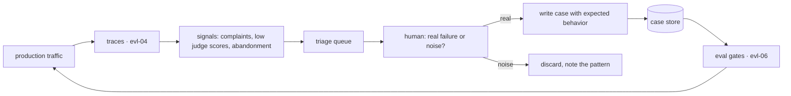

# Building Eval Datasets

[evl-01](evl-01-evaluation-fundamentals.md) argued that evals are the core asset of an LLM product. This chapter builds the half of an eval that actually carries the weight: **the dataset**. Scoring functions are largely mechanical; the dataset is where judgment lives, and it is where evals silently fail. A suite of forty easy, synthetic, happy-path cases will report 96% forever while your users churn — and it will do so with the same authority as a well-built suite. So the questions here are: where do cases come from and what does each source systematically bias, how do you label when humans themselves disagree, how do you prevent the dataset from leaking into the thing it measures, and how do you keep it alive as the product changes. The target artifact is the case data model from [eng-03](../../engineering/eng-03-eval-harness-architecture.md); this chapter is how you fill it responsibly.

## Intuition: a curated sample of the job

An eval dataset is a **sample of the work your system does, chosen to be representative of what matters** — which makes dataset construction a sampling problem wearing an editorial hat. Two consequences follow immediately, and they explain most of what comes later.

**Composition is the specification.** Whatever your cases contain is what "good" means operationally; whatever they omit is invisible to every measurement you take. A suite with no multi-turn cases cannot detect multi-turn regressions; a suite with no abstention cases silently blesses a system that hallucinates on out-of-scope questions ([rag-07](../03-retrieval/rag-07-rag-evaluation.md)). This is the sharper version of evl-01's "the eval is your product spec, made executable" — the spec is not the rubric, it is **the distribution of cases**.

**Bias enters through sourcing, not through scoring.** Teams scrutinize their metrics and rarely scrutinize where the cases came from. But a dataset harvested only from production logs inherits survivor bias; a dataset generated by a model inherits that model's distribution; a dataset written by the engineer who built the feature inherits their mental model of how it will be used. None of these are disqualifying — all of them are *correctable once named*, and uncorrectable while unnamed.

The practical stance: build from **multiple sources deliberately**, knowing what each one over- and under-samples, rather than from whichever source is cheapest.

## The three sources and what each biases

**Production harvest — the highest-value source.** Real queries carry the true distribution, including the messy, under-specified, and adversarial inputs no one would think to write. Harvest from traces ([evl-04](evl-04-tracing-observability.md)): user complaints, thumbs-down, regenerations, abandonments, escalations to humans, and low judge scores from online sampling ([evl-05](evl-05-online-evaluation.md)).

Its bias is **survivorship**: production only contains queries users *chose to try*, which reflects what they already believe your system can do. A system bad at multi-step questions trains its users not to ask them, so those questions vanish from logs — and your eval concludes multi-step questions aren't a problem. Correct by deliberately adding capabilities you *want* to support but currently handle poorly.

**Synthetic generation — cheap volume with a systematic bias.** Ask a model to generate cases: questions from documents, variations on a seed set, inputs matching a description. It scales instantly and is genuinely useful for coverage of categories you'd otherwise under-sample.

Three biases, all correctable:

- **The from-the-answer bias** (severe for RAG): a question generated *from* a passage inherits that passage's vocabulary and framing, making it far easier than a real user's question about the same fact ([rag-07](../03-retrieval/rag-07-rag-evaluation.md) documents this costing a team 37 points of measured recall). Mitigate by instructing paraphrase away from the source, conditioning on user personas, and requiring the generator not to see the answer where possible.
- **Distribution flattening**: generated inputs are cleaner, better-punctuated, and more uniform than real ones — no typos, no half-sentences, no pasted stack traces.
- **Self-preference**: if the generator is the same model family being evaluated or judged, the cases and answers drift toward what that family finds natural.[^zheng-judge] Use a different model to generate than to evaluate where it matters.

The non-negotiable safeguard: **human-verify a sample.** Read 20 generated cases and ask "would a real user write this?" If not, the generation prompt needs work — and you've just learned something about your users.

**Expert authoring — the only source for the hard tail.** Some cases cannot be harvested (they've never occurred) or generated (nothing to generate from): the fnd-09-style capability probes at the edge of what the system can do, out-of-corpus abstention cases, adversarial and safety cases ([sec-04](../07-safety-security/sec-04-red-teaming.md)), and cases encoding a policy decision ("when a user asks X, we must respond Y"). These are slow to write and disproportionately valuable, because they are exactly the cases that distinguish a suite that measures quality from one that measures happy paths.

A workable composition for a mature suite: roughly half harvested, a quarter synthetic (verified), a quarter expert-authored — with the exact mix driven by which categories your slicing reveals as thin.

## Labeling as a measurement problem

Once cases exist, someone must say what a correct response looks like. Treat this as measurement, not clerical work, because labels have error bars.

**Rubric before labeling.** Write down what makes a response correct *before* labeling begins — as behavioral checks, not vibes ("cites at least one provided document", "does not recommend a dosage", "answers in under 100 words"). Rubric-first labeling produces consistent labels and doubles as the judge rubric later ([evl-03](evl-03-llm-as-judge.md)).

**Measure agreement, and treat disagreement as data.** Have two people label an overlapping subset (20–30 cases is enough to be informative) and compute agreement. Cohen's kappa at intuition level: it corrects for agreement that would happen by chance, and roughly — below ~0.4 your labelers are applying different definitions, ~0.4–0.6 is workable but noisy, above ~0.7 is solid. The number matters less than the diagnostic: **low agreement means your rubric is ambiguous, and if humans can't agree, no judge and no model can be held to that standard.** Disagreement is a finding about your specification, not a labeling failure to paper over.

**Adjudicate and record the reasoning.** When labelers disagree, a third party resolves it *and writes down why* — that reasoning becomes rubric refinement. Over a few cycles this converges the rubric to something precise enough to automate.

**Ambiguity is itself a result.** Cases where thoughtful people genuinely disagree about the right answer should usually be *removed from the pass/fail suite* and kept in a separate "known ambiguous" set. Scoring a system against an ambiguous target adds noise that masks real movement — and the ambiguity is a signal that the product decision hasn't been made yet.

## Hygiene: contamination and held-out sets

The discipline that keeps numbers meaningful, inherited directly from [fnd-02](../01-foundations/fnd-02-ml-refresher.md)'s train/test separation and now operating at the prompt layer.

**Self-contamination is the common form.** An eval case pasted into a prompt as a few-shot example is no longer a test case — the system was built with the answer. This happens innocently: an engineer debugging a failure adds that exact input as an example, and the suite reports improvement. **Rule: cases used in prompts are removed from the suite** (or, better, few-shot examples come from a separate pool that is never a test case).

**Held-out partitions.** Iterating against the same cases eventually tunes to *them* rather than to the task — evl-01's eval-overfitting pathology. Maintain a partition you touch rarely (quarterly, or before major releases), and treat a gap between working-set and held-out scores as the measurement of how much you've overfit. In [eng-03](../../engineering/eng-03-eval-harness-architecture.md)'s case model this is the `held_out` flag, and it deserves tooling support so it can't be used accidentally.

**Fine-tuning contamination.** If eval cases are also in your fine-tuning data ([ftn-03](../08-fine-tuning/ftn-03-data-for-fine-tuning.md)), the model has memorized the answers and your eval measures nothing. Decontaminate by exact and near-duplicate matching before any training run — and record that you did.

**Deduplication.** Near-duplicate cases silently weight one scenario more heavily and inflate confidence: forty variations of the same question look like forty cases and behave like one. Dedup on normalized text or embedding similarity at ingestion.

**Public benchmark leakage.** Cases drawn from public datasets may be in the model's pretraining corpus ([fnd-06](../01-foundations/fnd-06-llm-pretraining.md)). For measuring *your* system this matters less than for model comparison, but it's a reason to prefer your own data — which you have and competitors don't (evl-01's moat argument).

## The lifecycle and the flywheel

Datasets are not built once; they are farmed. The mechanism that keeps a suite honest over time:

*The flywheel — production failures become cases, with human verification as the load-bearing tap:*

**Cadence beats volume.** A weekly triage of the last week's failures, adding three to ten cases, compounds into a suite that is representative and hard within two quarters. A quarterly heroic effort does not — the failures have aged out of memory and the context needed to write a good case is gone.

**Cases have owners and expiry.** Per [eng-03](../../engineering/eng-03-eval-harness-architecture.md)'s model, every case carries an owner and a `review_after` date. Products change; a case encoding last year's policy becomes a test that *punishes* correct behavior. Reviewing cases is as necessary as reviewing code.

**Retire saturated categories.** When a category has passed 100% for several months, it's no longer providing information — move it to a regression archive that runs less often, and spend the eval budget on categories that still fail. Evl-01's rule restated: **a healthy suite always has failures**; the frontier of failure is where the information is.

**Size guidance.** For detecting a ~10-point movement in a category you need roughly 30+ cases in that category (evl-01's flip-count arithmetic); below that, per-slice numbers are anecdote. Total suite size follows from how many categories you need to resolve — typically 100–500 cases for a mature product, not thousands.

## Production engineering perspective

- **Cases live in version control**, reviewed like code. A PR that changes an expected behavior is a product decision and deserves the same scrutiny as a code change — this is where the "eval as executable spec" claim becomes literal.
- **Provenance on every case** (`source: production | synthetic | authored`) is what makes bias auditable later: when a suite starts disagreeing with reality, the first query is the source distribution.
- **Labeling is a budget line.** Human labeling is the expensive part of evaluation; plan for it, and use judges to *extend* human labels rather than replace them ([evl-03](evl-03-llm-as-judge.md)).
- **The dataset is a shared artifact across roles.** PMs contribute cases as requirements, support contributes them as complaints, engineers contribute them as regressions. A suite that only engineers touch will only encode what engineers imagine.
- **Datasets transfer across models; prompts don't** ([api-06](../02-llm-apis/api-06-model-selection.md)). This asymmetry is why dataset investment compounds while prompt investment depreciates — worth saying out loud when justifying the labeling budget.

## Historical evolution

**Pre-LLM ML:** dataset construction is a mature discipline — train/validation/test splits, annotation guidelines, inter-annotator agreement, and adjudication are standard practice with decades of literature. **2022–2023:** LLM application teams largely start over, evaluating by vibes and demo cases, because the barrier to a working prototype dropped below the barrier to a dataset. **2023:** the practitioner consensus forms that evals are the differentiator, and dataset construction is rediscovered — with LLM-generated cases as a genuinely new tool, alongside a new failure mode (models generating cases for models to be judged by models[^zheng-judge]). **2023–2024:** the flywheel pattern — production failures into cases, continuously — becomes standard practice among teams shipping seriously,[^husain-evals] and data-quality research confirms that curation beats volume for training sets too.[^liu-alignment-data] **2024–present:** tooling matures (case stores, annotation queues, provenance tracking), and the field converges on what pre-LLM ML already knew: **the dataset is the hard part, and the discipline transfers almost unchanged.**

## Common misconceptions

- **"More cases is better."** Representative, hard, well-labeled cases are better. A thousand synthetic happy-path cases measure less than a hundred harvested failures — and cost more to run.
- **"Synthetic data solves the dataset problem."** It solves *volume*, at the price of systematic bias — from-the-answer easiness, flattened distribution, self-preference. Useful as a supplement with human verification; misleading as a foundation.
- **"Low inter-annotator agreement means we need better labelers."** It usually means the rubric is ambiguous. If people who understand the product disagree, the spec is underdetermined — that's the finding, and fixing the rubric fixes the labels.
- **"We can reuse our few-shot examples as test cases."** That is contamination by definition: the system was built with those answers, so passing them measures nothing.
- **"The suite is done."** A static suite decays: the product changes, users change, and the cases that once probed the frontier become trivia. Suites are farmed weekly, not shipped once.
- **"Ambiguous cases make the eval more realistic."** They make it noisier. Move genuine ambiguity to a separate set and resolve the product question, rather than scoring against a target nobody agrees on.

## Failure modes and trade-offs

- **The easy-case suite** — green forever, production unhappy. *Detection:* pass rates near 100%, case `source` distribution dominated by synthetic/authored-at-launch. *Fix:* flywheel harvesting; deliberately add currently-failing cases.
- **Survivorship blindness** — the suite mirrors what users already dared to ask, missing capabilities you want to grow into. *Fix:* author aspirational cases for target capabilities.
- **Silent contamination** — an eval case became a few-shot example; scores rise for no real reason. *Fix:* separate example pool, automated overlap check between prompts and case store.
- **Label drift** — different people labeled at different times against an evolving understanding, so the target moved without anyone deciding to move it. *Fix:* rubric versioning; re-label a sample when the rubric changes.
- **Suite bloat** — hundreds of near-duplicate cases making runs slow and expensive without adding signal. *Fix:* dedup at ingestion; archive saturated categories.
- **The labeling-cost trap** — the suite stops growing because labeling is expensive, so it silently stops representing the product. *Trade-off:* use judges to pre-label and humans to verify, accepting some noise in exchange for coverage — with the judge itself validated (evl-03).

## Best practices

- **Write ten cases from the spec before building the feature** (evl-01), then grow the suite from production weekly.
- **Source deliberately from all three channels** — harvested, synthetic (verified), expert-authored — and record `source` on every case.
- **Rubric first, then label**; double-label 20–30 cases, compute agreement, adjudicate with written reasoning, and treat low agreement as a spec defect.
- **Guard the held-out partition with tooling**, not discipline alone; measure the working-set/held-out gap as your overfitting indicator.
- **Automate contamination checks** — case text against prompt templates, and against fine-tuning corpora before any training run.
- **Deduplicate at ingestion** and keep per-category counts above ~30 for any category you want to read as a number.
- **Give every case an owner and a review date**; retire saturated categories to an archive tier.
- **Keep cases in version control and review expected-behavior changes as product decisions.**

## Real-world examples

**The suite that measured the wrong users.** A team builds a 200-case eval by generating questions from their documentation, reporting 94%. Support tickets tell a different story. The audit finds every case was written in documentation register — full sentences, official product names, correct terminology — while real users wrote fragments, internal nicknames, and pasted error text. The suite was measuring a user population that didn't exist. The rebuild harvests 80 real queries from logs, keeps 60 synthetic cases with paraphrase-forcing prompts, and adds 30 authored hard cases; the pass rate drops to 71% and *becomes informative*. Same system, honest instrument.

**The kappa that found a product bug.** Two labelers annotate 30 support-assistant responses for "acceptable"; agreement comes out around 0.35 — barely above chance. The instinct is to retrain the labelers. Reading the disagreements shows something else: they disagreed almost entirely on responses that *partially* answered a multi-part question, because the team had never decided whether partial answers were acceptable. That's a product decision nobody had made. Once decided ("partial answers must state what wasn't addressed"), agreement rises above 0.8 and the rubric gains a checklist item. The labeling exercise surfaced a specification gap that had been shipping for months.

**The contaminated improvement.** A prompt change lifts the eval from 82% to 91% and ships. Production quality is unchanged. The diff shows the engineer had added three few-shot examples while debugging — taken verbatim from failing eval cases. The suite dutifully reported that the system now handled those three cases. Fixes: few-shot examples drawn from a dedicated pool, an automated check flagging any overlap between prompt templates and the case store, and a re-run of the affected comparison. The nine-point gain was real for three inputs and zero for everything else.

## Interview questions

1. **"Where do eval cases come from?"** — Model answer: three sources with different biases. Production harvest is highest-value because it carries the true distribution including messy real inputs, but it suffers survivorship bias — users only ask what they think works, so capabilities you're bad at disappear from logs. Synthetic generation gives cheap volume and coverage, with systematic biases: questions generated from answers inherit their vocabulary and are far too easy, distributions get flattened, and self-preference creeps in if the generator matches the evaluated model. Expert authoring is the only source for the hard tail, abstention cases, and adversarial cases, since those have never occurred and can't be generated. A mature suite mixes all three deliberately, records provenance per case, and human-verifies a sample of anything synthetic.

2. **"Your labelers disagree. What does that tell you?"** — Model answer: usually that the rubric is ambiguous rather than that the labelers are bad. I'd compute agreement on an overlapping subset — kappa below ~0.4 means people are applying different definitions — then read the disagreements, because they cluster around the underspecified part of the spec. In practice that often surfaces a product decision nobody made, like whether partial answers count as acceptable. The fix is rubric refinement with written adjudication reasoning, then re-labeling. And genuinely ambiguous cases get moved out of the pass/fail suite, because scoring against a target thoughtful people dispute just adds noise that masks real movement.

3. **"How do you prevent eval contamination?"** — Model answer: several layers. Few-shot examples come from a dedicated pool that never overlaps the case store, with an automated check flagging any overlap — the common innocent path is an engineer debugging a failure and pasting that exact case in as an example. A held-out partition, tool-enforced rather than discipline-enforced, is touched rarely, and the gap between working-set and held-out scores measures how much I've overfit. Before any fine-tuning run, decontaminate training data against the eval set by exact and near-duplicate match. And deduplicate cases at ingestion, since near-duplicates silently over-weight one scenario.

4. **"How big should an eval suite be?"** — Model answer: driven by the granularity of decisions I need, not by a target number. For reading a category's pass rate as a number rather than an anecdote, I want roughly 30+ cases in that category — below that, a couple of flips looks like a trend. So total size follows from how many categories I need to resolve, typically 100–500 for a mature product. Beyond that, added cases mostly cost run time and money without adding signal, especially if they're near-duplicates. The composition matters far more than the count: representative distribution, hard tail included, abstention cases present.

5. **"What is the eval flywheel and why does cadence matter?"** — Model answer: production traces surface failure signals — complaints, thumbs-down, regenerations, abandonment, low online judge scores — which go to a triage queue where a human decides whether each is a real failure and, if so, writes it up as a case with expected behavior. Those cases enter the suite and gate future changes. Cadence matters because a weekly rhythm adding a handful of cases compounds into a representative, genuinely hard suite within a couple of quarters, while a quarterly push fails: by then the failures have aged out and nobody remembers the context needed to write a good case. It's maintenance, not enhancement — without it the suite decays into easy cases that pass while users complain.

6. **"Why do datasets matter more than prompts?"** — Model answer: they're the asset that appreciates. Prompts are calibrated to a specific model's post-training and need re-tuning on every migration, so that investment depreciates. A dataset — accumulated real failures with agreed expected behaviors — transfers unchanged across models, prompts, and architectures, and gets *harder and more representative* every week you farm it. That's why model adoption takes a day for a team with a good suite and weeks of anecdote for a team without one. It's also why I'd defend the labeling budget: it's the one line item that compounds.

## Exercises and mini-project

**Exercises**

1. For a customer-support assistant, list five capabilities that would be *systematically absent* from production logs due to survivorship bias, and how you'd source cases for them.
2. Write a synthetic-generation prompt for RAG eval questions that actively counters the from-the-answer bias — name each instruction and the bias it targets.
3. Two labelers agree on 24 of 30 binary labels. Compute raw agreement; explain why kappa would be lower, and what you'd do at kappa ≈ 0.45.
4. Design the contamination check between your prompt templates and case store: what you compare, how you normalize, and what the CI does on a hit.
5. Your suite has 400 cases, 340 passing consistently for six months. Propose a restructuring and justify what you'd stop running.

**Mini-project: build a real dataset.** For your capstone ([rag-05](../03-retrieval/rag-05-rag-pipeline.md)): (a) harvest 20 cases from your own logs or usage, prioritizing failures; (b) generate 20 synthetic cases with an anti-bias prompt, then human-verify all 20 and record how many you'd reject as unrealistic; (c) author 10 hard cases — edge, multi-turn, and out-of-corpus abstention; (d) double-label 25 cases with a second person (or a second pass a day later), compute agreement, adjudicate disagreements in writing, and revise your rubric; (e) implement `source`, `category`, `held_out`, and `owner` fields per [eng-03](../../engineering/eng-03-eval-harness-architecture.md)'s model, partition a held-out set, and run a contamination check against your prompts; (f) memo: your source mix, agreement number, what the disagreements revealed about your spec. Target: 4 hours. Success criterion: an agreement number you measured and at least one rubric change that came from a disagreement.

**Capstone extension:** this dataset populates the [eng-03](../../engineering/eng-03-eval-harness-architecture.md) case store, gates changes in [evl-06](evl-06-ci-for-llm-apps.md), calibrates judges in [evl-03](evl-03-llm-as-judge.md), and — decontaminated — supplies the eval half of any fine-tuning work in [ftn-03](../08-fine-tuning/ftn-03-data-for-fine-tuning.md).

## Revision summary

- The dataset is the eval's load-bearing half: composition *is* the specification, and whatever the cases omit is invisible to every measurement.
- Three sources with named biases — production harvest (true distribution, survivorship bias), synthetic (cheap volume; from-the-answer easiness, flattened distribution, self-preference; requires human verification), expert authoring (the only source for hard tail, abstention, and adversarial cases).
- Labeling is measurement: rubric first, double-label a subset, compute agreement, adjudicate in writing. Low agreement means an ambiguous rubric — usually an unmade product decision — and genuinely ambiguous cases belong outside the pass/fail suite.
- Hygiene: few-shot examples never come from the case store, held-out partitions are tool-enforced, fine-tuning data is decontaminated before training, and cases are deduplicated at ingestion.
- Lifecycle: weekly flywheel triage from production signals, owners and review dates per case, retirement of saturated categories, ~30+ cases per category you want to read as a number, and cases in version control reviewed as product decisions.

## Flashcards

| Q | A |
|---|---|
| Why is composition the specification? | Whatever the cases contain defines "good" operationally; whatever they omit cannot be measured or regressed against. |
| Bias of production-harvested cases? | Survivorship — users only ask what they believe works, so weak capabilities vanish from logs. |
| The from-the-answer bias? | Questions generated from a passage inherit its vocabulary, making them far easier than real user queries. |
| Non-negotiable safeguard for synthetic cases? | Human-verify a sample — "would a real user write this?" |
| What does low inter-annotator agreement mean? | The rubric is ambiguous, usually because a product decision was never made — not that labelers are bad. |
| Where do genuinely ambiguous cases belong? | Outside the pass/fail suite, in a separate set — scoring against a disputed target adds noise. |
| The most common contamination path? | An engineer pastes a failing eval case into the prompt as a few-shot example while debugging. |
| Minimum cases per category to read as a number? | Roughly 30+, per flip-count arithmetic; below that, per-slice results are anecdote. |
| Why does flywheel *cadence* matter? | Weekly triage compounds into a hard, representative suite; quarterly pushes fail because failure context has aged out. |
| What should happen to a category passing 100% for months? | Archive it to a lower-frequency tier — it no longer carries information; spend the budget where failures remain. |
| Why do datasets outvalue prompts? | Prompts are model-calibrated and depreciate on migration; datasets transfer unchanged and compound with every harvested failure. |

## Further reading

- **Official docs:** Anthropic's empirical evaluation guide[^anthropic-evals]; OpenAI's evals guide[^openai-evals] — both cover case construction concisely.
- **Papers:** Zheng et al. (2023)[^zheng-judge] — §4 for agreement methodology and self-preference effects; Liu et al., "What Makes Good Data for Alignment" (2023)[^liu-alignment-data] — quality-over-volume evidence that transfers to eval sets.
- **Books:** any standard treatment of annotation methodology from pre-LLM NLP — the discipline transfers almost unchanged, which is itself the lesson.
- **Talks:** none essential.
- **Tutorials:** Husain, "Your AI Product Needs Evals"[^husain-evals] — [T5, flagged: practitioner canon; no higher-tier source describes the flywheel workflow this concretely].

## Check your understanding

1. Name each case source and the specific bias it introduces, plus the correction for each.
2. Your labelers reach kappa 0.38. Give the three-step response, and say what you'd expect to learn.
3. Explain the two ways contamination enters an eval suite, and the tooling that prevents each.
4. Your suite reports 96% while support tickets climb. Give the audit you'd run on the *dataset* (not the system).
5. Why does this chapter claim datasets transfer while prompts don't — and what follows for how you budget?

## Sources

[^anthropic-evals]: [T1] Anthropic. "Create strong empirical evaluations." https://docs.anthropic.com/en/docs/build-with-claude/develop-tests (accessed 2026-07-10)
[^openai-evals]: [T1] OpenAI. "Evaluating model outputs." https://platform.openai.com/docs/guides/evals (accessed 2026-07-10)
[^zheng-judge]: [T2] Zheng et al. (2023). "Judging LLM-as-a-Judge with MT-Bench and Chatbot Arena." arXiv:2306.05685. https://arxiv.org/abs/2306.05685 (accessed 2026-07-10)
[^liu-alignment-data]: [T2] Liu et al. (2023). "What Makes Good Data for Alignment? A Comprehensive Study of Automatic Data Selection." arXiv:2312.15685. https://arxiv.org/abs/2312.15685 (accessed 2026-07-10)
[^husain-evals]: [T5 — practitioner canon; no higher-tier source covers the flywheel workflow this concretely] Husain, H. (2024). "Your AI Product Needs Evals." https://hamel.dev/blog/posts/evals/ (accessed 2026-07-10)
