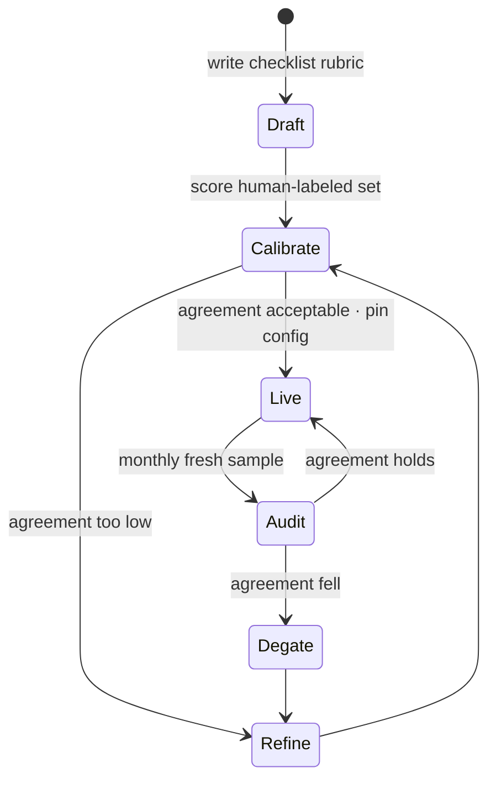

# LLM-as-Judge

Most of what matters about an LLM's output — is it helpful, grounded, well-reasoned, appropriately hedged — has no programmatic oracle. You cannot regex "faithful to the source" or unit-test "answers the question asked." LLM-as-judge closes that gap by having a model score outputs against a rubric, making subjective quality measurable at a scale humans cannot match. It works because of the asymmetry [fnd-07](../01-foundations/fnd-07-post-training.md) established: **judging is easier than producing**, which is why preference data trains models in the first place. But the same chapter supplies the warning that organizes everything here: **your judge is a reward model, and every reward-model pathology applies to it** — position and verbosity biases, self-preference, sycophancy, and Goodhart drift once anyone starts optimizing against it. A judge you have not calibrated against human labels is not a measurement instrument; it is an opinion generator with a confidence interval you have never checked.

## Intuition: a cheap, biased, tireless annotator

The right mental model is not "an oracle" but **an annotator you hired without an interview**: fast, cheap, available at 3 a.m., consistent in ways humans aren't — and carrying systematic biases you must characterize before trusting their labels. You would not deploy a human annotator's judgments to gate releases without checking their agreement with your standards. The judge deserves exactly the same skepticism, and gets less of it because it produces numbers.

Two properties follow from "it's a model," and they explain most judge failures:

- **It is sampled, so it is noisy.** The same output scored twice may get different verdicts ([fnd-08](../01-foundations/fnd-08-sampling-and-decoding.md)). Judge scores need the same statistical treatment as any other model output — low temperature, and n-run stability checks on anything close to a threshold.
- **It is post-trained, so it has preferences.** RLHF shaped it to favor certain surface features — length, confidence, structure, agreement ([fnd-07](../01-foundations/fnd-07-post-training.md)) — and those preferences leak into its scores regardless of your rubric. This is the source of the bias catalogue below.

The consequence that governs practice: **a judge is only as good as its measured agreement with humans on your task.** That number is the judge's license to operate, and everything else in this chapter serves either to raise it or to keep it from silently decaying.

## The three judge patterns

**Pointwise scoring (the workhorse).** Show the judge one output and a rubric; get a verdict. Cheapest, scales linearly, and integrates naturally into a suite where each case has an expected behavior. Its weakness is calibration drift — "is this a 7 or an 8?" is unstable across runs and rubric versions — which is why the rubric design section below insists on binary checks rather than numeric scales.

**Pairwise comparison.** Show two outputs, ask which is better. Substantially more reliable per judgment than absolute scoring, because relative comparison is an easier cognitive task for models as it is for humans.[^zheng-judge] Ideal for A/B decisions between prompt or model variants. Two costs: it produces preference rates rather than absolute quality (you learn B beats A, not whether either is acceptable), and it is quadratic if you compare many variants. **Always run both orderings and average** — position bias is large enough to flip conclusions otherwise.

**Reference-based scoring.** Give the judge a gold answer and ask how well the candidate matches it. Strongest signal when references exist, since it converts an open judgment into a comparison. Limited by reference availability and by penalizing legitimate alternative phrasings or *better* answers than the reference.

Choosing: **pointwise for suite-level quality gates, pairwise for comparing two candidates, reference-based where you have gold answers.** For RAG specifically, the highest-value judge is pointwise groundedness via claim decomposition ([rag-07](../03-retrieval/rag-07-rag-evaluation.md)).

## The bias catalogue

Each bias has a mechanism, a detection method, and a mitigation. Knowing the mechanism is what lets you predict biases this list doesn't name.

| Bias | Mechanism | Detection | Mitigation |
|---|---|---|---|
| **Position** | Sequence position affects attention and the model's prior over "which one is being asked about"; judges favor a consistent slot in pairwise setups[^zheng-judge] | Run A/B and B/A; measure how often the verdict flips | Always swap and average; report the flip rate as a judge-quality metric |
| **Verbosity** | Preference training rewarded thorough-*looking* answers, so length correlates with rated quality independent of content[^zheng-judge] | Correlate scores with output length across your suite | Length-controlled comparison; rubric items that explicitly penalize padding; compare similar-length outputs |
| **Self-preference** | Models rate their own generations higher, plausibly via familiarity with their own distribution[^panickssery-self] | Score outputs from multiple model families with each as judge | Never judge with the same model that generated; or use a panel of diverse judges[^verga-juries] |
| **Sycophancy** | Post-training rewarded agreement, so any signal about the "desired" verdict pulls the score[^sharma-sycophancy] | Include the same output labeled as "our new system" vs "baseline" and compare | Blind the judge to authorship, variant name, and which is new |
| **Formatting** | Structure (headings, bullets, citations-shaped text) reads as rigor regardless of content | Compare same-content outputs with different formatting | Rubric items about substance; ignore-formatting instruction |

Two general defenses that address the whole class rather than individual entries:

- **Blinding is architectural, not a prompt nicety.** The judge should never see which system produced an output, which variant is new, what the developer hopes, or the user's stated preference. Every one of those is a channel for sycophancy, and the cheapest way to close it is to strip that information at the harness level ([eng-03](../../engineering/eng-03-eval-harness-architecture.md)).
- **Panels beat single judges where the stakes justify cost.** Multiple diverse models voting reduces the idiosyncrasy of any one judge — including self-preference, since a panel is unlikely to share one model's blind spots.[^verga-juries] Cost multiplies by panel size, so reserve it for high-stakes gates and calibration anchoring.

## Rubric design

The rubric is where most judge quality is won or lost, and the guidance is opinionated because the failure mode is so consistent.

**Binary behavioral checks, not numeric scales.** "Rate helpfulness 1–10" invites drift and produces numbers with no operational meaning; a 7 today is an 8 next week. A checklist of yes/no questions — *cites at least one provided document; states the limitation the source mentions; avoids recommending a specific dosage; answers within the requested length* — is stable across runs, agrees better with humans, and produces an interpretable failure list rather than a score. Overall pass = all required checks pass.

**Quote-anchored justifications.** Require the judge to quote the span supporting each verdict. This does three things at once: it forces attention to the actual text rather than a global impression, it makes gaming visible when someone starts optimizing against the judge, and it turns failures into readable diagnostics you can act on.

**Decompose before judging.** For faithfulness, split the answer into atomic claims and judge each ([rag-07](../03-retrieval/rag-07-rag-evaluation.md)); for multi-part questions, judge each part. Decomposition converts a hard holistic judgment into several easy ones, which is exactly where models are more reliable.

**Structured output, always.** Constrain the verdict to a schema — per-check booleans, quotes, an overall pass ([api-03](../02-llm-apis/api-03-structured-outputs-tool-calling.md)). Parseable verdicts make aggregation, slicing, and CI gating mechanical, and the schema itself disciplines the judge.

**Include the abstention and refusal cases in the rubric.** A judge that has no way to say "the response correctly declined" will mark correct refusals as failures — which then trains the team to remove the abstention behavior that [fnd-09](../01-foundations/fnd-09-capabilities-and-limits.md) says you need.

## Calibration: the license to operate

The step that converts a judge from an opinion generator into an instrument, and the one most teams skip.

**Build a human-labeled calibration set.** 50–100 outputs spanning the quality range, labeled by humans against the same rubric ([evl-02](evl-02-eval-datasets.md)'s labeling discipline applies — including double-labeling to establish that *humans* agree first). If human inter-annotator agreement is low, stop: no judge can be held to a standard humans don't share.

**Measure agreement and report it with the judge's scores.** Judge-vs-human agreement is the number that licenses the judge, and it should travel with every result the judge produces. Useful framing: a judge whose agreement with humans matches typical human-to-human agreement on the same task is doing as well as an additional annotator, which is a reasonable bar.[^zheng-judge]

**Look at disagreements, not just the number.** They cluster, and the clusters are informative: the judge may be systematically strict on a category, missing a rubric dimension, or penalizing correct refusals. Each cluster is either a rubric fix or a known limitation to record.

**Re-calibrate on a cadence, and treat the judge as pinned config.** Judge model version, rubric version, and sampling parameters together define the measurement instrument; changing any of them invalidates comparability with historical scores. [eng-03](../../engineering/eng-03-eval-harness-architecture.md)'s rules: pin the config, hash it into results, audit agreement monthly on a fresh sample, and **de-gate the judge if agreement falls** — a judge that has drifted should stop blocking deploys until re-validated.

*The judge lifecycle — calibration is a standing loop, not a launch task:*

## Engineering the judge

- **Cost and latency.** Judges add a model call per scored output; a 300-case suite with a judge is 300 extra calls. Run them on the batch tier at half price ([api-05](../02-llm-apis/api-05-streaming-caching-batch.md)) and cache the stable rubric prefix — an eval suite is the ideal stable-prefix workload.
- **Model choice.** A frontier judge is more accurate and more expensive; a small judge is cheap enough for high-volume online sampling ([evl-05](evl-05-online-evaluation.md)). A workable split: a small judge scoring live traffic continuously, a frontier judge for gate-blocking suites, and human labels calibrating both.
- **Determinism.** Low temperature (0–0.2), and n-run the cases near your threshold to see verdict stability ([fnd-08](../01-foundations/fnd-08-sampling-and-decoding.md)). Wildly unstable verdicts usually mean an ambiguous rubric item.
- **Judges are code.** Rubric, model pin, and parameters live in version control and go through the same review as prompts; a rubric change is a measurement change and should be announced as one.
- **Where judges do *not* belong.** If a programmatic check exists — schema validity, citation resolution, exact match, code execution — use it. It's free, deterministic, unbiased, and instant. Judges are for what genuinely cannot be checked mechanically ([evl-01](evl-01-evaluation-fundamentals.md)'s scoring preference order).

## Goodhart and the judge

The pathology that arrives once a judge starts gating anything: **the judge becomes a target, and targets get optimized.**

The mechanism is exactly [fnd-07](../01-foundations/fnd-07-post-training.md)'s reward hacking, one level up. Teams tune prompts against judge scores; whatever surface features the judge rewards — length, hedging, structural markers, rubric vocabulary echoed back — get amplified, and the judge score climbs while human-perceived quality flattens or falls. The evl-01 example of a content team whose outputs grew florid as their judge score rose is this exact loop.

Defenses, in order of effectiveness:

1. **Metrics in tension.** Pair the judge score with counter-metrics — conciseness, latency, cost, task success, abstention correctness — so that optimizing one visibly degrades another.
2. **Human audit on a cadence.** Sample scored outputs for human review monthly. Judge score rising while human ratings flatten is the signature, and only human labels can detect it.
3. **Quote-anchored rubrics** make gaming legible: an output that satisfies the letter of a check while missing its spirit shows up when you read the quotes.
4. **Don't optimize directly against the judge.** Use it to *detect* regressions rather than as the objective to maximize — the same discipline as not tuning on the test set (evl-02).

## Production engineering perspective

- **Judges gate, but only after calibration.** Wire judge-scored metrics into CI ([evl-06](evl-06-ci-for-llm-apps.md)) with numeric thresholds — and only for judges with recorded human agreement. An uncalibrated judge blocking a deploy will be overridden within two sprints, and then the whole gate loses credibility.
- **Online sampling is where judges earn most.** Continuously scoring a slice of production traffic gives a quality heartbeat that offline suites structurally cannot ([evl-05](evl-05-online-evaluation.md)) — it catches corpus drift, model version drift, and traffic shifts.
- **Aggregate carefully.** Judge scores are per-case verdicts; report pass rates with slices and spread, not a single mean. A mean hides that one category collapsed.
- **Record the judge config hash with every score** so a historical comparison can't silently span two different instruments.
- **Budget humans, permanently.** Calibration is not a phase; it is a recurring cost that keeps the automated majority trustworthy. Teams that eliminate the human line item lose the ability to detect judge drift at all.

## Historical evolution

**2021–2022:** model-graded evaluation appears in research; skepticism is high and the technique is niche. **2023:** MT-Bench and Chatbot Arena establish that strong models agree with human preferences at roughly human-to-human agreement levels on many tasks, while cataloguing position, verbosity, and self-enhancement biases — legitimizing the technique *and* its caveats simultaneously.[^zheng-judge] LLM-as-judge becomes standard in LLM application evaluation almost immediately, because nothing else scales. **2023–2024:** the failure modes get characterized in more depth — self-preference is measured directly,[^panickssery-self] and panels of diverse judges are shown to reduce single-judge idiosyncrasy at a cost.[^verga-juries] Practitioner consensus converges on checklist rubrics over numeric scales and on mandatory human calibration. **2024–present:** judges become infrastructure — pinned, versioned, audited, used both offline in gates and online for continuous sampling — and the open frontier is drift detection and reducing calibration cost. The arc: from "can a model grade?" to "a model grades, and here is how you keep it honest."

## Common misconceptions

- **"The judge is objective because it's a model."** It has systematic, measurable preferences from post-training. It is a *consistent* rater, which is different from an unbiased one — and consistency in the wrong direction is worse than noise, because it doesn't average out.
- **"High judge scores mean high quality."** They mean high scores from that judge on that rubric. Without measured human agreement, the mapping to quality is an assumption; with optimization pressure applied, it decays (Goodhart).
- **"Use the strongest model as judge."** Strongest available, *different from the generator* — self-preference is real and measured.[^panickssery-self] Judging your own outputs with your own model inflates scores systematically.
- **"1–10 scales give finer resolution."** They give unstable resolution. Binary checklist items agree better with humans, aggregate more meaningfully, and produce actionable failure lists.
- **"Judges replace human evaluation."** They *extend* it. Humans define the rubric, calibrate the judge, audit for drift, and adjudicate the ambiguous — the judge scales that judgment to volumes humans can't reach.
- **"We validated the judge at launch."** Calibration decays: judge models change under aliases, rubrics evolve, and traffic shifts. Monthly audits on fresh samples are the maintenance that keeps the instrument valid.

## Failure modes and trade-offs

- **The uncalibrated gate** — a judge blocks deploys with no measured human agreement; engineers learn to override it; the gate becomes theater. *Fix:* calibrate before gating; publish the agreement number alongside the metric.
- **Judge drift** — the underlying model changes (unpinned alias, provider update) and every historical score shifts without any system change. *Fix:* pin versions, hash the config into results, audit monthly (fnd-07's drift, in the measurement layer).
- **Goodhart spiral** — prompts tuned against the judge; scores rise, users don't notice improvement. *Fix:* counter-metrics, human audits, quote-anchored rubrics, and not optimizing against the judge directly.
- **Sycophancy leakage** — the harness passes variant names or "improved version" labels through to the judge. *Fix:* blind at the harness level, not by asking the judge to ignore it.
- **Rubric ambiguity → unstable verdicts** — the same output scores differently across runs. *Fix:* n-run near-threshold cases to detect it; rewrite the offending check as a sharper binary question.
- **Cost creep** — judges on every case on every commit. *Trade-off:* tier them — programmatic checks on every commit, judges nightly on the batch tier, panels only for release gates ([eng-03](../../engineering/eng-03-eval-harness-architecture.md)).

## Best practices

- **Prefer programmatic scoring wherever it exists**; use judges only for what genuinely can't be checked mechanically.
- **Write checklist rubrics with binary, behavioral, quote-anchored items** and structured output; include correct-refusal as a passing case.
- **Blind the judge at the harness level** to authorship, variant identity, and stated preferences.
- **Calibrate against 50–100 human labels before gating**, confirm humans agree with each other first, and publish judge-human agreement with every reported metric.
- **Pin judge model + rubric + parameters as one config**, hash it into results, and treat any change as a measurement migration.
- **Audit monthly on a fresh sample; de-gate on falling agreement** rather than quietly continuing.
- **Run judges on the batch tier with cached rubric prefixes**; use a small judge for online sampling and a stronger one for gates.
- **Pair judge scores with counter-metrics and never optimize directly against the judge.**
- **Swap-and-average all pairwise comparisons**, and report the flip rate as a judge health metric.

## Real-world examples

**The judge that rewarded padding.** A team gates their summarization feature on a 1–10 judge score for "quality." Over a quarter the score climbs from 6.8 to 8.1 and the team celebrates. Then a user-research session finds people preferring the *older* summaries as more scannable. The audit shows what happened: the judge, like most post-trained models, associates thoroughness with quality, so every prompt iteration that made summaries longer and more hedged scored higher.[^zheng-judge] Fixes: rewrite the rubric as binary checks (*includes all numbers from the source; under 120 words; no phrases like "it is important to note"*), add a length counter-metric, and calibrate against 60 human-labeled summaries. The new metric moves *down* to a truthful 0.72 pass rate and starts tracking user preference.

**The self-preference that hid a regression.** A team evaluates a model migration by having the incumbent model judge both its own outputs and the candidate's, concluding the incumbent is clearly better and cancelling the migration. A skeptical engineer re-runs with a third-party judge and with swapped positions: the candidate now wins narrowly. The original result was self-preference plus position bias compounding.[^panickssery-self] The team adopts a standing rule — the judge is never from the same family as either system under test, and every pairwise comparison runs both orderings — and re-opens the migration decision on evidence.

**The calibration that saved the gate.** A support-quality judge gates deploys for six months. A routine monthly audit finds agreement with humans has fallen from 0.81 to 0.58. Investigation: the judge was pinned to an alias rather than an exact version, and a provider update changed its behavior — refusal-adjacent responses that the rubric counted as correct abstentions were now being marked failures ([fnd-07](../01-foundations/fnd-07-post-training.md)'s drift). Because agreement was measured monthly, the team caught it before the false failures pressured anyone into removing the abstention behavior. They pin the exact version, add the abstention cases explicitly to the calibration set, and keep the monthly audit — which is now visibly the cheapest insurance in the eval stack.

## Interview questions

1. **"When would you use an LLM as a judge, and when not?"** — Model answer: when the quality dimension has no programmatic oracle — helpfulness, groundedness, tone, reasoning quality — and you need to score at a volume humans can't reach. Not when a mechanical check exists: schema validity, citation resolution, exact match, code execution are free, deterministic, unbiased, and instant, so a judge there is strictly worse. And not at all until calibrated: without measured agreement against human labels on my task, a judge is an opinion generator producing numbers, which is more dangerous than no metric because it looks authoritative.

2. **"What biases do LLM judges have and how do you mitigate each?"** — Model answer: position bias — judges favor a slot in pairwise comparisons, so always run both orderings and average, tracking the flip rate. Verbosity bias — preference training associated length with quality, so correlate scores against length, use length-controlled comparisons, and write rubric items penalizing padding. Self-preference — models rate their own generations higher, so never judge with the same model family as the generator, or use a diverse panel. Sycophancy — any hint of the desired verdict pulls scores, so blind the judge at the harness level to authorship and variant identity. Plus formatting bias, where structure reads as rigor. The general defenses are blinding, swapping, panels, and rubrics about substance.

3. **"How do you calibrate a judge?"** — Model answer: build 50–100 human-labeled outputs spanning the quality range using the same rubric, first confirming the humans agree with each other — if inter-annotator agreement is low the rubric is ambiguous and no judge can be held to it. Then measure judge-versus-human agreement and report it alongside every metric the judge produces; a reasonable bar is agreement comparable to human-to-human on the same task. Read the disagreements, since they cluster and each cluster is either a rubric fix or a recorded limitation. Then pin model version, rubric, and parameters as one config, hash it into results, and re-audit monthly on a fresh sample — de-gating the judge if agreement falls rather than quietly continuing.

4. **"Why binary checklists instead of a 1–10 scale?"** — Model answer: numeric scales drift — a 7 today and a 7 next month aren't the same, especially across rubric edits or judge versions — and the number carries no operational meaning, so you can't act on it. Binary behavioral checks ("cites a provided document", "under 120 words", "states the source's caveat") agree better with humans because each is an easy judgment, aggregate into interpretable pass rates, and produce a failure list you can fix rather than a score you can only watch. Adding quote anchoring on each verdict forces the judge to point at the text, which also makes it visible when someone starts gaming the rubric.

5. **"Your judge score improved 15% but users aren't happier. What happened?"** — Model answer: Goodhart — the judge became the optimization target, and whatever surface features it rewards got amplified. Typically that's verbosity, hedging, structural markers, or echoing rubric vocabulary, none of which users value. I'd confirm by sampling scored outputs for human review: judge up, human ratings flat is the signature. Fixes: counter-metrics in tension (conciseness, latency, task success) so gaming one visibly costs another, quote-anchored rubric items that make letter-versus-spirit gaming legible, monthly human audits, and a discipline of using the judge to detect regressions rather than as the objective to maximize.

6. **"Should you use a panel of judges?"** — Model answer: where the stakes justify the cost. A panel of diverse models reduces any single judge's idiosyncrasies — including self-preference, since a panel is unlikely to share one family's blind spots — and published results show panels tracking human judgment better than single strong judges. The cost multiplies with panel size, so in practice I'd tier: a single small judge for continuous online sampling, a single strong judge for nightly suites, and a panel for release-blocking gates or for calibration anchoring. Panels don't remove the need for human calibration; they reduce variance around whatever the panel collectively is biased toward.

7. **"How do you keep a judge trustworthy over time?"** — Model answer: treat it as a pinned instrument, not a service call. Model version, rubric version, and sampling parameters are one config under version control, hashed into every result so historical comparisons can't silently span two instruments. Monthly, score a fresh human-labeled sample and track agreement — falling agreement de-gates the judge until re-validated, which is important because the usual cause is invisible: a provider updating a model behind an alias. And keep humans in the loop permanently for calibration and drift detection; a team that removes the human line item loses the only mechanism that can tell them their instrument broke.

## Exercises and mini-project

**Exercises**

1. Rewrite this rubric as binary quote-anchored checks: "Rate the answer's helpfulness and accuracy from 1 to 10." Assume a support-assistant context.
2. Design the experiment that measures verbosity bias in your judge: what you vary, what you hold constant, what you compute.
3. Your pairwise judge picks option A 71% of the time regardless of content. Name the bias, the diagnostic, and the fix.
4. Human labelers agree with each other at kappa 0.42 on your rubric. Should you calibrate a judge against these labels? Justify.
5. List three quality dimensions in your capstone that should use programmatic checks rather than a judge, and the check for each.

**Mini-project: build and calibrate a judge.** For your capstone's groundedness metric ([rag-07](../03-retrieval/rag-07-rag-evaluation.md)): (a) write a checklist rubric with 4–6 binary quote-anchored checks and a structured output schema ([api-03](../02-llm-apis/api-03-structured-outputs-tool-calling.md)); (b) generate 60 outputs spanning quality, and human-label them yourself against the rubric (double-label 20 a day apart to estimate your own consistency); (c) run the judge and compute agreement; read every disagreement and classify it as rubric defect or judge limitation; (d) revise the rubric once and re-measure; (e) reproduce two biases deliberately — score identical content at two lengths, and run a pairwise comparison in both orderings, reporting the flip rate; (f) pin the config, record the agreement number, and wire the judge into your suite. Target: 4 hours. Success criterion: a measured agreement number, at least one rubric fix that came from a disagreement cluster, and a personally-observed bias.

**Capstone extension:** this judge becomes the [eng-03](../../engineering/eng-03-eval-harness-architecture.md) judge subsystem — gating in [evl-06](evl-06-ci-for-llm-apps.md), sampling live traffic in [evl-05](evl-05-online-evaluation.md), and scoring trajectories in [agt-09](../04-agents/agt-09-agent-reliability.md).

## Revision summary

- Judges make subjective quality measurable at scale because judging is easier than producing — but a judge is a reward model, so every reward-model pathology applies.
- Three patterns: pointwise (suite gates), pairwise (variant comparison, always swap-and-average), reference-based (where gold answers exist).
- Bias catalogue with mechanisms: position (attention/priors), verbosity (preference training), self-preference (familiarity with own distribution), sycophancy (agreement rewarded), formatting (structure reads as rigor). Defenses: blinding at the harness level, order swapping, diverse panels, substance-focused rubrics.
- Rubrics: binary behavioral checks with quote anchors and structured output, decomposed before judging, with correct refusals counted as passes — not 1–10 scales.
- Calibration is the license to operate: 50–100 human labels (after confirming humans agree), measured agreement reported with every metric, disagreement clusters read as rubric fixes, config pinned and hashed, monthly audits, de-gate on drift.
- Goodhart is inevitable once a judge gates anything: defend with metrics in tension, human audits, quote anchoring, and by using the judge to detect regressions rather than as an objective to maximize.

## Flashcards

| Q | A |
|---|---|
| Why does LLM-as-judge work at all? | Judging is easier than producing — the same asymmetry that makes preference data effective for training. |
| What is a judge, structurally? | A reward model — so position, verbosity, self-preference, and sycophancy biases all apply, plus Goodhart once it gates anything. |
| The three judge patterns? | Pointwise (scale, suite gates), pairwise (more reliable per judgment, needs order swapping), reference-based (strongest where gold answers exist). |
| Why binary checklists over 1–10 scales? | Stable across runs, better human agreement, interpretable failure lists instead of drifting numbers. |
| What does quote anchoring buy? | Forces attention to actual text, makes rubric gaming legible, and turns verdicts into actionable diagnostics. |
| A judge's license to operate? | Measured agreement with human labels on your task, reported alongside every metric it produces. |
| What must be true before calibrating a judge? | Humans must agree with each other first — low inter-annotator agreement means the rubric is ambiguous. |
| What constitutes the judge's pinned config? | Model version + rubric version + sampling parameters, hashed into results; changing any invalidates historical comparability. |
| Mitigation for self-preference? | Never judge with the same model family as the generator; or use a panel of diverse judges. |
| Signature of a Goodhart spiral? | Judge scores rising while human ratings stay flat — detectable only by periodic human audit. |
| When should a judge stop gating? | When its monthly agreement audit falls — de-gate until re-validated rather than quietly continuing. |

## Further reading

- **Official docs:** Anthropic's empirical evaluation guide[^anthropic-evals] — practical rubric and grading guidance.
- **Papers:** Zheng et al., MT-Bench (2023)[^zheng-judge] — §4 for the bias catalogue and human-agreement analysis, the foundational read; Panickssery et al., self-preference (2024)[^panickssery-self]; Verga et al., panels of judges (2024)[^verga-juries]; Sharma et al., sycophancy (2023)[^sharma-sycophancy] for the post-training mechanism.
- **Books:** none current enough.
- **Talks:** none essential.
- **Tutorials:** build the judge in the mini-project before adopting a framework's — frameworks hide exactly the calibration step that matters.

## Check your understanding

1. Explain why a judge is best understood as a reward model, and name three consequences that follow.
2. Give the mechanism, detection, and mitigation for verbosity bias and for self-preference.
3. Your judge and your humans agree at 0.62 on a task where humans agree with each other at 0.65. Is the judge usable? Justify.
4. Design the blinding for a pairwise A/B judge — list every piece of information that must not reach it.
5. Trace how [fnd-07](../01-foundations/fnd-07-post-training.md)'s reward hacking reappears in this chapter, and name the four defenses.

## Sources

[^zheng-judge]: [T2] Zheng et al. (2023). "Judging LLM-as-a-Judge with MT-Bench and Chatbot Arena." arXiv:2306.05685. https://arxiv.org/abs/2306.05685 (accessed 2026-07-10)
[^panickssery-self]: [T2] Panickssery et al. (2024). "LLM Evaluators Recognize and Favor Their Own Generations." arXiv:2404.13076. https://arxiv.org/abs/2404.13076 (accessed 2026-07-10)
[^verga-juries]: [T2] Verga et al. (2024). "Replacing Judges with Juries: Evaluating LLM Generations with a Panel of Diverse Models." arXiv:2404.18796. https://arxiv.org/abs/2404.18796 (accessed 2026-07-10)
[^sharma-sycophancy]: [T2] Sharma et al. (2023). "Towards Understanding Sycophancy in Language Models." arXiv:2310.13548. https://arxiv.org/abs/2310.13548 (accessed 2026-07-10)
[^anthropic-evals]: [T1] Anthropic. "Create strong empirical evaluations." https://docs.anthropic.com/en/docs/build-with-claude/develop-tests (accessed 2026-07-10)
