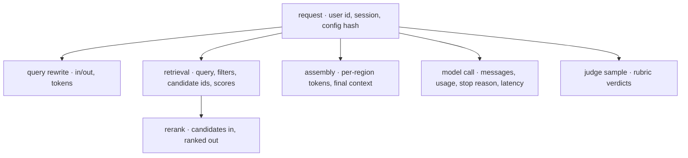
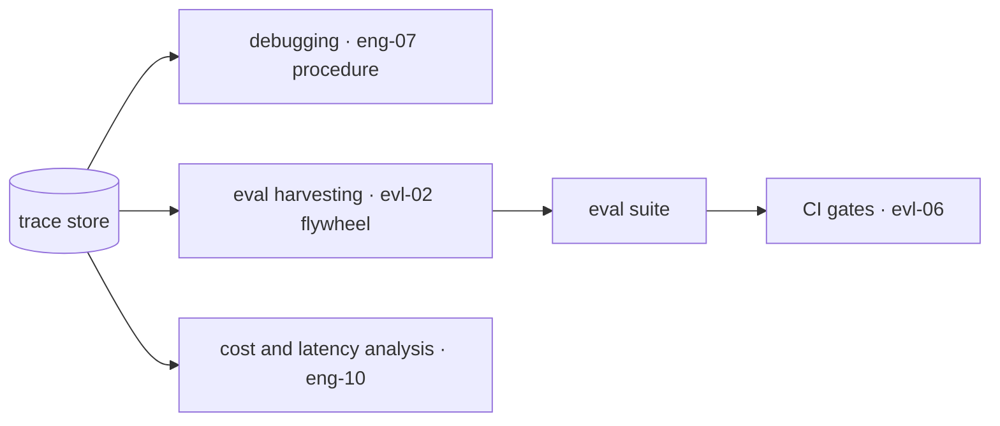

# Tracing & Observability

You cannot debug what you cannot see, and an LLM system is unusually opaque: the model's behavior depends on an assembled context that no source file contains, produced by retrieval and templating steps that ran once, for one request, and left no trace unless you kept one. This chapter is about keeping one. The trace store is the substrate under nearly everything else in this module — [eng-07](../../engineering/eng-07-eval-checklists-debugging.md)'s "first fifteen minutes" procedure is only executable because traces exist, [evl-02](evl-02-eval-datasets.md)'s flywheel harvests from them, [evl-05](evl-05-online-evaluation.md) samples them for online quality, and [eng-10](../../engineering/eng-10-cost-optimization.md)'s cost audit queries them. That triple duty is what justifies the storage bill. The chapter's single most important instruction is small enough to state now: **log the context the model actually received, not the template that produced it.** Platform specifics here are `volatile`; the span schema and the governance discipline are not.

## Intuition: the flight recorder

A trace is what lets you reconstruct an incident you did not witness. For a conventional service that means request, response, timings, and errors. For an LLM system it must mean something more, because the interesting failures are not exceptions — nothing threw, the status was 200, and the answer was wrong.

The reconstruction you need to support is: *what did the model see, what did it produce, under what configuration, at what cost?* Every one of those is invisible without deliberate instrumentation:

- **What it saw** is the assembled context — retrieved passages, conversation history, tool results, system prompt — which existed only in memory during that request ([rag-01](../03-retrieval/rag-01-context-engineering.md)).
- **Under what configuration** is the prompt version, model version, and parameters in effect *then*, which may differ from what's deployed now ([eng-04](../../engineering/eng-04-llmops-stack.md)).
- **At what cost** is token usage per stage, which is also the only route to per-feature unit economics.

The structural model is the same as distributed tracing: **one user request is a tree of spans.** A RAG request has a root span with children for query rewriting, retrieval, reranking, context assembly, the model call, and any judge or validation steps. The tree is what lets you attribute latency and failure to a stage rather than to "the AI" ([rag-05](../03-retrieval/rag-05-rag-pipeline.md)'s attribution discipline, made mechanical).

*One RAG request as a span tree — each node carries its own inputs, outputs, timing, and cost:*

## The span schema

What to capture, and why each field earns its bytes. This is the contract [eng-04](../../engineering/eng-04-llmops-stack.md) assumes.

**On the model-call span:**

- **The full assembled messages** — the actual array sent, post-templating and post-retrieval. This is the field teams most often skip (logging the template name and variables instead) and most regret skipping, because the bug is usually *in the assembly*: a passage that didn't make the budget, history that got truncated, a variable that rendered empty. The template plus variables is not reconstructible into the real context once retrieval is non-deterministic.
- **The response**, including tool-call blocks, not just the text.
- **`usage`** (input, output, and cached token counts) and **`stop_reason`** — the two fields [api-01](../02-llm-apis/api-01-llm-api-fundamentals.md) insists on. Stop reason in the trace is how you later discover that 4% of outputs were truncated.
- **Model version, sampling parameters, and latency** split into time-to-first-token and total where streaming.

**On retrieval spans:** the query as issued (post-rewrite), filters applied, candidate IDs with scores at each funnel stage, and which survived into context. Without candidate IDs you cannot distinguish "never retrieved" from "retrieved then demoted" — the distinction [rag-06](../03-retrieval/rag-06-advanced-retrieval.md) requires.

**On the root span:** user/session identifiers (pseudonymous), route or feature name, the **config hash** covering prompt version + model pin + parameters + retrieval settings, and the outcome (success, error, refusal, abstention).

**The config hash deserves emphasis.** It is what makes traces comparable: without it, a quality change six weeks ago cannot be attributed to the config that caused it, and A/B analysis degrades into guesswork. One hash per request, recorded on the root span, is the difference between an archive and an evidence base.

**Standards.** OpenTelemetry's generative-AI semantic conventions define span names and attributes for LLM operations, and adopting them buys portability across the volatile platform landscape.[^otel-genai] Where the conventions don't cover something (per-region context budgets, retrieval candidate lists), add namespaced custom attributes rather than inventing a parallel schema.

> **Volatile:** the observability platform landscape — hosted LLM-tracing products, self-hosted options, and OTel-native pipelines[^langfuse-docs][^langsmith-docs] — churns quickly, as do the conventions themselves. Verify current attribute names at build time. The span *content* (assembled context, usage, stop reason, config hash, retrieval candidates) is stable regardless of where you store it.

## Governance: traces contain user data

The uncomfortable fact that must shape the design before the first trace is written: **your trace store holds the most sensitive data in your system.** Full prompts include whatever users typed — support tickets with account details, documents pasted for summarization, health questions. Retrieved context includes documents the user was allowed to see. Nothing else in your infrastructure aggregates that so completely.

- **Redact before storage, not after.** Run PII detection on inbound content and store redacted or tokenized forms where policy requires ([sec-03](../07-safety-security/sec-03-privacy-compliance.md)). Retrofitting redaction onto an existing trace archive is a compliance incident with a migration attached — [eng-08](../../engineering/eng-08-deployment-guide.md) flags this as a day-one decision for exactly this reason.
- **Set retention deliberately.** Debugging needs days, eval harvesting needs weeks, trend analysis needs months, and regulation may cap all of them. Tiered retention — full traces briefly, metadata longer — usually satisfies everyone.
- **Access-control the trace store like production data**, because it is. Engineers reading traces are reading customer content; that deserves the same authorization and audit as any other sensitive datastore.
- **Deletion propagates here too.** A right-to-erasure request must reach traces, not just the primary database and the vector index ([rag-05](../03-retrieval/rag-05-rag-pipeline.md)) — which means traces need a queryable user identifier.

## Sampling and cost

Traces are large: a RAG request's assembled context can be tens of kilobytes, and storing every one at high volume becomes a meaningful line item.

The strategy that works at scale is **not uniform sampling** — it discards exactly the rare events you most need. Instead:

- **Keep 100% of errors, refusals, and abstentions**, plus anything a user flagged. These are the flywheel's raw material and they're a small fraction of traffic.
- **Keep 100% of anything scored by an online judge** ([evl-05](evl-05-online-evaluation.md)) so quality samples are reconstructable.
- **Sample successes** at whatever rate the budget allows — a few percent is usually enough for trend analysis and cost decomposition.
- **Keep metadata for everything** even when dropping bodies. Usage, latency, stop reason, and config hash are small, and they power the dashboards; the expensive part is the message content.

At low volume — most products, most of the time — keep everything. Sampling is an optimization to apply when the bill justifies it, and prematurely sampling away your failures is a false economy.

## From traces to value

Traces without consumers are a storage bill with good intentions. The three that justify the investment, each wired deliberately:

**Debugging.** The [eng-07](../../engineering/eng-07-eval-checklists-debugging.md) procedure: pull the trace, read the assembled context, check stop reason and config hash against expectations, classify the failure by layer, then check blast radius with an aggregate query. Most incidents resolve in those five steps, and every one of them reads from the trace store.

**Eval harvesting.** The [evl-02](evl-02-eval-datasets.md) flywheel: query for failure signals — errors, refusals, low judge scores, regenerations, thumbs-down — triage them weekly, and convert real failures into cases. This is the mechanism by which the suite grows harder and more representative over time, and it exists only if traces are queryable by outcome.

**Cost and performance analysis.** The [eng-10](../../engineering/eng-10-cost-optimization.md) audit: cost per task per route, decomposed into the formula's terms (input tokens, output tokens, cache hit share, retry rate), trended. Latency decomposed per span so a P99 regression names its stage. These queries are one-liners against a well-structured trace store and archaeology without one.

*The three consumers of a trace store — build all three taps or reconsider the storage:*

## Production engineering perspective

- **Instrument at the gateway** ([api-01](../02-llm-apis/api-01-llm-api-fundamentals.md)). One choke point emitting spans means instrumentation is not a per-callsite discipline that decays as the codebase grows.
- **Wire tracing before the first user.** Retrofitting is expensive, and — more painfully — the traces you most want are the ones from before you had tracing.
- **Correlate with your existing observability.** LLM spans should carry the same trace ID as the surrounding HTTP request, so a slow endpoint can be followed into the model call that caused it. LLM tracing is a specialization of distributed tracing, not a parallel universe.
- **Dashboards come from traces**: the [eng-04](../../engineering/eng-04-llmops-stack.md) alert set — cost per task, cache hit rate, truncation rate, retry rate, refusal rate, per-stage latency, per-region context tokens — are all trace aggregations. Build the store first and the dashboards fall out.
- **Watch the write path's cost and latency.** Trace emission should be asynchronous and non-blocking; an observability layer that adds latency to user requests or that can fail them is worse than none.

## Historical evolution

**2022–2023:** LLM applications are debugged with print statements and screenshots, because the tooling doesn't exist and the systems are small. **2023:** dedicated LLM-observability platforms appear, offering trace trees, prompt versioning, and dataset capture — and the framing shifts from "logging" to "tracing" as teams recognize the tree structure of a RAG or agent request.[^langfuse-docs][^langsmith-docs] **2023–2024:** the flywheel pattern crystallizes — traces are recognized as the *source* of eval data, not merely a debugging aid — which is what elevates tracing from nice-to-have to the substrate of the quality stack. **2024:** OpenTelemetry publishes generative-AI semantic conventions, offering portability across a churning vendor landscape.[^otel-genai] **2024–present:** convergence on OTel-compatible emission with specialized backends, and growing attention to trace-data governance as regulators notice that prompt archives are personal-data archives. The arc mirrors conventional observability's a decade earlier, compressed into two years — with one genuinely new element: traces here are training and evaluation data, not just diagnostics.

## Common misconceptions

- **"We log the prompt template and variables — that's the prompt."** It isn't. Retrieval is non-deterministic, budgets truncate, and history varies; the assembled context is the only thing that explains the output, and it must be captured as sent.
- **"Tracing is for debugging."** It's for debugging, eval harvesting, and cost analysis — and the second of those is what makes the eval suite improve over time. A store wired only to debugging is under-used.
- **"Sample uniformly to control cost."** Uniform sampling discards rare events, which are exactly the failures worth studying. Keep all errors and judged samples; sample the successes.
- **"Traces are logs; ops owns them."** They contain user prompts and retrieved documents — the most sensitive aggregate in the system. They need redaction, retention limits, access control, and deletion propagation like any personal-data store.
- **"We'll add tracing when we scale."** The traces you'll want are from before you scaled. Instrumentation is cheap on day one and archaeologically impossible later.
- **"The platform's default instrumentation is enough."** Defaults capture model calls; they rarely capture retrieval candidates, per-region context budgets, or your config hash — the fields that make attribution possible.

## Failure modes and trade-offs

- **Template-only logging** — traces exist but can't explain outputs because the assembled context wasn't stored. *Fix:* capture messages as sent; it is the single highest-value field.
- **Missing config hash** — quality changed six weeks ago and no one can attribute it. *Fix:* hash prompt + model + params + retrieval config onto the root span.
- **Unredacted archive** — a compliance finding lands and the remediation is a migration over months of stored prompts. *Fix:* redaction on the write path from day one.
- **Sampling that hides failures** — 1% uniform sampling means the 0.5% failure class is invisible. *Fix:* outcome-aware sampling.
- **Blocking or failing emission** — the observability path adds latency or drops user requests. *Fix:* async, buffered, best-effort emission with its own error budget.
- **Traces with no consumer** — cost accrues, no dashboards, no harvesting, nobody looks. *Trade-off made explicit:* either wire the three taps or reduce retention; an unread archive is not observability.

## Best practices

- **Emit from the gateway**, asynchronously, with the same trace ID as the surrounding request.
- **Capture the assembled messages as sent**, plus response, usage, stop reason, model version, parameters, and per-stage latency.
- **Put a config hash on every root span**, covering prompt version, model pin, parameters, and retrieval settings.
- **Record retrieval candidate IDs and scores at each funnel stage** so retrieved-then-demoted is distinguishable from never-retrieved.
- **Redact on the write path; set tiered retention; access-control and audit the store; propagate deletions.**
- **Sample by outcome, not uniformly** — all errors, refusals, and judged requests; a slice of successes.
- **Wire all three consumers** — debugging procedure, weekly eval harvest, cost/latency dashboards — or explicitly reduce what you keep.
- **Adopt OTel GenAI conventions** where they fit, with namespaced custom attributes for what they don't.[^otel-genai]

## Real-world examples

**The trace that couldn't explain anything.** A team instruments diligently: every model call logs template name, variable names, model, latency, and token counts. A user reports a wrong answer; the trace shows `template=rag_answer_v3, doc_count=5, tokens=8420` — and cannot answer the only question that matters, *which five documents and what did the assembled prompt say?* Reproduction is impossible because the index has since been updated. They add full assembled-message capture; the next such report is diagnosed in four minutes (a stale passage that should have been deleted — a freshness bug, not a model bug). The lesson is the chapter's core instruction: the template is not the prompt.

**The 4% nobody saw.** An extraction pipeline runs for months at "99% success" by its own error metric. A cost review queries the trace store for `stop_reason` distribution — a field logged but never examined — and finds 4% of calls ending at `max_tokens`, silently truncating outputs that downstream code then parsed into partial records ([api-01](../02-llm-apis/api-01-llm-api-fundamentals.md)'s classic bug). The data quality issue had been reported repeatedly and attributed to source documents. One aggregation over an already-captured field closed it; the fix was a token-budget change plus an alert on truncation rate. Traces you don't query are traces you don't have.

**The redaction that came too late.** A team stores full prompts for a year, then a customer exercises deletion rights and legal asks what personal data exists in traces. The answer — free-text support messages containing names, account numbers, and occasionally health details, across nine months and no user-identifier index — turns a routine request into a multi-week project involving re-indexing the archive to make it searchable by user. Fixes going forward: PII detection and redaction on the write path, a queryable pseudonymous user ID on every trace, tiered retention with automatic expiry, and deletion propagation tested as an eval case. All of that would have been an afternoon on day one.

## Interview questions

1. **"What do you log for an LLM application, and why?"** — Model answer: the assembled messages exactly as sent — not the template and variables, because retrieval is non-deterministic and budgets truncate, so only the real context explains the output. Plus the response including tool blocks, `usage` and `stop_reason` (truncation is otherwise invisible), model version and sampling parameters, latency split into TTFT and total, and on retrieval spans the post-rewrite query, filters, and candidate IDs with scores at each funnel stage. On the root span: pseudonymous user/session, route, outcome, and a config hash covering prompt version, model pin, parameters, and retrieval settings — that hash is what makes any historical comparison meaningful.

2. **"Why is a config hash important?"** — Model answer: it's what makes traces comparable across time. LLM behavior changes without code deploys — prompt edits, parameter changes, model version rolls — so when quality shifts, the first question is "what configuration produced this?" Without a hash on every request you can't attribute a regression to the change that caused it, can't compare two periods honestly, and can't verify that an A/B actually ran the configs you think it did. It's one field that converts an archive into an evidence base.

3. **"How do you sample traces at high volume?"** — Model answer: by outcome, never uniformly. Uniform sampling discards rare events, which is precisely backwards since failures are what you study. So: keep 100% of errors, refusals, abstentions, user-flagged requests, and anything an online judge scored — all small fractions of traffic — and sample successes at whatever the budget allows, often a few percent. Keep lightweight metadata (usage, latency, stop reason, config hash) for everything even when dropping message bodies, since that's what the dashboards need and it's cheap. And at low volume, just keep everything; sampling is an optimization for when the bill justifies it.

4. **"What governance applies to a trace store?"** — Model answer: it should be treated as the most sensitive datastore in the system, because it aggregates user prompts and retrieved documents more completely than anything else. That means PII redaction on the write path rather than retrofitted, tiered retention (short for full traces, longer for metadata) bounded by regulation, access control and audit equivalent to production data since engineers reading traces are reading customer content, and deletion propagation — a right-to-erasure request has to reach traces too, which requires a queryable user identifier designed in from the start. Retrofitting any of this is a migration, not a config change.

5. **"How do traces relate to evaluation?"** — Model answer: they're the source of eval data, which is the underappreciated half of tracing's value. The flywheel queries traces for failure signals — errors, refusals, low online judge scores, regenerations, thumbs-down — triages them weekly, and converts real failures into eval cases with expected behavior. That's the mechanism that keeps a suite representative and hard over time; without it a suite decays into easy cases that pass while users complain. So I'd design the trace schema with harvesting in mind: outcomes queryable, judge scores attached, and enough context stored that a case can be reconstructed from the trace alone.

6. **"Your P99 latency regressed. How do traces help?"** — Model answer: the span tree decomposes it. One user request is a tree — query rewrite, retrieval, rerank, assembly, model call — each with its own timing, so I compare per-stage latency distributions before and after and the regressing stage names itself. If it's the model call, I split TTFT from total: rising TTFT with stable inter-token time points at prefill, so context grew or the prompt cache stopped hitting, both of which the trace also records (per-region context tokens, cached token counts). If retrieval regressed, candidate counts and filter shapes are right there. Aggregate latency alarms tell you something broke; the tree tells you what.

## Exercises and mini-project

**Exercises**

1. Design the span schema for a tool-using agent turn: name the spans and the attributes each carries, per [eng-02](../../engineering/eng-02-agent-loop-architecture.md).
2. Your traces log `template_id` and variables but not assembled messages. List three failures you cannot diagnose, and why each is unreachable.
3. Write the trace queries for: truncation rate by route; cost per task by feature; retrieval candidate count distribution; refusal rate week over week.
4. Design outcome-aware sampling for 2M requests/day with a budget for 100k stored full traces. State the rule and what you'd keep metadata-only.
5. A deletion request arrives for a user. List every place their data lives in your LLM stack and how you'd find it.

**Mini-project: instrument the capstone.** For your [rag-05](../03-retrieval/rag-05-rag-pipeline.md) system: (a) emit a span tree per request — retrieval, rerank, assembly, model call — with the full schema from this chapter, including config hash and retrieval candidate IDs, written asynchronously to JSONL or an OTel-compatible backend; (b) add write-path redaction for one PII class; (c) use traces *only* (no code reading) to diagnose one seeded failure — a stale passage or a truncated output; (d) harvest five eval cases from real failure traces into your [evl-02](evl-02-eval-datasets.md) case store; (e) produce a cost decomposition per route and a per-stage latency breakdown; (f) memo: what the traces let you answer that logs didn't. Target: 4 hours. Success criterion: three working consumers (debugging, harvesting, cost) reading from your own trace store.

**Capstone extension:** this trace store is [eng-04](../../engineering/eng-04-llmops-stack.md)'s observability layer — [evl-05](evl-05-online-evaluation.md) samples it for online quality, [evl-06](evl-06-ci-for-llm-apps.md) compares its metrics across deploys, and [eng-10](../../engineering/eng-10-cost-optimization.md)'s audit runs against it.

## Revision summary

- LLM failures are silent (status 200, wrong answer), so debugging requires reconstructing what the model saw, under what config, at what cost — none of which survives the request without deliberate instrumentation.
- One request is a span tree; capture on the model span the **assembled messages as sent** (not the template), response, usage, stop reason, model version, parameters, and split latency; on retrieval spans, post-rewrite query, filters, and candidate IDs with scores; on the root span, pseudonymous identity, route, outcome, and a **config hash**.
- Traces are the most sensitive aggregate in the system: redact on the write path, tier retention, access-control and audit, and propagate deletions — all day-one decisions, not retrofits.
- Sample by outcome (all errors/refusals/judged, a slice of successes; metadata for everything), never uniformly.
- Three consumers justify the store: the debugging procedure, the eval-harvesting flywheel, and cost/latency decomposition. Wire all three or reduce what you keep.

## Flashcards

| Q | A |
|---|---|
| The single most important field to capture? | The assembled messages exactly as sent — templates plus variables can't be reconstructed once retrieval is non-deterministic. |
| What does the config hash enable? | Attribution of behavior changes to the configuration that caused them, and honest comparison across time periods. |
| Why record retrieval candidate IDs? | To distinguish "never retrieved" from "retrieved then demoted" — different bugs with different fixes. |
| Why is uniform sampling wrong? | It discards rare events, which are exactly the failures worth studying; sample by outcome instead. |
| What must be kept at 100%? | Errors, refusals, abstentions, user-flagged requests, and anything scored by an online judge. |
| Why are traces a governance concern? | They aggregate user prompts and retrieved documents — the most sensitive data in the system — requiring redaction, retention limits, access control, and deletion propagation. |
| When must redaction be designed? | Before the first trace is stored; retrofitting is a compliance incident with a migration attached. |
| The three consumers of a trace store? | Debugging (eng-07 procedure), eval harvesting (evl-02 flywheel), cost and latency analysis (eng-10). |
| How do traces improve the eval suite? | Failure signals are triaged weekly into cases, keeping the suite representative and hard as the product changes. |
| Where should tracing be emitted from? | The gateway — one choke point, asynchronous, sharing the surrounding request's trace ID. |

## Further reading

- **Official docs:** OpenTelemetry GenAI semantic conventions[^otel-genai] — start here for portable attribute names; Langfuse[^langfuse-docs] and LangSmith[^langsmith-docs] docs as category exemplars; provider API references for the usage/stop-reason fields.[^anthropic-messages]
- **Papers:** none — this is an engineering-practice layer.
- **Books:** any standard distributed-tracing treatment; the concepts transfer directly and the LLM specialization is the span content.
- **Talks:** none essential.
- **Tutorials:** instrument one route by hand before adopting a platform — it makes clear which fields the platform is and isn't capturing for you.

## Check your understanding

1. Why is logging the template and its variables insufficient? Give two failures it cannot explain.
2. List the root-span fields and say what each makes possible downstream.
3. Design outcome-aware sampling for a system where failures are 0.3% of traffic and the budget allows 5% storage.
4. Name every governance control a trace store needs, and which must exist before the first write.
5. Trace the path from a production failure to a new eval case, naming the components at each step.

## Sources

[^otel-genai]: [T1] OpenTelemetry. "Semantic conventions for generative AI systems." https://opentelemetry.io/docs/specs/semconv/gen-ai/ (accessed 2026-07-10)
[^langfuse-docs]: [T1] Langfuse. "Documentation — tracing." https://langfuse.com/docs (accessed 2026-07-10)
[^langsmith-docs]: [T1] LangChain. "LangSmith documentation — observability." https://docs.smith.langchain.com/ (accessed 2026-07-10)
[^anthropic-messages]: [T1] Anthropic. "Messages API reference." https://docs.anthropic.com/en/api/messages (accessed 2026-07-10)
