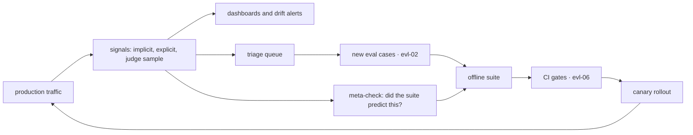

# Online Evaluation & Feedback Loops

An offline suite answers "does this behave correctly on the cases we thought of?" Production answers "does this work for the people using it?" — and those diverge for reasons that are structural rather than sloppy. This chapter covers closing that gap: the feedback signals worth collecting (and why the obvious one, thumbs up/down, is the weakest), continuous judge sampling as a quality heartbeat, controlled experiments adapted to LLM features, and the loop that runs *backwards* — using production to validate that your offline suite predicts anything at all. The stance to carry: **offline evals gate changes; online evaluation tells you whether the gate was measuring the right thing.** Teams that build only the first half ship confidently into problems their suite was structurally unable to see.

## Intuition: why offline and online diverge

Three mechanisms, all unavoidable, none a sign of a bad suite:

- **Traffic distribution shift.** Your suite samples what you imagined and harvested; production is what actually arrives — including inputs nobody anticipated, seasonal shifts, and the long tail of phrasings. A suite is always a *sample*, and samples miss.
- **Survivorship in the suite.** [evl-02](evl-02-eval-datasets.md)'s bias, arriving on the other side: cases harvested from logs reflect what users already believed the system could do, so the suite is systematically blind to capabilities users stopped attempting.
- **Unencoded dimensions.** Users experience latency, tone, formatting, verbosity, and the *feeling* of being understood. Suites encode correctness. A change can improve every case and still make the product worse — slower, wordier, colder.

The corrective is not a bigger suite; it is measurement on live traffic. And the relationship between the two is worth stating precisely because teams get it backwards: **the offline suite is the fast, cheap, repeatable proxy; production is the ground truth that keeps the proxy honest.** When they disagree, production wins and the suite gets a new case ([evl-02](evl-02-eval-datasets.md)'s flywheel is the mechanism by which that happens).

## The feedback signal hierarchy

Signals, from weakest to strongest, with what each actually measures.

**Explicit feedback (thumbs, ratings, "was this helpful?").** Cheap to add, and the weakest signal you will collect. Response rates are typically low single digits, and the responders are selected — people who are delighted or angry, not the median user. A rising thumbs-down rate is informative; an absolute thumbs-up rate is nearly meaningless. Collect it, but never treat it as your quality metric. Its real value is as a **trigger**: a thumbs-down is a high-precision pointer to a trace worth reading ([evl-04](evl-04-tracing-observability.md)) and a candidate eval case.

**Implicit behavioral signals — the workhorse.** What users *do* is dense, unbiased by willingness to rate, and available on every request:

| Signal | Interpretation | Strength |
|---|---|---|
| Regeneration / retry | The answer didn't satisfy | Strong negative |
| Edit distance on accepted output | How much the user had to fix (copilot-shaped products) | Strong, graded |
| Copy / export / apply | The output was used | Strong positive |
| Abandonment mid-stream | Losing them, often latency or early irrelevance | Strong negative |
| Follow-up rephrasing the same question | Retrieval or understanding failed | Strong negative |
| Escalation to a human | The system failed at its job | Strong negative, high value |
| Session length | Ambiguous — engagement or struggle | Weak, needs pairing |

The discipline: **map each signal to what it measures before instrumenting it**, and beware the ambiguous ones. Longer sessions can mean the product is good or that users can't find the answer; time-on-task is a classic metric that inverts depending on the product.

**Continuous judge sampling — the quality heartbeat.** Run a calibrated judge ([evl-03](evl-03-llm-as-judge.md)) over a sample of live traffic — 1–5% is plenty — scoring the dimensions your offline suite scores. This is the only signal that measures *quality* directly rather than inferring it from behavior, and it is what makes quality a monitorable SLI rather than a periodic report. Because it uses the same rubric as your offline gates, movements are directly comparable to them. Use a small, cheap judge for volume and anchor it against the frontier judge and human labels periodically.

**Downstream outcomes.** The strongest signal where it exists: did the support ticket get resolved, the code get merged, the document get sent? Slow, sparse, and confounded by everything else in the product — but it is the metric the business actually cares about, and worth wiring even at low volume.

## Detecting drift

The failure class online evaluation exists to catch, because offline suites structurally cannot see it: **the system changed without anyone changing it.**

The causes are all familiar from earlier chapters, and they share the property of being invisible to a fixed suite run against a fixed corpus:

- **Model drift** — a provider updates a model behind an alias, shifting refusal boundaries, verbosity, or format compliance ([fnd-07](../01-foundations/fnd-07-post-training.md)). Offline suites catch this only if they run continuously *and* the change affects your cases.
- **Corpus drift** — documents were added, edited, or deleted; retrieval quality moved without any code change ([rag-05](../03-retrieval/rag-05-rag-pipeline.md)).
- **Traffic drift** — a new customer segment, a product launch, or a seasonal shift changes what users ask.
- **Silent pipeline failure** — an ingestion job stopped and answers are quietly stale.

The instrumentation that catches all four is the same: **trend the online metrics** — judge scores, regeneration rate, refusal rate, abstention rate, escalation rate, cost per task — and alert on deviation from baseline rather than on absolute thresholds. This is the [eng-04](../../engineering/eng-04-llmops-stack.md) dashboard set, and the reason its alerts are phrased as *drift* is that absolute values are rarely wrong on day one; they wander.

## Experiments: A/B, canary, shadow

Comparing two versions on live traffic, with LLM-specific adjustments to standard practice.[^kohavi-experiments]

**Randomize by user, not by request.** A user flipped between two prompt versions mid-conversation experiences incoherence, and the inconsistency itself becomes a confound. Sticky assignment per user (or per session for anonymous traffic) is the default.

**Define guardrail metrics alongside the goal metric.** If the goal is answer quality, the guardrails are latency, cost per task, refusal rate, and escalation rate — because the easiest way to improve judge-scored quality is to spend more tokens and more time. Guardrails are what stop a "win" that the business would reject.

**Respect the power reality.** Many LLM features do not have the traffic for a well-powered A/B on a noisy quality metric. Two honest responses: (1) use judge scores rather than sparse explicit feedback, since a judge scores *every* sampled request and is therefore far denser; (2) accept a shadow comparison plus a canary rather than a statistically-conclusive experiment, and say so rather than over-claiming from an underpowered test.

**Shadow before canary where risk is real.** Shadow runs the candidate on live traffic *without serving its output* — logging it for offline comparison. Zero user risk, no latency exposure, and it works with any traffic volume; the cost is doubled inference and no behavioral signals (nobody interacted with the shadow output). Canary serves the candidate to a small slice and gives real behavioral and outcome signals with real risk. The pattern that composes them: **shadow to catch obvious regressions, canary to measure real user response, full rollout on both passing** ([eng-05](../../engineering/eng-05-design-patterns.md) #15, [eng-08](../../engineering/eng-08-deployment-guide.md)'s procedure).

**Watch for novelty effects.** A changed interface or answer style produces a temporary response — positive or negative — that decays. Short experiments on style changes are especially prone to this; where it matters, run longer or look at returning-user cohorts.

## The loop, and the meta-loop

*Online evaluation as a cycle — and note the arrow that runs backwards into the suite:*

The forward loop is the flywheel: production failures become cases, cases gate changes, changes roll out through canaries. The **meta-loop** is the part teams skip and the reason this chapter sits where it does:

**Does your offline suite predict online outcomes?** Every time you ship a change that passed the suite, record what happened online. Over a handful of releases you learn whether the suite is predictive. If changes that pass offline routinely disappoint online, the suite is measuring the wrong thing — which is a finding about your *evaluation*, not about the system, and it is only discoverable by comparing the two. That comparison is the highest-order feedback loop in the whole quality stack: **the eval suite is itself under evaluation, and production is its test set.**

## Production engineering perspective

- **Instrument implicit signals at the interaction layer**, not the model layer: regeneration, copy, edit, abandonment are UI events that must be correlated to the trace ID of the request that produced the output ([evl-04](evl-04-tracing-observability.md)). Designing the UI to *emit* these is a product decision worth making early.
- **Judge sampling is cheap at 1–5%** with a small model on the batch tier ([api-05](../02-llm-apis/api-05-streaming-caching-batch.md)), and it is the single highest-value online instrument. Keep the sampled traces at 100% so any anomaly is inspectable.
- **Alert on drift, not thresholds.** Week-over-week deviation catches the failures that matter; absolute thresholds either fire constantly or never.
- **Feedback UI is a design surface with consequences.** Where and how you ask shapes what you learn — an always-visible thumbs pair collects different data than a prompt shown after failures. Don't let the instrument silently define the metric.
- **Privacy applies to feedback too.** Free-text feedback is user-authored content in your trace store, with the same redaction, retention, and deletion obligations ([sec-03](../07-safety-security/sec-03-privacy-compliance.md)).

## Historical evolution

**Web/product analytics (2000s–2010s)** establishes controlled experimentation as a mature discipline with well-understood pitfalls — randomization units, guardrails, novelty, peeking.[^kohavi-experiments] **2022–2023:** LLM products ship with thumbs-up/down as the only instrument, and teams discover its response rate and selection bias make it nearly unusable as a quality metric. **2023:** implicit signals (regeneration, edit distance, acceptance) become the standard in copilot-shaped products, where the interaction naturally produces them. **2023–2024:** LLM-as-judge on live traffic emerges as the practical way to measure quality continuously,[^zheng-judge] converting quality from a periodic report into a monitored SLI — arguably the most important development in LLM operations in that period. **2024–present:** the offline/online loop closes: production signals feed eval suites, suites gate deploys, canaries validate, and telemetry standards make the plumbing portable.[^otel-genai] What remains under-practiced is the meta-loop — systematically checking whether offline suites predict online outcomes — which is where the discipline is still maturing.

## Common misconceptions

- **"Thumbs up/down tells us quality."** Low single-digit response rates with strong selection bias. Useful as a *pointer* to traces worth reading; misleading as a metric.
- **"Offline evals are enough if the suite is good."** No suite anticipates traffic shift, corpus drift, or provider-side model changes, and none encodes latency or tone. Those are structurally invisible offline.
- **"We don't have traffic for online evaluation."** Judge sampling works at any volume — it scores whatever requests exist. Statistical A/B testing needs volume; continuous quality measurement does not.
- **"A/B test everything."** Many LLM changes lack the traffic for a powered test on a noisy metric. Shadow plus canary with honest uncertainty beats an underpowered experiment reported as conclusive.
- **"Session length up means engagement up."** Ambiguous by construction — it can mean users can't find what they need. Pair ambiguous signals with unambiguous ones before drawing conclusions.
- **"Our suite passed, so the change is safe."** The suite passing means it didn't regress the cases you have. The meta-loop exists because that's a weaker statement than it sounds.

## Failure modes and trade-offs

- **Metric-free deploys** — changes ship with offline green and no online instrumentation, so regressions surface as churn weeks later. *Fix:* judge sampling plus implicit signals before the next release, not after the incident.
- **Explicit-feedback dependence** — quality tracked by thumbs, which move with UI placement more than with quality. *Fix:* demote to trigger; promote implicit and judge signals.
- **Drift blindness** — absolute thresholds never fire while quality slides steadily. *Fix:* baseline-relative alerting on trends.
- **Underpowered experiments reported as conclusive** — a 3% "improvement" that is noise drives a roadmap. *Fix:* compute power beforehand; prefer judge-scored density; report uncertainty honestly.
- **Novelty misread as improvement** — a style change wins for two weeks and then doesn't. *Fix:* longer runs or returning-user cohorts for style-shaped changes.
- **Feedback that nobody triages** — signals collected, dashboards built, no queue converting failures into cases. *Trade-off made explicit:* instrumentation without the triage cadence is telemetry theater; the loop only compounds if someone closes it weekly ([evl-02](evl-02-eval-datasets.md)).

## Best practices

- **Instrument implicit signals first** (regeneration, copy/apply, edit distance, abandonment, escalation), correlated to trace IDs; treat explicit feedback as a trigger, not a metric.
- **Run a calibrated judge over 1–5% of live traffic continuously**, using the same rubric as your offline gates so movements are comparable; keep those traces at 100%.
- **Alert on drift relative to baseline** across judge score, refusal, abstention, regeneration, escalation, and cost per task.
- **Randomize experiments by user, define guardrails alongside the goal metric**, and be honest when traffic can't power a conclusive test.
- **Shadow first for risky changes, canary for behavioral signal**, and gate rollout on both.
- **Triage online failures weekly into eval cases** — the loop only pays if it closes.
- **Run the meta-loop:** after each release, record whether offline predictions matched online outcomes, and fix the *suite* when they don't.
- **Apply trace governance to feedback**: free-text is user content with redaction, retention, and deletion obligations.

## Real-world examples

**The thumbs that measured the button.** A team tracks quality by thumbs-up rate, which sits around 94% for months. A UI redesign moves the feedback control from below the answer to a hover menu; the rate jumps to 97% with no system change — fewer, more-motivated users clicking. The metric was measuring the affordance, not the answer. The replacement instrument set — regeneration rate, copy rate, escalation rate, and a 2% judge sample — shows quality had actually been *declining* slightly over the same period as corpus drift set in. Thumbs stayed, demoted to what they're good at: pointing at specific traces worth reading.

**The drift nobody deployed.** A support assistant's escalation-to-human rate rises from 8% to 14% over three weeks. No deploys shipped; the offline suite is green. Judge sampling shows groundedness falling, and the traces show retrieval returning older documents than expected. Root cause: an ingestion job had been failing silently for 19 days, so the index was stale while the *suite's pinned corpus snapshot* was not — the offline eval was structurally incapable of detecting the problem ([evl-04](evl-04-tracing-observability.md)'s freshness lesson). Fixes: an ingestion-volume alert, change-to-queryable lag as an SLO, and the recognition that a pinned-corpus suite cannot see corpus problems by construction.

**The suite that didn't predict.** A team ships four changes over a quarter, each passing the offline suite with improvements of 2–6 points. Online metrics are flat throughout. The meta-check reveals the suite had drifted toward a narrow slice — heavily weighted to a document category that represented 4% of real traffic, because that's where an earlier debugging push had harvested cases. The suite was being optimized honestly and measuring the wrong distribution. Rebalancing case categories to match production traffic makes subsequent offline gains track online movement again. **The suite was the thing that needed evaluating**, and only the online comparison could reveal it.

## Interview questions

1. **"Why isn't an offline eval suite enough?"** — Model answer: three structural gaps. Traffic distribution shift — the suite samples what we imagined and harvested, production is what arrives. Survivorship — cases harvested from logs reflect what users already believed worked, so the suite is blind to capabilities users stopped attempting. And unencoded dimensions — users experience latency, tone, and verbosity, which suites don't score, so a change can improve every case and still make the product worse. Plus the drift class: provider model changes, corpus staleness, and traffic shifts are invisible to a fixed suite on a pinned corpus. Offline gates changes; online tells you whether the gate measured the right thing.

2. **"What feedback signals would you collect and in what priority?"** — Model answer: implicit behavioral signals first, because they're dense and unbiased by willingness to rate — regeneration, copy/apply, edit distance on accepted output, abandonment, follow-up rephrasing, escalation to a human. Then continuous judge sampling over 1–5% of traffic with the same rubric as my offline gates, which is the only direct measure of quality and makes it a monitorable SLI. Downstream outcomes where they exist — ticket resolved, code merged — are strongest but sparse and confounded. Explicit thumbs go last: low single-digit response rates with selection bias, valuable as a high-precision pointer to traces worth reading rather than as a metric.

3. **"How do you A/B test an LLM feature?"** — Model answer: randomize by user rather than request, since flipping a user between prompt versions mid-conversation creates incoherence and confounds the result. Define guardrails alongside the goal metric — latency, cost per task, refusal and escalation rates — because the easiest way to raise judge-scored quality is spending more tokens and time, and a "win" that triples cost isn't one. Be honest about power: many LLM features lack traffic for a conclusive test on a noisy metric, in which case judge scores help (they score every sampled request, so they're far denser than thumbs) and shadow-plus-canary with stated uncertainty beats an underpowered test reported as significant. And watch novelty effects on style changes.

4. **"What's the difference between shadow and canary, and when do you use each?"** — Model answer: shadow runs the candidate on live traffic without serving its output, logging it for offline comparison — zero user risk, works at any traffic volume, but no behavioral signal since nobody interacted with it, and it costs double inference. Canary serves the candidate to a small traffic slice, giving real behavioral and outcome signals with real user risk. I'd shadow first for risky changes to catch obvious regressions safely, then canary to measure how users actually respond, and gate full rollout on both. For low-risk config changes, canary alone is usually enough.

5. **"How would you detect that quality degraded without any deploy?"** — Model answer: trend-based alerting on online metrics, since this class of failure is invisible to a fixed offline suite. I'd watch judge scores from continuous sampling, plus refusal, abstention, regeneration, and escalation rates, and cost per task — alerting on deviation from a rolling baseline rather than absolute thresholds. The usual causes are provider-side model drift behind an alias, corpus drift or a silently failed ingestion job, or traffic shift into an unfamiliar segment. Traces then localize it: comparing retrieved document dates or config hashes before and after the inflection usually names the cause within an hour.

6. **"What is the meta-loop and why does it matter?"** — Model answer: checking whether the offline suite actually predicts online outcomes. After each release I'd record what the suite predicted and what production showed; over several releases that tells me whether the suite is predictive. If changes that pass offline routinely disappoint online, the finding is about the *evaluation*, not the system — usually the case distribution has drifted away from real traffic, often because an earlier debugging push over-harvested one category. It matters because it's the only loop that can catch a suite optimizing honestly in the wrong direction, and it's the one most teams never run.

## Exercises and mini-project

**Exercises**

1. For a code-assistant product, list five implicit signals and what each measures. Mark the ambiguous ones and say what you'd pair them with.
2. Your feature serves 800 requests/day and you want to detect a 5-point quality change. Argue whether an A/B is viable, and design the alternative if not.
3. Design the drift alert set for a RAG assistant: six metrics, the baseline window, and the deviation that fires.
4. A style change wins by 8% in week one and 1% in week four. Name the effect and the two designs that would have exposed it earlier.
5. Write the weekly triage procedure: which trace queries you run, how you decide real-failure vs noise, and what a good case write-up contains.

**Mini-project: close the loop.** On your capstone: (a) instrument three implicit signals in the interface, correlated to trace IDs ([evl-04](evl-04-tracing-observability.md)); (b) run your calibrated judge ([evl-03](evl-03-llm-as-judge.md)) over 20% of your own traffic and chart the score over a week; (c) build the drift alert set with baseline-relative thresholds; (d) run a shadow comparison of one prompt variant and score both with the judge, reporting the delta with honest uncertainty; (e) run the meta-check — compare your offline suite's prediction for that variant against the shadow result and state whether the suite was predictive; (f) triage one week of failures into new eval cases. Target: 4 hours. Success criterion: an offline/online agreement finding — ideally a disagreement, which is the more useful outcome.

**Capstone extension:** this completes the quality loop — [evl-06](evl-06-ci-for-llm-apps.md) turns the suite into deploy gates, and the online instruments become the [eng-04](../../engineering/eng-04-llmops-stack.md) dashboard set that [prd-04](../06-production/prd-04-reliability.md) treats as a reliability SLI.

## Revision summary

- Offline and online diverge structurally: traffic distribution shift, survivorship in the harvested suite, and dimensions users feel that cases don't encode. Offline gates changes; online validates the gate.
- Signal hierarchy: implicit behavior (dense, unbiased — regeneration, copy, edit distance, abandonment, escalation) > continuous judge sampling (the only direct quality measure; 1–5% traffic makes quality an SLI) > downstream outcomes (strongest, sparsest) > explicit thumbs (weak metric, excellent trigger).
- Drift — model, corpus, traffic, silent pipeline failure — is the failure class offline suites structurally cannot see; catch it with baseline-relative trend alerts.
- Experiments: randomize by user, define guardrails with the goal metric, respect power limits (prefer judge density; shadow+canary with honest uncertainty over underpowered A/Bs), and watch novelty effects.
- The meta-loop is the highest-order feedback: after each release, check whether offline predicted online. Persistent disagreement means the *suite* needs fixing — usually a case distribution that drifted from real traffic.

## Flashcards

| Q | A |
|---|---|
| Three structural reasons offline misses production? | Traffic distribution shift, survivorship bias in harvested cases, and dimensions users feel (latency, tone) that suites don't encode. |
| Why are thumbs a weak quality metric? | Low single-digit response rates with strong selection bias — they move with UI placement as much as with quality. |
| What are thumbs good for? | A high-precision trigger pointing at specific traces worth reading and candidate eval cases. |
| The most valuable online instrument? | Continuous judge sampling (1–5% of traffic) with the same rubric as offline gates — makes quality a monitorable SLI. |
| Which failure class is invisible offline? | Drift — provider model changes, corpus staleness, silent pipeline failure, traffic shift — since suites run fixed cases on a pinned corpus. |
| Randomization unit for LLM A/Bs? | The user (or session), not the request — flipping mid-conversation creates incoherence and confounds. |
| Why define guardrail metrics? | Because quality is trivially improved by spending more tokens and time; guardrails catch wins the business would reject. |
| Shadow vs canary? | Shadow: candidate runs unserved, zero risk, no behavioral signal, doubles inference. Canary: served to a slice, real signals, real risk. |
| What is the meta-loop? | Checking whether the offline suite predicted online outcomes — persistent disagreement means the suite is measuring the wrong distribution. |
| How should online alerts be phrased? | As deviation from a rolling baseline, not absolute thresholds — quality wanders rather than crossing fixed lines. |

## Further reading

- **Official docs:** OpenTelemetry GenAI conventions[^otel-genai] for signal capture; Anthropic's evaluation guide[^anthropic-evals] for the offline half this complements.
- **Papers:** Zheng et al. (2023)[^zheng-judge] — the judge machinery used for online sampling, including its biases at scale.
- **Books:** Kohavi, Tang & Xu, *Trustworthy Online Controlled Experiments*[^kohavi-experiments] — the experimentation canon; chapters on guardrail metrics and novelty effects transfer directly.
- **Talks:** none essential.
- **Tutorials:** instrument one implicit signal end-to-end (UI event → trace correlation → dashboard) before adding more; the correlation plumbing is where the work actually is.

## Check your understanding

1. Name the three structural gaps between offline and online, and give an example failure for each.
2. Rank the feedback signals for a copilot product and justify the top and bottom.
3. Your traffic is too low for a powered A/B. Design the evaluation you'd run instead, and state what you can and cannot conclude.
4. Quality degraded with no deploy. Give your ordered hypotheses and the instrument that distinguishes them.
5. Explain the meta-loop and what a persistent offline/online disagreement tells you to fix.

## Sources

[^kohavi-experiments]: [T3] Kohavi, Tang & Xu (2020). *Trustworthy Online Controlled Experiments: A Practical Guide to A/B Testing*. Cambridge University Press. https://experimentguide.com/ (accessed 2026-07-10)
[^zheng-judge]: [T2] Zheng et al. (2023). "Judging LLM-as-a-Judge with MT-Bench and Chatbot Arena." arXiv:2306.05685. https://arxiv.org/abs/2306.05685 (accessed 2026-07-10)
[^otel-genai]: [T1] OpenTelemetry. "Semantic conventions for generative AI systems." https://opentelemetry.io/docs/specs/semconv/gen-ai/ (accessed 2026-07-10)
[^anthropic-evals]: [T1] Anthropic. "Create strong empirical evaluations." https://docs.anthropic.com/en/docs/build-with-claude/develop-tests (accessed 2026-07-10)
