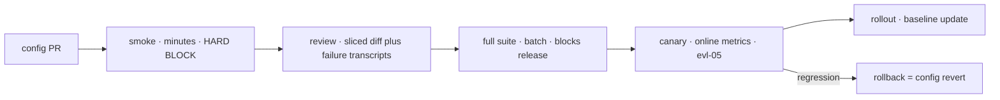

# CI for LLM Applications

A prompt edit changes production behavior without changing a line of application code. That single fact is why LLM systems need a deployment discipline of their own: the thing most likely to break your product is a change that your existing CI does not see, cannot test, and will happily deploy. This chapter wires the evaluation stack built across Module 5 into the pipeline — tiered suites matched to triggers, statistical gates that survive non-determinism ([fnd-08](../01-foundations/fnd-08-sampling-and-decoding.md)), a review culture that makes behavior changes reviewable, and the cost engineering that keeps it affordable. The chapter's organizing constraint is social rather than technical: **a gate is only useful if the team trusts it enough to obey it.** A gate that fails on noise gets overridden, and a gate that is routinely overridden is worse than no gate — it costs CI minutes and provides false assurance. Statistical honesty is therefore not pedantry here; it is what makes the whole apparatus function.

## Intuition: tests gate code, evals gate behavior

Your existing CI asserts that code does what it did before. It cannot assert anything about the behavior of a probabilistic component configured by prose, so it passes prompt changes, parameter changes, and model-version bumps without comment.

The mapping is clean once stated, and everything else follows from it:

| Traditional CI | LLM CI |
|---|---|
| Unit tests assert exact outputs | Evals assert pass *rates* over case distributions |
| A test fails or passes | A case passes at some rate across n runs |
| Regression = a test that flipped | Regression = a rate drop beyond noise |
| Trigger = code change | Trigger = **config** change: prompt, params, schema, model pin, retrieval settings |
| Artifact = the binary | Artifact = the config-hash ([eng-04](../../engineering/eng-04-llmops-stack.md)) |

The essential shift is the last row of the trigger column. **The unit of deployment in an LLM system is the configuration**, and it changes far more often than the code around it. Every prompt tweak, every temperature change, every model version adoption is a behavior deploy that deserves the ceremony code deploys get: version control, review, automated gates, staged rollout, and a rollback path ([eng-08](../../engineering/eng-08-deployment-guide.md) specifies the procedure; this chapter explains the gating).

## The tier architecture

One suite cannot serve every trigger — cost and latency make that impossible — so suites are tiered by what they cost and what they catch. This is [eng-03](../../engineering/eng-03-eval-harness-architecture.md)'s table, with the reasoning.

| Tier | Composition | Trigger | Budget | Policy |
|---|---|---|---|---|
| **Smoke** | 15–30 highest-signal cases, n=1–2, programmatic scoring only where possible | Every PR touching config | Minutes, synchronous | Hard block |
| **Full** | Entire suite, n=3–5, judges included | Nightly and pre-release | Hours, batch tier | Block release; page on category regression |
| **Deep** | Full suite + behavioral probes + capability map + red-team subset | Model-version adoption, quarterly review | A day, batch | Human sign-off with diff |

**Smoke tier design is the part that gets neglected.** Its job is to catch obvious breakage in minutes, so composition matters more than size: representative cases from each major category, recent regressions (cases that have broken before break again), and anything cheap to score programmatically — schema validity, citation resolution, required-field presence ([evl-01](evl-01-evaluation-fundamentals.md)'s scoring preference order pays here, since programmatic checks are free, instant, and deterministic). Judge calls belong in the full tier where batch pricing applies, not on the PR path where they add minutes and cost to every push.

**Deep tier exists because model adoption is the highest-risk change you make** ([api-06](../02-llm-apis/api-06-model-selection.md)). A new model version alters refusal boundaries, verbosity, and format compliance in ways no task-accuracy metric captures ([fnd-07](../01-foundations/fnd-07-post-training.md)), so the deep tier adds behavioral probes and the capability map ([fnd-09](../01-foundations/fnd-09-capabilities-and-limits.md)) to the ordinary suite.

## Statistical gating

The technical core, and where most LLM CI implementations fail on their first attempt.

**Flakiness is physics, not a defect.** Outputs are sampled; even at temperature 0 the same input can produce different text ([fnd-08](../01-foundations/fnd-08-sampling-and-decoding.md)). A gate that treats any single-run failure as a regression will fire constantly on noise. Three mechanisms make gates survivable:

- **n-run pass rates.** Run each case n times (2 for smoke, 3–5 for full) and gate on the rate. A case passing 4/5 is a different signal from one passing 0/5, and a binary pass/fail throws that distinction away.
- **Flip-count-aware thresholds.** Before treating a delta as a regression, ask how many case-flips it represents. On a 50-case suite, a 4-point drop is two cases — well within run-to-run variance ([evl-01](evl-01-evaluation-fundamentals.md)'s arithmetic). Gates should fire on drops larger than the noise band you measured, not on any drop at all. Measure that band once by running the suite repeatedly against an unchanged system; that number is your gate's floor.
- **Quarantine with expiry.** Genuinely unstable cases go to a quarantine lane that runs and reports but does not block, **with an owner and an expiry date**. Without those two fields quarantine becomes a graveyard where inconvenient failures go to be forgotten — which is how suites quietly stop testing the hard cases.

**Slice before gating.** An aggregate that holds while one category collapses is the failure mode that matters ([evl-01](evl-01-evaluation-fundamentals.md)); gate on per-category rates as well as the total, and page on category regressions even when the aggregate looks fine.

## Review culture

The human half, which determines whether any of the automation matters.

**Prompt PRs carry eval diffs.** A config change should arrive with its sliced before/after: aggregate, per-category, spread, and links to newly-failing cases. Reviewers read the *transcripts* of new failures, not just the numbers — a 2-point drop concentrated in safety cases is a different decision from the same drop spread across easy cases, and only the transcripts reveal which.

**Expected-behavior changes are product decisions.** When a PR changes what a case *should* produce, it is amending the spec ([evl-02](evl-02-eval-datasets.md): composition is the specification). That deserves the scrutiny of a product change and an explicit approver — it is the one PR type where "the eval now passes" is not automatically good news.

**Baselines update on merge, deliberately.** After a merged change, the new scores become the baseline for subsequent comparisons, keyed to the config hash. Automatic baseline updates on *failing* runs is the anti-pattern that silently ratchets quality downward.

**Someone owns the suite.** Diffuse ownership means nobody triages quarantine, refreshes cases, or investigates drift — and the suite decays into the easy-case trap. One named owner, rotating if you like, but named.

## Gate policies

Which failures block, which warn, and how overrides work — the design that determines whether gates are respected.

- **Hard block:** smoke-tier regressions, schema/structural failures, and the **safety and red-team subset** ([sec-04](../07-safety-security/sec-04-red-teaming.md)). Security regressions are non-negotiable from day one; a jailbreak that was fixed must stay fixed, and that is a hard gate.
- **Soft warn:** judge-scored dimensions pending human calibration ([evl-03](evl-03-llm-as-judge.md)), small aggregate movements within the noise band, and quarantined cases. Warnings appear in the PR and inform the reviewer without blocking.
- **Overrides need a reason and a trail.** Sometimes shipping despite a regression is correct — a known trade-off, an urgent fix. Make it possible, require a written justification, record it, and **review override frequency**: a route that is overridden repeatedly has a gate that is measuring the wrong thing, which is a finding about the gate.

The policy that ties them together, worth stating as a principle: **gates must be trustworthy to be obeyed, and trustworthy means statistically honest.** Every false positive spends credibility; enough of them and the team routes around the system entirely.

*The gated pipeline — each stage's policy annotated:*

## Model adoption through the same pipeline

Model-version adoption is not a special process; it is the deep tier plus a longer canary ([api-06](../02-llm-apis/api-06-model-selection.md), [eng-08](../../engineering/eng-08-deployment-guide.md)):

1. Pin the candidate as a parallel config entry — never edit the live pin in place.
2. Run the deep tier: task suite, behavioral probes (refusal rate, format compliance, verbosity), the capability map's previously-failing tasks, and the red-team subset.
3. Re-tune prompts where the diff demands it, with each change eval-verified ([api-02](../02-llm-apis/api-02-prompt-engineering.md) — prompts are model-calibrated and do not transfer intact).
4. Re-check token-denominated calibrations: budgets, chunk sizes, truncation limits ([fnd-04](../01-foundations/fnd-04-tokenization.md)).
5. Shadow or canary with online metrics ([evl-05](evl-05-online-evaluation.md)), then staged rollout with the old pin warm as fallback.

The reason this belongs in the CI chapter rather than being handled ad hoc: **deprecation deadlines arrive whether or not you are ready** ([api-06](../02-llm-apis/api-06-model-selection.md)), and a team that adopts models through a rehearsed pipeline does it in days while a team improvising does it under deadline pressure and ships the regressions that rushed evaluation missed.

## Cost engineering the CI

Continuous evaluation is a real line item; three levers keep it sane, all from [api-05](../02-llm-apis/api-05-streaming-caching-batch.md):

- **Batch everything that isn't blocking.** Full and deep tiers have no user waiting, so they belong on the batch API at roughly half price with no rate-limit pressure on production quotas.[^openai-batch] Eval suites are the canonical batch workload.
- **Cache the suite's stable prefix.** A suite sends the same system prompt, schemas, and rubric hundreds of times — the ideal stable-prefix caching workload, often the single largest saving available.
- **Tier by cost, not just by speed.** Programmatic checks are free; run them everywhere. Judge calls cost money; run them nightly. Panels cost several times more; reserve them for release gates.

Budget per-PR eval spend explicitly. A smoke suite that costs cents per PR is invisible; one that costs dollars per push becomes a target for removal in the next cost review — and the gate you lose is worth more than the money you save.

## Production engineering perspective

- **Wire the smoke tier as a required status check.** A gate that is technically available but not required is documentation, not a gate.
- **Keep eval runs reproducible:** pin the corpus snapshot ([rag-07](../03-retrieval/rag-07-rag-evaluation.md)), the judge config ([evl-03](evl-03-llm-as-judge.md)), and the model version. A score comparison spanning two different instruments is not a comparison.
- **Report the four-part result** ([evl-01](evl-01-evaluation-fundamentals.md)): diff versus baseline, n-run rate, spread, per-category slices. A single number in a PR comment invites exactly the misreading the statistics section warns about.
- **Include cost and latency in the gate**, not just quality — a change that improves scores while doubling cost per task should surface that trade-off at review time ([eng-10](../../engineering/eng-10-cost-optimization.md)).
- **Rollback is a config revert**, which is why config lives in version control separately from code: reverting behavior should not require reverting a deploy.

## Historical evolution

**2022–2023:** prompts live in application code, ship with code deploys, and are tested by manual spot-checks — which works until the first silent regression teaches the team otherwise. **2023:** prompt-versioning and eval tooling appear; teams begin running suites manually before releases, and the "prompts are code" framing takes hold. **2023–2024:** automated eval gates in CI become standard among serious teams, along with the discovery that naive gating fails on non-determinism — n-run pass rates and quarantine lanes emerge as the fixes.[^husain-evals] Batch APIs make comprehensive nightly suites affordable.[^openai-batch] **2024–present:** the pipeline consolidates — config registries with hashes, tiered suites, canary rollouts with online validation ([evl-05](evl-05-online-evaluation.md)) — and model-version adoption is folded into the same machinery rather than handled as a special project. The trajectory is unremarkable and that is the point: **LLM CI is converging on ordinary software delivery discipline, with pass rates substituted for assertions.**

## Common misconceptions

- **"Our CI already tests the app."** It tests code. A prompt or model-pin change alters behavior with no code diff, and traditional CI passes it silently — which is the exact gap this chapter closes.
- **"Gate on the aggregate score."** Aggregates hide category collapses. Gate per-slice as well, and page on category regressions even when the total looks fine.
- **"Any failing case should block."** Then noise blocks, the team overrides habitually, and the gate loses its meaning. Gate on rates beyond a measured noise band.
- **"Quarantine is where flaky cases go."** Quarantine without owners and expiry is where inconvenient failures go to be forgotten. It is a temporary state with a deadline.
- **"Run the full suite on every commit."** Cost and latency make that a gate people delete. Tier: programmatic checks everywhere, judges nightly on batch, panels at release.
- **"Model upgrades need a special process."** They need the deep tier and a longer canary — the same pipeline, more thoroughly. Special processes are the ones that get skipped under deadline.

## Failure modes and trade-offs

- **The overridden gate** — false positives from noise train the team to click through, and the gate stops functioning. *Fix:* measure the noise band, gate outside it, and track override frequency as a health metric.
- **Quarantine graveyard** — hard cases accumulate in the non-blocking lane and the suite quietly gets easier. *Fix:* owner and expiry on every quarantined case; review the lane monthly.
- **Baseline ratchet** — baselines auto-update after failing runs, so quality drifts down while every individual comparison looks fine. *Fix:* baselines update only on deliberate merges.
- **Unreproducible comparisons** — corpus, judge, or model changed between runs, so the diff means nothing. *Fix:* pin all three; record hashes in results.
- **CI cost creep** — full suites on every push; the eval budget becomes a target in the next cost review. *Fix:* tier by cost, batch the non-blocking tiers, cache suite prefixes.
- **Spec change disguised as a fix** — a PR edits expected behavior so a failing case passes. *Fix:* expected-behavior changes require product approval and a written justification.

## Best practices

- **Make the smoke tier a required check** on any PR touching prompts, parameters, schemas, model pins, or retrieval config.
- **Gate on n-run rates beyond a measured noise band**, sliced by category, with the four-part result in the PR.
- **Hard-block safety and red-team regressions from day one**; soft-warn uncalibrated judge dimensions.
- **Require transcripts, not just numbers, in review** — reviewers should read newly-failing cases.
- **Treat expected-behavior edits as product decisions** with an explicit approver.
- **Quarantine with owner and expiry; review the lane monthly.**
- **Pin corpus, judge, and model for every run**, and update baselines only on merge.
- **Batch and cache the expensive tiers**, and budget per-PR eval spend so the gate survives cost review.
- **Adopt models through the deep tier plus canary** — the same pipeline, run more thoroughly, rehearsed ahead of deprecation deadlines.

## Real-world examples

**The gate everyone ignored.** A team wires their 200-case suite into CI as a required check, gating on any drop in aggregate score. Within three weeks it fails on roughly half of all PRs — single-run flakiness on a suite with judge-scored cases producing 1–3 point swings on unchanged code. Engineers learn to re-run until green, then to use the override. Two months later a real 9-point regression ships because it looked like the noise everyone had been dismissing. The rebuild measures the noise band first (running the suite five times against an unchanged system: ±3.5 points), gates at 5 points, moves judge cases to the nightly tier, and adds a 20-case programmatic smoke tier for PRs. Override rate drops to near zero and the gate becomes meaningful — **the fix was statistical honesty, not stricter enforcement.**

**The category that collapsed under a passing aggregate.** A prompt refactor improves the overall suite from 87% to 89% and merges. Support tickets spike a week later on one document type. The retrospective finds that category fell from 94% to 61% while three other categories improved enough to mask it in the aggregate. The team adds per-category gating with a paging threshold on any category dropping more than 8 points, regardless of the total — and adds the category breakdown to the PR comment so the reviewer would have seen it. The aggregate was never wrong; it was just answering a different question than the one that mattered.

**The deprecation that was a non-event.** A provider announces a model sunset with 90 days' notice. The team runs their deep tier against the successor the same week: task suite holds, but refusal rate on borderline-benign inputs rises and two capability-map tasks now pass that previously failed. They re-tune two prompts, verify with the suite, shadow for three days, canary at 10% for a week watching online metrics, and complete rollout on day 21 — with the old pin warm for another two weeks. Total effort: about three engineer-days. The team that treats adoption as routine pipeline work does it in days; the same event consumes a quarter for a team improvising under deadline ([api-06](../02-llm-apis/api-06-model-selection.md)'s fire-drill example is the counterfactual).

## Interview questions

1. **"Why do LLM applications need their own CI?"** — Model answer: because the unit of deployment is the configuration, not the code. A prompt edit, a temperature change, or a model-pin bump alters production behavior with no code diff, so traditional CI passes it without comment — the change most likely to break the product is the one the pipeline can't see. LLM CI substitutes pass rates over case distributions for exact assertions, triggers on config changes, and gates on statistically-honest deltas. Everything else — version control, review, staged rollout, rollback — is ordinary delivery discipline applied to a new artifact type.

2. **"How do you gate on a non-deterministic system?"** — Model answer: measure the noise first. Run the suite repeatedly against an unchanged system to establish the run-to-run variance band, then gate on drops beyond it rather than on any drop. Use n-run pass rates per case (2 for smoke, 3–5 for full) so a 4/5 case is distinguishable from a 0/5. Apply flip-count reasoning — on a 50-case suite a 4-point move is two cases, likely noise. Slice by category so a collapse hidden under a stable aggregate still fires. And quarantine genuinely unstable cases with an owner and expiry so they neither block nor disappear.

3. **"What tiers would you build and why?"** — Model answer: smoke — 15–30 high-signal cases, programmatic scoring where possible, n=1–2, running synchronously on every config PR as a required hard block; it must finish in minutes and cost cents, which is why judge calls stay out of it. Full — the whole suite with judges at n=3–5, nightly and pre-release on the batch tier at half price, blocking releases and paging on category regressions. Deep — full suite plus behavioral probes, capability map, and red-team subset, for model-version adoption and quarterly review, with human sign-off. The tiering is by cost as much as speed: free checks everywhere, paid checks nightly, expensive panels at release gates.

4. **"What makes a gate trustworthy?"** — Model answer: that it fires on real regressions and not on noise, because credibility is the resource being spent. A gate producing false positives trains the team to override habitually, and then it provides false assurance while catching nothing — which is worse than no gate. So: gate outside the measured noise band, use n-run rates, slice by category, and make overrides possible but require a written reason and track their frequency. A route with repeated overrides has a gate that's measuring the wrong thing, and that's a finding about the gate rather than about the engineers.

5. **"How should a prompt change be reviewed?"** — Model answer: like a behavior deploy, because that's what it is. The PR should carry the sliced eval diff — aggregate, per-category, spread, and links to newly-failing cases — and the reviewer should read the *transcripts* of new failures, not just the numbers, since a 2-point drop concentrated in safety cases is a completely different decision from the same drop across easy cases. If the PR changes what a case is expected to produce, that's an amendment to the spec and needs product approval, since "the eval now passes" is not automatically good news there. On merge, baselines update keyed to the new config hash.

6. **"How do you keep eval costs from making CI unaffordable?"** — Model answer: tier by cost. Programmatic checks — schema validity, citation resolution, required fields — are free and deterministic, so they run on every commit. Judge-scored suites run nightly on the batch API at roughly half price with no pressure on production rate limits. Panels of judges are reserved for release gates. Beyond tiering, eval suites are the ideal prompt-caching workload since they send identical system prompts and rubrics hundreds of times, so caching the stable prefix is usually the largest single saving. And I'd budget per-PR spend explicitly — a smoke tier costing dollars per push will be deleted in the next cost review, and losing the gate costs more than the money.

7. **"Walk me through adopting a new model version."** — Model answer: through the same pipeline, at the deep tier. Pin the candidate as a parallel config entry rather than editing the live pin. Run the deep suite — task cases plus behavioral probes for refusal rate, verbosity, and format compliance, since post-training refreshes move those without touching capability, plus the capability map's previously-failing tasks, plus the red-team subset. Re-tune prompts where the diff demands it, verifying each change, and re-check token-denominated calibrations like budgets and chunk sizes. Then shadow or canary with online metrics, staged rollout, old pin kept warm as fallback, and a decision-log entry. Rehearsed, that's a few engineer-days — which is why it should be routine rather than a special project run under deprecation deadline.

## Exercises and mini-project

**Exercises**

1. Your 60-case suite scores 84%, 81%, 85%, 83%, 82% across five runs on unchanged code. What is your noise band, and where do you set the gate?
2. Design the smoke tier for a RAG assistant: which 20 cases, which scoring methods, and what the target runtime and cost are.
3. A PR changes an expected behavior so a previously-failing case now passes. Write the review checklist for that PR.
4. Your override rate on one route is 40%. Give three hypotheses and the diagnostic for each.
5. Compute monthly CI eval cost for 40 PRs/day at 20 cases × 2 runs, plus nightly 300 cases × 3 runs with judges — before and after batching and prefix caching (state your assumptions).

**Mini-project: gate the capstone.** Wire your suite into real CI: (a) smoke tier — 20 cases, programmatic scoring, n=2, as a required check on any PR touching `prompts/` or config; (b) measure your noise band by running the suite five times unchanged, and set the gate threshold from it; (c) full tier nightly on the batch API with judges, reporting the four-part result; (d) a quarantine lane with owner and expiry fields; (e) introduce a deliberate regression in a prompt and confirm the gate catches it, then a noise-level change and confirm it does *not*; (f) write the override policy and the PR comment template. Target: 4 hours. Success criterion: a gate that caught your real regression and ignored your fake one.

**Capstone extension:** this completes the quality stack. The capstone is now self-protecting — [eng-03](../../engineering/eng-03-eval-harness-architecture.md)'s harness, gated by this pipeline, fed by [evl-05](evl-05-online-evaluation.md)'s online loop, and used by [api-06](../02-llm-apis/api-06-model-selection.md) for model adoption.

## Revision summary

- The unit of deployment is the **configuration** (prompt, params, schema, model pin, retrieval settings), which changes more often than code and is invisible to traditional CI — so evals gate behavior the way tests gate code, with pass rates substituted for assertions.
- Tier by cost and trigger: smoke (15–30 cases, programmatic, n=1–2, every config PR, hard block), full (whole suite with judges, n=3–5, nightly on batch, blocks release), deep (plus behavioral probes, capability map, red-team — for model adoption).
- Statistical gating is what makes gates obeyed: measure the noise band, gate outside it, use n-run rates, slice by category, and quarantine unstable cases *with owner and expiry*.
- Review culture: PRs carry sliced eval diffs and reviewers read failure transcripts; expected-behavior changes are product decisions; baselines update only on merge; someone owns the suite.
- Policies: hard-block smoke and safety/red-team regressions, soft-warn uncalibrated judge dimensions, allow overrides with written reasons and track their frequency as a gate-health metric.
- Cost: batch the non-blocking tiers, cache the suite's stable prefix, and budget per-PR spend so the gate survives cost review. Model adoption runs the same pipeline at deep tier plus a longer canary.

## Flashcards

| Q | A |
|---|---|
| Why can't traditional CI protect an LLM app? | It tests code; prompt, parameter, and model-pin changes alter behavior with no code diff and pass silently. |
| What replaces the assertion in LLM CI? | An n-run pass rate over a case distribution, gated against a measured noise band. |
| The three tiers and their triggers? | Smoke (every config PR, minutes, hard block), full (nightly/pre-release, batch, blocks release), deep (model adoption, human sign-off). |
| How do you set a gate threshold? | Run the suite repeatedly against unchanged code to measure run-to-run variance; gate outside that band. |
| Why gate per-category, not just aggregate? | An aggregate can hold or improve while one category collapses — the failure that actually reaches users. |
| What must every quarantined case have? | An owner and an expiry date — otherwise quarantine becomes a graveyard and the suite quietly gets easier. |
| Which failures hard-block from day one? | Smoke-tier regressions, structural/schema failures, and the safety/red-team subset. |
| What does a config PR need at review? | The sliced eval diff (aggregate, category, spread) plus transcripts of newly-failing cases. |
| When is "the eval now passes" not good news? | When the PR changed the expected behavior — that's a spec amendment needing product approval. |
| Why does override frequency matter? | Repeated overrides mean the gate is measuring the wrong thing; it's a health metric for the gate, not the team. |
| How is model adoption handled? | Same pipeline at deep tier — behavioral probes and capability map added — plus a longer canary and a warm fallback pin. |

## Further reading

- **Official docs:** Anthropic[^anthropic-evals] and OpenAI[^openai-evals] evaluation guides; the Batch API docs[^openai-batch] for the economics that make nightly suites affordable.
- **Papers:** none — this is delivery practice.
- **Books:** Kohavi, Tang & Xu[^kohavi-experiments] for the canary/rollout half of the pipeline.
- **Talks:** none essential.
- **Tutorials:** Husain, "Your AI Product Needs Evals"[^husain-evals] — [T5, flagged: practitioner canon; the CI workflow detail isn't covered at this level elsewhere].

## Check your understanding

1. Explain why the configuration is the deployment unit, and list everything that belongs in it.
2. Your gate fires on 40% of PRs. Diagnose, and give the two changes you'd make first.
3. Design the tier assignment for: a schema validity check, a groundedness judge, a jailbreak regression case, and a capability probe.
4. Why must baselines update only on merge, and what goes wrong otherwise?
5. Trace a model-version adoption through this pipeline, naming what each stage would catch that the previous one wouldn't.

## Sources

[^anthropic-evals]: [T1] Anthropic. "Create strong empirical evaluations." https://docs.anthropic.com/en/docs/build-with-claude/develop-tests (accessed 2026-07-10)
[^openai-evals]: [T1] OpenAI. "Evaluating model outputs." https://platform.openai.com/docs/guides/evals (accessed 2026-07-10)
[^openai-batch]: [T1] OpenAI. "Batch API." https://platform.openai.com/docs/guides/batch (accessed 2026-07-10)
[^kohavi-experiments]: [T3] Kohavi, Tang & Xu (2020). *Trustworthy Online Controlled Experiments*. Cambridge University Press. https://experimentguide.com/ (accessed 2026-07-10)
[^husain-evals]: [T5 — practitioner canon; CI workflow detail not covered at this level in higher-tier sources] Husain, H. (2024). "Your AI Product Needs Evals." https://hamel.dev/blog/posts/evals/ (accessed 2026-07-10)
