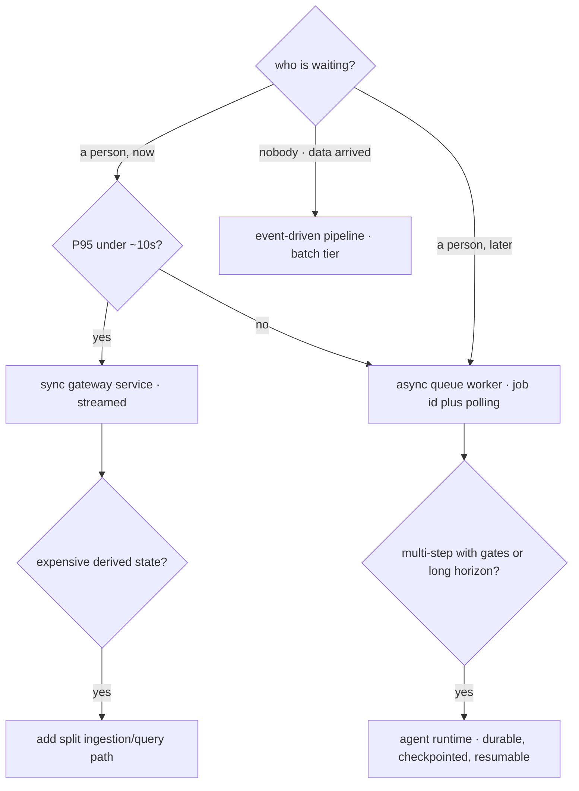
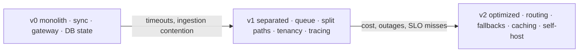

# Architecture Patterns for LLM Apps

Everything in modules 2–5 built components: a gateway, a retrieval pipeline, an agent runtime, an eval harness. This chapter is about the shapes they assemble into, and the claim that organizes it is that **there are only a handful of shapes, and workload characteristics choose among them.** Not preference, not fashion — four properties of LLM calls (they are slow, expensive, stateful per-request, and routinely fallible) constrain the design space enough that production systems converge. Knowing the catalog lets you recognize which shape a problem wants in the first design meeting rather than discovering it after a quarter of building the wrong one. The chapter also covers the decisions that cut across all shapes — where state lives, how multi-tenancy works, how queues are designed for token-metered work — and the evolution path most systems actually take, where each step is justified by a measured pain rather than adopted preemptively.

## Intuition: four properties, four pressures

Every pattern here is a response to at least one of four facts about LLM calls that conventional service design does not have to accommodate:

- **They are slow.** Seconds, not milliseconds, and the floor is architectural — decode generates one token at a time ([fnd-05](../01-foundations/fnd-05-transformer-architecture.md)). This is what pushes long work off the request path entirely.
- **They are expensive and metered.** Cost scales with tokens, so architecture decisions are cost decisions — where you cache, what you batch, which model handles what ([api-05](../02-llm-apis/api-05-streaming-caching-batch.md), [prd-05](prd-05-cost-engineering.md)).
- **They carry per-request state.** The KV cache is per-request working memory ([fnd-05](../01-foundations/fnd-05-transformer-architecture.md)), which makes the model tier fundamentally different from a stateless app tier — you cannot scale it by adding replicas without thinking about memory ([prd-02](prd-02-inference-and-serving.md)).
- **They fail routinely.** Rate limits, overloads, timeouts, and content filtering are normal operating conditions ([api-01](../02-llm-apis/api-01-llm-api-fundamentals.md)), so retry, fallback, and degradation are structural rather than exceptional.

Read the catalog below as answers to those pressures. The good news for an experienced engineer: **none of this is new distributed-systems theory** — queues, workers, idempotency, and back-pressure are decades old.[^kleppmann-ddia] What's new is which knobs the constraints push you toward.

## The shape catalog

**1. Synchronous gateway service.** Request in, model call through the gateway, response out — streamed ([api-05](../02-llm-apis/api-05-streaming-caching-batch.md)). The default for interactive features where a human waits: chat, autocomplete, single-shot classification behind a UI. Everything from [api-01](../02-llm-apis/api-01-llm-api-fundamentals.md) applies directly, and streaming is what makes multi-second latency tolerable.

*Fits when:* P95 completion is comfortably inside what a user will wait for with visible progress — practically, under ~10 seconds.

**2. Async queue worker.** The client submits a job, gets an ID, and polls or receives a webhook; workers pull from a queue and process. The pattern for anything long: document processing, agent tasks, batch enrichment, multi-step pipelines.

*Fits when:* work exceeds the sync budget, or you need retry/resume semantics, or throughput matters more than latency. The rule of thumb worth adopting: **anything whose P95 exceeds ~10 seconds should be async**, because holding an HTTP connection that long is fragile (timeouts at every proxy layer) and gives you no resumption story.

**3. Split ingestion/query.** [eng-01](../../engineering/eng-01-rag-pipeline-architecture.md)'s two-system view, generalized: a batch path that builds derived state and an online path that serves from it. RAG is the canonical instance, but the shape recurs — anything with an expensive precomputation and a latency-sensitive read.

*Fits when:* there's derived state expensive to build and cheap to query. The discipline it enforces: the paths scale, deploy, and fail independently, so an ingestion backfill can't degrade query latency.

**4. Agent runtime as a job system.** [eng-02](../../engineering/eng-02-agent-loop-architecture.md)'s loop, hosted properly: checkpointable, resumable, budget-bounded, with human-gate pauses that can outlive a process ([agt-09](../04-agents/agt-09-agent-reliability.md)). This is the async pattern with extra requirements — a run may pause for hours awaiting approval, so its state must be durable rather than in-memory.

*Fits when:* multi-step autonomous work with gates or long horizons.

**5. Event-driven enrichment.** Documents, tickets, or events arrive; a pipeline processes each and writes results. No user waits at all, which makes it the natural home for the batch API's economics ([api-05](../02-llm-apis/api-05-streaming-caching-batch.md), [openai-batch](https://platform.openai.com/docs/guides/batch)).[^openai-batch]

*Fits when:* the trigger is data arriving rather than a person asking.

*Choosing a shape from the workload's properties:*

## Cross-cutting decisions

Three choices that apply to every shape and are expensive to change later.

**State placement.** LLM systems accumulate three kinds of state, and conflating them is a common source of pain. **Conversation state** (message history) belongs in a store keyed by session, not in memory — because the API is stateless ([api-01](../02-llm-apis/api-01-llm-api-fundamentals.md)) and any worker may serve any request. **Task state** for async work (progress, partial results, plan — [agt-04](../04-agents/agt-04-memory-and-state.md)) must be durable if the task can outlive a process, which for anything with human gates it will. **Derived state** (indexes, caches) is rebuildable by definition and should be treated that way ([eng-01](../../engineering/eng-01-rag-pipeline-architecture.md)). The design test: *if this process dies right now, what is lost and does it matter?*

**Multi-tenancy.** A day-one decision because retrofitting is a migration. Three layers need it: **data** (per-tenant index partitions rather than filters — [rag-02](../03-retrieval/rag-02-vector-search.md)'s post-filter starvation has a security twin), **quota** (a heavy tenant must not consume another's rate-limit budget — separate keys or client-side token accounting per tenant, [api-01](../02-llm-apis/api-01-llm-api-fundamentals.md)), and **cost attribution** (per-tenant token accounting, or you cannot price the product — [prd-05](prd-05-cost-engineering.md)).

**Queue design for token-metered work.** Standard queueing with two LLM-specific adjustments. **Priority lanes**: interactive work and bulk backfills must not share a lane, or a backfill starves users — the [api-01](../02-llm-apis/api-01-llm-api-fundamentals.md) 429-storm incident is this failure. And **token-aware rate shaping**: worker concurrency should be governed by tokens-per-minute rather than request count, since a job with a 50k-token prompt consumes far more quota than one with 2k ([api-01](../02-llm-apis/api-01-llm-api-fundamentals.md)'s TPM arithmetic). A fixed worker pool sized by request count will either starve or overrun the quota depending on payload mix.

## Scaling units

What actually scales, and what doesn't, which is where LLM architecture diverges most from web-tier instincts.

| Tier | Scales by | Constraint |
|---|---|---|
| App / gateway | Adding stateless replicas | Trivial; almost never the bottleneck |
| Model (hosted) | Provider quota (TPM/RPM) | Contractual, not technical — raise tiers or shard keys |
| Model (self-hosted) | GPU memory and bandwidth | Hard physical ceiling ([prd-02](prd-02-inference-and-serving.md)) |
| Index / vector store | Memory, then sharding | Working set must fit RAM or latency collapses ([rag-03](../03-retrieval/rag-03-vector-databases.md)) |
| Queue / workers | Worker count, governed by token budget | Downstream quota, not CPU |

The instinct to correct: **your app tier is essentially never the bottleneck.** Adding replicas to a service that is waiting on a rate-limited model API just produces more requests hitting the same 429. The bottleneck is nearly always the model tier's quota (hosted) or memory (self-hosted), and the fix is quota, caching, routing, or batching — not horizontal scale.

The corollary is a diagnostic habit: **find the bottleneck before scaling anything.** Per-stage latency and per-stage cost from your traces ([evl-04](../05-evaluation/evl-04-tracing-observability.md)) answer it in minutes; scaling by instinct wastes money and moves nothing.

## Evolution: v0 to v2

The path most systems take, with each step earned rather than planned.

**v0 — the monolith.** One service, synchronous, direct model calls (through a gateway from day one — [api-01](../02-llm-apis/api-01-llm-api-fundamentals.md)), state in the primary database, no queue. Correct for the first months: it's fast to build, easy to debug, and most products never leave it. *Pain that triggers the next step:* requests timing out, ingestion competing with serving, or one tenant degrading another.

**v1 — separated concerns.** Async queue for long work; ingestion split from serving ([eng-01](../../engineering/eng-01-rag-pipeline-architecture.md)); priority lanes; per-tenant partitions and quota; tracing and eval gates wired ([eng-04](../../engineering/eng-04-llmops-stack.md)). **This is where most production systems should live**, and the shape the rest of this module assumes. *Pain that triggers v2:* cost pressure, provider outages hurting availability, or latency SLOs unmet at peak.

**v2 — optimized.** Model routing and cascades ([api-06](../02-llm-apis/api-06-model-selection.md), [eng-05](../../engineering/eng-05-design-patterns.md) #2), fallback chains ([prd-04](prd-04-reliability.md)), semantic caching with a staleness contract, self-hosted inference for high-volume routes ([api-07](../02-llm-apis/api-07-local-inference.md), [prd-02](prd-02-inference-and-serving.md)), fleet capacity management ([prd-06](prd-06-deployment-infrastructure.md)).

*The evolution, with the pain that justifies each step:*

The anti-pattern is building v2 at v0 scale — the premature-infrastructure failure ([fnd-01](../01-foundations/fnd-01-ai-engineering-landscape.md)) in its architectural form. Its mirror is staying at v0 past the first tenant-starvation incident.

## Production engineering perspective

- **Design the async path before you need it.** Converting a synchronous endpoint to a job API is a client-facing breaking change; having the shape ready costs little and avoids a migration under pressure.
- **Idempotency everywhere jobs exist.** Queues redeliver, workers crash mid-task, and clients retry — every job needs a key so duplicate execution is a no-op ([api-01](../02-llm-apis/api-01-llm-api-fundamentals.md), [agt-02](../04-agents/agt-02-tool-design.md)).
- **Back-pressure, not unbounded queues.** A queue that grows without limit converts an overload into a latency disaster with no recovery; shed or reject at the edge, with the priority lane deciding who gets shed first.
- **Everything through the gateway.** Workers, ingestion jobs, and eval runs must all go through the same client so pinning, retries, logging, and usage accounting are uniform ([eng-04](../../engineering/eng-04-llmops-stack.md)).
- **Design for partial results.** Long jobs that produce nothing until the end are worse for users and worse for debugging than jobs that stream or checkpoint intermediate output.
- **Separate keys per workload class** so bulk work cannot exhaust interactive quota — the cheapest reliability control available ([eng-08](../../engineering/eng-08-deployment-guide.md)).

## Historical evolution

**2022–2023:** LLM features ship as synchronous endpoints inside existing applications, because prototypes are small and the pattern is familiar. Timeouts and rate-limit incidents follow. **2023:** the async job pattern becomes standard for document processing and long generations, and RAG's two-path structure is recognized as its own shape rather than an implementation detail.[^kwon-paged] **2023–2024:** agent workloads force the durable-job requirement — runs that pause for human approval cannot live in process memory — and batch APIs formalize the economics of the no-one-is-waiting path.[^openai-batch] Practitioner guidance converges on starting simple and adding orchestration only on measured need.[^anthropic-agents] **2024–present:** the patterns stabilize and attention shifts to cost and reliability *within* them ([prd-04](prd-04-reliability.md), [prd-05](prd-05-cost-engineering.md)). The notable thing about this history is how conventional it is: **LLM architecture converged on the same shapes as any latency-and-cost-constrained distributed system**, which is why classical distributed-systems knowledge transfers almost intact.[^kleppmann-ddia]

## Common misconceptions

- **"Scale the app tier to handle more load."** The app tier is almost never the bottleneck; more replicas against a rate-limited model API just produce more 429s. Find the bottleneck first — it's usually quota or GPU memory.
- **"Keep it synchronous; async adds complexity."** Holding an HTTP connection for a minute is its own complexity — proxy timeouts, no resumption, no retry semantics, and a bad user experience. Past ~10 seconds, async is simpler.
- **"Multi-tenancy can be added later."** Data partitioning, quota isolation, and cost attribution all touch the core; retrofitting is a migration, and the incident that forces it is one tenant degrading everyone else.
- **"Queue depth is the metric to watch."** For token-metered work, the binding constraint is tokens per minute, so worker concurrency should be shaped by token budget rather than request count.
- **"Semantic caching is an obvious win."** Unlike prefix caching, it trades correctness for cost via a similarity threshold and needs a staleness contract ([eng-05](../../engineering/eng-05-design-patterns.md)). It belongs in v2, with evidence.
- **"Build for scale from the start."** v2 machinery at v0 scale is cost without benefit — and the shapes are easy to adopt when the measured pain arrives.

## Failure modes and trade-offs

- **Synchronous timeout cascades** — a slow model call holds connections, exhausting the pool and taking down endpoints that don't use the model at all. *Fix:* async past the sync budget; bulkheads between model-calling and non-model paths.
- **Backfill starving production** — a bulk job consumes the shared quota and interactive traffic 429s. *Fix:* priority lanes and separate keys per workload class.
- **Lost work on restart** — in-memory task state disappears when a worker recycles. *Fix:* durable task state; checkpoints for long runs.
- **Duplicate side effects** — queue redelivery executes a job twice. *Fix:* idempotency keys, always.
- **Unbounded queue growth** — an overload becomes a multi-hour latency disaster. *Fix:* bounded queues with shedding by priority.
- **Tenant noisy-neighbor** — one customer's usage degrades others. *Fix:* per-tenant quota and partitioned data from day one.
- **The central trade-off:** simplicity versus isolation. Every split (queue, path, tenant, key) buys containment and costs operational surface — which is why the evolution path is driven by measured pain rather than anticipated need.

## Real-world examples

**The endpoint that took down the app.** A document-summarization feature is added as a synchronous endpoint to an existing web service. Summaries take 30–90 seconds; under moderate load the connection pool fills with waiting requests, and endpoints that have nothing to do with LLMs start timing out. The immediate fix is a bulkhead — a separate pool for model-calling routes — and the real fix is the async pattern: submit, get a job ID, poll. **The failure was not LLM-specific at all**; it's the classic slow-dependency-exhausts-the-pool problem, which is exactly why classical distributed-systems instincts transfer here.[^kleppmann-ddia]

**The backfill that starved production.** A team runs a re-embedding backfill ([fnd-03](../01-foundations/fnd-03-embeddings.md)'s versioning tax) with 200 parallel workers against the production API key. Interactive traffic starts 429ing within minutes, and because the backfill's workers retry aggressively, the quota stays saturated for hours ([api-01](../02-llm-apis/api-01-llm-api-fundamentals.md)'s retry storm). Fixes in order of leverage: a separate key for bulk work, token-aware concurrency control instead of a fixed worker count, and moving the backfill to the batch tier where it costs half as much and doesn't touch interactive quota at all. **The architecture already had the answer; nobody had drawn the lane boundary.**

**The agent run that died at hour six.** An agent runtime holds task state in worker memory. A deploy recycles the workers, and every in-flight run — including several paused awaiting human approval — vanishes, with no way to resume and no record of what had been done. The rebuild makes task state durable (plan, completed steps, partial results, gate status in the database), checkpoints after each step, and makes resumption idempotent. Deploys stop being destructive events. **Human gates mean runs outlive processes**, so durability isn't optional for any agent system with approvals.

## Interview questions

1. **"How do you decide between a synchronous and an asynchronous LLM feature?"** — Model answer: by P95 completion time against what a user will wait for, practically around ten seconds with streaming to make the wait visible. Past that, holding an HTTP connection is fragile — proxy and load-balancer timeouts, no resumption, no retry semantics — so a job API with polling or webhooks is *simpler*, not more complex. I'd also go async regardless of duration when the work needs retry or resume semantics, or when throughput matters more than latency. And I'd design the async shape early, since converting a sync endpoint later is a client-facing breaking change.

2. **"What are the scaling units in an LLM system, and which is usually the bottleneck?"** — Model answer: a stateless app tier that scales trivially and is almost never the bottleneck; a model tier bounded by provider quota if hosted or by GPU memory and bandwidth if self-hosted; an index tier bounded by memory before sharding; and workers bounded by the downstream token budget rather than CPU. The bottleneck is nearly always the model tier, which is why adding app replicas is the classic wasted response — more replicas against a rate-limited API just produce more 429s. The fix is quota, caching, routing, or batching, and I'd find the bottleneck from per-stage traces before scaling anything.

3. **"How do you design queues for LLM work?"** — Model answer: with two adjustments to standard queueing. Priority lanes, so bulk backfills and interactive requests don't share capacity — otherwise a backfill starves users, which is the most common self-inflicted incident in this space. And token-aware rate shaping: worker concurrency should be governed by tokens per minute rather than request count, since a 50k-token job consumes far more quota than a 2k one, so a fixed pool sized by request count will either starve or overrun depending on payload mix. Beyond that it's conventional: bounded queues with shedding rather than unbounded growth, idempotency keys because redelivery happens, and back-pressure at the edge.

4. **"What state does an LLM system have and where should it live?"** — Model answer: three kinds. Conversation state — the message history — belongs in a session-keyed store, because the API is stateless and any worker may serve any request. Task state for async work (progress, partial results, plan, gate status) must be durable if the task can outlive a process, and with human gates it always can — a run paused for approval must survive a deploy. Derived state — indexes and caches — is rebuildable by definition and should be treated as such, with raw sources as the system of record. The design test I'd apply to each: if this process dies right now, what is lost and does it matter?

5. **"Why is multi-tenancy a day-one decision?"** — Model answer: because it touches three layers that are all expensive to retrofit. Data isolation should be partitioning rather than filtering — a per-tenant index namespace, since post-filtering both starves selective queries and makes access control advisory rather than enforced. Quota isolation needs separate keys or per-tenant token accounting, or one heavy tenant consumes everyone's rate limit. And cost attribution needs per-tenant token accounting from the start, or you can't price the product. Each is a migration afterwards, and the incident that forces the work is usually a customer noticing another customer's load.

6. **"Walk me through how an LLM architecture evolves."** — Model answer: v0 is a synchronous monolith with a gateway and state in the primary database — correct for months, and where most products should stay longest. The pain that ends it is timeouts, ingestion competing with serving, or tenant interference. v1 separates concerns: async queue for long work, ingestion split from query, priority lanes, per-tenant partitions and quota, tracing and eval gates — and most production systems should live here. v2 arrives on cost or reliability pressure: model routing and cascades, fallback chains, semantic caching with a staleness contract, self-hosting for high-volume routes. Each step is justified by a measured pain; building v2 at v0 scale is cost without benefit.

## Exercises and mini-project

**Exercises**

1. For each, choose a shape and justify: (a) chat with streaming; (b) summarize a 200-page PDF; (c) classify inbound tickets as they arrive; (d) a research agent with an approval step; (e) nightly re-scoring of a catalog.
2. Your worker pool is 50 workers and your quota is 400k TPM. Design the token-aware concurrency control — what you measure and how you throttle.
3. List every place tenant isolation must exist in a RAG-backed multi-tenant product, and the failure each prevents.
4. A synchronous endpoint's P95 is 22 seconds. Give the migration plan to async, including the client-facing changes.
5. Your app tier is at 15% CPU and requests are timing out. Give three hypotheses and the trace query that distinguishes them.

**Mini-project: architect the capstone.** For your capstone system: (a) draw its current shape and identify which catalog pattern it is; (b) name the measured pain that would justify moving to the next stage, with the metric and threshold; (c) implement the async path for its longest operation, including job IDs, durable task state, idempotency, and partial results; (d) add priority lanes separating interactive from bulk work, with separate keys; (e) add per-tenant token accounting and verify one tenant cannot exhaust another's budget; (f) memo: your architecture diagram, your v1 triggers, and the bottleneck you measured. Target: 5 hours. Success criterion: an async path that survives a worker restart mid-job, and a measured bottleneck rather than an assumed one.

**Capstone extension:** this is the capstone's production shape; [prd-02](prd-02-inference-and-serving.md) goes inside the model tier, [prd-04](prd-04-reliability.md) hardens the failure paths, and [prd-05](prd-05-cost-engineering.md) attaches unit economics to each route.

## Revision summary

- Four properties of LLM calls — slow, expensive, per-request stateful, routinely fallible — constrain the design space, so production systems converge on a small catalog of shapes.
- The shapes: synchronous gateway service (interactive, under ~10s, streamed); async queue worker (anything longer, or needing retry/resume); split ingestion/query (expensive derived state); agent runtime as a durable job system (multi-step with gates); event-driven pipeline (nobody waiting — batch tier economics).
- Cross-cutting: **state placement** (conversation in a session store, task state durable if it can outlive a process, derived state rebuildable); **multi-tenancy day one** (partitioned data, isolated quota, per-tenant cost attribution); **queues shaped by tokens** with priority lanes separating bulk from interactive.
- Scaling: the app tier is almost never the bottleneck; the model tier's quota or GPU memory usually is. Find the bottleneck from traces before scaling anything.
- Evolution v0 → v1 → v2, each step triggered by measured pain: monolith until timeouts and contention; separated concerns (where most systems should live); optimization (routing, fallbacks, caching, self-hosting) only under cost or reliability pressure.

## Flashcards

| Q | A |
|---|---|
| The four properties that constrain LLM architecture? | Slow (seconds), expensive and metered, per-request stateful (KV cache), routinely fallible. |
| The sync-versus-async threshold? | Roughly P95 over ten seconds — past that, holding an HTTP connection is more complex than a job API, not less. |
| Which tier is almost never the bottleneck? | The stateless app tier — adding replicas against a rate-limited model API just produces more 429s. |
| How should worker concurrency be governed? | By tokens per minute, not request count, since payload sizes vary hugely against a TPM quota. |
| The three kinds of state and where each lives? | Conversation (session-keyed store), task (durable if it can outlive a process), derived (rebuildable — sources are truth). |
| Why must task state be durable for agents? | Human gates mean runs pause for hours and must survive deploys and worker recycling. |
| Three layers multi-tenancy must reach? | Data (partitions not filters), quota (separate keys/accounting), cost attribution (per-tenant tokens). |
| The most common self-inflicted incident? | A bulk backfill sharing quota with interactive traffic and starving it — fixed with priority lanes and separate keys. |
| Where should most production systems live? | v1 — async queue, split ingestion/query, priority lanes, tenancy, tracing and eval gates. |
| What justifies each architecture step? | A measured pain (timeouts, contention, cost, outages, SLO misses) — not anticipated need. |

## Further reading

- **Official docs:** the batch API guide[^openai-batch] for the event-driven path's economics; provider streaming docs for the sync path.
- **Papers:** Kwon et al., PagedAttention (2023)[^kwon-paged] — read before [prd-02](prd-02-inference-and-serving.md), where the model tier's internals are the subject.
- **Books:** Kleppmann, *Designing Data-Intensive Applications*[^kleppmann-ddia] — queues, idempotency, back-pressure, and state placement transfer to this domain almost unchanged.
- **Talks:** none essential.
- **Tutorials:** Anthropic's "Building effective agents"[^anthropic-agents] for the runtime-shape argument.

## Check your understanding

1. Name the five shapes and the workload property that selects each.
2. Explain why adding app-tier replicas usually doesn't help, and what to check instead.
3. Give the three kinds of state with the durability test for each.
4. Your backfill is starving production. Name the three fixes in order of leverage.
5. What measured pain would move your capstone from v0 to v1, and what would you build first?

## Sources

[^kleppmann-ddia]: [T3] Kleppmann, M. (2017). *Designing Data-Intensive Applications*. O'Reilly. https://dataintensive.net/ (accessed 2026-07-10)
[^kwon-paged]: [T2] Kwon et al. (2023). "Efficient Memory Management for Large Language Model Serving with PagedAttention." arXiv:2309.06180. https://arxiv.org/abs/2309.06180 (accessed 2026-07-10)
[^anthropic-agents]: [T4] Anthropic (2024). "Building effective agents." Anthropic Engineering. https://www.anthropic.com/engineering/building-effective-agents (accessed 2026-07-10)
[^openai-batch]: [T1] OpenAI. "Batch API." https://platform.openai.com/docs/guides/batch (accessed 2026-07-10)
