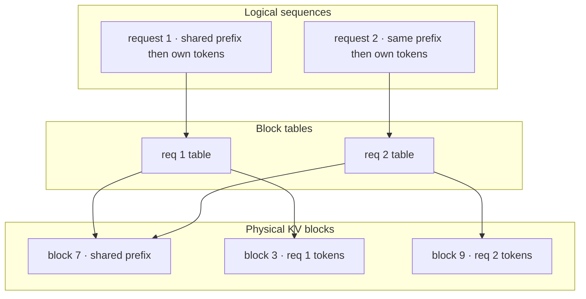

# Inference Internals & Serving

[fnd-05](../01-foundations/fnd-05-transformer-architecture.md) explained what a forward pass does; this chapter explains what happens when thousands of them share a GPU, and it is the deepest systems material in the curriculum. The reason it matters even if you never operate a serving cluster: **every price, latency characteristic, and rate limit you experience through a provider API is downstream of the mechanics here.** Why output tokens cost several times input tokens, why time-to-first-token scales with prompt length while inter-token latency doesn't, why long-context requests are disproportionately expensive, why prompt caching exists at all — these stop being API trivia and become predictable consequences. The single most explanatory fact, which the whole chapter unpacks: **decode is bound by memory bandwidth, not compute**, which means a GPU serving one request at a time is idle most of the time, and serving engineering is almost entirely about filling that idle capacity with other requests' work.

## Intuition: the GPU is mostly waiting

Take a single request generating tokens one at a time. For each token, the GPU must read **every parameter of the model** from high-bandwidth memory into compute units, multiply against a single token's activations, and write back. The arithmetic is lopsided: reading 16 GB of weights to perform arithmetic on one token's worth of data means the compute units finish almost immediately and then wait for the next chunk of weights to arrive.

That is what "memory-bandwidth-bound" means concretely. The useful consequence:

> Reading the weights costs the same whether you are generating one token or sixty-four. If sixty-four requests are each generating their next token *at the same time*, they can share one pass over the weights.

**That is the entire economic basis of LLM serving.** Batching does not make any single request faster — it makes the *fixed cost* of moving weights amortize across many requests, so throughput rises nearly linearly with batch size until some other resource binds. It is why a provider's per-token price is a small fraction of what a dedicated GPU would cost you for the same request ([api-07](../02-llm-apis/api-07-local-inference.md)'s TCO argument, now with its mechanism), and why naive self-hosting — one request at a time on your own GPU — is so much more expensive than it looks.

The complication that makes serving a scheduling problem rather than a batching problem: requests do not arrive together, do not finish together, and have two phases with opposite resource profiles.

## The two phases, and why they conflict

[fnd-05](../01-foundations/fnd-05-transformer-architecture.md) introduced prefill and decode; here is what they mean for a scheduler.

**Prefill** processes the entire prompt in one pass. All positions compute in parallel, so the GPU's compute units are genuinely saturated — this phase is **compute-bound**, its cost scales with prompt length (superlinearly at long contexts, since attention is quadratic), and it produces the KV cache plus the first token. It determines **time-to-first-token**.

**Decode** generates one token per step, each step reading all weights plus the growing KV cache for a single position. Arithmetic intensity is terrible — this phase is **memory-bandwidth-bound**, its per-step cost is nearly independent of prompt length, and it determines **inter-token latency** (time-per-output-token).

| | Prefill | Decode |
|---|---|---|
| Parallelism | All prompt positions at once | One position per step |
| Bound by | Compute (FLOPs) | Memory bandwidth |
| Scales with | Prompt length (quadratic in attention) | Output length; ~flat per step |
| Determines | TTFT | TPOT / tokens per second |
| Batching benefit | Modest (already saturating) | Enormous (amortizes weight reads) |

**The conflict:** these phases want opposite scheduling. Decode wants to batch aggressively across many requests to amortize weight reads. Prefill already saturates compute, so adding a long prefill to a decode batch *stalls every decoding request* while the GPU works through it — a single 50k-token prompt arriving mid-batch can add hundreds of milliseconds to the inter-token latency of every other user in that batch. This is the mechanism behind the "someone else's long request made my stream stutter" experience.

**Chunked prefill** is the standard truce: split a long prompt into pieces and interleave them with decode steps, so a large prefill is spread across several iterations instead of monopolizing one. It trades slightly worse TTFT for that request against much better latency stability for everyone else — and it is why modern serving engines expose it as a tuning knob.[^vllm-docs]

## Continuous batching

The scheduling advance that made LLM serving economical, and it is worth understanding precisely because the naive alternative is what most people imagine batching to be.

**Static batching** collects N requests, runs them together, and returns when *all* finish. Because generation lengths vary enormously — one request stops at 20 tokens, another runs to 800 — the GPU spends most of the batch's duration computing padding for finished sequences while the longest one continues. Utilization is poor and latency is hostage to the slowest member.

**Continuous batching** (also called iteration-level scheduling) operates per decode *step* rather than per request.[^yu-orca] At every iteration the scheduler asks which sequences need their next token, runs exactly those, and then — critically — **admits newly-arrived requests and evicts finished ones between iterations.** A request that finishes at step 20 leaves immediately and its slot is filled by a waiting request, rather than the batch waiting for step 800.

*Continuous batching: requests join and leave between decode iterations rather than at batch boundaries:*

```mermaid
gantt
  title Continuous batching — slots free up and refill between iterations
  dateFormat X
  axisFormat %s
  section Slot 1
  request A prefill      :0, 1
  request A decode       :1, 5
  request D prefill      :5, 6
  request D decode       :6, 10
  section Slot 2
  request B prefill      :0, 2
  request B decode       :2, 9
  section Slot 3
  request C prefill      :1, 2
  request C decode       :2, 4
  request E prefill      :4, 5
  request E decode       :5, 10
```

The gantt is the justified non-flowchart diagram here: the point is *temporal interleaving with slots refilling at different times*, which a flowchart cannot express ([CONVENTIONS](../../CONVENTIONS.md) §4).

The knob this creates: **larger batches raise throughput and raise per-request latency**, because each decode step now does more work. That trade-off — expressed as maximum batch size or maximum concurrent sequences — is the primary tuning dial in any serving engine, and the right setting depends entirely on whether you are optimizing for cost per token or for interactive latency.

## KV memory: the real constraint

Throughput is limited less by compute than by **how many sequences you can hold in memory at once**, because each one carries a KV cache that grows with its length.

[fnd-05](../01-foundations/fnd-05-transformer-architecture.md)'s formula, restated as a capacity planning tool. Per token, KV cache size is:

$$2 \times L \times n_{kv} \times d_{head} \times \text{bytes}$$

For a typical 8B-class configuration (32 layers, 8 KV heads with GQA, head dim 128, 16-bit) that is **≈128 KB per token**. So:

- A 2,000-token conversation holds ~256 MB of cache.
- Fifty concurrent such conversations hold **~12.8 GB** — comparable to the model's own weights.
- Fifty concurrent 32k-token sessions would need **~200 GB**, which no single accelerator holds.

**Concurrency is therefore a memory budget**, not a compute one, and it is why context length has such a dramatic effect on how many users a deployment can serve.

**The fragmentation problem PagedAttention solved.** Early serving systems allocated each sequence a contiguous block sized for its *maximum possible* length. A request that might generate 2,000 tokens reserved 2,000 tokens of cache even if it stopped at 50 — and the reserved-but-unused space could not be given to anyone else. Reported waste in these systems was severe, with the majority of KV memory sitting idle.[^kwon-paged]

**PagedAttention** applies operating-system virtual memory to the KV cache: allocate in small fixed-size **blocks**, keep a per-sequence **block table** mapping logical positions to physical blocks, and let a sequence's blocks be scattered anywhere in memory. Consequences that matter operationally:

- **Near-zero fragmentation** — memory is allocated as it is actually used, so many more sequences fit.
- **Prefix sharing** — two requests with an identical prompt prefix can *point at the same physical blocks*. **This is where prompt caching physically lives** ([api-05](../02-llm-apis/api-05-streaming-caching-batch.md)): the byte-identical-prefix requirement is a block-level identity requirement, and the discount reflects prefill work genuinely skipped.
- **Preemption** — under memory pressure a sequence's blocks can be evicted and recomputed later, which converts an out-of-memory failure into a latency penalty.

*PagedAttention: logical token positions map to scattered physical blocks, with shared prefixes pointing at the same memory:*

## Metrics and tuning

**The four numbers**, and what each tells you to change:

- **TTFT** (time to first token) — prefill latency. Rises with prompt length and queue depth. Fix with prompt shortening, prefix caching, chunked prefill, or more capacity.
- **TPOT** (time per output token) — decode latency. Rises with batch size and KV pressure. Fix by reducing batch size (at throughput cost) or lowering memory pressure.
- **Throughput** (total tokens/sec across all requests) — the cost metric. Rises with batch size until memory binds.
- **Goodput** — throughput *that meets your latency SLO*. The honest metric, and the one to optimize: a configuration achieving huge throughput while violating TTFT targets for half of requests is not actually serving those users.[^zhong-distserve]

**The bandwidth floor**, a napkin calculation worth internalizing. Single-stream decode speed cannot exceed:

$$\text{tokens/sec} \le \frac{\text{memory bandwidth}}{\text{model bytes}}$$

An 8B model at 16-bit (~16 GB) on an accelerator with ~2 TB/s of bandwidth tops out near 125 tokens/sec for a single stream, regardless of how much compute is available. Two implications: quantization ([prd-03](prd-03-inference-optimization.md)) speeds up decode by shrinking the bytes moved, and batching is the only way to exceed this per-*system* while each stream stays near it.

**The tuning workflow** on a vLLM-class engine:[^vllm-docs]

1. **Benchmark with your own traffic shape** — prompt-length and output-length distributions from your traces ([evl-04](../05-evaluation/evl-04-tracing-observability.md)). Synthetic uniform benchmarks mislead badly, because prefill/decode ratios drive everything.
2. **Set the KV memory fraction** as high as stability allows; this directly sets concurrency.
3. **Tune max concurrent sequences** against your TTFT/TPOT SLOs — this is the throughput/latency dial.
4. **Enable chunked prefill** if long prompts are stalling decode for other users.
5. **Verify prefix caching is hitting** if your workload has stable prefixes; it is the cheapest large win.
6. **Report goodput**, not raw throughput.

> **Volatile:** engine flag names, defaults, and the exact feature set (chunked prefill, prefix caching, speculative decoding integration) change across releases. The mechanisms — bandwidth-bound decode, iteration-level scheduling, paged KV memory, the throughput/latency dial — are stable. Verify flags against current documentation.[^vllm-docs]

## The frontier: disaggregation

Since prefill and decode have opposite resource profiles and interfere when co-scheduled, a natural next step is to run them on *separate* hardware pools: a prefill fleet optimized for compute, a decode fleet optimized for memory bandwidth, with KV cache transferred between them. Published results show meaningful goodput improvements from eliminating the interference, at the cost of a cache-transfer step and substantially more operational complexity.[^zhong-distserve]

Treat this as directionally important rather than immediately actionable: it explains where large-scale serving is heading and why providers can offer latency characteristics that a simple single-pool deployment cannot match. For a team running its own inference, chunked prefill captures much of the same benefit for a fraction of the complexity.

## Production engineering perspective

- **Capacity planning is memory arithmetic.** Weights + (KV per token × context × concurrency) + activation overhead, against accelerator memory. Run this before ordering hardware ([api-07](../02-llm-apis/api-07-local-inference.md), [prd-06](prd-06-deployment-infrastructure.md)).
- **Enforce context limits at the gateway.** One request with an enormous context can consume the KV budget of many normal ones, degrading everyone — this is a fairness control, not just a cost control.
- **Watch the memory cliff.** Serving degrades gracefully until the working set exceeds memory, then collapses (preemption thrash or rejection). Alarm on KV utilization headroom, not just latency ([eng-04](../../engineering/eng-04-llmops-stack.md)).
- **Benchmark on real traffic shapes** — prefill-heavy (RAG, long prompts) and decode-heavy (long generations) workloads tune differently, and a mixed workload needs the tuning that serves the mix.
- **Prefix-order your prompts** even when self-hosting: prefix sharing is the same mechanism as hosted prompt caching, so stable-prefix prompt design pays in both worlds ([api-05](../02-llm-apis/api-05-streaming-caching-batch.md)).
- **Separate interactive and batch traffic** onto different configurations or pools — they want opposite batch-size settings, and mixing them means neither is served well.

## Historical evolution

**2020–2021:** LLM inference is treated as ordinary model serving with static batching, and utilization is poor because generation-length variance was never a problem in classification workloads. **2022:** Orca introduces iteration-level (continuous) scheduling, letting requests join and leave between decode steps — a large throughput improvement that becomes the standard.[^yu-orca] FlashAttention independently removes the memory bottleneck in attention computation by avoiding materialization of the attention matrix, making long contexts practical.[^dao-flash] **2023:** PagedAttention applies virtual-memory ideas to the KV cache, eliminating fragmentation and enabling prefix sharing; vLLM makes it widely available and prompt caching becomes an economic feature rather than an internal optimization.[^kwon-paged] **2024:** disaggregated prefill/decode serving demonstrates that separating the phases improves goodput at scale.[^zhong-distserve] **2024–present:** serving engines converge on a common feature set (continuous batching, paged KV, prefix caching, chunked prefill, quantization support), and the differentiation moves to scheduling policy and multi-node orchestration. The pattern worth noting: **each advance came from applying a classical systems idea — scheduling, virtual memory, IO-awareness — to a workload whose bottlenecks were newly understood.**

## Common misconceptions

- **"Inference is compute-bound; buy more FLOPs."** Decode is bandwidth-bound. A card with more compute but the same memory bandwidth barely improves decode throughput — which is why memory bandwidth and capacity are the specs that matter for serving.
- **"Batching makes requests faster."** Batching improves *throughput* and slightly worsens per-request latency. It is a cost lever, not a speed lever.
- **"Static batching is fine if requests are similar."** Generation lengths vary even for similar prompts, and static batching is hostage to the longest member. Iteration-level scheduling is strictly better.
- **"Prompt caching is a billing feature."** It is prefix block sharing in the KV cache — real prefill work that is genuinely skipped, which is why the discount is so large and why byte-identical prefixes are required.
- **"More concurrency is always better throughput."** Only until KV memory binds; past that you get preemption thrash or rejections, and goodput falls even as raw throughput looks acceptable.
- **"Benchmark numbers transfer."** Published tokens/sec figures assume a traffic shape. Prefill-heavy and decode-heavy workloads have completely different optimal configurations.

## Failure modes and trade-offs

- **Memory cliff** — working set exceeds KV budget and latency collapses via preemption or rejection. *Fix:* headroom alarms, context limits at the gateway, quantized KV cache ([prd-03](prd-03-inference-optimization.md)).
- **Long-prompt head-of-line blocking** — one huge prefill stalls decode for everyone in the batch. *Fix:* chunked prefill; separate pools for long-context traffic.
- **Throughput tuned, SLOs violated** — maximum batch size delivers great tokens/sec and unacceptable TTFT. *Fix:* optimize goodput; treat batch size as an SLO-constrained parameter.
- **Cache-hostile prompts** — dynamic content early in the prompt defeats prefix sharing, so every request pays full prefill. *Fix:* stable-prefix prompt ordering ([api-05](../02-llm-apis/api-05-streaming-caching-batch.md)).
- **Benchmarking with synthetic uniform traffic** — tuning that doesn't survive production's prompt-length distribution. *Fix:* replay real traffic shapes from traces.
- **The central trade-off:** throughput versus latency, mediated by batch size and KV budget. There is no setting that maximizes both, which is why interactive and batch workloads belong on different configurations.

## Real-world examples

**The deployment that fit on paper.** A team sizes an 8B model deployment as "16 GB of weights, so an 80 GB accelerator gives us plenty of headroom" and provisions for 50 concurrent users. In production, requests begin failing under moderate load. The arithmetic they skipped: at ~128 KB/token, 50 concurrent 16k-token sessions need ~100 GB of KV cache alone — more than the card holds. Symptoms were preemption thrash (sequences evicted and recomputed, so latency spiked erratically) rather than a clean out-of-memory error, which made diagnosis slower. Fixes: gateway-enforced context limits, KV quantization, and capacity planning that *starts* from the KV formula rather than from weight size.

**The stutter caused by another user.** An interactive assistant shows steady streaming most of the time and occasional multi-second freezes mid-response. The freezes correlate with nothing in the affected user's own request. Cause: a document-analysis feature sharing the same serving pool submits 60k-token prompts, and each such prefill monopolizes the GPU for a full iteration, stalling every decoding sequence in the batch. Two fixes applied together — enabling chunked prefill so large prompts are spread over iterations, and routing long-context traffic to a separate pool — remove the stutter. **Latency in a shared serving pool is a property of your neighbors' traffic, not just your own.**

**The tuning that doubled goodput.** A self-hosted deployment reports respectable throughput but users complain about slow starts. Investigation shows the engine configured for maximum batch size, so TTFT p95 exceeded 8 seconds while raw tokens/sec looked excellent — throughput was being maximized at the expense of the metric users experience. Re-tuning against goodput (throughput subject to a TTFT target), enabling chunked prefill, and raising the KV memory fraction produced roughly double the SLO-meeting throughput at a lower nominal tokens/sec. **Optimizing the wrong metric had been actively harmful**, which is the practical argument for goodput.[^zhong-distserve]

## Interview questions

1. **"Why is LLM decode memory-bandwidth-bound, and what follows from that?"** — Model answer: each decode step reads every model parameter from memory to compute one token's worth of arithmetic, so arithmetic intensity is terrible — the compute units finish quickly and wait for weights. Three consequences follow. Single-stream speed has a hard ceiling of roughly memory bandwidth divided by model bytes, so an 8B model at 16-bit on a 2 TB/s card tops out around 125 tokens/sec no matter the FLOPs available. Batching is enormously effective because the weight read is shared across all sequences decoding that step, which is the economic basis of hosted serving. And quantization speeds up decode by shrinking bytes moved, not by reducing computation.

2. **"Explain continuous batching versus static batching."** — Model answer: static batching collects N requests, runs them to completion together, and returns when all finish — so the batch is hostage to its longest generation, and the GPU computes padding for finished sequences while one request continues. Continuous batching schedules at the iteration level: each decode step, the scheduler runs whichever sequences need a next token, admits newly-arrived requests, and evicts finished ones between iterations. A request finishing at step 20 frees its slot immediately instead of waiting for step 800. That's a large throughput improvement and it's why the max-concurrent-sequences setting is the primary throughput/latency dial.

3. **"What problem does PagedAttention solve?"** — Model answer: KV cache fragmentation. Early systems allocated each sequence contiguous memory sized for its maximum possible output length, so a request that might generate 2,000 tokens reserved that much even if it stopped at 50, and the reserved-unused space couldn't be shared — the majority of KV memory sat idle. PagedAttention applies virtual memory: small fixed-size blocks, a per-sequence block table mapping logical positions to scattered physical blocks. That gives near-zero fragmentation so far more sequences fit, enables preemption under pressure, and — operationally most visible — allows prefix sharing, where two requests with identical prompt prefixes point at the same physical blocks. That last property is what prompt caching physically is.

4. **"How would you size a self-hosted deployment?"** — Model answer: from memory, not compute. Weights at bytes-per-parameter times the parameter count, plus KV cache at roughly 2 × layers × KV-heads × head-dim × bytes per token — about 128 KB/token for an 8B GQA config — multiplied by target context length and concurrency, plus activation overhead. That's usually the binding constraint: 50 concurrent 16k sessions need ~100 GB of KV alone, dwarfing 16 GB of weights. Then I'd benchmark with my real traffic shape from traces, since prefill-heavy and decode-heavy workloads tune completely differently, and set the KV fraction and max sequences against TTFT/TPOT SLOs rather than raw throughput.

5. **"Why do prefill and decode conflict, and what's the fix?"** — Model answer: they have opposite resource profiles. Prefill processes all prompt positions in parallel and saturates compute; decode processes one position per step and is bandwidth-bound, benefiting hugely from batching. When a long prefill enters a batch that's decoding, it monopolizes the GPU for that iteration and stalls every decoding sequence — which users experience as their stream freezing because of someone else's request. Chunked prefill is the standard fix: split large prompts across several iterations so they interleave with decode steps, trading slightly worse TTFT for that request against much better latency stability for everyone. At scale, disaggregating prefill and decode onto separate pools addresses it more fundamentally.

6. **"What is goodput and why prefer it to throughput?"** — Model answer: goodput is throughput that actually meets your latency SLO. It matters because the two diverge in a specific and misleading way: raising batch size raises tokens/sec while raising per-request latency, so a configuration can post excellent throughput while violating TTFT targets for a large share of users — meaning it isn't really serving them. I've seen re-tuning against goodput roughly double SLO-meeting throughput at a lower nominal tokens/sec, because the previous configuration had been optimizing the wrong number. It's the serving-layer version of this curriculum's general rule that the metric you optimize should be the one users experience.

7. **"How does prompt caching relate to serving internals?"** — Model answer: it's prefix block sharing in the paged KV cache. Because causal masking means a prefix's keys and values don't depend on anything after it, two requests sharing a byte-identical prefix can have their block tables point at the same physical blocks — so the second request's prefill for that span is genuinely skipped, not just discounted. That explains the API-level behavior: why the prefix must be byte-identical and positionally aligned, why the savings are so large, and why the guidance is stable-content-first prompt ordering. It also means the same discipline pays when self-hosting, since prefix sharing is the identical mechanism under a different billing model.

## Exercises and mini-project

**Exercises**

1. Compute the single-stream decode ceiling for a 70B model at 16-bit on a 3 TB/s accelerator, and again at 4-bit. What changed and why?
2. For a 32-layer, 8-KV-head, 128-dim model at 16-bit: compute KV memory for 100 concurrent 8k-token sessions. Does it fit in 80 GB alongside 16 GB of weights?
3. Explain why static batching wastes GPU time even when all prompts are the same length.
4. Your TTFT p95 is 6s and TPOT is 15ms. Which knob do you turn, and what does it cost?
5. A single user reports intermittent multi-second freezes mid-stream. Give the mechanism and two fixes.

**Mini-project: tune a serving deployment.** Using vLLM (or equivalent) with an open-weight model from [api-07](../02-llm-apis/api-07-local-inference.md): (a) replay your capstone's real prompt-length and output-length distribution from traces as a benchmark load; (b) measure TTFT, TPOT, throughput, and goodput at three max-concurrency settings and plot the trade-off curve; (c) compute the predicted KV memory at each and compare to observed capacity; (d) toggle chunked prefill with a long-prompt request mixed into interactive load, and measure the effect on other requests' TPOT; (e) verify prefix caching is hitting by comparing TTFT for repeated versus novel prefixes; (f) memo: your goodput-optimal configuration and the napkin math that predicted it. Target: 5 hours. Success criterion: a measured throughput/latency curve for your own traffic shape, and a demonstrated chunked-prefill effect.

**Capstone extension:** this is the model tier inside [prd-01](prd-01-architecture-patterns.md)'s architecture; [prd-03](prd-03-inference-optimization.md) makes it faster, [prd-06](prd-06-deployment-infrastructure.md) provisions the hardware, and [prd-05](prd-05-cost-engineering.md) turns the throughput numbers into unit economics.

## Revision summary

- Decode is **memory-bandwidth-bound**: each step reads all weights to compute one token, so single-stream speed is capped near bandwidth ÷ model bytes, and batching is enormously effective because the weight read is shared. This is the economic basis of hosted serving.
- Prefill (compute-bound, parallel over prompt positions, sets TTFT) and decode (bandwidth-bound, sequential, sets TPOT) have opposite profiles and interfere when co-scheduled — long prefills stall decoding sequences, which chunked prefill mitigates and disaggregation addresses at scale.
- **Continuous batching** schedules per decode iteration, admitting and evicting requests between steps instead of at batch boundaries — eliminating the static-batching waste caused by variable generation lengths.
- **PagedAttention** manages KV cache as fixed-size blocks with per-sequence block tables: near-zero fragmentation, preemption under pressure, and prefix sharing — which is physically what prompt caching is.
- Concurrency is a **memory budget** (~128 KB/token for an 8B GQA config), so context limits are a fairness control and the memory cliff is the failure to alarm on.
- Optimize **goodput** (SLO-meeting throughput), tune against your real traffic shape, and treat batch size as the throughput/latency dial.

## Flashcards

| Q | A |
|---|---|
| Why is decode bandwidth-bound? | Each step reads every parameter from memory to compute one token — terrible arithmetic intensity, so compute waits on memory. |
| The single-stream decode ceiling? | Roughly memory bandwidth ÷ model bytes — e.g. ~125 tokens/sec for a 16 GB model on a 2 TB/s card. |
| Why does batching work so well? | The weight read is shared across every sequence decoding that step, amortizing the dominant fixed cost. |
| Static vs continuous batching? | Static waits for the whole batch to finish (hostage to the longest generation); continuous admits and evicts requests between decode iterations. |
| Why do prefill and decode conflict? | Prefill saturates compute for one iteration, stalling all decoding sequences in the batch — experienced as another user's request freezing your stream. |
| What is chunked prefill? | Splitting a long prompt across iterations so it interleaves with decode, trading that request's TTFT for everyone's latency stability. |
| What does PagedAttention solve? | KV fragmentation from contiguous max-length allocation; adds preemption and prefix sharing via block tables. |
| Where does prompt caching physically live? | Prefix block sharing in the paged KV cache — identical prefixes point at the same physical blocks, so prefill is genuinely skipped. |
| KV cache per token, 8B GQA config? | ≈128 KB — so concurrency × context length is a memory budget, not a compute one. |
| Why prefer goodput to throughput? | Throughput rises with batch size while latency worsens; goodput counts only SLO-meeting throughput, which is what users actually receive. |
| Why don't published tokens/sec numbers transfer? | They assume a traffic shape; prefill-heavy and decode-heavy workloads have different optimal configurations. |

## Further reading

- **Official docs:** vLLM documentation[^vllm-docs] — the serving-args and metrics pages are the practical companion to this chapter.
- **Papers:** Kwon et al., PagedAttention (2023)[^kwon-paged] — §3 for the fragmentation measurements; Yu et al., Orca (2022)[^yu-orca] for iteration-level scheduling; Dao et al., FlashAttention (2022)[^dao-flash] for the attention IO story; Zhong et al., DistServe (2024)[^zhong-distserve] for goodput and disaggregation.
- **Books:** none current enough for this layer.
- **Talks:** none essential.
- **Tutorials:** run the mini-project's benchmark sweep — the throughput/latency curve teaches more than any write-up.

## Check your understanding

1. Derive the single-stream decode ceiling and explain why more FLOPs wouldn't raise it.
2. Explain continuous batching to someone who knows OS scheduling, and name what it eliminates.
3. Compute whether 40 concurrent 12k-token sessions fit alongside a 16 GB model on an 80 GB card.
4. Trace prompt caching from the API discount down to the physical mechanism.
5. Your throughput is excellent and users are unhappy. Name the metric you should have optimized and the knob you'd change.

## Sources

[^kwon-paged]: [T2] Kwon et al. (2023). "Efficient Memory Management for Large Language Model Serving with PagedAttention." arXiv:2309.06180. https://arxiv.org/abs/2309.06180 (accessed 2026-07-10)
[^yu-orca]: [T2] Yu et al. (2022). "Orca: A Distributed Serving System for Transformer-Based Generative Models." USENIX OSDI 2022. https://www.usenix.org/conference/osdi22/presentation/yu (accessed 2026-07-10)
[^zhong-distserve]: [T2] Zhong et al. (2024). "DistServe: Disaggregating Prefill and Decoding for Goodput-optimized LLM Serving." arXiv:2401.09670. https://arxiv.org/abs/2401.09670 (accessed 2026-07-10)
[^dao-flash]: [T2] Dao et al. (2022). "FlashAttention: Fast and Memory-Efficient Exact Attention with IO-Awareness." arXiv:2205.14135. https://arxiv.org/abs/2205.14135 (accessed 2026-07-10)
[^vllm-docs]: [T1] vLLM. "Documentation." https://docs.vllm.ai/ (accessed 2026-07-10)
