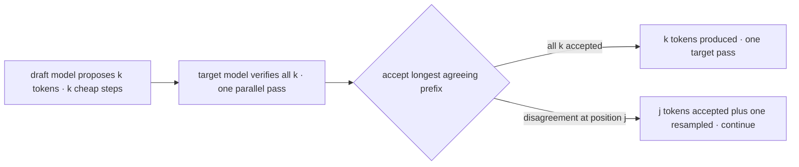
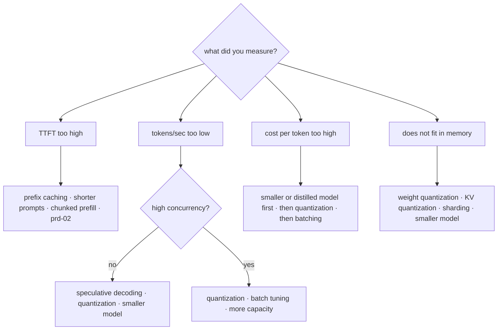

# Inference Optimization

[prd-02](prd-02-inference-and-serving.md) identified two enemies. **Bandwidth**: each decode step moves every parameter from memory to produce one token, capping single-stream speed at roughly bandwidth ÷ model bytes. **Sequentiality**: tokens are generated one at a time, so a 500-token response takes 500 sequential steps no matter how much hardware you have. Every technique in this chapter attacks one of those two, and the discipline that keeps optimization work honest is stating which before you start. Quantization shrinks the bytes moved. Speculative decoding breaks the one-token-per-step floor while producing *identical* output. Distillation changes which model you're serving. Each carries a distinct trade — quality, complexity, or serving cost for a second model — and each is adopted on a measured symptom rather than because it exists. The chapter's throughline is the same as [api-06](../02-llm-apis/api-06-model-selection.md)'s: **every configuration is a model version, and the eval decides.**

## Intuition: name the enemy first

Optimization work goes wrong when someone applies a technique to a symptom it does not address. The two-enemy frame prevents it:

| Symptom | Enemy | Techniques that help |
|---|---|---|
| Slow time-to-first-token | Prefill compute + queueing | Prompt shortening, prefix caching, chunked prefill ([prd-02](prd-02-inference-and-serving.md)) |
| Slow tokens-per-second per stream | Bandwidth | Quantization, smaller model, speculative decoding |
| Low throughput / high cost per token | Bandwidth + memory capacity | Quantization (fits more concurrency), batching tuning |
| Won't fit on the hardware | Memory capacity | Quantization, KV quantization, smaller model, sharding |
| Long total latency on long outputs | Sequentiality | Speculative decoding, shorter outputs, smaller model |

Two entries deserve emphasis because they are commonly confused. **Quantization does not break the sequentiality floor** — it lowers the bandwidth cost per step, so each step is faster, but you still take one step per token. **Speculative decoding does not reduce bytes moved** — it produces more tokens per pass over the weights, which is a different lever entirely. A team suffering long-output latency will get more from speculation than from a fourth quantization experiment, and vice versa for a memory-constrained deployment.

## Quantization

Storing weights at lower numeric precision, which reduces both memory footprint and — because decode is bandwidth-bound — decode latency. This is the highest-value optimization for most self-hosted deployments and the one with a real quality trade to manage.

**Why naive rounding fails.** Round every weight to the nearest 4-bit value and quality collapses, because weight distributions contain **outliers**: a small number of large-magnitude weights that carry disproportionate influence. Uniform quantization across a tensor lets those outliers set the scale, crushing the precision available to the bulk of the distribution. Every practical method is a strategy for handling this.

**The approaches that work:**

- **Outlier-aware mixed precision.** Keep the few outlier dimensions in higher precision and quantize the rest — the insight that made 8-bit inference essentially lossless.[^dettmers-int8]
- **Group-wise quantization.** Quantize in small groups (say 128 weights) with a scale per group rather than per tensor, so an outlier only distorts its own group. Group size is a memory/quality dial: smaller groups mean more scale factors stored and better fidelity.
- **Calibration-based methods (GPTQ).** Use a small calibration dataset to measure how quantization error propagates, and adjust remaining weights to compensate as each is quantized — recovering substantial quality at 4-bit.[^frantar-gptq]
- **Activation-aware methods (AWQ).** Observe that weight importance is determined by *activation* magnitudes, not weight magnitudes, and protect the weight channels that see large activations.[^lin-awq]

**What this buys**, using [prd-02](prd-02-inference-and-serving.md)'s bandwidth ceiling: an 8B model at 16-bit is ~16 GB, so on a 2 TB/s accelerator single-stream decode tops out near 125 tokens/sec. At 8-bit (~8 GB) that ceiling roughly doubles; at 4-bit (~4 GB) it roughly quadruples. Memory capacity improves identically, which raises concurrency because more KV cache fits alongside smaller weights.

**KV-cache quantization** attacks the *other* memory consumer. At ~128 KB/token ([prd-02](prd-02-inference-and-serving.md)), long-context concurrency is KV-bound, and quantizing the cache to 8-bit roughly doubles the sessions that fit. It has its own quality trade — the cache is what attention reads, so errors compound across positions — and it degrades long contexts first, which is precisely where you deployed it. Measure specifically at your longest contexts.

**Where quality actually degrades** is the practically important part, and it follows [fnd-09](../01-foundations/fnd-09-capabilities-and-limits.md)'s jaggedness: **the shallows go first.** Fluent generation and grounded transformation hold up well; multi-step arithmetic, precise reasoning, long-tail factual recall, and exact-format compliance degrade earliest and most. So an aggregate benchmark score can look fine while the specific capability your product depends on has quietly regressed — which is why **every bit-width is a model version requiring a full eval** ([api-06](../02-llm-apis/api-06-model-selection.md)), not a deployment flag.

The comparison that surprises people and is worth running: **a 4-bit larger model usually beats a 16-bit smaller model at equal memory.** Quality per byte generally favors more parameters at lower precision — but verify on your eval, because "usually" is doing real work in that sentence.

## Speculative decoding

The technique that attacks sequentiality, and the closest thing to a free lunch in this chapter — because it preserves output *exactly*.

**The mechanism.** A small, fast **draft model** proposes the next k tokens autoregressively (cheap, because it's small). The large **target model** then evaluates all k proposals **in a single forward pass** — which is possible because verifying k tokens is a parallel operation, exactly like prefill. A sampling-based acceptance rule accepts the longest correct prefix of the draft and resamples at the first disagreement.[^leviathan-spec][^chen-spec]

*One speculative round: draft cheaply, verify in parallel, accept the agreed prefix:*

**Why the output is exact.** The acceptance rule is constructed so the resulting token distribution is *identical* to sampling from the target model directly.[^chen-spec] This is the property that distinguishes speculation from every other technique here: **there is no quality trade to evaluate.** If it works, it is purely faster; if the draft is poor, it is merely slower.

**The economics.** Speedup depends on the acceptance rate alpha (how often the draft agrees with the target) and the relative cost of the draft. Roughly, expected tokens per target pass is $\frac{1 - \alpha^{k+1}}{1 - \alpha}$, so a draft agreeing 70% of the time at k=4 yields around 2.7 tokens per target pass — call it a ~2× speedup after subtracting draft cost. Two consequences:

- **Acceptance rate is everything.** A draft model from the same family as the target (a small sibling, or a distilled version — [ftn-06](../08-fine-tuning/ftn-06-distillation-and-slms.md)) accepts far more often than an unrelated one. Measure alpha directly; it predicts the speedup.
- **It costs you a second served model.** The draft occupies memory and compute, and under heavy batching — where the GPU is already saturated ([prd-02](prd-02-inference-and-serving.md)) — the spare capacity speculation exploits may not exist. **Speculation helps most at low-to-moderate concurrency**, which is the regime where latency matters most anyway.

> **Volatile:** self-drafting variants (drafting with the target's own early layers or extra prediction heads) avoid maintaining a separate draft model and are moving quickly; support and effectiveness vary by engine and release. The core mechanism — parallel verification with exactness-preserving acceptance — is stable.[^vllm-docs]

## Distillation as a serving decision

The structural lever, covered mechanically in [ftn-06](../08-fine-tuning/ftn-06-distillation-and-slms.md) and included here because it belongs in the same decision tree.

Rather than making a large model faster, **serve a smaller one that is good enough for the task**. A small model trained on a large model's outputs for a narrow task frequently matches it on that task while being several times cheaper and faster — and the smaller weights compound with everything above (better bandwidth ceiling, more concurrency, cheaper speculation).

The doctrine, which is really [api-06](../02-llm-apis/api-06-model-selection.md)'s applied to serving: **the smallest model that passes your eval is the right model.** Optimization work on a too-large model is often effort spent avoiding a model-selection decision. The escalation order is worth stating: try a smaller off-the-shelf model first (free, immediate), then a distilled one (real training work, [ftn-06](../08-fine-tuning/ftn-06-distillation-and-slms.md)), and only then invest in exotic serving optimization for the large model.

## The decision tree

*From measured symptom to technique — with the enemy named at each branch:*

**Compounding order**, cheapest-first: quantization (a config change plus an eval), then batching and KV tuning ([prd-02](prd-02-inference-and-serving.md)), then speculative decoding (a second model to serve), then distillation (a training project). Interactions worth knowing: quantization *helps* speculation by making both models cheaper; quantization *reduces* the benefit of KV quantization's headroom if you've already freed memory; and speculation's benefit shrinks as batch size rises.

## Production engineering perspective

- **Every configuration is a model version.** Bit-width, quantization method, draft model, and engine version together define behavior — pin them, hash them into results, and gate changes through the eval suite ([evl-06](../05-evaluation/evl-06-ci-for-llm-apps.md), [api-07](../02-llm-apis/api-07-local-inference.md)).
- **Measure at the tail, not the mean.** Quantization damage concentrates in specific capability classes ([fnd-09](../01-foundations/fnd-09-capabilities-and-limits.md)), so slice the eval by category — an aggregate that holds while arithmetic collapses is the classic miss.
- **Verify the speedup you assumed.** Measure acceptance rate for speculation and actual tokens/sec for quantization; theoretical numbers overstate real gains, especially under batching.
- **Prefer community-quantized weights** for standard methods rather than quantizing yourself — it's a solved problem, and your time belongs on the eval ([api-07](../02-llm-apis/api-07-local-inference.md)).
- **Optimize only after the architecture is right.** Prefix caching, batch tuning, and prompt shortening usually beat model-level optimization and cost nothing in quality ([prd-02](prd-02-inference-and-serving.md), [eng-10](../../engineering/eng-10-cost-optimization.md)).

## Historical evolution

**2022:** 8-bit inference is shown to be essentially lossless with outlier-aware handling, making quantization respectable rather than a quality compromise.[^dettmers-int8] Speculative decoding is introduced, with the crucial demonstration that a rejection-sampling acceptance rule preserves the target distribution exactly.[^leviathan-spec][^chen-spec] **2022–2023:** calibration-based 4-bit methods (GPTQ) make aggressive quantization practical,[^frantar-gptq] and activation-aware approaches improve on it by protecting the channels that matter.[^lin-awq] Consumer-hardware inference becomes viable, which is what created the local-model ecosystem ([api-07](../02-llm-apis/api-07-local-inference.md)). **2023–2024:** serving engines integrate quantization, speculation, and paged KV into single stacks, so these stop being research techniques and become configuration flags. KV-cache quantization arrives as long-context workloads make cache memory the binding constraint. **2024–present:** self-drafting speculation and hardware-native low-precision formats continue to move. The pattern: **techniques that began as papers became engine flags within about eighteen months**, which is why the durable skill is knowing which enemy each attacks rather than memorizing the current implementations.

## Common misconceptions

- **"Quantization always degrades quality noticeably."** 8-bit with outlier handling is near-lossless; 4-bit degrades gracefully and task-dependently. The right question is which of *your* capabilities degrade, measured on your eval.
- **"Speculative decoding trades quality for speed."** It preserves the output distribution exactly. The trade is serving a second model and reduced benefit under heavy batching — not quality.
- **"Quantization makes generation faster because there's less computation."** It's faster because there are fewer *bytes to move*, and decode is bandwidth-bound. The distinction matters when reasoning about which techniques compose.
- **"Pick the smallest bit-width that fits."** Pick the smallest that *passes your eval*, sliced by capability. Memory fit is a constraint, not an objective.
- **"Optimize the model first."** Prompt shortening, prefix caching, and batch tuning are free of quality risk and usually larger wins. Model-level optimization comes after.
- **"A 16-bit small model beats a 4-bit large one."** Usually the reverse at equal memory — quality per byte tends to favor more parameters at lower precision. Verify, don't assume either way.

## Failure modes and trade-offs

- **Aggregate-only evaluation** — average score holds while arithmetic or format compliance collapses. *Fix:* sliced evals per capability class; test at your longest contexts for KV quantization.
- **Unmeasured speculation** — a draft model with low acceptance makes generation *slower* while adding memory pressure. *Fix:* measure alpha; use a same-family or distilled draft.
- **Speculation under heavy batching** — no spare capacity to exploit, so the draft is pure overhead. *Trade-off:* enable at low-to-moderate concurrency, disable at saturation.
- **Config sprawl** — several quantization variants in production, none evaluated identically. *Fix:* treat each as a pinned model version with its own eval record.
- **Optimizing the wrong enemy** — quantization applied to a TTFT problem, or prompt work applied to a sequentiality problem. *Fix:* name the enemy from measurement before choosing.
- **The central trade-off:** every technique except speculation trades some quality for speed or memory, and the quality loss is unevenly distributed across capabilities — which is why the eval, sliced, is the only honest arbiter.

## Real-world examples

**The quantization that broke arithmetic.** A team quantizes a model to 4-bit, sees aggregate eval scores drop by under a point, and ships. Two weeks later, finance reports that a calculation-heavy workflow has become unreliable. The sliced eval tells the story the aggregate hid: fluent-generation categories were essentially unchanged while multi-step arithmetic fell sharply — exactly the [fnd-09](../01-foundations/fnd-09-capabilities-and-limits.md) shallows degrading first. The fix is a route split: the arithmetic path runs at 8-bit, everything else stays 4-bit. **The mistake was evaluating a model version with an aggregate number**, which is a habit this curriculum has warned about in five other contexts.

**The draft model that slowed things down.** A team enables speculative decoding with a draft from a different model family, expecting the ~2× they read about. Throughput drops. Measurement shows an acceptance rate around 0.25 — the draft rarely agrees with the target, so most speculative work is discarded and the draft's cost is pure overhead. Switching to a small model from the *same* family raises acceptance to ~0.72 and delivers roughly 2.1×. **Acceptance rate is the parameter that determines whether speculation is a win**, and it is a property of the draft/target pairing rather than of the technique.

**The optimization that wasn't needed.** A team plans a quantization and speculation project to fix 9-second response times. Profiling first — per-stage, from traces ([evl-04](../05-evaluation/evl-04-tracing-observability.md)) — shows 7 of those 9 seconds are prefill over a 40k-token prompt that includes an entire manual on every request. Restructuring the prompt for prefix caching ([api-05](../02-llm-apis/api-05-streaming-caching-batch.md)) and retrieving relevant sections instead of shipping the whole document takes response time to 2.5 seconds with **zero quality risk and no model changes**. The optimization project is cancelled. **Profile before optimizing** is not a new lesson; it just keeps applying.

## Interview questions

1. **"What are the two things inference optimization attacks?"** — Model answer: memory bandwidth and sequentiality. Decode reads every parameter to produce one token, so single-stream speed is capped near bandwidth ÷ model bytes — quantization attacks that by shrinking bytes moved. Separately, tokens are generated one at a time, so a long response takes that many sequential steps regardless of hardware — speculative decoding attacks that by producing several tokens per target pass. Naming which enemy you face before choosing a technique prevents the common failure of applying quantization to a latency problem that was actually prefill, or prompt work to a problem that was sequentiality.

2. **"Why does naive quantization fail, and what do real methods do?"** — Model answer: weight distributions contain outliers — a few large-magnitude weights that carry outsized influence — and uniform rounding lets those outliers set the scale, destroying precision for the bulk of the distribution. Real methods handle this: mixed precision keeps outlier dimensions in higher precision, which is what made 8-bit essentially lossless; group-wise quantization uses a scale per small group so an outlier only distorts its own group; GPTQ uses calibration data to compensate remaining weights for the error introduced as each is quantized; and AWQ protects the channels that see large *activations*, on the insight that activation magnitude determines weight importance rather than weight magnitude.

3. **"How does speculative decoding preserve exact output?"** — Model answer: a small draft model proposes k tokens autoregressively, then the target model verifies all k in a single parallel forward pass — parallel verification is possible for the same reason prefill is. The acceptance rule is a rejection-sampling scheme constructed so the accepted tokens are distributed identically to sampling from the target directly; on disagreement at position j, you keep the first j and resample that position from a corrected distribution. So there's no quality trade to evaluate, which makes it unusual in this chapter. The costs are serving a second model and diminished benefit under heavy batching, where there's no spare capacity to exploit.

4. **"What determines speculative decoding's speedup?"** — Model answer: the acceptance rate alpha and the draft's relative cost. Expected tokens per target pass is roughly (1 − alpha^(k+1))/(1 − alpha), so alpha = 0.7 at k = 4 gives about 2.7 tokens per target pass, netting maybe 2× after draft overhead. That makes alpha the parameter to measure rather than assume — and it's a property of the draft/target *pairing*, so a same-family or distilled draft accepts far more often than an unrelated model. I've seen a mismatched draft at alpha ≈ 0.25 make throughput *worse*, since most speculative work is discarded and the draft cost remains.

5. **"How do you evaluate a quantized model?"** — Model answer: as a new model version, with the full eval sliced by capability — because quantization damage is jagged rather than uniform. Fluent generation and grounded transformation hold up well; multi-step arithmetic, precise reasoning, long-tail recall, and exact-format compliance degrade first, so an aggregate score can move less than a point while the specific capability the product depends on has collapsed. For KV-cache quantization I'd additionally test at the longest contexts, since errors compound across positions and long contexts are exactly where it was deployed. And I'd compare against the counterintuitive baseline: a 4-bit larger model at equal memory, which often wins.

6. **"Where does optimization work usually go wrong?"** — Model answer: optimizing before profiling. The most common case I'd check first is a latency problem that turns out to be prefill over an enormous prompt — where prompt restructuring and prefix caching deliver a larger win than any model-level technique, at zero quality risk. Beyond that: applying a bandwidth technique to a sequentiality problem, evaluating with aggregate scores that hide capability-specific damage, enabling speculation without measuring acceptance rate, and reaching for exotic optimization on a model that's simply larger than the task needs — where the smallest model passing the eval would have been the answer.

## Exercises and mini-project

**Exercises**

1. Compute the single-stream decode ceiling for a 32B model at 16-bit, 8-bit, and 4-bit on a 2 TB/s accelerator. What else improves alongside?
2. With alpha = 0.6 and k = 3, compute expected tokens per target pass. At what alpha does k = 3 speculation stop being worth a draft costing 15% of the target?
3. For each symptom name the enemy and one technique: (a) 8s TTFT on 30k prompts; (b) 12 tokens/sec single-stream; (c) OOM at 20 concurrent 16k sessions; (d) cost per task 3× budget.
4. Your 4-bit model scores 1 point below 16-bit on aggregate. Design the eval slice that would reveal whether it's safe to ship.
5. Explain why speculative decoding's benefit shrinks as batch size grows.

**Mini-project: optimize a deployment.** Using your [prd-02](prd-02-inference-and-serving.md) setup: (a) benchmark baseline TTFT, TPOT, throughput, and memory at 16-bit; (b) run the same at 8-bit and 4-bit, and run your capstone eval **sliced by category** at each — report where quality degrades first; (c) enable KV-cache quantization and re-measure concurrency at your longest context; (d) if your engine supports it, enable speculative decoding with a same-family draft and measure acceptance rate and actual speedup; (e) compare a 4-bit larger model against a 16-bit smaller one at equal memory on both quality and speed; (f) memo: your chosen configuration with the eval slice justifying it, and the enemy each change attacked. Target: 5 hours. Success criterion: a per-capability quality/speed table for your own model — including at least one category where quantization hurt more than the aggregate suggested.

**Capstone extension:** this tunes the model tier from [prd-01](prd-01-architecture-patterns.md); [prd-05](prd-05-cost-engineering.md) converts the throughput gains into unit economics, and [ftn-06](../08-fine-tuning/ftn-06-distillation-and-slms.md) covers the distillation path if the smaller-model route wins.

## Revision summary

- Two enemies from [prd-02](prd-02-inference-and-serving.md): **bandwidth** (bytes moved per token) and **sequentiality** (one token per step). Name which one your measurement implicates before choosing a technique.
- **Quantization** attacks bandwidth and capacity. Naive rounding fails because of weight outliers; real methods use mixed precision, group-wise scales, calibration (GPTQ), or activation-awareness (AWQ). 8-bit is near-lossless; 4-bit degrades gracefully but **jaggedly** — arithmetic, precise reasoning, long-tail recall, and format compliance go first. KV-cache quantization attacks the other memory consumer and degrades long contexts first.
- **Speculative decoding** attacks sequentiality and preserves output exactly via a rejection-sampling acceptance rule. Speedup ≈ (1 − alpha^(k+1))/(1 − alpha); acceptance rate is a property of the draft/target pairing, and the benefit shrinks under heavy batching.
- **Distillation** is the structural lever: the smallest model passing your eval is the right model, and optimization on an oversized model often substitutes for a selection decision.
- Every configuration — bit-width, method, draft, engine version — is a model version: pinned, hashed, and gated by a **sliced** eval. Profile before optimizing; prompt and caching work usually beats model-level techniques at zero quality risk.

## Flashcards

| Q | A |
|---|---|
| The two enemies of inference performance? | Memory bandwidth (bytes moved per token) and sequentiality (one token per step). |
| Why does naive quantization fail? | Weight outliers set the scale for the whole tensor, destroying precision for the bulk of the distribution. |
| Four practical quantization strategies? | Outlier-aware mixed precision, group-wise scales, calibration-based compensation (GPTQ), activation-aware protection (AWQ). |
| Which capabilities degrade first under quantization? | The fnd-09 shallows — multi-step arithmetic, precise reasoning, long-tail recall, exact format compliance. |
| What does KV-cache quantization attack, and what degrades? | The other memory consumer (cache, ~128 KB/token); errors compound across positions, so long contexts degrade first. |
| Why is speculative decoding exact? | The rejection-sampling acceptance rule yields a token distribution identical to sampling from the target model. |
| Speculative speedup formula? | Expected tokens per target pass ≈ (1 − alpha^(k+1))/(1 − alpha), where alpha is the acceptance rate. |
| What determines acceptance rate? | The draft/target pairing — same-family or distilled drafts accept far more often than unrelated models. |
| When does speculation stop helping? | Under heavy batching, where the GPU is already saturated and there's no spare capacity to exploit. |
| The model-selection doctrine for serving? | The smallest model that passes your eval is the right model; optimization on an oversized model often avoids a selection decision. |
| Why must every bit-width be evaluated? | Each configuration is a model version and quality loss is jagged — aggregates hide capability-specific collapse. |

## Further reading

- **Official docs:** vLLM quantization and speculative-decoding pages[^vllm-docs] — the current flags and supported combinations.
- **Papers:** Dettmers et al., LLM.int8() (2022)[^dettmers-int8] for the outlier insight; Frantar et al., GPTQ (2022)[^frantar-gptq]; Lin et al., AWQ (2023)[^lin-awq]; Leviathan et al. (2022)[^leviathan-spec] and Chen et al. (2023)[^chen-spec] for speculative decoding and its exactness proof.
- **Books:** none current enough.
- **Talks:** none essential.
- **Tutorials:** the mini-project's sliced-eval sweep — the per-capability table is the artifact worth having.

## Check your understanding

1. Name the two enemies and assign each of four symptoms to one.
2. Explain why quantization speeds up decode, in terms of what is actually the bottleneck.
3. Walk through a speculative round and explain what guarantees exactness.
4. Your 4-bit model looks fine on aggregate. What do you check before shipping, and why?
5. Give the compounding order for optimization work and the reason for its ordering.

## Sources

[^frantar-gptq]: [T2] Frantar et al. (2022). "GPTQ: Accurate Post-Training Quantization for Generative Pre-trained Transformers." arXiv:2210.17323. https://arxiv.org/abs/2210.17323 (accessed 2026-07-10)
[^lin-awq]: [T2] Lin et al. (2023). "AWQ: Activation-aware Weight Quantization for LLM Compression and Acceleration." arXiv:2306.00978. https://arxiv.org/abs/2306.00978 (accessed 2026-07-10)
[^dettmers-int8]: [T2] Dettmers et al. (2022). "LLM.int8(): 8-bit Matrix Multiplication for Transformers at Scale." arXiv:2208.07339. https://arxiv.org/abs/2208.07339 (accessed 2026-07-10)
[^leviathan-spec]: [T2] Leviathan et al. (2022). "Fast Inference from Transformers via Speculative Decoding." arXiv:2211.17192. https://arxiv.org/abs/2211.17192 (accessed 2026-07-10)
[^chen-spec]: [T2] Chen et al. (2023). "Accelerating Large Language Model Decoding with Speculative Sampling." arXiv:2302.01318. https://arxiv.org/abs/2302.01318 (accessed 2026-07-10)
[^vllm-docs]: [T1] vLLM. "Documentation." https://docs.vllm.ai/ (accessed 2026-07-10)
