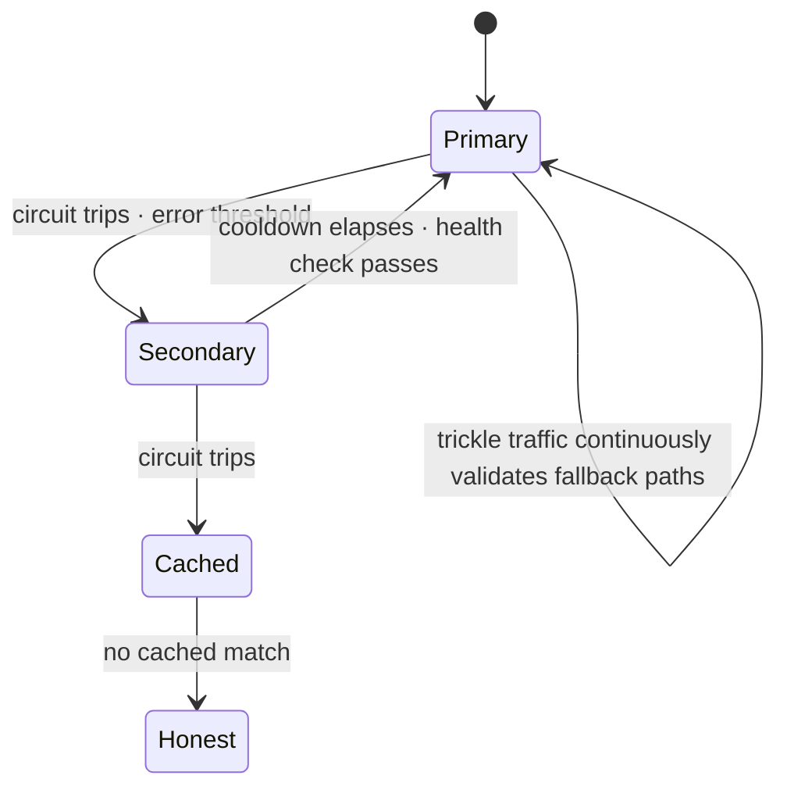

# Reliability Engineering

Classical SRE practice — SLOs, error budgets, circuit breakers, graceful degradation — transfers to LLM systems almost unchanged, because most of it is domain-independent distributed-systems discipline.[^google-sre] This chapter covers that transfer briefly and then spends most of its length on the part that doesn't transfer: **quality brownouts**, where nothing crashes, every health check passes, and the service simply gets *worse* — a failure class with no equivalent in conventional services, because conventional services don't have a dimension called "how good was the answer" that can degrade independently of uptime. The organizing idea is that LLM reliability needs three SLO dimensions instead of two: availability and latency, which you already know how to defend, plus **quality**, which needs new instrumentation entirely.

## Intuition: a third SLO dimension

Conventional reliability asks two questions: is the service up, and is it fast enough. LLM systems need a third: **is the output any good**, and that question can fail independently of the other two. A service returning HTTP 200 in 400ms with a fabricated answer is, by every classical metric, healthy.

This isn't a philosophical addition — it changes what "incident" means. The classical failure signature is a step function: error rate jumps, an alert fires, someone responds. A quality brownout's signature is a **drift**: refusal rate creeps up, groundedness trends down, escalations to humans rise gradually — nothing crosses a fixed threshold for hours or days, and standard uptime monitoring reports a perfectly healthy system throughout. [evl-05](../05-evaluation/evl-05-online-evaluation.md) built the instrumentation that makes this driftable-and-visible rather than invisible; this chapter is about treating it as a reliability property with the same seriousness as uptime, and building the response machinery — circuit breakers, fallbacks, degraded modes — for both dimensions at once.

## The hard-failure taxonomy

Classical, and mostly a direct application of [api-01](../02-llm-apis/api-01-llm-api-fundamentals.md)'s failure surface with SRE tooling wrapped around it.

**429 / rate limits and 5xx / overload.** Weather, not bugs ([api-01](../02-llm-apis/api-01-llm-api-fundamentals.md)). The response is a **circuit breaker**: after a threshold of failures, stop sending requests to the failing dependency for a cooldown period and fail fast to a fallback, rather than queueing requests behind a dependency that isn't recovering. Failing fast is the point — a queue building behind a broken dependency is how a five-minute provider blip becomes a multi-hour backlog.[^anthropic-errors][^openai-ratelimits]

**Latency degradation.** P50 fine, P99 climbing. Timeout hierarchies sized to the actual work — a `max_tokens` of 4,000 implies a proportionally longer timeout than one of 200 ([api-01](../02-llm-apis/api-01-llm-api-fundamentals.md)) — prevent a slow-but-alive request from being killed prematurely while still bounding worst case. **Hedged requests** (fire a second attempt if the first hasn't returned by some percentile of typical latency, take whichever completes first, cancel the other) can help for short, *idempotent*, non-side-effecting calls, at the honest cost of extra spend on every hedge — reserve them for latency-critical, cheap, side-effect-free requests, never for anything that mutates state or costs real money per call.

**Capacity exhaustion.** Priority-lane **load shedding** ([prd-01](prd-01-architecture-patterns.md)): under pressure, shed the lowest-priority traffic first — batch and bulk work before interactive, degraded-response paths before full ones — so the system fails partially and predictably rather than uniformly and catastrophically.

**Content filtering / policy stops.** Not a bug to retry; a legitimate model output requiring a **product response** — rephrase, escalate to a human, or explain — decided in advance rather than improvised mid-incident ([sec-02](../07-safety-security/sec-02-guardrails.md)).

## Fallback chains

The design pattern that carries most of this chapter, specified generally in [eng-05](../../engineering/eng-05-design-patterns.md) #3 and developed here to the depth of an actual runbook.

**Design the chain in advance**, ordered by degrading capability: primary model → secondary provider or smaller model → cached or templated response → honest unavailability message. Each rung answers "what do we do if everything above this has failed."

**Every rung must be eval-baselined**, not just functional. A fallback that returns *a* response but performs far below the primary on your quality metrics is often worse for the product than an honest failure — verify it against the same suite that gates the primary ([evl-06](../05-evaluation/evl-06-ci-for-llm-apps.md)), so the degradation is a known, chosen quantity rather than a surprise discovered mid-incident.

**Rehearse it with real traffic, not just at incident time.** The single highest-leverage practice in this chapter: route a small, continuous trickle of production traffic through the fallback path *at all times* — a few percent, quietly — so you have current evidence it works, current latency numbers, and current quality numbers, rather than untested assumptions about a path that hasn't executed in months. **An unexercised fallback is not a fallback; it is a hope with a diagram**, and the standard incident-postmortem discovery is a fallback that has silently broken since the API it depends on last changed.

*The fallback chain with health-gated escalation, kept warm by continuous trickle traffic:*

**Cross-provider portability is what makes "secondary provider" viable at all** — the payoff of [api-06](../02-llm-apis/api-06-model-selection.md)'s gateway abstraction and principle-based prompting: a fallback that requires provider-specific prompt rewrites under incident pressure is not a fallback you can trust.

## Detecting quality brownouts

The instrumentation, connecting directly to [evl-05](../05-evaluation/evl-05-online-evaluation.md)'s machinery and restated here as a reliability practice rather than a measurement one.

**Continuous judge sampling is the quality heartbeat.** A calibrated judge scoring 1–5% of live traffic ([evl-03](../05-evaluation/evl-03-llm-as-judge.md)) is what makes quality a monitorable signal instead of a periodic report — without it, a brownout is invisible until enough users complain to notice a pattern, by which point it may have run for days.

**Alert on drift from a rolling baseline, never on a fixed absolute threshold.** [evl-05](../05-evaluation/evl-05-online-evaluation.md) established why: quality wanders rather than crossing a line, so a week-over-week or day-over-day deviation catches degradation that no static threshold would trip.

**Watch the composite signal set**, because any one alone is noisy: judge score, refusal rate, abstention rate, regeneration rate, escalation-to-human rate, and — cross-referenced against [prd-03](prd-03-inference-optimization.md) — cost per task, since a silent config or model-version change often shows up in the cost line before the quality line moves visibly.

**The four causes, and the diagnostic for each** — model drift under an unpinned alias ([fnd-07](../01-foundations/fnd-07-post-training.md); check the pinned-version audit first, since it's free), corpus or index staleness ([rag-05](../03-retrieval/rag-05-rag-pipeline.md); check ingestion-job health and change-to-queryable lag), traffic-distribution shift into an unfamiliar segment (check the input-category mix against baseline), and a silent pipeline failure feeding stale or empty context (check per-stage error rates from traces).

## Degraded modes as product design

The discipline that closes the gap between "the system failed" and "the user had a bad but survivable experience" — decided at design time, not improvised during an incident.

**Enumerate the degradation ladder explicitly**, in the same design review as the happy path: full capability → reduced capability (a smaller model, or retrieval skipped with the model answering from general knowledge and saying so) → cached or templated answer → honest unavailability. Each rung is a real product decision with real UX, made *before* the outage rather than during it.

**Prefer honest degradation to silent degradation.** A response indistinguishable from a working one but quietly wrong is worse than a labeled "we're experiencing issues; here's our best attempt" — the labeled version preserves trust that the unlabeled version spends without the user's knowledge, and it is a straightforward UI decision made in advance rather than an engineering scramble mid-incident.

**Decide the fallback-quality bar as policy, in advance**: is a lower-quality answer from a smaller model better than no answer? For most products, mostly yes — but "mostly" is exactly the judgment a design review should make deliberately, with the eval-measured quality gap in hand, rather than leaving to whichever engineer is on call when the primary goes down.

## Production engineering perspective

- **Treat quality as a first-class SLO** alongside availability and latency, with its own error budget, its own alerting, and its own place in the incident-response runbook.
- **Circuit-break on both dimensions.** A circuit breaker triggered only by hard errors will not catch a provider serving 200s with degraded quality under an unpinned alias — brownout-aware circuit logic needs the quality signal as an input, not just error rate.
- **Isolate blast radius with separate keys per workload class** ([prd-01](prd-01-architecture-patterns.md), [eng-08](../../engineering/eng-08-deployment-guide.md)) — the cheapest reliability control available, and the one most incidents reveal was missing.
- **Run game days.** Deliberately inject a provider outage, a rate-limit breach, and a quality regression in a controlled setting, and verify the fallback chain, alerts, and runbooks actually work — the only way to know a fallback functions is to have exercised it under conditions that resemble the real thing.
- **Write runbooks per failure class** (hard failure, latency degradation, quality brownout) with the diagnostic steps and the decision authority for invoking each fallback rung, so an incident doesn't start with someone improvising a decision tree under pressure.

## Historical evolution

**2022–2023:** LLM features ship with essentially no reliability engineering — a single provider, no fallback, no circuit breaker — because early usage is low-stakes and failures are rare enough to absorb. **2023:** provider outages and rate-limit incidents at real traffic volumes force the first fallback chains and retry discipline, largely reinventing classical SRE practice ([api-01](../02-llm-apis/api-01-llm-api-fundamentals.md)'s failure taxonomy) one incident at a time. **2023–2024:** teams begin noticing quality-only failures — no error, no slowdown, just worse answers — traced to unpinned model aliases drifting under provider-side updates,[^zheng-judge] which motivates version pinning as a reliability practice rather than merely a reproducibility one. **2024:** online evaluation matures into a monitoring discipline ([evl-05](../05-evaluation/evl-05-online-evaluation.md)), giving quality brownouts the instrumentation classical failures always had. **2024–present:** the field converges on three-dimensional SLOs (availability, latency, quality) and treats fallback rehearsal — continuous trickle traffic, not incident-time testing — as standard practice. The lesson is consistent with the rest of this module: **most of the discipline is classical SRE, applied to a system whose third failure dimension had no name until the tooling to see it existed.**

## Common misconceptions

- **"If it's not erroring, it's fine."** The defining LLM reliability failure is precisely the case where nothing errors and the output is still bad. Quality needs its own monitoring, independent of uptime.
- **"We have a fallback, so we're covered."** An unexercised fallback is a hope with a diagram. Without continuous trickle traffic validating it, you have no current evidence it still works.
- **"Retries handle transient failures."** Retries handle transient *hard* failures. A quality brownout returns 200s reliably — retrying gets you the same degraded answer, faster.
- **"429s mean something is broken."** They're normal operating conditions for a shared, rate-limited resource. The bug is not handling them with backoff and shedding.
- **"Degraded mode is a nice-to-have."** It's the difference between a labeled, trust-preserving partial failure and an unlabeled one that silently spends user trust. Decide it at design time.
- **"Alert on absolute quality thresholds."** Quality wanders continuously; a fixed threshold either fires on noise or misses genuine drift. Alert on deviation from a rolling baseline.

## Failure modes and trade-offs

- **The untested fallback** — the path exists in code and has never actually served production traffic, so it fails the moment it's needed. *Fix:* continuous trickle traffic keeping every rung warm and current.
- **Brownout blindness** — no online quality signal, so degraded output is discovered only when enough users complain. *Fix:* continuous judge sampling as a monitored SLI, not a periodic report.
- **Threshold alerting on a wandering metric** — either constant false alarms or silence through a genuine slide. *Fix:* baseline-relative drift alerting.
- **Retry storms on real outages** — aggressive retries during a genuine provider incident amplify load on an already-struggling dependency and can extend the outage. *Fix:* circuit breakers that fail fast, with jittered bounded backoff underneath.
- **Silent degradation eroding trust** — a fallback response indistinguishable from a healthy one, discovered by the user rather than disclosed by the product. *Fix:* labeled degraded-mode UX decided in advance.
- **The central trade-off:** availability versus honesty. Answering *something* keeps the product "up"; answering something wrong without disclosure trades short-term availability for trust. The resolution is a policy decision made at design time, not an engineering default.

## Best practices

- **Instrument all three SLO dimensions** — availability, latency, quality — with quality via continuous judge sampling and drift-relative alerting.
- **Circuit-break on hard failures and on quality signals**, failing fast rather than queueing behind a struggling dependency.
- **Build the fallback chain with eval-baselined rungs**, ordered by degrading capability, ending in an honest unavailability message.
- **Keep every fallback warm with continuous trickle traffic** — never rely on a path last exercised at its last incident.
- **Separate keys per workload class** so bulk work cannot exhaust interactive capacity during an incident.
- **Decide the degradation ladder and its UX at design time**, with a policy on the fallback-quality bar, not during the incident.
- **Run game days** that inject outages, rate-limit breaches, and quality regressions on a schedule, and fix whatever the rehearsal reveals.
- **Write a runbook per failure class** naming the diagnostic steps and who decides to invoke each fallback rung.

## Real-world examples

**The outage that stayed contained.** A provider degrades for forty minutes. The circuit breaker trips after the configured error threshold and traffic fails over to the secondary provider — kept warm by continuous trickle traffic, so its current latency and quality numbers were already known rather than assumed. Users see a brief blip and a labeled "running on backup systems" notice; no queue backs up because the breaker failed fast instead of retrying into a dependency that wasn't recovering. Post-incident review finds nothing to fix in the reliability layer, because the rehearsal discipline had already found and closed the gaps months earlier.

**The brownout that ran for nine days.** A provider updates a model behind an alias the team never pinned. No errors, no latency change — refusal rate creeps from 3% to 11% and groundedness drifts down, both too gradually to cross any fixed alert threshold. The pattern surfaces only when a support-ticket review notices a rising "the assistant won't help with X" theme and someone thinks to check the model version. Fixes: pin the exact version, add continuous judge sampling with baseline-relative drift alerting on refusal and groundedness, and add "silent model version change" to the standing incident checklist. **Nine days is the cost of having no third SLO dimension**, and the fix was instrumentation the team had the components for but hadn't wired into monitoring.

**The fallback that failed when needed.** During an actual provider outage, traffic fails over to the documented secondary path — which throws immediately, because the secondary provider had changed its API in a way the fallback code never noticed, since nothing had exercised that path in the four months since it was written. The incident is worse than a no-fallback scenario would have been, because on-call spent the first fifteen minutes debugging a path everyone believed was safe. The fix is the chapter's central rule, learned the expensive way: route a continuous trickle of real traffic through every fallback rung, always, so drift is caught by a dashboard rather than by an outage.

## Interview questions

1. **"What's different about LLM reliability compared to conventional services?"** — Model answer: a third SLO dimension. Conventional reliability asks whether the service is up and fast enough; LLM systems add whether the output is any good, and that can fail independently of both — a 200 response in 400ms can still be a fabricated or badly degraded answer. The failure signature is different too: hard failures are step functions that trip alerts, while quality brownouts are gradual drifts that no fixed threshold catches and that standard uptime monitoring reports as fully healthy throughout. That's why quality needs its own instrumentation — continuous judge sampling — and its own baseline-relative alerting, not just the classical two-dimensional SLO set.

2. **"How do you design a fallback chain?"** — Model answer: rungs ordered by degrading capability — primary model, secondary provider or smaller model, cached or templated response, honest unavailability — each one eval-baselined against the same suite that gates the primary, so the quality gap at each rung is known rather than discovered during an incident. The part most chains skip is keeping every rung warm with continuous trickle traffic in normal operation — a fallback that hasn't served real traffic in months is a hope with a diagram, and the classic postmortem finding is a secondary path that silently broke when an upstream API changed and nobody noticed because nothing was exercising it.

3. **"How would you detect a quality brownout?"** — Model answer: continuous judge sampling over a small percentage of live traffic, scoring the same dimensions the offline suite gates, with alerts set on deviation from a rolling baseline rather than a fixed threshold — because quality wanders rather than crossing a line, so absolute thresholds either fire on noise or miss a genuine slide. I'd watch a composite signal set — judge score, refusal rate, abstention rate, regeneration rate, escalation rate, and cost per task — since any single metric is noisy alone. On a detected drift, the four-cause checklist is model drift under an unpinned alias, corpus staleness, traffic distribution shift, and a silent pipeline failure — each with its own fast diagnostic.

4. **"What's wrong with retrying on every failure?"** — Model answer: retries only help with transient hard failures. A quality brownout returns successful responses reliably, so retrying just gets you the same degraded answer faster and burns extra spend. And unbounded retries during a genuine provider outage amplify load on an already-struggling dependency, which can extend the outage rather than route around it — that's exactly why circuit breakers exist: fail fast after a threshold and stop sending requests during a cooldown, rather than queueing behind a dependency that isn't recovering. Retry logic needs jittered bounded backoff underneath a breaker, not as a substitute for one.

5. **"How do you decide what a degraded response looks like?"** — Model answer: at design time, not during the incident. I'd enumerate the ladder explicitly in the same review as the happy path — full capability, reduced capability such as a smaller model or retrieval skipped with the model saying so, cached or templated answer, honest unavailability — and decide, with the eval-measured quality gap in hand, whether a lower-quality answer beats no answer for this product. The output should be labeled rather than silent: a disclosed "running in reduced mode" response preserves trust that an indistinguishable-but-wrong response spends without the user knowing. That policy decision shouldn't be improvised by whoever is on call when the primary goes down.

6. **"What would you test in a reliability game day for an LLM system?"** — Model answer: all three SLO dimensions, deliberately. Inject a hard failure — block the primary provider — and verify the circuit breaker trips, the fallback serves, and no queue backs up. Inject a rate-limit breach on a shared key and verify priority-lane shedding protects interactive traffic over bulk work. And inject a quality regression — route a slice of traffic through a deliberately worse configuration — and verify the online judge sampling and drift alerting actually catch it within the expected window, since that's the untested half of most teams' reliability posture. Anything the rehearsal reveals as broken becomes the next fix, which is the entire value of doing this before a real incident does the discovering.

## Exercises and mini-project

**Exercises**

1. Design the circuit-breaker parameters (error threshold, cooldown, health check) for a provider integration, and justify each against a real incident shape.
2. Write the four-cause diagnostic checklist for a detected quality drift, with the fastest check for each cause listed first.
3. Design the degradation ladder for a customer support assistant: four rungs, the UX for each, and the policy question your team must answer for rung three.
4. Your fallback provider requires different prompt formatting. Explain why this is a reliability risk and how you'd remove it.
5. Compute an appropriate hedge threshold for a call with p50 = 800ms, p95 = 4s — and state which of your system's requests should never be hedged.

**Mini-project: build and rehearse reliability.** On your capstone: (a) implement a circuit breaker around your primary model call with a documented threshold and cooldown; (b) build a fallback chain with at least two rungs, each eval-baselined against your capstone suite; (c) wire continuous trickle traffic (a few percent) through the fallback path and log its live latency and quality; (d) add online judge sampling with baseline-relative drift alerting on at least two signals; (e) run a game day — inject a blocked primary and a deliberately degraded configuration — and verify both are caught, one by the breaker and one by drift alerting; (f) memo: what the rehearsal found broken, and your degradation-ladder policy decision with its justification. Target: 5 hours. Success criterion: a fallback you have *proven* works because you just watched it handle injected failures, not because you assume it would.

**Capstone extension:** this is the reliability layer for [prd-01](prd-01-architecture-patterns.md)'s architecture; the quality-drift alerting reuses [evl-05](../05-evaluation/evl-05-online-evaluation.md)'s judge, and the runbooks feed [eng-08](../../engineering/eng-08-deployment-guide.md)'s incident procedures.

## Revision summary

- LLM reliability needs three SLO dimensions: availability and latency (classical SRE, transfers directly) plus **quality**, which can fail — as a gradual drift, not a step function — while the other two look perfectly healthy.
- Hard failures (429/5xx, latency degradation, capacity exhaustion, content filtering) get classical responses: circuit breakers that fail fast rather than queue, timeout hierarchies sized to the work, priority-lane shedding, and pre-decided product responses to policy stops.
- Fallback chains are ordered by degrading capability, **eval-baselined at every rung**, and kept warm by **continuous trickle traffic** — an unexercised fallback is a hope with a diagram, and this is the chapter's single highest-leverage practice.
- Brownout detection is [evl-05](../05-evaluation/evl-05-online-evaluation.md)'s machinery treated as a reliability property: continuous judge sampling as the quality heartbeat, baseline-relative drift alerts across a composite signal set, and a four-cause diagnostic (model drift, corpus staleness, traffic shift, silent pipeline failure).
- Degraded modes are product design decided at design time — an explicit ladder, a policy on the quality bar, and a preference for **honest, labeled** degradation over silent degradation that spends user trust without disclosure.

## Flashcards

| Q | A |
|---|---|
| The third LLM reliability dimension? | Quality — can fail independently of availability and latency, with no equivalent in conventional services. |
| Quality brownout failure signature? | A gradual drift, not a step function — nothing crosses a fixed threshold while standard uptime monitoring reports full health. |
| Why fail fast instead of retrying into a struggling dependency? | Retries amplify load on an already-degraded provider and can turn a blip into a multi-hour backlog; circuit breakers stop sending during a cooldown. |
| The chapter's highest-leverage practice? | Continuous trickle traffic through every fallback rung — an unexercised fallback is a hope with a diagram. |
| Why must fallback rungs be eval-baselined? | So the quality gap at each rung is a known, chosen quantity — not a surprise discovered mid-incident. |
| Why alert on drift, not absolute thresholds? | Quality wanders continuously; fixed thresholds either fire on noise or miss a genuine multi-day slide. |
| The four brownout causes? | Model drift under an unpinned alias, corpus/index staleness, traffic distribution shift, silent pipeline failure. |
| What makes quality monitorable at all? | Continuous judge sampling over a slice of live traffic — the quality heartbeat, borrowed from evl-05. |
| Honest vs. silent degradation? | A labeled "reduced mode" response preserves trust; an indistinguishable-but-wrong one spends it without the user's knowledge. |
| What does a game day test? | All three SLO dimensions under deliberate, controlled injection — hard failure, capacity breach, and quality regression. |

## Further reading

- **Official docs:** provider error and rate-limit documentation[^anthropic-errors][^openai-ratelimits] — the hard-failure contract this chapter builds responses around.
- **Papers:** Zheng et al. (2023)[^zheng-judge] — the judge machinery brownout detection depends on.
- **Books:** Google, *Site Reliability Engineering*[^google-sre] — chapters on error budgets, cascading failures, and graceful degradation transfer almost unchanged.
- **Talks:** none essential.
- **Tutorials:** run the mini-project's game day before reading further — rehearsal teaches what documentation can't.

## Check your understanding

1. Explain why a service can be "reliable" by classical metrics and still be failing, with a concrete example.
2. Design a circuit breaker's parameters and justify the cooldown against a real incident shape.
3. Give the fallback-chain design rule that most teams skip, and the incident it prevents.
4. Walk the four-cause diagnostic for a detected quality drift, fastest check first.
5. Argue for or against answering with a degraded model versus returning an honest unavailability message, for a specific product you know.

## Sources

[^google-sre]: [T3] Google (2016). *Site Reliability Engineering: How Google Runs Production Systems*. O'Reilly. https://sre.google/sre-book/table-of-contents/ (accessed 2026-07-10)
[^anthropic-errors]: [T1] Anthropic. "Errors." https://docs.anthropic.com/en/api/errors (accessed 2026-07-10)
[^openai-ratelimits]: [T1] OpenAI. "Rate limits." https://platform.openai.com/docs/guides/rate-limits (accessed 2026-07-10)
[^zheng-judge]: [T2] Zheng et al. (2023). "Judging LLM-as-a-Judge with MT-Bench and Chatbot Arena." arXiv:2306.05685. https://arxiv.org/abs/2306.05685 (accessed 2026-07-10)
