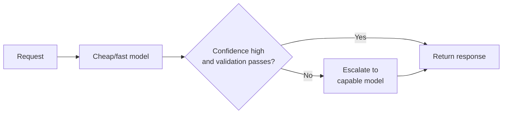

# Cost Engineering

Cost is the third vertex of the triangle [prd-01](prd-01-architecture-patterns.md) introduced alongside quality and latency, and this chapter treats it with the same engineering seriousness — not as a monthly invoice someone in finance reacts to after the fact, but as a variable with knobs an engineer turns *before* the bill arrives. The central discipline is measuring and optimizing **cost per successfully completed task**, not cost per API call, because those two numbers diverge in exactly the cases that matter most: a cheaper model that fails half the time and needs a human to finish the job is not cheap.

## Intuition: the bill is a symptom, not the disease

A rising LLM bill is downstream of decisions made much earlier — model choice, prompt length, retry policy, caching discipline, retrieved-context size ([rag-04](../03-retrieval/rag-04-chunking-strategies.md)) — each made independently, by different people, at different times, none of whom saw the bill. Cost engineering is the practice of making those decisions with the cost consequence visible *at decision time*, the same way [prd-03](prd-03-inference-optimization.md) made latency consequences visible to the engineer choosing a serving strategy rather than leaving them for someone to discover in a dashboard weeks later.

## Token economics: the building blocks

**Input and output tokens are priced asymmetrically, and output is typically several times more expensive per token.** This isn't a footnote — it inverts intuitions carried over from human-cost thinking, where "reading" is free and "writing" is the expensive part only in effort, not in dollars. A system that asks the model to restate large amounts of retrieved context in its answer is paying the output rate on tokens it already had for free as input; asking for a concise answer plus a structured reference back to source spans is often materially cheaper than asking for a full restatement, for identical information content.

**Prompt caching turns repeated context into a discount, not a repeated charge.** Any prefix reused across calls — a system prompt, a long set of tool definitions, a stable retrieved document — can be cached so subsequent calls pay a fraction of the token cost for that prefix.[^anthropic-caching] This is the same physical mechanism as [prd-02](prd-02-inference-and-serving.md)'s prefix sharing in the KV cache, visible here as a line item: **structure prompts with the stable, reusable content first and the request-specific content last**, so the cacheable prefix is as long as possible and the paid-per-call tail is as short as possible.

**Batching trades latency for a substantial discount** on work that doesn't need a live response — offline evaluation runs, bulk classification, dataset labeling. Providers offer dedicated batch endpoints, often at roughly half the synchronous price, in exchange for completion within a longer window (hours, not seconds).[^openai-batch] Any workload identified as non-interactive in [prd-01](prd-01-architecture-patterns.md)'s architecture taxonomy is a batching candidate by default.

**Model routing spends the expensive model only where the task needs it.** [api-06](../02-llm-apis/api-06-model-selection.md) established the general principle — right-size the model to the task; this chapter treats the routing decision itself as a cost lever, formalized as a **cascade**: try a cheap, fast model first, and escalate to a more capable one only when a confidence signal or a validation check indicates the cheap attempt isn't sufficient. A well-tuned cascade captures most of the cost saving of "always use the cheap model" while capturing most of the quality of "always use the expensive model," because most real traffic is easy and only a minority of requests need the expensive tier.

*The routing cascade, escalating only on low confidence or failed validation:*

## Cost as one axis of a triangle, not the only axis

Restated from [prd-01](prd-01-architecture-patterns.md) because it's the discipline's most common failure mode: optimizing cost in isolation degrades quality or latency in ways that surface as a different, more expensive problem downstream. **The unit that matters is cost per successfully completed task, not cost per API call.** A model swap that halves the per-call price but doubles the retry rate, or pushes 10% of tasks to human escalation, can easily raise total cost while every per-call dashboard shows an improvement — because the dashboard is measuring the wrong denominator.

This is why cost decisions belong inside the same eval loop as quality decisions ([evl-06](../05-evaluation/evl-06-ci-for-llm-apps.md)), not a separate finance-only process: a proposed cost optimization is evaluated for quality impact before it ships, exactly like a prompt change, because it *is* a prompt-and-model change with a cost label attached.

## Cost attribution and alerting

**Attribute cost per workload, not just in aggregate**, using the same per-workload API-key and request-tagging discipline [prd-01](prd-01-architecture-patterns.md) established for blast-radius isolation — the tags that separate workloads for reliability purposes are the same tags that make a cost breakdown by feature, team, or customer possible, at no extra instrumentation cost.

**Set budget alerts on rate of spend, not just a monthly total.** A monthly-total alert fires after the money is already spent; a rate-of-spend alert — cost per hour trending above baseline — catches a runaway loop, a misconfigured retry policy, or a prompt regression while it's still cheap to fix, in the same spirit as [prd-04](prd-04-reliability.md)'s baseline-relative drift alerting for quality.

**Track cost per task type over time as a first-class metric**, alongside latency and quality, so a regression — a prompt change that quietly increased average output length, a caching miss rate that crept up — is visible on the same dashboard that already watches the other two triangle vertices, rather than discovered a billing cycle later.

## Production engineering perspective

- **Structure prompts for maximum cacheable prefix length**: stable content (system prompt, tool definitions, shared context) first, variable content last.
- **Batch anything non-interactive** by default — the discount is close to free money for workloads with no latency requirement.
- **Build a routing cascade** for high-volume, variable-difficulty traffic, with the escalation trigger defined by a confidence signal or a cheap validation check, not a fixed split.
- **Tag every request by workload** at the API-key or metadata level, reusing [prd-01](prd-01-architecture-patterns.md)'s isolation boundaries for cost attribution.
- **Alert on spend rate, not just monthly total**, so runaway cost is caught while it's still cheap to fix.
- **Evaluate cost optimizations through the same eval gate as any other change** ([evl-06](../05-evaluation/evl-06-ci-for-llm-apps.md)) — a cheaper model or shorter prompt that regresses quality is not a saving, it's a cost shifted to the retry rate or the support queue.
- **Measure cost per successfully completed task**, not cost per call, as the metric that actually drives decisions.

## Historical evolution

**2022–2023:** early LLM products treat cost as a fixed, accepted line item — usage is low enough that per-call price optimization isn't worth engineering time. **2023:** as usage scales, teams discover the input/output price asymmetry the hard way, after shipping features that restate large retrieved context in every answer. **2023–2024:** batch APIs and prompt caching arrive as explicit provider features,[^anthropic-caching][^openai-batch] turning what had been ad hoc prompt-engineering tricks (manually deduplicating repeated context) into supported, discounted mechanisms. **2024:** model routing and cascades mature from a research idea into standard production practice, driven directly by [api-06](../02-llm-apis/api-06-model-selection.md)'s right-sizing principle applied at request granularity rather than at feature-design granularity. **2024–present:** cost per successful task, rather than cost per call, becomes the metric mature teams report — a direct consequence of enough teams discovering that per-call cost optimizations were shifting cost into retries and escalations rather than eliminating it.

## Common misconceptions

- **"The cheapest model per call is the cheapest system."** Only if it doesn't raise the retry or escalation rate. Measure cost per completed task.
- **"Caching is a nice-to-have optimization."** For any system with a stable system prompt or repeated context, it's close to free money, and its main cost is prompt structure discipline decided once.
- **"Cost is finance's problem."** By the time finance sees it, the decisions that caused it are weeks old and shipped. Cost needs the same decision-time visibility as latency and quality.
- **"Batch everything to save money."** Only workloads without a latency requirement — batching an interactive user-facing call to save money produces an unusable product.
- **"A routing cascade is just using a cheap model."** It's a cheap model *plus* a reliable escalation trigger; without the trigger, a cascade is just a quality regression with a lower price tag.

## Failure modes and trade-offs

- **Optimizing the wrong denominator** — cost per call improves while cost per completed task worsens, because retries or escalations absorbed the savings. *Fix:* instrument and report cost per successful task.
- **Cache misses from poor prompt structure** — variable content placed before stable content defeats caching silently, with no error, just a bigger bill. *Fix:* structure discipline, checked in prompt review.
- **Cascade without a validation signal** — escalation decided by a weak or absent confidence check routes hard cases to the cheap model anyway. *Fix:* pair every cascade with a cheap, concrete validation check, not just model self-reported confidence.
- **Batching latency-sensitive work** — the discount doesn't apply if the workload actually needed a fast response, and the mistake is discovered in a user complaint rather than a cost review.
- **Monthly-total alerting** — a runaway loop or regression runs for weeks before a threshold trips. *Fix:* rate-of-spend alerting with a much shorter detection window.
- **The central trade-off:** cost is not free to reduce — every lever here (routing, caching, batching, shorter prompts) has a quality or latency cost to weigh against the saving, which is why cost belongs in the same eval-gated decision process as any other system change.

## Best practices

- Structure every prompt with stable content first to maximize the cacheable prefix.
- Route non-interactive workloads to batch endpoints by default.
- Build a routing cascade with an explicit, validated escalation trigger for high-volume variable-difficulty traffic.
- Tag every request by workload for cost attribution, reusing existing isolation boundaries.
- Alert on spend-rate deviation from baseline, not just a monthly ceiling.
- Gate cost optimizations through the same eval suite as any prompt or model change.
- Report cost per successfully completed task as the primary cost metric, not cost per call.
- Revisit cost decisions on a cadence, since token pricing and available models shift often enough that a routing decision made a quarter ago may no longer be optimal.

## Real-world examples

**The restated-context bill.** A support assistant answers by quoting the full retrieved document back to the user inside its response, then citing it again in a structured summary — doubling the output tokens per response for information the user's context already showed as input. Restructuring the prompt to ask for a concise answer with source pointers instead of full restatement cuts the response length by more than half with no quality loss on the eval suite, because the summary was the part users actually read.

**The cascade that didn't validate.** A team ships a cheap-model-first cascade with escalation gated purely on the cheap model's self-reported confidence score. Confidence turns out to correlate poorly with actual correctness — the cheap model is often confidently wrong — so the cascade quietly serves degraded answers on hard cases instead of escalating them. Replacing the trigger with a cheap, concrete validation check (does the output parse, does it cite a real source, does it pass a fast rule-based sanity check) fixes the escalation rate and the eval score together.

**The alert that came too late.** A retry-on-failure loop introduced in a minor code change lacks a maximum retry cap. It runs for three weeks before the monthly bill triggers a finance review, by which point the excess spend is already substantial. A rate-of-spend alert configured afterward — hourly cost trending more than 30% above a rolling baseline — catches a near-identical bug within twenty minutes on its next occurrence.

## Interview questions

1. **"Why might a cheaper-per-call model increase total cost?"** — Model answer: because cost per call is the wrong denominator. If the cheaper model has a lower success rate, more of its outputs need a retry, an escalation to a stronger model, or a human in the loop — each of which adds cost the per-call dashboard doesn't show. The metric that actually reflects the trade-off is cost per successfully completed task, which requires tracking outcomes, not just calls, and is why cost decisions need to run through the same eval gate as any other quality-affecting change.

2. **"How does prompt caching actually save money, mechanically?"** — Model answer: it reuses the KV cache computed for a shared prefix — the same prefix-sharing mechanism prd-02 covers for PagedAttention — across calls that share that prefix, so the provider charges a fraction of the token rate for the cached portion instead of recomputing and billing it fresh each time. The practical lever is prompt structure: put stable content like system prompts and shared context first, and request-specific content last, so the cacheable prefix is as long as possible and the paid-per-call tail is as short as possible.

3. **"Design a routing cascade for a high-volume, variable-difficulty task."** — Model answer: send everything to a cheap, fast model first, and escalate to a stronger model only on a defined trigger — ideally a cheap, concrete validation check rather than the cheap model's self-reported confidence, since confidence often correlates poorly with actual correctness. I'd tune the escalation rate against the eval suite, watching both the captured cost saving and the quality on escalated versus non-escalated traffic, and revisit the split periodically since model pricing and capability shift.

4. **"Why batch instead of just using the batch endpoint's model for everything?"** — Model answer: batching trades latency for discount — the workload has to tolerate a completion window of hours rather than seconds, so it only applies to work without a live-response requirement, like offline evaluation runs or bulk labeling. Using it for interactive user-facing calls would make the product unusable regardless of the cost saving; the decision is about the workload's latency requirement, not the price alone.

5. **"How would you catch a runaway-cost bug before the monthly bill shows it?"** — Model answer: alert on spend rate relative to a rolling baseline, not on a fixed monthly ceiling — the same baseline-relative alerting principle prd-04 uses for quality drift, applied to dollars per hour instead of judge score. A monthly-total alert fires after the money's already spent; an hourly rate-of-spend alert catches a retry loop or prompt regression while it's still a small, cheap-to-fix number.

## Exercises and mini-project

**Exercises**

1. Take a prompt template with request-specific content interleaved with stable content, and restructure it to maximize the cacheable prefix.
2. Design the escalation trigger for a cascade classifying support tickets by urgency — what's the cheap validation check, and what does failing it look like?
3. Given per-call cost and success rate for two models, compute cost per completed task for each and identify which is actually cheaper.
4. Identify three workloads in a hypothetical system that are batching candidates, and justify each against the latency-requirement test.
5. Design a spend-rate alert: what's the baseline window, the deviation threshold, and who gets paged?

**Mini-project: cost-instrument your capstone.** On your capstone system: (a) tag every request by workload; (b) measure and report cost per successfully completed task, not just cost per call, comparing it against a naive per-call cost figure to show where they diverge; (c) restructure your primary prompt to maximize its cacheable prefix and measure the token-count difference; (d) if any part of your workload is non-interactive, route it to a batch-equivalent path and note the discount; (e) if traffic is variable-difficulty, sketch (or implement) a routing cascade with a validated escalation trigger. Target: 3 hours. Success criterion: a cost-per-completed-task number you can defend, and at least one concrete change (caching structure, batching, or routing) that measurably reduces it without regressing your eval suite.

**Capstone extension:** cost attribution reuses [prd-01](prd-01-architecture-patterns.md)'s workload-isolation tags; cost regressions are caught by [prd-04](prd-04-reliability.md)'s drift-alerting pattern applied to spend rate; cascades depend on [api-06](../02-llm-apis/api-06-model-selection.md)'s model-selection framework.

## Revision summary

- Cost is the third vertex of [prd-01](prd-01-architecture-patterns.md)'s triangle, engineered with decision-time visibility rather than discovered after the fact on a monthly bill.
- Token economics: **output costs more than input per token**, prompt caching discounts reused prefixes via the same mechanism as [prd-02](prd-02-inference-and-serving.md)'s prefix sharing, batching discounts non-interactive workloads, and **routing cascades** send easy traffic to a cheap model and escalate on a validated trigger.
- The metric that matters is **cost per successfully completed task**, not cost per call — a cheaper model with a higher failure rate can raise total cost while every per-call dashboard improves.
- Attribution reuses existing workload-isolation tags; alerting should fire on **spend-rate deviation from baseline**, not a monthly total, to catch runaway cost while it's still cheap to fix.
- Cost optimizations are quality-affecting changes and belong in the same eval-gated review as any other change ([evl-06](../05-evaluation/evl-06-ci-for-llm-apps.md)).

## Flashcards

| Q | A |
|---|---|
| Why is output more expensive than input, practically? | Providers price it higher per token — restating retrieved context in the answer pays the expensive rate on information already free as input. |
| What makes a prompt cacheable? | A stable, reused prefix — put it first; put variable per-request content last. |
| When does batching make sense? | Non-interactive workloads with no live-response requirement, in exchange for a substantial discount. |
| What makes a routing cascade work? | A validated escalation trigger — not the cheap model's self-reported confidence, which correlates poorly with correctness. |
| The metric that actually matters? | Cost per successfully completed task, not cost per API call. |
| Why alert on spend rate instead of monthly total? | A monthly alert fires after the money's spent; rate-of-spend catches a runaway loop while it's still cheap to fix. |
| Where do cost optimizations get evaluated? | The same eval gate as any other quality-affecting change — a cost change is a prompt/model change with a price tag. |
| What tags enable cost attribution? | The same per-workload API-key/metadata tags used for reliability blast-radius isolation. |

## Further reading

- **Official docs:** provider pricing and prompt-caching documentation[^anthropic-pricing][^anthropic-caching] and the Batch API guide[^openai-batch] — the concrete mechanisms this chapter builds practice around.
- **Papers:** none essential — this is operational practice, not a research literature.
- **Books:** none essential.
- **Talks:** none essential.
- **Tutorials:** implement the mini-project's cost-per-completed-task measurement before reading further; the gap between it and cost-per-call is the chapter's main lesson, and it's more convincing measured than read.

## Check your understanding

1. Explain why cost per call and cost per completed task can diverge, with a concrete example.
2. Design a prompt restructuring to maximize cacheable prefix length for a given template.
3. Identify a workload in a system you know that's a batching candidate, and one that isn't — justify both.
4. Design a routing cascade's escalation trigger and explain why confidence alone is insufficient.
5. Explain why cost-rate alerting catches problems that monthly-total alerting misses.

## Sources

[^anthropic-pricing]: [T1] Anthropic. "Pricing." https://www.anthropic.com/pricing (accessed 2026-07-12)
[^anthropic-caching]: [T1] Anthropic. "Prompt caching." https://docs.anthropic.com/en/docs/build-with-claude/prompt-caching (accessed 2026-07-12)
[^openai-batch]: [T1] OpenAI. "Batch API." https://platform.openai.com/docs/guides/batch (accessed 2026-07-12)
