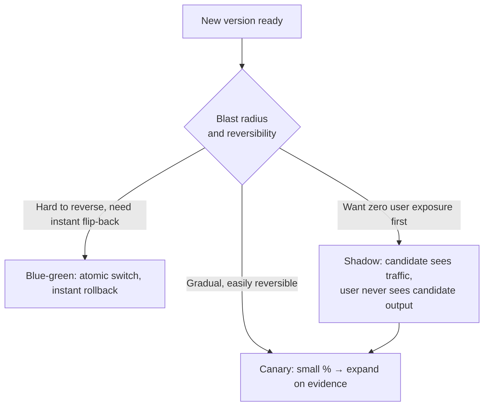

# Deployment Infrastructure

[evl-06](../05-evaluation/evl-06-ci-for-llm-apps.md) built the eval-gated CI pipeline that decides whether a prompt or model change is *good enough to ship*. This chapter covers what happens next: how that change actually reaches production traffic without a bad outcome reaching every user at once. The central idea carried over from classical release engineering is that a rollout is itself a risk-reduction mechanism, not just a delivery mechanism — and the one LLM-specific twist is that the failure a rollout needs to catch is as often a **quality regression** as a crash, which changes what a canary needs to measure.

## Intuition: deployment is staged risk exposure

A deployment strategy answers one question: how much of production traffic sees a change before you're confident it's safe? A direct 100% rollout answers "all of it, immediately" — fine for a typo fix, reckless for a new prompt or a model swap. Canary and blue-green strategies answer "a small, controlled slice first, expand only on evidence" — evidence measured the same way [evl-05](../05-evaluation/evl-05-online-evaluation.md) measures ongoing quality, because a deployment canary and an online-evaluation sample are the same instrumentation pointed at a narrower time window.

## Deployment strategies for LLM changes

**Canary releases** route a small percentage of traffic to the new version while the rest continues on the known-good version, then expand the percentage as monitored metrics — quality, latency, cost, error rate, all four dashboards from [prd-04](prd-04-reliability.md) and [prd-05](prd-05-cost-engineering.md) — stay within bounds. The LLM-specific requirement is that "monitored metrics" must include the **quality signal**, not just infrastructure health: a canary that only watches error rate and latency will wave through a prompt regression that returns 200s reliably with worse answers, exactly the brownout failure mode [prd-04](prd-04-reliability.md) described.

**Blue-green deployment** keeps two full production environments — the live one and the candidate — and switches traffic between them atomically, giving an instant rollback (flip back to blue) at the cost of running two full environments simultaneously. For LLM systems this is most valuable for changes with a slow or hard-to-reverse blast radius — a new retrieval index version, a changed system architecture — where a canary's gradual exposure isn't the right shape and an instant, complete switch-back matters more than gradual confidence-building.

**Shadow traffic** sends a copy of live production requests to the candidate version *without* serving its response to users, comparing candidate output against production output (or against a judge score) purely for measurement. This is the safest possible way to validate a new model or prompt version against real traffic distribution — [evl-04](../05-evaluation/evl-04-tracing-observability.md)'s tracing infrastructure captured the same real inputs a shadow deployment now replays — because zero user ever sees the candidate's output, so a bad shadow result costs nothing but compute.

*The three strategies, differing in what fraction of real users see the candidate and how fast rollback is:*

**In practice, these compose**: shadow first to validate against real traffic with zero user risk, then canary to confirm behavior under actual user-facing conditions at small scale, then full rollout — reserving blue-green for the subset of changes whose blast radius or reversibility profile specifically calls for an atomic switch.

## Version pinning as infrastructure discipline

The single most consequential practice in this chapter, because its absence is what makes [prd-04](prd-04-reliability.md)'s nine-day brownout example possible at all: **an unpinned model alias means a provider-side update becomes an unreviewed, unrolled-back deployment to your production system**, one that bypasses every strategy above because it was never a deployment your CI pipeline processed.

**Pin exact model versions in configuration, not just aliases.** Providers publish dated, immutable model identifiers specifically so a deployment stays reproducible; an alias that silently points to "whatever is current" trades that reproducibility for convenience, and the convenience is rarely worth it in a system with an eval-gated release process, since the whole point of the gate is deciding *when* a new version ships, not letting the provider decide for you.[^anthropic-versions][^openai-deprecations]

**Treat a model version bump as a deployment, subject to the same eval gate and rollout strategy as a prompt change** — canary it, watch quality metrics, expand on evidence. This is the practice that closes the brownout gap: a version bump becomes a *reviewed* event with a rollback path, instead of an invisible one discovered through drifting metrics weeks later.

**Track deprecation timelines actively.** Providers announce model retirement dates in advance;[^openai-deprecations] a pinned version has a shelf life, and treating "migrate off a deprecating model" as a scheduled, planned deployment — evaluated and canaried like any other — is materially safer than an emergency migration forced by an imminent hard cutoff.

## Rollback design

**Define the rollback trigger before deploying, not during an incident** — the same discipline [prd-04](prd-04-reliability.md) applied to fallback chains, applied here to the rollout itself: a quality-metric threshold, an error-rate threshold, a cost-rate threshold, each with an owner empowered to pull the trigger without an approval meeting.

**Rollback for an LLM deployment is a version swap, not a code revert**, in the common case of a prompt or model change — which is precisely why version pinning matters so much: reverting to a known-good pinned version is instant and exact, while "reverting" from an unpinned alias means hoping the provider's current state matches what was previously observed, which it may no longer do.

**Keep the previous version warm during a canary**, not decommissioned — the same principle as [prd-04](prd-04-reliability.md)'s continuous trickle traffic through fallback paths, here applied to the rollout's safe-landing zone: rollback should be an instant traffic-routing change, never a redeploy-from-scratch.

## Production engineering perspective

- **Route deployments through the same eval gate as CI** ([evl-06](../05-evaluation/evl-06-ci-for-llm-apps.md)) — a deployment strategy without an eval-gated pipeline behind it is just infrastructure for shipping ungated changes faster.
- **Canary on quality, not just infrastructure health** — error rate and latency alone will not catch a quality regression serving 200s.
- **Pin every model version explicitly**, and treat a version bump as a first-class, reviewed, canaried deployment.
- **Use shadow traffic to de-risk high-uncertainty changes** (new model families, major prompt rewrites, new retrieval indices) before any user sees the candidate's output.
- **Reserve blue-green for hard-to-reverse blast radius** — index swaps, architecture changes — where instant, atomic rollback matters more than gradual exposure.
- **Define rollback triggers and owners before deploying**, and keep the previous version's traffic path warm throughout the rollout.
- **Track provider deprecation timelines as a scheduled deployment**, not an emergency.

## Historical evolution

**2022–2023:** LLM features deploy the way ordinary application code deploys — a config change, a redeploy, no LLM-specific rollout discipline — because the failure modes that justify staged rollout (quality brownouts) aren't yet well understood as a distinct risk. **2023:** teams begin canarying prompt changes after enough regressions ship silently to the full user base, largely reinventing classical progressive-delivery practice one incident at a time — the same pattern [prd-04](prd-04-reliability.md) traced for reliability engineering generally. **2023–2024:** the brownout failure mode becomes well understood, and version pinning shifts from "best practice mentioned in docs" to "the specific fix for a specific, now-named class of incident." **2024:** shadow-traffic validation against real production distributions becomes standard for high-stakes model or prompt changes, enabled directly by the tracing infrastructure ([evl-04](../05-evaluation/evl-04-tracing-observability.md)) that had already been built for observability and now doubles as shadow-deployment input. **2024–present:** deployment strategy for LLM changes converges with classical progressive delivery almost completely, with the one durable addition being that the canary's health check must include a quality signal, not just infrastructure metrics — the field's answer to a failure class conventional deployment tooling was never built to see.

## Common misconceptions

- **"A canary only needs to watch error rate and latency."** It needs a quality signal too, or it will wave through exactly the brownout regressions this chapter exists to prevent.
- **"Using the latest model alias keeps us current automatically."** It also means a provider-side update ships to your production system with no review, no canary, and no rollback path — the opposite of "deployment infrastructure."
- **"Rollback means reverting code."** For prompt and model changes, rollback is a version swap — instant if the previous version is pinned and kept warm, unreliable if it wasn't.
- **"Shadow traffic is redundant with a canary."** Shadow validates with zero user exposure before any real user sees the candidate; canary validates under real user-facing conditions afterward. They answer different questions.
- **"Blue-green is strictly better than canary because rollback is instant."** It costs a full duplicate environment and doesn't provide canary's gradual, evidence-based confidence-building — the right choice depends on the change's blast radius and reversibility, not a general ranking.

## Failure modes and trade-offs

- **Health-check blindness** — a canary or blue-green gate watching only infrastructure metrics ships a quality regression to 100% of traffic. *Fix:* include the online quality signal in the promotion gate.
- **The invisible provider-side deployment** — an unpinned alias means a model update ships without going through any of this chapter's machinery at all. *Fix:* pin exact versions; treat bumps as reviewed deployments.
- **Cold rollback paths** — a previous version decommissioned rather than kept warm turns "rollback" into "redeploy from scratch," losing the instant-recovery property that justified the strategy. *Fix:* keep prior versions warm through the canary window.
- **Deprecation-driven emergency migration** — ignoring provider deprecation timelines until a hard cutoff forces an unplanned, unevaluated migration. *Fix:* track timelines, schedule migrations as planned deployments.
- **The central trade-off:** rollout safety versus rollout speed. Every stage of canary expansion, every shadow-traffic validation pass, buys confidence at the cost of time-to-ship — the resolution is calibrating stage duration and expansion thresholds to the actual blast radius of the change, not applying one rollout speed to everything.

## Best practices

- Route every prompt and model change through canary, blue-green, or shadow traffic based on its blast radius and reversibility — never a direct 100% rollout for anything beyond a trivial fix.
- Include the online quality signal in every promotion gate, not just infrastructure health metrics.
- Pin exact model versions in configuration; treat version bumps as reviewed, canaried deployments.
- Use shadow traffic against real production distribution before any user-facing exposure for high-uncertainty changes.
- Define rollback triggers and empowered owners before deploying, not during an incident.
- Keep the previous version's traffic path warm throughout a rollout window for instant rollback.
- Track and schedule provider deprecation timelines as planned migrations.

## Real-world examples

**The canary that caught what error rate couldn't.** A team canaries a new prompt version at 5% of traffic with error rate, latency, and judge-scored quality all in the promotion gate. Error rate and latency look identical to the control group; the quality signal shows a measurable drop in groundedness on the canaried slice. The change is rolled back before ever reaching more than 5% of users — a regression an infrastructure-only canary would have promoted straight to 100%.

**The alias that deployed itself.** A system configured with a "latest" model alias sees a provider-side update roll out silently. No canary ran, no eval gate evaluated it, no rollback path existed, because from the deployment infrastructure's point of view, nothing was deployed. The fix — pinning the exact dated version and treating future bumps as reviewed, canaried changes — closes the same gap prd-04's brownout example described, from the deployment side rather than the monitoring side.

**The deprecation deadline that arrived as a surprise.** A provider announces a model's retirement date; the team notices the deprecation notice three days before the cutoff, forcing an emergency migration with no time for proper canarying or shadow validation. The rushed migration ships a quality regression that a normal rollout process would have caught. The subsequent fix is process, not code: deprecation timelines get logged the day they're announced and scheduled as planned deployments with normal lead time.

## Interview questions

1. **"What's the difference between canary, blue-green, and shadow deployment, and when would you use each?"** — Model answer: canary routes a small, growing percentage of real traffic to the candidate and expands on evidence — good for gradual, easily-reversible changes. Blue-green keeps two full environments and switches atomically, giving instant rollback at the cost of running duplicate infrastructure — best for hard-to-reverse blast radius like an index swap. Shadow traffic replays real requests to the candidate without ever serving its output to users, purely for measurement — the safest option for validating high-uncertainty changes before any user exposure. In practice they compose: shadow first, then canary, reserving blue-green for changes whose reversibility profile specifically needs an atomic switch.

2. **"Why does an LLM canary need to watch something a normal service canary doesn't?"** — Model answer: it needs an online quality signal, not just error rate and latency, because the LLM-specific failure mode — the quality brownout from prd-04 — returns successful, fast responses that are simply worse. A canary gate limited to infrastructure health will promote a quality regression straight to 100% of traffic, because by every metric it's watching, nothing looks wrong.

3. **"Why is version pinning a deployment-infrastructure concern, not just a reproducibility nicety?"** — Model answer: an unpinned model alias means a provider-side update becomes a de facto deployment to production that bypasses every mechanism in this chapter — no eval gate, no canary, no rollback path, because nothing that happened counted as a deployment your systems tracked. Pinning exact versions and treating bumps as reviewed, canaried changes is what closes that gap — it's the deployment-side fix for the same failure prd-04 covers from the monitoring side.

4. **"How do you design a rollback for a prompt change versus a rollback for application code?"** — Model answer: for a prompt or model change, rollback is a version swap, not a code revert — instant and exact if the previous version is pinned and its traffic path kept warm through the rollout window. The trigger and the owner authorized to pull it should be defined before deploying, using the same threshold-based decision-making prd-04 applies to fallback chains, so nobody is improvising a rollback decision mid-incident.

5. **"When would you choose shadow traffic over just canarying directly?"** — Model answer: when the change carries enough uncertainty that you want zero user exposure before any validation — a new model family, a major prompt rewrite, a new retrieval index. Shadow traffic replays real production requests to the candidate and compares its output against the current production output or a judge score, with nothing ever served to a real user, so a bad result costs only compute. It's strictly safer than canarying first but doesn't replace canary — it validates against real traffic distribution, canary validates under real user-facing serving conditions, including load and latency effects shadow traffic won't fully replicate.

## Exercises and mini-project

**Exercises**

1. Design the promotion gate for a canary rollout of a prompt change: what metrics, what thresholds, what expansion schedule?
2. Explain why an unpinned model alias defeats every mechanism in this chapter, concretely.
3. Choose a deployment strategy (canary, blue-green, or shadow-then-canary) for three scenarios: a minor prompt wording fix, a new retrieval index version, a switch to a different model provider — and justify each choice.
4. Design a rollback trigger and name the empowered owner for a hypothetical production LLM feature.
5. Write the process for tracking and scheduling a provider's model deprecation timeline as a planned migration.

**Mini-project: build a staged rollout for your capstone.** On your capstone system: (a) pin an exact model version in configuration rather than an alias; (b) define a canary promotion gate with at least one quality metric, one latency metric, and explicit thresholds; (c) if feasible, implement shadow traffic that replays a sample of test inputs to a candidate configuration without serving its output; (d) define your rollback trigger and the threshold that fires it; (e) write a one-page deployment runbook covering all three strategies and when you'd choose each for your system. Target: 3 hours. Success criterion: a rollout process where a deliberately-regressed candidate (worse prompt, wrong model version) is caught by your promotion gate before reaching full traffic.

**Capstone extension:** deployment gates reuse [evl-06](../05-evaluation/evl-06-ci-for-llm-apps.md)'s eval suite and [evl-05](../05-evaluation/evl-05-online-evaluation.md)'s quality signal; rollback design follows [prd-04](prd-04-reliability.md)'s fallback-chain discipline; this chapter completes Module 6's production triangle (architecture, serving, optimization, reliability, cost, deployment).

## Revision summary

- Deployment strategy answers how much of production traffic sees a change before confidence is earned: **canary** (gradual, evidence-based expansion), **blue-green** (atomic switch, instant rollback, for hard-to-reverse blast radius), **shadow traffic** (zero user exposure, real-traffic validation) — commonly composed as shadow → canary → full rollout.
- The LLM-specific requirement on every strategy: the promotion gate must include an **online quality signal**, not just infrastructure health, or it will promote a brownout straight to 100% of traffic.
- **Version pinning is a deployment-infrastructure discipline, not just reproducibility** — an unpinned alias makes provider-side updates into unreviewed, ungated, unrolled-back deployments, which is exactly the gap behind [prd-04](prd-04-reliability.md)'s brownout failure mode.
- **Rollback for prompt/model changes is a version swap**, made instant by keeping the previous pinned version warm throughout the rollout window; trigger and owner are defined before deploying, never improvised mid-incident.
- Provider deprecation timelines should be tracked and scheduled as planned deployments, not discovered as emergencies.

## Flashcards

| Q | A |
|---|---|
| Canary vs. blue-green vs. shadow? | Canary: gradual traffic, evidence-based expansion. Blue-green: atomic switch, instant rollback. Shadow: zero user exposure, pure measurement. |
| What must an LLM canary's gate include beyond infra health? | An online quality signal — otherwise it promotes brownouts straight through. |
| Why pin exact model versions? | An unpinned alias turns a provider-side update into an unreviewed deployment with no gate, canary, or rollback path. |
| What is "rollback" for a prompt/model change? | A version swap, not a code revert — instant if the prior pinned version is kept warm. |
| When is blue-green preferred over canary? | Hard-to-reverse blast radius (index swaps, architecture changes) where an atomic instant switch matters more than gradual exposure. |
| What does shadow traffic validate that canary doesn't? | Real production input distribution with zero risk, before any user sees the candidate's output. |
| How should deprecation timelines be handled? | Tracked from announcement and scheduled as a planned, evaluated, canaried migration — not an emergency cutover. |

## Further reading

- **Official docs:** provider model-version and deprecation documentation[^anthropic-versions][^openai-deprecations] — the concrete pinning and migration mechanics this chapter assumes.
- **Papers:** none essential — operational practice, not research literature.
- **Books:** Google, *Site Reliability Engineering* — release engineering chapter[^google-sre-release] — the classical progressive-delivery discipline this chapter specializes for LLM quality signals.
- **Talks:** none essential.
- **Tutorials:** build the mini-project's promotion gate and deliberately regress a candidate to confirm it's actually caught — a gate that's never caught anything hasn't been tested.

## Check your understanding

1. Explain why a canary gate limited to error rate and latency is insufficient for LLM deployments, with a concrete failure example.
2. Design a shadow-traffic validation setup for a candidate model swap and state what it can and can't tell you.
3. Explain the mechanical difference between rolling back a code deploy and rolling back a prompt/model version.
4. Argue for or against using an unpinned "latest" model alias in a production system, addressing the deployment-infrastructure gap it creates.
5. Design the deprecation-tracking process for a system depending on three different provider model versions.

## Sources

[^google-sre-release]: [T3] Google. "Release Engineering." Site Reliability Engineering. https://sre.google/sre-book/release-engineering/ (accessed 2026-07-13)
[^anthropic-versions]: [T1] Anthropic. "Models overview." https://docs.anthropic.com/en/docs/about-claude/models (accessed 2026-07-13)
[^openai-deprecations]: [T1] OpenAI. "Deprecations." https://platform.openai.com/docs/deprecations (accessed 2026-07-13)
