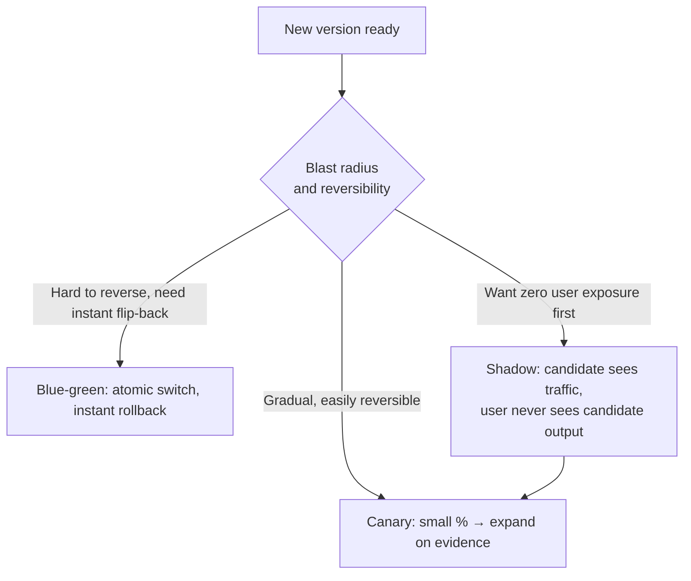
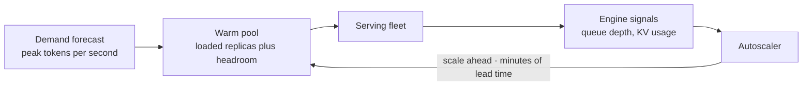

# Deployment Infrastructure

[evl-06](../05-evaluation/evl-06-ci-for-llm-apps.md) built the eval-gated CI pipeline that decides whether a prompt or model change is *good enough to ship*. This chapter covers what happens next: how that change actually reaches production traffic without a bad outcome reaching every user at once. The central idea carried over from classical release engineering is that a rollout is itself a risk-reduction mechanism, not just a delivery mechanism — and the one LLM-specific twist is that the failure a rollout needs to catch is as often a **quality regression** as a crash, which changes what a canary needs to measure. For self-hosted routes there is a second layer underneath — the GPUs each version runs on — and the chapter closes with it, because memory, utilization and cold starts reshape capacity planning as much as quality signals reshape rollouts.

## Intuition: deployment is staged risk exposure

A deployment strategy answers one question: how much of production traffic sees a change before you're confident it's safe? A direct 100% rollout answers "all of it, immediately" — fine for a typo fix, reckless for a new prompt or a model swap. Canary and blue-green strategies answer "a small, controlled slice first, expand only on evidence" — evidence measured the same way [evl-05](../05-evaluation/evl-05-online-evaluation.md) measures ongoing quality, because a deployment canary and an online-evaluation sample are the same instrumentation, pointed at a small slice of traffic that is running the new version.[^google-sre-canary]

## Deployment strategies for LLM changes

**Canary releases** route a small percentage of traffic to the new version while the rest continues on the known-good version, then expand the percentage as monitored metrics — quality, latency, cost, error rate, all four dashboards from [prd-04](prd-04-reliability.md) and [prd-05](prd-05-cost-engineering.md) — stay within bounds. The LLM-specific requirement is that "monitored metrics" must include the **quality signal**, not just infrastructure health: a canary that only watches error rate and latency will wave through a prompt regression that returns 200s reliably with worse answers, exactly the brownout failure mode [prd-04](prd-04-reliability.md) described.

**Blue-green deployment** keeps two full production environments — the live one and the candidate — and switches traffic between them atomically, giving an instant rollback (flip back to blue) at the cost of running two full environments simultaneously. For LLM systems this is most valuable for changes with a slow or hard-to-reverse blast radius — a new retrieval index version, a changed system architecture — where a canary's gradual exposure isn't the right shape and an instant, complete switch-back matters more than gradual confidence-building.

**Shadow traffic** mirrors a copy of live production requests to the candidate version *without* serving its response to users, comparing candidate output against production output (or against a judge score) purely for measurement ([evl-05](../05-evaluation/evl-05-online-evaluation.md)). This is the safest way to validate a new model or prompt version against the real traffic distribution, because no user ever sees the candidate's output, so a bad shadow result costs nothing but compute. Its offline cousin is **trace replay**: re-running a sample of stored production inputs — [evl-04](../05-evaluation/evl-04-tracing-observability.md)'s traces — through the candidate. Replay is cheaper and needs no live deployment, but it is frozen in time and blind to anything that depends on live state, so it complements shadow traffic rather than replacing it.

*The three strategies, differing in what fraction of real users see the candidate and how fast rollback is:*

```mermaid
graph TD
  A[New version ready] --> B{Blast radius<br/>and reversibility}
  B -->|Gradual, easily reversible| C[Canary: small % → expand on evidence]
  B -->|Hard to reverse, need instant flip-back| D[Blue-green: atomic switch, instant rollback]
  B -->|Want zero user exposure first| E[Shadow: candidate sees traffic,<br/>user never sees candidate output]
  E --> C
```

**In practice, these compose**: shadow first to validate against real traffic with zero user risk, then canary to confirm behavior under actual user-facing conditions at small scale, then full rollout — reserving blue-green for the subset of changes whose blast radius or reversibility profile specifically calls for an atomic switch.

## Version pinning as infrastructure discipline

The single most consequential practice in this chapter, because its absence is what makes [prd-04](prd-04-reliability.md)'s nine-day brownout example possible at all: **an unpinned model alias means a provider-side update becomes an unreviewed, unrolled-back deployment to your production system**, one that bypasses every strategy above because it was never a deployment your CI pipeline processed.

**Pin exact model versions in configuration, not just aliases.** Providers publish dated, immutable model identifiers specifically so a deployment stays reproducible; an alias that silently points to "whatever is current" trades that reproducibility for convenience, and the convenience is rarely worth it in a system with an eval-gated release process, since the whole point of the gate is deciding *when* a new version ships, not letting the provider decide for you.[^anthropic-versions][^openai-deprecations]

**Treat a model version bump as a deployment, subject to the same eval gate and rollout strategy as a prompt change** — canary it, watch quality metrics, expand on evidence. This is the practice that closes the brownout gap: a version bump becomes a *reviewed* event with a rollback path, instead of an invisible one discovered through drifting metrics weeks later.

**Track deprecation timelines actively.** Providers announce model retirement dates in advance;[^openai-deprecations] a pinned version has a shelf life, and treating "migrate off a deprecating model" as a scheduled, planned deployment — evaluated and canaried like any other — is materially safer than an emergency migration forced by an imminent hard cutoff.

## Rollback design

**Define the rollback trigger before deploying, not during an incident** — the same discipline [prd-04](prd-04-reliability.md) applied to fallback chains, applied here to the rollout itself: a quality-metric threshold, an error-rate threshold, a cost-rate threshold, each with an owner empowered to pull the trigger without an approval meeting.

**Rollback for an LLM deployment is a version swap, not a code revert**, in the common case of a prompt or model change — which is precisely why version pinning matters so much: reverting to a known-good pinned version is instant and exact, while "reverting" from an unpinned alias means hoping the provider's current state matches what was previously observed, which it may no longer do.

**Keep the previous version warm during a canary**, not decommissioned — the same principle as [prd-04](prd-04-reliability.md)'s continuous trickle traffic through fallback paths, here applied to the rollout's safe-landing zone: rollback should be an instant traffic-routing change, never a redeploy-from-scratch.

## The compute layer for self-hosted routes

Everything above applies whether a model sits behind a provider's API or on your own accelerators. When a route is self-hosted — a decision [api-07](../02-llm-apis/api-07-local-inference.md)'s TCO makes, not this chapter — deployment gains a second job: provisioning the compute each version runs on. Three facts recalibrate web-tier instincts. **Memory capacity decides which accelerator a model can run on at all, and memory bandwidth sets how fast it decodes** ([prd-02](prd-02-inference-and-serving.md)). **Utilization is the economics**: an accelerator costs the same per hour whether it serves one request or thousands. And **elasticity is fought by physics**: a new replica cannot serve until gigabytes of weights are loaded, so scale-up takes minutes where a web tier takes seconds.

> **Volatile:** accelerator models, memory sizes, prices and availability change every product cycle. The figures below are examples that make the arithmetic concrete — read current spec sheets and price lists before you plan. The sizing method, the utilization economics and the cold-start doctrine are the stable part.

**Memory class picks the accelerator; bandwidth sets the throughput.** Sort hardware by memory first, because a model that doesn't fit doesn't run:

| Example accelerator | Memory | Peak memory bandwidth |
|---|---|---|
| NVIDIA L4 (low-power inference card) | 24 GB | 300 GB/s[^nvidia-l4] |
| NVIDIA H100 SXM (datacenter) | 80 GB | 3.35 TB/s[^nvidia-h100] |

Now run [prd-02](prd-02-inference-and-serving.md)'s arithmetic. An 8B model at 16-bit is about 16 GB of weights. On a 24 GB card that leaves roughly 8 GB for KV cache — at ≈128 KB per token, at most about 65,000 tokens across *all* concurrent requests (fewer after engine overhead), on the order of 30 concurrent 2,000-token conversations. Decode speed per stream is capped near bandwidth ÷ weight bytes: about 19 steps per second on the L4 (300 GB/s ÷ 16 GB) and about 210 on an H100, both at peak bandwidth that real workloads don't sustain. Batching raises aggregate throughput, not that per-step ceiling. A 70B model at 16-bit is about 140 GB and fits neither card. You either shard it across several GPUs with tensor parallelism — every layer then exchanges activations between devices, so it needs a fast GPU-to-GPU interconnect and usually stays within one server — or quantize it to 4-bit (roughly 35–40 GB with quantization scales) and fit one 80 GB card with room for cache: [prd-03](prd-03-inference-optimization.md)'s "larger model at lower precision" trade.

**Procurement follows measured utilization.** The options form a ladder from flexible-and-expensive to committed-and-cheap:

- **On-demand cloud GPUs** — pay by the hour, no commitment; the highest unit price, and top-end parts are not always available when you ask.
- **Reserved or committed capacity** — a lower effective rate in exchange for paying for every hour of a one- or three-year term, used or not. It is a bet on utilization.
- **GPU-specialist clouds** — often cheaper or easier to get for current accelerators, traded against a thinner surrounding platform.
- **Serverless GPU** — billed per second while running, scales to zero, and pays a cold start each time an instance spins up; good for spiky or development traffic, poor for tight-latency interactive routes.
- **Owned hardware** — the lowest marginal cost at high utilization, and the whole of [api-07](../02-llm-apis/api-07-local-inference.md)'s ops product: procurement lead times, failures, upgrades.

The break-even is arithmetic, not opinion. If committed capacity costs a fraction *f* of the on-demand hourly price but is billed for every hour, it beats on-demand only when you would otherwise run on-demand for more than *f* of the hours: a commitment at 60% of the on-demand rate pays off above roughly 60% utilization. The same denominator decides self-hosting against the API — your cost per token is hourly cost ÷ tokens *actually served* per hour — which is why [api-07](../02-llm-apis/api-07-local-inference.md) calls utilization the number teams most overestimate. Measure it on current traffic before you buy.

**Cold starts reshape autoscaling.** A new replica passes through a sequence before its first token: the platform finds and attaches a GPU, the multi-gigabyte serving image is pulled, the engine initializes, and the weights load into GPU memory — 16 GB for an 8B model, about 140 GB for a 70B one at 16-bit. Every phase can be shortened — Google's Cloud Run guidance, for example, recommends downloading weights from object storage at startup rather than baking large models into the container image[^cloudrun-gpu] — but the total is still tens of seconds to minutes, against a web tier's seconds. Four consequences:

- **Keep a warm pool.** Size the always-loaded fleet for expected load plus headroom, so a spike is absorbed by capacity that is already serving while new replicas load.
- **Scale ahead of demand, on a forecast**, not only in reaction: a scaler that fires when latency degrades delivers capacity minutes after the spike that needed it.
- **Scale on the engine's signals, not CPU.** CPU utilization says almost nothing about a GPU-bound server. The useful signals are requests waiting in the engine's queue and KV-cache usage — vLLM, for one, exports both as metrics.[^vllm-metrics] Queue depth is the earliest sign of saturation; KV usage near full predicts the preemption cliff [prd-02](prd-02-inference-and-serving.md) describes.
- **Scale to zero only where a cold start is acceptable** — development environments and batch jobs, not interactive routes.

A model rollout is also a fleet event: a canary of a self-hosted model version needs its own loaded replicas, and keeping the previous version warm for rollback (above) means paying for both fleets' memory for the length of the canary. Budget for it.

*Scaling a self-hosted fleet — the forecast sizes the warm pool, the engine's own signals drive the scaler, and cold-start lead time is why both exist:*

```mermaid
graph LR
  F[Demand forecast<br/>peak tokens per second] --> W[Warm pool<br/>loaded replicas plus headroom]
  Q[Engine signals<br/>queue depth, KV usage] --> S[Autoscaler]
  S -->|scale ahead · minutes of lead time| W
  W --> R[Serving fleet]
  R --> Q
```

**Kubernetes, or a managed service.** Kubernetes schedules GPUs through vendor device plugins, which expose them as a resource such as `nvidia.com/gpu` that containers request in whole units through their limits. By default containers don't share a GPU and fractional requests aren't possible, so sharing needs vendor features such as partitioning or time-slicing.[^k8s-gpus] Add node pools per accelerator type, multi-minute image pulls and weight loads, and the bin-packing of large-memory pods, and running inference on Kubernetes is a real platform project. It earns its keep when a platform team already operates Kubernetes and the GPU fleet is big enough to justify the work; most teams are better served by a managed inference service, or a provider API, until utilization and governance say otherwise.

**Capacity planning, end to end.** Turn [prd-02](prd-02-inference-and-serving.md)'s measured curves into a fleet:

1. **Peak demand** — requests per second at peak, with their prompt- and output-length distributions ([prd-05](prd-05-cost-engineering.md)'s forecast).
2. **Per-replica capacity at your SLO** — the goodput one replica sustains while meeting its latency target, *measured* with [prd-02](prd-02-inference-and-serving.md)'s load test, never read off a spec sheet.
3. **Replicas** = peak demand ÷ per-replica capacity, plus headroom for the cold-start lag, plus at least one spare for failure (N+1).
4. **Cost** = replicas × hourly price under your procurement model, divided by tokens actually served — the number to put next to the API price ([api-07](../02-llm-apis/api-07-local-inference.md)).

## Production engineering perspective

- **Route deployments through the same eval gate as CI** ([evl-06](../05-evaluation/evl-06-ci-for-llm-apps.md)) — a deployment strategy without an eval-gated pipeline behind it is just infrastructure for shipping ungated changes faster.
- **Canary on quality, not just infrastructure health** — error rate and latency alone will not catch a quality regression serving 200s.
- **Pin every model version explicitly**, and treat a version bump as a first-class, reviewed, canaried deployment.
- **Use shadow traffic to de-risk high-uncertainty changes** (new model families, major prompt rewrites, new retrieval indices) before any user sees the candidate's output.
- **Reserve blue-green for hard-to-reverse blast radius** — index swaps, architecture changes — where instant, atomic rollback matters more than gradual exposure.
- **Define rollback triggers and owners before deploying**, and keep the previous version's traffic path warm throughout the rollout.
- **Track provider deprecation timelines as a scheduled deployment**, not an emergency.
- **For self-hosted routes, size from memory, buy on measured utilization, and keep a warm pool** — autoscale on queue depth and KV usage with forecast lead time, because a cold start takes minutes.

## Historical evolution

**2022–2023:** LLM features deploy the way ordinary application code deploys — a config change, a redeploy, no LLM-specific rollout discipline — because the failure modes that justify staged rollout (quality brownouts) aren't yet well understood as a distinct risk. **2023:** teams begin canarying prompt changes after enough regressions ship silently to the full user base, largely reinventing classical progressive-delivery practice one incident at a time — the same pattern [prd-04](prd-04-reliability.md) traced for reliability engineering generally. **2023–2024:** the brownout failure mode becomes well understood, and version pinning shifts from "best practice mentioned in docs" to "the specific fix for a specific, now-named class of incident." **2024:** shadow traffic and trace replay become common for high-stakes model or prompt changes — the tracing infrastructure ([evl-04](../05-evaluation/evl-04-tracing-observability.md)) already built for observability doubles as replay input. **2024–present:** deployment strategy for LLM changes converges with classical progressive delivery almost completely, with the one durable addition being that the canary's health check must include a quality signal, not just infrastructure metrics — the field's answer to a failure class conventional deployment tooling was never built to see.

## Common misconceptions

- **"A canary only needs to watch error rate and latency."** It needs a quality signal too, or it will wave through exactly the brownout regressions this chapter exists to prevent.
- **"Using the latest model alias keeps us current automatically."** It also means a provider-side update ships to your production system with no review, no canary, and no rollback path — the opposite of "deployment infrastructure."
- **"Rollback means reverting code."** For prompt and model changes, rollback is a version swap — instant if the previous version is pinned and kept warm, unreliable if it wasn't.
- **"Shadow traffic is redundant with a canary."** Shadow validates with zero user exposure before any real user sees the candidate; canary validates under real user-facing conditions afterward. They answer different questions.
- **"Blue-green is strictly better than canary because rollback is instant."** It costs a full duplicate environment and doesn't provide canary's gradual, evidence-based confidence-building — the right choice depends on the change's blast radius and reversibility, not a general ranking.

## Failure modes and trade-offs

- **Health-check blindness** — a canary or blue-green gate watching only infrastructure metrics ships a quality regression to 100% of traffic. *Fix:* include the online quality signal in the promotion gate.
- **The invisible provider-side deployment** — an unpinned alias means a model update ships without going through any of this chapter's machinery at all. *Fix:* pin exact versions; treat bumps as reviewed deployments.
- **Cold rollback paths** — a previous version decommissioned rather than kept warm turns "rollback" into "redeploy from scratch," losing the instant-recovery property that justified the strategy. *Fix:* keep prior versions warm through the canary window.
- **Deprecation-driven emergency migration** — ignoring provider deprecation timelines until a hard cutoff forces an unplanned, unevaluated migration. *Fix:* track timelines, schedule migrations as planned deployments.
- **Autoscaling on the wrong signal** — a GPU fleet scaled on CPU utilization, or purely reactively on latency, adds capacity minutes after the spike that needed it. *Fix:* scale on engine queue depth and KV usage, ahead of forecast demand, from a warm pool.
- **Buying for imagined utilization** — committed or owned capacity sized for a utilization the traffic never reaches. *Fix:* measure utilization on current traffic first; commit only above the break-even.
- **The central trade-off:** rollout safety versus rollout speed. Every stage of canary expansion, every shadow-traffic validation pass, buys confidence at the cost of time-to-ship — the resolution is calibrating stage duration and expansion thresholds to the actual blast radius of the change, not applying one rollout speed to everything.

## Best practices

- Route every prompt and model change through canary, blue-green, or shadow traffic based on its blast radius and reversibility — never a direct 100% rollout for anything beyond a trivial fix.
- Include the online quality signal in every promotion gate, not just infrastructure health metrics.
- Pin exact model versions in configuration; treat version bumps as reviewed, canaried deployments.
- Use shadow traffic against real production distribution before any user-facing exposure for high-uncertainty changes.
- Define rollback triggers and empowered owners before deploying, not during an incident.
- Keep the previous version's traffic path warm throughout a rollout window for instant rollback.
- Track and schedule provider deprecation timelines as planned migrations.
- For self-hosted routes, pick the accelerator by memory, measure per-replica goodput at your SLO, and size the fleet with cold-start headroom and N+1.

## Real-world examples

**The canary that caught what error rate couldn't.** A team canaries a new prompt version at 5% of traffic with error rate, latency, and judge-scored quality all in the promotion gate. Error rate and latency look identical to the control group; the quality signal shows a measurable drop in groundedness on the canaried slice. The change is rolled back before ever reaching more than 5% of users — a regression an infrastructure-only canary would have promoted straight to 100%.

**The alias that deployed itself.** A system configured with a "latest" model alias sees a provider-side update roll out silently. No canary ran, no eval gate evaluated it, no rollback path existed, because from the deployment infrastructure's point of view, nothing was deployed. The fix — pinning the exact dated version and treating future bumps as reviewed, canaried changes — closes the same gap prd-04's brownout example described, from the deployment side rather than the monitoring side.

**The deprecation deadline that arrived as a surprise.** A provider announces a model's retirement date; the team notices the deprecation notice three days before the cutoff, forcing an emergency migration with no time for proper canarying or shadow validation. The rushed migration ships a quality regression that a normal rollout process would have caught. The subsequent fix is process, not code: deprecation timelines get logged the day they're announced and scheduled as planned deployments with normal lead time.

## Interview questions

1. **"What's the difference between canary, blue-green, and shadow deployment, and when would you use each?"** — Model answer: canary routes a small, growing percentage of real traffic to the candidate and expands on evidence — good for gradual, easily-reversible changes. Blue-green keeps two full environments and switches atomically, giving instant rollback at the cost of running duplicate infrastructure — best for hard-to-reverse blast radius like an index swap. Shadow traffic mirrors live requests to the candidate without ever serving its output to users, purely for measurement — the safest option for validating high-uncertainty changes before any user exposure. In practice they compose: shadow first, then canary, reserving blue-green for changes whose reversibility profile specifically needs an atomic switch.

2. **"Why does an LLM canary need to watch something a normal service canary doesn't?"** — Model answer: it needs an online quality signal, not just error rate and latency, because the LLM-specific failure mode — the quality brownout from prd-04 — returns successful, fast responses that are simply worse. A canary gate limited to infrastructure health will promote a quality regression straight to 100% of traffic, because by every metric it's watching, nothing looks wrong.

3. **"Why is version pinning a deployment-infrastructure concern, not just a reproducibility nicety?"** — Model answer: an unpinned model alias means a provider-side update becomes a de facto deployment to production that bypasses every mechanism in this chapter — no eval gate, no canary, no rollback path, because nothing that happened counted as a deployment your systems tracked. Pinning exact versions and treating bumps as reviewed, canaried changes is what closes that gap — it's the deployment-side fix for the same failure prd-04 covers from the monitoring side.

4. **"How do you design a rollback for a prompt change versus a rollback for application code?"** — Model answer: for a prompt or model change, rollback is a version swap, not a code revert — instant and exact if the previous version is pinned and its traffic path kept warm through the rollout window. The trigger and the owner authorized to pull it should be defined before deploying, using the same threshold-based decision-making prd-04 applies to fallback chains, so nobody is improvising a rollback decision mid-incident.

5. **"When would you choose shadow traffic over just canarying directly?"** — Model answer: when the change carries enough uncertainty that you want zero user exposure before any validation — a new model family, a major prompt rewrite, a new retrieval index. Shadow traffic mirrors live production requests to the candidate and compares its output against the current production output or a judge score, with nothing ever served to a real user, so a bad result costs only compute. It's strictly safer than canarying first but doesn't replace canary — it validates against real traffic distribution, canary validates under real user-facing serving conditions, including load and latency effects shadow traffic won't fully replicate.

6. **"Your self-hosted model's latency spikes every morning as traffic ramps, even though the autoscaler adds replicas. What's happening, and what do you change?"** — Model answer: the new replicas arrive too late. A GPU replica isn't ready until a node is attached, a multi-gigabyte image is pulled, the engine initializes and the weights load — minutes, not seconds — so a scaler that reacts to the ramp delivers capacity after the spike. And if it scales on CPU, it is watching a signal that barely moves on a GPU-bound server. I'd scale on the engine's queue depth and KV-cache usage, add a forecast-driven scale-up ahead of the known morning ramp, and keep a warm pool sized for expected load plus headroom. Then I'd measure one cold start end to end so the lead time is a number, not a guess.

## Exercises and mini-project

**Exercises**

1. Design the promotion gate for a canary rollout of a prompt change: what metrics, what thresholds, what expansion schedule?
2. Explain why an unpinned model alias defeats every mechanism in this chapter, concretely.
3. Choose a deployment strategy (canary, blue-green, or shadow-then-canary) for three scenarios: a minor prompt wording fix, a new retrieval index version, a switch to a different model provider — and justify each choice.
4. Design a rollback trigger and name the empowered owner for a hypothetical production LLM feature.
5. Write the process for tracking and scheduling a provider's model deprecation timeline as a planned migration.
6. An 8B model at 16-bit with ≈128 KB of KV cache per token must serve 40 concurrent 4,000-token conversations. Which of a 24 GB and an 80 GB card can hold it, and with how much KV headroom? Then compute the break-even utilization for a commitment priced at 55% of the on-demand rate.

**Mini-project: build a staged rollout for your capstone.** On your capstone system: (a) pin an exact model version in configuration rather than an alias; (b) define a canary promotion gate with at least one quality metric, one latency metric, and explicit thresholds; (c) if feasible, mirror live traffic to a candidate configuration without serving its output — or, if you can't mirror, replay a sample of stored inputs and label it what it is, an offline comparison; (d) define your rollback trigger and the threshold that fires it; (e) write a one-page deployment runbook covering all three strategies and when you'd choose each for your system. Target: 3 hours. Success criterion: a rollout process where a deliberately-regressed candidate (worse prompt, wrong model version) is caught by your promotion gate before reaching full traffic.

**Capstone extension:** deployment gates reuse [evl-06](../05-evaluation/evl-06-ci-for-llm-apps.md)'s eval suite and [evl-05](../05-evaluation/evl-05-online-evaluation.md)'s quality signal; rollback design follows [prd-04](prd-04-reliability.md)'s fallback-chain discipline; this chapter completes Module 6's sequence — architecture, serving, optimization, reliability, cost, deployment — and, for a self-hosted route, its capacity plan is the fleet those rollouts run on.

## Revision summary

- Deployment strategy answers how much of production traffic sees a change before confidence is earned: **canary** (gradual, evidence-based expansion), **blue-green** (atomic switch, instant rollback, for hard-to-reverse blast radius), **shadow traffic** (zero user exposure, real-traffic validation) — commonly composed as shadow → canary → full rollout.
- The LLM-specific requirement on every strategy: the promotion gate must include an **online quality signal**, not just infrastructure health, or it will promote a brownout straight to 100% of traffic.
- **Version pinning is a deployment-infrastructure discipline, not just reproducibility** — an unpinned alias makes provider-side updates into unreviewed, ungated, unrolled-back deployments, which is exactly the gap behind [prd-04](prd-04-reliability.md)'s brownout failure mode.
- **Rollback for prompt/model changes is a version swap**, made instant by keeping the previous pinned version warm throughout the rollout window; trigger and owner are defined before deploying, never improvised mid-incident.
- Provider deprecation timelines should be tracked and scheduled as planned deployments, not discovered as emergencies.
- **Self-hosted compute:** memory class picks the accelerator, bandwidth caps per-stream decode, **utilization is the economics** (commit only above the break-even), and **cold starts take minutes** — keep a warm pool, scale ahead of forecast on queue depth and KV usage, and size fleets from measured per-replica goodput plus headroom and N+1.

## Flashcards

| Q | A |
|---|---|
| Canary vs. blue-green vs. shadow? | Canary: gradual traffic, evidence-based expansion. Blue-green: atomic switch, instant rollback. Shadow: zero user exposure, pure measurement. |
| What must an LLM canary's gate include beyond infra health? | An online quality signal — otherwise it promotes brownouts straight through. |
| Why pin exact model versions? | An unpinned alias turns a provider-side update into an unreviewed deployment with no gate, canary, or rollback path. |
| What is "rollback" for a prompt/model change? | A version swap, not a code revert — instant if the prior pinned version is kept warm. |
| When is blue-green preferred over canary? | Hard-to-reverse blast radius (index swaps, architecture changes) where an atomic instant switch matters more than gradual exposure. |
| What does shadow traffic validate that canary doesn't? | Real production input distribution with zero risk, before any user sees the candidate's output. |
| How should deprecation timelines be handled? | Tracked from announcement and scheduled as a planned, evaluated, canaried migration — not an emergency cutover. |
| What picks the GPU, and what caps per-stream decode speed? | Memory capacity picks it (the model and KV cache must fit); memory bandwidth ÷ weight bytes caps decode steps per second. |
| When does committed GPU capacity beat on-demand? | When utilization exceeds its price fraction — a commitment at 60% of the on-demand rate wins above about 60% utilization. |
| What should a GPU fleet autoscale on? | Engine queue depth and KV-cache usage, ahead of forecast demand from a warm pool — not CPU, because cold starts take minutes. |
| When should a rollback trigger be defined, and who acts on it? | Before deploying, not during an incident: a quality, error-rate or cost-rate threshold, with an owner empowered to pull it without an approval meeting. |

## Further reading

- **Official docs:** provider model-version and deprecation documentation[^anthropic-versions][^openai-deprecations] — the concrete pinning and migration mechanics this chapter assumes.
- **Papers:** none essential — operational practice, not research literature.
- **Official docs (compute):** the Kubernetes GPU scheduling guide[^k8s-gpus], your serving engine's metrics reference[^vllm-metrics], and current accelerator spec sheets[^nvidia-l4][^nvidia-h100].
- **Books:** Google, *The Site Reliability Workbook* — "Canarying Releases"[^google-sre-canary] — the classical canarying discipline this chapter specializes for LLM quality signals.
- **Talks:** none essential.
- **Tutorials:** build the mini-project's promotion gate and deliberately regress a candidate to confirm it's actually caught — a gate that's never caught anything hasn't been tested.

## Check your understanding

1. Explain why a canary gate limited to error rate and latency is insufficient for LLM deployments, with a concrete failure example.
2. Design a shadow-traffic validation setup for a candidate model swap and state what it can and can't tell you.
3. Explain the mechanical difference between rolling back a code deploy and rolling back a prompt/model version.
4. Argue for or against using an unpinned "latest" model alias in a production system, addressing the deployment-infrastructure gap it creates.
5. Design the deprecation-tracking process for a system depending on three different provider model versions.
6. Explain why a self-hosted GPU fleet needs a warm pool and forecast-driven scaling when a stateless web tier usually doesn't.

## Sources

[^google-sre-canary]: [T3] Google (2018). "Canarying Releases." *The Site Reliability Workbook*, ch. 16. https://sre.google/workbook/canarying-releases/ (accessed 2026-10-08)
[^anthropic-versions]: [T1] Anthropic. "Models overview." https://docs.anthropic.com/en/docs/about-claude/models (accessed 2026-07-13)
[^openai-deprecations]: [T1] OpenAI. "Deprecations." https://platform.openai.com/docs/deprecations (accessed 2026-07-13)
[^nvidia-l4]: [T1] NVIDIA. "NVIDIA L4 Tensor Core GPU" (specifications). https://www.nvidia.com/en-us/data-center/l4/ (accessed 2026-10-08)
[^nvidia-h100]: [T1] NVIDIA. "NVIDIA H100 Tensor Core GPU" (specifications, SXM form factor). https://www.nvidia.com/en-us/data-center/h100/ (accessed 2026-10-08)
[^vllm-metrics]: [T1] vLLM. "Production Metrics" (metric names vary by release). https://docs.vllm.ai/en/v0.7.3/serving/metrics.html (accessed 2026-10-08)
[^k8s-gpus]: [T1] Kubernetes. "Schedule GPUs." https://kubernetes.io/docs/tasks/manage-gpus/scheduling-gpus/ (accessed 2026-10-08)
[^cloudrun-gpu]: [T1] Google Cloud. "Best practices: AI inference on Cloud Run services with GPUs." https://docs.cloud.google.com/run/docs/configuring/services/gpu-best-practices (accessed 2026-10-08)
