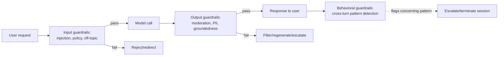

# Guardrails

[sec-01](sec-01-prompt-injection.md) covered one specific threat and its specific defenses. This chapter generalizes: **guardrails** are the systematic set of checks placed around a model call — before it, after it, or continuously across a conversation — that catch what the model itself doesn't reliably catch on its own, whether that's an injection attempt, a policy violation, a hallucinated claim, or output that's simply off-brand. The organizing idea is architectural: guardrails are a layer in the request path with real latency and cost, sitting in explicit relationship to the other layers this module and the evaluation module have already built, not a separate safety bolt-on.

## Intuition: the model is one layer, not the whole system

A model call, by itself, has no memory of policy, no external verification of factual claims, and no guaranteed adherence to instructions under adversarial pressure — all properties this curriculum has established piece by piece ([fnd-09](../01-foundations/fnd-09-known-limitations.md)'s shallows, [sec-01](sec-01-prompt-injection.md)'s injection surface). Guardrails accept this as given and build the missing structure *around* the model rather than expecting the model to provide it internally. The practical consequence: a production system's actual safety and quality posture is the composition of the model's behavior *and* everything checking it — and the checking layer is engineered with the same rigor as any other production component, including its own latency budget and its own failure modes.

## The guardrail taxonomy

**Input guardrails** run before the model call, screening the request itself: detecting injection attempts ([sec-01](sec-01-prompt-injection.md)), off-topic requests a support bot shouldn't engage with, or content violating usage policy before spending a single token generating a response. Cheapest to run relative to the alternative of generating first and discarding — an input guardrail that rejects fast saves the entire downstream generation cost.

**Output guardrails** run after generation, before the response reaches the user: content moderation for harmful output,[^openai-moderation] PII leakage detection ([sec-03](sec-03-privacy-compliance.md)), factual-groundedness checks against retrieved context ([evl-03](../05-evaluation/evl-03-llm-as-judge.md)'s judge machinery applied inline rather than offline), format or schema validation. This is where most of a guardrail system's value concentrates, because it's the last checkpoint before the user sees anything.

**Behavioral / conversational guardrails** operate across a multi-turn interaction rather than a single call — detecting a conversation drifting toward a jailbreak across several turns of gradual escalation, or a pattern of requests that's benign individually but concerning in aggregate. These are the hardest to implement well because they require state across turns, not just a per-call check, and they're the layer most systems skip first under time pressure despite being where the more sophisticated attacks actually live.

*Where each guardrail layer sits in the request path:*

## Implementation approaches

**Rule-based checks** — regex, keyword lists, schema validators — are fast, cheap, deterministic, and auditable, but brittle against anything not explicitly anticipated; they're the right tool for well-defined, narrow checks (does this output parse as valid JSON, does this contain a credit card number pattern) and the wrong tool for anything requiring judgment.

**Classifier models** — small, purpose-trained models for a specific detection task (toxicity, PII, topic relevance) — trade some of rule-based checks' speed and determinism for the ability to generalize beyond exact patterns, at the cost of needing their own training data, their own evaluation, and their own drift monitoring, essentially a small ML system nested inside the larger one.

**LLM-as-judge guardrails** — using a model call to evaluate another model call's output against a policy or rubric, the same technique [evl-03](../05-evaluation/evl-03-llm-as-judge.md) developed for offline evaluation, applied inline in the request path. Most flexible and most expensive: it adds a second model call's worth of latency and cost to every guarded request, and inherits the judge's own calibration and consistency limitations, which is exactly why [evl-03](../05-evaluation/evl-03-llm-as-judge.md)'s calibration discipline matters here too, not just for offline eval.

**The three approaches compose by cost and precision**: rule-based checks run first and cheapest, catching the unambiguous cases; classifiers run next, catching the moderate-ambiguity cases at moderate cost; LLM-judge checks run last and only when needed, reserved for genuinely ambiguous cases where the cost is justified by the stakes.

## The latency and cost budget

The point this chapter insists on that a purely conceptual treatment would skip: **every guardrail layer adds latency and cost to every guarded request**, and a naive "add every check to every request" design can double or triple response time for no benefit on the overwhelming majority of requests that were never going to be a problem. The engineering discipline is tiering: cheap, fast, high-recall checks run on everything; expensive, high-precision checks run only on what the cheap layer flags as ambiguous — the same cascade structure [prd-05](../06-production/prd-05-cost-engineering.md) built for cost, applied here to guardrail latency specifically. A production system's guardrail stack should be able to state, for a given request, exactly which checks ran and why, with a defensible latency budget for each.

## Guardrails are probabilistic, not a wall

The framing this chapter shares with [sec-01](sec-01-prompt-injection.md): a guardrail reduces the probability of a bad outcome reaching the user; it does not guarantee zero bad outcomes. A rule-based check misses anything outside its pattern; a classifier misses anything outside its training distribution; an LLM judge inherits the judged model's own blind spots and can itself be manipulated by adversarial input crafted specifically to evade it. **The correct mental model is defense in depth composed with [prd-04](../06-production/prd-04-reliability.md)'s fallback machinery**: guardrails reduce the rate of bad outcomes reaching production; monitoring and fallback handle what gets through; and honest communication about residual risk — never "guaranteed safe" — is itself part of the guardrail system's design, not a caveat appended after the fact.

## Production engineering perspective

- **Tier checks by cost**: rule-based and classifier checks on everything, LLM-judge checks reserved for cases the cheaper layers flag as ambiguous.
- **Instrument every guardrail decision** — what triggered, what layer, what action taken — feeding the same tracing infrastructure [evl-04](../05-evaluation/evl-04-tracing-observability.md) built generally, so guardrail behavior is auditable and its false-positive/false-negative rates are measurable over time, not assumed.
- **Set an explicit latency budget per layer** and measure against it; a guardrail stack that silently doubles P99 latency is a reliability regression [prd-04](../06-production/prd-04-reliability.md) would flag if it were watching this specific cause.
- **Version and eval-gate guardrail changes** the same way [evl-06](../05-evaluation/evl-06-ci-for-llm-apps.md) gates prompt and model changes — a guardrail rule change is a behavior change with the same regression risk.
- **Build behavioral/cross-turn guardrails deliberately**, not as an afterthought — they're the layer most attacks specifically route around single-turn defenses to exploit.
- **Fail toward the safer default** when a guardrail check itself errors or times out — reject or degrade, not silently pass through unchecked.
- **Report guardrail effectiveness with real numbers** (catch rate on a red-team suite, false-positive rate on legitimate traffic) rather than qualitative confidence.

## Historical evolution

**2022–2023:** early guardrails are almost entirely rule-based keyword and regex filters, ported directly from earlier-generation content moderation systems, with high false-positive rates on legitimate requests that merely contained a flagged word. **2023:** provider moderation APIs formalize classifier-based content screening as an accessible, purpose-built layer,[^openai-moderation] reducing reliance on brittle keyword lists. **2023:** the NeMo Guardrails toolkit and similar frameworks formalize the input/output/behavioral taxonomy and introduce programmable, composable guardrail flows as a first-class application-layer concept rather than an ad hoc filter bolted onto a chat endpoint.[^nvidia-nemo-guardrails] **2023–2024:** LLM-as-judge guardrails emerge as [evl-03](../05-evaluation/evl-03-llm-as-judge.md)'s offline-evaluation technique gets applied inline, trading latency for flexibility on genuinely ambiguous cases rule-based and classifier layers can't handle. **2024–present:** the field converges on tiered, cost-aware guardrail architectures — cheap checks on everything, expensive checks reserved for flagged ambiguity — as a direct consequence of teams discovering that naive "run every check on every request" designs were unsustainable at production latency and cost budgets.

## Common misconceptions

- **"Guardrails make the system safe."** They reduce the rate of bad outcomes; they don't eliminate them. The honest framing throughout this module is probabilistic risk reduction.
- **"More guardrail layers is always better."** Every layer adds latency and cost to every request; untiered, exhaustive checking is a real reliability and cost regression, not free safety.
- **"A keyword filter and an LLM judge are interchangeable choices."** They trade off cost, latency, precision, and generalization very differently — the right choice depends on the specific check, not a blanket preference.
- **"Guardrails only need to check output."** Input guardrails save the cost of generating a response that was always going to be rejected, and behavioral guardrails catch multi-turn patterns neither input nor output checks on a single call can see.
- **"If a guardrail check fails to run, just let the request through."** That's the wrong failure default — a guardrail system should fail toward the safer action (reject or degrade), the same closed-vs-open failure design choice made everywhere else in security engineering.

## Failure modes and trade-offs

- **Untiered, exhaustive checking** — every request pays every layer's latency and cost regardless of need. *Fix:* cascade cheap-to-expensive, reserving costly checks for flagged ambiguity.
- **Guardrails as an unmeasured black box** — no tracking of what triggers, how often, with what accuracy — makes the system's actual safety posture unknowable. *Fix:* instrument every decision, report catch and false-positive rates against a red-team suite.
- **Fail-open on guardrail error** — a timed-out or errored check silently passes the request through unchecked. *Fix:* fail toward the safer default.
- **Single-turn tunnel vision** — no behavioral/cross-turn layer, missing attacks specifically designed to escalate gradually across a conversation. *Fix:* deliberate cross-turn state tracking, not just per-call checks.
- **The central trade-off:** precision versus latency versus cost. A guardrail stack tuned for maximum catch rate on every request is also the slowest and most expensive; the resolution is tiering by risk and ambiguity, not maximizing any one dimension uniformly.

## Best practices

- Build the input/output/behavioral taxonomy deliberately, not just output filtering as an afterthought.
- Tier checks by cost: rules and classifiers on everything, LLM-judge checks reserved for flagged ambiguity.
- Instrument every guardrail decision for auditability and ongoing accuracy measurement.
- Set and monitor an explicit latency budget per guardrail layer.
- Eval-gate guardrail changes the same way prompt and model changes are gated.
- Fail toward the safer default on guardrail-check errors, never fail-open.
- Report guardrail effectiveness with measured catch and false-positive rates, not assumed confidence.
- Invest deliberately in behavioral/cross-turn guardrails — the layer most commonly skipped and most commonly exploited.

## Real-world examples

**The tiered stack that stayed fast.** A support assistant runs a cheap regex/classifier input check on every request (roughly 5ms), escalating to a full LLM-judge groundedness check only on the ~8% of responses the classifier flags as potentially ungrounded. Median latency stays close to baseline; the expensive check runs where it's actually needed. A team that instead ran the LLM-judge check on every response would have added a full second model call's latency to 100% of traffic for a benefit realized on less than a tenth of it.

**The fail-open guardrail.** A PII-detection output guardrail occasionally times out under load, and the original implementation passes the response through unchecked on timeout rather than rejecting it — a fail-open default that seemed reasonable during low-traffic testing and became a live PII leak path during a traffic spike. Switching the default to fail-closed (reject and regenerate, or serve a generic fallback, on guardrail timeout) closes the gap at the cost of a small, measured increase in user-facing failure rate during peak load — a trade the team judges clearly correct once the alternative is named explicitly.

**The behavioral guardrail that caught what per-call checks missed.** Individually, each message in a multi-turn conversation passes every input and output guardrail — none contains an obvious injection or policy violation. Across the conversation, though, the pattern is a gradual, turn-by-turn escalation clearly aimed at extracting the system prompt piece by piece. A cross-turn behavioral check tracking cumulative "system-prompt-probing" signal across the session flags and terminates the conversation at turn six, a pattern no single-call guardrail was positioned to see.

## Interview questions

1. **"Design a guardrail architecture for a customer-facing support agent. What layers, and why?"** — Model answer: input guardrails first — a cheap classifier catching off-topic and clearly policy-violating requests before spending generation cost; output guardrails after generation — PII detection, groundedness against retrieved context, and content moderation; and a behavioral layer tracking cross-turn patterns like gradual system-prompt probing that no single-call check would catch. I'd tier implementation by cost: rules and classifiers on every request, an LLM-judge groundedness check reserved for responses the cheaper classifier flags as ambiguous, to keep latency bounded on the vast majority of traffic that was never a problem.

2. **"What's the trade-off between rule-based, classifier-based, and LLM-judge guardrails?"** — Model answer: rules are fast, cheap, deterministic, and auditable but brittle against anything outside their exact pattern — good for narrow, well-defined checks like schema validation. Classifiers generalize better at moderate cost but need their own training data and drift monitoring — a small ML system nested inside the larger one. LLM-judge checks are the most flexible and most expensive, adding a full model call's latency and inheriting the judge's own calibration limitations — reserved for genuinely ambiguous cases where the stakes justify the cost. They compose as a cost-tiered cascade rather than a single choice.

3. **"Why should a guardrail check fail closed rather than fail open?"** — Model answer: a guardrail that silently passes requests through unchecked when it errors or times out defeats its own purpose exactly when it's under stress — often correlated with the traffic spikes or adversarial conditions where it matters most. Failing toward the safer default — reject, regenerate, or degrade — costs some user-facing failure rate but keeps the safety property intact; that trade should be made explicitly and measured, not left as an accidental default from under-tested error-handling code.

4. **"Why is a purely output-focused guardrail stack insufficient?"** — Model answer: it misses two things an input guardrail and a behavioral guardrail catch respectively. Input guardrails save the generation cost of a response that was always going to be rejected — pure output filtering pays that cost on every request regardless. And behavioral guardrails catch multi-turn patterns, like gradual escalation toward extracting a system prompt, that are invisible to any single-call check because no individual message in the pattern looks problematic on its own.

5. **"How would you measure whether your guardrail stack is actually working?"** — Model answer: instrument every guardrail decision — what triggered, which layer, what action taken — feeding the same tracing infrastructure used for general observability, and report catch rate against a red-teamed adversarial test suite alongside false-positive rate on legitimate production traffic. "It hasn't caused a visible incident" isn't evidence of effectiveness; I'd want a measured number for both dimensions, tracked over time the same way evl-06 gates other behavior changes, since a guardrail rule change is itself a behavior change with regression risk.

## Exercises and mini-project

**Exercises**

1. Design the tiered guardrail cascade for a document-QA system: what runs on every request, what's reserved for ambiguous cases, and what triggers escalation from one tier to the next?
2. Explain why a purely rule-based PII filter would both over- and under-catch, with a concrete example of each failure.
3. Design a behavioral guardrail that detects gradual system-prompt extraction across multiple turns — what signal would you track, and what threshold would trigger termination?
4. Given a guardrail latency budget of 50ms added P50, allocate it across input, output, and behavioral checks and justify the split.
5. Write the fail-closed behavior for an output guardrail that times out, and state the user-facing trade-off it accepts.

**Mini-project: build a tiered guardrail stack.** On your capstone: (a) implement at least one input guardrail (rule-based or classifier) and one output guardrail; (b) tier at least one of them — a cheap check that escalates to a more expensive check only on ambiguous cases; (c) instrument every guardrail decision (triggered/not, layer, latency) into a log or trace; (d) measure latency added per layer against your baseline response time; (e) run a small red-team suite (reuse [sec-01](sec-01-prompt-injection.md)'s payloads if applicable) and report catch rate alongside false-positive rate on a set of legitimate requests. Target: 3 hours. Success criterion: a guardrail stack with a measured catch rate, a measured false-positive rate, and a measured latency cost — not a stack you merely believe works.

**Capstone extension:** this chapter's architecture generalizes [sec-01](sec-01-prompt-injection.md)'s injection-specific defenses; its cost tiering follows [prd-05](../06-production/prd-05-cost-engineering.md)'s cascade pattern; its fail-closed discipline mirrors [prd-04](../06-production/prd-04-reliability.md)'s reliability posture; and [sec-04](sec-04-red-teaming.md) turns the mini-project's ad hoc testing into a standing measurement practice.

## Revision summary

- Guardrails are a systematic, tiered layer around the model call, not a single defense — the model is one component of the system's actual safety posture, not the whole of it.
- Three-part taxonomy: **input** guardrails (before generation, save cost on rejects), **output** guardrails (after generation, where most value concentrates), **behavioral/cross-turn** guardrails (catch multi-turn patterns invisible to any single-call check, and the layer most commonly skipped).
- Three implementation approaches — **rule-based** (fast, brittle), **classifier** (generalizes, needs its own ML lifecycle), **LLM-judge** (most flexible, most expensive) — compose as a cost-tiered cascade rather than a single choice.
- Every layer has a real **latency and cost budget**; untiered exhaustive checking is a reliability regression, not free safety.
- Guardrails are **probabilistic risk reduction**, composed with monitoring and fallback ([prd-04](../06-production/prd-04-reliability.md)) — never framed as a guarantee, and should **fail toward the safer default** on internal error.

## Flashcards

| Q | A |
|---|---|
| Three guardrail layers? | Input (pre-generation), output (post-generation), behavioral (cross-turn). |
| Why do input guardrails matter beyond safety? | They save the full generation cost on requests that were always going to be rejected. |
| Rule vs. classifier vs. LLM-judge guardrails? | Rules: fast/brittle. Classifiers: generalize, own ML lifecycle. LLM-judge: most flexible, most expensive, adds a full model call. |
| How should the three compose? | Cost-tiered cascade — cheap checks on everything, expensive checks reserved for flagged ambiguity. |
| What's the correct failure default on guardrail error? | Fail closed (reject/degrade) — never silently pass through unchecked. |
| Why are behavioral guardrails hardest and most skipped? | They need cross-turn state, not just per-call checks — and they catch attacks specifically designed to route around single-turn defenses. |
| The honest framing of guardrail effectiveness? | Probabilistic risk reduction, measured by catch rate and false-positive rate — never "guaranteed safe." |

## Further reading

- **Papers:** NeMo Guardrails[^nvidia-nemo-guardrails] — the toolkit that formalized the input/output/behavioral taxonomy as programmable flows.
- **Official docs:** OpenAI's Moderation API[^openai-moderation] and Anthropic's guardrail-strengthening guide[^anthropic-guardrails] — concrete, current implementation references.
- **Tutorials:** build the mini-project's tiered cascade before reading further frameworks — the latency-budget trade-off is best understood by measuring it on your own system.

## Check your understanding

1. Explain the input/output/behavioral guardrail taxonomy and give a concrete example of each for a system you know.
2. Design a cost-tiered guardrail cascade and justify which checks run on every request versus only on flagged ambiguity.
3. Argue for fail-closed over fail-open guardrail error handling, including the trade-off it accepts.
4. Explain why a behavioral guardrail can catch what neither input nor output guardrails can, with a concrete multi-turn example.
5. Design the measurement plan you'd use to report a guardrail stack's actual effectiveness to a stakeholder, honestly.

## Sources

[^nvidia-nemo-guardrails]: [T2] Rebedea et al. (2023). "NeMo Guardrails: A Toolkit for Controllable and Safe LLM Applications." arXiv:2310.10501. https://arxiv.org/abs/2310.10501 (accessed 2026-07-15)
[^openai-moderation]: [T1] OpenAI. "Moderation." https://platform.openai.com/docs/guides/moderation (accessed 2026-07-15)
[^anthropic-guardrails]: [T1] Anthropic. "Increase output consistency and reduce harmful outputs." https://docs.anthropic.com/en/docs/test-and-evaluate/strengthen-guardrails (accessed 2026-07-15)
