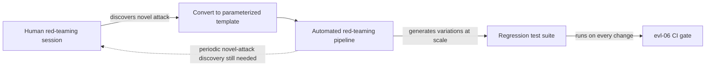

# Red Teaming

[sec-01](sec-01-prompt-injection.md)'s mini-project asked you to hand-craft a handful of injection payloads and see what got through. This chapter turns that one-off exercise into a standing practice: **red teaming** is the systematic, adversarial search for inputs that break a system's guardrails, safety properties, or intended behavior, done deliberately and continuously rather than incidentally during normal QA. The organizing idea, carried directly from [evl-02](../05-evaluation/evl-02-eval-datasets.md), is that a red-teaming finding is worthless if it's discovered once and forgotten — its value is realized only when it becomes a permanent regression test that runs on every future change, exactly the way [evl-02](../05-evaluation/evl-02-eval-datasets.md) built eval datasets to accumulate rather than to be used once and discarded.

## Intuition: normal testing checks what you expect; red teaming checks what you didn't

Ordinary QA and the eval suites built in Module 5 validate behavior against expected inputs and known failure modes — they're built by people trying to make the system work. Red teaming inverts the posture: it's done by someone (or something) actively trying to make the system fail, exploring the input space specifically for cases the builders didn't anticipate. **This adversarial posture is what finds the failure modes normal testing structurally can't**, because normal testing is written from the same mental model that built the system, and a system's blind spots are, by definition, invisible from inside that mental model. A red team's job is to bring a different mental model — an attacker's — to bear on the same system.

## The attack taxonomy

**Direct and indirect prompt injection** ([sec-01](sec-01-prompt-injection.md)) — the most systematically studied category, and the natural starting point for any red-teaming program given how well-developed its payload taxonomy already is.

**Jailbreaking** — getting a model to violate its intended behavioral constraints through role-play framing, hypothetical scenarios, gradual escalation across turns, encoding tricks (base64, unusual formatting, foreign-language framing), or many-shot examples that shift the model's apparent context of what's acceptable.[^perez-redteam] Distinct from injection in that jailbreaking doesn't necessarily involve untrusted external content — it's the user themselves probing the model's own trained constraints directly.

**Data extraction attempts** — probing for system-prompt leakage, training-data memorization, or exposure of other users' data through a multi-tenant system's retrieval or context boundaries (connecting directly to [sec-03](sec-03-privacy-compliance.md)'s access-control failures) — testing whether the system reveals something it was designed to keep private.

**Harmful content generation** — probing whether the system can be induced to produce content the safety policy explicitly prohibits (instructions for harm, disallowed categories per the product's specific policy), tested against the product's own stated policy boundaries rather than a generic standard, since what's "harmful" is scoped to context (a security-research tool has a different appropriate boundary than a children's education product).

**Bias and fairness probes** — testing for systematically different treatment across protected characteristics or demographic groups embedded in otherwise-similar prompts, a category that benefits particularly from automated, large-scale testing since bias effects are often statistical rather than visible in any single example.

**Denial-of-service and resource-exhaustion attacks** — crafted inputs designed to maximize cost or latency (extremely long contexts, prompts engineered to trigger maximum-length generations, patterns that defeat caching) — a category connecting directly to [prd-05](../06-production/prd-05-cost-engineering.md)'s cost-attribution and [prd-04](../06-production/prd-04-reliability.md)'s capacity-exhaustion failure mode, now framed as something an adversary can trigger deliberately rather than only occurring organically under load.

## Human versus automated red teaming

**Human red teamers** bring creativity, contextual judgment, and the ability to chain multiple weak signals into a genuinely novel attack — the category of finding automated approaches most reliably miss, because it requires exactly the kind of lateral, context-aware reasoning current automated tooling doesn't replicate well. They're also expensive and slow relative to their coverage, which makes human red-teaming time a scarce resource best spent on genuinely novel scenarios and complex, multi-step attack chains rather than on the kind of testing that scales trivially.

**Automated red teaming** — using another LLM to generate adversarial prompts at scale, sometimes optimized via search or gradient-based methods against the target system's actual responses[^perez-redteam] — trades some of human red-teaming's creativity for massive scale and repeatability, making it well suited to breadth (systematically exploring known attack pattern variations, running at every CI cycle) rather than depth (discovering an attack category nobody has thought of yet).

**The two are complementary, not substitutable, and combine in a specific division of labor**: human red-teaming sessions run periodically to discover genuinely novel attack categories and complex chains; every finding from those sessions gets converted into an automated, parameterized test template; that template runs continuously via the automated pipeline, covering variations at a scale no human session could sustain. Automated red teaming without periodic human sessions plateaus at whatever attack patterns were already known when the automation was built; human red teaming without automated conversion rediscovers (or fails to rediscover) the same findings repeatedly instead of accumulating protection.

*The division of labor between human and automated red teaming, and how a finding becomes permanent protection:*

## From finding to permanent protection

The step this chapter insists on, directly extending [evl-02](../05-evaluation/evl-02-eval-datasets.md)'s core discipline: **every red-teaming finding that reveals a real gap must be converted into a labeled example in the standing eval/regression dataset**, not filed as a one-off bug report and closed. This is the mechanism that makes red teaming compound in value over time rather than resetting to zero after each session — the same accumulation principle [evl-02](../05-evaluation/evl-02-eval-datasets.md) established for eval datasets generally, applied specifically to adversarial examples.

Concretely: a successful attack payload becomes a test case with an expected (safe) behavior; that test case runs in the same CI gate [evl-06](../05-evaluation/evl-06-ci-for-llm-apps.md) built for quality regressions, so a future prompt or model change that reintroduces the vulnerability is caught automatically, before shipping, rather than requiring the same manual red-teaming discovery to happen twice.

## Continuous practice, not a launch gate

Red teaming done once before launch answers "was this safe at launch," a question with a shrinking half-life the moment the system, the underlying model, or the threat landscape changes — any of which invalidates a point-in-time assessment. **Mature practice runs red teaming on a cadence** (a scheduled session, not just triggered by major changes), **after every significant model or prompt version bump** (treating it the same way [prd-06](../06-production/prd-06-deployment-infrastructure.md) treats a version bump as a reviewed deployment event, with red-teaming as part of that review), and **continuously via the automated pipeline** feeding the regression suite on every CI run. This is the same "monitoring, not a one-time check" posture [prd-04](../06-production/prd-04-reliability.md) established for reliability generally, applied here to the adversarial-robustness dimension specifically.

## Production engineering perspective

- **Build the attack taxonomy explicitly** for your specific system — not every category applies with equal severity to every product, and prioritization should follow the system's actual tool access and data sensitivity.
- **Run human red-teaming sessions periodically**, reserved for novel-attack discovery and complex multi-step chains — the category automated tooling doesn't reliably find.
- **Convert every real finding into a permanent regression test**, feeding the same CI gate that catches quality regressions ([evl-06](../05-evaluation/evl-06-ci-for-llm-apps.md)) — a finding that isn't converted is a finding that will need rediscovering.
- **Run automated red teaming continuously**, generating variations of known attack patterns at CI scale.
- **Trigger a red-teaming pass on every significant version bump**, per [prd-06](../06-production/prd-06-deployment-infrastructure.md)'s deployment-review discipline, not just at initial launch.
- **Scope severity and disclosure practice to context** — an internal tool and a public-facing product carry different obligations for how findings are handled and communicated, and a responsible-disclosure process matters if external researchers report findings.
- **Report red-teaming coverage and results with real numbers** (attack categories tested, catch rate, findings converted to regression tests) — the same measured-effectiveness discipline [sec-02](sec-02-guardrails.md) applied to guardrails generally.

## Historical evolution

**2022:** Anthropic's early red-teaming research formalizes systematic, taxonomy-driven adversarial testing of language models as a distinct research and engineering discipline, moving beyond ad hoc "try to break it" sessions toward a structured methodology with documented findings.[^anthropic-redteam] **2022–2023:** automated red-teaming research demonstrates that one language model can generate adversarial prompts against another at meaningful scale, establishing the automated half of the human/automated division this chapter describes.[^perez-redteam] **2023:** as production LLM applications proliferate, red-teaming practice extends from "test the base model's safety behavior" to "test the full application" — including retrieval pipelines, tool access, and multi-turn conversation state, tracking directly with the expansion of what production systems actually do. **2023–2024:** major providers formalize external and network-based red-teaming programs, recognizing that internal red-teaming alone under-samples the diversity of adversarial creativity available from a broader pool of testers.[^openai-redteam] **2024–present:** the discipline converges on continuous practice — periodic human sessions feeding an automated regression pipeline gated into CI — as the field internalizes that a point-in-time safety assessment has a short half-life against systems, models, and threat landscapes that all keep changing.

## Common misconceptions

- **"We red-teamed before launch, so we're covered."** Point-in-time findings degrade the moment the model, prompt, or threat landscape changes — mature practice treats it as continuous, not a launch gate.
- **"Automated red teaming replaces human red teaming."** Automated approaches excel at scale and repeatability of known patterns; they reliably miss the genuinely novel, multi-step attacks human creativity finds. Neither substitutes for the other.
- **"A red-teaming finding that got fixed doesn't need to become a test."** Without converting it to a permanent regression test, the same vulnerability can silently reappear on a future prompt or model change with no automatic detection.
- **"Red teaming is the same activity as general QA."** QA validates expected behavior against expected inputs; red teaming adopts an adversarial posture specifically to find what the builders' own mental model didn't anticipate — a structurally different exercise.
- **"Only public-facing products need red teaming."** Internal tools with real data access or tool permissions carry real risk too — the severity and disclosure process may differ, but the practice still applies.

## Failure modes and trade-offs

- **Findings that don't become regression tests** — the same vulnerability reappears on a later change, requiring rediscovery. *Fix:* every real finding becomes a labeled test case in the standing suite, gated into CI.
- **Automated-only red teaming** — plateaus at whatever attack patterns were known when the automation was built, missing genuinely novel attack categories. *Fix:* periodic human sessions specifically tasked with novel-attack discovery.
- **Pre-launch-only red teaming** — a point-in-time assessment with a shrinking half-life against a changing model, prompt, and threat landscape. *Fix:* cadence-based sessions plus a red-teaming pass on every significant version bump.
- **Generic attack taxonomy applied uniformly** — testing categories with no regard for the system's actual tool access and data sensitivity wastes effort on low-relevance categories while under-testing high-relevance ones. *Fix:* prioritize the taxonomy against the specific system's actual risk profile.
- **The central trade-off:** coverage versus cost. Exhaustive human red-teaming of every attack category on every change is not economically sustainable; the resolution is the human/automated division of labor, spending scarce human creativity on novel discovery and automated scale on everything already known.

## Best practices

- Build an attack taxonomy scoped to your system's actual tool access and data sensitivity, not a generic checklist applied uniformly.
- Run periodic human red-teaming sessions dedicated to novel-attack and multi-step-chain discovery.
- Run automated red teaming continuously, generating variations of known patterns at CI scale.
- Convert every real finding into a permanent, labeled regression test feeding the CI eval gate.
- Trigger a red-teaming pass on every significant model or prompt version bump, as part of the deployment review.
- Scope severity assessment and disclosure process to the system's actual context and stakes.
- Report coverage and effectiveness with real numbers, not qualitative confidence.
- Treat red teaming as continuous practice, never a completed, one-time checkbox.

## Real-world examples

**The finding that became permanent protection.** A human red-teaming session discovers a multi-turn jailbreak that gradually reframes a harmful request as a fictional scenario across several exchanges, evading single-turn guardrails ([sec-02](sec-02-guardrails.md)) entirely. The team converts the successful attack sequence into a parameterized test template, generating dozens of topical variations via the automated pipeline, and gates all of them into the CI eval suite. Six months later, a prompt change intended to make the assistant more helpful with creative writing accidentally reopens a narrow version of the same gap — caught immediately by the regression suite before it ever reached production, because the original finding had been converted rather than merely fixed once.

**The automated-only program that plateaued.** A team builds an automated red-teaming pipeline early and relies on it exclusively for a year, watching its catch rate on known attack categories stay stable and near-perfect — reasonably concluding, incorrectly, that their safety posture was solid. An external researcher reports a genuinely novel attack chain the automated system had no template for and was never going to generate, since it was only ever varying patterns it already knew. The fix is process, not code: a quarterly human red-teaming session dedicated specifically to novel-attack discovery, seeding the automated pipeline with new templates on an ongoing basis rather than only once at the start.

**The version bump that needed re-testing.** A routine model version bump — handled correctly per [prd-06](../06-production/prd-06-deployment-infrastructure.md)'s canary discipline for quality — passes the standard eval gate cleanly, but a red-teaming pass triggered as part of the same deployment review finds that several previously-blocked jailbreak patterns now succeed against the new model version, which has subtly different behavior under adversarial framing than its predecessor. The version bump is held pending a guardrail adjustment, avoiding a safety regression that a quality-only eval gate would never have caught, because quality and adversarial robustness are different axes measured by different tests.

## Interview questions

1. **"What's the difference between red teaming and normal QA?"** — Model answer: normal QA and eval suites validate behavior against expected inputs, built from the same mental model that built the system — so they're structurally unlikely to find the system's own blind spots. Red teaming adopts an adversarial posture deliberately, bringing an attacker's mental model to the same system specifically to find what the builders didn't anticipate. It's a different exercise with a different goal, not a more thorough version of the same testing.

2. **"How would you divide labor between human and automated red teaming?"** — Model answer: human red-teaming time is scarce and best spent on genuinely novel attack discovery and complex multi-step chains — the category automated approaches reliably miss because it requires contextual, lateral reasoning current tooling doesn't replicate well. Automated red teaming is best spent on scale and repeatability — generating variations of already-known attack patterns continuously, at CI cadence. The two connect: every human-discovered finding gets converted into a template the automated pipeline can vary and run continuously, so human creativity compounds into automated coverage instead of being spent once.

3. **"Why does a red-teaming finding need to become a regression test, not just a bug fix?"** — Model answer: without converting it into a labeled test case in the standing eval suite, the same vulnerability can silently reappear on a future prompt or model change with no automatic detection — someone has to rediscover it, possibly after it's already shipped. Converting it into a test gated into the same CI pipeline evl-06 uses for quality regressions makes the protection permanent and automatic, which is the entire value of red teaming compounding over time rather than resetting after each session.

4. **"Why isn't pre-launch red teaming sufficient?"** — Model answer: it answers "was this safe at that point in time," and that assessment's half-life shrinks the moment the model, the prompt, or the threat landscape changes — any of which can reopen a previously-closed gap or introduce a new one. Mature practice runs red teaming on a schedule, after every significant version bump as part of the deployment review, and continuously through the automated pipeline — the same "monitoring, not a one-time check" posture reliability engineering applies to quality and uptime, applied here to adversarial robustness.

5. **"A version bump passes your quality eval gate cleanly. Do you still need to red-team it?"** — Model answer: yes — quality and adversarial robustness are different axes measured by different tests, and a model that performs identically or better on quality metrics can behave quite differently under adversarial framing, since that's not what the quality eval suite was designed to probe. Treating a version bump as a deployment event under prd-06's discipline means the red-teaming pass is part of the same review, not an optional extra contingent on the quality gate already having passed.

## Exercises and mini-project

**Exercises**

1. Build an attack taxonomy prioritized for a hypothetical system: a coding assistant with file-system write access. Which categories matter most, and why?
2. Design the conversion process turning a successful jailbreak payload into a permanent regression test — what does the test case need to specify?
3. Explain why a multi-turn, gradually-escalating jailbreak might evade a single-turn guardrail check, connecting to sec-02's behavioral guardrail layer.
4. Design a cadence for red-teaming a production system: what triggers an ad hoc session versus a scheduled one?
5. Draft a lightweight responsible-disclosure process for a product that might receive external red-teaming reports.

**Mini-project: build a red-teaming pipeline for your capstone.** On your capstone: (a) build an attack taxonomy scoped to your system's actual tool access and data handling, prioritizing the two or three most relevant categories; (b) run a focused human red-teaming pass against those categories, documenting every payload tried and its outcome; (c) for every finding that reveals a real gap, convert it into a labeled test case with expected safe behavior; (d) add those test cases to your eval suite from evl-02/evl-06 so they run in your CI gate; (e) if time allows, use an LLM to generate a handful of automated variations of your strongest finding and test whether they also succeed, to see the automated-scale half of the practice firsthand. Target: 4 hours. Success criterion: at least one real finding, converted into a regression test now gated into your CI pipeline, that would catch a reintroduction of the same gap.

**Capstone extension:** this chapter operationalizes [sec-01](sec-01-prompt-injection.md)'s and [sec-02](sec-02-guardrails.md)'s ad hoc testing into a standing practice; findings feed [evl-02](../05-evaluation/evl-02-eval-datasets.md)'s dataset accumulation and [evl-06](../05-evaluation/evl-06-ci-for-llm-apps.md)'s CI gate; deployment-triggered red-teaming connects to [prd-06](../06-production/prd-06-deployment-infrastructure.md)'s version-bump review.

## Revision summary

- Red teaming is adversarial-posture testing — deliberately trying to break the system, finding what the builders' own mental model couldn't anticipate — structurally distinct from normal QA.
- Attack taxonomy: injection ([sec-01](sec-01-prompt-injection.md)), jailbreaking, data extraction, harmful content generation, bias/fairness probes, and denial-of-service/resource-exhaustion attacks.
- **Human red teaming** finds genuinely novel, multi-step attacks; **automated red teaming** scales known patterns continuously — complementary, not substitutable, connected by converting every human finding into an automated template.
- **Every real finding must become a permanent, labeled regression test** gated into the same CI pipeline as quality regressions ([evl-06](../05-evaluation/evl-06-ci-for-llm-apps.md)) — this is what makes red teaming compound in value instead of resetting each session.
- Red teaming is **continuous**: scheduled human sessions, an always-running automated pipeline, and a dedicated pass on every significant model or prompt version bump — never a completed, pre-launch-only checkbox.

## Flashcards

| Q | A |
|---|---|
| How does red teaming differ from normal QA? | Adversarial posture specifically seeking what the builders' own mental model didn't anticipate, vs. validating expected behavior. |
| Six attack taxonomy categories? | Injection, jailbreaking, data extraction, harmful content, bias/fairness, denial-of-service/resource exhaustion. |
| Human vs. automated red teaming strengths? | Human: novel, multi-step attacks. Automated: scale and repeatability of known patterns. |
| How do human findings become automated coverage? | Converted into parameterized templates the automated pipeline varies and runs continuously. |
| Why must a finding become a regression test? | Without conversion, the same vulnerability can silently reappear on a future change with no automatic detection. |
| Why isn't pre-launch red teaming sufficient? | Point-in-time assessment; half-life shrinks as model, prompt, and threat landscape change. |
| When should a dedicated red-teaming pass be triggered? | On every significant model or prompt version bump, as part of the deployment review — not just at launch. |

## Further reading

- **Papers:** Anthropic's foundational red-teaming methodology[^anthropic-redteam] and Perez et al.'s automated LM-red-teaming-LM approach[^perez-redteam] — the human and automated halves of this chapter's division of labor, from source.
- **Official docs:** OpenAI's external red-teaming network overview[^openai-redteam] — a concrete example of a production external-red-teaming program.
- **Tutorials:** run the mini-project's conversion step (finding → regression test → CI gate) before reading further — the compounding-value argument is best understood by watching a test actually catch a reintroduced bug.

## Check your understanding

1. Explain why red teaming is structurally different from normal QA, not just a more adversarial version of it.
2. Design the attack taxonomy priority order for a system you know, justified by its actual tool access and data sensitivity.
3. Walk through the full lifecycle of a red-teaming finding, from discovery to permanent regression-test protection.
4. Explain why automated red teaming alone plateaus, and what a periodic human session adds.
5. Argue for when a red-teaming pass should be triggered beyond initial launch, and why a clean quality-eval-gate pass isn't sufficient on its own.

## Sources

[^anthropic-redteam]: [T1] Ganguli et al. (2022). "Red Teaming Language Models to Reduce Harms: Methods, Scaling Behaviors, and Lessons Learned." arXiv:2209.07858. https://arxiv.org/abs/2209.07858 (accessed 2026-07-17)
[^perez-redteam]: [T2] Perez et al. (2022). "Red Teaming Language Models with Language Models." arXiv:2202.03286. https://arxiv.org/abs/2202.03286 (accessed 2026-07-17)
[^openai-redteam]: [T1] OpenAI. "OpenAI's approach to external red teaming." https://openai.com/index/red-teaming-network/ (accessed 2026-07-17)
