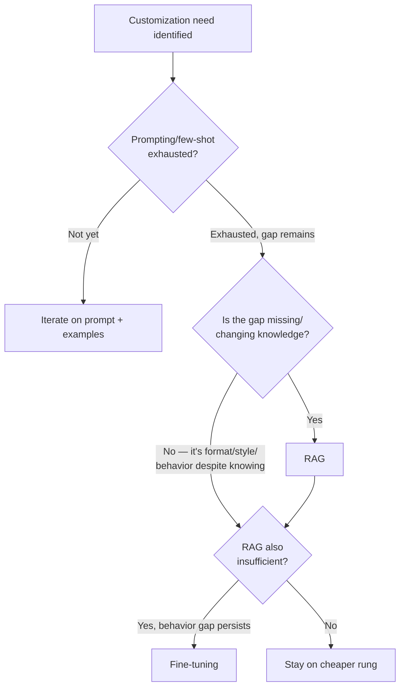

# The Customization Decision

Module 8 is about fine-tuning — how to do it, what it costs, when it works. This first chapter is about the decision that should happen *before* any of that: **should you fine-tune at all**, or does a cheaper, faster, more maintainable technique already solve the actual problem. The uncomfortable truth this chapter opens with is that most teams reaching for fine-tuning haven't exhausted the alternatives, and the ones that eventually do fine-tune successfully are usually the ones who tried and specifically ruled out the cheaper options first, not the ones who jumped straight to it because it sounded like the "real" solution.

## Intuition: fine-tuning changes weights; almost everything else changes context

Every customization technique below fine-tuning on the ladder — prompting, few-shot examples, RAG — works by changing what the model *sees* at inference time, leaving the weights untouched. Fine-tuning is different in kind: it changes the weights themselves, which is a fundamentally more expensive, slower-to-iterate, and harder-to-debug operation than anything that just changes context. **The asymmetry matters because most customization problems are actually about missing or poorly-structured context, not about the model's underlying behavior being wrong** — and fine-tuning is the wrong tool for a context problem, expensive in exactly the ways prompting and RAG are cheap.

## The customization ladder

**Prompting and few-shot examples** are the cheapest rung: instructions and demonstrations placed directly in context, iterated in seconds, requiring no training infrastructure at all. [api-02](../02-llm-apis/api-02-prompting-fundamentals.md) established the ceiling on how far this goes — a well-engineered prompt with good examples solves a surprisingly large fraction of customization problems people initially assume need fine-tuning, and it's always worth exhausting first because the iteration loop is nearly instant and the cost is nearly zero.

**RAG** ([rag-01](../03-retrieval/rag-01-what-is-rag.md) through [rag-08](../03-retrieval/rag-08-rag-frontiers.md)) is the next rung: injecting relevant external knowledge into context at inference time, retrieved dynamically per query.[^lewis-rag] This is the right tool specifically for a **knowledge problem** — the model doesn't have the information it needs, and that information changes over time or is too large to fit in a static prompt. RAG's defining advantage for this decision is that the knowledge stays current without retraining: update the index, and the next query sees the update immediately, a property no fine-tuned model can match without a full retraining cycle.

**Fine-tuning** ([ftn-02](ftn-02-fine-tuning-methods.md) onward) sits at the top of the ladder, and it's the right tool specifically for a **behavior problem**: the model has the requisite knowledge or capability but doesn't produce output in the right *format*, *style*, *tone*, or doesn't reliably follow a narrow, specialized task pattern despite prompting and examples being exhausted. Fine-tuning teaches the model to do something differently, not to know something new — which is precisely why it's the wrong tool when the actual gap is missing information.

*The decision ladder, moving to a more expensive rung only when the cheaper one demonstrably fails to close the gap:*

## The symptom pattern that actually indicates fine-tuning

The diagnostic question this chapter centers, because it's the one most teams skip: **is the failure a knowledge gap or a behavior gap?** A model that confidently gives wrong or outdated information has a knowledge gap — more context (RAG) fixes it. A model that has the right information available (even stated plainly in the prompt) but still won't produce the required output format, consistently drifts in tone, or fails at a narrow specialized task pattern despite explicit instructions and examples has a behavior gap — this is fine-tuning's actual territory.

**A useful test before committing to fine-tuning**: can you get the desired behavior with a sufficiently long, carefully constructed few-shot prompt, even if that prompt is impractically expensive to run on every request? If yes, the model *can* do it — the problem is getting it to do so reliably and cheaply, which is a genuine fine-tuning use case (baking the pattern into weights removes the need to pay for the long prompt every call, connecting directly to [prd-05](../06-production/prd-05-cost-engineering.md)'s cost engineering). If no — if the model genuinely cannot produce the desired behavior even with extensive demonstration — that's a stronger signal fine-tuning is needed to actually teach a new capability, and a signal worth weighing against whether a larger or different base model might simply already have that capability without any training at all.

## The total cost of ownership fine-tuning actually carries

This is the part of the decision most optimistic estimates skip, and the reason the ladder above is worth climbing carefully rather than jumping.

**Data cost.** Fine-tuning needs a labeled dataset built to the standard [ftn-03](ftn-03-data-for-fine-tuning.md) will develop in depth — and building that dataset well is often the single largest cost in a fine-tuning project, larger than the actual training compute, a fact that surprises teams who budget for GPU time and treat data collection as an afterthought.

**Iteration cost.** A prompt change is testable in seconds; a fine-tuning run is testable in hours to days, depending on data size and infrastructure — which means the entire feedback loop for improving a fine-tuned model's behavior is dramatically slower than for a prompted one, and mistakes discovered late in that loop are expensive to fix.

**Maintenance cost, the most commonly underestimated.** A fine-tuned model is now a versioned artifact your team owns: when the underlying base model improves (a new model generation ships), the fine-tuned model doesn't automatically inherit that improvement — someone has to decide whether to re-fine-tune on the new base, re-validate the fine-tuned behavior still holds, and manage the resulting proliferation of model versions, each with its own eval history. This is a standing organizational commitment, not a one-time project cost, and it should be weighed against RAG's comparatively low maintenance burden (update the index; the underlying model can be swapped more freely since behavior isn't baked into weights).

## Production engineering perspective

- **Exhaust prompting and few-shot examples first**, always — the cost asymmetry alone justifies ruling this out before considering anything more expensive.
- **Diagnose knowledge gap versus behavior gap explicitly** before choosing between RAG and fine-tuning — this single distinction resolves most of the ambiguity in the decision.
- **Use the long-prompt test**: if a sufficiently detailed prompt achieves the behavior even impractically, fine-tuning is a legitimate cost-optimization; if it doesn't, weigh whether a different base model might simply have the needed capability before committing to training.
- **Budget for data collection as the primary cost**, not training compute — and weigh it against [ftn-03](ftn-03-data-for-fine-tuning.md)'s data-quality bar before estimating project cost.
- **Treat a fine-tuned model as a standing maintenance commitment**, not a one-time deliverable — plan for base-model upgrade cycles and re-validation from the start.
- **Consider combining techniques**: fine-tuning for consistent format/behavior plus RAG for current knowledge is a common, legitimate combination, not an either-or choice.
- **Revisit the decision as base models improve** — a fine-tuning need from a year ago may be solvable by prompting a newer, more capable base model today, which is exactly the kind of periodic reassessment [api-06](../02-llm-apis/api-06-model-selection.md) already recommends for model selection generally.

## Historical evolution

**2020–2022:** fine-tuning is the default customization technique for pre-ChatGPT-era language models, largely because prompting-based instruction-following was far less capable and few-shot prompting far less reliable than it later became — fine-tuning wasn't a considered choice on a ladder, it was close to the only option. **2022–2023:** as instruction-tuned, RLHF-aligned models ([sec-05](../07-safety-security/sec-05-alignment-for-engineers.md)) dramatically improve zero-shot and few-shot prompting quality, and RAG matures into a standard architecture pattern,[^lewis-rag] the customization ladder as described in this chapter emerges — prompting and RAG close most of what previously required fine-tuning, and fine-tuning's territory narrows to genuine behavior-shaping needs. **2023–2024:** teams that had jumped straight to fine-tuning discover, often expensively, that a RAG-solvable knowledge problem doesn't stay solved by a fine-tuned model as facts change — driving the knowledge-versus-behavior diagnostic into standard practice. **2024–present:** with base model capability continuing to improve and RAG techniques maturing further ([rag-08](../03-retrieval/rag-08-rag-frontiers.md)), the fine-tuning decision has become more conservative across the field — a considered last resort after cheaper rungs are genuinely exhausted, rather than a default reach, precisely because the cost of climbing the ladder unnecessarily is now well understood.

## Common misconceptions

- **"Fine-tuning is how you add knowledge to a model."** Fine-tuning teaches behavior, not facts reliably — RAG is the tool for adding or updating knowledge, and fine-tuning on facts risks unreliable recall and staleness the moment the facts change.
- **"Fine-tuning is always better than prompting because it's more 'real' customization."** It's a different tool with a different cost profile, not a strictly superior one — most customization problems are solved more cheaply and more maintainably by prompting or RAG.
- **"Once fine-tuned, the model is done — no more work needed."** A fine-tuned model is a standing maintenance commitment: base-model upgrades, re-validation, and version management are ongoing costs, not one-time.
- **"If prompting doesn't work, fine-tuning will."** Only if the gap is actually a behavior gap. A knowledge gap that prompting can't close (because the prompt can't fit or doesn't have current information) needs RAG, not fine-tuning, and fine-tuning won't fix it either.
- **"Fine-tuning and RAG are mutually exclusive choices."** They're frequently combined — fine-tuning for consistent format or task behavior, RAG for the current, external knowledge the task needs.

## Failure modes and trade-offs

- **Jumping to fine-tuning without exhausting prompting** — the most common and most costly mistake, paying training cost and maintenance burden for a problem a better prompt would have solved in an afternoon. *Fix:* the ladder, climbed in order.
- **Fine-tuning to add knowledge instead of using RAG** — produces a model with unreliable, potentially hallucinated recall of facts that go stale the moment they change, requiring retraining to update. *Fix:* diagnose knowledge versus behavior explicitly before choosing.
- **Underestimating data-collection cost** — budgeting for training compute while data collection turns out to be the actual majority cost. *Fix:* treat data cost as the primary line item from the start ([ftn-03](ftn-03-data-for-fine-tuning.md)).
- **Treating fine-tuning as a one-time project** — no plan for base-model upgrade cycles, leaving a fine-tuned model stranded on an aging base while newer models improve around it. *Fix:* budget maintenance as a standing commitment, not a sunk project cost.
- **The central trade-off:** iteration speed versus behavior reliability. Prompting iterates in seconds but can't reliably bake in a narrow behavior pattern at scale without cost; fine-tuning bakes the behavior in reliably and cheaply per-call but costs a dramatically slower iteration loop and standing maintenance — the ladder exists to spend that trade-off only where it's actually needed.

## Best practices

- Always exhaust prompting and few-shot examples before considering RAG or fine-tuning.
- Diagnose the gap explicitly as knowledge or behavior before choosing between RAG and fine-tuning.
- Apply the long-prompt test: if extensive few-shot prompting achieves the behavior even impractically, fine-tuning is a legitimate cost optimization rather than a capability gamble.
- Budget fine-tuning projects around data-collection cost as the primary expense, not training compute.
- Plan for standing maintenance — base-model upgrade cycles, re-validation, version proliferation — from the start of any fine-tuning decision.
- Consider fine-tuning and RAG together rather than as an either-or choice when both a behavior gap and a knowledge gap exist.
- Revisit fine-tuning decisions periodically as base model capability improves — yesterday's fine-tuning need may be today's prompting solution.

## Real-world examples

**The fine-tuning project that a prompt fixed in an afternoon.** A team plans a multi-week fine-tuning project to get consistent structured-output formatting from their model, budgeting for data collection and training infrastructure. Before starting, an engineer tries a more carefully constructed system prompt with three well-chosen few-shot examples of the exact desired format — and it closes the formatting gap completely on their eval suite. The fine-tuning project is cancelled; the actual fix cost an afternoon of prompt iteration.

**The knowledge problem fine-tuning made worse.** A team fine-tunes a model on their product documentation, hoping to bake in current product knowledge. Three months later, the product changes significantly, and the fine-tuned model confidently describes the old behavior as current — because the facts were baked into weights at training time and have no mechanism to update short of a full retraining run. Migrating to a RAG architecture over the same documentation, kept current by re-indexing on every documentation update, solves both the staleness problem and the confident-wrong-answer problem RAG grounding directly addresses.

**The combined approach that used each tool correctly.** A legal-document assistant needs both a very specific, consistent output structure (a behavior requirement) and access to a large, frequently updated corpus of case law (a knowledge requirement). The team fine-tunes a model specifically on the output-structure task using a modest, well-curated dataset of correctly formatted examples, while serving the actual case-law content through a RAG pipeline the fine-tuned model consumes at inference time — using each rung of the ladder for the problem it's actually suited to, rather than forcing one technique to cover both needs.

## Interview questions

1. **"How would you decide whether a customization problem needs fine-tuning or RAG?"** — Model answer: I'd diagnose whether the gap is knowledge or behavior. If the model lacks information or that information changes over time, that's a knowledge gap — RAG is the right tool, since it can update by re-indexing without retraining. If the model has the necessary information but won't reliably produce the right format, tone, or narrow task pattern despite prompting and examples, that's a behavior gap — fine-tuning's actual territory. I'd also apply a long-prompt test: if an impractically long few-shot prompt achieves the behavior, fine-tuning is a legitimate cost optimization rather than teaching a genuinely new capability.

2. **"Why might fine-tuning be the wrong choice for adding new knowledge to a model?"** — Model answer: because facts baked into weights at training time don't update without a full retraining cycle, and the model's recall of trained-in facts isn't fully reliable even immediately after training — it can still hallucinate or misstate. RAG solves both problems: retrieval happens per query against a current index, so an update to the underlying documents is visible on the very next query, and the model's answer is grounded in retrieved text rather than relying purely on trained-in recall.

3. **"What costs does a fine-tuning project typically underestimate?"** — Model answer: two, mainly. Data-collection cost is usually the actual majority expense, not the training compute most initial budgets focus on — building a fine-tuning dataset to a usable quality bar is substantial work. And maintenance cost is the more commonly missed one entirely: a fine-tuned model is a standing artifact that doesn't automatically inherit improvements when the base model gets upgraded, so someone has to decide whether and when to re-fine-tune, re-validate, and manage the resulting version proliferation — an ongoing organizational commitment, not a one-time project cost.

4. **"When would you combine fine-tuning and RAG rather than choosing one?"** — Model answer: when a system genuinely has both a behavior requirement and a knowledge requirement — for example, a task needing a very specific, consistent output structure fine-tuning is well suited to teach, combined with access to a large, frequently changing knowledge base RAG is well suited to serve. Using each technique for the problem it's actually suited to, rather than stretching one to cover both, is usually both cheaper and more maintainable than trying to fine-tune knowledge in or prompt behavior consistency into place.

5. **"A team wants to fine-tune because prompting 'feels less robust.' How would you respond?"** — Model answer: I'd want a concrete failure case first — what specifically is the prompted model getting wrong, and is that a knowledge gap or a behavior gap? "Feels less robust" without a diagnosed failure mode isn't a strong basis for committing to fine-tuning's much higher cost and maintenance burden. If a specific behavior gap does exist and survives the long-prompt test, that's a legitimate case — but the diagnosis has to come before the decision, not as a post-hoc justification for a tool the team already wanted to use.

## Exercises and mini-project

**Exercises**

1. Given a scenario where a support bot gives outdated pricing information, diagnose whether the fix is RAG, fine-tuning, or prompting, and justify your answer.
2. Design the long-prompt test for a hypothetical structured-extraction task — what would the impractically-long prompt look like, and what would passing versus failing it tell you?
3. List three costs a naive fine-tuning budget would miss, and estimate their relative size for a hypothetical project.
4. Design a scenario where fine-tuning and RAG are legitimately combined, and specify what each technique is responsible for.
5. Argue for or against fine-tuning for a specific customization need in a system you know, using the knowledge-versus-behavior diagnostic explicitly.

**Mini-project: run the decision framework on a real need.** Pick a customization problem — real, from your capstone, or a plausible scenario: (a) diagnose it explicitly as a knowledge gap, a behavior gap, or both; (b) attempt the cheapest applicable fix first (a better prompt, or a RAG pass if you have retrieval infrastructure) and measure whether it closes the gap; (c) if it doesn't, apply the long-prompt test and record the result; (d) write a one-page decision memo: what you tried, what worked or didn't, and whether fine-tuning is actually justified — including an honest estimate of the data-collection and maintenance cost you'd be signing up for. Target: 2 hours. Success criterion: a decision memo that either closes the gap with a cheaper technique, or makes a specific, evidence-based case for fine-tuning rather than a default assumption.

**Capstone extension:** this chapter's ladder builds directly on [api-02](../02-llm-apis/api-02-prompting-fundamentals.md)'s prompting ceiling and [rag-05](../03-retrieval/rag-05-rag-pipeline.md)'s RAG pipeline; the cost analysis connects to [prd-05](../06-production/prd-05-cost-engineering.md); [ftn-02](ftn-02-fine-tuning-methods.md) picks up from here once fine-tuning is the justified choice.

## Revision summary

- The customization ladder, cheapest to most expensive: **prompting/few-shot** (instant iteration, changes context only) → **RAG** (dynamic external knowledge, stays current without retraining) → **fine-tuning** (changes weights, expensive, slow iteration).
- The core diagnostic: is the gap a **knowledge problem** (RAG's territory) or a **behavior problem** — format, style, consistency despite the model having the information (fine-tuning's territory)?
- The **long-prompt test**: if an impractically long few-shot prompt achieves the behavior, fine-tuning is a legitimate cost optimization; if it can't, weigh whether a different base model has the capability before training.
- Fine-tuning's total cost of ownership is usually underestimated on two fronts: **data collection** (often the largest line item, larger than training compute) and **standing maintenance** (base-model upgrade cycles, re-validation, version proliferation — an ongoing commitment, not a one-time cost).
- Fine-tuning and RAG are frequently **combined**, not mutually exclusive — each used for the specific problem (behavior vs. knowledge) it's actually suited to.

## Flashcards

| Q | A |
|---|---|
| The customization ladder, in order? | Prompting/few-shot → RAG → fine-tuning, each rung more expensive and slower to iterate than the last. |
| What does fine-tuning change vs. everything below it? | Fine-tuning changes model weights; prompting and RAG change context at inference time only. |
| The core diagnostic question? | Is the gap a knowledge problem (RAG) or a behavior problem (fine-tuning)? |
| What is the long-prompt test? | If an impractically long few-shot prompt achieves the behavior, fine-tuning is a cost optimization, not a capability gamble. |
| Why is RAG better than fine-tuning for changing facts? | RAG updates by re-indexing, visible next query; fine-tuned facts are baked into weights and need retraining to update. |
| The most commonly underestimated fine-tuning cost? | Standing maintenance — base-model upgrade cycles, re-validation, version proliferation. |
| Are fine-tuning and RAG mutually exclusive? | No — commonly combined: fine-tuning for consistent behavior, RAG for current knowledge. |

## Further reading

- **Official docs:** OpenAI's[^openai-finetuning-guide] and Anthropic's[^anthropic-finetuning] fine-tuning guides — concrete, current guidance on when providers themselves recommend fine-tuning versus alternatives.
- **Papers:** Lewis et al. (2020)[^lewis-rag] — the foundational RAG paper, useful context for why RAG became the default knowledge-customization tool this ladder assumes.
- **Tutorials:** run the mini-project's decision framework on a real need before starting any actual fine-tuning work — the framework is more convincing applied to your own problem than read in the abstract.

## Check your understanding

1. Explain the customization ladder and why each rung is more expensive than the one before it.
2. Diagnose a given customization failure as a knowledge gap, a behavior gap, or both, and justify the technique you'd choose.
3. Walk through the long-prompt test and explain what passing versus failing it tells you about whether to fine-tune.
4. List the total-cost-of-ownership components of a fine-tuning project beyond training compute, and rank them by typical size.
5. Design a scenario where fine-tuning and RAG are legitimately combined, specifying what each technique handles.

## Sources

[^openai-finetuning-guide]: [T1] OpenAI. "Fine-tuning." https://platform.openai.com/docs/guides/fine-tuning (accessed 2026-07-19)
[^anthropic-finetuning]: [T1] Anthropic. "Fine-tuning." https://docs.anthropic.com/en/docs/build-with-claude/fine-tuning (accessed 2026-07-19)
[^lewis-rag]: [T1] Lewis et al. (2020). "Retrieval-Augmented Generation for Knowledge-Intensive NLP Tasks." arXiv:2005.11401. https://arxiv.org/abs/2005.11401 (accessed 2026-07-19)
