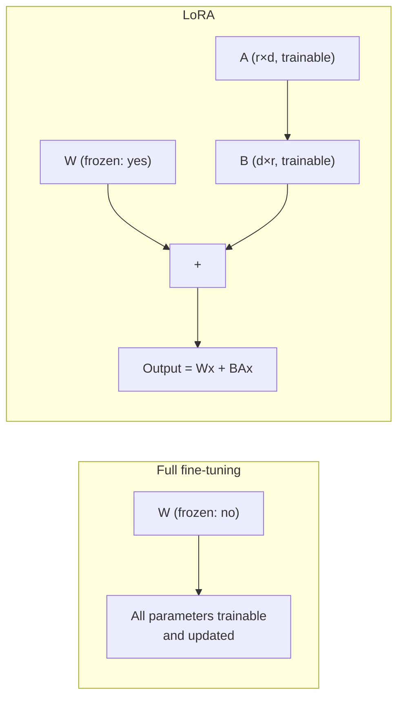

# Fine-Tuning Methods

[ftn-01](ftn-01-customization-decision.md) established when fine-tuning is the right tool. This chapter covers how it's actually done — specifically the choice between updating all of a model's weights and updating a small, cleverly-constructed subset of them, which turns out to be one of the more consequential engineering decisions in the entire process. [fnd-05](../01-foundations/fnd-05-scaling-laws.md) established that modern models have parameter counts in the tens to hundreds of billions; this chapter's central technical idea, **LoRA**, is built directly on the observation that adapting such a model to a new task doesn't require touching anywhere near that many parameters.

## Intuition: you don't need to move every weight to change behavior

Full fine-tuning updates every parameter in the model — conceptually simple, and it's what "fine-tuning" meant by default before 2021. But it requires storing gradients and optimizer state for the entire parameter count, which for a large model means GPU memory requirements many times the model's own size, and it produces a complete new copy of the model's weights for every fine-tuned variant. **The key empirical finding behind parameter-efficient fine-tuning (PEFT) is that the actual *change* needed to adapt a large pretrained model to a new task lives in a much lower-dimensional space than the model's full parameter count** — the update matrix has low "intrinsic rank," and you can capture most of the adaptation's value by learning a low-rank approximation of that update instead of the full-rank update full fine-tuning computes.[^hu-lora]

## LoRA: low-rank adaptation

**The mechanism.** For a weight matrix $W$ in the model, instead of directly updating $W$ (full fine-tuning's approach), LoRA freezes $W$ entirely and adds a parallel, trainable low-rank decomposition: $\Delta W = BA$, where $B$ and $A$ are much smaller matrices whose product approximates the update $W$ would have needed. If $W$ is a $d \times d$ matrix, $A$ is $r \times d$ and $B$ is $d \times r$, with rank $r$ chosen far smaller than $d$ — so the number of trainable parameters scales with $r$, not with $d^2$, often reducing trainable parameters by orders of magnitude relative to full fine-tuning of the same layer.[^hu-lora]

**Why this works at all.** It rests on the intrinsic-rank finding above: the *useful* adaptation signal for most downstream tasks doesn't require full-rank freedom to express, so a low-rank approximation captures most of the value at a small fraction of the parameter and memory cost. This isn't true for every possible adaptation — a task requiring the model to learn something genuinely far from its pretrained distribution may need more rank, or more layers targeted, than a narrower stylistic or format adaptation — which is exactly why rank is a hyperparameter to tune rather than a fixed constant.

**Where LoRA is applied.** Typically to the attention layers' projection matrices (query, key, value, output projections) rather than every weight matrix in the model, since empirically most of the useful adaptation signal concentrates there — though which modules to target is itself a tunable choice, and extending LoRA to feed-forward layers can help for adaptations that need more capacity than attention-only targeting provides.

*Full fine-tuning versus LoRA — the same adaptation, radically different trainable-parameter footprint:*

## QLoRA: quantization plus low-rank adaptation

**QLoRA** combines LoRA with quantizing the frozen base model's weights to 4-bit precision, dramatically reducing the memory footprint of the base model itself — which, recall, is frozen and not being trained — while keeping the small trainable LoRA matrices in higher precision.[^dettmers-qlora] This is the mechanism that made fine-tuning very large models feasible on consumer or single-GPU hardware: since the frozen base weights dominate memory usage and never need gradient computation, quantizing them (the same quantization technique [prd-03](../06-production/prd-03-inference-optimization.md) covered for inference, applied here to training) shrinks the dominant memory cost while the actual learning happens in a small number of full-precision trainable parameters.

The engineering trade-off: quantization introduces some precision loss in the frozen weights' forward pass, and QLoRA's specific technical contributions (a new 4-bit data type calibrated for typically-normally-distributed neural network weights, and careful handling of quantization error) are what keep that loss small enough not to meaningfully hurt the final adapted model's quality — a nontrivial engineering achievement that's the actual substance of the QLoRA paper beyond "quantize and apply LoRA."

## Hyperparameters that actually matter

**Rank ($r$).** The dimensionality of the low-rank decomposition — larger rank means more trainable parameters and more expressive capacity to capture the needed adaptation, at proportionally higher cost. Practically, rank is tuned empirically against the specific task's complexity: a narrow stylistic adaptation often needs surprisingly small rank; a task requiring the model to learn a genuinely new structured behavior may need more.

**Alpha.** A scaling factor applied to the LoRA update before it's added to the frozen weights, controlling how strongly the adapted behavior is weighted relative to the base model's original behavior — the ratio of alpha to rank is often the more meaningful tuning knob than either value in isolation, since it determines the effective learning-rate-like scale of the adaptation.

**Target modules.** Which weight matrices in the model receive a LoRA adapter — attention projections only, or also feed-forward layers — trading more targeted (cheaper, faster, less forgetting risk) against more comprehensive (more expressive, more capacity for the adaptation) coverage.

**Learning rate and training duration.** Carried over from general neural-network training practice, but worth naming here because fine-tuning's much smaller trainable-parameter count and much smaller dataset (relative to pretraining) mean the learning-rate and epoch-count sensitivity is different — overtraining on a small fine-tuning dataset is a fast, easy way to reach the failure mode below.

## Catastrophic forgetting: the risk every method trades off differently

**Catastrophic forgetting** is when adapting a model to a new task degrades its performance on tasks it previously handled well — a well-documented phenomenon in neural network training generally, not unique to LLMs, where learning a new task can overwrite the weight configuration that supported prior capability.[^kirkpatrick-catastrophic] For LLM fine-tuning specifically, this shows up as a model that becomes excellent at the narrow fine-tuned task while measurably regressing on general capability, instruction-following quality, or even the base model's alignment properties from [sec-05](../07-safety-security/sec-05-alignment-for-engineers.md) — a regression that's easy to miss if your eval suite only measures the target task and never re-checks general capability.

**LoRA's structure offers a partial, mechanistic mitigation**: because the base weights $W$ are frozen and untouched, the original model's full capability is still latently present in $W$ — the adaptation is additive rather than overwriting, which structurally limits (though doesn't eliminate) how much the base capability can degrade, compared to full fine-tuning where every weight, including the ones responsible for general capability, is directly updated and can drift arbitrarily far from its pretrained values. This is a genuine practical advantage of LoRA beyond its memory savings, and it's part of why PEFT methods are the default choice for most fine-tuning projects today rather than merely a memory-constrained fallback.

**The mitigation is not immunity.** A LoRA adapter with high rank, aggressive alpha, and extensive training on a narrow dataset can still meaningfully shift model behavior away from general capability, because the *output* the frozen weights and the adapter jointly produce is what the model actually generates — freezing $W$ limits how the *weights* can drift, not how far the *behavior* can shift. The only reliable defense, regardless of method, is evaluating for forgetting explicitly: run the fine-tuned model against a general-capability eval suite, not just the target-task suite, before and after training, and treat a measured regression as a real cost to weigh against the target-task gain.

## Production engineering perspective

- **Default to LoRA or QLoRA over full fine-tuning** for the large majority of production fine-tuning projects — the memory savings, faster iteration, and partial forgetting mitigation typically outweigh full fine-tuning's marginally higher ceiling on adaptation expressiveness.
- **Reserve full fine-tuning for cases with strong evidence PEFT's capacity is insufficient** — a genuinely large, diverse fine-tuning dataset teaching substantially new structured behavior, tested against PEFT first rather than assumed.
- **Tune rank and alpha empirically against the specific task**, starting from published reasonable defaults and adjusting based on eval results rather than guessing at the outset.
- **Evaluate for catastrophic forgetting explicitly** — run a general-capability eval suite alongside the target-task suite, both before and after fine-tuning, and treat regression as a real cost.
- **Keep LoRA adapters as small, swappable artifacts** — one of the practical production advantages of PEFT is that a LoRA adapter is a small file relative to a full model checkpoint, making it cheap to store, version, and swap between multiple task-specific adapters against the same frozen base.
- **Budget QLoRA's quantization trade-off deliberately** — it's usually a worthwhile trade for training feasibility on constrained hardware, but it's a real, measurable precision cost worth checking against your eval suite, not an assumed-free optimization.

## Historical evolution

**Pre-2021:** full fine-tuning is the default and effectively only widely-used method for adapting pretrained language models, requiring the memory and compute footprint of training the entire model, which limits fine-tuning to teams with substantial GPU infrastructure. **2021:** the LoRA paper demonstrates that a low-rank decomposition of the weight update captures most of the adaptation's value at a small fraction of the trainable-parameter count, launching parameter-efficient fine-tuning as a practical, widely-adopted alternative rather than a theoretical curiosity.[^hu-lora] **2023:** QLoRA extends this further by quantizing the frozen base model to 4-bit precision, making fine-tuning of very large models feasible on dramatically less GPU memory — often single-consumer-GPU feasible for models that previously required substantial multi-GPU infrastructure to fine-tune at all.[^dettmers-qlora] **2023–2024:** as PEFT methods mature, catastrophic forgetting evaluation becomes standard practice, driven by enough teams discovering post-hoc that a task-optimized fine-tuned model had quietly regressed on general capability or safety properties their target-task eval suite never checked. **2024–present:** LoRA and QLoRA are the default fine-tuning approach across the field for the overwhelming majority of use cases, with full fine-tuning reserved for cases with specific, tested evidence that PEFT's capacity is genuinely insufficient — a significant shift in default practice from the pre-2021 baseline.

## Common misconceptions

- **"LoRA is a worse, cheaper substitute for full fine-tuning."** For most tasks it captures nearly all of full fine-tuning's adaptation value at a fraction of the cost, and its frozen-base structure gives it a genuine forgetting-mitigation advantage full fine-tuning doesn't have — it's a different, often better default, not merely a budget compromise.
- **"QLoRA quantization always meaningfully hurts quality."** QLoRA's specific technical contributions are designed to keep quantization-induced precision loss small; it's a real, measurable trade-off worth checking, but not one that assumes significant quality loss by default.
- **"Freezing the base weights in LoRA means the model can't forget."** It limits how far the weights themselves drift, but the model's *behavior* still emerges from the frozen weights and adapter jointly, and can still shift meaningfully — forgetting mitigation is partial, not immunity, and needs explicit evaluation regardless.
- **"Higher rank is always better."** Higher rank means more capacity and more cost; for many tasks a smaller rank captures the needed adaptation fully, and unnecessarily high rank just adds training cost and, potentially, more room for unwanted drift.
- **"Fine-tuning method choice doesn't matter much — they all converge to similar results."** Memory footprint, iteration speed, forgetting risk, and artifact size differ substantially between full fine-tuning and PEFT methods — the choice has real, measurable production consequences.

## Failure modes and trade-offs

- **Choosing full fine-tuning by default without testing PEFT first** — pays a much higher memory and iteration cost for adaptation expressiveness the task may not have actually needed. *Fix:* default to LoRA/QLoRA, escalate to full fine-tuning only with tested evidence of insufficient capacity.
- **Overtraining a LoRA adapter on a small dataset** — a small trainable-parameter count doesn't eliminate overfitting risk, especially with too many epochs on limited data. *Fix:* monitor both target-task and general-capability eval curves during training, not just target-task loss.
- **Never evaluating for catastrophic forgetting** — the target-task eval suite alone can't detect a general-capability regression it was never designed to measure. *Fix:* explicit before/after general-capability eval as a standing part of the fine-tuning workflow.
- **Assuming QLoRA's quantization is free** — a real precision cost that should be checked against the eval suite, not assumed negligible by default. *Fix:* measure, don't assume.
- **The central trade-off:** expressiveness versus cost and forgetting risk. Full fine-tuning has the highest ceiling on adaptation expressiveness but the highest memory cost, slowest iteration, and least structural forgetting protection; LoRA/QLoRA trade a small amount of ceiling for large gains on all three — the right choice for the overwhelming majority of real tasks, tested rather than assumed for the rest.

## Best practices

- Default to LoRA or QLoRA for new fine-tuning projects; reserve full fine-tuning for tested, evidenced capacity shortfalls.
- Tune rank and alpha empirically against the specific task, starting from reasonable defaults and adjusting via eval results.
- Evaluate for catastrophic forgetting explicitly with a general-capability suite run before and after training, alongside the target-task suite.
- Keep LoRA adapters as small, versioned, swappable artifacts against a shared frozen base for multi-task deployments.
- Measure QLoRA's quantization-induced precision cost against your eval suite rather than assuming it's negligible.
- Watch for overfitting on small fine-tuning datasets — a small trainable-parameter count doesn't eliminate the risk.
- Document rank, alpha, target modules, and training duration as part of the fine-tuned artifact's version metadata, connecting to [prd-06](../06-production/prd-06-deployment-infrastructure.md)'s version-pinning discipline for any deployed fine-tuned model.

## Real-world examples

**The LoRA adapter that matched full fine-tuning at a fraction of the cost.** A team fine-tunes a model for a narrow structured-extraction task, first with full fine-tuning as a baseline, then with LoRA at a modest rank targeting attention layers. The LoRA-adapted model matches the full fine-tuning baseline's target-task performance within a small margin, at a fraction of the training memory and roughly an order of magnitude smaller artifact size — validating the intrinsic-rank hypothesis directly for their specific task, and becoming their default going forward.

**The forgetting regression caught only by explicit re-evaluation.** A team fine-tunes a model heavily on a narrow customer-support task, achieving excellent target-task metrics. Only when a separate general-capability eval suite is run — almost as an afterthought — do they discover the fine-tuned model has measurably regressed on unrelated instruction-following and even shows a higher rate of the sycophancy tendency [sec-05](../07-safety-security/sec-05-alignment-for-engineers.md) described, likely from aggressive training on a narrow, repetitive dataset. Reducing training epochs and lowering the alpha scaling factor recovers most of the general-capability score while retaining most of the target-task gain — a trade-off they could only navigate because they measured both sides.

**QLoRA making training feasible on available hardware.** A team without access to multi-GPU infrastructure needs to fine-tune a large model; full fine-tuning's memory requirements are infeasible on their available single-GPU setup. QLoRA — quantizing the frozen base to 4-bit while training LoRA adapters in higher precision — brings the memory footprint within reach, and a quality check against their eval suite shows the quantization-induced precision loss is small enough not to matter for their target task, making a project that was infeasible on their hardware budget straightforwardly achievable.

## Interview questions

1. **"Explain how LoRA works and why it's effective despite training far fewer parameters than full fine-tuning."** — Model answer: LoRA freezes the pretrained weight matrix and adds a parallel, trainable low-rank decomposition — two much smaller matrices whose product approximates the update the task actually needs. It works because the useful adaptation signal for most downstream tasks has low intrinsic rank — it doesn't need the full expressive freedom of a full-rank update to be captured well — so a low-rank approximation gets most of the adaptation's value at a small fraction of the trainable-parameter count and memory footprint.

2. **"What does QLoRA add on top of LoRA, and why does it matter?"** — Model answer: QLoRA quantizes the frozen base model's weights to 4-bit precision while keeping the trainable LoRA matrices in higher precision, dramatically cutting the memory footprint of the dominant cost — the frozen base — since it's never touched by gradients anyway. It matters because it makes fine-tuning very large models feasible on much more modest hardware, at a small, carefully-managed precision cost the QLoRA paper's specific technical contributions are designed to keep from meaningfully hurting quality.

3. **"Does LoRA solve catastrophic forgetting?"** — Model answer: it partially mitigates it, structurally — because the base weights are frozen rather than directly updated, the model's original capability is still latently present in those weights, which limits how far the weights themselves can drift compared to full fine-tuning. But it's not immunity: the model's actual behavior emerges from the frozen weights and the adapter jointly, and a high-rank, aggressively-trained adapter can still meaningfully shift behavior away from general capability. The only reliable check is explicit evaluation — running a general-capability suite before and after fine-tuning, not just the target-task suite.

4. **"How would you choose the rank for a LoRA fine-tuning project?"** — Model answer: empirically, starting from a reasonable published default and tuning based on eval results rather than guessing. A narrower, more stylistic adaptation often needs surprisingly low rank; a task requiring the model to learn a more substantially new structured behavior may need more. I'd also weigh rank against target-module coverage — sometimes extending which layers get an adapter matters more than increasing rank on a narrower set of layers — and check the target-task gain against any general-capability regression at each setting, not just target-task loss in isolation.

5. **"When would you choose full fine-tuning over LoRA?"** — Model answer: only with tested evidence that PEFT's capacity is genuinely insufficient for the task — for instance, a large, diverse dataset teaching the model a substantially new structured capability that a reasonably-tuned LoRA setup measurably fails to capture. I wouldn't default to full fine-tuning based on an assumption that "more parameters trainable is always better" — it costs significantly more in memory and iteration speed and offers less structural forgetting protection, and for the majority of real fine-tuning tasks LoRA or QLoRA captures nearly all of the achievable value.

## Exercises and mini-project

**Exercises**

1. Explain, in your own words, why a low-rank decomposition of a weight update can capture most of a fine-tuning adaptation's value.
2. Given a task requiring narrow stylistic adaptation versus a task requiring substantially new structured behavior, argue for different rank choices for each.
3. Design the general-capability eval suite you'd run alongside a target-task eval to detect catastrophic forgetting.
4. Explain why QLoRA's memory savings come specifically from quantizing the frozen base rather than the trainable adapter.
5. Given hardware constraints (a single consumer GPU), argue for QLoRA over full fine-tuning or standard LoRA, citing the specific memory bottleneck each addresses.

**Mini-project: fine-tune with LoRA and check for forgetting.** Using an available fine-tuning framework and a small, well-scoped task (reuse a dataset from [ftn-01](ftn-01-customization-decision.md)'s decision exercise if applicable): (a) fine-tune a model with LoRA at a modest rank, targeting attention projections; (b) evaluate on your target task before and after fine-tuning, confirming measurable improvement; (c) evaluate on a small general-capability suite (a handful of unrelated instruction-following prompts) before and after, checking for regression; (d) if you observe forgetting, try reducing rank, alpha, or training epochs and re-measure; (e) write a short memo reporting the target-task gain, any general-capability cost, and the hyperparameters you settled on. Target: 4 hours (plus training time). Success criterion: a measured trade-off curve — target-task gain versus general-capability cost — across at least two hyperparameter settings, not a single untested configuration.

**Capstone extension:** this chapter picks up directly from [ftn-01](ftn-01-customization-decision.md)'s decision framework; the quantization technique connects to [prd-03](../06-production/prd-03-inference-optimization.md)'s inference-time quantization; [ftn-03](ftn-03-data-for-fine-tuning.md) covers building the dataset this chapter's methods train on.

## Revision summary

- **Full fine-tuning** updates every parameter — highest expressiveness ceiling, highest memory and iteration cost, least structural forgetting protection.
- **LoRA** freezes the base weights and learns a low-rank decomposition of the needed update ($\Delta W = BA$), exploiting the empirical finding that most useful adaptations have low intrinsic rank — orders of magnitude fewer trainable parameters, small swappable artifacts, and partial forgetting mitigation from the frozen base.
- **QLoRA** adds 4-bit quantization of the frozen base on top of LoRA, dramatically cutting memory requirements and making large-model fine-tuning feasible on modest hardware, at a small, carefully-managed precision cost.
- Key hyperparameters — **rank**, **alpha**, **target modules** — are tuned empirically against the specific task's complexity, not assumed from defaults.
- **Catastrophic forgetting** is a real risk under every method; LoRA's frozen base offers structural, partial mitigation but not immunity — the only reliable defense is **explicit general-capability evaluation** before and after fine-tuning, alongside the target-task suite.

## Flashcards

| Q | A |
|---|---|
| What does LoRA freeze, and what does it train? | Freezes the base weight matrix; trains a small low-rank decomposition (BA) added in parallel. |
| Why does a low-rank update work? | Most useful task adaptations have low intrinsic rank — full-rank freedom isn't needed to capture the value. |
| What does QLoRA add over LoRA? | 4-bit quantization of the frozen base model, cutting memory footprint further while training adapters in higher precision. |
| Does LoRA eliminate catastrophic forgetting? | No — partial structural mitigation from the frozen base, not immunity; behavior can still shift meaningfully. |
| What hyperparameters matter most in LoRA? | Rank, alpha (scaling), and target modules — all tuned empirically against task complexity. |
| The only reliable defense against forgetting? | Explicit general-capability evaluation before and after fine-tuning, not just target-task metrics. |
| When is full fine-tuning justified over LoRA? | Only with tested evidence that PEFT's capacity is genuinely insufficient for the task. |

## Further reading

- **Papers:** Hu et al. (2021)[^hu-lora] and Dettmers et al. (2023)[^dettmers-qlora] — the two foundational papers this chapter is built directly on, worth reading from source for the intrinsic-rank argument and the quantization engineering respectively.
- **Papers:** Kirkpatrick et al.[^kirkpatrick-catastrophic] — the general neural-network catastrophic forgetting literature underlying this chapter's forgetting-evaluation discipline.
- **Tutorials:** run the mini-project's LoRA fine-tune-and-evaluate loop before reading further method variants — the rank/forgetting trade-off is far more concrete measured on your own task than described abstractly.

## Check your understanding

1. Explain the low-rank decomposition LoRA uses and why it captures most of full fine-tuning's adaptation value at a fraction of the parameter cost.
2. Explain what QLoRA quantizes, what it doesn't quantize, and why that specific split is what makes the memory savings work.
3. Argue for why LoRA's frozen base offers only partial forgetting protection, not immunity.
4. Design a rank/alpha tuning strategy for a task you know, and state what evidence would tell you to increase or decrease each.
5. Design the evaluation protocol you'd use to catch catastrophic forgetting that a target-task-only eval suite would miss.

## Sources

[^hu-lora]: [T1] Hu et al. (2021). "LoRA: Low-Rank Adaptation of Large Language Models." arXiv:2106.09685. https://arxiv.org/abs/2106.09685 (accessed 2026-07-20)
[^dettmers-qlora]: [T1] Dettmers et al. (2023). "QLoRA: Efficient Finetuning of Quantized LLMs." arXiv:2305.14314. https://arxiv.org/abs/2305.14314 (accessed 2026-07-20)
[^kirkpatrick-catastrophic]: [T1] Kirkpatrick et al. (2017). "Overcoming catastrophic forgetting in neural networks." arXiv:1612.00796. https://arxiv.org/abs/1612.00796 (accessed 2026-07-20)
