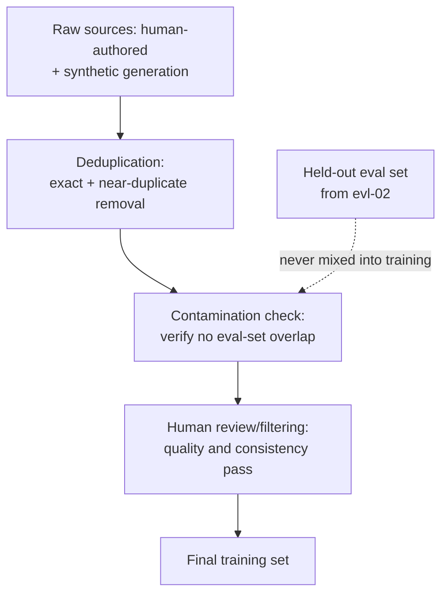

# Data for Fine-Tuning

[ftn-01](ftn-01-customization-decision.md) flagged data collection as the largest, most consistently underestimated cost in a fine-tuning project. This chapter is why: the dataset isn't a supporting artifact for fine-tuning, it *is* the fine-tuning project in most of the ways that determine success — the training method from [ftn-02](ftn-02-fine-tuning-methods.md) is close to fixed once you've chosen it, but dataset quality is where nearly all of the remaining variance in outcome actually lives. The central, counterintuitive finding this chapter builds around is that a small, carefully curated dataset routinely outperforms a much larger, noisier one — directly extending [evl-02](../05-evaluation/evl-02-eval-datasets.md)'s quality-over-quantity discipline from evaluation data into training data.

## Intuition: fine-tuning data teaches format and behavior, not facts

[ftn-02](ftn-02-fine-tuning-methods.md) established that fine-tuning is a behavior-shaping tool. That reframes what "good training data" means here: a fine-tuning example isn't primarily teaching the model a fact, it's demonstrating *the exact pattern of behavior you want reproduced* — the format, the tone, the reasoning structure, the way a task should be handled end to end. **Every example in the dataset is, in effect, a worked demonstration the model will learn to imitate the statistical pattern of** — which means an example with a subtly wrong format, an inconsistent tone, or a lazy answer teaches exactly that subtlety, at whatever scale it appears in the dataset. This is why data quality dominates: a thousand excellent, consistent demonstrations shape behavior far more reliably than ten thousand demonstrations with even a modest fraction of inconsistency mixed in.

## The quality-over-quantity finding

The **LIMA** study demonstrated something that reshaped fine-tuning data practice directly: a model fine-tuned on roughly a thousand carefully curated, high-quality, diverse instruction examples performed competitively with models fine-tuned on vastly larger, less curated instruction datasets.[^zhou-lima] The paper's core argument — captured in the "Superficial Alignment Hypothesis" — is that most of a model's knowledge and capability is already present from pretraining, and fine-tuning's job is narrower than commonly assumed: teaching the model the *format and style* in which to surface that existing capability, a task a relatively small number of excellent examples can accomplish, where a larger number of mediocre examples mostly adds noise rather than signal.

**The practical consequence for how you spend your data-collection budget**: past a certain point, adding more examples yields diminishing or even negative returns if the added examples are lower quality than the existing set, because they dilute the consistency of the pattern being demonstrated. This doesn't mean quantity never matters — a genuinely novel, structurally complex behavior likely needs more demonstrations than a narrow stylistic shift — but it does mean the default instinct to "collect as much data as possible" is usually the wrong instinct, and the LIMA finding is the concrete evidence for reallocating effort from quantity to curation.

## Synthetic data generation

**Self-Instruct** and similar techniques use a capable LLM to generate training examples — instructions and demonstrations — rather than relying entirely on human-authored data, dramatically reducing the cost and time of building a fine-tuning dataset at scale.[^wang-selfinstruct] This is now a standard, widely-used technique, and it's the direct answer to fine-tuning data collection's cost problem from [ftn-01](ftn-01-customization-decision.md) — but it inherits a specific risk that makes it not simply a free win.

**The risk is quality and diversity degradation compounding across generations.** A model generating synthetic training data reproduces its own stylistic tendencies, blind spots, and — connecting to [sec-05](../07-safety-security/sec-05-alignment-for-engineers.md)'s specification-gaming discussion — potentially its own alignment-adjacent quirks (sycophancy patterns, verbosity habits) into the generated data, which then get taught to the fine-tuned model as if they were the intended pattern rather than an artifact of the generator. Using synthetic data to fine-tune on data generated by a *closely related or identical* model risks a subtle homogenization: the fine-tuned model ends up narrower and more repetitive than either careful human curation or synthetic data drawn from a genuinely different, more diverse generation process would produce.

**The practical mitigation**: treat synthetic data as a first draft requiring human review and filtering, not a finished dataset — spot-check for the generator's specific tendencies (repeated phrasings, characteristic hedging or agreement patterns), deliberately diversify generation prompts and sampling temperature to counter homogenization, and mix synthetic data with genuine human-authored examples rather than relying on synthetic data exclusively, particularly for anything where the target behavior needs to differ from what the generating model would naturally produce.

## Data hygiene: deduplication and contamination

**Deduplication** — removing exact and near-exact duplicate examples from the training set — matters more than it initially sounds like it should, because duplicated examples don't just waste training compute, they effectively over-weight whatever pattern they contain relative to the rest of the dataset, distorting the learned distribution toward the duplicated content's specific characteristics.[^lee-dedup] This applies with particular force to synthetic data, since generation processes can produce near-duplicate examples (same underlying pattern, superficially varied wording) at a much higher rate than careful human authoring would.

**Train-eval contamination** is the failure mode that silently invalidates results rather than merely degrading them: if any example in the training set overlaps, even partially, with the evaluation set used to measure the fine-tuned model's performance, the resulting eval score is inflated and doesn't reflect genuine generalization — the model may simply be reproducing something close to memorized training content rather than demonstrating the target behavior on genuinely unseen inputs. This is the fine-tuning-specific instance of a discipline [evl-02](../05-evaluation/evl-02-eval-datasets.md) already established generally: **eval data must be held out and verified clean before training starts**, checked explicitly for overlap (exact match and near-duplicate/paraphrase match, not just exact string match) rather than assumed clean because the two datasets were built separately.

*The data pipeline, with the checkpoints that prevent quality dilution and contamination:*

## Annotation guidelines: the discipline that determines dataset quality

The practical mechanism that turns "we hired annotators" into an actually-consistent dataset, and the piece most fine-tuning projects underinvest in relative to its impact: **a written, specific annotation guideline defining exactly what a good example looks like** — the target format, the tone, edge-case handling, what to do with ambiguous inputs — reviewed and iterated *before* full-scale data collection begins, with a calibration pass checking multiple annotators' outputs against each other for consistency.

Without this, a dataset assembled from multiple contributors (human or synthetic) drifts toward inconsistency exactly where consistency matters most — a fine-tuned model trained on inconsistently-formatted examples learns the inconsistency as part of the pattern, producing inconsistent output itself. This is the direct fine-tuning-data analog of [evl-02](../05-evaluation/evl-02-eval-datasets.md)'s calibration discipline for eval labeling, applied to training data with even higher stakes, since training data doesn't just measure the model's behavior — it *becomes* the model's behavior.

## Production engineering perspective

- **Prioritize curation over volume**: a well-reviewed set in the low thousands often outperforms a much larger, unreviewed set — validate this on your own task rather than assuming volume always helps, but default to curation-first.
- **Write annotation guidelines before collecting data at scale**, with a calibration pass across contributors (human or synthetic-generation prompts) before committing to full-scale collection.
- **Treat synthetic data as a first draft**, filtered and reviewed, mixed with human-authored examples rather than used exclusively — especially where the target behavior needs to differ from the generating model's natural tendencies.
- **Deduplicate rigorously**, including near-duplicate detection, not just exact-match removal — this matters more for synthetic data than for careful human authoring.
- **Verify train-eval separation explicitly** with an overlap check (exact and near-duplicate/paraphrase), never assumed clean because the datasets were built independently.
- **Sample and manually review the final training set** before committing compute to a training run — a spot-check catching a systematic labeling error is far cheaper than discovering it after training.
- **Version the dataset itself**, alongside the model artifact ([prd-06](../06-production/prd-06-deployment-infrastructure.md)'s version-pinning discipline extended to training data) — reproducing or debugging a fine-tuned model's behavior requires knowing exactly what data produced it.

## Historical evolution

**2022:** early instruction-tuning datasets are built primarily through large-scale human annotation, at significant cost and time investment, with quality treated as somewhat secondary to scale in early practice. **2022:** Self-Instruct demonstrates that a capable LLM can generate a substantial fraction of the training examples needed for instruction tuning, dramatically lowering the cost barrier and establishing synthetic data generation as a standard technique going forward.[^wang-selfinstruct] **2023:** the LIMA study directly challenges the scale-first assumption, showing that roughly a thousand carefully curated examples could match or approach the performance of vastly larger instruction datasets — a result influential enough to shift the field's default framing from "collect as much data as possible" to "curate a smaller set carefully."[^zhou-lima] **2023–2024:** as synthetic data generation scales, the homogenization and quality-degradation risks of training on model-generated data become well documented, driving the current best practice of treating synthetic data as a reviewed first draft rather than a finished dataset. **2024–present:** data hygiene practice — deduplication, contamination checking, annotation-guideline calibration — that had been standard for pretraining-scale data curation is now applied with equal rigor to the much smaller scale of fine-tuning datasets, closing a gap where fine-tuning data had for a period received less rigorous hygiene discipline than the pretraining data feeding the same models.

## Common misconceptions

- **"More fine-tuning data is always better."** The LIMA finding directly contradicts this for a wide range of tasks — a smaller, carefully curated set often outperforms a larger, noisier one, and low-quality additions can actively hurt by diluting consistency.
- **"Synthetic data is a free, risk-free way to scale a dataset."** It inherits the generating model's stylistic tendencies and potential alignment-adjacent quirks, and can homogenize a fine-tuned model if used exclusively without review, filtering, and diversification.
- **"Deduplication is a minor cleanup step, not worth the effort."** Duplicated examples effectively over-weight their specific pattern, distorting the learned distribution — a more consequential effect than the "cleanup" framing suggests, especially for synthetic data.
- **"If the training and eval sets were built separately, they're automatically clean of contamination."** Independent construction doesn't guarantee no overlap, especially for near-duplicate or paraphrased content — an explicit overlap check is needed, not an assumption.
- **"Annotation guidelines are bureaucratic overhead for a small fine-tuning project."** They're the mechanism that determines whether a small dataset is excellent or merely small — skipping them is a common, costly shortcut that shows up as inconsistent model behavior later.

## Failure modes and trade-offs

- **Prioritizing volume over curation** — a large, noisy dataset that dilutes the consistency of the pattern being taught, producing a fine-tuned model less reliable than a smaller, cleaner set would have. *Fix:* the LIMA-informed default of curation-first, quantity only where evidenced necessary.
- **Uncritical synthetic data reliance** — homogenization and inherited generator quirks taught to the fine-tuned model as if intended. *Fix:* review, filter, diversify generation, and mix with human-authored examples.
- **Skipped deduplication** — duplicate or near-duplicate examples over-weighting specific patterns and distorting the learned distribution. *Fix:* exact and near-duplicate detection as a standard pipeline step.
- **Unchecked train-eval contamination** — an inflated eval score that doesn't reflect genuine generalization, silently invalidating the project's success metric. *Fix:* explicit overlap verification before training, covering paraphrase-level overlap, not just exact match.
- **The central trade-off:** curation effort versus dataset size. Careful curation is slow and expensive per example; scale is fast and cheap per example but risks diluting quality — the resolution, per LIMA, usually favors curation for the sizes fine-tuning actually needs, but the right balance is task-dependent and worth validating rather than assuming.

## Best practices

- Default to curation-first: a smaller, carefully reviewed dataset over a larger, unreviewed one, validated against your specific task rather than assumed universally.
- Write and calibrate annotation guidelines before full-scale data collection, whether contributors are human or synthetic-generation prompts.
- Treat synthetic data as a reviewed first draft, filtered for quality and diversified to counter homogenization, mixed with human-authored examples.
- Deduplicate rigorously, including near-duplicate detection, especially for synthetic or large-scale-generated data.
- Verify train-eval separation with an explicit overlap check before every training run, not an assumption based on independent construction.
- Manually spot-review the final training set before committing training compute.
- Version the dataset alongside the model artifact for reproducibility and debugging.

## Real-world examples

**The small dataset that outperformed the large one.** A team builds an initial fine-tuning dataset of roughly ten thousand examples scraped and lightly filtered from historical support tickets, and separately curates a much smaller set of about eight hundred examples hand-reviewed against a written annotation guideline. The model fine-tuned on the smaller, curated set outperforms the one trained on the larger set on both target-task quality and consistency metrics — the larger set's inconsistent formatting and occasional low-effort historical responses had been teaching exactly that inconsistency at scale.

**The synthetic dataset that homogenized the model.** A team generates several thousand training examples using the same model family they intend to fine-tune, without diversifying prompts or mixing in human-authored examples. The resulting fine-tuned model becomes noticeably more repetitive and stylistically narrow than intended — a close read reveals the synthetic generation had consistently produced a particular hedging phrase and sentence structure, which the fine-tuned model then reproduced at a much higher rate than desired. Diversifying the generation prompts, increasing sampling temperature, and mixing in a smaller set of human-authored examples for contrast restores the intended stylistic range.

**The contamination that inflated an eval score.** A team reports strong fine-tuning results, only to discover during a later audit that a meaningful fraction of their training examples were near-duplicates (same underlying question, lightly reworded) of examples in their held-out eval set — both had been built from an overlapping pool of source material without an explicit deduplication or overlap check. Rebuilding the eval set with a verified-clean split and re-measuring shows genuine performance noticeably lower than the original, contaminated result — a correction that changes the team's assessment of whether the fine-tuning project actually met its bar.

## Interview questions

1. **"Why does the LIMA paper's finding matter for how you'd budget a fine-tuning project?"** — Model answer: LIMA showed that roughly a thousand carefully curated examples could match much larger, less curated instruction datasets, supporting the Superficial Alignment Hypothesis that fine-tuning mostly teaches format and style rather than new knowledge, since the underlying capability is already present from pretraining. Practically, it means the default instinct to maximize data volume is usually wrong — I'd budget more effort toward careful curation and annotation-guideline consistency and less toward raw collection scale, validating that trade-off against my specific task rather than assuming it universally.

2. **"What are the risks of using synthetic data generated by an LLM for fine-tuning?"** — Model answer: the generated data inherits the generating model's stylistic tendencies, blind spots, and potentially its alignment-adjacent quirks like sycophancy or verbosity patterns, teaching them to the fine-tuned model as if they were the intended target behavior. Using data generated by a closely related model can also homogenize the fine-tuned model, making it narrower and more repetitive. The mitigation is treating synthetic output as a reviewed first draft — filtering, diversifying generation prompts and sampling, and mixing with human-authored examples rather than relying on it exclusively.

3. **"Why does deduplication matter for a fine-tuning dataset, beyond saving training compute?"** — Model answer: duplicate or near-duplicate examples effectively over-weight whatever pattern they contain relative to the rest of the dataset, distorting the learned distribution toward that pattern's specific characteristics rather than the intended balanced behavior. This matters more than raw compute savings would suggest, and it's a particular risk with synthetic data, since generation processes can produce near-duplicates — same underlying pattern, superficially reworded — at a higher rate than careful human authoring typically would.

4. **"How would you verify your training and eval sets don't overlap?"** — Model answer: I wouldn't assume independence from separate construction is sufficient — I'd run an explicit overlap check covering both exact matches and near-duplicate or paraphrase-level overlap, since contamination doesn't require identical strings to inflate an eval score. This has to happen before training starts, because contaminated training data doesn't just degrade the model, it silently inflates the eval score meant to measure whether the project succeeded, which is a much more dangerous failure than an honestly low score.

5. **"What role do annotation guidelines play in fine-tuning data quality?"** — Model answer: they're the mechanism that determines whether a dataset assembled from multiple contributors — human annotators or synthetic-generation prompts — is actually consistent, or just superficially large. Without a specific, calibrated guideline defining what a good example looks like, format, tone, and edge-case handling drift across contributors, and a fine-tuned model trained on that inconsistency learns the inconsistency as part of the pattern. It's the training-data analog of the calibration discipline eval datasets need, with higher stakes, since training data doesn't just measure the model — it becomes the model's behavior.

## Exercises and mini-project

**Exercises**

1. Given a fine-tuning task, draft a one-page annotation guideline specifying format, tone, and edge-case handling for the target behavior.
2. Explain why a thousand curated examples might outperform ten thousand uncurated ones, using the Superficial Alignment Hypothesis.
3. Design a synthetic-data-generation prompt strategy that deliberately counters homogenization, and explain what specifically it addresses.
4. Design a train-eval contamination check covering both exact and near-duplicate overlap for a given dataset pair.
5. Given a dataset with a known systematic labeling inconsistency, predict what behavior a model fine-tuned on it would learn to reproduce.

**Mini-project: build and audit a fine-tuning dataset.** For the customization need from [ftn-01](ftn-01-customization-decision.md)'s mini-project (or a new scoped task): (a) write a one-page annotation guideline before collecting any examples; (b) collect or generate a small dataset (a few hundred examples is enough to practice the discipline) using a mix of manual authoring and, if applicable, synthetic generation; (c) deduplicate the set, checking for both exact and near-duplicate examples; (d) verify no overlap with your held-out eval set from evl-02's dataset, checking paraphrase-level overlap specifically; (e) manually review a random sample of the final set against your annotation guideline and report the consistency rate you find. Target: 3 hours. Success criterion: a documented dataset-audit trail — guideline, dedup results, contamination check, consistency spot-check — for a set you'd actually be willing to train on.

**Capstone extension:** this chapter directly extends [evl-02](../05-evaluation/evl-02-eval-datasets.md)'s dataset-construction discipline into training data; the dataset built here feeds [ftn-02](ftn-02-fine-tuning-methods.md)'s training methods and [ftn-04](ftn-04-fine-tuning-in-practice.md)'s practical training workflow.

## Revision summary

- Fine-tuning data teaches **format and behavior imitation**, not facts — every example is a worked demonstration the model learns to reproduce the statistical pattern of, at whatever consistency level the dataset actually has.
- **LIMA's finding**: roughly a thousand carefully curated examples can match much larger, less curated datasets — the Superficial Alignment Hypothesis argues fine-tuning mostly surfaces existing pretrained capability in the right format, a task curation handles better than scale.
- **Synthetic data generation** (Self-Instruct and similar) dramatically lowers collection cost but risks homogenization and inherited generator quirks — treat it as a reviewed first draft, mixed with human-authored data, not a finished dataset.
- **Data hygiene**: rigorous **deduplication** (exact and near-duplicate) prevents pattern over-weighting; explicit **train-eval contamination checks** (including paraphrase-level overlap) prevent silently inflated, invalid eval results.
- **Annotation guidelines**, written and calibrated before full-scale collection, are what determines whether a dataset is consistently excellent or merely large — the highest-leverage, most commonly skipped practice in this chapter.

## Flashcards

| Q | A |
|---|---|
| What does a fine-tuning example actually teach the model? | The statistical pattern of the demonstrated behavior/format — imitation, not facts. |
| LIMA's core finding? | ~1,000 carefully curated examples can match much larger, less-curated instruction datasets. |
| The Superficial Alignment Hypothesis? | Fine-tuning mostly surfaces existing pretrained capability in the right format/style, rather than teaching new knowledge. |
| Main risk of synthetic data generation? | Homogenization and inheriting the generating model's stylistic tendencies and alignment-adjacent quirks. |
| Why does deduplication matter beyond compute savings? | Duplicates over-weight their pattern, distorting the learned distribution. |
| Why must train-eval overlap checks include near-duplicates? | Paraphrased contamination inflates eval scores without being caught by exact-match checks alone. |
| What determines whether a dataset is consistently good, not just large? | Written, calibrated annotation guidelines applied before full-scale collection. |

## Further reading

- **Papers:** Zhou et al. (LIMA)[^zhou-lima] and Wang et al. (Self-Instruct)[^wang-selfinstruct] — the two papers this chapter's curation and synthetic-generation discussion builds directly on.
- **Papers:** Lee et al.[^lee-dedup] — the deduplication literature underlying this chapter's data-hygiene discipline.
- **Tutorials:** run the mini-project's dataset audit (guideline, dedup, contamination check, consistency spot-check) on a real dataset before your next fine-tuning run — the LIMA finding is far more convincing after you've watched curation quality visibly vary across your own examples.

## Check your understanding

1. Explain the Superficial Alignment Hypothesis and why it supports curation over volume for fine-tuning data.
2. Design an annotation guideline and calibration process for a fine-tuning task of your choosing.
3. Explain the specific risk synthetic data generation introduces and how you'd mitigate it.
4. Walk through why deduplication matters beyond compute cost, with a concrete distortion example.
5. Design a train-eval contamination check that would catch paraphrase-level overlap, not just exact duplicates.

## Sources

[^zhou-lima]: [T1] Zhou et al. (2023). "LIMA: Less Is More for Alignment." arXiv:2305.11206. https://arxiv.org/abs/2305.11206 (accessed 2026-07-21)
[^wang-selfinstruct]: [T1] Wang et al. (2022). "Self-Instruct: Aligning Language Models with Self-Generated Instructions." arXiv:2212.10560. https://arxiv.org/abs/2212.10560 (accessed 2026-07-21)
[^lee-dedup]: [T2] Lee et al. (2021). "Deduplicating Training Data Makes Language Models Better." arXiv:2107.06499. https://arxiv.org/abs/2107.06499 (accessed 2026-07-21)
