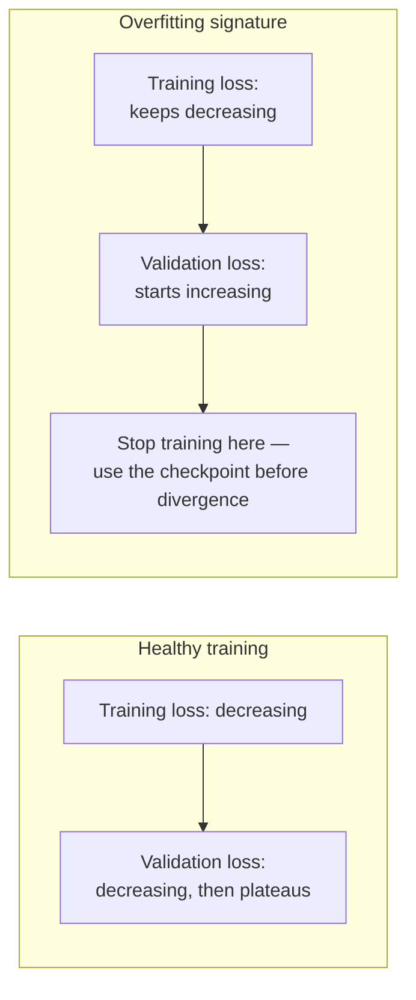

# Fine-Tuning in Practice

[ftn-02](ftn-02-fine-tuning-methods.md) covered the method (LoRA, QLoRA, full fine-tuning) and [ftn-03](ftn-03-data-for-fine-tuning.md) covered the dataset. This chapter is where those two inputs actually become a deployed model: running the training job, reading whether it's working while it runs, choosing which checkpoint to keep, and — the step this curriculum has insisted on at every comparable juncture — wiring the whole workflow into the same eval-gated CI discipline [evl-06](../05-evaluation/evl-06-ci-for-llm-apps.md) built for prompt and model changes generally, so a fine-tuned model doesn't quietly bypass every quality control the rest of the system enjoys.

## Intuition: fine-tuning is a training run with the same failure modes as any other

Everything in this chapter is standard ML training practice — loss curves, overfitting, checkpoint selection — applied to the specific case of adapting a pretrained LLM. The reason it deserves its own chapter rather than a footnote is that **the stakes and the signal-to-noise ratio are different from training a model from scratch**: a fine-tuning dataset is small relative to pretraining data (per [ftn-03](ftn-03-data-for-fine-tuning.md)'s curation-over-volume finding), which means overfitting risk is higher and faster to hit than practitioners coming from large-scale training intuition might expect, and the "is it working" signal has to be read carefully because a model can look like it's improving on a narrow loss metric while actually degrading on the broader behavior you care about.

## Hosted APIs versus self-hosted training

**Hosted fine-tuning APIs** (provider-managed fine-tuning endpoints) handle infrastructure, training orchestration, and often hyperparameter defaults for you — upload a formatted dataset, kick off a job, get back a deployable fine-tuned model endpoint.[^openai-finetuning-guide][^anthropic-finetuning] This is the right default for most teams: it removes GPU provisioning, distributed training setup, and infrastructure maintenance entirely, at the cost of less control over the exact training process and, typically, an inability to export and self-host the resulting weights (the fine-tuned model lives on the provider's infrastructure, accessed via API like the base model was).

**Self-hosted training** (typically via open-weight models and frameworks like Hugging Face's PEFT library[^huggingface-peft]) trades that convenience for full control — exact hyperparameters, custom training loops, the ability to export and deploy the resulting weights anywhere, including [prd-01](../06-production/prd-01-architecture-patterns.md)'s self-hosted deployment path. This is the right choice when you need an open-weight base model specifically (for licensing, data-residency, or cost-at-scale reasons connecting back to [sec-03](../07-safety-security/sec-03-privacy-compliance.md) and [prd-05](../06-production/prd-05-cost-engineering.md)), or when your task genuinely needs hyperparameter or architecture control a hosted API doesn't expose.

**The decision follows the same build-vs-buy logic [prd-01](../06-production/prd-01-architecture-patterns.md) established generally**: hosted APIs for speed and low operational overhead when a supported base model and standard training recipe fit the task; self-hosted training when control, data residency, licensing, or cost-at-scale considerations outweigh that convenience — evaluated per project, not as a standing default in either direction.

## Reading training curves

**The loss curve is the first, coarsest signal**, and its basic literacy matters even for teams using a hosted API that abstracts away the training loop: training loss should decrease and generally plateau; a validation loss (measured on held-out data *not* used for training — connecting to [ftn-03](ftn-03-data-for-fine-tuning.md)'s contamination discipline) that starts increasing while training loss keeps decreasing is the classic overfitting signature — the model is memorizing training-specific patterns rather than learning the generalizable behavior you actually want.

**Given fine-tuning's typically small dataset size, overfitting arrives faster and more easily than large-scale-training intuition suggests** — a dataset of a few hundred to a few thousand examples ([ftn-03](ftn-03-data-for-fine-tuning.md)'s LIMA-informed range) can be fully memorized in relatively few epochs, especially with a full-fine-tuning approach or an aggressively high LoRA rank. **Watching validation loss, not just training loss, is the non-negotiable practice this section exists to establish** — a team that only tracks training loss has no signal at all for the failure mode most likely to actually occur.

*Reading the loss curves: healthy convergence versus the overfitting signature to stop training at:*

**Loss alone is an incomplete signal, though — the deeper practice is running your actual target-task eval suite (from [ftn-01](ftn-01-customization-decision.md)'s decision process and [ftn-03](ftn-03-data-for-fine-tuning.md)'s dataset) against checkpoints during or after training**, not just watching a scalar loss number. A model's validation loss can look healthy while its actual task-specific quality — measured by the eval suite that reflects what you're actually optimizing for — tells a different story, because loss is a proxy for the training objective, not a direct measure of the behavior you ultimately care about.

## Checkpoint selection

**Save and evaluate multiple checkpoints across training, not just the final one.** The intuitive assumption that "more training is better" is frequently wrong for fine-tuning specifically, given the small-dataset overfitting risk above — the checkpoint with the best target-task eval score is often not the last one saved, and picking the final checkpoint by default, without comparison, is a common and easily avoidable mistake.

**Evaluate every candidate checkpoint on both the target-task suite and a general-capability suite**, directly reusing [ftn-02](ftn-02-fine-tuning-methods.md)'s catastrophic-forgetting-detection discipline here at the checkpoint-selection stage rather than only after training completes — a checkpoint that scores best on the target task but has drifted further on general capability than an earlier checkpoint is a real trade-off to weigh explicitly, not an automatic win for the higher target-task score.

## Wiring fine-tuning into CI

The step that closes the loop with the rest of this curriculum's production discipline: **a fine-tuned model is a deployable artifact, and it should go through the same eval-gated pipeline [evl-06](../05-evaluation/evl-06-ci-for-llm-apps.md) built for any other model or prompt change** — automated evaluation against the standing suite before any fine-tuned checkpoint is considered for deployment, version-pinned and canaried per [prd-06](../06-production/prd-06-deployment-infrastructure.md)'s deployment discipline rather than swapped in directly, and red-teamed per [sec-04](../07-safety-security/sec-04-red-teaming.md)'s standing practice before shipping if the fine-tuning changed behavior in ways that could affect safety properties.

**This is the discipline most commonly skipped**, because fine-tuning can feel like a separate, one-off ML project rather than a production deployment — but a fine-tuned model is exactly as capable of shipping a regression as a prompt change, and treating it with less rigor than a prompt change (which, by this point in the curriculum, goes through a full eval gate) is an inconsistency worth deliberately closing rather than accepting as a natural artifact of fine-tuning feeling like a different kind of work.

## Production engineering perspective

- **Default to hosted fine-tuning APIs** unless a specific, identified requirement (self-hosting, licensing, data residency, deep hyperparameter control) argues for self-hosted training.
- **Track validation loss, not just training loss**, from the first training run — the overfitting signature is the single most common fine-tuning-specific failure and it's invisible without a held-out validation signal.
- **Evaluate multiple checkpoints against your actual target-task eval suite**, not just the final checkpoint and not just loss — loss is a proxy, the eval suite is the real target.
- **Check every candidate checkpoint for catastrophic forgetting** ([ftn-02](ftn-02-fine-tuning-methods.md)) as part of checkpoint selection, weighing target-task gain against general-capability cost explicitly.
- **Route fine-tuned models through the same CI eval gate, canary, and red-teaming discipline** as any other deployable model change — no exception for "it's a fine-tuning project."
- **Version and document the full recipe** — dataset version, hyperparameters, base model version, selected checkpoint — as deployment metadata, per [prd-06](../06-production/prd-06-deployment-infrastructure.md)'s version-pinning discipline extended to fine-tuned artifacts.

## Historical evolution

**2021–2022:** early fine-tuning practice is largely self-hosted and research-lab-driven, requiring substantial ML engineering expertise to run training loops, manage infrastructure, and interpret results — a high barrier to entry that limited fine-tuning to teams with dedicated ML infrastructure. **2023:** hosted fine-tuning APIs from major providers dramatically lower this barrier, packaging dataset upload, training orchestration, and often reasonable hyperparameter defaults into a managed service accessible to application engineers without deep ML training expertise.[^openai-finetuning-guide][^anthropic-finetuning] **2023:** as LoRA and PEFT libraries mature and stabilize,[^huggingface-peft] self-hosted fine-tuning becomes substantially more accessible too — a well-documented, widely-used library rather than a research codebase, narrowing the gap between hosted convenience and self-hosted control. **2023–2024:** the practice of evaluating fine-tuned models with the same eval-gated CI rigor as prompt and model changes ([evl-06](../05-evaluation/evl-06-ci-for-llm-apps.md)) spreads as teams discover that treating fine-tuning as a separate, less-rigorous workflow produced exactly the regressions the CI discipline was built to catch elsewhere. **2024–present:** fine-tuning workflow has largely converged on the pattern this chapter describes — hosted-by-default, validation-loss-monitored, multi-checkpoint-evaluated, CI-gated before deployment — as the field's default rather than a leading-edge practice only sophisticated teams follow.

## Common misconceptions

- **"The final training checkpoint is always the best one."** Given fine-tuning's small-dataset overfitting risk, an earlier checkpoint frequently outperforms the final one on the actual target-task eval suite — evaluate multiple checkpoints, don't assume.
- **"Low training loss means the fine-tuning worked."** Training loss can keep decreasing while validation loss (and actual task quality) gets worse — the overfitting signature, invisible without a held-out validation split.
- **"Self-hosted training gives strictly better results than a hosted API."** It gives more control, not automatically better results — a hosted API's sensible defaults often perform comparably for standard tasks, and self-hosting's value is control and data ownership, not guaranteed quality improvement.
- **"Fine-tuning is a one-off ML project, not a deployment."** A fine-tuned model is a deployable artifact with the same regression risk as a prompt or model change, and skipping the CI eval gate for it is an inconsistency worth closing, not a natural exception.
- **"Loss curves alone tell you whether fine-tuning succeeded."** Loss is a proxy for the training objective, not a direct measure of the behavior you care about — the target-task eval suite is the real signal.

## Failure modes and trade-offs

- **Tracking only training loss, no validation split** — no signal at all for the most common fine-tuning-specific failure mode. *Fix:* hold out validation data from the start, monitor it throughout training.
- **Defaulting to the final checkpoint without comparison** — a common, easily avoidable mistake given how frequently an earlier checkpoint outperforms the final one on actual target-task quality. *Fix:* save and evaluate multiple checkpoints against the target-task suite.
- **Skipping the CI eval gate because "it's a fine-tuning project"** — ships a fine-tuned regression the rest of the system's quality controls would have caught for any other change type. *Fix:* route fine-tuned models through the exact same eval-gated, canaried deployment pipeline.
- **Choosing self-hosted training by default, without a specific driving requirement** — pays real infrastructure and expertise overhead for control the project doesn't actually need. *Fix:* hosted-by-default, self-hosted only with an identified reason.
- **The central trade-off:** control versus convenience, and training duration versus overfitting risk. Self-hosted training buys control at a real operational cost; longer training buys lower training loss at real overfitting risk — both resolved by evaluating against the actual target, not by defaulting to "more" (more control, more training) as inherently better.

## Best practices

- Default to hosted fine-tuning APIs; choose self-hosted training only for an identified, specific requirement.
- Hold out a validation split from the start and monitor validation loss throughout training, not just training loss.
- Save and evaluate multiple checkpoints against the actual target-task eval suite, not just the final checkpoint or loss alone.
- Check every candidate checkpoint for catastrophic forgetting against a general-capability suite as part of checkpoint selection.
- Route every fine-tuned model through the same eval-gated CI pipeline, canary process, and red-teaming discipline as any other deployable model change.
- Version and document the full training recipe — dataset version, hyperparameters, base model, selected checkpoint — as deployment metadata.
- Treat fine-tuning as a production deployment workflow from the start, not a separate, less-rigorous ML side project.

## Real-world examples

**The earlier checkpoint that beat the final one.** A team fine-tunes for a fixed number of epochs, planning to deploy the final checkpoint by default. Running their target-task eval suite against checkpoints saved at each epoch reveals that quality peaked partway through training and declined over the final two epochs — the model had begun overfitting, memorizing training-specific quirks rather than the general target behavior, exactly matching the validation-loss divergence they'd also observed but almost overlooked. Deploying the mid-training checkpoint instead of the final one measurably improves production quality over what the default choice would have shipped.

**The fine-tuning project that skipped CI and shipped a regression.** A team treats their fine-tuning project as a standalone ML effort, evaluating it only against their target-task metrics before deploying the resulting model directly, bypassing the eval-gated CI pipeline every other model and prompt change in their system goes through. The fine-tuned model performs well on the target task but has quietly regressed on an unrelated capability the standing eval suite would have caught — a regression that ships to production and is discovered days later through user reports rather than caught before deployment, prompting the team to fold fine-tuned models into the same CI gate going forward.

**The hosted-versus-self-hosted decision made explicitly.** A team initially assumes they need self-hosted training for maximum control, provisioning GPU infrastructure and a custom training pipeline. Revisiting the decision against [prd-01](../06-production/prd-01-architecture-patterns.md)'s build-vs-buy framework, they realize their task — a standard structured-output formatting adaptation — fits a hosted API's standard training recipe well, with no specific data-residency or licensing requirement pushing toward self-hosting. Switching to a hosted API cuts their time-to-first-result from weeks to days, with comparable final quality on their eval suite — the self-hosted infrastructure had been solving a control problem they didn't actually have.

## Interview questions

1. **"How would you detect overfitting during a fine-tuning run, and what would you do about it?"** — Model answer: I'd hold out a validation split not used in training and monitor validation loss alongside training loss throughout the run — the classic overfitting signature is training loss continuing to decrease while validation loss starts increasing, meaning the model is memorizing training-specific patterns rather than learning generalizable behavior. Given fine-tuning's typically small dataset size, this can happen faster than large-scale training intuition suggests. I'd address it by saving multiple checkpoints across training and selecting based on the target-task eval suite's peak, not defaulting to the final checkpoint.

2. **"Why might the final training checkpoint not be the best one to deploy?"** — Model answer: because fine-tuning datasets are typically small, a model can overfit — continuing to improve on training loss while its actual generalizable quality, measured by validation loss and more importantly by the target-task eval suite, peaks earlier and then declines. Assuming more training epochs is always better is a common mistake; the practice is to save and evaluate multiple checkpoints against the real target-task metric and pick the best one, which is frequently not the last one saved.

3. **"When would you choose self-hosted fine-tuning over a hosted API?"** — Model answer: when there's a specific, identified requirement a hosted API can't meet — needing to export and self-host the resulting weights for data-residency or licensing reasons, needing an open-weight base model specifically, or needing hyperparameter or architecture control beyond what a managed service exposes. Absent one of those, I'd default to a hosted API — it removes infrastructure and orchestration overhead, and its sensible defaults are usually comparable in quality for standard tasks, so self-hosting should be a deliberate choice driven by a real requirement, not a default assumption that more control is inherently better.

4. **"Why should a fine-tuned model go through the same CI pipeline as a prompt change?"** — Model answer: because it's exactly as capable of shipping a quality or safety regression, and treating it as a separate, less-rigorous ML project rather than a deployment is an inconsistency that undermines the rest of the system's quality controls. The fine-tuned model should be evaluated against the standing eval suite before deployment consideration, version-pinned and canaried like any other model change, and red-teamed if the fine-tuning changed behavior in ways that could affect safety-relevant properties — the same discipline the system already applies elsewhere, just not skipped here because fine-tuning feels different.

5. **"You have two checkpoints: one scores higher on your target-task eval, the other shows less general-capability regression. How do you choose?"** — Model answer: it's an explicit trade-off, not an automatic win for the higher target-task score. I'd weigh how much the target-task gain actually matters for the product against how much the general-capability regression could cost — a small forgetting cost for a large target-task gain is often worth it, but a large forgetting cost, especially one touching safety-relevant behavior from sec-05, might not be. I'd want both numbers in front of me and a specific judgment call, not a default to whichever checkpoint scored best on the metric I happened to look at first.

## Exercises and mini-project

**Exercises**

1. Given a training-loss curve and a validation-loss curve, identify the epoch where you'd stop training and justify it.
2. Design the checkpoint-selection process for a fine-tuning run with five saved checkpoints — what do you evaluate, and how do you weigh target-task gain against forgetting?
3. Argue for hosted versus self-hosted fine-tuning for two different scenarios: a standard formatting adaptation, and a task requiring an open-weight, self-deployable model for data-residency reasons.
4. Design the deployment metadata you'd record for a fine-tuned model artifact, connecting to prd-06's version-pinning discipline.
5. Explain why a fine-tuned model needs to go through red-teaming, connecting to what specifically could have changed about its behavior.

**Mini-project: run and evaluate a full fine-tuning cycle.** Using the dataset built in [ftn-03](ftn-03-data-for-fine-tuning.md)'s mini-project: (a) run a fine-tuning job (hosted API or self-hosted, your choice, justified) with a held-out validation split; (b) monitor and plot training and validation loss; (c) save at least three checkpoints across training and evaluate each against your target-task eval suite and a small general-capability suite; (d) select the best checkpoint with an explicit justification weighing target-task gain against any forgetting observed; (e) write a deployment memo documenting the full recipe (dataset version, hyperparameters, base model, selected checkpoint) as you would for a real deployment. Target: 4 hours (plus training time). Success criterion: a selected checkpoint that is demonstrably not just "the last one," backed by a comparison across at least three checkpoints.

**Capstone extension:** this chapter completes the fine-tuning execution loop started in [ftn-02](ftn-02-fine-tuning-methods.md) and [ftn-03](ftn-03-data-for-fine-tuning.md); its CI-gating discipline reuses [evl-06](../05-evaluation/evl-06-ci-for-llm-apps.md) directly, and its deployment discipline reuses [prd-06](../06-production/prd-06-deployment-infrastructure.md).

## Revision summary

- **Hosted fine-tuning APIs** are the right default (low operational overhead, sensible defaults); **self-hosted training** is justified by a specific requirement (data residency, licensing, open-weight deployment, deep hyperparameter control) — the same build-vs-buy logic as [prd-01](../06-production/prd-01-architecture-patterns.md).
- **Validation loss, not just training loss**, is the non-negotiable signal for overfitting — fine-tuning's small dataset size makes this failure mode arrive faster than large-scale training intuition suggests.
- **Loss is a proxy, not the target** — the real signal is the target-task eval suite run against multiple saved checkpoints, since the best checkpoint is frequently not the final one.
- **Checkpoint selection weighs target-task gain against catastrophic forgetting explicitly**, reusing [ftn-02](ftn-02-fine-tuning-methods.md)'s forgetting-detection discipline at the selection stage.
- **Fine-tuned models are deployable artifacts** and must go through the same eval-gated CI, canary, and red-teaming discipline as any other model or prompt change — skipping this because "it's a fine-tuning project" is the chapter's central failure mode to avoid.

## Flashcards

| Q | A |
|---|---|
| Default choice: hosted API or self-hosted training? | Hosted API by default; self-hosted only for a specific identified requirement. |
| The overfitting signature in loss curves? | Training loss keeps decreasing while validation loss starts increasing. |
| Why does fine-tuning overfit faster than large-scale training? | Small dataset size (per ftn-03's curation-over-volume finding) is memorized in relatively few epochs. |
| Why isn't loss alone sufficient for checkpoint selection? | Loss is a proxy for the training objective, not a direct measure of target-task quality. |
| How should checkpoints be chosen? | Evaluate multiple saved checkpoints against the target-task eval suite; the best is often not the final one. |
| What must happen before a fine-tuned model deploys? | The same eval-gated CI check, canary process, and red-teaming as any other model/prompt change. |
| The chapter's central failure mode to avoid? | Treating fine-tuning as a separate, less-rigorous ML project instead of a normal production deployment. |

## Further reading

- **Official docs:** OpenAI's[^openai-finetuning-guide] and Anthropic's[^anthropic-finetuning] fine-tuning guides, and Hugging Face's PEFT documentation[^huggingface-peft] — the concrete hosted and self-hosted workflows this chapter's decision framework assumes you'll check directly.
- **Tutorials:** run the mini-project's full cycle — training, checkpoint evaluation, selection, deployment memo — before your next real fine-tuning project; the overfitting signature and the "final checkpoint isn't always best" finding are far more convincing measured on your own run than read about.

## Check your understanding

1. Explain the hosted-versus-self-hosted fine-tuning decision using the same framework as prd-01's build-vs-buy logic.
2. Walk through how you'd detect overfitting during a fine-tuning run and what action you'd take.
3. Explain why checkpoint selection needs the target-task eval suite, not just the loss curve.
4. Design the trade-off analysis for choosing between two checkpoints with different target-task and forgetting profiles.
5. Argue for why a fine-tuned model should go through the same CI gate as a prompt change, addressing the "it's a separate ML project" objection directly.

## Sources

[^openai-finetuning-guide]: [T1] OpenAI. "Fine-tuning." https://platform.openai.com/docs/guides/fine-tuning (accessed 2026-07-22)
[^anthropic-finetuning]: [T1] Anthropic. "Fine-tuning." https://docs.anthropic.com/en/docs/build-with-claude/fine-tuning (accessed 2026-07-22)
[^huggingface-peft]: [T1] Hugging Face. "PEFT: Parameter-Efficient Fine-Tuning." https://huggingface.co/docs/peft/index (accessed 2026-07-22)
