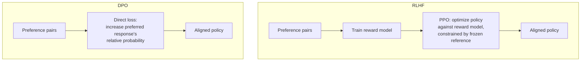

# Preference Optimization

Every fine-tuning technique covered so far in this module — [ftn-02](ftn-02-fine-tuning-methods.md) through [ftn-04](ftn-04-fine-tuning-in-practice.md) — is **supervised fine-tuning**: the model learns from demonstrations, examples of exactly the output you want. This chapter covers a different kind of training signal: **preferences**, where instead of showing the model the right answer, you show it two candidate answers and say which one is better. [sec-05](../07-safety-security/sec-05-alignment-for-engineers.md) already introduced RLHF as the technique behind large-scale model alignment; this chapter goes one level deeper into the engineering — why RLHF's full reinforcement-learning loop is operationally difficult, and how **DPO (Direct Preference Optimization)** reframes the same underlying objective into something that trains almost like ordinary supervised fine-tuning, which is why it's the technique most application-level fine-tuning projects reach for today rather than full RLHF.

## Intuition: some tasks are easier to judge than to demonstrate

Supervised fine-tuning requires someone (or something) to produce the *correct* output for every training example — genuinely hard for tasks where "correct" isn't a single well-defined answer, like matching a nuanced tone, calibrating helpfulness against safety, or producing a response that's merely *better* than an alternative without there being one canonical best response. **Preference data sidesteps this**: it's often much easier for a human (or a capable judge model, per [evl-03](../05-evaluation/evl-03-llm-as-judge.md)) to look at two candidate responses and say which is better than it is to author the single ideal response from scratch. This asymmetry — judging is easier than generating — is the entire reason preference-based training exists as a distinct technique from supervised fine-tuning, not a redundant alternative to it.

## RLHF's full loop, and why it's operationally hard

[sec-05](../07-safety-security/sec-05-alignment-for-engineers.md) covered RLHF's high-level shape: collect human preference comparisons, train a reward model to predict them, then optimize the base model against the reward model using reinforcement learning — typically PPO (Proximal Policy Optimization).[^schulman-ppo][^ouyang-instructgpt] The engineering reality underneath that summary is where the operational difficulty actually lives:

**Three separate models in memory simultaneously** — the policy model being trained, the reward model scoring its outputs, and (in the standard formulation) a frozen reference copy of the original model used to keep the policy from drifting too far from sensible behavior during optimization — each with its own memory footprint, multiplying the infrastructure cost several-fold over standard fine-tuning.

**Reinforcement learning's well-known instability**, applied to a language model's enormous action space (every possible next token, at every position). PPO exists specifically because naive policy-gradient RL is unstable; even with PPO's stabilization, RLHF training is sensitive to hyperparameters, prone to reward hacking (the specification-gaming failure [sec-05](../07-safety-security/sec-05-alignment-for-engineers.md) described, where the policy learns to exploit the reward model's imperfections rather than genuinely improving), and requires careful monitoring that a standard supervised training loop doesn't.

**This complexity is exactly what motivated the search for something simpler that achieves the same objective** — which is precisely the gap DPO fills.

## DPO: the same objective, no separate reward model

**The key insight of DPO** is a mathematical reformulation showing that the RLHF objective — optimize the policy to maximize reward while staying close to a reference model — has a closed-form solution in terms of the policy itself, meaning you can skip training an explicit reward model and skip the reinforcement-learning optimization loop entirely, and instead directly optimize the policy on preference pairs using a loss function that looks much more like ordinary supervised learning.[^rafailov-dpo] The paper's memorable framing — "your language model is secretly a reward model" — captures the core move: the reward function is implicit in the policy's own output probabilities relative to the reference model, so there's no separate reward model to train, store, or run inference through during optimization.

**Practically, this means**: given a preference pair (a prompt, a preferred response, a dispreferred response), DPO computes a loss that increases the model's relative preference for the preferred response over the dispreferred one, directly, in a single training pass — no reward model, no PPO rollouts, no three-models-in-memory infrastructure. This is a training loop that looks, mechanically, much closer to the supervised fine-tuning [ftn-02](ftn-02-fine-tuning-methods.md) through [ftn-04](ftn-04-fine-tuning-in-practice.md) already covered, which is exactly why DPO could adopt the same LoRA/QLoRA infrastructure, the same checkpoint-evaluation discipline, and the same CI-gating practice with comparatively little additional machinery.

*RLHF's three-model loop versus DPO's direct, single-model optimization on the same preference data:*

**The trade-off DPO makes**: it's simpler, more stable, and cheaper to run, but it's less flexible than full RLHF in one specific way — because there's no explicit, separate reward model, you can't as easily reuse that reward signal for other purposes (like scoring arbitrary outputs at inference time for a guardrail, or best-of-n sampling against the reward model) the way an explicit RLHF reward model can be repurposed. For the common case of "align this model's behavior to a set of preferences and deploy it," DPO's simplicity is usually the right trade; for cases specifically needing a standalone, reusable reward signal, the explicit-reward-model RLHF formulation retains an advantage.

## Building a preference dataset

**A preference dataset looks structurally different from a supervised fine-tuning dataset** ([ftn-03](ftn-03-data-for-fine-tuning.md)): instead of (prompt, ideal response) pairs, it's (prompt, chosen response, rejected response) triples. This changes the data-collection process in a specific way worth naming: you typically need to *generate* multiple candidate responses per prompt first (sampled from the model being trained or a comparable one, often at different temperatures or from different checkpoints), then have a judge — human or, increasingly, a calibrated LLM judge per [evl-03](../05-evaluation/evl-03-llm-as-judge.md) — rank or choose between them.

**The same data-quality disciplines from [ftn-03](ftn-03-data-for-fine-tuning.md) apply directly, with one preference-specific addition**: annotator (or judge) consistency matters even more here than for supervised labeling, because a preference judgment is inherently more subjective than "is this the correct answer" — two reasonable judges can disagree about which of two decent responses is better far more readily than they'd disagree about whether a factual answer is correct. **A calibration pass — checking inter-annotator agreement on a shared sample before scaling up collection — is not optional for preference data the way it might be treated as a nice-to-have for some supervised labeling tasks**; low agreement is a direct signal that the preference dimension itself needs to be defined more precisely (are you optimizing for helpfulness, safety, conciseness, tone — "better" is not self-defining) before more data is collected against an ambiguous target.

## When preference optimization is the right tool

**This is a refinement layer on top of supervised fine-tuning, not a replacement for it** — the typical production recipe is supervised fine-tuning first (teaching the model the target task and format, per [ftn-02](ftn-02-fine-tuning-methods.md)'s behavior-shaping framing) followed by preference optimization second (refining *which* of several plausible correct-format outputs is actually preferred), because preference optimization needs the model to already be capable of producing reasonable candidate responses before it's useful to rank between them.

**The specific signal preference optimization is good at capturing**: nuanced quality dimensions that are hard to specify as a single demonstrated "correct" answer — tone calibration, helpfulness-versus-safety balance, stylistic preferences, subtle correctness distinctions between two superficially similar responses. If your gap is more basic — the model doesn't know the target format or task at all — that's supervised fine-tuning's territory first, and reaching for preference optimization before establishing basic task competence via SFT is a common ordering mistake.

## Production engineering perspective

- **Sequence supervised fine-tuning before preference optimization** when both are needed — SFT establishes basic task competence, preference optimization refines quality among already-competent candidates.
- **Default to DPO over full RLHF** for most application-level fine-tuning projects, given its comparable results with dramatically less infrastructure complexity — reserve full RLHF for cases specifically needing a standalone, reusable reward model.
- **Run an inter-annotator/inter-judge agreement check before scaling preference data collection** — low agreement signals an underspecified preference dimension, not a data-volume problem to solve by collecting more.
- **Define the preference dimension explicitly** ("better" along which axis — helpfulness, safety, tone, conciseness) before collection begins, the preference-data analog of [ftn-03](ftn-03-data-for-fine-tuning.md)'s annotation-guideline discipline.
- **Evaluate preference-optimized models for both the target preference dimension and general capability/forgetting**, exactly as [ftn-02](ftn-02-fine-tuning-methods.md) and [ftn-04](ftn-04-fine-tuning-in-practice.md) established for supervised fine-tuning — preference optimization is not exempt from the same forgetting risk.
- **Route preference-optimized models through the same CI eval gate and deployment discipline** ([evl-06](../05-evaluation/evl-06-ci-for-llm-apps.md), [prd-06](../06-production/prd-06-deployment-infrastructure.md)) as any other fine-tuned or prompted model change.

## Historical evolution

**2017:** PPO is introduced as a general reinforcement-learning stabilization technique, later adopted as the standard optimization algorithm for RLHF's policy-training step.[^schulman-ppo] **2022:** InstructGPT demonstrates the full RLHF pipeline — reward model plus PPO — applied to large language models at scale, establishing it as the dominant alignment technique and, simultaneously, exposing its operational complexity (three models in memory, RL instability, reward hacking) to a much broader engineering audience than the RL research community that had used PPO previously.[^ouyang-instructgpt] **2023:** DPO reframes the same underlying optimization objective as a direct, stable, supervised-style loss requiring no separate reward model and no RL rollouts, dramatically lowering the operational barrier to preference-based fine-tuning.[^rafailov-dpo] **2023–2024:** DPO and its variants become the default preference-optimization technique for the large majority of application-level fine-tuning projects specifically because of this operational simplification, with full RLHF increasingly reserved for large-scale foundation-model training where an explicit, reusable reward model has independent value. **2024–present:** preference optimization has become a standard second stage after supervised fine-tuning in most serious fine-tuning workflows, with DPO-family methods continuing to iterate (addressing some of DPO's own known limitations around length bias and preference-data quality sensitivity) rather than the field reverting to full RLHF's complexity.

## Common misconceptions

- **"Preference optimization replaces supervised fine-tuning."** It's a refinement layer that assumes the model can already produce reasonable candidate responses — SFT establishes that competence first in the typical production recipe.
- **"DPO is a worse, simplified version of RLHF."** For the common case of aligning a model to preferences without needing a standalone reusable reward model, DPO achieves comparable results with dramatically less infrastructure complexity — a better default for most application-level projects, not merely a cheaper compromise.
- **"Preference data is easier to collect than supervised data because judging is easier than generating."** Judging is easier per-example, but preference judgments are inherently more subjective, requiring explicit dimension definition and inter-annotator calibration that supervised labeling for objectively-correct tasks doesn't need as urgently.
- **"A model trained with DPO can't reward-hack or overfit."** The same forgetting and overfitting risks from supervised fine-tuning apply — DPO changes the training mechanism, not the need for validation monitoring and general-capability evaluation.
- **"Preference optimization is only for large-scale foundation-model alignment."** DPO's operational simplicity has made it a practical, application-level technique for narrower fine-tuning projects too, not just frontier-lab-scale alignment work.

## Failure modes and trade-offs

- **Skipping supervised fine-tuning and going straight to preference optimization** — the model has nothing competent to rank between, producing poor results regardless of preference-data quality. *Fix:* sequence SFT first when the model doesn't already have basic task competence.
- **Collecting preference data without defining the preference dimension** — "better" along an unspecified axis produces noisy, low-agreement labels that teach an incoherent preference. *Fix:* define the dimension explicitly before collection, calibrate inter-annotator agreement early.
- **Choosing full RLHF by default over DPO** — pays substantially more infrastructure complexity for a reusable reward model most projects don't actually need. *Fix:* default to DPO, reserve RLHF for identified reward-model-reuse requirements.
- **Not evaluating preference-optimized models for forgetting** — assuming preference optimization is exempt from the risks that apply to supervised fine-tuning. *Fix:* the same general-capability evaluation discipline from [ftn-02](ftn-02-fine-tuning-methods.md)/[ftn-04](ftn-04-fine-tuning-in-practice.md), applied here too.
- **The central trade-off:** DPO's simplicity versus RLHF's flexibility. DPO is simpler, more stable, and requires less infrastructure; explicit-reward-model RLHF retains an advantage specifically when the reward signal needs to be reused beyond the single training run (inference-time scoring, best-of-n sampling) — the choice should follow that specific need, not a general preference for either technique's reputation.

## Best practices

- Sequence supervised fine-tuning before preference optimization when the model doesn't already have basic target-task competence.
- Default to DPO over full RLHF for application-level fine-tuning projects, reserving RLHF for identified reward-model-reuse needs.
- Define the preference dimension explicitly before collecting preference data, and calibrate inter-annotator or inter-judge agreement early.
- Generate diverse candidate responses (varied temperature, varied checkpoints) before collecting preference judgments, to give the judge meaningfully different options to compare.
- Evaluate preference-optimized checkpoints for both the target preference dimension and general-capability forgetting, using the same discipline as supervised fine-tuning.
- Route preference-optimized models through the same CI eval gate and deployment pipeline as any other fine-tuned model.

## Real-world examples

**The preference dataset with low agreement that signaled an underspecified target.** A team collects preference judgments for "better" customer support responses without further specifying the dimension, and an early inter-annotator agreement check comes back surprisingly low. Investigating, they find some annotators were optimizing for conciseness while others favored thoroughness — two reasonable but different notions of "better" being conflated into one label. Splitting the guideline into an explicit primary dimension (accuracy and completeness) with a secondary tiebreaker (conciseness) raises agreement substantially and produces a preference-optimized model with noticeably more consistent behavior than a first attempt trained on the ambiguous labels would have.

**DPO replacing a stalled RLHF effort.** A team attempts full RLHF for a narrower application-level alignment task, running into the operational complexity this chapter describes — reward model training, PPO instability, and infrastructure cost disproportionate to their team size and task scope. Switching to DPO on the same preference dataset achieves comparable alignment results with a training loop closer in complexity to their existing supervised fine-tuning pipeline, requiring no separate reward model infrastructure — a case where DPO's simplicity, not just its cost, was the deciding factor for a team without dedicated RL engineering capacity.

**The SFT-then-DPO recipe that outperformed either alone.** A team fine-tunes a model with supervised fine-tuning to establish the correct output format and basic task competence, then applies DPO on top using preference pairs collected between multiple SFT-checkpoint-generated candidates, refining tone and helpfulness calibration beyond what the SFT stage alone achieved. Evaluated separately, SFT-only and (hypothetically) DPO-only-from-base each underperform the sequenced combination — SFT alone lacks the nuanced quality refinement, and DPO without a competent SFT base would have nothing good to rank between.

## Interview questions

1. **"Why does DPO not need a separate reward model, when RLHF does?"** — Model answer: DPO is built on a mathematical reformulation showing that RLHF's objective — maximize reward while staying close to a reference model — has a closed-form solution expressible directly in terms of the policy's own output probabilities relative to the reference model. That means the reward signal is implicit in the policy itself; there's no need to train, store, or run inference through a separate reward model, and no need for the reinforcement-learning optimization loop RLHF uses to fit the policy to that reward — DPO instead computes a direct loss on preference pairs that looks much more like ordinary supervised training.

2. **"What operational problems does DPO avoid that make it a common default over full RLHF?"** — Model answer: full RLHF requires three models in memory simultaneously — the policy, the reward model, and a frozen reference — multiplying infrastructure cost, plus the well-known instability of reinforcement learning applied to a language model's enormous token-level action space, which PPO stabilizes but doesn't eliminate, including risk of reward hacking where the policy exploits the reward model's imperfections. DPO avoids all of this by training a direct loss on preference pairs in a single pass, closer in operational complexity to standard supervised fine-tuning.

3. **"Why would you use preference optimization instead of just collecting more supervised fine-tuning examples?"** — Model answer: because some quality dimensions are much easier to judge between two candidates than to specify as a single canonical correct answer — tone calibration, helpfulness-versus-safety balance, or subtle correctness distinctions between superficially similar responses. Preference data captures "this one is better" without requiring anyone to author the definitively ideal response, which is often infeasible for genuinely nuanced dimensions where no single best answer exists.

4. **"How would you build a preference dataset for a fine-tuning project, and what's the biggest risk in doing so?"** — Model answer: I'd generate multiple diverse candidate responses per prompt — varying temperature or checkpoint — then have a judge, human or a calibrated LLM judge, choose or rank between them, producing (prompt, chosen, rejected) triples. The biggest risk is collecting judgments against an undefined or ambiguous preference dimension — "better" isn't self-defining, and different judges can reasonably disagree about which of two decent responses wins along different axes. I'd run an inter-annotator or inter-judge agreement check early and treat low agreement as a signal to sharpen the dimension definition, not to just collect more data.

5. **"When would you still choose full RLHF over DPO despite the added complexity?"** — Model answer: specifically when you need a standalone, reusable reward model beyond the single training run — for instance, scoring arbitrary outputs at inference time as a guardrail, or running best-of-n sampling against the reward signal. DPO's implicit reward isn't packaged as a separate, queryable model the way RLHF's explicit reward model is, so if that reusability is a real requirement, RLHF's added infrastructure cost may be justified — but for the common case of just aligning a model's behavior and deploying it, that reusability usually isn't needed, and DPO is the better default.

## Exercises and mini-project

**Exercises**

1. Explain, in your own words, why judging two responses is often easier than authoring the single ideal response, with a concrete example task.
2. Design a preference-data collection process for a task of your choosing, including how you'd generate diverse candidates and define the preference dimension explicitly.
3. Contrast the infrastructure requirements of full RLHF and DPO, and explain which specific complexity each RLHF component avoids in DPO.
4. Given two annotators with low agreement on a preference-labeling task, diagnose what might be wrong and propose a fix.
5. Argue for the correct sequencing (SFT then DPO, or DPO alone) for a task that currently has no fine-tuned model at all, and justify your answer.

**Mini-project: build a small preference dataset and reason through a DPO setup.** Using a task from your capstone or [ftn-03](ftn-03-data-for-fine-tuning.md)'s dataset: (a) generate 2-3 candidate responses per prompt for a small set of prompts (varying temperature or prompting slightly differently); (b) define your preference dimension explicitly in a short guideline; (c) judge the candidates yourself (or set up an LLM-judge comparison per evl-03's calibration discipline) and record chosen/rejected pairs; (d) if you have two people or two judge configurations, check agreement on a shared subsample and report it; (e) write a short memo: what preference dimension you defined, what agreement you found, and whether your data would be ready to train DPO on as-is or needs refinement. Target: 2.5 hours. Success criterion: a preference-pair dataset with an explicitly defined dimension and a measured (not assumed) agreement rate.

**Capstone extension:** this chapter builds on [sec-05](../07-safety-security/sec-05-alignment-for-engineers.md)'s RLHF introduction and [ftn-02](ftn-02-fine-tuning-methods.md)'s training-method framework; its data-collection discipline extends [ftn-03](ftn-03-data-for-fine-tuning.md); [ftn-06](ftn-06-distillation-and-slms.md) covers the final fine-tuning-adjacent technique, distillation.

## Revision summary

- **Preference optimization trains on judgments (which response is better), not demonstrations (the single correct response)** — useful specifically for quality dimensions too nuanced to specify as one canonical ideal answer.
- **RLHF's full loop** (reward model + PPO against a frozen reference) is operationally hard: three models in memory, RL instability, reward-hacking risk.
- **DPO** reformulates the same objective as a direct, stable, supervised-style loss with no separate reward model and no RL rollouts — "your language model is secretly a reward model" — making it the default choice for most application-level preference optimization today.
- **Preference datasets are (prompt, chosen, rejected) triples**, built by generating diverse candidates and judging between them — requiring an explicitly defined preference dimension and calibrated inter-annotator/inter-judge agreement, since "better" is inherently more subjective than "correct."
- **Preference optimization is a refinement layer on top of supervised fine-tuning**, typically sequenced after SFT establishes basic task competence — not a replacement for it, and not exempt from the same forgetting/overfitting evaluation discipline.

## Flashcards

| Q | A |
|---|---|
| Supervised fine-tuning vs. preference optimization? | SFT learns from demonstrations (the correct answer); preference optimization learns from judgments (which of two is better). |
| Why is preference data often easier to collect? | Judging two candidates is often easier than authoring the single ideal response, especially for nuanced quality dimensions. |
| What does DPO eliminate from RLHF's pipeline? | The separate reward model and the RL (PPO) optimization loop — replaced by a direct loss on preference pairs. |
| Why is RLHF operationally hard? | Three models in memory (policy, reward model, reference), RL instability, and reward-hacking risk. |
| What does a preference dataset look like? | (prompt, chosen response, rejected response) triples, not (prompt, ideal response) pairs. |
| Why does preference labeling need explicit dimension definition? | "Better" isn't self-defining — different reasonable judges can disagree along different axes without one. |
| Typical production sequencing? | Supervised fine-tuning first (basic competence), preference optimization second (quality refinement). |
| When is full RLHF still preferred over DPO? | When a standalone, reusable reward model is needed beyond the single training run (e.g., inference-time scoring). |

## Further reading

- **Papers:** Rafailov et al. (DPO)[^rafailov-dpo] — the paper this chapter's central technique is built on, worth reading from source for the reformulation's derivation. Ouyang et al.[^ouyang-instructgpt] and Schulman et al.[^schulman-ppo] — RLHF's full pipeline and the PPO algorithm underlying its optimization step.
- **Tutorials:** run the mini-project's preference-dataset build and agreement check before attempting a full DPO training run — the dimension-definition and calibration discipline is best learned by watching your own agreement number come back lower than expected.

## Check your understanding

1. Explain why judging is often easier than generating, and how that asymmetry motivates preference-based training.
2. Walk through DPO's reformulation at a conceptual level — what does it eliminate from RLHF's pipeline, and why does that make it more stable?
3. Design a preference dataset collection process, including explicit dimension definition and an agreement-calibration step.
4. Argue for the correct sequencing of supervised fine-tuning and preference optimization for a task lacking any prior fine-tuning.
5. Identify a scenario where full RLHF's reusable reward model would be worth its added complexity over DPO.

## Sources

[^rafailov-dpo]: [T1] Rafailov et al. (2023). "Direct Preference Optimization: Your Language Model is Secretly a Reward Model." arXiv:2305.18290. https://arxiv.org/abs/2305.18290 (accessed 2026-07-23)
[^schulman-ppo]: [T1] Schulman et al. (2017). "Proximal Policy Optimization Algorithms." arXiv:1707.06347. https://arxiv.org/abs/1707.06347 (accessed 2026-07-23)
[^ouyang-instructgpt]: [T1] Ouyang et al. (2022). "Training language models to follow instructions with human feedback." arXiv:2203.02155. https://arxiv.org/abs/2203.02155 (accessed 2026-07-23)
