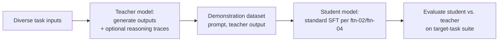

# Distillation and Small Language Models

This is the last technique in Module 8, and it closes the module by returning to a question [prd-03](../06-production/prd-03-inference-optimization.md) raised without fully answering: given a task a large model handles well, can you get a much smaller, cheaper, faster model to handle that *same specific task* nearly as well? **Knowledge distillation** is the fine-tuning technique built specifically to answer yes for narrow, well-defined tasks — training a small "student" model to imitate a large "teacher" model's behavior on the task at hand, producing a specialized small language model (SLM) deployable at a fraction of the teacher's cost and latency.

## Intuition: the teacher's outputs are richer training data than raw labels

The core mechanism, from Hinton's foundational formulation: instead of training a small model directly on hard, ground-truth labels, train it to match a large teacher model's *output distribution* — the teacher's full probability distribution over possible next tokens, not just the single highest-probability answer.[^hinton-distillation] **The insight is that a teacher's probability distribution carries more information than a single correct label**: if a teacher assigns 70% probability to the correct answer but also meaningfully weights two plausible near-misses, that relative weighting — often called "dark knowledge" — teaches the student something about the *structure* of the problem (which mistakes are reasonable, which are absurd) that a hard label alone doesn't convey. In modern LLM practice, this classical formulation is often simplified: rather than matching full output distributions (which requires access to the teacher's raw logits, not just its generated text), most practical LLM distillation instead generates a large set of (input, teacher-output) demonstration pairs and fine-tunes the student on them via standard supervised fine-tuning — the "soft label" richness is approximated by the sheer volume and quality of the teacher's demonstrated behavior across diverse inputs, rather than the literal probability distribution.

## Distillation versus quantization: different problems, often combined

[prd-03](../06-production/prd-03-inference-optimization.md) covered quantization as an inference-time technique: take an existing model, reduce its numerical precision, get a faster, cheaper version of the *same* model with the *same* capability ceiling, just executed more efficiently. **Distillation is a different move entirely: it produces a genuinely smaller model — fewer parameters, not just lower-precision ones — trained from scratch (or from a smaller pretrained base) to imitate a larger model's behavior on a specific task.** Quantization compresses; distillation transfers.

This distinction matters practically because the two techniques address different bottlenecks and, importantly, **compose rather than compete**: a distilled small model can itself be quantized for further deployment efficiency, stacking both techniques' savings — smaller architecture from distillation, lower precision from quantization — for a task where both the parameter count and the numerical precision are more than the task actually needs.

## The practical distillation workflow

**Generate a large set of demonstration data using the teacher model.** For a well-scoped task, run the capable teacher model across a diverse, representative set of inputs (real production inputs if available, or carefully constructed synthetic inputs covering the task's actual distribution), capturing its outputs as training demonstrations — connecting directly to [ftn-03](ftn-03-data-for-fine-tuning.md)'s synthetic-data-generation discussion, since this is functionally a specific, task-scoped application of that same technique, with the teacher model playing the role of a high-quality synthetic data generator.

**Fine-tune the student model on this teacher-generated dataset**, using the same supervised fine-tuning machinery [ftn-02](ftn-02-fine-tuning-methods.md) through [ftn-04](ftn-04-fine-tuning-in-practice.md) already established — the student's training run is mechanically an ordinary fine-tuning project, distinguished from other fine-tuning projects primarily by where the training data came from (a teacher model's outputs rather than human-authored or generic-synthetic demonstrations).

**A refinement worth naming**: recent work shows that having the teacher generate not just the final answer but also intermediate reasoning steps, and training the student on that reasoning trace, transfers meaningfully more capability than final-answer-only demonstrations for tasks where reasoning matters — the student learns some of the teacher's problem-solving *process*, not just its final outputs, often achieving strong task performance with substantially less training data than answer-only distillation would need.[^hsieh-distillingstep] This connects back to [agt-03](../04-agents/agt-03-reasoning-and-planning.md)'s chain-of-thought discussion: a reasoning trace is itself richer training signal than a bare answer, for the same underlying reason CoT prompting helps a model at inference time.

**Evaluate the student against the same task-specific eval suite the customization decision from [ftn-01](ftn-01-customization-decision.md) would have used to justify this project in the first place**, comparing student performance directly against the teacher's on the narrow task — the entire point of the exercise is measuring how much of the teacher's narrow-task capability transferred, not assuming it did.

*The distillation pipeline: teacher generates demonstrations (optionally including reasoning traces), student trains on them via standard SFT:*

## The honest limits: narrow-task competence, not general capability transfer

This is the section that keeps this chapter's framing honest, echoing [fnd-09](../01-foundations/fnd-09-known-limitations.md)'s shallows discussion: **distillation transfers competence on the specific task distribution the teacher's demonstrations covered — it does not transfer the teacher's general capability.** A student distilled on a narrow customer-support task will not become a generally capable assistant; it becomes a small, fast, cheap model that's good at the specific task it was trained on, with capability outside that scope closer to what its (smaller) base architecture would suggest than to the teacher's broad competence.

**This is a feature, correctly understood, not a limitation to apologize for**: for a genuinely narrow, well-scoped production task — a specific classification task, a specific structured-extraction task, a specific narrow-domain response pattern — this is exactly the trade-off you want, since paying for a large model's full general capability on every call of a narrow task is [prd-05](../06-production/prd-05-cost-engineering.md)'s cost-engineering problem in its purest form, and distillation is one of the more direct answers to it. **The failure mode is expecting a distilled SLM to generalize beyond the demonstrated task distribution** — a team that distills on a narrow task and then deploys the resulting SLM against a broader range of inputs than the teacher's demonstrations actually covered will see a real, measurable capability cliff at the boundary of what was demonstrated, precisely because nothing about distillation transfers capability the demonstrations didn't exercise.

## Production engineering perspective

- **Scope distillation to a genuinely narrow, well-defined task** — this is where it delivers its clearest win, per [ftn-01](ftn-01-customization-decision.md)'s customization-decision framework, and where the general-capability-transfer failure mode is least likely to bite.
- **Generate diverse, representative demonstration data from the teacher**, covering the actual production input distribution, not a narrow or unrepresentative slice of it — the student's eventual capability boundary is set by what the demonstrations covered.
- **Include reasoning traces in the demonstration data for tasks where reasoning matters**, not just final answers — meaningfully improves capability transfer for reasoning-dependent tasks per the Distilling Step-by-Step approach.
- **Evaluate the student directly against the teacher on the target task**, not just against a general benchmark — the comparison that actually tells you whether the project succeeded.
- **Combine distillation with quantization when both are applicable** — a distilled model can itself be quantized for further deployment savings, since the two techniques address different bottlenecks and stack.
- **Treat model-selection considerations from [api-06](../02-llm-apis/api-06-model-selection.md) as directly applicable to distillation projects** — the choice of teacher model, and the decision of whether distillation is worth the project cost versus simply calling a smaller off-the-shelf model directly, follows the same cost/quality/latency trade-off framework.
- **Route the distilled model through the same fine-tuning CI and deployment discipline** ([ftn-04](ftn-04-fine-tuning-in-practice.md), [evl-06](../05-evaluation/evl-06-ci-for-llm-apps.md), [prd-06](../06-production/prd-06-deployment-infrastructure.md)) as any other fine-tuned model — it's a deployable artifact with the same regression risk.

## Historical evolution

**2015:** Hinton's foundational distillation paper introduces the teacher-student framework and the "dark knowledge" insight — that a model's full output distribution carries more useful training signal than hard labels alone — in the context of general neural network compression, well before large language models existed at their current scale.[^hinton-distillation] **2020–2022:** as large language models grow substantially larger and more expensive to serve, distillation is revisited specifically as a technique for producing smaller, task-specialized models that approximate a much larger model's narrow-task behavior at a fraction of the deployment cost, adapting Hinton's general framework to the LLM-specific practicalities of demonstration-based (rather than raw-logit-based) knowledge transfer. **2023:** the Distilling Step-by-Step line of work demonstrates that including intermediate reasoning traces in the distillation data — not just final answers — improves capability transfer meaningfully for reasoning-dependent tasks, often with substantially less data than answer-only distillation requires.[^hsieh-distillingstep] **2023–2024:** open, small, high-quality base models (exemplified by families like Gemma[^gemma-report]) become widely available and well-suited as distillation students, lowering the barrier to running a distillation project without needing to train a small base architecture from scratch. **2024–present:** distillation is a standard, well-understood item in the production LLM-engineering toolkit specifically for narrow, well-scoped, high-volume tasks where a large model's per-call cost is the dominant economic problem — the direct production answer to [prd-05](../06-production/prd-05-cost-engineering.md)'s cost-engineering framing, applied at the model-training layer rather than only at the routing layer.

## Common misconceptions

- **"Distillation and quantization are the same kind of optimization."** Quantization compresses an existing model's numerical precision; distillation trains a genuinely smaller, different model to imitate behavior — different mechanisms, different trade-offs, and they compose rather than substitute for each other.
- **"A distilled model inherits the teacher's general capability."** It inherits competence on the specific task distribution the demonstration data covered — general capability outside that scope is not transferred, and expecting it to be is the chapter's central failure mode.
- **"Distillation requires access to the teacher's raw output logits."** Classical distillation does, but most practical LLM distillation today uses demonstration-based fine-tuning on the teacher's generated text, which works through any standard API access, not just logit-level access.
- **"More demonstration data is always better for distillation."** The same curation-over-volume discipline from [ftn-03](ftn-03-data-for-fine-tuning.md) applies — diverse, representative, high-quality demonstrations covering the actual task distribution matter more than raw volume.
- **"Distillation is only worth it for extremely high-volume tasks."** It's most clearly justified at high volume where the per-call cost savings compound, but the decision follows [ftn-01](ftn-01-customization-decision.md)'s general customization framework — worth evaluating for any narrow, well-scoped task where a smaller model's cost or latency advantage matters.

## Failure modes and trade-offs

- **Distilling on a narrow demonstration set and deploying against a broader input distribution** — a real, measurable capability cliff at the boundary of what was demonstrated. *Fix:* scope deployment to match the demonstrated task distribution, or expand the demonstration data to cover the actual production range first.
- **Using answer-only demonstrations for a reasoning-dependent task** — transfers less capability than including intermediate reasoning traces would, for tasks where the reasoning process itself carries transferable signal. *Fix:* generate and train on reasoning traces per the Distilling Step-by-Step approach when the task benefits from it.
- **Skipping direct student-versus-teacher evaluation on the target task** — no clear signal on whether the distillation project actually succeeded at its narrow goal. *Fix:* evaluate the student directly against the teacher on the same target-task suite.
- **Treating distillation as a substitute for the customization decision in [ftn-01](ftn-01-customization-decision.md)** — running a distillation project without first confirming the underlying task is well-scoped and worth the investment. *Fix:* apply the same decision framework before committing to a distillation project as to any other fine-tuning project.
- **The central trade-off:** narrow-task efficiency versus general capability. A distilled SLM trades away the teacher's broad competence for dramatic cost and latency improvement on a specific task — the right trade exactly when the task is genuinely narrow and high-volume, and the wrong trade when the actual production need turns out to be broader than the distillation project assumed.

## Best practices

- Scope distillation projects to genuinely narrow, well-defined tasks, validated against ftn-01's customization decision framework before starting.
- Generate diverse, representative demonstration data from the teacher, covering the actual production input distribution.
- Include intermediate reasoning traces in demonstration data for reasoning-dependent tasks, not just final answers.
- Evaluate the student directly against the teacher on the target-task eval suite, not just a general benchmark.
- Combine distillation with quantization when both apply, since the two techniques address different bottlenecks and stack.
- Match deployment scope to the demonstrated task distribution — don't deploy a narrowly-distilled model against a broader input range than it was trained on.
- Route distilled models through the same fine-tuning CI and deployment discipline as any other fine-tuned model.

## Real-world examples

**The distillation project that hit its cost target.** A team runs a high-volume, narrow classification task — routing incoming requests to the correct downstream handler — through a large, capable model, and the per-call cost at their volume is a significant line item. Distilling a small model on several thousand diverse teacher-generated demonstrations, evaluated directly against the teacher on a held-out set of the same classification task, achieves comparable accuracy at a small fraction of the per-call cost and latency — exactly the narrow, high-volume, well-scoped use case distillation is built for.

**The capability cliff at the demonstration boundary.** A team distills a model on a narrow set of demonstrations covering a specific support-ticket category, achieving strong results on that category — and then deploys the distilled model more broadly across all incoming support tickets, assuming the teacher's general competence had transferred along with the narrow-task competence. Performance on ticket categories outside the original demonstration set is measurably worse than the teacher's, and worse than the small base model would have suggested was possible — a direct instance of the chapter's central failure mode, requiring either scoping the deployment back to the demonstrated distribution or substantially expanding the demonstration data to actually cover the broader range being served.

**Reasoning traces improving data efficiency.** A team distilling a model for a task requiring multi-step reasoning initially trains the student on answer-only demonstrations, achieving modest results with a fairly large demonstration set. Switching to demonstrations that include the teacher's intermediate reasoning steps, not just final answers, achieves comparable or better student performance with meaningfully less training data — validating the Distilling Step-by-Step finding directly on their own task, and reducing the demonstration-generation cost (itself a real expense, since it requires running the teacher model repeatedly) for the project.

## Interview questions

1. **"Explain the core mechanism of knowledge distillation, and why it works."** — Model answer: a small student model is trained to imitate a large teacher model's behavior on a task, rather than being trained directly on hard ground-truth labels. Classically, this meant matching the teacher's full output probability distribution, which carries richer signal than a single correct label — the "dark knowledge" in how the teacher weights near-miss alternatives teaches the student something about the problem's structure. In modern LLM practice, this is usually approximated through demonstration-based fine-tuning: generate a large, diverse set of teacher outputs across the task's input distribution, then fine-tune the student on them with standard supervised fine-tuning.

2. **"How is distillation different from quantization, and can they be combined?"** — Model answer: quantization takes an existing model and reduces its numerical precision, producing a faster, cheaper version of the same model with the same underlying capability ceiling — it compresses. Distillation trains a genuinely smaller, different model from scratch or from a smaller base to imitate a larger model's behavior on a specific task — it transfers capability rather than compressing an existing model. They address different bottlenecks and compose: a distilled small model can itself be quantized afterward for additional deployment savings.

3. **"What are the limits of what distillation actually transfers?"** — Model answer: distillation transfers competence on the specific task distribution the teacher's demonstration data covered — it does not transfer the teacher's general capability. A student distilled on a narrow task becomes good at that narrow task, with capability outside the demonstrated distribution closer to what its smaller base architecture would suggest than to the teacher's broad competence. The common failure mode is deploying a narrowly-distilled model against a broader range of inputs than it was actually trained on and expecting the teacher's general competence to have somehow come along for free.

4. **"Why might including reasoning traces in distillation data help, beyond just final answers?"** — Model answer: for tasks where reasoning matters, a bare final answer is a much weaker training signal than the intermediate steps that led to it — the reasoning trace teaches the student some of the teacher's problem-solving process, not just its outputs, which connects to the same underlying reason chain-of-thought prompting helps a model at inference time. The Distilling Step-by-Step line of work shows this can achieve comparable or better task performance with substantially less training data than answer-only demonstrations require, which also reduces the cost of generating the demonstration data itself.

5. **"When would you choose distillation over simply routing to a smaller off-the-shelf model?"** — Model answer: distillation is worth the extra project cost when a smaller off-the-shelf model, on its own, doesn't meet the quality bar for your specific narrow task — distillation specifically closes that gap by training the small model on the larger model's demonstrated behavior for exactly that task. If a smaller model already performs adequately without any training, that's the cheaper answer per api-06's model-selection framework, and reaching for distillation would be paying training and data-generation cost for a capability gap that didn't actually exist.

## Exercises and mini-project

**Exercises**

1. Explain why a teacher's full output distribution carries more training signal than a hard label, using a concrete example where a model is uncertain between two plausible answers.
2. Design a distillation project for a specific narrow task: what would the demonstration data look like, and how would you ensure it covers the actual production distribution?
3. Contrast distillation and quantization, and design a deployment pipeline that uses both together for a hypothetical high-volume task.
4. Given a distilled model that performs well on its training distribution but poorly on a broader deployment, diagnose the failure and propose two different fixes.
5. Argue for or against including reasoning traces in a distillation dataset for a specific task, based on whether the task genuinely requires multi-step reasoning.

**Mini-project: distill a narrow-task model and evaluate the transfer.** Using a well-scoped task from your capstone or [ftn-01](ftn-01-customization-decision.md)'s exercises: (a) generate a diverse demonstration dataset by running a capable model (your "teacher") across representative task inputs; (b) if the task involves any reasoning, generate demonstrations including intermediate reasoning steps, not just final answers; (c) fine-tune a smaller model ("student") on the demonstration data using the SFT workflow from ftn-02/ftn-04; (d) evaluate the student directly against the teacher on a held-out set of the same task; (e) test the student against a few inputs deliberately outside the demonstrated distribution and observe the capability boundary directly; (f) write a memo reporting the student's performance relative to the teacher, the cost/latency improvement, and where the capability cliff appeared. Target: 4 hours (plus training time). Success criterion: a measured student-versus-teacher comparison on the target task, plus a directly observed example of the capability boundary at the edge of the demonstrated distribution.

**Capstone extension:** this chapter closes Module 8, connecting back to [ftn-01](ftn-01-customization-decision.md)'s decision framework, [ftn-02](ftn-02-fine-tuning-methods.md) through [ftn-04](ftn-04-fine-tuning-in-practice.md)'s SFT machinery (which the student training reuses directly), and [prd-03](../06-production/prd-03-inference-optimization.md)'s and [prd-05](../06-production/prd-05-cost-engineering.md)'s cost/latency framing that motivates most real distillation projects.

## Revision summary

- **Knowledge distillation** trains a small "student" model to imitate a large "teacher" model's behavior on a specific task, using the teacher's outputs (classically, full probability distributions; practically, generated demonstrations) as richer training signal than hard labels alone.
- **Distillation differs from quantization**: quantization compresses an existing model's precision; distillation transfers capability into a genuinely smaller, different model — the two techniques address different bottlenecks and **compose**, stacking their savings.
- The practical workflow: generate diverse teacher demonstrations (optionally including **reasoning traces** for reasoning-dependent tasks, per Distilling Step-by-Step) across the real task distribution, fine-tune the student via standard SFT, and **evaluate the student directly against the teacher** on the target task.
- The honest limit: distillation transfers **narrow-task competence, not general capability** — a distilled model's capability outside its demonstrated distribution reflects its smaller base architecture, not the teacher's broad competence, and deploying beyond that scope produces a real, measurable capability cliff.
- This is the direct production answer to [prd-05](../06-production/prd-05-cost-engineering.md)'s cost-engineering problem for genuinely narrow, high-volume tasks — applied at the model-training layer rather than only the routing layer.

## Flashcards

| Q | A |
|---|---|
| What does distillation train the student on? | The teacher's outputs (demonstrations, or classically full output distributions) rather than hard ground-truth labels. |
| Why is a teacher's output distribution richer than a hard label? | It carries "dark knowledge" — relative weighting of plausible near-misses that teaches problem structure. |
| Distillation vs. quantization? | Quantization compresses an existing model's precision; distillation transfers capability into a genuinely smaller, different model. Do they compose? Yes. |
| What does including reasoning traces improve? | Capability transfer for reasoning-dependent tasks, often with less training data than answer-only demonstrations. |
| What does distillation NOT transfer? | The teacher's general capability — only competence on the demonstrated task distribution. |
| What causes the "capability cliff" failure mode? | Deploying a distilled model beyond the input distribution its demonstration data actually covered. |
| How should a distilled student be evaluated? | Directly against the teacher on the same target-task eval suite. |

## Further reading

- **Papers:** Hinton et al. (2015)[^hinton-distillation] — the foundational distillation paper and the "dark knowledge" framing this chapter builds on. Hsieh et al. (Distilling Step-by-Step)[^hsieh-distillingstep] — the reasoning-trace refinement.
- **Model reports:** the Gemma technical report[^gemma-report] — an example of a well-documented small-model family suited to distillation-student roles.
- **Tutorials:** run the mini-project's full distill-and-evaluate cycle, specifically testing inputs outside your demonstration distribution — the capability cliff is far more convincing observed directly than described.

## Check your understanding

1. Explain the teacher-student distillation mechanism and why a teacher's outputs carry richer signal than hard labels.
2. Contrast distillation and quantization, and design a pipeline that uses both for a hypothetical high-volume task.
3. Explain why including reasoning traces can improve distillation data efficiency for reasoning-dependent tasks.
4. Walk through why a distilled model's capability outside its demonstrated distribution resembles its base architecture, not its teacher.
5. Design the evaluation you'd run to confirm a distillation project actually succeeded at its narrow-task goal.

## Sources

[^hinton-distillation]: [T1] Hinton, Vinyals, Dean (2015). "Distilling the Knowledge in a Neural Network." arXiv:1503.02531. https://arxiv.org/abs/1503.02531 (accessed 2026-07-24)
[^gemma-report]: [T1] Gemma Team, Google DeepMind (2024). "Gemma: Open Models Based on Gemini Research and Technology." arXiv:2403.08295. https://arxiv.org/abs/2403.08295 (accessed 2026-07-24)
[^hsieh-distillingstep]: [T2] Hsieh et al. (2023). "Distilling Step-by-Step! Outperforming Larger Language Models with Less Training Data and Smaller Model Sizes." arXiv:2305.02301. https://arxiv.org/abs/2305.02301 (accessed 2026-07-24)
