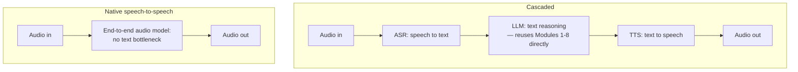

# Voice and Realtime

This chapter opens Module 9's tour of the frontier — areas where the engineering practice is still settling, the tooling changes month to month, and the right answer for a given project depends more on current constraints than on established best practice. Voice is the clearest example of why frontier chapters need a different tone than the rest of this curriculum: **[api-04](../02-llm-apis/api-04-multimodal.md) already covered multimodal input and output generally; this chapter is specifically about what changes when the modality is spoken conversation happening in real time**, because latency and turn-taking introduce constraints text-based multimodal interaction simply doesn't have, and no amount of prompting or model quality fixes a conversation that feels laggy or that can't handle being interrupted.

## Intuition: voice has a clock that text doesn't

A text chat interface has no strict latency requirement beyond "reasonably responsive" — a user tolerates a few seconds for a thoughtful answer, and streaming ([api-05](../02-llm-apis/api-05-streaming-caching-batch.md)) further softens perceived wait by showing tokens as they arrive. **Spoken conversation has no equivalent slack**: human conversational turn-taking operates on a timescale of a few hundred milliseconds, and a voice assistant that takes even one or two seconds to begin responding reads as broken, not merely slow, because it violates a deeply ingrained expectation about how conversation works that text interfaces never had to meet. This is the chapter's central engineering fact: **voice isn't text with a microphone bolted on, it's a real-time system with a latency budget measured in the same units as human reaction time**, and the entire architecture has to be designed around that constraint from the start.

## Cascaded versus native speech-to-speech architectures

**The cascaded architecture** chains three separate systems: automatic speech recognition (ASR) converts spoken audio to text, the LLM processes that text and generates a text response (everything Modules 1-8 already cover), and text-to-speech (TTS) converts the response back to audio. This is the more mature, more modular approach — each component can be swapped, upgraded, or debugged independently, and it directly reuses this entire curriculum's text-based LLM engineering practice unchanged for the middle stage. Its cost is **cumulative latency**: three sequential processing stages, each with its own processing time, stacked in series, and each translation step (speech-to-text, text-to-speech) is a lossy conversion that can drop paralinguistic information — tone, emphasis, hesitation — that a native audio model could in principle preserve.

**Native speech-to-speech models** process and generate audio directly, without an intermediate text representation, using architectures trained end-to-end on audio tokens rather than composing separately-trained ASR, LLM, and TTS systems.[^defossez-moshi] This eliminates the cascaded approach's stacked latency and its paralinguistic information loss — tone, timing, and prosody can be modeled directly rather than discarded at a text bottleneck — at the cost of a less mature, less modular technology where the underlying model's text-domain reasoning capability (everything Modules 1-8 establish about model behavior) may not transfer as cleanly, since it's a genuinely different model family rather than a text LLM with new endpoints attached.

*The two architectures — cascaded's modularity and stacked latency, native's directness and technical immaturity:*

**Provider-hosted realtime APIs** increasingly abstract this choice behind a single interface — a WebSocket or WebRTC connection handling audio streaming, turn detection, and interruption, whether the underlying implementation is cascaded or native.[^openai-realtime] For most application engineers, the practical decision is less "build a cascaded pipeline from scratch" and more "which provider's realtime offering meets the latency and quality bar for this specific use case" — an instance of [api-06](../02-llm-apis/api-06-model-selection.md)'s model-selection framework applied to a voice-specific capability axis.

## The latency budget

**Every stage in the pipeline consumes part of a strict, shared budget**, and the engineering discipline is treating that budget as a hard constraint from the start rather than an afterthought to optimize once something is working. Network round-trip time, ASR processing (if cascaded), the LLM's time-to-first-token ([prd-02](../06-production/prd-02-inference-and-serving.md)'s TTFT, directly relevant here since it's now on the critical conversational path rather than a background metric), TTS generation and audio buffering — each stage's latency stacks, and the target for a conversation to feel natural is often cited around several hundred milliseconds end-to-end, a much tighter bar than any text-based latency target this curriculum has discussed.

**This reframes several prior-module techniques as voice-critical rather than merely nice-to-have**: streaming ([api-05](../02-llm-apis/api-05-streaming-caching-batch.md)) isn't optional for voice, it's structural — TTS needs to begin generating audio from the first tokens of a streaming LLM response rather than waiting for the full response, chaining streaming through every stage of the cascade. Prompt caching becomes more valuable when every millisecond of TTFT is now perceptible conversational lag rather than an abstract cost metric. And model selection ([api-06](../02-llm-apis/api-06-model-selection.md)) tilts harder toward smaller, faster models than a text-only latency budget would justify, because the voice-specific latency ceiling is so much tighter.

## Turn-taking and interruption: unsolved UX problems with partial answers

**Turn-taking** — knowing when the user has finished speaking and it's the system's turn to respond, versus when they've merely paused mid-thought — is a genuinely hard problem current systems handle imperfectly. Simple approaches use a fixed silence threshold (respond after N milliseconds of silence), which trades off false starts (responding while the user was still thinking) against sluggishness (waiting too long after a genuine pause), and more sophisticated approaches use prosodic and semantic cues to distinguish a mid-thought pause from an actual conversational turn end — but this remains an active area of development rather than a solved problem with one correct answer, and different products reasonably make different trade-offs depending on their specific conversational context.

**Interruption handling** — allowing the user to speak over the system's response and having the system stop, listen, and respond to the interruption rather than talking over the user or ignoring them — is functionally required for a conversation to feel natural (humans interrupt each other constantly and unremarkably), but it introduces real engineering complexity: the system needs to detect the interruption quickly, halt in-flight audio generation cleanly, and decide how to handle a response that was cut off mid-thought (discard it, resume it later, or treat the interruption as a new turn entirely) — a state-management problem with no universally agreed-on best practice yet.

**Both problems connect to [prd-04](../06-production/prd-04-reliability.md)'s reliability framing in an unexpected way**: a voice system needs graceful degradation for turn-taking and interruption failures specifically, because a misfire here (responding too early, failing to yield to an interruption) is immediately and viscerally noticeable to the user in a way a text system's equivalent hiccup (a slightly awkward response) usually isn't — the failure mode is more visible, which raises the bar on how carefully these specific paths need to be engineered and tested.

## Production engineering perspective

- **Treat the latency budget as a hard constraint from architecture selection onward**, not an optimization pass after the system works — it shapes the cascaded-versus-native decision, the model-selection decision, and the streaming-implementation requirement from the start.
- **Chain streaming through every pipeline stage**, not just the LLM call — TTS generation should begin on partial LLM output, and the overall design should minimize any stage that must wait for a complete upstream output before starting its own work.
- **Choose cascaded architecture by default for most production use cases today**, given its maturity and its direct reuse of the rest of this curriculum's text-LLM engineering practice — reserve native speech-to-speech for cases specifically needing the paralinguistic fidelity or latency floor only a native architecture can provide, and revisit this default periodically as native approaches mature.
- **Test turn-taking and interruption handling explicitly and continuously**, not as an incidental side effect of general functional testing — these are the failure modes most visible to users in a voice product.
- **Apply the model-selection framework ([api-06](../02-llm-apis/api-06-model-selection.md)) with voice's tighter latency ceiling as a hard filter**, not just a weighted factor — a model that's otherwise excellent but too slow for the conversational budget is disqualified outright for this use case, differently from how a text application might tolerate the same latency.
- **Expect this area's tooling and best practices to shift quickly** — the experimental status this chapter is tagged with reflects genuine field immaturity, not just a documentation gap, so revisit architecture decisions on a shorter cadence than the rest of this curriculum's production guidance would suggest.

## Historical evolution

**2022–2023:** early voice assistant integrations with LLMs are almost universally cascaded — bolting a capable text LLM onto existing, separately-mature ASR and TTS systems — because no end-to-end audio-native alternative existed at production quality, and the cascaded approach's modularity let teams reuse mature, independently-developed components. **2023–2024:** cascaded latency becomes a well-understood bottleneck as more products attempt conversational voice interfaces, driving specific optimization work — streaming chained through every stage, smaller and faster models selected specifically for the voice latency budget — on top of the existing cascaded architecture rather than replacing it outright. **2024:** provider-hosted realtime APIs formalize much of this optimization behind a managed interface, handling audio streaming, turn detection, and interruption without requiring every application team to solve the latency-budget engineering from scratch.[^openai-realtime] **2024:** native speech-to-speech models demonstrate end-to-end audio processing at meaningfully lower latency and with paralinguistic fidelity cascaded approaches structurally can't match, though generally with less mature tooling and a narrower ecosystem than the cascaded approach's years of separate ASR/LLM/TTS development.[^defossez-moshi] **2024–present:** the field is actively contested between continued cascaded refinement and native speech-to-speech maturation, with turn-taking and interruption handling remaining active, unsettled engineering problems across both architectures — genuinely the frontier this chapter's status reflects, not a settled area awaiting documentation.

## Common misconceptions

- **"Voice is just text with speech recognition and synthesis added."** The latency budget and turn-taking/interruption requirements introduce constraints text interaction never had — it's a different engineering problem with different design priorities, not an additive feature.
- **"Native speech-to-speech is strictly better than cascaded."** It eliminates stacked latency and paralinguistic loss, but at the cost of technical maturity and a less modular, harder-to-debug system — the right choice depends on the specific use case's requirements and the current maturity of available tooling, not a general ranking.
- **"Streaming is a nice latency optimization for voice, same as for text."** For voice, streaming chained through every pipeline stage is structurally required to hit the conversational latency budget at all, not an optional enhancement on top of an already-acceptable baseline.
- **"Turn-taking is a solved problem — just detect silence."** Fixed-silence-threshold turn detection is a real, common baseline, but it trades off false starts against sluggishness and is actively being improved with prosodic and semantic cues — there's no single correct threshold that works for every conversational context.
- **"This is a mature, settled area of practice."** It's explicitly tagged experimental in this curriculum because the tooling, best practices, and even the dominant architecture (cascaded vs. native) are still actively shifting — appropriate humility about this chapter's shelf life is warranted.

## Failure modes and trade-offs

- **Ignoring the latency budget until late in development** — discovering after building a functionally correct voice system that its end-to-end latency feels broken to users, requiring architecture-level rework rather than a tuning pass. *Fix:* treat the latency budget as a hard constraint from the earliest architecture decisions.
- **Not chaining streaming through every stage** — a pipeline that streams the LLM call but waits for complete output before starting TTS reintroduces exactly the latency the streaming investment was meant to eliminate. *Fix:* design every stage to begin work on partial upstream output.
- **Fixed-threshold turn detection tuned for one conversational context deployed in a different one** — false starts or sluggish responses depending on how the actual usage pattern differs from what the threshold was tuned against. *Fix:* test turn-taking explicitly against your actual use case's conversational patterns, not a generic default.
- **No interruption-handling strategy** — the system talks over the user or ignores an interruption entirely, breaking the conversational feel immediately and visibly. *Fix:* explicit design and testing of the interruption state machine (detect, halt, decide how to handle the cut-off response).
- **The central trade-off:** cascaded maturity and modularity versus native latency and fidelity. Cascaded architectures are more mature, more debuggable, and reuse the rest of this curriculum's practice directly, at the cost of stacked latency and lossy intermediate representations; native speech-to-speech removes both costs at the price of a less mature, less modular technology — the right choice is use-case-specific and worth revisiting as the field matures.

## Best practices

- Set an explicit end-to-end latency target before architecture selection, and treat it as a hard constraint, not a later optimization.
- Default to cascaded architecture for most production use cases today, given its maturity; evaluate native speech-to-speech specifically where paralinguistic fidelity or latency floor genuinely require it.
- Chain streaming through every pipeline stage — ASR, LLM, TTS — so no stage waits for a complete upstream output unnecessarily.
- Select models with voice's tighter latency ceiling as a hard filter, not just a weighted factor in the model-selection decision.
- Test turn-taking and interruption handling explicitly, against your actual conversational use case, not a generic default threshold.
- Revisit architecture decisions on a shorter cadence than typical production guidance — this area's tooling and best practices are still moving.
- Treat a voice product's turn-taking and interruption failures as high-visibility reliability issues, since users notice them immediately and viscerally.

## Real-world examples

**The cascaded pipeline that felt broken until streaming was chained through every stage.** A team builds a functionally correct cascaded voice assistant — ASR, LLM, TTS — but implements streaming only for the LLM call, waiting for the complete LLM response before starting TTS generation. The system works correctly but feels sluggish and unnatural in testing. Restructuring TTS to begin generating audio from partial LLM output as it streams in cuts perceived latency substantially, without changing the underlying model or any individual component's raw processing speed — the fix was architectural, not a model swap.

**The turn-detection threshold tuned for the wrong context.** A voice assistant's turn-detection silence threshold, tuned during development against short, simple test utterances, performs well in testing but produces frequent false starts in production against real users who pause mid-thought more often during longer, more complex requests. Retuning the threshold — and layering in a simple semantic check for whether the utterance so far seems grammatically complete — against real production conversational patterns rather than the shorter test utterances closes most of the gap.

**Choosing cascaded over native for maturity, revisited later.** A team evaluates native speech-to-speech for a new voice product, drawn to its lower theoretical latency floor, but finds the available tooling too immature and the model's text-domain reasoning quality noticeably behind the leading text LLMs their cascaded approach could use directly. They ship cascaded, hitting an acceptable (if not optimal) latency budget through aggressive streaming and a smaller, faster model choice, with an explicit plan to re-evaluate native speech-to-speech again in six months as the field matures — treating the decision as a snapshot against the field's current maturity rather than a permanent architectural commitment.

## Interview questions

1. **"Why is voice a fundamentally different engineering problem from text, not just text with a microphone?"** — Model answer: voice has a strict, shared latency budget on the order of a few hundred milliseconds to feel conversationally natural, driven by human conversational turn-taking expectations that text interfaces never had to meet — a delay that would be unremarkable in a chat UI reads as broken in voice. It also introduces turn-taking and interruption as real, unsolved engineering problems with no text equivalent. Both constraints reshape architecture decisions from the ground up, rather than being an incremental feature added on top of a working text system.

2. **"Compare cascaded and native speech-to-speech architectures."** — Model answer: cascaded chains ASR, an LLM, and TTS as separate stages — mature, modular, and it reuses standard text-LLM engineering practice directly for the middle stage, at the cost of stacked latency across three sequential systems and lossy paralinguistic information at each text-conversion boundary. Native speech-to-speech processes audio end-to-end without a text bottleneck, eliminating both the stacked latency and the paralinguistic loss, but with less mature tooling and a model family whose text-domain reasoning may not match the leading text LLMs as cleanly. The right choice depends on the specific use case's latency and fidelity requirements weighed against current tooling maturity.

3. **"Why is streaming structurally required for voice, not just a latency optimization?"** — Model answer: because the end-to-end conversational latency budget is so tight that waiting for any pipeline stage to fully complete before the next stage begins would blow the budget outright — TTS needs to start generating audio from partial LLM output as it streams in, not after the full response completes, and this needs to chain through every stage of the pipeline. For text applications, streaming improves perceived responsiveness on top of an already-acceptable baseline; for voice, it's what makes hitting the latency target possible at all.

4. **"What makes turn-taking a hard problem, and how is it typically approached?"** — Model answer: the system needs to distinguish a genuine end of the user's conversational turn from a mid-thought pause, using only the audio signal available to it — a fixed silence threshold is the common baseline, trading false starts (responding too early) against sluggishness (waiting too long), and more sophisticated approaches add prosodic or semantic cues to better distinguish the two cases. There's no universally correct threshold or approach; it needs to be tuned and tested against the actual conversational patterns of the specific use case, and it remains an active area of development rather than a solved problem.

5. **"How would you design interruption handling for a voice assistant?"** — Model answer: the system needs to detect an interruption quickly (the user speaking while the system is still generating audio), halt in-flight audio generation cleanly, and then make an explicit decision about the cut-off response — discard it, resume it later, or treat the interruption as starting an entirely new turn. This is real state-management complexity with no single agreed-on best practice, and it matters more than it might initially seem because a failure here — talking over the user, or ignoring their interruption — is immediately and viscerally noticeable in a way most text-system failures aren't, which raises the bar on how carefully this specific path needs to be tested.

## Exercises and mini-project

**Exercises**

1. Design the latency budget allocation across ASR, LLM, and TTS stages for a cascaded voice pipeline targeting a few-hundred-millisecond end-to-end target, and justify the split.
2. Argue for cascaded versus native speech-to-speech for two different scenarios: a customer-support phone assistant, and a highly expressive creative-companion voice product.
3. Explain why chaining streaming through every stage matters more for voice than for a text chat interface.
4. Design a turn-detection strategy beyond a fixed silence threshold, incorporating at least one additional signal.
5. Design the interruption-handling state machine for a voice assistant: what states does an in-flight response pass through, and what happens at each transition when interrupted?

**Mini-project: prototype a latency-aware cascaded voice pipeline (or evaluate a realtime API).** Either build a minimal cascaded pipeline (any ASR/LLM/TTS combination you have access to) or use a provider's realtime API: (a) measure end-to-end latency from end of user speech to start of system audio response, across several turns; (b) if building the cascade yourself, ensure streaming is chained through every stage and re-measure; (c) test a simple interruption scenario and observe how the system (or your implementation) handles it; (d) write a short memo comparing measured latency against the several-hundred-millisecond conversational target, and note where the biggest latency contributor was. Target: 3 hours. Success criterion: a measured, stage-by-stage latency breakdown, not just an overall "it feels okay" impression.

**Capstone extension:** this chapter applies [api-04](../02-llm-apis/api-04-multimodal.md)'s multimodal foundations and [api-05](../02-llm-apis/api-05-streaming-caching-batch.md)'s streaming discipline to voice's tighter latency constraints; [prd-02](../06-production/prd-02-inference-and-serving.md)'s TTFT framing and [prd-04](../06-production/prd-04-reliability.md)'s reliability discipline both apply with added urgency here.

## Revision summary

- Voice is a **real-time system problem**, not text with a microphone — a conversational latency budget on the order of a few hundred milliseconds, driven by human turn-taking expectations, is the central constraint shaping every architecture decision.
- **Cascaded** (ASR → LLM → TTS) is mature, modular, and reuses standard text-LLM practice, at the cost of stacked latency and lossy paralinguistic conversion; **native speech-to-speech** eliminates both costs at the price of technical immaturity and less proven text-reasoning transfer.
- **Streaming chained through every pipeline stage is structurally required**, not optional, to hit the voice latency budget — a stage that waits for complete upstream output defeats the purpose.
- **Turn-taking and interruption handling** are genuinely unsolved engineering problems with partial, actively-evolving technical answers (silence thresholds plus prosodic/semantic cues; explicit interruption state machines) — and failures here are immediately, viscerally visible to users.
- This chapter's **experimental status reflects real field immaturity** — architecture decisions here should be revisited on a shorter cadence than typical production guidance.

## Flashcards

| Q | A |
|---|---|
| Why is voice's latency budget so much tighter than text's? | Human conversational turn-taking operates on a few-hundred-millisecond timescale — slower reads as broken, not just slow. |
| Cascaded vs. native speech-to-speech, in one line each? | Cascaded: mature, modular, stacked latency, lossy text conversion. Native: lower latency and fidelity, less mature, less proven reasoning transfer. |
| Why is streaming structurally required for voice? | Waiting for any stage to fully complete before the next starts would blow the conversational latency budget outright. |
| What's the common turn-detection baseline, and its trade-off? | Fixed silence threshold — trades false starts against sluggish responses. |
| What does interruption handling require? | Fast detection, clean halt of in-flight generation, and an explicit decision on how to handle the cut-off response. |
| Why are voice failures more visible than text failures? | A turn-taking or interruption misfire is immediately, viscerally noticeable in a way a text system's equivalent hiccup usually isn't. |
| Why does this chapter carry an "experimental" status? | The dominant architecture, tooling, and best practices are still actively shifting — genuine field immaturity, not a documentation gap. |

## Further reading

- **Official docs:** OpenAI's Realtime API guide[^openai-realtime] and Anthropic's multimodal documentation[^anthropic-voice] — concrete, current provider-hosted approaches.
- **Papers:** the Moshi paper[^defossez-moshi] — a concrete native speech-to-speech architecture, useful for understanding what "end-to-end audio" actually looks like technically.
- **Tutorials:** run the mini-project's latency measurement against any available voice pipeline or realtime API before reading further — the several-hundred-millisecond target is far more concrete once you've measured your own stack against it.

## Check your understanding

1. Explain why voice's latency requirements are categorically different from text's, not just a stricter version of the same constraint.
2. Compare cascaded and native speech-to-speech architectures, and argue for one for a specific use case of your choosing.
3. Explain why streaming needs to chain through every pipeline stage for voice specifically.
4. Design a turn-detection approach beyond a fixed silence threshold, and explain what failure mode it addresses.
5. Walk through the interruption-handling state machine you'd design for a voice assistant, covering detection, halting, and resolution.

## Sources

[^openai-realtime]: [T1] OpenAI. "Realtime API." https://platform.openai.com/docs/guides/realtime (accessed 2026-07-25)
[^anthropic-voice]: [T1] Anthropic. "Multimodal capabilities." https://docs.anthropic.com/en/docs/build-with-claude/vision (accessed 2026-07-25)
[^defossez-moshi]: [T2] Défossez et al. (2024). "Moshi: a speech-text foundation model for real-time dialogue." Kyutai. arXiv:2410.00037. https://arxiv.org/abs/2410.00037 (accessed 2026-07-25)
