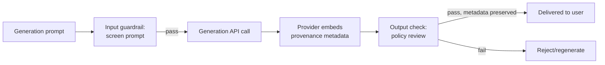

# Generative Media

[api-04](../02-llm-apis/api-04-multimodal.md) covered multimodal LLMs that *understand* images — take an image as input, reason about it, describe it. This chapter is the other direction: models that *generate* images and video as output. The engineering framing here is deliberately narrow and practical: **for an application engineer, generative media is almost entirely an API integration problem**, not a research problem — you are not training diffusion models, you're calling an endpoint, handling its specific failure modes, and building the provenance and safety layer around it, which is exactly the same shape of work this curriculum has applied to text LLMs throughout, adapted to a modality with its own particular risks.

## Intuition: a genuinely different generative mechanism, same API-integration posture

Every text model this curriculum has covered is autoregressive: predict the next token, append it, repeat ([fnd-02](../01-foundations/fnd-02-tokens-and-embeddings.md), [fnd-03](../01-foundations/fnd-03-attention-and-transformers.md)). The dominant architecture behind current image and video generation, **diffusion**, works differently: start from random noise and iteratively denoise it, over many steps, guided by a text prompt, toward a coherent image.[^rombach-latentdiffusion] This is a genuinely different generative mechanism — no next-token prediction, no autoregressive left-to-right structure — but the practical consequence for an application engineer integrating a generation API is smaller than the architectural difference might suggest: **you interact with it through a prompt-in, media-out API contract that rhymes with everything else in this curriculum**, even though what happens inside the model is mechanistically unrelated to anything in Modules 1-8.

## The practical integration pattern

**Prompt engineering for image and video generation is a related but distinct skill from text prompting** ([api-02](../02-llm-apis/api-02-prompting-fundamentals.md)) — descriptive, compositional prompts specifying subject, style, composition, and technical parameters (aspect ratio, resolution) tend to work better than the instruction-style prompts that work well for text tasks, because the model is producing a single dense visual artifact rather than following a multi-step reasoning or task-completion instruction. This is a real, separate prompting literacy worth building deliberately rather than assuming text-prompting skill transfers directly.

**Latency and cost profiles differ substantially from text generation.** Image and video generation is typically far more compute-intensive per request than a comparable text completion, and generation times can range from a few seconds (single images) to minutes (video), which reframes the streaming and latency-budget thinking from [api-05](../02-llm-apis/api-05-streaming-caching-batch.md) and [prd-02](../06-production/prd-02-inference-and-serving.md): most generative media integrations need an async job pattern (submit a generation request, poll or receive a webhook for completion) rather than a synchronous request-response call, and UX design needs to account for a wait that's often much longer than even an uncached text completion.

**Iteration and refinement patterns matter more here than for text.** Because a single generation is expensive and results are less predictable than text completions, production integrations commonly generate multiple candidates per request and let the user (or an automated quality check) select or request refinement — closer in spirit to [prd-05](../06-production/prd-05-cost-engineering.md)'s cascade pattern than to a single deterministic call, and worth budgeting for explicitly in both cost and UX design.

## Provenance and misuse risk

**This is the section of the chapter most directly connected to Module 7**, because generative media carries a risk profile text generation doesn't have to the same degree: a generated image or video can be indistinguishable from an authentic photograph or recording to a casual viewer, which creates a class of misuse (deepfakes, fabricated evidence, impersonation) with real-world consequences well beyond what a fabricated block of text typically causes.

**Content provenance standards** address this directly: C2PA (Coalition for Content Provenance and Authenticity) defines a technical specification for embedding cryptographically verifiable metadata into generated (and captured) media, recording its origin and edit history so a downstream viewer or platform can verify whether a piece of media was AI-generated and trace its provenance.[^c2pa-spec] Several major generative media providers now embed this kind of provenance metadata by default, and an application integrating generation should preserve rather than strip it through any downstream processing pipeline — stripping provenance metadata, even unintentionally through a naive image-processing step, defeats a safety mechanism that took real standardization effort to establish.

**Visible and invisible watermarking** are complementary, weaker-but-broader mechanisms: a visible watermark clearly signals AI-generated content to any viewer at the cost of being easily cropped or edited out; invisible (embedded, statistical) watermarking survives more processing but requires a detection tool to check, and neither is foolproof against a determined adversary — the honest framing, consistent with [sec-01](../07-safety-security/sec-01-prompt-injection.md) and [sec-02](../07-safety-security/sec-02-guardrails.md)'s posture throughout Module 7, is that these are risk-reduction layers, not guarantees.

**Application-layer responsibility**: an application integrating generative media should apply the same input/output guardrail thinking from [sec-02](../07-safety-security/sec-02-guardrails.md) to this modality specifically — input guardrails screening generation prompts for clearly disallowed content before spending generation cost, output checks (automated or human) for policy-violating generated content before it reaches a user or gets published, and a clear usage policy communicating what the generated media can and can't be used for, particularly around impersonation, misinformation, and any depiction of real, identifiable people.

*Where provenance and guardrail responsibility sit relative to the generation call:*

## Production engineering perspective

- **Treat image/video generation prompting as a distinct skill**, worth its own iteration and documentation, rather than assuming text-prompting technique transfers directly.
- **Design for async generation by default** — job submission, polling or webhooks, and a UX that accounts for multi-second-to-multi-minute wait times, rather than assuming synchronous request-response.
- **Budget for multi-candidate generation** where quality is unpredictable enough to warrant it, treating cost per successfully-used output (not per raw generation call) as the real metric, echoing [prd-05](../06-production/prd-05-cost-engineering.md)'s cost-per-completed-task framing.
- **Preserve provenance metadata through your entire pipeline** — verify that any downstream image processing, resizing, or re-encoding doesn't strip C2PA or watermark data unintentionally.
- **Apply input and output guardrails specifically scoped to generative media risks** — impersonation of real people, fabricated depictions, policy-violating content — as a distinct guardrail category from the text-focused checks in [sec-02](../07-safety-security/sec-02-guardrails.md).
- **Write and communicate a clear usage policy** for what generated media in your product can and can't depict or be used for, particularly regarding real, identifiable individuals.

## Historical evolution

**2021–2022:** diffusion models demonstrate image generation quality substantially exceeding prior generative approaches (GANs, autoregressive pixel models), establishing diffusion as the dominant architecture for image generation and setting up the API-accessible generative media products that follow.[^rombach-latentdiffusion] **2022–2023:** image generation becomes widely accessible through consumer products and developer APIs, and prompt engineering for image generation emerges as a distinct, actively-discussed skill separate from text prompting. **2023–2024:** as generation quality improves to the point of frequent indistinguishability from authentic photography, provenance and misuse concerns move from a research/policy discussion to a concrete engineering requirement, driving standardization efforts like C2PA and the default embedding of provenance metadata by major providers.[^c2pa-spec] **2023–2024:** video generation matures rapidly behind image generation, extending the same diffusion-based approach (with additional temporal-coherence challenges) to a substantially more compute-intensive and slower-to-generate modality, reinforcing the async-integration-pattern requirement. **2024–present:** generative media integration has matured into a standard, if still fast-moving, application-engineering practice — async job patterns, multi-candidate generation, and provenance-preserving pipelines are increasingly standard rather than bespoke, even as the underlying model quality and available capabilities continue to shift quickly, which is why this chapter carries an experimental status alongside the rest of Module 9.

## Common misconceptions

- **"Image generation prompting works the same as text prompting."** It's a related but distinct skill — descriptive, compositional prompts specifying subject, style, and composition tend to outperform instruction-style prompts that work well for text tasks.
- **"Generative media APIs behave like text completion APIs, just slower."** The latency and cost profile is different enough (seconds to minutes, higher per-request compute cost) that most integrations need an async job pattern rather than a synchronous call, and the UX design has to account for that directly.
- **"Provenance metadata is the provider's problem, not mine."** An application's own image-processing pipeline (resizing, re-encoding, cropping) can unintentionally strip provenance metadata a provider embedded by default — preserving it through your own pipeline is your responsibility too.
- **"Watermarking solves the misuse problem."** Both visible and invisible watermarking are risk-reduction layers, not guarantees — neither is foolproof against a determined adversary, consistent with Module 7's probabilistic-risk-reduction framing throughout.
- **"This is a mature, settled integration pattern."** Model capability, provider offerings, and even provenance standards are still moving quickly enough that this chapter, like the rest of Module 9, carries an explicitly experimental status.

## Failure modes and trade-offs

- **Assuming synchronous integration works for generation** — a UX or API design built around instant response breaks against generation latencies of seconds to minutes. *Fix:* async job pattern by default, with UX designed around the actual wait.
- **Naive image-processing pipelines stripping provenance metadata** — an unintentional side effect of resizing or re-encoding that defeats a safety mechanism the provider had already established. *Fix:* explicitly verify provenance metadata survives your processing pipeline.
- **No generative-media-specific guardrails** — applying only text-focused guardrail thinking to a modality with a categorically different misuse risk profile (deepfakes, impersonation, fabricated depictions). *Fix:* a distinct guardrail category scoped to generative media's specific risks.
- **Treating watermarking as sufficient protection** — building a misuse-prevention strategy that relies entirely on watermarking without input/output guardrails or usage policy. *Fix:* defense in depth, same as Module 7's general posture — watermarking is one layer, not the whole strategy.
- **The central trade-off:** generation quality/flexibility versus predictability and cost. More capable generation models often mean higher cost and less predictable single-shot output quality, pushing toward multi-candidate generation strategies that trade additional cost for a better chance of a usable result — the right balance depends on the product's tolerance for cost per successfully-used output versus per raw call.

## Best practices

- Treat generative media prompting as a distinct skill from text prompting, with its own iteration and internal documentation.
- Design integrations around async job submission and polling/webhooks by default, with UX built around realistic generation latency.
- Budget for multi-candidate generation where output quality is unpredictable, measuring cost per successfully-used output.
- Verify and preserve provenance metadata through every stage of your own processing pipeline.
- Apply guardrails specifically scoped to generative media's misuse risks — impersonation, fabricated depictions of real people, policy-violating content.
- Write and communicate an explicit usage policy for what your product's generated media can and can't depict.
- Revisit provider capabilities and provenance-standard adoption periodically, given how quickly this area is still moving.

## Real-world examples

**The synchronous UI that had to be rebuilt.** A team initially builds a product feature around synchronous image generation, expecting response times comparable to a text completion. Real generation latency of ten to twenty seconds per image makes the synchronous UI feel broken — users assume the request failed and retry, compounding load. Rebuilding around an async job pattern — immediate acknowledgment, a visible progress state, and a notification or poll-driven completion — fixes the perceived reliability problem without changing the underlying generation speed at all.

**The processing pipeline that silently stripped provenance.** A team's image-processing pipeline resizes and re-encodes all generated images before storage, unaware that this step strips the C2PA provenance metadata the generation provider had embedded by default. The gap is discovered only when a downstream partner integration expects to verify image provenance and finds none present. Adjusting the resize/re-encode step to explicitly preserve the metadata container closes the gap — a fix that required someone to specifically check for it, since the pipeline otherwise worked correctly by every other measure.

**Multi-candidate generation as the actual cost-effective choice.** A team initially generates a single image per request to minimize cost, then finds their user-facing acceptance rate (how often the single generated image is actually usable without regeneration) is low enough that users frequently retry manually — meaning the "cheaper" single-generation approach was actually costing more per successfully-used image once retries are counted. Switching to generating three candidates per request and letting the user pick raises the per-request cost but lowers the cost per successfully-used output, and improves user-perceived quality since they're choosing among options rather than accepting or manually retrying a single result.

## Interview questions

1. **"How does diffusion-based image generation differ from the autoregressive text generation this curriculum otherwise covers, and does that difference matter for API integration?"** — Model answer: diffusion starts from random noise and iteratively denoises it toward a coherent image guided by a text prompt, a fundamentally different mechanism from autoregressive next-token prediction — no left-to-right sequential generation at all. For an application engineer, though, this mechanistic difference matters less than it might seem, because the integration pattern is still prompt-in, media-out through an API — what changes practically is the latency profile (seconds to minutes, not milliseconds to seconds) and the prompting style, not the fundamental shape of the integration work.

2. **"Why does generative media typically need an async integration pattern where text generation often doesn't?"** — Model answer: generation is far more compute-intensive per request than a comparable text completion, with latencies ranging from several seconds for a single image to minutes for video — far beyond what a synchronous request-response pattern or even standard text streaming can comfortably absorb. Production integrations submit a generation job and poll or receive a webhook on completion, with UX explicitly designed around that wait, rather than assuming the near-real-time responsiveness a streaming text completion can provide.

3. **"What's the misuse risk specific to generative media that doesn't apply the same way to text generation?"** — Model answer: generated images and video can be visually indistinguishable from authentic photography or recordings to a casual viewer, enabling deepfakes, fabricated evidence, and impersonation with real-world consequences well beyond what fabricated text typically causes. This is why content provenance — cryptographically verifiable metadata recording a piece of media's AI-generated origin, standardized through efforts like C2PA — and watermarking are much more central concerns for this modality than for text generation.

4. **"How would you design the safety layer around a generative media feature in a product?"** — Model answer: input guardrails screening generation prompts for clearly disallowed requests before spending generation cost, output checks — automated or human — for policy-violating generated content before it reaches a user, provenance metadata preserved through the entire pipeline rather than stripped by incidental image processing, and a clear usage policy on what generated media can depict, particularly around real, identifiable people. I'd treat watermarking and provenance as one risk-reduction layer among several, not a complete solution, consistent with how Module 7 frames every guardrail mechanism.

5. **"Why might generating multiple candidates per request be more cost-effective than generating one, despite the higher per-request cost?"** — Model answer: because the real cost metric is cost per successfully-used output, not cost per raw generation call — if single-candidate generation has a low acceptance rate and drives frequent manual retries, the effective cost per usable result can be higher than a multi-candidate approach with better odds of producing at least one acceptable result per request. It's the same cost-per-completed-task reframing prd-05 applies generally, just applied to generation quality variance instead of model routing.

## Exercises and mini-project

**Exercises**

1. Draft a descriptive, compositional image-generation prompt for a specific visual target, and contrast it with how you'd phrase the equivalent request as a text-generation instruction.
2. Design the async job UX for an image-generation feature: what does the user see between submission and completion?
3. Design a guardrail check specifically for generative-media misuse risk (impersonation of a real person) that wouldn't be caught by a text-focused guardrail.
4. Given a product's image-processing pipeline (resize, re-encode, watermark overlay), identify where provenance metadata could be unintentionally stripped and how you'd verify it survives.
5. Argue for single-candidate versus multi-candidate generation for two different use cases, using cost-per-successfully-used-output reasoning.

**Mini-project: integrate and provenance-check a generation API.** Using any available image-generation API: (a) generate several images using descriptive, compositional prompts, iterating on prompt style; (b) implement the request as an async pattern even if the API is fast enough to feel synchronous, to practice the pattern; (c) check whether the provider embeds provenance metadata in the output, and verify whether it survives a basic processing step (resize or re-encode) you apply; (d) write a short usage-policy paragraph for a hypothetical product feature using this generation capability, specifically addressing what it can't be used to depict. Target: 2 hours. Success criterion: a working generation integration with an explicit provenance check — pass or fail — rather than an assumption either way.

**Capstone extension:** this chapter extends [api-04](../02-llm-apis/api-04-multimodal.md)'s multimodal foundations to generation rather than understanding; its guardrail discipline reuses [sec-02](../07-safety-security/sec-02-guardrails.md) directly, and its cost framing reuses [prd-05](../06-production/prd-05-cost-engineering.md).

## Revision summary

- Generative media (image/video) uses **diffusion**, a mechanistically different generative process from the autoregressive text models this curriculum otherwise covers — but for an application engineer, it's still a **prompt-in, media-out API integration problem**.
- Image/video prompting is a **distinct skill** from text prompting — descriptive, compositional prompts outperform instruction-style ones.
- Generation latency (seconds to minutes) and cost profiles typically require an **async job pattern**, not synchronous request-response, and often justify **multi-candidate generation** measured by cost per successfully-used output.
- **Provenance** (C2PA metadata) and **watermarking** (visible and invisible) are risk-reduction layers against misuse (deepfakes, impersonation, fabricated depictions) — preserve provenance metadata through your own processing pipeline; don't treat watermarking as sufficient alone.
- This is the frontier chapter with the most direct line back to Module 7: input/output guardrails, defense in depth, and an explicit usage policy all apply here, scoped to generative media's specific misuse risks.

## Flashcards

| Q | A |
|---|---|
| What generative mechanism underlies most image/video generation? | Diffusion — iterative denoising from random noise, guided by a prompt — not autoregressive next-token prediction. |
| How does image-generation prompting differ from text prompting? | Descriptive, compositional prompts (subject, style, composition) outperform instruction-style prompts. |
| Why does generation typically need an async integration pattern? | Latencies of seconds to minutes, far beyond what synchronous request-response or text streaming can absorb. |
| Why might multi-candidate generation be more cost-effective? | Cost per successfully-used output can be lower than single-candidate generation with a low acceptance rate. |
| What does C2PA provenance metadata do? | Embeds cryptographically verifiable origin/edit-history metadata so viewers can verify AI-generated content. |
| Is watermarking a complete misuse solution? | No — a risk-reduction layer, not a guarantee; neither visible nor invisible watermarking is foolproof. |
| What's the biggest misuse risk specific to generative media? | Visual indistinguishability from authentic media enabling deepfakes, impersonation, and fabricated evidence. |

## Further reading

- **Official docs:** OpenAI's image generation guide[^openai-images] — a concrete, current provider API reference.
- **Standards:** the C2PA technical specification[^c2pa-spec] — the provenance standard this chapter's safety discussion centers on.
- **Papers:** Rombach et al. (latent diffusion)[^rombach-latentdiffusion] — the architectural foundation behind most current image generation.
- **Tutorials:** run the mini-project's provenance check on a real generation API and your own processing pipeline before shipping any generative media feature — the metadata-stripping failure mode is easy to introduce unintentionally and easy to verify against directly.

## Check your understanding

1. Explain how diffusion-based generation differs mechanistically from autoregressive text generation, and why that difference matters less than expected for API integration.
2. Design the async job pattern and UX for a generative media feature, and justify why a synchronous pattern would fail.
3. Explain what C2PA provenance metadata does and why an application's own processing pipeline could unintentionally defeat it.
4. Design a guardrail scoped specifically to generative media's misuse risk, distinct from a text-focused guardrail.
5. Argue for when multi-candidate generation is worth its added cost, using cost-per-successfully-used-output reasoning.

## Sources

[^openai-images]: [T1] OpenAI. "Image generation." https://platform.openai.com/docs/guides/image-generation (accessed 2026-07-26)
[^c2pa-spec]: [T3] Coalition for Content Provenance and Authenticity. "C2PA Technical Specification." https://c2pa.org/specifications/specifications/2.1/index.html (accessed 2026-07-26)
[^rombach-latentdiffusion]: [T1] Rombach et al. (2022). "High-Resolution Image Synthesis with Latent Diffusion Models." arXiv:2112.10112. https://arxiv.org/abs/2112.10112 (accessed 2026-07-26)
