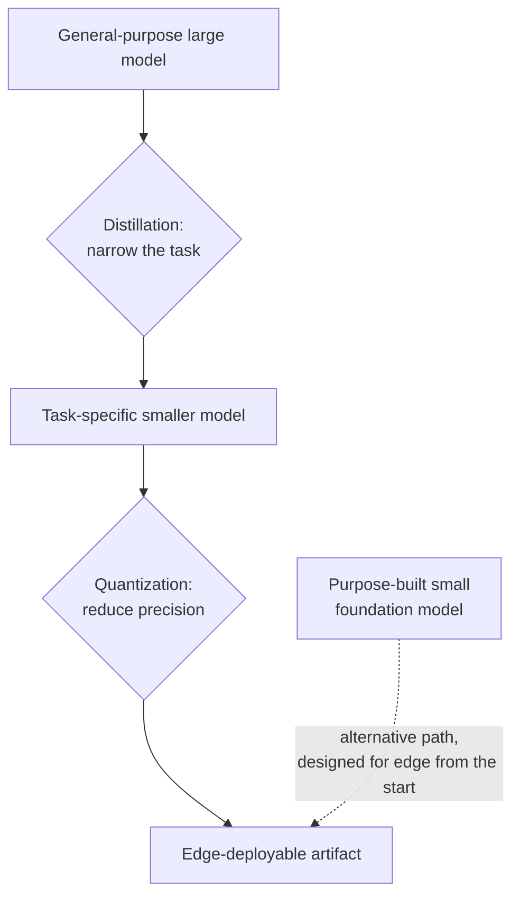

# Edge and On-Device Inference

[api-07](../02-llm-apis/api-07-local-inference.md) covered local inference generally — running an open-weight model on your own hardware instead of calling a hosted API. This chapter narrows that to the hardest version of the problem: running a model **on the end-user's device itself** — a phone, a laptop, an embedded system — rather than on any server you control, local or otherwise. The resource envelope here is categorically tighter than anything else in this curriculum has assumed: no data-center GPU, no elastic scaling, often no reliable network connection, and a battery and thermal budget a server rack never has to think about.

## Intuition: the constraint isn't "smaller," it's "a different kind of scarce"

Every optimization technique this curriculum has covered — quantization ([prd-03](../06-production/prd-03-inference-optimization.md)), distillation ([ftn-06](ftn-06-distillation-and-slms.md)), model selection ([api-06](../02-llm-apis/api-06-model-selection.md)) — was framed against server-side constraints: memory bandwidth, GPU cost per hour, latency SLOs measured in the hundreds of milliseconds. Edge deployment inherits all of those pressures *and adds new ones that don't exist server-side at all*: a hard device memory ceiling shared with every other app running (not a provisionable resource), a battery budget that makes sustained high compute utilization a real user-experience cost, thermal throttling that can degrade performance mid-session as the device heats up, and hugely heterogeneous hardware (this year's flagship phone versus a three-year-old mid-range one) that a server fleet, provisioned to a known spec, never has to accommodate. **The engineering discipline isn't "apply the same techniques a bit more aggressively," it's recognizing that edge deployment is optimizing against a different, harsher constraint surface entirely**, which is why it gets its own chapter rather than a paragraph in [prd-03](../06-production/prd-03-inference-optimization.md).

## How the compression toolkit compounds for edge targets

**Quantization and distillation, covered separately in [prd-03](../06-production/prd-03-inference-optimization.md) and [ftn-06](ftn-06-distillation-and-slms.md) as independent techniques with independent motivations, are typically both applied together and pushed harder for edge deployment than either would be for a server-side deployment.** A server-side quantization decision weighs a modest latency/cost gain against a modest quality cost; an edge deployment decision is often binary — the model either fits in the device's memory ceiling at a given quantization level, or it doesn't run at all, which changes quantization from an optimization to a hard feasibility gate.

**This is also where distillation's narrow-task framing from [ftn-06](ftn-06-distillation-and-slms.md) becomes not just cost-effective but often the only viable option**: a general-purpose large model has no path onto most edge hardware regardless of quantization level, but a small model distilled for a specific, narrow on-device task — voice command parsing, on-device text prediction, a specific classification task — can fit comfortably, because the distillation process already discarded the general capability the edge deployment could never have hosted anyway.

**Purpose-built small foundation models** — like Apple's on-device foundation models[^apple-oss-foundation] and Google's Gemini Nano[^gemini-nano] — represent a further step: rather than distilling a general model down and hoping it fits, these are designed from the outset with edge deployment as a first-class constraint, trading breadth of capability for a genuinely different point on the size/capability curve than a compressed version of a large model would land on. Runtime frameworks like llama.cpp[^gerganov-llamacpp] have separately made running open-weight models efficiently on consumer hardware substantially more accessible, closing part of the gap between "research capability" and "actually runs on a phone."

*The compression stack for edge deployment — quantization and distillation compounding, sometimes replaced entirely by a purpose-built small model:*

## The two advantages that motivate the effort

**Offline capability**: an on-device model works with no network connection at all, which matters for applications needing to function in low-connectivity environments, or for latency-critical interactions where even a fast network round-trip is worse than local, zero-network-hop inference. This is a genuine capability advantage no amount of server-side optimization can match, because the constraint being solved (no network available) isn't a latency problem, it's an availability problem.

**Privacy by architecture**: data processed entirely on-device never has to leave the device at all, which sidesteps the entire data-transmission and provider-retention question [sec-03](../07-safety-security/sec-03-privacy-compliance.md) built a compliance framework around — not because the compliance obligations disappear, but because the specific risk of transmitting personal data to a third-party processor doesn't apply when there's no transmission. **This is worth stating precisely rather than as a blanket claim**: on-device processing eliminates the transmission-related privacy surface specifically, but it doesn't eliminate every privacy consideration (on-device logs and caches are still a surface, per [sec-03](../07-safety-security/sec-03-privacy-compliance.md)'s general framework) — it's a genuine, architecturally-enforced privacy improvement for the specific risk it addresses, not a privacy solution in the abstract.

## The hybrid cloud-edge pattern most production systems land on

**Pure on-device deployment is the exception, not the default, for most production LLM features today**, given how much capability edge hardware constraints still sacrifice relative to a server-hosted large model. The pattern most systems actually converge on is **hybrid routing**: handle what the on-device model can competently do locally — often a narrow, well-scoped task the model was specifically distilled or designed for — and fall back to a server-hosted, more capable model for anything beyond that scope, over the network when available.

This is directly [prd-05](../06-production/prd-05-cost-engineering.md)'s routing-cascade pattern, applied at the edge-versus-cloud boundary rather than the cheap-model-versus-expensive-model boundary within a single server-side system: route to the fast, free, offline-capable, privacy-preserving local model first, and escalate to the cloud only when the task genuinely exceeds the local model's scope — with the same requirement [prd-05](../06-production/prd-05-cost-engineering.md) established generally that the escalation trigger needs to be a real, validated signal rather than an assumption, since a poorly-tuned trigger either escalates too often (losing the offline/privacy/latency advantage) or too rarely (silently serving degraded local-model output on tasks it can't actually handle).

## Production engineering perspective

- **Treat the device memory and battery/thermal budget as hard feasibility gates**, not optimization targets to approach asymptotically — an edge deployment decision is often binary (fits or doesn't), unlike a server-side latency/cost trade-off that can be tuned incrementally.
- **Compound distillation and quantization deliberately for edge targets**, pushing both harder than a server-side deployment would typically warrant, given the tighter constraint.
- **Evaluate purpose-built small foundation models as an alternative to compressing a general model down**, particularly for capability needs a distilled-and-quantized general model can't comfortably meet within the edge budget.
- **Default to hybrid cloud-edge routing** for most production features, scoping the on-device model to a specific, well-validated task and escalating to cloud for anything beyond it — the routing trigger needs the same validation rigor [prd-05](../06-production/prd-05-cost-engineering.md) requires for any cascade.
- **Test against realistic hardware heterogeneity**, not just the newest flagship device — a model that performs acceptably on this year's top-tier phone may be infeasible on the actual distribution of devices your user base runs.
- **Scope the privacy claim precisely**: on-device processing removes the transmission-related privacy surface specifically, and still needs [sec-03](../07-safety-security/sec-03-privacy-compliance.md)'s general PII discipline applied to on-device logs, caches, and any local storage.

## Historical evolution

**2020–2022:** on-device language model deployment is largely limited to small, narrow-task models — keyboard prediction, simple voice commands — well below the capability of contemporary server-hosted large models, reflecting how far edge hardware constraints trailed frontier model scale. **2023:** as quantization and PEFT techniques mature ([ftn-02](ftn-02-fine-tuning-methods.md)), and as consumer hardware (particularly newer phone chipsets with dedicated neural processing units) gains more on-device compute capability, meaningfully more capable models become edge-deployable, though still well behind server-hosted frontier capability. **2023–2024:** runtime frameworks like llama.cpp mature into genuinely accessible tools for running open-weight models efficiently on consumer hardware, substantially lowering the engineering barrier to edge experimentation.[^gerganov-llamacpp] **2024:** major platform vendors ship purpose-built, on-device-first foundation models as a first-class product feature — Apple's on-device foundation models and Google's Gemini Nano both represent models designed from the outset for the edge constraint rather than compressed after the fact — establishing hybrid cloud-edge routing as the mainstream production pattern rather than a niche optimization.[^apple-oss-foundation][^gemini-nano] **2024–present:** the gap between edge-deployable and server-hosted capability continues to narrow but remains substantial for general-purpose tasks, keeping hybrid routing (rather than pure edge deployment) the dominant production pattern, and keeping this area's tooling and capability boundary evolving quickly enough to warrant this chapter's experimental status.

## Common misconceptions

- **"Edge deployment is just server-side optimization applied harder."** The constraint surface is categorically different — device memory ceiling, battery/thermal budget, hardware heterogeneity — not merely a stricter version of server-side latency/cost trade-offs.
- **"On-device processing solves privacy entirely."** It eliminates the transmission-related privacy surface specifically; on-device logs, caches, and local storage still need the general PII discipline sec-03 established.
- **"A quantized, distilled version of a large model is always the right approach for edge."** Purpose-built small foundation models designed for edge from the outset are often a better-fitting alternative than compressing a general-purpose large model down after the fact.
- **"Once a model runs on the newest flagship device, it's edge-ready."** Production edge deployment needs testing against realistic hardware heterogeneity across the actual device distribution your users have, not just the newest hardware.
- **"Pure on-device deployment is the goal to work toward."** For most production features today, hybrid cloud-edge routing — not pure on-device — is the pragmatic, capability-preserving default, given how much general capability edge constraints still sacrifice.

## Failure modes and trade-offs

- **Treating device memory as a soft optimization target** — a model that "mostly fits" on a device doesn't run at all in practice; the constraint is binary. *Fix:* treat memory (and battery/thermal budget) as hard feasibility gates from the earliest design stage.
- **Testing only against flagship hardware** — a model that performs acceptably on the newest device may be infeasible across the real, heterogeneous device distribution in production. *Fix:* test against a realistic hardware spread, not just the best-case device.
- **An unvalidated hybrid-routing escalation trigger** — either escalates too often (losing offline/privacy/latency benefits) or too rarely (serving degraded local output silently on tasks beyond the local model's scope). *Fix:* the same routing-trigger validation rigor prd-05 requires for any cascade.
- **Overclaiming the privacy benefit of on-device processing** — treating "it's on-device" as a complete privacy solution rather than a specific, real improvement to the transmission surface only. *Fix:* apply sec-03's general PII discipline to on-device storage and logs too.
- **The central trade-off:** capability versus deployability. A purpose-built or heavily-compressed edge model trades general capability for the ability to run at all within the device constraint — the right scope for that trade is a narrow, well-validated task, not an attempt to replicate server-side general capability on-device.

## Best practices

- Treat device memory, battery, and thermal budgets as hard feasibility gates, not soft optimization targets.
- Compound distillation and quantization deliberately, and evaluate purpose-built small foundation models as an alternative path.
- Default to hybrid cloud-edge routing, scoping the on-device model to a specific, validated task and escalating to cloud for anything beyond it.
- Validate the routing escalation trigger explicitly — measure over- and under-escalation, don't assume a threshold works.
- Test against a realistic spread of device hardware, not just the newest or highest-spec device available.
- Scope privacy claims precisely: on-device processing solves the transmission surface, not every privacy consideration.
- Revisit the edge-versus-cloud capability boundary periodically, given how quickly on-device model capability is still moving.

## Real-world examples

**The model that "mostly fit."** A team's compressed, distilled model runs comfortably on their own development devices — recent, high-spec phones — but field testing against their actual user base's device distribution reveals it fails to load at all on a meaningful fraction of older or lower-memory devices, a binary failure invisible during development on newer hardware. The fix requires either further compression (accepting more capability loss) or a stricter hybrid-routing fallback for devices below a memory threshold — a decision that could have been made earlier and more deliberately had realistic hardware testing happened before the capability trade-offs were locked in.

**Hybrid routing outperforming pure cloud or pure edge.** A team building an on-device voice command feature initially considers a pure cloud approach (send audio to a server, get a response) for maximum capability, and separately considers pure on-device for maximum privacy and offline support. Landing on hybrid routing — a small, distilled on-device model handling a well-scoped set of common commands locally and instantly, escalating to cloud only for genuinely novel requests outside that scope — captures most of both advantages: fast, offline, private handling of the common case, full capability preserved for the uncommon case, validated by measuring the escalation rate against real usage rather than assuming the split.

**The privacy claim that needed scoping.** A team markets an on-device feature as fully private, but a security review finds that while the model inference itself never leaves the device, diagnostic logs capturing the same processed content are being uploaded for crash-reporting purposes — an on-device-processing claim that was accurate about the transmission surface being addressed but incomplete about the actual data flow, exactly the gap sec-03's general PII-surface-mapping discipline is built to catch. Scoping the logging pipeline to exclude the processed content (or redacting it) closes the actual gap between the marketing claim and the real data flow.

## Interview questions

1. **"Why is edge deployment a categorically different engineering problem from server-side inference optimization, not just a stricter version of it?"** — Model answer: server-side optimization (quantization, distillation) trades off against provisionable resources — memory bandwidth, GPU cost per hour — that can be tuned incrementally against a latency or cost target. Edge deployment adds constraints that don't exist server-side at all: a hard device memory ceiling shared with other apps, a battery and thermal budget that punishes sustained compute, and huge hardware heterogeneity across the real device distribution — and critically, the memory constraint is often binary (fits or doesn't run at all) rather than a dial to tune, which changes the nature of the engineering decision.

2. **"How do distillation and quantization compound specifically for edge targets?"** — Model answer: both techniques, covered independently for server-side use in prd-03 and ftn-06, are typically applied together and pushed further for edge — distillation narrows the model to a specific task small enough to be worth deploying at all on constrained hardware, and quantization then reduces its footprint to actually fit the device's memory ceiling. For edge, quantization is often a hard feasibility gate rather than a quality/cost trade-off knob, which is a meaningfully different framing than the server-side optimization decision.

3. **"What does on-device processing actually solve for privacy, and what does it not solve?"** — Model answer: it removes the transmission-related privacy surface specifically — the data never has to leave the device, so the risk of sending personal data to a third-party processor for that specific interaction doesn't apply. It doesn't automatically solve every privacy consideration — on-device logs, caches, and diagnostic data are still a real surface needing the same PII-handling discipline sec-03 established generally, and claiming full privacy based on the transmission point alone risks overstating what's actually been addressed.

4. **"Why do most production systems land on hybrid cloud-edge routing rather than pure on-device deployment?"** — Model answer: because edge hardware constraints still sacrifice substantial general capability relative to a server-hosted large model, and hybrid routing captures most of the on-device advantages — offline capability, privacy for the transmission surface, low latency — for the well-scoped subset of tasks the local model can handle, while preserving full capability via cloud escalation for anything beyond that scope. It's the same routing-cascade logic prd-05 established for cost, applied at the edge-versus-cloud boundary, and it needs the same validated escalation trigger rather than an assumed split.

5. **"When would you choose a purpose-built small foundation model over compressing a general-purpose model for edge deployment?"** — Model answer: when the capability need is broad enough, or the edge constraint tight enough, that a distilled-and-quantized version of a general model can't comfortably fit within the device budget at acceptable quality — a purpose-built small model, designed from the outset for the edge constraint rather than compressed after training at a larger scale, often lands at a genuinely better point on the size/capability curve for that specific target than a compressed general model would. I'd evaluate both concretely against my task's eval suite rather than assuming one approach is categorically better.

## Exercises and mini-project

**Exercises**

1. Given a hypothetical on-device task and a device memory budget, walk through the compression decisions (distillation scope, quantization level) you'd make to fit it, and identify where the decision becomes binary rather than a trade-off.
2. Design the hybrid routing logic for an on-device feature: what stays local, what escalates to cloud, and what's the validated trigger?
3. Explain precisely what on-device processing does and doesn't solve for privacy, using sec-03's PII-surface framework.
4. Design a hardware-heterogeneity test plan for an edge-deployed model, covering more than just the newest available device.
5. Argue for purpose-built small foundation model versus compressed general model for a specific on-device task of your choosing.

**Mini-project: scope and design (or prototype) an edge deployment.** For a narrow task of your choosing: (a) define the device memory and latency budget you're targeting; (b) decide the compression approach — distillation, quantization, or a purpose-built small model — and justify it against the budget; (c) design the hybrid-routing logic for when the task exceeds the local model's scope, including what signal triggers escalation; (d) if you have access to a runtime like llama.cpp and appropriate hardware, actually run a small quantized model locally and measure its resource usage; (e) write a short memo on what you'd test across device heterogeneity before shipping. Target: 3 hours (more if actually running local inference). Success criterion: an explicit, justified compression and routing design — not just "make it smaller" — with a concrete escalation trigger.

**Capstone extension:** this chapter combines [ftn-06](ftn-06-distillation-and-slms.md)'s distillation and [prd-03](../06-production/prd-03-inference-optimization.md)'s quantization for the edge constraint specifically, reuses [prd-05](../06-production/prd-05-cost-engineering.md)'s routing-cascade pattern for hybrid cloud-edge design, and applies [sec-03](../07-safety-security/sec-03-privacy-compliance.md)'s privacy framework precisely to the on-device claim.

## Revision summary

- Edge deployment faces a **categorically different constraint surface** than server-side inference — hard device memory ceilings, battery/thermal budgets, and hardware heterogeneity that don't exist in a provisioned server environment, often making feasibility binary rather than a tunable trade-off.
- **Distillation and quantization compound** for edge targets, pushed harder than server-side use would typically warrant; **purpose-built small foundation models** (Apple's on-device models, Gemini Nano) offer an alternative path designed for the constraint from the outset rather than compressed after the fact.
- The two genuine advantages motivating edge effort: **offline capability** (no network dependency) and **privacy by architecture** (eliminates the transmission surface specifically — not a complete privacy solution on its own).
- **Hybrid cloud-edge routing** is the dominant production pattern — a narrow, validated on-device task handled locally, escalating to cloud for anything beyond scope — the same cascade logic as [prd-05](../06-production/prd-05-cost-engineering.md)'s cost routing, requiring the same validated escalation trigger.
- This area's tooling and capability boundary are still moving quickly, warranting the same experimental-status caution as the rest of Module 9.

## Flashcards

| Q | A |
|---|---|
| What makes edge deployment categorically different from server-side optimization? | Hard device memory ceiling, battery/thermal budget, hardware heterogeneity — often a binary feasibility gate, not a tunable trade-off. |
| How do distillation and quantization compound for edge? | Distillation narrows the task to something small enough to be worth deploying; quantization then fits it into the device's hard memory ceiling. |
| What's an alternative to compressing a general model for edge? | Purpose-built small foundation models designed for the edge constraint from the outset (e.g., Apple's on-device models, Gemini Nano). |
| What does on-device processing solve for privacy, precisely? | The transmission-related privacy surface specifically — not every privacy consideration (logs/caches still need sec-03's discipline). |
| What's the dominant production pattern: pure edge or hybrid? | Hybrid cloud-edge routing — narrow validated local task, escalate to cloud beyond that scope. |
| Why must the hybrid-routing trigger be validated, not assumed? | An untuned trigger either loses offline/privacy benefits (over-escalates) or silently serves degraded output (under-escalates). |
| What testing gap does "it works on my flagship phone" miss? | Realistic hardware heterogeneity across the actual production device distribution. |

## Further reading

- **Official docs:** Apple's on-device foundation models overview[^apple-oss-foundation] and Google's Gemini Nano page[^gemini-nano] — concrete, current purpose-built small model examples.
- **Tools:** llama.cpp[^gerganov-llamacpp] — the widely-used runtime for efficient local/edge inference of open-weight models.
- **Tutorials:** run the mini-project's local-inference measurement if you have access to appropriate hardware — the hard-feasibility-gate framing is far more concrete once you've watched a model fail to load rather than just gradually slow down.

## Check your understanding

1. Explain why edge deployment's constraint surface is categorically different from server-side inference optimization, not just a stricter version of the same trade-offs.
2. Walk through how distillation and quantization compound specifically for an edge deployment target, and where the decision becomes binary.
3. Precisely scope what on-device processing solves for privacy and what it doesn't, using sec-03's framework.
4. Design the hybrid cloud-edge routing logic for a task of your choosing, including a validated escalation trigger.
5. Argue for when a purpose-built small foundation model would outperform a compressed general-purpose model for an edge target.

## Sources

[^apple-oss-foundation]: [T1] Apple (2024). "Apple Intelligence Foundation Language Models." https://machinelearning.apple.com/research/apple-intelligence-foundation-language-models (accessed 2026-07-27)
[^gemini-nano]: [T1] Google DeepMind. "Gemini Nano." https://deepmind.google/technologies/gemini/nano/ (accessed 2026-07-27)
[^gerganov-llamacpp]: [T4] Gerganov, G. et al. "llama.cpp." GitHub. https://github.com/ggml-org/llama.cpp (accessed 2026-07-27)
