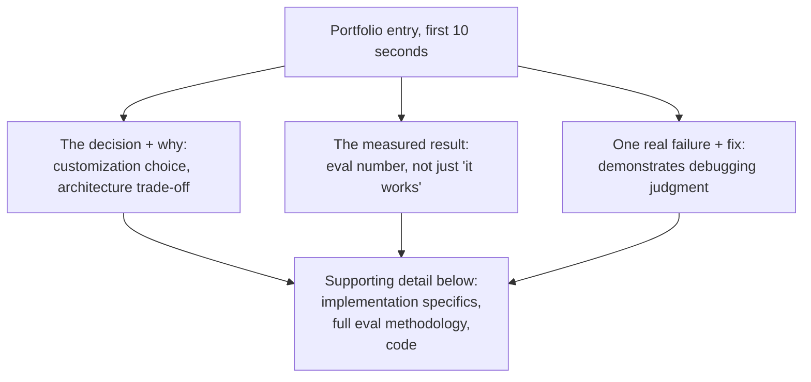

# Interviews and Portfolio

This is the last chapter of the curriculum, and it's a deliberately different kind of chapter: everything from [fnd-01](../01-foundations/fnd-01-what-is-an-llm.md) through [fro-03](fro-03-edge-on-device.md) built technical depth; this one is about *converting* that depth into something legible to someone who has thirty minutes to evaluate you, or a portfolio page they'll skim for two minutes before deciding whether to read further. The skill here isn't new knowledge — it's translation, and it matters because a candidate who deeply understands, say, [prd-02](../06-production/prd-02-inference-and-serving.md)'s continuous batching but can't explain *why it matters for the specific system being discussed* in an interview will lose to a candidate with a shallower understanding who can tell a clear, well-structured story. Depth without translation doesn't show up as a hire.

## Intuition: interviews test judgment under compression, not knowledge under no constraint

Every chapter in this curriculum had room for nuance — caveats, edge cases, "it depends" answers developed across a full page. **An interview gives you a fraction of that space and time**, and the skill being evaluated isn't whether you know the nuance, it's whether you can compress it correctly: state the core trade-off, name the one or two factors that actually decide it for the situation at hand, and stop — without either oversimplifying into a confidently wrong absolute ("always use RAG") or refusing to commit to an answer at all ("it depends on many factors" with no further specificity). **This compression skill is exactly what separates someone who has internalized the material from someone who has memorized it**: internalized understanding compresses cleanly under pressure because you actually know which details matter for a given context; memorized understanding either stays uncompressed (a rambling, unfocused answer) or breaks under compression (a wrong oversimplification), because the memorizer never built the judgment about which details to drop.

## What AI engineering interviews specifically probe for

**System design questions, LLM-flavored.** A general software system design question asks you to design a scalable web service; an AI engineering version asks you to design a RAG pipeline, an agent system, or a production LLM feature end to end — and the evaluation criteria track this curriculum's structure closely: did you address the customization decision ([ftn-01](../08-fine-tuning/ftn-01-customization-decision.md)) before jumping to a solution, did you reason about the quality-latency-cost triangle ([prd-01](../06-production/prd-01-architecture-patterns.md)) rather than optimizing one axis blindly, did you mention evaluation ([evl-01](../05-evaluation/evl-01-eval-fundamentals.md)) as part of the design rather than an afterthought, did you consider failure modes and guardrails ([prd-04](../06-production/prd-04-reliability.md), [sec-02](../07-safety-security/sec-02-guardrails.md)) rather than only the happy path.

**Trade-off articulation, tested directly.** A common interview pattern presents two options (fine-tuning versus RAG, a bigger model versus a routing cascade, synchronous versus streaming) and asks you to choose — and the actual evaluation target isn't which option you pick, it's whether you can name the *specific factors* that would flip the decision, demonstrating the same conditional reasoning this curriculum's chapters modeled throughout ("X is usually right, except when Y, because Z") rather than a static, memorized preference.

**Debugging and failure-mode reasoning.** Given a described production symptom (rising latency, degrading quality, a cost spike), can you generate the right diagnostic questions and hypotheses — directly testing the failure-mode-and-fix pattern this curriculum's chapters built explicitly into every "Failure modes and trade-offs" section, because that reasoning pattern is precisely what production debugging requires.

**Depth-check follow-ups.** A candidate who states "we'd use RAG for this" gets a follow-up: how would you chunk the documents, how would you evaluate retrieval quality, what happens if the retrieved context is wrong — probing whether the initial answer reflected genuine understanding of [rag-04](../03-retrieval/rag-04-chunking-strategies.md) through [rag-06](../03-retrieval/rag-06-rag-evaluation.md)'s actual mechanics or a surface-level pattern match to a term.

## Turning a capstone project into a portfolio artifact

**Every mini-project and capstone extension across this curriculum's 61 chapters was pointed at the same underlying goal**: by the time you reach this chapter, you should have a body of concrete, working artifacts — a RAG pipeline with a measured evaluation suite, a fine-tuned model with a documented checkpoint-selection process, a guardrail stack with a measured catch rate — not just conceptual familiarity with the topics. **The portfolio task is presenting that body of work so its rigor is visible in under two minutes of skimming.**

**Lead with the decision, not the implementation.** A portfolio write-up that opens with "I built a RAG system using [specific vector database] and [specific framework]" buries the signal; one that opens with "the task needed current, frequently-changing knowledge rather than a fixed behavior pattern, so I chose RAG over fine-tuning, validated with [specific eval result]" demonstrates the [ftn-01](../08-fine-tuning/ftn-01-customization-decision.md)-style judgment an evaluator is actually looking for, with the implementation details following as support rather than as the headline.

**Show the eval, not just the demo.** A working demo shows the system functions; a measured eval suite (per [evl-02](../05-evaluation/evl-02-eval-datasets.md)) with a specific number and a specific baseline comparison shows you know whether it's actually *good*, and that distinction — building something that runs versus building something you've measured — is exactly what separates a portfolio project that reads as a tutorial-following exercise from one that reads as engineering judgment.

**Document one real failure and its fix.** Every chapter in this curriculum built a "Real-world examples" section around a failure diagnosed and fixed, because that's a more convincing demonstration of understanding than a description of what worked on the first try — a portfolio project that includes "the first retrieval approach returned irrelevant chunks because of X; switching to Y fixed it, measured by Z" demonstrates the debugging and failure-mode reasoning interviews specifically probe for, directly and concretely.

*What a skimmed portfolio entry should surface in the first ten seconds versus what supports it below:*

## Beyond memorized answers: demonstrating judgment live

**The failure mode interviewers see constantly**: a candidate who has clearly read the right material recites a correct-sounding answer that doesn't actually connect to the specific scenario asked about — the RAG-versus-fine-tuning framework stated in the abstract, without ever touching the specific knowledge-versus-behavior diagnostic from [ftn-01](../08-fine-tuning/ftn-01-customization-decision.md) applied to *this* interviewer's specific example. **The fix is a habit, not a fact to memorize**: when answering a scenario question, explicitly name which specific factor in *this* scenario drives your answer, not just which general framework applies — "this needs RAG specifically because the knowledge changes weekly, which a fine-tuned model couldn't track without retraining" is a materially stronger answer than "this needs RAG because it's a knowledge problem," even though both invoke the same correct framework, because the first demonstrates the framework was actually *applied* to the specifics rather than pattern-matched from a keyword.

**Practicing this is different from re-reading chapters.** Re-reading builds recognition; articulating a scenario-specific answer out loud, under time pressure, against a novel scenario you haven't seen before, builds the compression skill interviews actually test. The mini-projects across this curriculum's chapters are the raw material for this practice — each one is a scenario you've already lived through and can speak to concretely, which is a stronger interview answer than a hypothetical scenario reasoned through for the first time in the interview itself.

## Production engineering perspective

- **Prepare scenario-specific articulation, not framework recitation** — practice naming the specific factor that drives a decision for a given scenario, not just which general framework applies.
- **Build your portfolio around measured results and real failures**, not just working demos — an eval number and a documented fix are stronger signal than a functioning system alone.
- **Lead portfolio write-ups with the decision and its justification**, with implementation detail supporting rather than opening the narrative.
- **Rehearse system design answers against this curriculum's actual structure** — customization decision, quality/latency/cost triangle, evaluation, failure modes — since that structure mirrors what interviewers are checking for.
- **Use your own mini-projects as practice scenarios** — you have lived, concrete experience to draw on rather than reasoning through a hypothetical for the first time under interview pressure.
- **Treat "it depends" as an incomplete answer, not a valid one**, in interview settings specifically — always follow it with the specific factor that resolves the dependency for the case at hand.

## Historical evolution

**2021–2022:** AI/ML engineering interviews largely inherit general software system design and ML fundamentals formats, with limited LLM-specific content since production LLM engineering as a distinct discipline barely existed yet. **2023:** as production LLM roles proliferate, interview formats begin incorporating LLM-specific system design scenarios — RAG pipeline design, prompt engineering evaluation, agent architecture — though often inconsistently across companies, reflecting the field's own rapid concurrent formation. **2023–2024:** practitioner-written system design resources[^chip-mlsysdesign][^eugeneyan-patterns] become widely referenced both by candidates preparing and by interviewers designing questions, converging the field toward a more consistent, recognizable set of LLM system design evaluation criteria — largely the same criteria (customization decision, trade-off reasoning, evaluation-mindedness, failure-mode awareness) this chapter organizes around. **2024–present:** as the discipline matures further, interviews increasingly probe for judgment and trade-off articulation specifically, rather than just terminology recognition, reflecting the field's broader shift (traced throughout this curriculum, particularly in Modules 5 through 8) from "can you use an LLM API" to "can you engineer a production system responsibly around one" — the same maturation this entire curriculum has tracked, now reflected in how the field evaluates its practitioners.

## Common misconceptions

- **"Knowing more chapters deeply guarantees a strong interview performance."** Depth without the compression and articulation skill this chapter describes doesn't reliably show up as a strong answer — translation is a distinct, practiced skill, not a free byproduct of knowledge.
- **"A working demo is sufficient portfolio evidence."** A demo shows the system runs; a measured eval result and a documented failure-and-fix show you can judge whether it's actually good and can debug it — a categorically stronger signal.
- **"'It depends' is an acceptable interview answer on its own."** It's true but incomplete — the differentiating answer names the specific factor that resolves the dependency for the scenario at hand.
- **"System design interviews are testing whether you know the right framework."** They're testing whether you can apply the right framework to the specific scenario's specific details, which is a different and harder skill than framework recognition.
- **"Interview preparation is separate from the technical work in this curriculum."** The mini-projects across all 61 chapters are the direct raw material for interview preparation — lived, concrete experience is stronger interview material than hypothetical reasoning practiced for the first time under pressure.

## Failure modes and trade-offs

- **Framework recitation without scenario-specific application** — a correct-sounding answer that doesn't actually engage with the specific details of the question asked. *Fix:* explicitly name the specific factor driving the answer for this scenario, not just the general framework.
- **Portfolio entries that lead with implementation instead of decision** — burying the judgment signal an evaluator is actually looking for under technical detail that comes later or not at all. *Fix:* lead with the decision and its justification, implementation as supporting detail.
- **Demos without measured evaluation** — a working system with no eval result leaves the evaluator unable to judge whether it's actually good, only that it runs. *Fix:* attach a specific, measured result to every portfolio project.
- **Treating "it depends" as a complete answer under interview pressure** — technically true, but reads as evasion or incomplete understanding without the resolving factor named. *Fix:* practice the habit of always following "it depends" with the specific deciding factor.
- **The central trade-off:** breadth versus depth of preparation. Reviewing all 61 chapters lightly before an interview builds broad recognition but weak articulation; deeply rehearsing a smaller number of your own concrete mini-project experiences builds strong, specific articulation at the cost of narrower coverage — the resolution favors depth on a well-chosen subset over shallow breadth, since interviews reward demonstrated judgment more than topic coverage.

## Best practices

- Practice scenario-specific articulation explicitly, not just framework review — state the specific deciding factor for a given scenario, every time.
- Build portfolio entries around a decision-first narrative: the choice made, why, and the measured result, with implementation detail supporting rather than opening.
- Attach a specific, measured eval result to every portfolio project, not just a working demo.
- Document at least one real failure and its fix per portfolio project — it's a stronger judgment signal than a clean success story.
- Rehearse system design answers using this curriculum's actual structure (customization decision, quality/latency/cost triangle, evaluation, failure modes) as a mental checklist.
- Use your own mini-projects as interview practice scenarios — concrete lived experience beats hypothetical reasoning under pressure.
- Never leave "it depends" as a final answer — always resolve it to the specific factor that would flip the decision.

## Real-world examples

**The recited answer that didn't land.** A candidate, asked to design a customer support system, correctly states "I'd use RAG for the knowledge base and fine-tuning for consistent formatting" — technically correct, per [ftn-01](../08-fine-tuning/ftn-01-customization-decision.md)'s framework, but delivered without connecting it to any specific detail of the scenario the interviewer described. A follow-up question ("why not fine-tune on the knowledge base directly?") exposes that the candidate can restate the framework but hasn't internalized the reasoning behind it — a stronger answer would have proactively named that the support content updates weekly, which a fine-tuned model can't track without retraining, closing the gap before the follow-up was needed.

**The portfolio entry that led with the wrong thing.** A candidate's portfolio write-up for a RAG project opens with a detailed description of the vector database and embedding model chosen, three paragraphs in before any mention of what problem was being solved or how well it worked. A reviewer skimming portfolios for two minutes per candidate never reaches the (buried) eval results showing a measured improvement over a baseline. Restructuring the write-up to lead with the problem, the customization decision and its justification, and the headline eval number — pushing the vector-database specifics to a supporting "implementation" section further down — makes the same underlying work land in the first ten seconds of a skim instead of being missed entirely.

**The failure-and-fix that outperformed the clean success story.** Two candidates present similar RAG capstone projects; one describes a smooth, first-try success, the other describes an initial chunking strategy that produced poor retrieval precision, diagnosed against a small eval set, and a specific fix (adjusting chunk boundaries to respect document structure) that measurably improved the result. The second candidate's story, despite describing a "failure," reads as substantially stronger evidence of engineering judgment — because it demonstrates the actual debugging and iteration process a production system requires, which the first candidate's clean narrative gives no evidence of at all.

## Interview questions

*(This chapter's own set turns the lens back on the practice itself — questions about how to prepare and present, not a technical topic.)*

1. **"Design a customer support system using an LLM. Walk me through your approach."** — Model answer: I'd start with the customization decision — does the gap look like missing/changing knowledge (RAG) or inconsistent behavior/format (fine-tuning), and I'd ask what's actually failing today if this is replacing an existing system. I'd design for the quality-latency-cost triangle explicitly rather than only optimizing one axis, build in evaluation from the start rather than as an afterthought, and name the specific failure modes I'd guard against — hallucinated answers, prompt injection if it ingests external content, and a fallback path for when the system can't confidently answer. I'd want to know the actual volume and update frequency of the underlying knowledge before committing to a specific architecture, since that's the detail that resolves several of these decisions.

2. **"When would you choose fine-tuning over RAG, concretely — not the general rule, a specific example?"** — Model answer: a structured-extraction task where the model has all the information it needs in the input already, but keeps producing inconsistent output formatting despite a well-engineered prompt with examples — that's a behavior gap, not a knowledge gap, and RAG wouldn't touch it since there's no missing external information to retrieve. I'd first confirm the gap survives a long, detailed few-shot prompt (the long-prompt test) before committing to fine-tuning's higher cost and maintenance burden, but if it does, baking the format consistency into weights removes the need to pay for a long prompt on every call.

3. **"Tell me about a time a project you built didn't work initially. What did you do?"** — Model answer (framed generically, adaptable to your own project): I'd describe the specific symptom observed (not just "it didn't work" — a concrete measured shortfall), the diagnostic process (what I checked first and why, following the failure-mode reasoning pattern of narrowing from symptom to root cause), the specific fix, and the measured improvement after the fix — closing with what I'd do differently if starting over, since that reflects on the judgment gained, not just the immediate fix applied.

4. **"How do you decide if an LLM feature is ready to ship?"** — Model answer: a measured eval suite result against a defined quality bar, not just "it looks good in manual testing" — connecting to evl-01's evaluation-fundamentals framing that eval should gate deployment decisions, not just describe them after the fact. I'd also want guardrails in place for the known failure modes relevant to the feature, a rollback path if something goes wrong post-launch, and — if it touches user data — the privacy and compliance checks appropriate to what it handles. "Ready to ship" is a specific, checkable bar, not a feeling.

5. **"What's the biggest mistake you see teams make when building production LLM systems?"** — Model answer: treating the model call as the whole system instead of one component inside a larger engineering discipline — skipping evaluation until something breaks, skipping guardrails because the demo worked, or skipping the customization decision and reaching for fine-tuning or RAG by default rather than by diagnosis. The pattern across nearly every production LLM failure story is a missing piece of standard engineering discipline — measurement, monitoring, fallback design — that would be considered non-negotiable in any other production system, just not yet habitual for this one.

## Exercises and mini-project

**Exercises**

1. Take a scenario question ("design a code review assistant") and write two answers: one framework-only, one scenario-specific naming the deciding factor — compare their strength.
2. Rewrite the opening paragraph of one of your own project write-ups (real or from this curriculum's mini-projects) to lead with decision and measured result instead of implementation.
3. Draft a "failure and fix" narrative for a real mini-project from this curriculum, including the specific diagnostic step that identified the root cause.
4. Practice resolving "it depends" for three trade-off questions from this curriculum (fine-tuning vs. RAG, canary vs. blue-green, hosted vs. self-hosted fine-tuning) by naming the specific deciding factor for a scenario you construct.
5. Time yourself answering a system design question in five minutes, then review against this chapter's checklist (customization decision, triangle, evaluation, failure modes) for what you missed.

**Mini-project: assemble your portfolio and rehearse.** This is the curriculum's final project, and it consolidates rather than introduces new work: (a) select two to three of your strongest mini-projects from across this curriculum's 61 chapters; (b) rewrite each as a decision-first portfolio entry — problem, decision and justification, measured result, one documented failure and fix; (c) write out full answers to three system-design-style questions using your own projects as concrete grounding, not hypothetical scenarios; (d) practice delivering one of these answers out loud, timed, to another person or recorded, and review for framework-recitation versus scenario-specific articulation; (e) revise based on what the practice run revealed. Target: 4 hours. Success criterion: a portfolio entry and a rehearsed answer that name a specific, concrete deciding factor rather than a general framework — the compression skill this chapter is built around, demonstrated on your own real work.

**Capstone extension:** this chapter is the final synthesis point for the entire curriculum — draw on [ftn-01](../08-fine-tuning/ftn-01-customization-decision.md)'s decision framework, [prd-01](../06-production/prd-01-architecture-patterns.md)'s triangle, [evl-01](../05-evaluation/evl-01-eval-fundamentals.md)'s evaluation mindset, and [prd-04](../06-production/prd-04-reliability.md)'s failure-mode discipline as the checklist for both your portfolio and your interview preparation; [fro-04](fro-04-staying-current.md)'s staying-current system is what keeps this preparation from going stale after today.

## Revision summary

- Interviews test **judgment under compression** — the ability to state a core trade-off and the specific deciding factor concisely, not raw knowledge recall — and this compression skill is what separates internalized understanding from memorized recitation.
- AI engineering interviews specifically probe: **LLM-flavored system design** (following this curriculum's own structure — customization decision, triangle, evaluation, failure modes), **trade-off articulation** tested by scenario, **debugging/failure-mode reasoning**, and **depth-check follow-ups** that expose surface-level pattern matching.
- Portfolio projects should **lead with the decision and its justification**, show a **measured eval result** rather than just a working demo, and document **one real failure and its fix** — all three are stronger judgment signals than a clean, undocumented success.
- The practiced habit that separates strong from weak interview answers: always resolve **"it depends" to the specific factor** that decides it for the scenario at hand, rather than leaving the framework unapplied.
- Your own mini-projects across this curriculum are the **direct raw material** for both portfolio building and interview rehearsal — concrete lived experience is stronger than hypothetical reasoning practiced for the first time under pressure.

## Flashcards

| Q | A |
|---|---|
| What do interviews actually test, beyond knowledge? | Judgment under compression — stating the core trade-off and deciding factor concisely and correctly. |
| What separates internalized from memorized understanding under interview pressure? | Internalized understanding compresses cleanly (knows what to drop); memorized understanding either rambles or breaks into a wrong oversimplification. |
| What four things does an LLM system design answer need to cover? | The customization decision, the quality/latency/cost triangle, evaluation, and failure modes/guardrails. |
| What should a portfolio entry lead with? | The decision and its justification — not the implementation stack. |
| Why does a measured eval result beat a working demo alone? | It shows the system is actually good, not just that it runs. |
| Why is "it depends" an incomplete interview answer? | It's true but doesn't demonstrate the judgment to name the specific factor that resolves the dependency. |
| What's the best raw material for interview practice? | Your own mini-projects — concrete, lived experience beats hypothetical reasoning under pressure. |

## Further reading

- **Practitioner references:** Chip Huyen's ML systems design resource[^chip-mlsysdesign] and Eugene Yan's LLM patterns writeup[^eugeneyan-patterns] — widely-referenced, practically-oriented material that pairs well with this chapter's interview-preparation framing.
- **Tutorials:** run the mini-project's rehearsal step — timed, out loud, reviewed — before any real interview; reading this chapter builds recognition, only the rehearsal builds the compression skill it describes.

## Check your understanding

1. Explain why "judgment under compression" is a more accurate description of what interviews test than "knowledge," using your own words.
2. Rewrite a framework-only answer to a trade-off question into a scenario-specific one, naming the deciding factor explicitly.
3. Draft a decision-first portfolio entry opening for one of your own projects, and explain what it surfaces in the first ten seconds that an implementation-first opening wouldn't.
4. Explain why a documented failure-and-fix is stronger interview/portfolio evidence than a clean success story.
5. Practice resolving "it depends" for a trade-off of your choosing from this curriculum, naming the specific factor that would flip the decision.

## Sources

[^chip-mlsysdesign]: [T4] Huyen, C. "Machine Learning System Design." https://huyenchip.com/machine-learning-systems-design/toc.html (accessed 2026-07-28)
[^eugeneyan-patterns]: [T4] Yan, E. "Patterns for Building LLM-based Systems and Products." https://eugeneyan.com/writing/llm-patterns/ (accessed 2026-07-28)
