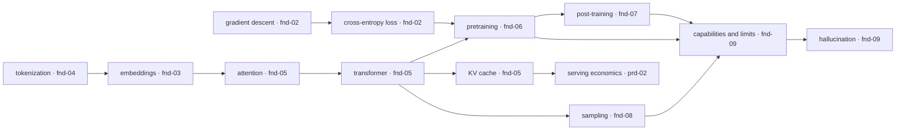
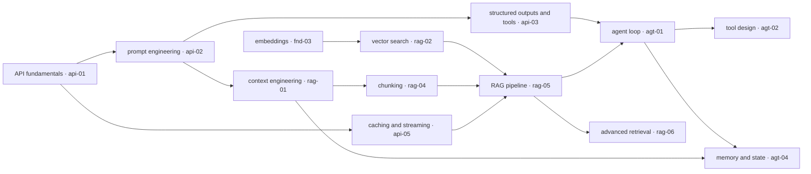
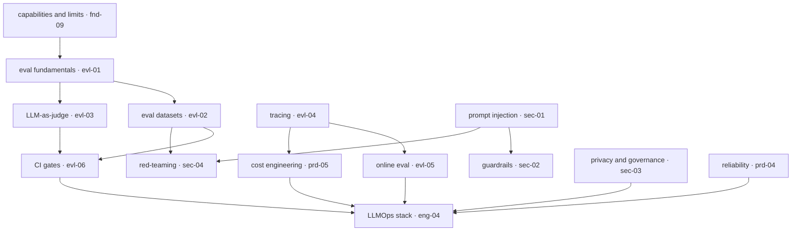

# Concept Knowledge Graph

Where [`curriculum/dependency-graph.md`](../curriculum/dependency-graph.md) shows *file* prerequisites, this shows *concept* relationships — how an idea in one module underwrites an idea in another. Split into three graphs (each under the 20-node limit, CONVENTIONS §4) joined by shared nodes: the **mechanism spine**, the **application layer**, and the **cross-cutting concerns**. Chapter IDs in brackets point to where each concept is developed. Use this to answer "why do I need to know X to understand Y."

## The mechanism spine

How the foundations compound into a working understanding of what a model can and cannot do. The through-line: everything an LLM does is downstream of a function fitted by gradient descent and read out by a sampler.

*Foundations concepts and the "capability" they build toward:*

Key readings: **tokenization → embeddings → attention** is the input path; **loss → pretraining → post-training** is how behavior is built; **KV cache** is the bridge from architecture to serving cost; **capabilities/limits** is the synthesis every application decision consults.

## The application layer

How consuming a model composes upward from a single API call to agents and retrieval systems. The through-line: each layer manages what the model *sees* (context) and what it can *do* (tools), because the model itself is fixed.

*From one API call to grounded, tool-using systems:*

Key readings: **structured outputs (api-03)** is the hinge — it turns text into typed calls, which is what makes both extraction pipelines and agents possible; **context engineering (rag-01)** underwrites both RAG and agent memory; **retrieval converts recall to transformation**, the reliability move that RAG and agents both lean on.

## Cross-cutting concerns

The disciplines that wrap every system above — evaluation, operations, cost, and security — and the concepts that feed them. The through-line: these are not a final module but a jacket worn by every layer, which is why the graph points *into* them from everywhere.

*Quality, operations, cost, and safety as cross-cutting jackets:*

Key readings: **evals (evl-01)** is the spine of quality and feeds CI, judges, and online monitoring alike; **prompt injection (sec-01)** is the root of the security branch because instructions and data share one channel; **the LLMOps stack (eng-04)** is where evaluation, cost, reliability, and governance converge into one operational system.

## The three highest-leverage nodes

For a reader deciding what to master first, the concepts with the most outgoing edges — learn these and the rest becomes legible:

1. **The transformer / KV cache (fnd-05)** — underwrites serving cost, context limits, caching, and long-context behavior. The single most explanatory foundation.
2. **Evaluation (evl-01)** — the discipline every quality claim, model choice, and deploy decision terminates in. Deliberately early in the dependency DAG for this reason.
3. **Context engineering (rag-01)** — the resource-management layer beneath RAG, agents, and memory alike.

## Related chapters

| Chapter | What it explains |
|---|---|
| [curriculum/dependency-graph.md](../curriculum/dependency-graph.md) | The file-level prerequisite DAG this complements |
| [tut-01 INDEX](INDEX.md) | The file-list view of the same corpus |
| [fnd-09](../modules/01-foundations/fnd-09-capabilities-and-limits.md) | The synthesis node where the mechanism spine terminates |

## Sources

(Compiled concept map — relationships drawn from the cited chapters; no external sources.)
