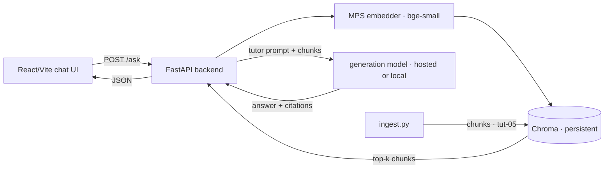

# Local Tutor App — Scaffold

A minimal, runnable-on-a-laptop RAG tutor over this repository. **Structure and run steps only** — this is a scaffold to build from, not a finished app. Design goals: runs on an **8GB M1 Air**, **native Python venv (no Docker)**, local retrieval (Chroma + a small MPS embedder), and a small React/Vite chat UI. It wires together the three tutor-layer specs: [chunking](../rag/chunking.md), [embedding-strategy](../rag/embedding-strategy.md), and the [tutor prompt](../prompts/tutor.md).

> **Volatile:** exact package versions and the embedder/generator model names shift; pin versions at build time and re-verify the embedder against a retrieval eval ([embedding-strategy](../rag/embedding-strategy.md)). The architecture and run flow are stable.

## Architecture

*Request flow from browser question to grounded, cited answer:*



Retrieval is fully local and offline. Generation is pluggable: a **hosted model** (recommended for answer quality — fnd-09) or a **local model via Ollama** (fully offline, ~3–4B at 4-bit fits in 8GB alongside Chroma — api-07).

## Directory structure

```text
tutor/tool/
  README.md              ← this file
  backend/
    app.py               ← FastAPI: /ask, /health, /reindex
    ingest.py            ← walk repo → chunk (tut-05) → embed → Chroma
    rag.py               ← retrieve + hybrid merge + assemble prompt
    config.py            ← paths, model names, top-k (env-overridable)
    requirements.txt
  frontend/
    index.html
    package.json
    vite.config.js
    src/
      App.jsx            ← chat UI: question box, streamed answer, citations
      api.js             ← fetch wrapper for /ask
  .chroma/               ← created at ingest (gitignored)
  .venv/                 ← native venv (gitignored)
```

## Key files (what each does)

- **`backend/ingest.py`** — walks `modules/`, `engineering/`, and `tutor/` (and `blueprints/` tagged `pending`), applies the [tut-05 chunker](../rag/chunking.md) (skip files <200 bytes → excludes the agt-01 stub; split on H2; drop `Check your understanding`/`Sources`; prepend the frontmatter context header), embeds `embed_text` with the MPS model, and upserts into Chroma with metadata (`id`, `h2_heading`, `status`, `volatility`, `chunk_type`, `source_path`). Idempotent: re-run on content change.
- **`backend/rag.py`** — embeds the query, retrieves top-20 from Chroma, runs a parallel lexical pass over `keywords`/`h2_heading` and merges by RRF (rag-06), applies `status`/`volatility` filters, assembles the top-6 into the [tutor prompt](../prompts/tutor.md) with placement discipline (rag-01), and returns prompt + citations.
- **`backend/app.py`** — FastAPI with `POST /ask` (`{question, learner_level}` → streamed answer + citations), `GET /health`, `POST /reindex`. Streams tokens via SSE (api-05) so the UI feels responsive.
- **`frontend/src/App.jsx`** — a single-page chat: question input, streamed answer render, and a citations list linking each cited `id § heading` back to the source file.

## requirements.txt (backend)

```text
fastapi
uvicorn[standard]
chromadb
sentence-transformers
torch                 # MPS build ships with recent macOS wheels
tiktoken
pyyaml
httpx                 # for the hosted generation call (or the ollama client)
```

## Run steps (8GB M1, no Docker)

```bash
# 1. Backend — native venv
cd tutor/tool/backend
python3 -m venv ../.venv && source ../.venv/bin/activate
pip install -r requirements.txt

# 2. Ingest the repo (one-time; re-run after content changes). ~seconds for this corpus.
python ingest.py            # builds ../.chroma

# 3. (Optional) fully-offline generation: install Ollama, pull a small model
#    ollama pull llama3.2:3b     # ~2GB at 4-bit; or skip and use a hosted API key
#    Set GEN_BACKEND=ollama in config, else export your provider key.

# 4. Start the API
uvicorn app:app --reload --port 8000

# 5. Frontend — separate terminal
cd tutor/tool/frontend
npm install
npm run dev                 # Vite dev server on :5173, proxies /ask to :8000
```

Open `http://localhost:5173`, ask a question, get a grounded answer with chapter citations.

## Memory budget (why it fits in 8GB)

| Component | Footprint |
|---|---|
| MPS embedder (bge-small class) | ~130 MB |
| Chroma + ~1,500 vectors | tens of MB |
| FastAPI + Python | ~150 MB |
| Vite dev server + browser | ~1–1.5 GB |
| *Optional* local 3–4B generator (4-bit, Ollama) | ~3 GB |

Local retrieval + **hosted** generation leaves multiple GB free. Add the local generator only if you want fully offline operation and can close other apps — the honest trade is retrieval-local, generation-hosted for quality (fnd-09, [embedding-strategy](../rag/embedding-strategy.md)).

## Correctness notes (don't skip)

- **Exclude the stub and pending chapters** at ingest (chunking §Ingestion filters) — otherwise the tutor retrieves empty/blueprint content and answers poorly.
- **Check `stop_reason` on the generation call** (api-01) — the tutor's own code should pass its own [code review](../prompts/code-reviewer.md).
- **Evaluate retrieval** with the ~30-question recall@5 set ([embedding-strategy](../rag/embedding-strategy.md)) before trusting answers — a tutor that retrieves the wrong section is worse than no tutor.
- **Re-ingest on content changes** — chunks are derived data; raw Markdown is the source of truth (eng-01).

## Related chapters

| Chapter | What it grounds |
|---|---|
| [tut-05 chunking](../rag/chunking.md) | The ingest step |
| [tut-06 embedding-strategy](../rag/embedding-strategy.md) | Embedder + store choice and retrieval config |
| [eng-01](../../engineering/eng-01-rag-pipeline-architecture.md) | The RAG architecture this instantiates |
| [api-05](../../modules/02-llm-apis/api-05-streaming-caching-batch.md) | Streaming the answer |
| [api-07](../../modules/02-llm-apis/api-07-local-inference.md) | The local-generation option |

## Sources

(Scaffold doc — tooling choices per the cited tutor-layer specs; no external sources.)
